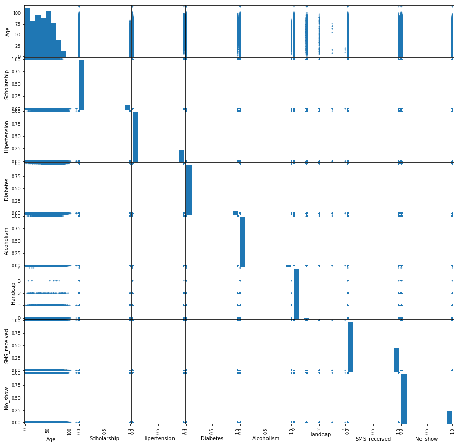
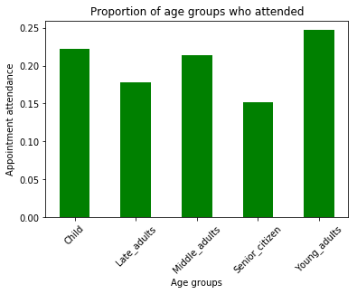
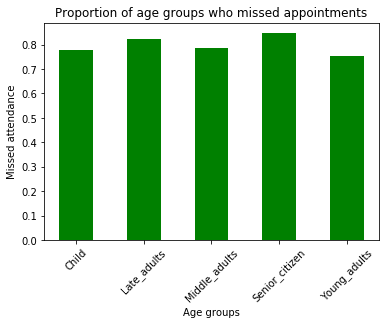
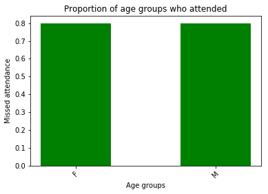
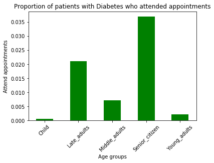
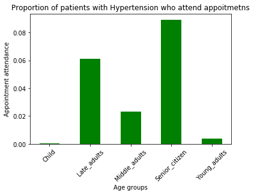

# Project: Appointment Bookings & Attendance

## Table of Contents
<ul>
<li><a href="#intro">Introduction</a></li>
<li><a href="#wrangling">Data Wrangling</a></li>
<li><a href="#eda">Exploratory Data Analysis</a></li>
<li><a href="#Report">Report</a></li>
</ul>

<a id='intro'></a>
## Introduction

### Dataset Description 
Objective: To gain insight into the kind of patients who are more or less likely to miss or attend their appointments.

This dataset consists of the medical appointments from 100k patients in Brazil. In this data it is clear that some of these patients show up for their appointments while others do not. Failing to show up for an appointment puts patients at risk as their condition may worsen over time. Therefore, there is a lot of interest around patients behavoir regarding appointments.This report is focused on gaining insights as to why some patients don't show up while others do.
The columns present and their significance are:

```
PatientId         : Patient idntification number
AppointmentID     : Patient appointment identification number
Gender            : Gender of patient
ScheduledDay      : Date and time of appointment
AppointmentDay    : Day of appointment
Age               : Age of patient
Neighbourhood     : Neighbourhood of patient
Scholarship       : Scholarship category of patient
Hipertension      : Hypertension status of patient
Diabetes          : Diabetes status of patient 
Alcoholism        : Alcoholic status of patient
Handcap           : Handicape level of patient
SMS_received      : Did the patient receive a SMS reminder
No-show           : Did the patient show up or not?
``` 


### Question(s) for Analysis
What factors are important for us to know in order to predict if a patient will show up for their scheduled appointment?
#### Question 1: Which age group misses the most appointments ?
#### Question 2: Which gender misses the most appointment?
#### Question 3: Which age group with Diabetes attends their appointment the most?
#### Question 4: Which age group with Diabetes attends their appointment the most?
#### Question 5: Which handicaped age group attends their appointment the most?
#### Question 6: Which age group battling alcoholism attends their appointment the most?


```python
%matplotlib inline
import pandas as pd, numpy as np, matplotlib.pyplot as plt, seaborn as sns

```

<a id='wrangling'></a>
## Data Wrangling
### General Properties


```python
# Load data and print out a few lines. Perform operations to inspect data
# types and look for instances of missing or possibly errant data.
```


```python
appointment = pd.read_csv('Database_No_show_appointments/noshowappointments-kagglev2-may-2016.csv',\
                          parse_dates=['ScheduledDay','AppointmentDay'])

```

**To begin, the data is loaded**


```python
appointment.head()
```

<div>
<table border="1" class="dataframe">
  <thead>
    <tr style="text-align: right;">
      <th></th>
      <th>PatientId</th>
      <th>AppointmentID</th>
      <th>Gender</th>
      <th>ScheduledDay</th>
      <th>AppointmentDay</th>
      <th>Age</th>
      <th>Neighbourhood</th>
      <th>Scholarship</th>
      <th>Hipertension</th>
      <th>Diabetes</th>
      <th>Alcoholism</th>
      <th>Handcap</th>
      <th>SMS_received</th>
      <th>No-show</th>
    </tr>
  </thead>
  <tbody>
    <tr>
      <th>0</th>
      <td>2.987250e+13</td>
      <td>5642903</td>
      <td>F</td>
      <td>2016-04-29 18:38:08</td>
      <td>2016-04-29</td>
      <td>62</td>
      <td>JARDIM DA PENHA</td>
      <td>0</td>
      <td>1</td>
      <td>0</td>
      <td>0</td>
      <td>0</td>
      <td>0</td>
      <td>No</td>
    </tr>
    <tr>
      <th>1</th>
      <td>5.589978e+14</td>
      <td>5642503</td>
      <td>M</td>
      <td>2016-04-29 16:08:27</td>
      <td>2016-04-29</td>
      <td>56</td>
      <td>JARDIM DA PENHA</td>
      <td>0</td>
      <td>0</td>
      <td>0</td>
      <td>0</td>
      <td>0</td>
      <td>0</td>
      <td>No</td>
    </tr>
    <tr>
      <th>2</th>
      <td>4.262962e+12</td>
      <td>5642549</td>
      <td>F</td>
      <td>2016-04-29 16:19:04</td>
      <td>2016-04-29</td>
      <td>62</td>
      <td>MATA DA PRAIA</td>
      <td>0</td>
      <td>0</td>
      <td>0</td>
      <td>0</td>
      <td>0</td>
      <td>0</td>
      <td>No</td>
    </tr>
    <tr>
      <th>3</th>
      <td>8.679512e+11</td>
      <td>5642828</td>
      <td>F</td>
      <td>2016-04-29 17:29:31</td>
      <td>2016-04-29</td>
      <td>8</td>
      <td>PONTAL DE CAMBURI</td>
      <td>0</td>
      <td>0</td>
      <td>0</td>
      <td>0</td>
      <td>0</td>
      <td>0</td>
      <td>No</td>
    </tr>
    <tr>
      <th>4</th>
      <td>8.841186e+12</td>
      <td>5642494</td>
      <td>F</td>
      <td>2016-04-29 16:07:23</td>
      <td>2016-04-29</td>
      <td>56</td>
      <td>JARDIM DA PENHA</td>
      <td>0</td>
      <td>1</td>
      <td>1</td>
      <td>0</td>
      <td>0</td>
      <td>0</td>
      <td>No</td>
    </tr>
  </tbody>
</table>
</div>


**The first 5 rows are printed for explore data**

```python
#Identify the number of cases and the number of features of these cases 
appointment.shape
```

    (110527, 14)


**The dimensions of the data is explored**


```python
#Identify the datatype of the features 
appointment.info()
```

    <class 'pandas.core.frame.DataFrame'>
    RangeIndex: 110527 entries, 0 to 110526
    Data columns (total 14 columns):
    PatientId         110527 non-null float64
    AppointmentID     110527 non-null int64
    Gender            110527 non-null object
    ScheduledDay      110527 non-null datetime64[ns]
    AppointmentDay    110527 non-null datetime64[ns]
    Age               110527 non-null int64
    Neighbourhood     110527 non-null object
    Scholarship       110527 non-null int64
    Hipertension      110527 non-null int64
    Diabetes          110527 non-null int64
    Alcoholism        110527 non-null int64
    Handcap           110527 non-null int64
    SMS_received      110527 non-null int64
    No-show           110527 non-null object
    dtypes: datetime64[ns](2), float64(1), int64(8), object(3)
    memory usage: 11.8+ MB


```python
#investigate the presence of missing values in each feature
appointment.isnull().sum()
```

    PatientId         0
    AppointmentID     0
    Gender            0
    ScheduledDay      0
    AppointmentDay    0
    Age               0
    Neighbourhood     0
    Scholarship       0
    Hipertension      0
    Diabetes          0
    Alcoholism        0
    Handcap           0
    SMS_received      0
    No-show           0
    dtype: int64

**Additionally, It is seen that the data has no missing values**

```python
#investigate the presence of duplicates 
appointment.duplicated().sum()
```
    0

**Investigate the presence of duplicates**

```python
appointment.columns
```

    Index(['PatientId', 'AppointmentID', 'Gender', 'ScheduledDay',
           'AppointmentDay', 'Age', 'Neighbourhood', 'Scholarship', 'Hipertension',
           'Diabetes', 'Alcoholism', 'Handcap', 'SMS_received', 'No-show'],
          dtype='object')

**The total columns are explored**

### Data Cleaning
 
```python

appointment.drop(['PatientId', 'AppointmentID'],axis=1,inplace=True)
```

**PatientID and appointmentID are droped because they are generic identifiers and do not have any relationship with appointment fulfillment** 


```python
appointment.describe()
```

<table border="1" class="dataframe">
  <thead>
    <tr style="text-align: right;">
      <th></th>
      <th>Age</th>
      <th>Scholarship</th>
      <th>Hipertension</th>
      <th>Diabetes</th>
      <th>Alcoholism</th>
      <th>Handcap</th>
      <th>SMS_received</th>
    </tr>
  </thead>
  <tbody>
    <tr>
      <th>count</th>
      <td>110527.000000</td>
      <td>110527.000000</td>
      <td>110527.000000</td>
      <td>110527.000000</td>
      <td>110527.000000</td>
      <td>110527.000000</td>
      <td>110527.000000</td>
    </tr>
    <tr>
      <th>mean</th>
      <td>37.088874</td>
      <td>0.098266</td>
      <td>0.197246</td>
      <td>0.071865</td>
      <td>0.030400</td>
      <td>0.022248</td>
      <td>0.321026</td>
    </tr>
    <tr>
      <th>std</th>
      <td>23.110205</td>
      <td>0.297675</td>
      <td>0.397921</td>
      <td>0.258265</td>
      <td>0.171686</td>
      <td>0.161543</td>
      <td>0.466873</td>
    </tr>
    <tr>
      <th>min</th>
      <td>-1.000000</td>
      <td>0.000000</td>
      <td>0.000000</td>
      <td>0.000000</td>
      <td>0.000000</td>
      <td>0.000000</td>
      <td>0.000000</td>
    </tr>
    <tr>
      <th>25%</th>
      <td>18.000000</td>
      <td>0.000000</td>
      <td>0.000000</td>
      <td>0.000000</td>
      <td>0.000000</td>
      <td>0.000000</td>
      <td>0.000000</td>
    </tr>
    <tr>
      <th>50%</th>
      <td>37.000000</td>
      <td>0.000000</td>
      <td>0.000000</td>
      <td>0.000000</td>
      <td>0.000000</td>
      <td>0.000000</td>
      <td>0.000000</td>
    </tr>
    <tr>
      <th>75%</th>
      <td>55.000000</td>
      <td>0.000000</td>
      <td>0.000000</td>
      <td>0.000000</td>
      <td>0.000000</td>
      <td>0.000000</td>
      <td>1.000000</td>
    </tr>
    <tr>
      <th>max</th>
      <td>115.000000</td>
      <td>1.000000</td>
      <td>1.000000</td>
      <td>1.000000</td>
      <td>1.000000</td>
      <td>4.000000</td>
      <td>1.000000</td>
    </tr>
  </tbody>
</table>
</div>

**The statistics of the data is explored to identify outliers. In this case there is a minimum age of -1, which is an outlier and is removed as there cannot be a negetive age.**

```python
index_drop = appointment.query('Age == Age.min()').index
index_drop
```

    Int64Index([99832], dtype='int64')

`The index of the outlier age is selected to be dropped` 

```python
appointment.drop(index=index_drop,inplace=True)
```

**The outlier age row is dropped**

```python
appointment.describe()
```

<div>
<table border="1" class="dataframe">
  <thead>
    <tr style="text-align: right;">
      <th></th>
      <th>Age</th>
      <th>Scholarship</th>
      <th>Hipertension</th>
      <th>Diabetes</th>
      <th>Alcoholism</th>
      <th>Handcap</th>
      <th>SMS_received</th>
    </tr>
  </thead>
  <tbody>
    <tr>
      <th>count</th>
      <td>110526.000000</td>
      <td>110526.000000</td>
      <td>110526.000000</td>
      <td>110526.000000</td>
      <td>110526.000000</td>
      <td>110526.000000</td>
      <td>110526.000000</td>
    </tr>
    <tr>
      <th>mean</th>
      <td>37.089219</td>
      <td>0.098266</td>
      <td>0.197248</td>
      <td>0.071865</td>
      <td>0.030400</td>
      <td>0.022248</td>
      <td>0.321029</td>
    </tr>
    <tr>
      <th>std</th>
      <td>23.110026</td>
      <td>0.297676</td>
      <td>0.397923</td>
      <td>0.258266</td>
      <td>0.171686</td>
      <td>0.161543</td>
      <td>0.466874</td>
    </tr>
    <tr>
      <th>min</th>
      <td>0.000000</td>
      <td>0.000000</td>
      <td>0.000000</td>
      <td>0.000000</td>
      <td>0.000000</td>
      <td>0.000000</td>
      <td>0.000000</td>
    </tr>
    <tr>
      <th>25%</th>
      <td>18.000000</td>
      <td>0.000000</td>
      <td>0.000000</td>
      <td>0.000000</td>
      <td>0.000000</td>
      <td>0.000000</td>
      <td>0.000000</td>
    </tr>
    <tr>
      <th>50%</th>
      <td>37.000000</td>
      <td>0.000000</td>
      <td>0.000000</td>
      <td>0.000000</td>
      <td>0.000000</td>
      <td>0.000000</td>
      <td>0.000000</td>
    </tr>
    <tr>
      <th>75%</th>
      <td>55.000000</td>
      <td>0.000000</td>
      <td>0.000000</td>
      <td>0.000000</td>
      <td>0.000000</td>
      <td>0.000000</td>
      <td>1.000000</td>
    </tr>
    <tr>
      <th>max</th>
      <td>115.000000</td>
      <td>1.000000</td>
      <td>1.000000</td>
      <td>1.000000</td>
      <td>1.000000</td>
      <td>4.000000</td>
      <td>1.000000</td>
    </tr>
  </tbody>
</table>
</div>

**The data is inspected finally for make sure outlier is dropped**

```python
appointment['No_show'] = [1 if x =='Yes' else 0 for x in appointment['No-show']]
```

**create a Series by converting No-show columns, which is the dependent variable, to numerical values and add it to the DataFrame**

```python
appointment.drop('No-show',axis=1,inplace=True)
```

**Drop the original No-show columns**

```python
appointment.head()
```

<div>
<table border="1" class="dataframe">
  <thead>
    <tr style="text-align: right;">
      <th></th>
      <th>Gender</th>
      <th>ScheduledDay</th>
      <th>AppointmentDay</th>
      <th>Age</th>
      <th>Neighbourhood</th>
      <th>Scholarship</th>
      <th>Hipertension</th>
      <th>Diabetes</th>
      <th>Alcoholism</th>
      <th>Handcap</th>
      <th>SMS_received</th>
      <th>No_show</th>
    </tr>
  </thead>
  <tbody>
    <tr>
      <th>0</th>
      <td>F</td>
      <td>2016-04-29 18:38:08</td>
      <td>2016-04-29</td>
      <td>62</td>
      <td>JARDIM DA PENHA</td>
      <td>0</td>
      <td>1</td>
      <td>0</td>
      <td>0</td>
      <td>0</td>
      <td>0</td>
      <td>0</td>
    </tr>
    <tr>
      <th>1</th>
      <td>M</td>
      <td>2016-04-29 16:08:27</td>
      <td>2016-04-29</td>
      <td>56</td>
      <td>JARDIM DA PENHA</td>
      <td>0</td>
      <td>0</td>
      <td>0</td>
      <td>0</td>
      <td>0</td>
      <td>0</td>
      <td>0</td>
    </tr>
    <tr>
      <th>2</th>
      <td>F</td>
      <td>2016-04-29 16:19:04</td>
      <td>2016-04-29</td>
      <td>62</td>
      <td>MATA DA PRAIA</td>
      <td>0</td>
      <td>0</td>
      <td>0</td>
      <td>0</td>
      <td>0</td>
      <td>0</td>
      <td>0</td>
    </tr>
    <tr>
      <th>3</th>
      <td>F</td>
      <td>2016-04-29 17:29:31</td>
      <td>2016-04-29</td>
      <td>8</td>
      <td>PONTAL DE CAMBURI</td>
      <td>0</td>
      <td>0</td>
      <td>0</td>
      <td>0</td>
      <td>0</td>
      <td>0</td>
      <td>0</td>
    </tr>
    <tr>
      <th>4</th>
      <td>F</td>
      <td>2016-04-29 16:07:23</td>
      <td>2016-04-29</td>
      <td>56</td>
      <td>JARDIM DA PENHA</td>
      <td>0</td>
      <td>1</td>
      <td>1</td>
      <td>0</td>
      <td>0</td>
      <td>0</td>
      <td>0</td>
    </tr>
  </tbody>
</table>
</div>

**Inspect DataFrame to confirm changes**

<a id='eda'></a>
## Exploratory Data Analysis

```python
def plot_scatter(df):
    pd.plotting.scatter_matrix(df,figsize=(15,15));

plot_scatter(appointment)
```
  

    
**A scatter matrix is plotted with the dataframe to investigate any possible relationship/ trend among the data features.**

**It is seen that `Age` has significant relationship with `hypertension`, `diabetes`, `alcoholism`, `hadcap` and `No_show`.**

**Thus the analysis begins by ivestigating age.**

```python
appointment.corr()
```

<div>
<table border="1" class="dataframe">
  <thead>
    <tr style="text-align: right;">
      <th></th>
      <th>Age</th>
      <th>Scholarship</th>
      <th>Hipertension</th>
      <th>Diabetes</th>
      <th>Alcoholism</th>
      <th>Handcap</th>
      <th>SMS_received</th>
      <th>No_show</th>
    </tr>
  </thead>
  <tbody>
    <tr>
      <th>Age</th>
      <td>1.000000</td>
      <td>-0.092463</td>
      <td>0.504586</td>
      <td>0.292391</td>
      <td>0.095810</td>
      <td>0.078032</td>
      <td>0.012633</td>
      <td>-0.060327</td>
    </tr>
    <tr>
      <th>Scholarship</th>
      <td>-0.092463</td>
      <td>1.000000</td>
      <td>-0.019730</td>
      <td>-0.024894</td>
      <td>0.035022</td>
      <td>-0.008587</td>
      <td>0.001192</td>
      <td>0.029134</td>
    </tr>
    <tr>
      <th>Hipertension</th>
      <td>0.504586</td>
      <td>-0.019730</td>
      <td>1.000000</td>
      <td>0.433085</td>
      <td>0.087970</td>
      <td>0.080083</td>
      <td>-0.006270</td>
      <td>-0.035704</td>
    </tr>
    <tr>
      <th>Diabetes</th>
      <td>0.292391</td>
      <td>-0.024894</td>
      <td>0.433085</td>
      <td>1.000000</td>
      <td>0.018473</td>
      <td>0.057530</td>
      <td>-0.014552</td>
      <td>-0.015181</td>
    </tr>
    <tr>
      <th>Alcoholism</th>
      <td>0.095810</td>
      <td>0.035022</td>
      <td>0.087970</td>
      <td>0.018473</td>
      <td>1.000000</td>
      <td>0.004647</td>
      <td>-0.026149</td>
      <td>-0.000197</td>
    </tr>
    <tr>
      <th>Handcap</th>
      <td>0.078032</td>
      <td>-0.008587</td>
      <td>0.080083</td>
      <td>0.057530</td>
      <td>0.004647</td>
      <td>1.000000</td>
      <td>-0.024162</td>
      <td>-0.006077</td>
    </tr>
    <tr>
      <th>SMS_received</th>
      <td>0.012633</td>
      <td>0.001192</td>
      <td>-0.006270</td>
      <td>-0.014552</td>
      <td>-0.026149</td>
      <td>-0.024162</td>
      <td>1.000000</td>
      <td>0.126428</td>
    </tr>
    <tr>
      <th>No_show</th>
      <td>-0.060327</td>
      <td>0.029134</td>
      <td>-0.035704</td>
      <td>-0.015181</td>
      <td>-0.000197</td>
      <td>-0.006077</td>
      <td>0.126428</td>
      <td>1.000000</td>
    </tr>
  </tbody>
</table>
</div>

**Also, the correlation statistic between the features are investigated.**

**It is seen that Age, Hipertension, Diabetes,Alcoholism	have negative correnation with 'No_show'.**

```python
bin_edges = [0,16,30,45,60,115]
bin_names = ['Child','Young_adults','Middle_adults','Late_adults','Senior_citizen']
appointment['age_groups'] = pd.cut(appointment['Age'],bin_edges,labels=bin_names)
```

**The age feature is binned into age-groups to create clear distinction**

| Age range     | Age group  | 
| ------------- |:-------------:|
| 0 - 16        | Child         | 
| 16- 30        | Young_adults  |   
| 30- 45        | Middle_adults |
| 45- 60        | Late_adults   |
| 60-115        | Senior_citizens|

### Research Question 1 : Which age group attended appointments the most ?

```python
appointment.head(5)
```

<div>
<table border="1" class="dataframe">
  <thead>
    <tr style="text-align: right;">
      <th></th>
      <th>Gender</th>
      <th>ScheduledDay</th>
      <th>AppointmentDay</th>
      <th>Age</th>
      <th>Neighbourhood</th>
      <th>Scholarship</th>
      <th>Hipertension</th>
      <th>Diabetes</th>
      <th>Alcoholism</th>
      <th>Handcap</th>
      <th>SMS_received</th>
      <th>No_show</th>
      <th>age_groups</th>
    </tr>
  </thead>
  <tbody>
    <tr>
      <th>0</th>
      <td>F</td>
      <td>2016-04-29 18:38:08</td>
      <td>2016-04-29</td>
      <td>62</td>
      <td>JARDIM DA PENHA</td>
      <td>0</td>
      <td>1</td>
      <td>0</td>
      <td>0</td>
      <td>0</td>
      <td>0</td>
      <td>0</td>
      <td>Senior_citizen</td>
    </tr>
    <tr>
      <th>1</th>
      <td>M</td>
      <td>2016-04-29 16:08:27</td>
      <td>2016-04-29</td>
      <td>56</td>
      <td>JARDIM DA PENHA</td>
      <td>0</td>
      <td>0</td>
      <td>0</td>
      <td>0</td>
      <td>0</td>
      <td>0</td>
      <td>0</td>
      <td>Late_adults</td>
    </tr>
    <tr>
      <th>2</th>
      <td>F</td>
      <td>2016-04-29 16:19:04</td>
      <td>2016-04-29</td>
      <td>62</td>
      <td>MATA DA PRAIA</td>
      <td>0</td>
      <td>0</td>
      <td>0</td>
      <td>0</td>
      <td>0</td>
      <td>0</td>
      <td>0</td>
      <td>Senior_citizen</td>
    </tr>
    <tr>
      <th>3</th>
      <td>F</td>
      <td>2016-04-29 17:29:31</td>
      <td>2016-04-29</td>
      <td>8</td>
      <td>PONTAL DE CAMBURI</td>
      <td>0</td>
      <td>0</td>
      <td>0</td>
      <td>0</td>
      <td>0</td>
      <td>0</td>
      <td>0</td>
      <td>Child</td>
    </tr>
    <tr>
      <th>4</th>
      <td>F</td>
      <td>2016-04-29 16:07:23</td>
      <td>2016-04-29</td>
      <td>56</td>
      <td>JARDIM DA PENHA</td>
      <td>0</td>
      <td>1</td>
      <td>1</td>
      <td>0</td>
      <td>0</td>
      <td>0</td>
      <td>0</td>
      <td>Late_adults</td>
    </tr>
  </tbody>
</table>
</div>

```python
attended_distribution = appointment.query("No_show==1").groupby('age_groups')['No_show'].count()
attended_distribution
```

    age_groups
    Child             4962
    Young_adults      4889
    Middle_adults     4692
    Late_adults       4131
    Senior_citizen    3006
    Name: No_show, dtype: int64

**Get the distribution of age groups who attended their appointment**

```python
total_distribution = appointment.groupby('age_groups')['No_show'].count()
total_distribution
```

    age_groups
    Child             22331
    Young_adults      19761
    Middle_adults     21954
    Late_adults       23179
    Senior_citizen    19762
    Name: No_show, dtype: int64

**Get the distribution of total appointment scheduled by age groups**

```python
proportional_distribution = (attended_distribution/total_distribution)
```

**Get the proportion of patients who attended appointment to the total appointment schedule**

```python
attend_index = proportional_distribution.index.categories.tolist()
attend_index
```

    ['Child', 'Young_adults', 'Middle_adults', 'Late_adults', 'Senior_citizen']

**Get the index of the Series, which is a list of age groups**

```python
attend_values = proportional_distribution.values
attend_values
```

    array([ 0.22220232,  0.24740651,  0.2137196 ,  0.17822167,  0.15211011])

**Get the values**

```python
def plot(index,values,ylabel,xlabel,title):
    plt.bar(index,values,color='g',width=0.5);
    plt.xticks(rotation=45);
    plt.ylabel(ylabel);
    plt.xlabel(xlabel);
    plt.title(title);
```

```python
ylabel = 'Appointment attendance'
xlabel = 'Age groups'
title  = 'Proportion of age groups who attended'

plot(attend_index,attend_values,ylabel,xlabel,title)   
```


    
**Bar chart showing the proportionate number of patients who attended their appointment according to their age groups**

#### Discussion
 Therefore, young adults attend appointments most followed by children and senior adults attend appointments the least.

### Research Question 2: Which age group missed the most appointments?

```python
missed_distribution = appointment.query("No_show==0").groupby('age_groups')['No_show'].count()
missed_distribution
```

    age_groups
    Child             17369
    Young_adults      14872
    Middle_adults     17262
    Late_adults       19048
    Senior_citizen    16756
    Name: No_show, dtype: int64

**Get the distribution of age groups who missed their appointment**

```python
total_distribution = appointment.groupby('age_groups')['No_show'].count()
total_distribution
```

    age_groups
    Child             22331
    Young_adults      19761
    Middle_adults     21954
    Late_adults       23179
    Senior_citizen    19762
    Name: No_show, dtype: int64

**Get the distribution of total appointment scheduled by age groups**

```python
missed_proportional_distribution = (missed_distribution/total_distribution)
missed_proportional_distribution
```

    age_groups
    Child             0.777798
    Young_adults      0.752593
    Middle_adults     0.786280
    Late_adults       0.821778
    Senior_citizen    0.847890
    Name: No_show, dtype: float64

**Get the proportion of patients who missed appointment to the total appointment schedule**

```python
missed_index = missed_proportional_distribution.index.categories.tolist()
missed_index
```

    ['Child', 'Young_adults', 'Middle_adults', 'Late_adults', 'Senior_citizen']

**Get the index of the Series, which is a list of age groups**

```python
missed_values = missed_proportional_distribution.values
missed_values
```

    array([ 0.77779768,  0.75259349,  0.7862804 ,  0.82177833,  0.84788989])

**Get the values**

```python
ylabel ='Missed attendance'
xlabel = 'Age groups'
title  = 'Proportion of age groups who missed appointments'
plot(missed_index,missed_values,ylabel,xlabel,title) 
```


    
**Bar chart showing the proportionate number of patients who missed their appointment according to their age groups**
#### Discussion
 Therefore, opposite to the prior results, young adults missed their appointments the least. On the contrary, senior adults miss their  appointments the most.

# Research Question 3: Which gender missed the most appointments?

```python
gender_missed_distribution = appointment.query('No_show==0').groupby('Gender')['No_show'].count()
gender_missed_distribution
```

    Gender  
    F    57245
    M    30962
    Name: No_show, dtype: int64

**Get the gender distribution of pateints who missed their appointment**

```python
total_gender_distribution = appointment.groupby('Gender')['No_show'].count()
total_gender_distribution
```

    Gender
    F    71839
    M    38687          
    Name: No_show, dtype: int64

**Get the gender distribution of total appointment scheduled**

```python
proportion = (gender_missed_distribution/total_gender_distribution)
proportion
```

    Gender
    F    0.796851
    M    0.800321
    Name: No_show, dtype: float64

**Get the proportion of patients who missed appointment to the total appointment schedule grouped by gender**

```python
gender_index = proportion.index.tolist()
gender_index
```

    ['F', 'M']

```python
gender_values = proportion.values
gender_values
```

    array([ 0.79685129,  0.80032052])

```python
ylabel = 'Missed attendance'
xlabel = 'Age groups'
title  = 'Proportion of age groups who attended'
    
plot(gender_index,gender_values,ylabel,xlabel,title) 
```
 

    
**Bar chart showing the proportionate number of patients who missed their appointment according to gender**
#### Discussion
 It is evident that both genders equally miss their appointment at almost the same proportions. Therefore, gender alone is not a good indicator of whether a patient will miss an appointment or not.

# Question 4: Which age group with Diabetes attends their appointment the most?


```python
with_diabetes = appointment.query('No_show==1').groupby(['age_groups','Diabetes'])['No_show'].count()

with_diabetes_attened = with_diabetes[[1,3,5,7,9]]
with_diabetes_attened
```

    age_groups      Diabetes
    Child           1            12
    Young_adults    1            42
    Middle_adults   1           157
    Late_adults     1           489
    Senior_citizen  1           730
    Name: No_show, dtype: int64

**Distribution of patients with diabetes by age groups**

```python
entire_appointments = appointment.groupby(['age_groups'])['No_show'].count()
entire_appointments
```

    age_groups
    Child             22331
    Young_adults      19761
    Middle_adults     21954
    Late_adults       23179
    Senior_citizen    19762
    Name: No_show, dtype: int64

**Entire patients population that scheduled appointments, including those with and without diabetes**

```python
ratio = with_diabetes_attened/entire_appointments
ratio_index = ratio.index.levels[0].tolist()
ratio_values = ratio.values
```

```python
ylabel = 'Attend appointments'
xlabel = 'Age groups'
title = 'Proportion of patients with Diabetes who attended appointments'
plot(ratio_index,ratio_values,ylabel,xlabel,title) 
```


    
**Bar chart showing the proportionate number of patients with diabetes who attend their appointment according to age groups**
#### Discussion

 It is evident that senior citizens with diabetes attend appointments the most followed by late adults, with children who have diabetes attending appointments the least. Thus, if a patient is a senior citizen and is diabetic, they are most likely to attend appointments.

# Question 5: Which age group with hypertension attends their appointment the most?

```python
with_hypertension = appointment.query('No_show==1').groupby(['age_groups','Hipertension'])['No_show'].count()

with_hypertension_attended = with_hypertension[[1,3,5,7,9]]
with_hypertension_attended
```

    age_groups      Hipertension
    Child           1                  9
    Young_adults    1                 74
    Middle_adults   1                510
    Late_adults     1               1418
    Senior_citizen  1               1761
    Name: No_show, dtype: int64

```python
total_ages = appointment.groupby(['age_groups'])['No_show'].count()
total_ages
```

    age_groups
    Child             22331
    Young_adults      19761
    Middle_adults     21954
    Late_adults       23179
    Senior_citizen    19762
    Name: No_show, dtype: int64


```python
hyper_ratio = with_hypertension_attended/total_ages
hyper_ratio_index = hyper_ratio.index.levels[0].tolist()
hyper_ratio_values = hyper_ratio.values
```


```python
ylabel = 'Appointment attendance'
xlabel = 'Age groups'
title  = 'Proportion of patients with Hypertension who attend appoitmetns'

plot(hyper_ratio_index,hyper_ratio_values,ylabel,xlabel,title) 
```
    

    
**Bar chart showing the proportionate number of patients with hypertension who attend their appointment according to age groups**

#### Discussion
Similar to the previous question, it is evident that senior citizens with hypertension attend appointments the most followed by late adults, with children who have the disease attending appointments the least. Thus, if a patient is a senior citizen or a late adult with hypertension, they are most likely to attend appointments.

# Question 6: Which age group battling alcoholism attends their appointment the most?

```python
with_alcoholism = appointment.query('No_show==1').groupby(['age_groups','Alcoholism'])['No_show'].count()

with_alcoholism_attended = with_alcoholism[[1,3,5,7,9]]
with_alcoholism_attended
```

    age_groups      Alcoholism
    Child           1              11
    Young_adults    1              81
    Middle_adults   1             204
    Late_adults     1             285
    Senior_citizen  1              96
    Name: No_show, dtype: int64

```python
total_ages = appointment.groupby(['age_groups'])['No_show'].count()

total_ages
```

    age_groups
    Child             22331
    Young_adults      19761
    Middle_adults     21954
    Late_adults       23179
    Senior_citizen    19762
    Name: No_show, dtype: int64

```python
alcoholism_ratio = with_alcoholism_attended/total_ages
alcoholism_ratio_index = alcoholism_ratio.index.levels[0].tolist()
alcoholism_ratio_values = alcoholism_ratio.values
```

```python

ylabel = 'Attend appointments'
xlabel = 'Age groups'
title  = 'Proportion of alcoholic patients who attended appointments'

plot(alcoholism_ratio_index,alcoholism_ratio_values,ylabel,xlabel,title) 
```  


**`Bar chart showing the proportionate number of alcoholic patients who attend their appointment according to age groups**

#### Discussion
Unlike previous results, it is evident that late adults and middle-aged adults with alcohol problems attend appointments the most, followed by senior citizens, with children attending appointments the least. Thus, if a patient is a late adult or middle-aged adult with alcohol problems, they are most likely to attend appointments.

<a id='Report'></a>
## Report

***Introduction***

This report presents the findings of an analysis conducted to gain insights into the factors influencing patient attendance at appointments in Caregivers Hospital. The conclusions drawn from this analysis will provide valuable information for management to make informed decisions and improve appointment attendance rates.

***Findings***

Patient Attendance by Age Group:

The analysis revealed that young adults have the highest attendance rates, followed by children, while senior adults have the lowest attendance rates. This information suggests that age is a significant factor influencing appointment attendance. Furthermore, exploring whether children are accompanied by parents could provide additional insights into the reasons behind their consistent attendance.


Appointment Attendance by Gender:

Other factors need to be considered to understand the drivers behind missed appointments. In terms of gender, the analysis indicates that both males and females exhibit similar proportions of missed appointments. Therefore, gender alone is not a reliable indicator of whether a patient will miss an appointment or not. 


Impact of Diabetes:

Being a senior citizen with diabetes increases the likelihood of attending appointments. Among patients with diabetes, senior citizens demonstrate the highest attendance rates, followed by late adults. Surprisingly, children with diabetes have the lowest attendance rates.


Influence of Hypertension:

Being a senior citizen or a late adult with hypertension increases the likelihood of attending appointments. Similar to the findings for diabetes, patients with hypertension also exhibit the highest attendance rates among senior citizens and late adults. Conversely, children with hypertension have the lowest attendance rates.


Alcohol Problems and Attendance:

If a patient falls into the late adult or middle-aged adult category and faces alcohol-related issues, they are more likely to attend appointments. In contrast to previous results, late adults and middle-aged adults with alcohol problems show the highest attendance rates, followed by senior citizens. Surprisingly, children with alcohol problems have the lowest attendance rates. 


***Call to Action***

To leverage these findings, it is recommended that Caregivers Hospital:

1. Implement tailored interventions and communication strategies based on the identified patterns. For example, targeted campaigns aimed at senior citizens with chronic conditions like diabetes and hypertension can help improve their appointment attendance rates.

2. Collect additional data on the presence of parents or guardians accompanying children to appointments. This information will provide valuable insights into the role of parental involvement in ensuring children's attendance.

By taking these actions, Caregivers Hospital can enhance patient engagement, optimize resource allocation, and ultimately improve healthcare outcomes for its diverse patient population.
