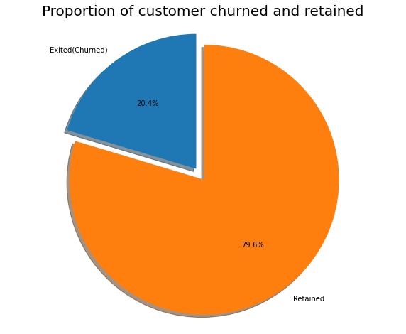
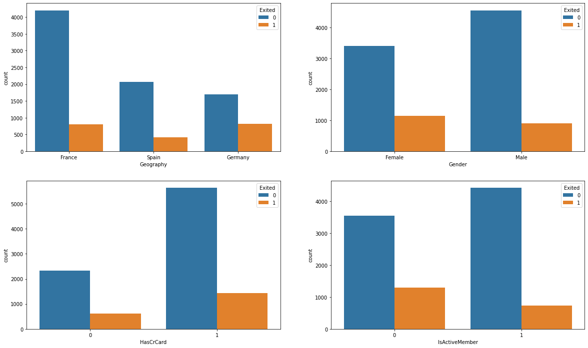
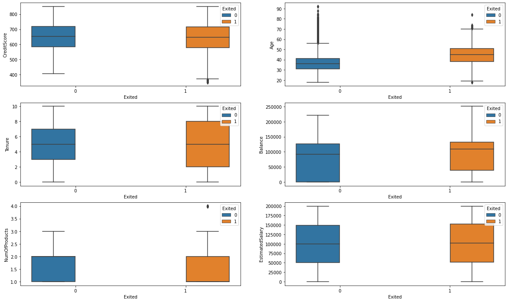
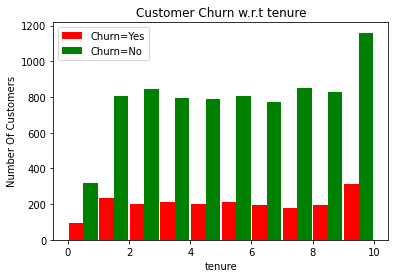
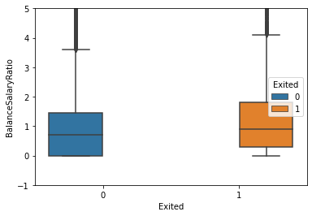
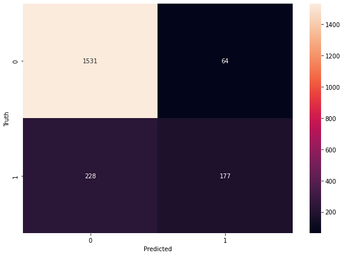

# Project: Bank Customer Churn Prediction using ANN and H2O Auto ML models
## Table of Contents
<ul>
<li><a href="#intro">Introduction</a></li>
<li><a href="#wrangling">Data Wrangling</a></li>
<li><a href="#EDAs">Eploratory Data Analysis</a></li>
<li><a href="#FeatureEngineering">Feature Engineering</a></li>
<li><a href="#ANNmodel">Model Building using ANN </a></li>
<li><a href="#H20model">Model Building and Prediction using H2O Auto ML</a></li>
<li><a href="#conclusion">Conclusion</a></li>
</ul>


## Introduction: 
<a id="intro"></a>

<p>Bank churn rate refers to the percentage of customers who close their accounts or stop using the bank's services within a given period of time. It is a measure of customer loyalty and can be an indicator of the bank's overall health and customer satisfaction. A high churn rate may indicate that the bank is not meeting the needs of its customers or that it is losing market share to competitors. 

It is expressed as a degree of customer inactivity or disengagement, observed over a given time. This manifests within the data in various forms such as the recency of account actions or change in the account balance.

To reduce churn, banks may offer incentives to customers to encourage them to continue using their services, such as rewards programs or lower fees. They may also work to improve the customer experience and address any issues that may be causing customers to leave.</p>

## Aim:
+ To identify and visualize which factors contribute to customer churn.

+ By building a prediction model that will perform the following:

     + Classify if a customer is going to churn or not
     + Preferably and based on model performance, choose a model that will attach a probability to the churn to make it easier for customer service to target low hanging fruits in their efforts to prevent churn
     
 
## Data Description
We have data set `Churn_Modelling` in CSV format with the following columns described:

- `RowNumber` - 
- `CustomerId` - Customer identification number
- `Surname` - Customer Surname
- `CreditScore` - Customer credit score
- `Geography` - Geographic location of customer
- `Gender` - Customer gender
- `Age` - Customer age
- `Tenure` - average time measured in years since customers initiated their contracts/accounts
- `Balance` - Customer balance
- `NumOfProducts` - Number of financial products signed on by customer
- `HasCrCard` - Does customer have a credit card?, an enumeration consisting of the following mapping:
    - `0` - No
    - `1` - Yes
- `IsActiveMember` - An indicator of the activity or dormancy of client account, an enumeration consisting of the following mapping:
    - `0` - inactive/dormant account
    - `1` - active account
- `EstimatedSalary` - Salary of client
- `Exited` - ClData Analysisient felt the bank, an enumeration consisting of the following mapping:
    - `0` - retained
    - `1` - churned


```python
!pip install requests
!pip install tabulate
!pip install "colorama>=0.3.8"
!pip install future
!pip install h2o
```

    Looking in indexes: https://pypi.org/simple, https://us-python.pkg.dev/colab-wheels/public/simple/
    Requirement already satisfied: requests in /usr/local/lib/python3.8/dist-packages (2.23.0)
    Requirement already satisfied: certifi>=2017.4.17 in /usr/local/lib/python3.8/dist-packages (from requests) (2022.12.7)
    Requirement already satisfied: chardet<4,>=3.0.2 in /usr/local/lib/python3.8/dist-packages (from requests) (3.0.4)
    Requirement already satisfied: idna<3,>=2.5 in /usr/local/lib/python3.8/dist-packages (from requests) (2.10)
    Requirement already satisfied: urllib3!=1.25.0,!=1.25.1,<1.26,>=1.21.1 in /usr/local/lib/python3.8/dist-packages (from requests) (1.24.3)
    Looking in indexes: https://pypi.org/simple, https://us-python.pkg.dev/colab-wheels/public/simple/
    Requirement already satisfied: tabulate in /usr/local/lib/python3.8/dist-packages (0.8.10)
    Looking in indexes: https://pypi.org/simple, https://us-python.pkg.dev/colab-wheels/public/simple/
    Requirement already satisfied: colorama>=0.3.8 in /usr/local/lib/python3.8/dist-packages (0.4.6)
    Looking in indexes: https://pypi.org/simple, https://us-python.pkg.dev/colab-wheels/public/simple/
    Requirement already satisfied: future in /usr/local/lib/python3.8/dist-packages (0.16.0)
    Looking in indexes: https://pypi.org/simple, https://us-python.pkg.dev/colab-wheels/public/simple/
    Requirement already satisfied: h2o in /usr/local/lib/python3.8/dist-packages (3.38.0.3)
    Requirement already satisfied: requests in /usr/local/lib/python3.8/dist-packages (from h2o) (2.23.0)
    Requirement already satisfied: future in /usr/local/lib/python3.8/dist-packages (from h2o) (0.16.0)
    Requirement already satisfied: tabulate in /usr/local/lib/python3.8/dist-packages (from h2o) (0.8.10)
    Requirement already satisfied: chardet<4,>=3.0.2 in /usr/local/lib/python3.8/dist-packages (from requests->h2o) (3.0.4)
    Requirement already satisfied: urllib3!=1.25.0,!=1.25.1,<1.26,>=1.21.1 in /usr/local/lib/python3.8/dist-packages (from requests->h2o) (1.24.3)
    Requirement already satisfied: idna<3,>=2.5 in /usr/local/lib/python3.8/dist-packages (from requests->h2o) (2.10)
    Requirement already satisfied: certifi>=2017.4.17 in /usr/local/lib/python3.8/dist-packages (from requests->h2o) (2022.12.7)


```python
import pandas as pd
from matplotlib import pyplot as plt
import numpy as np
from sklearn.preprocessing import MinMaxScaler
import seaborn as sns
from sklearn.model_selection import train_test_split
import tensorflow as tf
from tensorflow import keras
from sklearn.metrics import confusion_matrix , classification_report
from sklearn.metrics import accuracy_score
import h2o
from h2o.automl import H2OAutoML
%matplotlib inline
```

## Data wranlging
<a id='wrangling'></a>


```python
url = 'https://github.com/dell-datascience/Bank-Customer-Churn-Prediction/raw/main/Churn_Modelling.csv'
df = pd.read_csv(url)
```


```python
df.sample(5,random_state=13)
```


  <div id="df-bdef98c9-7112-4cae-8b55-3a2aac4462fb">
    <div class="colab-df-container">
      <div>
<style scoped>
    .dataframe tbody tr th:only-of-type {
        vertical-align: middle;
    }

    .dataframe tbody tr th {
        vertical-align: top;
    }

    .dataframe thead th {
        text-align: right;
    }
</style>
<table border="1" class="dataframe">
  <thead>
    <tr style="text-align: right;">
      <th></th>
      <th>RowNumber</th>
      <th>CustomerId</th>
      <th>Surname</th>
      <th>CreditScore</th>
      <th>Geography</th>
      <th>Gender</th>
      <th>Age</th>
      <th>Tenure</th>
      <th>Balance</th>
      <th>NumOfProducts</th>
      <th>HasCrCard</th>
      <th>IsActiveMember</th>
      <th>EstimatedSalary</th>
      <th>Exited</th>
    </tr>
  </thead>
  <tbody>
    <tr>
      <th>5952</th>
      <td>5953</td>
      <td>15657535</td>
      <td>Pearson</td>
      <td>590</td>
      <td>Spain</td>
      <td>Male</td>
      <td>29</td>
      <td>10</td>
      <td>0.00</td>
      <td>1</td>
      <td>1</td>
      <td>1</td>
      <td>51907.72</td>
      <td>1</td>
    </tr>
    <tr>
      <th>1783</th>
      <td>1784</td>
      <td>15693381</td>
      <td>Tipton</td>
      <td>533</td>
      <td>Spain</td>
      <td>Male</td>
      <td>38</td>
      <td>1</td>
      <td>135289.33</td>
      <td>2</td>
      <td>0</td>
      <td>1</td>
      <td>152956.33</td>
      <td>0</td>
    </tr>
    <tr>
      <th>4811</th>
      <td>4812</td>
      <td>15686941</td>
      <td>Hutchinson</td>
      <td>575</td>
      <td>Spain</td>
      <td>Female</td>
      <td>26</td>
      <td>7</td>
      <td>0.00</td>
      <td>2</td>
      <td>1</td>
      <td>0</td>
      <td>112507.63</td>
      <td>0</td>
    </tr>
    <tr>
      <th>145</th>
      <td>146</td>
      <td>15800703</td>
      <td>Madukwe</td>
      <td>485</td>
      <td>Spain</td>
      <td>Female</td>
      <td>21</td>
      <td>5</td>
      <td>113157.22</td>
      <td>1</td>
      <td>1</td>
      <td>1</td>
      <td>54141.50</td>
      <td>0</td>
    </tr>
    <tr>
      <th>7146</th>
      <td>7147</td>
      <td>15646594</td>
      <td>Ali</td>
      <td>749</td>
      <td>France</td>
      <td>Male</td>
      <td>41</td>
      <td>5</td>
      <td>57568.94</td>
      <td>1</td>
      <td>1</td>
      <td>1</td>
      <td>61128.29</td>
      <td>0</td>
    </tr>
  </tbody>
</table>
</div>
      <button class="colab-df-convert" onclick="convertToInteractive('df-bdef98c9-7112-4cae-8b55-3a2aac4462fb')"
              title="Convert this dataframe to an interactive table."
              style="display:none;">

  <svg xmlns="http://www.w3.org/2000/svg" height="24px"viewBox="0 0 24 24"
       width="24px">
    <path d="M0 0h24v24H0V0z" fill="none"/>
    <path d="M18.56 5.44l.94 2.06.94-2.06 2.06-.94-2.06-.94-.94-2.06-.94 2.06-2.06.94zm-11 1L8.5 8.5l.94-2.06 2.06-.94-2.06-.94L8.5 2.5l-.94 2.06-2.06.94zm10 10l.94 2.06.94-2.06 2.06-.94-2.06-.94-.94-2.06-.94 2.06-2.06.94z"/><path d="M17.41 7.96l-1.37-1.37c-.4-.4-.92-.59-1.43-.59-.52 0-1.04.2-1.43.59L10.3 9.45l-7.72 7.72c-.78.78-.78 2.05 0 2.83L4 21.41c.39.39.9.59 1.41.59.51 0 1.02-.2 1.41-.59l7.78-7.78 2.81-2.81c.8-.78.8-2.07 0-2.86zM5.41 20L4 18.59l7.72-7.72 1.47 1.35L5.41 20z"/>
  </svg>
      </button>

  <style>
    .colab-df-container {
      display:flex;
      flex-wrap:wrap;
      gap: 12px;
    }

    .colab-df-convert {
      background-color: #E8F0FE;
      border: none;
      border-radius: 50%;
      cursor: pointer;
      display: none;
      fill: #1967D2;
      height: 32px;
      padding: 0 0 0 0;
      width: 32px;
    }

    .colab-df-convert:hover {
      background-color: #E2EBFA;
      box-shadow: 0px 1px 2px rgba(60, 64, 67, 0.3), 0px 1px 3px 1px rgba(60, 64, 67, 0.15);
      fill: #174EA6;
    }

    [theme=dark] .colab-df-convert {
      background-color: #3B4455;
      fill: #D2E3FC;
    }

    [theme=dark] .colab-df-convert:hover {
      background-color: #434B5C;
      box-shadow: 0px 1px 3px 1px rgba(0, 0, 0, 0.15);
      filter: drop-shadow(0px 1px 2px rgba(0, 0, 0, 0.3));
      fill: #FFFFFF;
    }
  </style>

      <script>
        const buttonEl =
          document.querySelector('#df-bdef98c9-7112-4cae-8b55-3a2aac4462fb button.colab-df-convert');
        buttonEl.style.display =
          google.colab.kernel.accessAllowed ? 'block' : 'none';

        async function convertToInteractive(key) {
          const element = document.querySelector('#df-bdef98c9-7112-4cae-8b55-3a2aac4462fb');
          const dataTable =
            await google.colab.kernel.invokeFunction('convertToInteractive',
                                                     [key], {});
          if (!dataTable) return;

          const docLinkHtml = 'Like what you see? Visit the ' +
            '<a target="_blank" href=https://colab.research.google.com/notebooks/data_table.ipynb>data table notebook</a>'
            + ' to learn more about interactive tables.';
          element.innerHTML = '';
          dataTable['output_type'] = 'display_data';
          await google.colab.output.renderOutput(dataTable, element);
          const docLink = document.createElement('div');
          docLink.innerHTML = docLinkHtml;
          element.appendChild(docLink);
        }
      </script>
    </div>
  </div>


```python
# inspect number of entries and features
df.shape
```


    (10000, 14)


```python
df.info()
```

    <class 'pandas.core.frame.DataFrame'>
    RangeIndex: 10000 entries, 0 to 9999
    Data columns (total 14 columns):
     #   Column           Non-Null Count  Dtype  
    ---  ------           --------------  -----  
     0   RowNumber        10000 non-null  int64  
     1   CustomerId       10000 non-null  int64  
     2   Surname          10000 non-null  object 
     3   CreditScore      10000 non-null  int64  
     4   Geography        10000 non-null  object 
     5   Gender           10000 non-null  object 
     6   Age              10000 non-null  int64  
     7   Tenure           10000 non-null  int64  
     8   Balance          10000 non-null  float64
     9   NumOfProducts    10000 non-null  int64  
     10  HasCrCard        10000 non-null  int64  
     11  IsActiveMember   10000 non-null  int64  
     12  EstimatedSalary  10000 non-null  float64
     13  Exited           10000 non-null  int64  
    dtypes: float64(2), int64(9), object(3)
    memory usage: 1.1+ MB


> There are no missing data and data format are correct


```python
df.nunique()
```


    RowNumber          10000
    CustomerId         10000
    Surname             2932
    CreditScore          460
    Geography              3
    Gender                 2
    Age                   70
    Tenure                11
    Balance             6382
    NumOfProducts          4
    HasCrCard              2
    IsActiveMember         2
    EstimatedSalary     9999
    Exited                 2
    dtype: int64


```python
# Drop columns with little relevance 
df.drop(['CustomerId','RowNumber','Surname'],axis=1,inplace=True)
```


```python
df.sample(5,random_state=13)
```


  <div id="df-a8cd4aba-38bd-4378-937f-5a50e79aa752">
    <div class="colab-df-container">
      <div>
<style scoped>
    .dataframe tbody tr th:only-of-type {
        vertical-align: middle;
    }

    .dataframe tbody tr th {
        vertical-align: top;
    }

    .dataframe thead th {
        text-align: right;
    }
</style>
<table border="1" class="dataframe">
  <thead>
    <tr style="text-align: right;">
      <th></th>
      <th>CreditScore</th>
      <th>Geography</th>
      <th>Gender</th>
      <th>Age</th>
      <th>Tenure</th>
      <th>Balance</th>
      <th>NumOfProducts</th>
      <th>HasCrCard</th>
      <th>IsActiveMember</th>
      <th>EstimatedSalary</th>
      <th>Exited</th>
    </tr>
  </thead>
  <tbody>
    <tr>
      <th>5952</th>
      <td>590</td>
      <td>Spain</td>
      <td>Male</td>
      <td>29</td>
      <td>10</td>
      <td>0.00</td>
      <td>1</td>
      <td>1</td>
      <td>1</td>
      <td>51907.72</td>
      <td>1</td>
    </tr>
    <tr>
      <th>1783</th>
      <td>533</td>
      <td>Spain</td>
      <td>Male</td>
      <td>38</td>
      <td>1</td>
      <td>135289.33</td>
      <td>2</td>
      <td>0</td>
      <td>1</td>
      <td>152956.33</td>
      <td>0</td>
    </tr>
    <tr>
      <th>4811</th>
      <td>575</td>
      <td>Spain</td>
      <td>Female</td>
      <td>26</td>
      <td>7</td>
      <td>0.00</td>
      <td>2</td>
      <td>1</td>
      <td>0</td>
      <td>112507.63</td>
      <td>0</td>
    </tr>
    <tr>
      <th>145</th>
      <td>485</td>
      <td>Spain</td>
      <td>Female</td>
      <td>21</td>
      <td>5</td>
      <td>113157.22</td>
      <td>1</td>
      <td>1</td>
      <td>1</td>
      <td>54141.50</td>
      <td>0</td>
    </tr>
    <tr>
      <th>7146</th>
      <td>749</td>
      <td>France</td>
      <td>Male</td>
      <td>41</td>
      <td>5</td>
      <td>57568.94</td>
      <td>1</td>
      <td>1</td>
      <td>1</td>
      <td>61128.29</td>
      <td>0</td>
    </tr>
  </tbody>
</table>
</div>
      <button class="colab-df-convert" onclick="convertToInteractive('df-a8cd4aba-38bd-4378-937f-5a50e79aa752')"
              title="Convert this dataframe to an interactive table."
              style="display:none;">

  <svg xmlns="http://www.w3.org/2000/svg" height="24px"viewBox="0 0 24 24"
       width="24px">
    <path d="M0 0h24v24H0V0z" fill="none"/>
    <path d="M18.56 5.44l.94 2.06.94-2.06 2.06-.94-2.06-.94-.94-2.06-.94 2.06-2.06.94zm-11 1L8.5 8.5l.94-2.06 2.06-.94-2.06-.94L8.5 2.5l-.94 2.06-2.06.94zm10 10l.94 2.06.94-2.06 2.06-.94-2.06-.94-.94-2.06-.94 2.06-2.06.94z"/><path d="M17.41 7.96l-1.37-1.37c-.4-.4-.92-.59-1.43-.59-.52 0-1.04.2-1.43.59L10.3 9.45l-7.72 7.72c-.78.78-.78 2.05 0 2.83L4 21.41c.39.39.9.59 1.41.59.51 0 1.02-.2 1.41-.59l7.78-7.78 2.81-2.81c.8-.78.8-2.07 0-2.86zM5.41 20L4 18.59l7.72-7.72 1.47 1.35L5.41 20z"/>
  </svg>
      </button>

  <style>
    .colab-df-container {
      display:flex;
      flex-wrap:wrap;
      gap: 12px;
    }

    .colab-df-convert {
      background-color: #E8F0FE;
      border: none;
      border-radius: 50%;
      cursor: pointer;
      display: none;
      fill: #1967D2;
      height: 32px;
      padding: 0 0 0 0;
      width: 32px;
    }

    .colab-df-convert:hover {
      background-color: #E2EBFA;
      box-shadow: 0px 1px 2px rgba(60, 64, 67, 0.3), 0px 1px 3px 1px rgba(60, 64, 67, 0.15);
      fill: #174EA6;
    }

    [theme=dark] .colab-df-convert {
      background-color: #3B4455;
      fill: #D2E3FC;
    }

    [theme=dark] .colab-df-convert:hover {
      background-color: #434B5C;
      box-shadow: 0px 1px 3px 1px rgba(0, 0, 0, 0.15);
      filter: drop-shadow(0px 1px 2px rgba(0, 0, 0, 0.3));
      fill: #FFFFFF;
    }
  </style>

      <script>
        const buttonEl =
          document.querySelector('#df-a8cd4aba-38bd-4378-937f-5a50e79aa752 button.colab-df-convert');
        buttonEl.style.display =
          google.colab.kernel.accessAllowed ? 'block' : 'none';

        async function convertToInteractive(key) {
          const element = document.querySelector('#df-a8cd4aba-38bd-4378-937f-5a50e79aa752');
          const dataTable =
            await google.colab.kernel.invokeFunction('convertToInteractive',
                                                     [key], {});
          if (!dataTable) return;

          const docLinkHtml = 'Like what you see? Visit the ' +
            '<a target="_blank" href=https://colab.research.google.com/notebooks/data_table.ipynb>data table notebook</a>'
            + ' to learn more about interactive tables.';
          element.innerHTML = '';
          dataTable['output_type'] = 'display_data';
          await google.colab.output.renderOutput(dataTable, element);
          const docLink = document.createElement('div');
          docLink.innerHTML = docLinkHtml;
          element.appendChild(docLink);
        }
      </script>
    </div>
  </div>


## Exploratory data analysis
<a id="EDAs"></a>
### We will plot a Pie Chart 


```python
labels = 'Exited(Churned)', 'Retained'
sizes = df.query('Exited==1').shape[0], df.query('Exited==0').shape[0]
explode = (0, 0.1)
fig1, ax1 = plt.subplots(figsize=(10, 8))
ax1.pie(sizes, explode=explode, labels=labels, autopct='%1.1f%%',
        shadow=True, startangle=90)
ax1.axis('equal')
plt.title("Proportion of customer churned and retained", size = 20)
plt.show()
```


    

    


> It is evient that a little over 20% of client churn while about 80% stay


```python
# We first review the 'Status' relation with categorical variables
fig, ax = plt.subplots(2, 2, figsize=(20, 12))
sns.countplot(x='Geography', hue = 'Exited',data = df, ax=ax[0][0]);
sns.countplot(x='Gender', hue = 'Exited',data = df, ax=ax[0][1]);
sns.countplot(x='HasCrCard', hue = 'Exited',data = df, ax=ax[1][0]);
sns.countplot(x='IsActiveMember', hue = 'Exited',data = df, ax=ax[1][1]);
```


    

    


> From the charts above, clients from Spain have the lowest churn amongst France and Germany, with both genders equally churning at the same level. It must be said that clients with creditcards have a higher churn  than those without and inactive client also have a churn than actie clients.


```python
# Relations based on the continuous data attributes
fig, ax = plt.subplots(3, 2, figsize=(20, 12))
sns.boxplot(y='CreditScore',x = 'Exited', hue = 'Exited',data = df, ax=ax[0][0]);
sns.boxplot(y='Age',x = 'Exited', hue = 'Exited',data = df , ax=ax[0][1]);
sns.boxplot(y='Tenure',x = 'Exited', hue = 'Exited',data = df, ax=ax[1][0]);
sns.boxplot(y='Balance',x = 'Exited', hue = 'Exited',data = df, ax=ax[1][1]);
sns.boxplot(y='NumOfProducts',x = 'Exited', hue = 'Exited',data = df, ax=ax[2][0]);
sns.boxplot(y='EstimatedSalary',x = 'Exited', hue = 'Exited',data = df, ax=ax[2][1]);
```


    

    


```python
tenure_churn_no = df.query('Exited==0').Tenure
tenure_churn_yes = df.query('Exited==1').Tenure

plt.xlabel("tenure");
plt.ylabel("Number Of Customers");
plt.title("Customer Churn w.r.t tenure");

plt.hist([tenure_churn_yes, tenure_churn_no], rwidth=0.95, color=['red','green'],label=['Churn=Yes','Churn=No']);
plt.legend();
```

    /usr/local/lib/python3.8/dist-packages/numpy/core/fromnumeric.py:3208: VisibleDeprecationWarning: Creating an ndarray from ragged nested sequences (which is a list-or-tuple of lists-or-tuples-or ndarrays with different lengths or shapes) is deprecated. If you meant to do this, you must specify 'dtype=object' when creating the ndarray.
      return asarray(a).size
    /usr/local/lib/python3.8/dist-packages/matplotlib/cbook/__init__.py:1376: VisibleDeprecationWarning: Creating an ndarray from ragged nested sequences (which is a list-or-tuple of lists-or-tuples-or ndarrays with different lengths or shapes) is deprecated. If you meant to do this, you must specify 'dtype=object' when creating the ndarray.
      X = np.atleast_1d(X.T if isinstance(X, np.ndarray) else np.asarray(X))


    

    


<a id="FeatureEngineering"></a>
## Feature Engineering


```python
# Making a new column BalanceSalaryRatio

df['BalanceSalaryRatio'] = df.Balance/df.EstimatedSalary
sns.boxplot(y='BalanceSalaryRatio',x = 'Exited', hue = 'Exited',data = df)
plt.ylim(-1, 5)
```


    (-1.0, 5.0)


    

    


```python
df['TenureByAge'] = df.Tenure/(df.Age)
sns.boxplot(y='TenureByAge',x = 'Exited', hue = 'Exited',data = df)
plt.ylim(-1, 1)
plt.show()
```


    

    


```python
# Printing the categorical variables

def print_unique_col_values(df):
       for column in df:
            if df[column].dtypes=='object':
                print(f'{column}: {df[column].unique()}')
```


```python
print_unique_col_values(df)
```

    Geography: ['France' 'Spain' 'Germany']
    Gender: ['Female' 'Male']


```python
# Label Encoding

df['Gender'].replace({'Male': 1,'Female': 0},inplace=True)
```


```python
# One Hot Encode geography column

df1 = pd.get_dummies(data=df, columns=['Geography'])
df1.head()
```


  <div id="df-812252d0-3eab-4384-9c4d-a1a22c9d094c">
    <div class="colab-df-container">
      <div>
<style scoped>
    .dataframe tbody tr th:only-of-type {
        vertical-align: middle;
    }

    .dataframe tbody tr th {
        vertical-align: top;
    }

    .dataframe thead th {
        text-align: right;
    }
</style>
<table border="1" class="dataframe">
  <thead>
    <tr style="text-align: right;">
      <th></th>
      <th>CreditScore</th>
      <th>Gender</th>
      <th>Age</th>
      <th>Tenure</th>
      <th>Balance</th>
      <th>NumOfProducts</th>
      <th>HasCrCard</th>
      <th>IsActiveMember</th>
      <th>EstimatedSalary</th>
      <th>Exited</th>
      <th>BalanceSalaryRatio</th>
      <th>TenureByAge</th>
      <th>Geography_France</th>
      <th>Geography_Germany</th>
      <th>Geography_Spain</th>
    </tr>
  </thead>
  <tbody>
    <tr>
      <th>0</th>
      <td>619</td>
      <td>0</td>
      <td>42</td>
      <td>2</td>
      <td>0.00</td>
      <td>1</td>
      <td>1</td>
      <td>1</td>
      <td>101348.88</td>
      <td>1</td>
      <td>0.000000</td>
      <td>0.047619</td>
      <td>1</td>
      <td>0</td>
      <td>0</td>
    </tr>
    <tr>
      <th>1</th>
      <td>608</td>
      <td>0</td>
      <td>41</td>
      <td>1</td>
      <td>83807.86</td>
      <td>1</td>
      <td>0</td>
      <td>1</td>
      <td>112542.58</td>
      <td>0</td>
      <td>0.744677</td>
      <td>0.024390</td>
      <td>0</td>
      <td>0</td>
      <td>1</td>
    </tr>
    <tr>
      <th>2</th>
      <td>502</td>
      <td>0</td>
      <td>42</td>
      <td>8</td>
      <td>159660.80</td>
      <td>3</td>
      <td>1</td>
      <td>0</td>
      <td>113931.57</td>
      <td>1</td>
      <td>1.401375</td>
      <td>0.190476</td>
      <td>1</td>
      <td>0</td>
      <td>0</td>
    </tr>
    <tr>
      <th>3</th>
      <td>699</td>
      <td>0</td>
      <td>39</td>
      <td>1</td>
      <td>0.00</td>
      <td>2</td>
      <td>0</td>
      <td>0</td>
      <td>93826.63</td>
      <td>0</td>
      <td>0.000000</td>
      <td>0.025641</td>
      <td>1</td>
      <td>0</td>
      <td>0</td>
    </tr>
    <tr>
      <th>4</th>
      <td>850</td>
      <td>0</td>
      <td>43</td>
      <td>2</td>
      <td>125510.82</td>
      <td>1</td>
      <td>1</td>
      <td>1</td>
      <td>79084.10</td>
      <td>0</td>
      <td>1.587055</td>
      <td>0.046512</td>
      <td>0</td>
      <td>0</td>
      <td>1</td>
    </tr>
  </tbody>
</table>
</div>
      <button class="colab-df-convert" onclick="convertToInteractive('df-812252d0-3eab-4384-9c4d-a1a22c9d094c')"
              title="Convert this dataframe to an interactive table."
              style="display:none;">

  <svg xmlns="http://www.w3.org/2000/svg" height="24px"viewBox="0 0 24 24"
       width="24px">
    <path d="M0 0h24v24H0V0z" fill="none"/>
    <path d="M18.56 5.44l.94 2.06.94-2.06 2.06-.94-2.06-.94-.94-2.06-.94 2.06-2.06.94zm-11 1L8.5 8.5l.94-2.06 2.06-.94-2.06-.94L8.5 2.5l-.94 2.06-2.06.94zm10 10l.94 2.06.94-2.06 2.06-.94-2.06-.94-.94-2.06-.94 2.06-2.06.94z"/><path d="M17.41 7.96l-1.37-1.37c-.4-.4-.92-.59-1.43-.59-.52 0-1.04.2-1.43.59L10.3 9.45l-7.72 7.72c-.78.78-.78 2.05 0 2.83L4 21.41c.39.39.9.59 1.41.59.51 0 1.02-.2 1.41-.59l7.78-7.78 2.81-2.81c.8-.78.8-2.07 0-2.86zM5.41 20L4 18.59l7.72-7.72 1.47 1.35L5.41 20z"/>
  </svg>
      </button>

  <style>
    .colab-df-container {
      display:flex;
      flex-wrap:wrap;
      gap: 12px;
    }

    .colab-df-convert {
      background-color: #E8F0FE;
      border: none;
      border-radius: 50%;
      cursor: pointer;
      display: none;
      fill: #1967D2;
      height: 32px;
      padding: 0 0 0 0;
      width: 32px;
    }

    .colab-df-convert:hover {
      background-color: #E2EBFA;
      box-shadow: 0px 1px 2px rgba(60, 64, 67, 0.3), 0px 1px 3px 1px rgba(60, 64, 67, 0.15);
      fill: #174EA6;
    }

    [theme=dark] .colab-df-convert {
      background-color: #3B4455;
      fill: #D2E3FC;
    }

    [theme=dark] .colab-df-convert:hover {
      background-color: #434B5C;
      box-shadow: 0px 1px 3px 1px rgba(0, 0, 0, 0.15);
      filter: drop-shadow(0px 1px 2px rgba(0, 0, 0, 0.3));
      fill: #FFFFFF;
    }
  </style>

      <script>
        const buttonEl =
          document.querySelector('#df-812252d0-3eab-4384-9c4d-a1a22c9d094c button.colab-df-convert');
        buttonEl.style.display =
          google.colab.kernel.accessAllowed ? 'block' : 'none';

        async function convertToInteractive(key) {
          const element = document.querySelector('#df-812252d0-3eab-4384-9c4d-a1a22c9d094c');
          const dataTable =
            await google.colab.kernel.invokeFunction('convertToInteractive',
                                                     [key], {});
          if (!dataTable) return;

          const docLinkHtml = 'Like what you see? Visit the ' +
            '<a target="_blank" href=https://colab.research.google.com/notebooks/data_table.ipynb>data table notebook</a>'
            + ' to learn more about interactive tables.';
          element.innerHTML = '';
          dataTable['output_type'] = 'display_data';
          await google.colab.output.renderOutput(dataTable, element);
          const docLink = document.createElement('div');
          docLink.innerHTML = docLinkHtml;
          element.appendChild(docLink);
        }
      </script>
    </div>
  </div>


```python
# Standardize select columns to increase accuracy of model
scale_var = ['Tenure','CreditScore','Age','Balance','NumOfProducts','EstimatedSalary']
scaler = MinMaxScaler()
df1[scale_var] = scaler.fit_transform(df1[scale_var])
```


```python
df1.head()
```


  <div id="df-35c442a7-643b-4692-a21c-455a0b01986d">
    <div class="colab-df-container">
      <div>
<style scoped>
    .dataframe tbody tr th:only-of-type {
        vertical-align: middle;
    }

    .dataframe tbody tr th {
        vertical-align: top;
    }

    .dataframe thead th {
        text-align: right;
    }
</style>
<table border="1" class="dataframe">
  <thead>
    <tr style="text-align: right;">
      <th></th>
      <th>CreditScore</th>
      <th>Gender</th>
      <th>Age</th>
      <th>Tenure</th>
      <th>Balance</th>
      <th>NumOfProducts</th>
      <th>HasCrCard</th>
      <th>IsActiveMember</th>
      <th>EstimatedSalary</th>
      <th>Exited</th>
      <th>BalanceSalaryRatio</th>
      <th>TenureByAge</th>
      <th>Geography_France</th>
      <th>Geography_Germany</th>
      <th>Geography_Spain</th>
    </tr>
  </thead>
  <tbody>
    <tr>
      <th>0</th>
      <td>0.538</td>
      <td>0</td>
      <td>0.324324</td>
      <td>0.2</td>
      <td>0.000000</td>
      <td>0.000000</td>
      <td>1</td>
      <td>1</td>
      <td>0.506735</td>
      <td>1</td>
      <td>0.000000</td>
      <td>0.047619</td>
      <td>1</td>
      <td>0</td>
      <td>0</td>
    </tr>
    <tr>
      <th>1</th>
      <td>0.516</td>
      <td>0</td>
      <td>0.310811</td>
      <td>0.1</td>
      <td>0.334031</td>
      <td>0.000000</td>
      <td>0</td>
      <td>1</td>
      <td>0.562709</td>
      <td>0</td>
      <td>0.744677</td>
      <td>0.024390</td>
      <td>0</td>
      <td>0</td>
      <td>1</td>
    </tr>
    <tr>
      <th>2</th>
      <td>0.304</td>
      <td>0</td>
      <td>0.324324</td>
      <td>0.8</td>
      <td>0.636357</td>
      <td>0.666667</td>
      <td>1</td>
      <td>0</td>
      <td>0.569654</td>
      <td>1</td>
      <td>1.401375</td>
      <td>0.190476</td>
      <td>1</td>
      <td>0</td>
      <td>0</td>
    </tr>
    <tr>
      <th>3</th>
      <td>0.698</td>
      <td>0</td>
      <td>0.283784</td>
      <td>0.1</td>
      <td>0.000000</td>
      <td>0.333333</td>
      <td>0</td>
      <td>0</td>
      <td>0.469120</td>
      <td>0</td>
      <td>0.000000</td>
      <td>0.025641</td>
      <td>1</td>
      <td>0</td>
      <td>0</td>
    </tr>
    <tr>
      <th>4</th>
      <td>1.000</td>
      <td>0</td>
      <td>0.337838</td>
      <td>0.2</td>
      <td>0.500246</td>
      <td>0.000000</td>
      <td>1</td>
      <td>1</td>
      <td>0.395400</td>
      <td>0</td>
      <td>1.587055</td>
      <td>0.046512</td>
      <td>0</td>
      <td>0</td>
      <td>1</td>
    </tr>
  </tbody>
</table>
</div>
      <button class="colab-df-convert" onclick="convertToInteractive('df-35c442a7-643b-4692-a21c-455a0b01986d')"
              title="Convert this dataframe to an interactive table."
              style="display:none;">

  <svg xmlns="http://www.w3.org/2000/svg" height="24px"viewBox="0 0 24 24"
       width="24px">
    <path d="M0 0h24v24H0V0z" fill="none"/>
    <path d="M18.56 5.44l.94 2.06.94-2.06 2.06-.94-2.06-.94-.94-2.06-.94 2.06-2.06.94zm-11 1L8.5 8.5l.94-2.06 2.06-.94-2.06-.94L8.5 2.5l-.94 2.06-2.06.94zm10 10l.94 2.06.94-2.06 2.06-.94-2.06-.94-.94-2.06-.94 2.06-2.06.94z"/><path d="M17.41 7.96l-1.37-1.37c-.4-.4-.92-.59-1.43-.59-.52 0-1.04.2-1.43.59L10.3 9.45l-7.72 7.72c-.78.78-.78 2.05 0 2.83L4 21.41c.39.39.9.59 1.41.59.51 0 1.02-.2 1.41-.59l7.78-7.78 2.81-2.81c.8-.78.8-2.07 0-2.86zM5.41 20L4 18.59l7.72-7.72 1.47 1.35L5.41 20z"/>
  </svg>
      </button>

  <style>
    .colab-df-container {
      display:flex;
      flex-wrap:wrap;
      gap: 12px;
    }

    .colab-df-convert {
      background-color: #E8F0FE;
      border: none;
      border-radius: 50%;
      cursor: pointer;
      display: none;
      fill: #1967D2;
      height: 32px;
      padding: 0 0 0 0;
      width: 32px;
    }

    .colab-df-convert:hover {
      background-color: #E2EBFA;
      box-shadow: 0px 1px 2px rgba(60, 64, 67, 0.3), 0px 1px 3px 1px rgba(60, 64, 67, 0.15);
      fill: #174EA6;
    }

    [theme=dark] .colab-df-convert {
      background-color: #3B4455;
      fill: #D2E3FC;
    }

    [theme=dark] .colab-df-convert:hover {
      background-color: #434B5C;
      box-shadow: 0px 1px 3px 1px rgba(0, 0, 0, 0.15);
      filter: drop-shadow(0px 1px 2px rgba(0, 0, 0, 0.3));
      fill: #FFFFFF;
    }
  </style>

      <script>
        const buttonEl =
          document.querySelector('#df-35c442a7-643b-4692-a21c-455a0b01986d button.colab-df-convert');
        buttonEl.style.display =
          google.colab.kernel.accessAllowed ? 'block' : 'none';

        async function convertToInteractive(key) {
          const element = document.querySelector('#df-35c442a7-643b-4692-a21c-455a0b01986d');
          const dataTable =
            await google.colab.kernel.invokeFunction('convertToInteractive',
                                                     [key], {});
          if (!dataTable) return;

          const docLinkHtml = 'Like what you see? Visit the ' +
            '<a target="_blank" href=https://colab.research.google.com/notebooks/data_table.ipynb>data table notebook</a>'
            + ' to learn more about interactive tables.';
          element.innerHTML = '';
          dataTable['output_type'] = 'display_data';
          await google.colab.output.renderOutput(dataTable, element);
          const docLink = document.createElement('div');
          docLink.innerHTML = docLinkHtml;
          element.appendChild(docLink);
        }
      </script>
    </div>
  </div>


```python
# Separate independent features and dependent features
# Split into train (80%) and test (20%) samples to prevent overfitting

X = df1.drop('Exited',axis='columns')  
y = df1['Exited']  

X_train, X_test, y_train, y_test = train_test_split(X,y,test_size=0.2,random_state=5)

```


```python
X_train.shape, X_test.shape
```


    ((8000, 14), (2000, 14))


<a id="ANNmodel"></a>
## Model Building using ANN 

### The Sequential model
 A Sequential model is appropriate for a plain stack of layers where each layer has exactly one input tensor and one output tensor.

 #### NB: A Sequential model is not appropriate when:

- model has multiple inputs or multiple outputs
- Any of your layers has multiple inputs or multiple outputs
- You need to do layer sharing
- You want non-linear topology (e.g. a residual connection, a multi-branch model)


```python

model = keras.Sequential([
    keras.layers.Dense(12, input_shape=(None,32,14), activation='relu'),
    keras.layers.Dense(6, activation='relu'),
    keras.layers.Dense(1, activation='sigmoid')
])


model.compile(optimizer='adam',
              loss='binary_crossentropy',
              metrics=['accuracy'])

model.fit(X_train, y_train, epochs=100)
```

    Epoch 1/100


    WARNING:tensorflow:Model was constructed with shape (None, None, 32, 14) for input KerasTensor(type_spec=TensorSpec(shape=(None, None, 32, 14), dtype=tf.float32, name='dense_6_input'), name='dense_6_input', description="created by layer 'dense_6_input'"), but it was called on an input with incompatible shape (32, 14).
    WARNING:tensorflow:Model was constructed with shape (None, None, 32, 14) for input KerasTensor(type_spec=TensorSpec(shape=(None, None, 32, 14), dtype=tf.float32, name='dense_6_input'), name='dense_6_input', description="created by layer 'dense_6_input'"), but it was called on an input with incompatible shape (32, 14).


    250/250 [==============================] - 1s 2ms/step - loss: 0.5709 - accuracy: 0.7490
    Epoch 2/100
    250/250 [==============================] - 0s 2ms/step - loss: 0.4764 - accuracy: 0.7952
    Epoch 3/100
    250/250 [==============================] - 0s 2ms/step - loss: 0.4565 - accuracy: 0.8018
    Epoch 4/100
    250/250 [==============================] - 0s 2ms/step - loss: 0.4478 - accuracy: 0.8080
    Epoch 5/100
    250/250 [==============================] - 1s 2ms/step - loss: 0.4295 - accuracy: 0.8200
    Epoch 6/100
    250/250 [==============================] - 1s 2ms/step - loss: 0.4217 - accuracy: 0.8213
    Epoch 7/100
    250/250 [==============================] - 0s 2ms/step - loss: 0.4141 - accuracy: 0.8246
    Epoch 8/100
    250/250 [==============================] - 1s 2ms/step - loss: 0.4216 - accuracy: 0.8225
    Epoch 9/100
    250/250 [==============================] - 0s 2ms/step - loss: 0.4031 - accuracy: 0.8291
    Epoch 10/100
    250/250 [==============================] - 0s 2ms/step - loss: 0.3923 - accuracy: 0.8319
    Epoch 11/100
    250/250 [==============================] - 0s 2ms/step - loss: 0.3903 - accuracy: 0.8378
    Epoch 12/100
    250/250 [==============================] - 1s 3ms/step - loss: 0.3812 - accuracy: 0.8386
    Epoch 13/100
    250/250 [==============================] - 0s 2ms/step - loss: 0.3775 - accuracy: 0.8415
    Epoch 14/100
    250/250 [==============================] - 1s 2ms/step - loss: 0.3710 - accuracy: 0.8451
    Epoch 15/100
    250/250 [==============================] - 0s 2ms/step - loss: 0.3680 - accuracy: 0.8470
    Epoch 16/100
    250/250 [==============================] - 1s 2ms/step - loss: 0.3863 - accuracy: 0.8457
    Epoch 17/100
    250/250 [==============================] - 0s 2ms/step - loss: 0.3701 - accuracy: 0.8493
    Epoch 18/100
    250/250 [==============================] - 0s 2ms/step - loss: 0.3593 - accuracy: 0.8497
    Epoch 19/100
    250/250 [==============================] - 0s 2ms/step - loss: 0.3577 - accuracy: 0.8544
    Epoch 20/100
    250/250 [==============================] - 0s 2ms/step - loss: 0.3559 - accuracy: 0.8533
    Epoch 21/100
    250/250 [==============================] - 1s 4ms/step - loss: 0.3703 - accuracy: 0.8518
    Epoch 22/100
    250/250 [==============================] - 1s 4ms/step - loss: 0.3647 - accuracy: 0.8541
    Epoch 23/100
    250/250 [==============================] - 1s 4ms/step - loss: 0.3535 - accuracy: 0.8554
    Epoch 24/100
    250/250 [==============================] - 1s 4ms/step - loss: 0.3521 - accuracy: 0.8558
    Epoch 25/100
    250/250 [==============================] - 1s 4ms/step - loss: 0.3569 - accuracy: 0.8562
    Epoch 26/100
    250/250 [==============================] - 1s 5ms/step - loss: 0.3703 - accuracy: 0.8554
    Epoch 27/100
    250/250 [==============================] - 1s 4ms/step - loss: 0.3527 - accuracy: 0.8558
    Epoch 28/100
    250/250 [==============================] - 1s 4ms/step - loss: 0.3472 - accuracy: 0.8597
    Epoch 29/100
    250/250 [==============================] - 1s 3ms/step - loss: 0.3650 - accuracy: 0.8561
    Epoch 30/100
    250/250 [==============================] - 1s 4ms/step - loss: 0.3516 - accuracy: 0.8572
    Epoch 31/100
    250/250 [==============================] - 1s 3ms/step - loss: 0.3463 - accuracy: 0.8589
    Epoch 32/100
    250/250 [==============================] - 1s 4ms/step - loss: 0.3452 - accuracy: 0.8600
    Epoch 33/100
    250/250 [==============================] - 1s 4ms/step - loss: 0.3443 - accuracy: 0.8597
    Epoch 34/100
    250/250 [==============================] - 1s 4ms/step - loss: 0.3440 - accuracy: 0.8595
    Epoch 35/100
    250/250 [==============================] - 1s 4ms/step - loss: 0.3564 - accuracy: 0.8559
    Epoch 36/100
    250/250 [==============================] - 1s 5ms/step - loss: 0.3561 - accuracy: 0.8558
    Epoch 37/100
    250/250 [==============================] - 1s 4ms/step - loss: 0.3442 - accuracy: 0.8593
    Epoch 38/100
    250/250 [==============================] - 1s 4ms/step - loss: 0.3434 - accuracy: 0.8597
    Epoch 39/100
    250/250 [==============================] - 1s 5ms/step - loss: 0.3425 - accuracy: 0.8615
    Epoch 40/100
    250/250 [==============================] - 1s 4ms/step - loss: 0.3411 - accuracy: 0.8614
    Epoch 41/100
    250/250 [==============================] - 1s 4ms/step - loss: 0.3530 - accuracy: 0.8600
    Epoch 42/100
    250/250 [==============================] - 1s 5ms/step - loss: 0.3639 - accuracy: 0.8572
    Epoch 43/100
    250/250 [==============================] - 1s 5ms/step - loss: 0.3462 - accuracy: 0.8593
    Epoch 44/100
    250/250 [==============================] - 1s 4ms/step - loss: 0.3414 - accuracy: 0.8620
    Epoch 45/100
    250/250 [==============================] - 1s 3ms/step - loss: 0.3419 - accuracy: 0.8620
    Epoch 46/100
    250/250 [==============================] - 1s 5ms/step - loss: 0.3408 - accuracy: 0.8600
    Epoch 47/100
    250/250 [==============================] - 1s 4ms/step - loss: 0.3412 - accuracy: 0.8615
    Epoch 48/100
    250/250 [==============================] - 1s 4ms/step - loss: 0.3405 - accuracy: 0.8604
    Epoch 49/100
    250/250 [==============================] - 1s 4ms/step - loss: 0.3645 - accuracy: 0.8560
    Epoch 50/100
    250/250 [==============================] - 1s 4ms/step - loss: 0.3562 - accuracy: 0.8596
    Epoch 51/100
    250/250 [==============================] - 1s 6ms/step - loss: 0.3434 - accuracy: 0.8593
    Epoch 52/100
    250/250 [==============================] - 1s 4ms/step - loss: 0.3411 - accuracy: 0.8618
    Epoch 53/100
    250/250 [==============================] - 1s 5ms/step - loss: 0.3402 - accuracy: 0.8622
    Epoch 54/100
    250/250 [==============================] - 1s 4ms/step - loss: 0.3403 - accuracy: 0.8622
    Epoch 55/100
    250/250 [==============================] - 1s 4ms/step - loss: 0.3396 - accuracy: 0.8620
    Epoch 56/100
    250/250 [==============================] - 0s 2ms/step - loss: 0.3394 - accuracy: 0.8615
    Epoch 57/100
    250/250 [==============================] - 0s 2ms/step - loss: 0.3404 - accuracy: 0.8610
    Epoch 58/100
    250/250 [==============================] - 0s 2ms/step - loss: 0.3392 - accuracy: 0.8610
    Epoch 59/100
    250/250 [==============================] - 0s 2ms/step - loss: 0.3389 - accuracy: 0.8620
    Epoch 60/100
    250/250 [==============================] - 0s 2ms/step - loss: 0.3395 - accuracy: 0.8624
    Epoch 61/100
    250/250 [==============================] - 0s 2ms/step - loss: 0.3388 - accuracy: 0.8635
    Epoch 62/100
    250/250 [==============================] - 0s 2ms/step - loss: 0.3557 - accuracy: 0.8560
    Epoch 63/100
    250/250 [==============================] - 0s 2ms/step - loss: 0.3525 - accuracy: 0.8595
    Epoch 64/100
    250/250 [==============================] - 0s 2ms/step - loss: 0.3456 - accuracy: 0.8591
    Epoch 65/100
    250/250 [==============================] - 0s 2ms/step - loss: 0.3410 - accuracy: 0.8608
    Epoch 66/100
    250/250 [==============================] - 0s 2ms/step - loss: 0.3394 - accuracy: 0.8624
    Epoch 67/100
    250/250 [==============================] - 0s 2ms/step - loss: 0.3382 - accuracy: 0.8624
    Epoch 68/100
    250/250 [==============================] - 0s 2ms/step - loss: 0.3446 - accuracy: 0.8587
    Epoch 69/100
    250/250 [==============================] - 0s 2ms/step - loss: 0.3427 - accuracy: 0.8595
    Epoch 70/100
    250/250 [==============================] - 0s 2ms/step - loss: 0.3407 - accuracy: 0.8630
    Epoch 71/100
    250/250 [==============================] - 0s 2ms/step - loss: 0.3393 - accuracy: 0.8626
    Epoch 72/100
    250/250 [==============================] - 0s 2ms/step - loss: 0.3392 - accuracy: 0.8618
    Epoch 73/100
    250/250 [==============================] - 0s 2ms/step - loss: 0.3386 - accuracy: 0.8630
    Epoch 74/100
    250/250 [==============================] - 0s 2ms/step - loss: 0.3379 - accuracy: 0.8633
    Epoch 75/100
    250/250 [==============================] - 0s 2ms/step - loss: 0.3380 - accuracy: 0.8626
    Epoch 76/100
    250/250 [==============================] - 0s 2ms/step - loss: 0.3377 - accuracy: 0.8621
    Epoch 77/100
    250/250 [==============================] - 0s 2ms/step - loss: 0.3368 - accuracy: 0.8641
    Epoch 78/100
    250/250 [==============================] - 0s 2ms/step - loss: 0.3364 - accuracy: 0.8618
    Epoch 79/100
    250/250 [==============================] - 0s 2ms/step - loss: 0.3374 - accuracy: 0.8640
    Epoch 80/100
    250/250 [==============================] - 0s 2ms/step - loss: 0.3377 - accuracy: 0.8616
    Epoch 81/100
    250/250 [==============================] - 0s 2ms/step - loss: 0.3374 - accuracy: 0.8639
    Epoch 82/100
    250/250 [==============================] - 1s 2ms/step - loss: 0.3436 - accuracy: 0.8620
    Epoch 83/100
    250/250 [==============================] - 0s 2ms/step - loss: 0.3419 - accuracy: 0.8612
    Epoch 84/100
    250/250 [==============================] - 1s 2ms/step - loss: 0.3380 - accuracy: 0.8602
    Epoch 85/100
    250/250 [==============================] - 0s 2ms/step - loss: 0.3371 - accuracy: 0.8630
    Epoch 86/100
    250/250 [==============================] - 1s 2ms/step - loss: 0.3369 - accuracy: 0.8633
    Epoch 87/100
    250/250 [==============================] - 0s 2ms/step - loss: 0.3370 - accuracy: 0.8615
    Epoch 88/100
    250/250 [==============================] - 0s 2ms/step - loss: 0.3360 - accuracy: 0.8643
    Epoch 89/100
    250/250 [==============================] - 0s 2ms/step - loss: 0.3362 - accuracy: 0.8637
    Epoch 90/100
    250/250 [==============================] - 0s 2ms/step - loss: 0.3358 - accuracy: 0.8637
    Epoch 91/100
    250/250 [==============================] - 0s 2ms/step - loss: 0.3341 - accuracy: 0.8637
    Epoch 92/100
    250/250 [==============================] - 0s 2ms/step - loss: 0.3345 - accuracy: 0.8643
    Epoch 93/100
    250/250 [==============================] - 0s 2ms/step - loss: 0.3419 - accuracy: 0.8636
    Epoch 94/100
    250/250 [==============================] - 0s 2ms/step - loss: 0.3399 - accuracy: 0.8622
    Epoch 95/100
    250/250 [==============================] - 0s 2ms/step - loss: 0.3366 - accuracy: 0.8645
    Epoch 96/100
    250/250 [==============================] - 0s 2ms/step - loss: 0.3368 - accuracy: 0.8622
    Epoch 97/100
    250/250 [==============================] - 0s 2ms/step - loss: 0.3354 - accuracy: 0.8635
    Epoch 98/100
    250/250 [==============================] - 0s 2ms/step - loss: 0.3350 - accuracy: 0.8652
    Epoch 99/100
    250/250 [==============================] - 0s 2ms/step - loss: 0.3357 - accuracy: 0.8651
    Epoch 100/100
    250/250 [==============================] - 0s 2ms/step - loss: 0.3345 - accuracy: 0.8637


    <keras.callbacks.History at 0x7efc09b8f310>


```python
model.evaluate(X_test, y_test)
```

    WARNING:tensorflow:Model was constructed with shape (None, None, 32, 14) for input KerasTensor(type_spec=TensorSpec(shape=(None, None, 32, 14), dtype=tf.float32, name='dense_6_input'), name='dense_6_input', description="created by layer 'dense_6_input'"), but it was called on an input with incompatible shape (None, 14).


    63/63 [==============================] - 0s 2ms/step - loss: 0.3567 - accuracy: 0.8540


    [0.35665225982666016, 0.8539999723434448]


```python
yp = model.predict(X_test)
yp
```

    WARNING:tensorflow:Model was constructed with shape (None, None, 32, 14) for input KerasTensor(type_spec=TensorSpec(shape=(None, None, 32, 14), dtype=tf.float32, name='dense_6_input'), name='dense_6_input', description="created by layer 'dense_6_input'"), but it was called on an input with incompatible shape (None, 14).


    63/63 [==============================] - 0s 1ms/step


    array([[0.01954668],
           [0.07575098],
           [0.06334291],
           ...,
           [0.029462  ],
           [0.00857586],
           [0.06699493]], dtype=float32)


> Converting our predictions to 0,1 to check accuracy


```python
y_pred = [1 if x>0.5 else 0 for x in yp]
```


```python
pd.Series(y_pred).unique()
```


    array([0, 1])


> Checking the accuracy 


```python
print(classification_report(y_test,y_pred))
```

                  precision    recall  f1-score   support
    
               0       0.87      0.96      0.91      1595
               1       0.73      0.44      0.55       405
    
        accuracy                           0.85      2000
       macro avg       0.80      0.70      0.73      2000
    weighted avg       0.84      0.85      0.84      2000
    


The model has low recal score of 0.46 for churning clients, although this is low, the model has a fairly good precision score of 0.72. This means that although the bank may not be able to actively identify all clients who will churn, when it does identify a client then that client is a real candidate for churning. And the bank could actively taget that client with cold calls, emails, instagram ads, and other incentives in effor to increase their activity and eventually curbe the possibility of that client churning. 

Also the model has a high recall score of 0.95 in predicting clients who stay. The bank can then reward those clients for their loyalty and increase their loan credit level. 

It also has a precision score of 0.87 for staying client, which is impressive. In the sense that 87 out of 100 predictions in identifying client who stay are actually correct. Thus the bank can actively target these clients for rewards with  little chances of erroneously rewarding clients who will churn. 


```python
cm = tf.math.confusion_matrix(labels=y_test,predictions=y_pred)

plt.figure(figsize = (10,7))
sns.heatmap(cm, annot=True, fmt='d')
plt.xlabel('Predicted')
plt.ylabel('Truth')
```


    Text(69.0, 0.5, 'Truth')


    

    


```python
print("Accuracy score is: ", accuracy_score(y_test,y_pred)*100,"%")
```

    Accuracy score is:  85.39999999999999 %


### Model Building and Prediction using H2O Auto ML
<a id="H20model"></a>

>H2O is a fully open-source, distributed in-memory machine learning platform with linear scalability. H2O supports the most widely used statistical & machine learning algorithms, including gradient boosted machines, generalized linear models, deep learning, and many more.


```python
# Importing the h2o Python module and H2OAutoML class
# the h2o.init() makes sure that no prior instance of H2O is running

h2o.init(max_mem_size='16G')  
```

    Checking whether there is an H2O instance running at http://localhost:54321 . connected.


<style>

#h2o-table-9.h2o-container {
  overflow-x: auto;
}
#h2o-table-9 .h2o-table {
  /* width: 100%; */
  margin-top: 1em;
  margin-bottom: 1em;
}
#h2o-table-9 .h2o-table caption {
  white-space: nowrap;
  caption-side: top;
  text-align: left;
  /* margin-left: 1em; */
  margin: 0;
  font-size: larger;
}
#h2o-table-9 .h2o-table thead {
  white-space: nowrap; 
  position: sticky;
  top: 0;
  box-shadow: 0 -1px inset;
}
#h2o-table-9 .h2o-table tbody {
  overflow: auto;
}
#h2o-table-9 .h2o-table th,
#h2o-table-9 .h2o-table td {
  text-align: right;
  /* border: 1px solid; */
}
#h2o-table-9 .h2o-table tr:nth-child(even) {
  /* background: #F5F5F5 */
}

</style>      
<div id="h2o-table-9" class="h2o-container">
  <table class="h2o-table">
    <caption></caption>
    <thead></thead>
    <tbody><tr><td>H2O_cluster_uptime:</td>
<td>51 mins 14 secs</td></tr>
<tr><td>H2O_cluster_timezone:</td>
<td>Etc/UTC</td></tr>
<tr><td>H2O_data_parsing_timezone:</td>
<td>UTC</td></tr>
<tr><td>H2O_cluster_version:</td>
<td>3.38.0.3</td></tr>
<tr><td>H2O_cluster_version_age:</td>
<td>1 month and 1 day </td></tr>
<tr><td>H2O_cluster_name:</td>
<td>H2O_from_python_unknownUser_9ec2ll</td></tr>
<tr><td>H2O_cluster_total_nodes:</td>
<td>1</td></tr>
<tr><td>H2O_cluster_free_memory:</td>
<td>15.97 Gb</td></tr>
<tr><td>H2O_cluster_total_cores:</td>
<td>2</td></tr>
<tr><td>H2O_cluster_allowed_cores:</td>
<td>2</td></tr>
<tr><td>H2O_cluster_status:</td>
<td>locked, healthy</td></tr>
<tr><td>H2O_connection_url:</td>
<td>http://localhost:54321</td></tr>
<tr><td>H2O_connection_proxy:</td>
<td>{"http": null, "https": null}</td></tr>
<tr><td>H2O_internal_security:</td>
<td>False</td></tr>
<tr><td>Python_version:</td>
<td>3.8.16 final</td></tr></tbody>
  </table>
</div>


```python
# Loading the data
df = h2o.import_file(url)
```

    Parse progress: |████████████████████████████████████████████████████████████████| (done) 100%


```python
df.head()
```


<table class='dataframe'>
<thead>
<tr><th style="text-align: right;">  RowNumber</th><th style="text-align: right;">  CustomerId</th><th>Surname  </th><th style="text-align: right;">  CreditScore</th><th>Geography  </th><th>Gender  </th><th style="text-align: right;">  Age</th><th style="text-align: right;">  Tenure</th><th style="text-align: right;">  Balance</th><th style="text-align: right;">  NumOfProducts</th><th style="text-align: right;">  HasCrCard</th><th style="text-align: right;">  IsActiveMember</th><th style="text-align: right;">  EstimatedSalary</th><th style="text-align: right;">  Exited</th></tr>
</thead>
<tbody>
<tr><td style="text-align: right;">          1</td><td style="text-align: right;"> 1.56346e+07</td><td>Hargrave </td><td style="text-align: right;">          619</td><td>France     </td><td>Female  </td><td style="text-align: right;">   42</td><td style="text-align: right;">       2</td><td style="text-align: right;">      0  </td><td style="text-align: right;">              1</td><td style="text-align: right;">          1</td><td style="text-align: right;">               1</td><td style="text-align: right;">         101349  </td><td style="text-align: right;">       1</td></tr>
<tr><td style="text-align: right;">          2</td><td style="text-align: right;"> 1.56473e+07</td><td>Hill     </td><td style="text-align: right;">          608</td><td>Spain      </td><td>Female  </td><td style="text-align: right;">   41</td><td style="text-align: right;">       1</td><td style="text-align: right;">  83807.9</td><td style="text-align: right;">              1</td><td style="text-align: right;">          0</td><td style="text-align: right;">               1</td><td style="text-align: right;">         112543  </td><td style="text-align: right;">       0</td></tr>
<tr><td style="text-align: right;">          3</td><td style="text-align: right;"> 1.56193e+07</td><td>Onio     </td><td style="text-align: right;">          502</td><td>France     </td><td>Female  </td><td style="text-align: right;">   42</td><td style="text-align: right;">       8</td><td style="text-align: right;"> 159661  </td><td style="text-align: right;">              3</td><td style="text-align: right;">          1</td><td style="text-align: right;">               0</td><td style="text-align: right;">         113932  </td><td style="text-align: right;">       1</td></tr>
<tr><td style="text-align: right;">          4</td><td style="text-align: right;"> 1.57014e+07</td><td>Boni     </td><td style="text-align: right;">          699</td><td>France     </td><td>Female  </td><td style="text-align: right;">   39</td><td style="text-align: right;">       1</td><td style="text-align: right;">      0  </td><td style="text-align: right;">              2</td><td style="text-align: right;">          0</td><td style="text-align: right;">               0</td><td style="text-align: right;">          93826.6</td><td style="text-align: right;">       0</td></tr>
<tr><td style="text-align: right;">          5</td><td style="text-align: right;"> 1.57379e+07</td><td>Mitchell </td><td style="text-align: right;">          850</td><td>Spain      </td><td>Female  </td><td style="text-align: right;">   43</td><td style="text-align: right;">       2</td><td style="text-align: right;"> 125511  </td><td style="text-align: right;">              1</td><td style="text-align: right;">          1</td><td style="text-align: right;">               1</td><td style="text-align: right;">          79084.1</td><td style="text-align: right;">       0</td></tr>
<tr><td style="text-align: right;">          6</td><td style="text-align: right;"> 1.5574e+07 </td><td>Chu      </td><td style="text-align: right;">          645</td><td>Spain      </td><td>Male    </td><td style="text-align: right;">   44</td><td style="text-align: right;">       8</td><td style="text-align: right;"> 113756  </td><td style="text-align: right;">              2</td><td style="text-align: right;">          1</td><td style="text-align: right;">               0</td><td style="text-align: right;">         149757  </td><td style="text-align: right;">       1</td></tr>
<tr><td style="text-align: right;">          7</td><td style="text-align: right;"> 1.55925e+07</td><td>Bartlett </td><td style="text-align: right;">          822</td><td>France     </td><td>Male    </td><td style="text-align: right;">   50</td><td style="text-align: right;">       7</td><td style="text-align: right;">      0  </td><td style="text-align: right;">              2</td><td style="text-align: right;">          1</td><td style="text-align: right;">               1</td><td style="text-align: right;">          10062.8</td><td style="text-align: right;">       0</td></tr>
<tr><td style="text-align: right;">          8</td><td style="text-align: right;"> 1.56561e+07</td><td>Obinna   </td><td style="text-align: right;">          376</td><td>Germany    </td><td>Female  </td><td style="text-align: right;">   29</td><td style="text-align: right;">       4</td><td style="text-align: right;"> 115047  </td><td style="text-align: right;">              4</td><td style="text-align: right;">          1</td><td style="text-align: right;">               0</td><td style="text-align: right;">         119347  </td><td style="text-align: right;">       1</td></tr>
<tr><td style="text-align: right;">          9</td><td style="text-align: right;"> 1.57924e+07</td><td>He       </td><td style="text-align: right;">          501</td><td>France     </td><td>Male    </td><td style="text-align: right;">   44</td><td style="text-align: right;">       4</td><td style="text-align: right;"> 142051  </td><td style="text-align: right;">              2</td><td style="text-align: right;">          0</td><td style="text-align: right;">               1</td><td style="text-align: right;">          74940.5</td><td style="text-align: right;">       0</td></tr>
<tr><td style="text-align: right;">         10</td><td style="text-align: right;"> 1.55924e+07</td><td>H?       </td><td style="text-align: right;">          684</td><td>France     </td><td>Male    </td><td style="text-align: right;">   27</td><td style="text-align: right;">       2</td><td style="text-align: right;"> 134604  </td><td style="text-align: right;">              1</td><td style="text-align: right;">          1</td><td style="text-align: right;">               1</td><td style="text-align: right;">          71725.7</td><td style="text-align: right;">       0</td></tr>
</tbody>
</table><pre style='font-size: smaller; margin-bottom: 1em;'>[10 rows x 14 columns]</pre>


> H2O auto ml can do all the data preprocessing techniques


```python
# Split into train (80%) and test (20%) samples to prevent overfitting
df_train,df_test= df.split_frame(ratios=[.8])
```


```python
df_train.shape,df_test.shape
```


    ((8068, 14), (1932, 14))


```python
# Separate independent features and dependent features

y = "Exited"  
x = df.columns  
x.remove(y)
x.remove('CustomerId')
x.remove('RowNumber')
x.remove('Surname')
```


```python
# Defining the model
aml = H2OAutoML(max_runtime_secs=300,max_models = 10, seed = 10, verbosity="info", nfolds=2)
```


```python
# Fitting the model
aml.train(x=x,y=y, training_frame=df_train)
```

    AutoML progress: |
    18:03:50.299: Project: AutoML_3_20221224_180350
    18:03:50.300: Setting stopping tolerance adaptively based on the training frame: 0.0111331242304837
    18:03:50.300: Build control seed: 10
    18:03:50.300: training frame: Frame key: AutoML_3_20221224_180350_training_py_19_sid_82f4    cols: 14    rows: 8068  chunks: 8    size: 433262  checksum: 5536379649411124594
    18:03:50.303: validation frame: NULL
    18:03:50.303: leaderboard frame: NULL
    18:03:50.304: blending frame: NULL
    18:03:50.304: response column: Exited
    18:03:50.304: fold column: null
    18:03:50.304: weights column: null
    18:03:50.304: Loading execution steps: [{XGBoost : [def_2 (1g, 10w), def_1 (2g, 10w), def_3 (3g, 10w), grid_1 (4g, 90w), lr_search (7g, 30w)]}, {GLM : [def_1 (1g, 10w)]}, {DRF : [def_1 (2g, 10w), XRT (3g, 10w)]}, {GBM : [def_5 (1g, 10w), def_2 (2g, 10w), def_3 (2g, 10w), def_4 (2g, 10w), def_1 (3g, 10w), grid_1 (4g, 60w), lr_annealing (7g, 10w)]}, {DeepLearning : [def_1 (3g, 10w), grid_1 (4g, 30w), grid_2 (5g, 30w), grid_3 (5g, 30w)]}, {completion : [resume_best_grids (6g, 60w)]}, {StackedEnsemble : [monotonic (9g, 10w), best_of_family_xglm (10g, 10w), all_xglm (10g, 10w)]}]
    18:03:50.305: AutoML job created: 2022.12.24 18:03:50.299
    18:03:50.306: AutoML build started: 2022.12.24 18:03:50.306
    18:03:50.308: AutoML: starting XGBoost_1_AutoML_3_20221224_180350 model training
    18:03:50.311: _response param, We have detected that your response column has only 2 unique values (0/1). If you wish to train a binary model instead of a regression model, convert your target column to categorical before training.
    
    ███
    18:03:58.764: New leader: XGBoost_1_AutoML_3_20221224_180350, rmse: 0.35641551385667647
    18:03:58.765: AutoML: starting GLM_1_AutoML_3_20221224_180350 model training
    18:03:58.765: _response param, We have detected that your response column has only 2 unique values (0/1). If you wish to train a binary model instead of a regression model, convert your target column to categorical before training.
    18:03:59.457: AutoML: starting GBM_1_AutoML_3_20221224_180350 model training
    18:03:59.457: _response param, We have detected that your response column has only 2 unique values (0/1). If you wish to train a binary model instead of a regression model, convert your target column to categorical before training.
    
    
    18:04:02.110: New leader: GBM_1_AutoML_3_20221224_180350, rmse: 0.3228483739806831
    18:04:02.112: AutoML: starting XGBoost_2_AutoML_3_20221224_180350 model training
    18:04:02.113: _response param, We have detected that your response column has only 2 unique values (0/1). If you wish to train a binary model instead of a regression model, convert your target column to categorical before training.
    
    █
    18:04:03.865: AutoML: starting DRF_1_AutoML_3_20221224_180350 model training
    18:04:03.865: _response param, We have detected that your response column has only 2 unique values (0/1). If you wish to train a binary model instead of a regression model, convert your target column to categorical before training.
    
    ██
    18:04:08.656: AutoML: starting GBM_2_AutoML_3_20221224_180350 model training
    18:04:08.657: _response param, We have detected that your response column has only 2 unique values (0/1). If you wish to train a binary model instead of a regression model, convert your target column to categorical before training.
    
    █
    18:04:10.281: AutoML: starting GBM_3_AutoML_3_20221224_180350 model training
    18:04:10.281: _response param, We have detected that your response column has only 2 unique values (0/1). If you wish to train a binary model instead of a regression model, convert your target column to categorical before training.
    
    █
    18:04:12.5: AutoML: starting GBM_4_AutoML_3_20221224_180350 model training
    18:04:12.5: _response param, We have detected that your response column has only 2 unique values (0/1). If you wish to train a binary model instead of a regression model, convert your target column to categorical before training.
    
    
    18:04:13.726: AutoML: starting XGBoost_3_AutoML_3_20221224_180350 model training
    18:04:13.727: _response param, We have detected that your response column has only 2 unique values (0/1). If you wish to train a binary model instead of a regression model, convert your target column to categorical before training.
    
    █
    18:04:14.777: AutoML: starting XRT_1_AutoML_3_20221224_180350 model training
    18:04:14.778: _response param, We have detected that your response column has only 2 unique values (0/1). If you wish to train a binary model instead of a regression model, convert your target column to categorical before training.
    
    ████
    18:04:20.259: No base models, due to timeouts or the exclude_algos option. Skipping StackedEnsemble 'monotonic'.
    18:04:20.263: AutoML: starting StackedEnsemble_BestOfFamily_1_AutoML_3_20221224_180350 model training
    18:04:20.263: _response param, We have detected that your response column has only 2 unique values (0/1). If you wish to train a binary model instead of a regression model, convert your target column to categorical before training.
    18:04:21.289: New leader: StackedEnsemble_BestOfFamily_1_AutoML_3_20221224_180350, rmse: 0.32196879552761765
    18:04:21.291: AutoML: starting StackedEnsemble_AllModels_1_AutoML_3_20221224_180350 model training
    18:04:21.291: _response param, We have detected that your response column has only 2 unique values (0/1). If you wish to train a binary model instead of a regression model, convert your target column to categorical before training.
    
    ██████████████████████████████████████████████████| (done) 100%
    
    18:04:22.874: New leader: StackedEnsemble_AllModels_1_AutoML_3_20221224_180350, rmse: 0.3210358388927537
    18:04:22.874: Actual modeling steps: [{XGBoost : [def_2 (1g, 10w)]}, {GLM : [def_1 (1g, 10w)]}, {GBM : [def_5 (1g, 10w)]}, {XGBoost : [def_1 (2g, 10w)]}, {DRF : [def_1 (2g, 10w)]}, {GBM : [def_2 (2g, 10w), def_3 (2g, 10w), def_4 (2g, 10w)]}, {XGBoost : [def_3 (3g, 10w)]}, {DRF : [XRT (3g, 10w)]}, {StackedEnsemble : [best_of_family_xglm (10g, 10w), all_xglm (10g, 10w)]}]
    18:04:22.874: AutoML build stopped: 2022.12.24 18:04:22.874
    18:04:22.874: AutoML build done: built 10 models
    18:04:22.874: AutoML duration: 32.568 sec
    


<pre style='margin: 1em 0 1em 0;'>Model Details
=============
H2OStackedEnsembleEstimator : Stacked Ensemble
Model Key: StackedEnsemble_AllModels_1_AutoML_3_20221224_180350

No summary for this model</pre>
<div style='margin: 1em 0 1em 0;'><pre style='margin: 1em 0 1em 0;'>ModelMetricsRegressionGLM: stackedensemble
** Reported on train data. **

MSE: 0.0734644630656907
RMSE: 0.2710432863320741
MAE: 0.174050707297899
RMSLE: 0.1886206764005883
Mean Residual Deviance: 0.0734644630656907
R^2: 0.5480224616927445
Null degrees of freedom: 8067
Residual degrees of freedom: 8060
Null deviance: 1311.3733267228677
Residual deviance: 592.7112880139925
AIC: 1848.8194516643061</pre></div>
<div style='margin: 1em 0 1em 0;'><pre style='margin: 1em 0 1em 0;'>ModelMetricsRegressionGLM: stackedensemble
** Reported on cross-validation data. **

MSE: 0.10306400985357413
RMSE: 0.3210358388927537
MAE: 0.21086261425029287
RMSLE: 0.22576615077012374
Mean Residual Deviance: 0.10306400985357413
R^2: 0.3659163149393775
Null degrees of freedom: 8067
Residual degrees of freedom: 8060
Null deviance: 1311.4077216208516
Residual deviance: 831.5204314986361
AIC: 4580.228398733868</pre></div>
<div style='margin: 1em 0 1em 0;'>
<style>

#h2o-table-10.h2o-container {
  overflow-x: auto;
}
#h2o-table-10 .h2o-table {
  /* width: 100%; */
  margin-top: 1em;
  margin-bottom: 1em;
}
#h2o-table-10 .h2o-table caption {
  white-space: nowrap;
  caption-side: top;
  text-align: left;
  /* margin-left: 1em; */
  margin: 0;
  font-size: larger;
}
#h2o-table-10 .h2o-table thead {
  white-space: nowrap; 
  position: sticky;
  top: 0;
  box-shadow: 0 -1px inset;
}
#h2o-table-10 .h2o-table tbody {
  overflow: auto;
}
#h2o-table-10 .h2o-table th,
#h2o-table-10 .h2o-table td {
  text-align: right;
  /* border: 1px solid; */
}
#h2o-table-10 .h2o-table tr:nth-child(even) {
  /* background: #F5F5F5 */
}

</style>      
<div id="h2o-table-10" class="h2o-container">
  <table class="h2o-table">
    <caption>Cross-Validation Metrics Summary: </caption>
    <thead><tr><th></th>
<th>mean</th>
<th>sd</th>
<th>cv_1_valid</th>
<th>cv_2_valid</th></tr></thead>
    <tbody><tr><td>mae</td>
<td>0.2110405</td>
<td>0.0017089</td>
<td>0.2122489</td>
<td>0.2098322</td></tr>
<tr><td>mean_residual_deviance</td>
<td>0.1031074</td>
<td>0.0040716</td>
<td>0.1059865</td>
<td>0.1002284</td></tr>
<tr><td>mse</td>
<td>0.1031074</td>
<td>0.0040716</td>
<td>0.1059865</td>
<td>0.1002284</td></tr>
<tr><td>null_deviance</td>
<td>655.70386</td>
<td>14.366289</td>
<td>645.54535</td>
<td>665.86237</td></tr>
<tr><td>r2</td>
<td>0.3655240</td>
<td>0.0289439</td>
<td>0.3450576</td>
<td>0.3859905</td></tr>
<tr><td>residual_deviance</td>
<td>415.80588</td>
<td>9.863137</td>
<td>422.78018</td>
<td>408.83157</td></tr>
<tr><td>rmse</td>
<td>0.3210722</td>
<td>0.0063406</td>
<td>0.3255557</td>
<td>0.3165887</td></tr>
<tr><td>rmsle</td>
<td>0.2257821</td>
<td>0.0040177</td>
<td>0.2286230</td>
<td>0.2229411</td></tr></tbody>
  </table>
</div>
</div><pre style="font-size: smaller; margin: 1em 0 0 0;">

[tips]
Use `model.explain()` to inspect the model.
--
Use `h2o.display.toggle_user_tips()` to switch on/off this section.</pre>


> Seeing the Leaderboard


```python
lb = aml.leaderboard
```


```python
lb
```


<table class='dataframe'>
<thead>
<tr><th>model_id                                               </th><th style="text-align: right;">    rmse</th><th style="text-align: right;">     mse</th><th style="text-align: right;">     mae</th><th style="text-align: right;">   rmsle</th><th style="text-align: right;">  mean_residual_deviance</th></tr>
</thead>
<tbody>
<tr><td>StackedEnsemble_AllModels_1_AutoML_3_20221224_180350   </td><td style="text-align: right;">0.321036</td><td style="text-align: right;">0.103064</td><td style="text-align: right;">0.210863</td><td style="text-align: right;">0.225766</td><td style="text-align: right;">                0.103064</td></tr>
<tr><td>StackedEnsemble_BestOfFamily_1_AutoML_3_20221224_180350</td><td style="text-align: right;">0.321969</td><td style="text-align: right;">0.103664</td><td style="text-align: right;">0.212723</td><td style="text-align: right;">0.226551</td><td style="text-align: right;">                0.103664</td></tr>
<tr><td>GBM_1_AutoML_3_20221224_180350                         </td><td style="text-align: right;">0.322848</td><td style="text-align: right;">0.104231</td><td style="text-align: right;">0.215421</td><td style="text-align: right;">0.227263</td><td style="text-align: right;">                0.104231</td></tr>
<tr><td>GBM_3_AutoML_3_20221224_180350                         </td><td style="text-align: right;">0.323402</td><td style="text-align: right;">0.104589</td><td style="text-align: right;">0.213015</td><td style="text-align: right;">0.227114</td><td style="text-align: right;">                0.104589</td></tr>
<tr><td>GBM_2_AutoML_3_20221224_180350                         </td><td style="text-align: right;">0.323787</td><td style="text-align: right;">0.104838</td><td style="text-align: right;">0.213411</td><td style="text-align: right;">0.227301</td><td style="text-align: right;">                0.104838</td></tr>
<tr><td>GBM_4_AutoML_3_20221224_180350                         </td><td style="text-align: right;">0.327803</td><td style="text-align: right;">0.107455</td><td style="text-align: right;">0.218597</td><td style="text-align: right;">0.230526</td><td style="text-align: right;">                0.107455</td></tr>
<tr><td>DRF_1_AutoML_3_20221224_180350                         </td><td style="text-align: right;">0.32969 </td><td style="text-align: right;">0.108696</td><td style="text-align: right;">0.217151</td><td style="text-align: right;">0.233267</td><td style="text-align: right;">                0.108696</td></tr>
<tr><td>XGBoost_3_AutoML_3_20221224_180350                     </td><td style="text-align: right;">0.330879</td><td style="text-align: right;">0.109481</td><td style="text-align: right;">0.219934</td><td style="text-align: right;">0.23393 </td><td style="text-align: right;">                0.109481</td></tr>
<tr><td>XRT_1_AutoML_3_20221224_180350                         </td><td style="text-align: right;">0.341754</td><td style="text-align: right;">0.116795</td><td style="text-align: right;">0.256117</td><td style="text-align: right;">0.244157</td><td style="text-align: right;">                0.116795</td></tr>
<tr><td>XGBoost_1_AutoML_3_20221224_180350                     </td><td style="text-align: right;">0.356416</td><td style="text-align: right;">0.127032</td><td style="text-align: right;">0.249526</td><td style="text-align: right;">0.260438</td><td style="text-align: right;">                0.127032</td></tr>
</tbody>
</table><pre style='font-size: smaller; margin-bottom: 1em;'>[12 rows x 6 columns]</pre>


> Getting all the model ids


```python
model_ids = list(aml.leaderboard['model_id'].as_data_frame().iloc[:,0])
```


```python
model_ids
```


    ['StackedEnsemble_AllModels_1_AutoML_3_20221224_180350',
     'StackedEnsemble_BestOfFamily_1_AutoML_3_20221224_180350',
     'GBM_1_AutoML_3_20221224_180350',
     'GBM_3_AutoML_3_20221224_180350',
     'GBM_2_AutoML_3_20221224_180350',
     'GBM_4_AutoML_3_20221224_180350',
     'DRF_1_AutoML_3_20221224_180350',
     'XGBoost_3_AutoML_3_20221224_180350',
     'XRT_1_AutoML_3_20221224_180350',
     'XGBoost_1_AutoML_3_20221224_180350',
     'XGBoost_2_AutoML_3_20221224_180350',
     'GLM_1_AutoML_3_20221224_180350']


```python
aml.leader.model_performance(df_test)
```


<pre style='margin: 1em 0 1em 0;'>ModelMetricsRegressionGLM: stackedensemble
** Reported on test data. **

MSE: 0.10089834598324295
RMSE: 0.31764499993427087
MAE: 0.2053928093913349
RMSLE: 0.22333124482616679
Mean Residual Deviance: 0.10089834598324295
R^2: 0.3725447409440825
Null degrees of freedom: 1931
Residual degrees of freedom: 1924
Null deviance: 310.6929515086068
Residual deviance: 194.93560443962537
AIC: 1069.4626421398293</pre>


> Getting the model details for best performing model


```python
h2o.get_model([mid for mid in model_ids if "StackedEnsemble" in mid][0])
```


<pre style='margin: 1em 0 1em 0;'>Model Details
=============
H2OStackedEnsembleEstimator : Stacked Ensemble
Model Key: StackedEnsemble_AllModels_1_AutoML_3_20221224_180350

No summary for this model</pre>
<div style='margin: 1em 0 1em 0;'><pre style='margin: 1em 0 1em 0;'>ModelMetricsRegressionGLM: stackedensemble
** Reported on train data. **

MSE: 0.0734644630656907
RMSE: 0.2710432863320741
MAE: 0.174050707297899
RMSLE: 0.1886206764005883
Mean Residual Deviance: 0.0734644630656907
R^2: 0.5480224616927445
Null degrees of freedom: 8067
Residual degrees of freedom: 8060
Null deviance: 1311.3733267228677
Residual deviance: 592.7112880139925
AIC: 1848.8194516643061</pre></div>
<div style='margin: 1em 0 1em 0;'><pre style='margin: 1em 0 1em 0;'>ModelMetricsRegressionGLM: stackedensemble
** Reported on cross-validation data. **

MSE: 0.10306400985357413
RMSE: 0.3210358388927537
MAE: 0.21086261425029287
RMSLE: 0.22576615077012374
Mean Residual Deviance: 0.10306400985357413
R^2: 0.3659163149393775
Null degrees of freedom: 8067
Residual degrees of freedom: 8060
Null deviance: 1311.4077216208516
Residual deviance: 831.5204314986361
AIC: 4580.228398733868</pre></div>
<div style='margin: 1em 0 1em 0;'>
<style>

#h2o-table-11.h2o-container {
  overflow-x: auto;
}
#h2o-table-11 .h2o-table {
  /* width: 100%; */
  margin-top: 1em;
  margin-bottom: 1em;
}
#h2o-table-11 .h2o-table caption {
  white-space: nowrap;
  caption-side: top;
  text-align: left;
  /* margin-left: 1em; */
  margin: 0;
  font-size: larger;
}
#h2o-table-11 .h2o-table thead {
  white-space: nowrap; 
  position: sticky;
  top: 0;
  box-shadow: 0 -1px inset;
}
#h2o-table-11 .h2o-table tbody {
  overflow: auto;
}
#h2o-table-11 .h2o-table th,
#h2o-table-11 .h2o-table td {
  text-align: right;
  /* border: 1px solid; */
}
#h2o-table-11 .h2o-table tr:nth-child(even) {
  /* background: #F5F5F5 */
}

</style>      
<div id="h2o-table-11" class="h2o-container">
  <table class="h2o-table">
    <caption>Cross-Validation Metrics Summary: </caption>
    <thead><tr><th></th>
<th>mean</th>
<th>sd</th>
<th>cv_1_valid</th>
<th>cv_2_valid</th></tr></thead>
    <tbody><tr><td>mae</td>
<td>0.2110405</td>
<td>0.0017089</td>
<td>0.2122489</td>
<td>0.2098322</td></tr>
<tr><td>mean_residual_deviance</td>
<td>0.1031074</td>
<td>0.0040716</td>
<td>0.1059865</td>
<td>0.1002284</td></tr>
<tr><td>mse</td>
<td>0.1031074</td>
<td>0.0040716</td>
<td>0.1059865</td>
<td>0.1002284</td></tr>
<tr><td>null_deviance</td>
<td>655.70386</td>
<td>14.366289</td>
<td>645.54535</td>
<td>665.86237</td></tr>
<tr><td>r2</td>
<td>0.3655240</td>
<td>0.0289439</td>
<td>0.3450576</td>
<td>0.3859905</td></tr>
<tr><td>residual_deviance</td>
<td>415.80588</td>
<td>9.863137</td>
<td>422.78018</td>
<td>408.83157</td></tr>
<tr><td>rmse</td>
<td>0.3210722</td>
<td>0.0063406</td>
<td>0.3255557</td>
<td>0.3165887</td></tr>
<tr><td>rmsle</td>
<td>0.2257821</td>
<td>0.0040177</td>
<td>0.2286230</td>
<td>0.2229411</td></tr></tbody>
  </table>
</div>
</div><pre style="font-size: smaller; margin: 1em 0 0 0;">

[tips]
Use `model.explain()` to inspect the model.
--
Use `h2o.display.toggle_user_tips()` to switch on/off this section.</pre>


```python
output= h2o.get_model([mid for mid in model_ids if "StackedEnsemble" in mid][0])
output.params
```


    {'model_id': {'default': None,
      'actual': {'__meta': {'schema_version': 3,
        'schema_name': 'ModelKeyV3',
        'schema_type': 'Key<Model>'},
       'name': 'StackedEnsemble_AllModels_1_AutoML_3_20221224_180350',
       'type': 'Key<Model>',
       'URL': '/3/Models/StackedEnsemble_AllModels_1_AutoML_3_20221224_180350'},
      'input': None},
     'training_frame': {'default': None,
      'actual': {'__meta': {'schema_version': 3,
        'schema_name': 'FrameKeyV3',
        'schema_type': 'Key<Frame>'},
       'name': 'AutoML_3_20221224_180350_training_py_19_sid_82f4',
       'type': 'Key<Frame>',
       'URL': '/3/Frames/AutoML_3_20221224_180350_training_py_19_sid_82f4'},
      'input': {'__meta': {'schema_version': 3,
        'schema_name': 'FrameKeyV3',
        'schema_type': 'Key<Frame>'},
       'name': 'AutoML_3_20221224_180350_training_py_19_sid_82f4',
       'type': 'Key<Frame>',
       'URL': '/3/Frames/AutoML_3_20221224_180350_training_py_19_sid_82f4'}},
     'response_column': {'default': None,
      'actual': {'__meta': {'schema_version': 3,
        'schema_name': 'ColSpecifierV3',
        'schema_type': 'VecSpecifier'},
       'column_name': 'Exited',
       'is_member_of_frames': None},
      'input': {'__meta': {'schema_version': 3,
        'schema_name': 'ColSpecifierV3',
        'schema_type': 'VecSpecifier'},
       'column_name': 'Exited',
       'is_member_of_frames': None}},
     'validation_frame': {'default': None, 'actual': None, 'input': None},
     'blending_frame': {'default': None, 'actual': None, 'input': None},
     'base_models': {'default': [],
      'actual': [{'__meta': {'schema_version': 3,
         'schema_name': 'KeyV3',
         'schema_type': 'Key<Keyed>'},
        'name': 'GBM_1_AutoML_3_20221224_180350',
        'type': 'Key<Keyed>',
        'URL': None},
       {'__meta': {'schema_version': 3,
         'schema_name': 'KeyV3',
         'schema_type': 'Key<Keyed>'},
        'name': 'GBM_3_AutoML_3_20221224_180350',
        'type': 'Key<Keyed>',
        'URL': None},
       {'__meta': {'schema_version': 3,
         'schema_name': 'KeyV3',
         'schema_type': 'Key<Keyed>'},
        'name': 'GBM_2_AutoML_3_20221224_180350',
        'type': 'Key<Keyed>',
        'URL': None},
       {'__meta': {'schema_version': 3,
         'schema_name': 'KeyV3',
         'schema_type': 'Key<Keyed>'},
        'name': 'GBM_4_AutoML_3_20221224_180350',
        'type': 'Key<Keyed>',
        'URL': None},
       {'__meta': {'schema_version': 3,
         'schema_name': 'KeyV3',
         'schema_type': 'Key<Keyed>'},
        'name': 'DRF_1_AutoML_3_20221224_180350',
        'type': 'Key<Keyed>',
        'URL': None},
       {'__meta': {'schema_version': 3,
         'schema_name': 'KeyV3',
         'schema_type': 'Key<Keyed>'},
        'name': 'XGBoost_3_AutoML_3_20221224_180350',
        'type': 'Key<Keyed>',
        'URL': None},
       {'__meta': {'schema_version': 3,
         'schema_name': 'KeyV3',
         'schema_type': 'Key<Keyed>'},
        'name': 'XRT_1_AutoML_3_20221224_180350',
        'type': 'Key<Keyed>',
        'URL': None},
       {'__meta': {'schema_version': 3,
         'schema_name': 'KeyV3',
         'schema_type': 'Key<Keyed>'},
        'name': 'XGBoost_1_AutoML_3_20221224_180350',
        'type': 'Key<Keyed>',
        'URL': None},
       {'__meta': {'schema_version': 3,
         'schema_name': 'KeyV3',
         'schema_type': 'Key<Keyed>'},
        'name': 'XGBoost_2_AutoML_3_20221224_180350',
        'type': 'Key<Keyed>',
        'URL': None},
       {'__meta': {'schema_version': 3,
         'schema_name': 'KeyV3',
         'schema_type': 'Key<Keyed>'},
        'name': 'GLM_1_AutoML_3_20221224_180350',
        'type': 'Key<Keyed>',
        'URL': None}],
      'input': [{'__meta': {'schema_version': 3,
         'schema_name': 'KeyV3',
         'schema_type': 'Key<Keyed>'},
        'name': 'GBM_1_AutoML_3_20221224_180350',
        'type': 'Key<Keyed>',
        'URL': None},
       {'__meta': {'schema_version': 3,
         'schema_name': 'KeyV3',
         'schema_type': 'Key<Keyed>'},
        'name': 'GBM_3_AutoML_3_20221224_180350',
        'type': 'Key<Keyed>',
        'URL': None},
       {'__meta': {'schema_version': 3,
         'schema_name': 'KeyV3',
         'schema_type': 'Key<Keyed>'},
        'name': 'GBM_2_AutoML_3_20221224_180350',
        'type': 'Key<Keyed>',
        'URL': None},
       {'__meta': {'schema_version': 3,
         'schema_name': 'KeyV3',
         'schema_type': 'Key<Keyed>'},
        'name': 'GBM_4_AutoML_3_20221224_180350',
        'type': 'Key<Keyed>',
        'URL': None},
       {'__meta': {'schema_version': 3,
         'schema_name': 'KeyV3',
         'schema_type': 'Key<Keyed>'},
        'name': 'DRF_1_AutoML_3_20221224_180350',
        'type': 'Key<Keyed>',
        'URL': None},
       {'__meta': {'schema_version': 3,
         'schema_name': 'KeyV3',
         'schema_type': 'Key<Keyed>'},
        'name': 'XGBoost_3_AutoML_3_20221224_180350',
        'type': 'Key<Keyed>',
        'URL': None},
       {'__meta': {'schema_version': 3,
         'schema_name': 'KeyV3',
         'schema_type': 'Key<Keyed>'},
        'name': 'XRT_1_AutoML_3_20221224_180350',
        'type': 'Key<Keyed>',
        'URL': None},
       {'__meta': {'schema_version': 3,
         'schema_name': 'KeyV3',
         'schema_type': 'Key<Keyed>'},
        'name': 'XGBoost_1_AutoML_3_20221224_180350',
        'type': 'Key<Keyed>',
        'URL': None},
       {'__meta': {'schema_version': 3,
         'schema_name': 'KeyV3',
         'schema_type': 'Key<Keyed>'},
        'name': 'XGBoost_2_AutoML_3_20221224_180350',
        'type': 'Key<Keyed>',
        'URL': None},
       {'__meta': {'schema_version': 3,
         'schema_name': 'KeyV3',
         'schema_type': 'Key<Keyed>'},
        'name': 'GLM_1_AutoML_3_20221224_180350',
        'type': 'Key<Keyed>',
        'URL': None}]},
     'metalearner_algorithm': {'default': 'AUTO',
      'actual': 'glm',
      'input': 'AUTO'},
     'metalearner_nfolds': {'default': 0, 'actual': 2, 'input': 2},
     'metalearner_fold_assignment': {'default': None,
      'actual': None,
      'input': None},
     'metalearner_fold_column': {'default': None, 'actual': None, 'input': None},
     'metalearner_params': {'default': '', 'actual': '', 'input': ''},
     'metalearner_transform': {'default': 'NONE',
      'actual': 'NONE',
      'input': 'NONE'},
     'max_runtime_secs': {'default': 0.0, 'actual': 0.0, 'input': 0.0},
     'weights_column': {'default': None, 'actual': None, 'input': None},
     'offset_column': {'default': None, 'actual': None, 'input': None},
     'seed': {'default': -1, 'actual': 21, 'input': 21},
     'score_training_samples': {'default': 10000, 'actual': 10000, 'input': 10000},
     'keep_levelone_frame': {'default': False, 'actual': True, 'input': True},
     'export_checkpoints_dir': {'default': None, 'actual': None, 'input': None},
     'auc_type': {'default': 'AUTO', 'actual': 'AUTO', 'input': 'AUTO'}}


```python
aml.leader
```


<pre style='margin: 1em 0 1em 0;'>Model Details
=============
H2OStackedEnsembleEstimator : Stacked Ensemble
Model Key: StackedEnsemble_AllModels_1_AutoML_3_20221224_180350

No summary for this model</pre>
<div style='margin: 1em 0 1em 0;'><pre style='margin: 1em 0 1em 0;'>ModelMetricsRegressionGLM: stackedensemble
** Reported on train data. **

MSE: 0.0734644630656907
RMSE: 0.2710432863320741
MAE: 0.174050707297899
RMSLE: 0.1886206764005883
Mean Residual Deviance: 0.0734644630656907
R^2: 0.5480224616927445
Null degrees of freedom: 8067
Residual degrees of freedom: 8060
Null deviance: 1311.3733267228677
Residual deviance: 592.7112880139925
AIC: 1848.8194516643061</pre></div>
<div style='margin: 1em 0 1em 0;'><pre style='margin: 1em 0 1em 0;'>ModelMetricsRegressionGLM: stackedensemble
** Reported on cross-validation data. **

MSE: 0.10306400985357413
RMSE: 0.3210358388927537
MAE: 0.21086261425029287
RMSLE: 0.22576615077012374
Mean Residual Deviance: 0.10306400985357413
R^2: 0.3659163149393775
Null degrees of freedom: 8067
Residual degrees of freedom: 8060
Null deviance: 1311.4077216208516
Residual deviance: 831.5204314986361
AIC: 4580.228398733868</pre></div>
<div style='margin: 1em 0 1em 0;'>
<style>

#h2o-table-12.h2o-container {
  overflow-x: auto;
}
#h2o-table-12 .h2o-table {
  /* width: 100%; */
  margin-top: 1em;
  margin-bottom: 1em;
}
#h2o-table-12 .h2o-table caption {
  white-space: nowrap;
  caption-side: top;
  text-align: left;
  /* margin-left: 1em; */
  margin: 0;
  font-size: larger;
}
#h2o-table-12 .h2o-table thead {
  white-space: nowrap; 
  position: sticky;
  top: 0;
  box-shadow: 0 -1px inset;
}
#h2o-table-12 .h2o-table tbody {
  overflow: auto;
}
#h2o-table-12 .h2o-table th,
#h2o-table-12 .h2o-table td {
  text-align: right;
  /* border: 1px solid; */
}
#h2o-table-12 .h2o-table tr:nth-child(even) {
  /* background: #F5F5F5 */
}

</style>      
<div id="h2o-table-12" class="h2o-container">
  <table class="h2o-table">
    <caption>Cross-Validation Metrics Summary: </caption>
    <thead><tr><th></th>
<th>mean</th>
<th>sd</th>
<th>cv_1_valid</th>
<th>cv_2_valid</th></tr></thead>
    <tbody><tr><td>mae</td>
<td>0.2110405</td>
<td>0.0017089</td>
<td>0.2122489</td>
<td>0.2098322</td></tr>
<tr><td>mean_residual_deviance</td>
<td>0.1031074</td>
<td>0.0040716</td>
<td>0.1059865</td>
<td>0.1002284</td></tr>
<tr><td>mse</td>
<td>0.1031074</td>
<td>0.0040716</td>
<td>0.1059865</td>
<td>0.1002284</td></tr>
<tr><td>null_deviance</td>
<td>655.70386</td>
<td>14.366289</td>
<td>645.54535</td>
<td>665.86237</td></tr>
<tr><td>r2</td>
<td>0.3655240</td>
<td>0.0289439</td>
<td>0.3450576</td>
<td>0.3859905</td></tr>
<tr><td>residual_deviance</td>
<td>415.80588</td>
<td>9.863137</td>
<td>422.78018</td>
<td>408.83157</td></tr>
<tr><td>rmse</td>
<td>0.3210722</td>
<td>0.0063406</td>
<td>0.3255557</td>
<td>0.3165887</td></tr>
<tr><td>rmsle</td>
<td>0.2257821</td>
<td>0.0040177</td>
<td>0.2286230</td>
<td>0.2229411</td></tr></tbody>
  </table>
</div>
</div><pre style="font-size: smaller; margin: 1em 0 0 0;">

[tips]
Use `model.explain()` to inspect the model.
--
Use `h2o.display.toggle_user_tips()` to switch on/off this section.</pre>


```python
y_pred=aml.leader.predict(df_test)
```

    stackedensemble prediction progress: |███████████████████████████████████████████| (done) 100%


```python
y_pred
```


<table class='dataframe'>
<thead>
<tr><th style="text-align: right;">   predict</th></tr>
</thead>
<tbody>
<tr><td style="text-align: right;"> 0.231207 </td></tr>
<tr><td style="text-align: right;"> 0.107506 </td></tr>
<tr><td style="text-align: right;"> 0.969324 </td></tr>
<tr><td style="text-align: right;"> 0.0325727</td></tr>
<tr><td style="text-align: right;"> 0.964634 </td></tr>
<tr><td style="text-align: right;">-0.0162262</td></tr>
<tr><td style="text-align: right;"> 0.265959 </td></tr>
<tr><td style="text-align: right;"> 0.0055244</td></tr>
<tr><td style="text-align: right;"> 0.0480402</td></tr>
<tr><td style="text-align: right;"> 0.1506   </td></tr>
</tbody>
</table><pre style='font-size: smaller; margin-bottom: 1em;'>[1932 rows x 1 column]</pre>


## Conclusion
<a id="conclusion"></a>

We have been able to develop a model with fairly good predictive ability of predicting customer churn amongst bank clients.


```python

```
