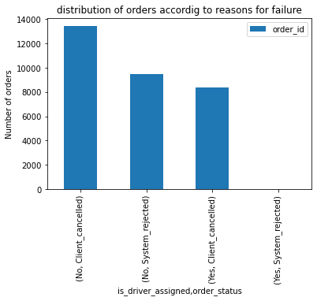
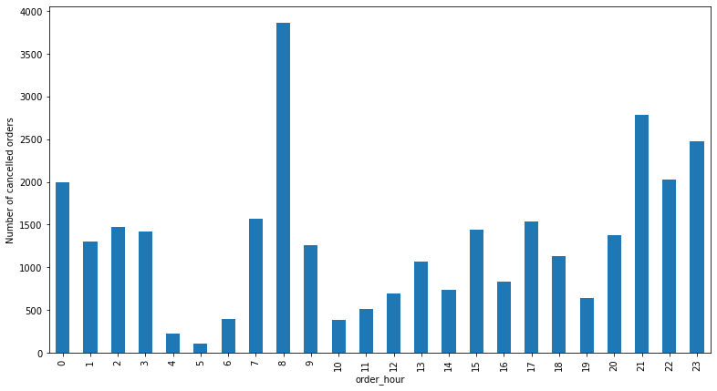
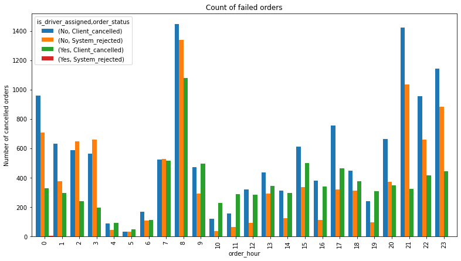
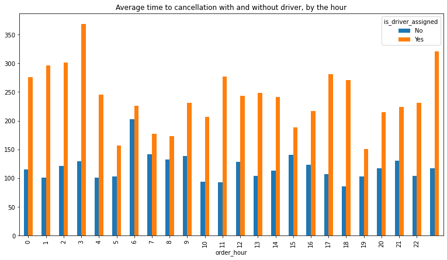
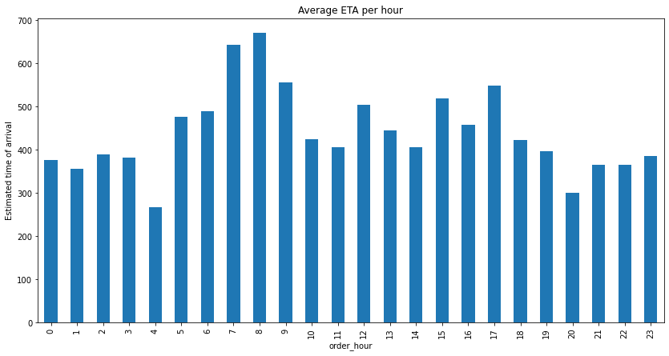

```python
!pwd
import ipython_genutils
```

    /Users/air/Desktop/DS_projects/Failed_orders


# Project: Insights from failed orders

## Table of Contents
<ul>
<li><a href="#intro">Introduction</a></li>
<li><a href="#wrangling">Data Wrangling</a></li>
<li><a href="#EDA">Eploratory Data Analysis</a></li>
<li><a href="#conclusions">Conclusions</a></li>
</ul>

<a id="intro"></a>
## Introduction

Gett, previously known as GetTaxi, is an Israeli-developed technology platform solely focused on corporate Ground Transportation Management (GTM). They have an application where clients can order taxis, and drivers can accept their rides (offers). At the moment, when the client clicks the Order button in the application, the matching system searches for the most relevant drivers and offers them the order. In this task, we would like to investigate some matching metrics for orders that did not completed successfully, i.e., the customer didn't end up getting a car.

It begins by
- building up a distribution of orders accordig to reasons for failure: cancellations before and after driver assignment, and the reason for order rejection, analysing the resulting plot to see which category has the highest number of orders.
- Ploting the distribution of failed orders by hours to identify a thrend of certain hours having abnormally high proportion of one category or another. and also find out what hours are the biggest fails and how that can be explained.
- Plotting the average time to cancellation with and without driver, by the hour to see it there are any outliers within the data and then proceed to remove them and draw further conclusion from the data.
- Plotting the distributio of average ETA by hours and explaining any thrend establisged.
- calculating how many size 8 hexes contain 80% of all orders from the original data sets and visualising the hexes.


## Data Description
We have two data sets: `data_orders` and `data_offers`, both being stored in a CSV format. The `data_orders` data set contains the following columns:

- `order_datetime` - time of the order
- `origin_longitude` - longitude of the order
- `origin_latitude` - latitude of the order
- `m_order_eta` - time before order arrival
- `order_gk` - order number
- `order_status_key` - status, an enumeration consisting of the following mapping:
- `4` - cancelled by client,
- `9` - cancelled by system, i.e., a reject
- `is_driver_assigned_key` - whether a driver has been assigned
- `cancellation_time_in_seconds` - how many seconds passed before cancellation

The `data_offers` data set is a simple map with 2 columns:

- `order_gk` - order number, associated with the same column from the - `orders` data set
- `offer_id` - ID of an offer

<a id="wrangling"></a>
## Data wrangling

Pandas library is used to load the CSVs into a DataFrame


```python
import pandas as pd, numpy as np
```


```python
orders = pd.read_csv('datasets/data_orders.csv')
offers = pd.read_csv('datasets/data_offers.csv')
```


```python
# geta sense of the number of entries and features
orders.shape
```


    (10716, 8)


```python
# investigate missing data
orders.isnull().sum()/orders.shape[0]
```


    order_datetime                   0.000000
    origin_longitude                 0.000000
    origin_latitude                  0.000000
    m_order_eta                      0.737402
    order_gk                         0.000000
    order_status_key                 0.000000
    is_driver_assigned_key           0.000000
    cancellations_time_in_seconds    0.318122
    dtype: float64


m_order_eta and cancellations_time_in_seconds have 73% and 32% of entire data missing respectively


```python
#take a look at samples from the data, while specilfying random_state
# key to enfore determinism(get same sample always)
orders.sample(10,random_state=13)
```


<div>
<style scoped>
    .dataframe tbody tr th:only-of-type {
        vertical-align: middle;
    }

    .dataframe tbody tr th {
        vertical-align: top;
    }

    .dataframe thead th {
        text-align: right;
    }
</style>
<table border="1" class="dataframe">
  <thead>
    <tr style="text-align: right;">
      <th></th>
      <th>order_datetime</th>
      <th>origin_longitude</th>
      <th>origin_latitude</th>
      <th>m_order_eta</th>
      <th>order_gk</th>
      <th>order_status_key</th>
      <th>is_driver_assigned_key</th>
      <th>cancellations_time_in_seconds</th>
    </tr>
  </thead>
  <tbody>
    <tr>
      <th>339</th>
      <td>15:42:16</td>
      <td>-0.922114</td>
      <td>51.451058</td>
      <td>538.0</td>
      <td>3000627981250</td>
      <td>4</td>
      <td>1</td>
      <td>37.0</td>
    </tr>
    <tr>
      <th>7514</th>
      <td>17:49:27</td>
      <td>-0.969326</td>
      <td>51.433188</td>
      <td>658.0</td>
      <td>3000587381462</td>
      <td>4</td>
      <td>1</td>
      <td>109.0</td>
    </tr>
    <tr>
      <th>7918</th>
      <td>00:17:44</td>
      <td>-0.948534</td>
      <td>51.440262</td>
      <td>NaN</td>
      <td>3000600112586</td>
      <td>9</td>
      <td>0</td>
      <td>NaN</td>
    </tr>
    <tr>
      <th>6143</th>
      <td>08:47:39</td>
      <td>-0.956305</td>
      <td>51.443311</td>
      <td>297.0</td>
      <td>3000582165839</td>
      <td>4</td>
      <td>1</td>
      <td>545.0</td>
    </tr>
    <tr>
      <th>8916</th>
      <td>03:24:32</td>
      <td>-0.974736</td>
      <td>51.454823</td>
      <td>60.0</td>
      <td>3000557660390</td>
      <td>4</td>
      <td>1</td>
      <td>57.0</td>
    </tr>
    <tr>
      <th>1064</th>
      <td>08:15:48</td>
      <td>-0.963172</td>
      <td>51.454195</td>
      <td>NaN</td>
      <td>3000623443068</td>
      <td>9</td>
      <td>0</td>
      <td>NaN</td>
    </tr>
    <tr>
      <th>5711</th>
      <td>22:36:55</td>
      <td>-0.956702</td>
      <td>51.443059</td>
      <td>NaN</td>
      <td>3000627506572</td>
      <td>9</td>
      <td>0</td>
      <td>NaN</td>
    </tr>
    <tr>
      <th>2326</th>
      <td>15:24:17</td>
      <td>-1.033644</td>
      <td>51.445660</td>
      <td>297.0</td>
      <td>3000578650723</td>
      <td>4</td>
      <td>1</td>
      <td>19.0</td>
    </tr>
    <tr>
      <th>1966</th>
      <td>03:23:53</td>
      <td>-0.944338</td>
      <td>51.441401</td>
      <td>NaN</td>
      <td>3000595270612</td>
      <td>4</td>
      <td>0</td>
      <td>203.0</td>
    </tr>
    <tr>
      <th>5675</th>
      <td>19:15:22</td>
      <td>-0.973507</td>
      <td>51.449443</td>
      <td>NaN</td>
      <td>3000623717383</td>
      <td>4</td>
      <td>0</td>
      <td>232.0</td>
    </tr>
  </tbody>
</table>
</div>


```python
#inspect the data format and missing numbers in dataset
orders.info()
```

    <class 'pandas.core.frame.DataFrame'>
    RangeIndex: 10716 entries, 0 to 10715
    Data columns (total 8 columns):
     #   Column                         Non-Null Count  Dtype  
    ---  ------                         --------------  -----  
     0   order_datetime                 10716 non-null  object 
     1   origin_longitude               10716 non-null  float64
     2   origin_latitude                10716 non-null  float64
     3   m_order_eta                    2814 non-null   float64
     4   order_gk                       10716 non-null  int64  
     5   order_status_key               10716 non-null  int64  
     6   is_driver_assigned_key         10716 non-null  int64  
     7   cancellations_time_in_seconds  7307 non-null   float64
    dtypes: float64(4), int64(3), object(1)
    memory usage: 669.9+ KB


```python
# change order_datetime from string to datetime format
orders.order_datetime = pd.to_datetime(orders.order_datetime)
orders.info()
```

    <class 'pandas.core.frame.DataFrame'>
    RangeIndex: 10716 entries, 0 to 10715
    Data columns (total 8 columns):
     #   Column                         Non-Null Count  Dtype         
    ---  ------                         --------------  -----         
     0   order_datetime                 10716 non-null  datetime64[ns]
     1   origin_longitude               10716 non-null  float64       
     2   origin_latitude                10716 non-null  float64       
     3   m_order_eta                    2814 non-null   float64       
     4   order_gk                       10716 non-null  int64         
     5   order_status_key               10716 non-null  int64         
     6   is_driver_assigned_key         10716 non-null  int64         
     7   cancellations_time_in_seconds  7307 non-null   float64       
    dtypes: datetime64[ns](1), float64(4), int64(3)
    memory usage: 669.9 KB


```python
orders.sample(10,random_state=13)
```


<div>
<style scoped>
    .dataframe tbody tr th:only-of-type {
        vertical-align: middle;
    }

    .dataframe tbody tr th {
        vertical-align: top;
    }

    .dataframe thead th {
        text-align: right;
    }
</style>
<table border="1" class="dataframe">
  <thead>
    <tr style="text-align: right;">
      <th></th>
      <th>order_datetime</th>
      <th>origin_longitude</th>
      <th>origin_latitude</th>
      <th>m_order_eta</th>
      <th>order_gk</th>
      <th>order_status_key</th>
      <th>is_driver_assigned_key</th>
      <th>cancellations_time_in_seconds</th>
    </tr>
  </thead>
  <tbody>
    <tr>
      <th>339</th>
      <td>2022-12-23 15:42:16</td>
      <td>-0.922114</td>
      <td>51.451058</td>
      <td>538.0</td>
      <td>3000627981250</td>
      <td>4</td>
      <td>1</td>
      <td>37.0</td>
    </tr>
    <tr>
      <th>7514</th>
      <td>2022-12-23 17:49:27</td>
      <td>-0.969326</td>
      <td>51.433188</td>
      <td>658.0</td>
      <td>3000587381462</td>
      <td>4</td>
      <td>1</td>
      <td>109.0</td>
    </tr>
    <tr>
      <th>7918</th>
      <td>2022-12-23 00:17:44</td>
      <td>-0.948534</td>
      <td>51.440262</td>
      <td>NaN</td>
      <td>3000600112586</td>
      <td>9</td>
      <td>0</td>
      <td>NaN</td>
    </tr>
    <tr>
      <th>6143</th>
      <td>2022-12-23 08:47:39</td>
      <td>-0.956305</td>
      <td>51.443311</td>
      <td>297.0</td>
      <td>3000582165839</td>
      <td>4</td>
      <td>1</td>
      <td>545.0</td>
    </tr>
    <tr>
      <th>8916</th>
      <td>2022-12-23 03:24:32</td>
      <td>-0.974736</td>
      <td>51.454823</td>
      <td>60.0</td>
      <td>3000557660390</td>
      <td>4</td>
      <td>1</td>
      <td>57.0</td>
    </tr>
    <tr>
      <th>1064</th>
      <td>2022-12-23 08:15:48</td>
      <td>-0.963172</td>
      <td>51.454195</td>
      <td>NaN</td>
      <td>3000623443068</td>
      <td>9</td>
      <td>0</td>
      <td>NaN</td>
    </tr>
    <tr>
      <th>5711</th>
      <td>2022-12-23 22:36:55</td>
      <td>-0.956702</td>
      <td>51.443059</td>
      <td>NaN</td>
      <td>3000627506572</td>
      <td>9</td>
      <td>0</td>
      <td>NaN</td>
    </tr>
    <tr>
      <th>2326</th>
      <td>2022-12-23 15:24:17</td>
      <td>-1.033644</td>
      <td>51.445660</td>
      <td>297.0</td>
      <td>3000578650723</td>
      <td>4</td>
      <td>1</td>
      <td>19.0</td>
    </tr>
    <tr>
      <th>1966</th>
      <td>2022-12-23 03:23:53</td>
      <td>-0.944338</td>
      <td>51.441401</td>
      <td>NaN</td>
      <td>3000595270612</td>
      <td>4</td>
      <td>0</td>
      <td>203.0</td>
    </tr>
    <tr>
      <th>5675</th>
      <td>2022-12-23 19:15:22</td>
      <td>-0.973507</td>
      <td>51.449443</td>
      <td>NaN</td>
      <td>3000623717383</td>
      <td>4</td>
      <td>0</td>
      <td>232.0</td>
    </tr>
  </tbody>
</table>
</div>


```python
# geta sense of the number of entries and features
offers.shape
```


    (334363, 2)


```python
#investigate missing values
offers.isnull().sum()
```


    order_gk    0
    offer_id    0
    dtype: int64


```python
# investigate data types
offers.info()
```

    <class 'pandas.core.frame.DataFrame'>
    RangeIndex: 334363 entries, 0 to 334362
    Data columns (total 2 columns):
     #   Column    Non-Null Count   Dtype
    ---  ------    --------------   -----
     0   order_gk  334363 non-null  int64
     1   offer_id  334363 non-null  int64
    dtypes: int64(2)
    memory usage: 5.1 MB


```python
#  view samples of the data
offers.sample(10,random_state=13)
```


<div>
<style scoped>
    .dataframe tbody tr th:only-of-type {
        vertical-align: middle;
    }

    .dataframe tbody tr th {
        vertical-align: top;
    }

    .dataframe thead th {
        text-align: right;
    }
</style>
<table border="1" class="dataframe">
  <thead>
    <tr style="text-align: right;">
      <th></th>
      <th>order_gk</th>
      <th>offer_id</th>
    </tr>
  </thead>
  <tbody>
    <tr>
      <th>187474</th>
      <td>3000596421448</td>
      <td>300051566747</td>
    </tr>
    <tr>
      <th>147870</th>
      <td>3000628807245</td>
      <td>300052187786</td>
    </tr>
    <tr>
      <th>77639</th>
      <td>3000623790996</td>
      <td>300051869966</td>
    </tr>
    <tr>
      <th>292490</th>
      <td>3000625092591</td>
      <td>300051972070</td>
    </tr>
    <tr>
      <th>38540</th>
      <td>3000631156163</td>
      <td>300052331409</td>
    </tr>
    <tr>
      <th>257777</th>
      <td>3000585091766</td>
      <td>300051103545</td>
    </tr>
    <tr>
      <th>66947</th>
      <td>3000627383151</td>
      <td>300052079810</td>
    </tr>
    <tr>
      <th>253560</th>
      <td>3000552920878</td>
      <td>300050611078</td>
    </tr>
    <tr>
      <th>50980</th>
      <td>3000617526191</td>
      <td>300051721402</td>
    </tr>
    <tr>
      <th>167153</th>
      <td>3000628683796</td>
      <td>300052174189</td>
    </tr>
  </tbody>
</table>
</div>


```python
# get common columns in both dataset
all_columns = pd.Series(list(offers)+list(orders))
all_columns[all_columns.duplicated()]
```


    6    order_gk
    dtype: object


Merge the two datasets for easier wrangling and analysis using the `merge()` method, by merging on `order_gk` column and specifying how the merge is carried our by using the `inner` parameter


```python
df = orders.merge(offers,how='inner',on='order_gk')
df.sample(10,random_state=13)
```


<div>
<style scoped>
    .dataframe tbody tr th:only-of-type {
        vertical-align: middle;
    }

    .dataframe tbody tr th {
        vertical-align: top;
    }

    .dataframe thead th {
        text-align: right;
    }
</style>
<table border="1" class="dataframe">
  <thead>
    <tr style="text-align: right;">
      <th></th>
      <th>order_datetime</th>
      <th>origin_longitude</th>
      <th>origin_latitude</th>
      <th>m_order_eta</th>
      <th>order_gk</th>
      <th>order_status_key</th>
      <th>is_driver_assigned_key</th>
      <th>cancellations_time_in_seconds</th>
      <th>offer_id</th>
    </tr>
  </thead>
  <tbody>
    <tr>
      <th>30062</th>
      <td>2022-12-23 22:43:23</td>
      <td>-0.924026</td>
      <td>51.436252</td>
      <td>NaN</td>
      <td>3000590756372</td>
      <td>4</td>
      <td>0</td>
      <td>111.0</td>
      <td>300051333862</td>
    </tr>
    <tr>
      <th>30869</th>
      <td>2022-12-23 22:41:15</td>
      <td>-0.977636</td>
      <td>51.430590</td>
      <td>NaN</td>
      <td>3000593796847</td>
      <td>4</td>
      <td>0</td>
      <td>5.0</td>
      <td>300051443528</td>
    </tr>
    <tr>
      <th>10035</th>
      <td>2022-12-23 19:26:41</td>
      <td>-0.924773</td>
      <td>51.428314</td>
      <td>538.0</td>
      <td>3000588731002</td>
      <td>4</td>
      <td>1</td>
      <td>119.0</td>
      <td>300051234376</td>
    </tr>
    <tr>
      <th>8385</th>
      <td>2022-12-23 12:28:59</td>
      <td>-0.974722</td>
      <td>51.481711</td>
      <td>NaN</td>
      <td>3000579875810</td>
      <td>9</td>
      <td>0</td>
      <td>NaN</td>
      <td>300050940707</td>
    </tr>
    <tr>
      <th>10297</th>
      <td>2022-12-23 08:05:17</td>
      <td>-0.931454</td>
      <td>51.452609</td>
      <td>NaN</td>
      <td>3000557112002</td>
      <td>4</td>
      <td>0</td>
      <td>99.0</td>
      <td>300050753487</td>
    </tr>
    <tr>
      <th>11538</th>
      <td>2022-12-23 23:33:36</td>
      <td>-0.945348</td>
      <td>51.427105</td>
      <td>NaN</td>
      <td>3000625141304</td>
      <td>9</td>
      <td>0</td>
      <td>NaN</td>
      <td>300051974606</td>
    </tr>
    <tr>
      <th>19922</th>
      <td>2022-12-23 01:37:12</td>
      <td>-0.956911</td>
      <td>51.449421</td>
      <td>NaN</td>
      <td>3000595870780</td>
      <td>9</td>
      <td>0</td>
      <td>NaN</td>
      <td>300051550721</td>
    </tr>
    <tr>
      <th>10725</th>
      <td>2022-12-23 20:06:31</td>
      <td>-0.945261</td>
      <td>51.444823</td>
      <td>167.0</td>
      <td>3000588081641</td>
      <td>4</td>
      <td>1</td>
      <td>231.0</td>
      <td>300051199054</td>
    </tr>
    <tr>
      <th>15351</th>
      <td>2022-12-23 17:42:30</td>
      <td>-0.978202</td>
      <td>51.455502</td>
      <td>NaN</td>
      <td>3000598661555</td>
      <td>4</td>
      <td>0</td>
      <td>51.0</td>
      <td>300051622044</td>
    </tr>
    <tr>
      <th>4149</th>
      <td>2022-12-23 10:55:25</td>
      <td>-0.953072</td>
      <td>51.451130</td>
      <td>NaN</td>
      <td>3000556096214</td>
      <td>4</td>
      <td>0</td>
      <td>206.0</td>
      <td>300050737050</td>
    </tr>
  </tbody>
</table>
</div>


It may be prudent to improve the data quality by making the `order_status_key` and `is_driver_assigned_key` more contextualized by assigning `1`s in `is_driver_assigned` with `Yes` and the `0`s with `No`. And also assigning `4`s in `order_status_key` with `Client_cancelled` and `9`s with `System_rejected`


```python
df['is_driver_assigned_key'] = np.where(df['is_driver_assigned_key']==1,'Yes','No')
df['order_status_key'] = np.where(df['order_status_key']==4,'Client_cancelled','System_rejected')
```


```python
# df.query('order_status_key=="Client_cancelled"')
```

Rename columns to be more informative


```python
df.columns
```


    Index(['order_datetime', 'origin_longitude', 'origin_latitude', 'm_order_eta',
           'order_gk', 'order_status_key', 'is_driver_assigned_key',
           'cancellations_time_in_seconds', 'offer_id'],
          dtype='object')


```python
cols = {'order_datetime':'order_time',
        'origin_longitude':'longitude',
        'origin_latitude':'latitude',
         'm_order_eta':'ETA',
         'order_gk':'order_id',
         'order_status_key':'order_status',
         'is_driver_assigned_key':'is_driver_assigned',
        'cancellations_time_in_seconds':'cancellation_time'}

df.rename(columns=cols,inplace=True)
```


```python
df
```


<div>
<style scoped>
    .dataframe tbody tr th:only-of-type {
        vertical-align: middle;
    }

    .dataframe tbody tr th {
        vertical-align: top;
    }

    .dataframe thead th {
        text-align: right;
    }
</style>
<table border="1" class="dataframe">
  <thead>
    <tr style="text-align: right;">
      <th></th>
      <th>order_time</th>
      <th>longitude</th>
      <th>latitude</th>
      <th>ETA</th>
      <th>order_id</th>
      <th>order_status</th>
      <th>is_driver_assigned</th>
      <th>cancellation_time</th>
      <th>offer_id</th>
    </tr>
  </thead>
  <tbody>
    <tr>
      <th>0</th>
      <td>2022-12-23 18:08:07</td>
      <td>-0.978916</td>
      <td>51.456173</td>
      <td>60.0</td>
      <td>3000583041974</td>
      <td>Client_cancelled</td>
      <td>Yes</td>
      <td>198.0</td>
      <td>300050983403</td>
    </tr>
    <tr>
      <th>1</th>
      <td>2022-12-23 20:57:32</td>
      <td>-0.950385</td>
      <td>51.456843</td>
      <td>NaN</td>
      <td>3000583116437</td>
      <td>Client_cancelled</td>
      <td>No</td>
      <td>128.0</td>
      <td>300050986179</td>
    </tr>
    <tr>
      <th>2</th>
      <td>2022-12-23 20:57:32</td>
      <td>-0.950385</td>
      <td>51.456843</td>
      <td>NaN</td>
      <td>3000583116437</td>
      <td>Client_cancelled</td>
      <td>No</td>
      <td>128.0</td>
      <td>300050986174</td>
    </tr>
    <tr>
      <th>3</th>
      <td>2022-12-23 20:57:32</td>
      <td>-0.950385</td>
      <td>51.456843</td>
      <td>NaN</td>
      <td>3000583116437</td>
      <td>Client_cancelled</td>
      <td>No</td>
      <td>128.0</td>
      <td>300050986180</td>
    </tr>
    <tr>
      <th>4</th>
      <td>2022-12-23 12:07:50</td>
      <td>-0.969520</td>
      <td>51.455544</td>
      <td>477.0</td>
      <td>3000582891479</td>
      <td>Client_cancelled</td>
      <td>Yes</td>
      <td>46.0</td>
      <td>300050976275</td>
    </tr>
    <tr>
      <th>...</th>
      <td>...</td>
      <td>...</td>
      <td>...</td>
      <td>...</td>
      <td>...</td>
      <td>...</td>
      <td>...</td>
      <td>...</td>
      <td>...</td>
    </tr>
    <tr>
      <th>31263</th>
      <td>2022-12-23 12:44:11</td>
      <td>-0.975372</td>
      <td>51.457846</td>
      <td>NaN</td>
      <td>3000597886155</td>
      <td>Client_cancelled</td>
      <td>No</td>
      <td>43.0</td>
      <td>300051590196</td>
    </tr>
    <tr>
      <th>31264</th>
      <td>2022-12-23 12:42:52</td>
      <td>-0.975372</td>
      <td>51.457846</td>
      <td>NaN</td>
      <td>3000597886140</td>
      <td>Client_cancelled</td>
      <td>No</td>
      <td>44.0</td>
      <td>300051590176</td>
    </tr>
    <tr>
      <th>31265</th>
      <td>2022-12-23 13:11:35</td>
      <td>-0.975372</td>
      <td>51.457846</td>
      <td>NaN</td>
      <td>3000599186906</td>
      <td>Client_cancelled</td>
      <td>No</td>
      <td>36.0</td>
      <td>300051648809</td>
    </tr>
    <tr>
      <th>31266</th>
      <td>2022-12-23 13:17:21</td>
      <td>-0.972926</td>
      <td>51.457693</td>
      <td>60.0</td>
      <td>3000599187034</td>
      <td>Client_cancelled</td>
      <td>Yes</td>
      <td>34.0</td>
      <td>300051648910</td>
    </tr>
    <tr>
      <th>31267</th>
      <td>2022-12-23 11:49:35</td>
      <td>-0.974738</td>
      <td>51.458180</td>
      <td>177.0</td>
      <td>3000592871241</td>
      <td>Client_cancelled</td>
      <td>Yes</td>
      <td>40.0</td>
      <td>300051391527</td>
    </tr>
  </tbody>
</table>
<p>31268 rows × 9 columns</p>
</div>


<a id="EDA"></a>

## Exploratory Data Analysis

## **Question 1**

**Building up a distribution of orders accordig to reasons for failure: cancellations before and after driver assignment, and the reason for order rejection, analysing the resulting plot to see which category has the highest number of orders.**

This is evalutated by using pandas groupby method to group the table by the columns `is_driver_assigned` and `order_status` and counting the number of orders in `order_id` 


```python
cancellations = df.groupby(['is_driver_assigned','order_status'])['order_id'].count()
cancellations
```


    is_driver_assigned  order_status    
    No                  Client_cancelled    13435
                        System_rejected      9469
    Yes                 Client_cancelled     8360
                        System_rejected         4
    Name: order_id, dtype: int64


It is obserevd that a high number of clients cancelled their order before a driver was assigned, implying that probably customers had dwaited too long to be assigned a driver and decided on other alternaive transport means. There are `13435` order cancelled by the client, and `9464` rejected by the system. While there are `8360` orders cancelled by the clients after driver was assigned and only `4` rejected by the system


```python

```


```python
_=cancellations.plot(kind='bar',legend=True,subplots=False,\
                   ylabel='Number of orders',\
                   title='distribution of orders accordig to reasons for failure');
```


    

    


## **Question 2**

**Ploting the distribution of failed orders by hours to identify a thrend of certain hours having abnormally high proportion of one category or another. and also find out what hours are the biggest fails and how that can be explained**

This further builds on the previous question by looking at the time when these fails occured in an effort establish a thrend. To do this the hour of day is extracted from the datetime colums and the failed orders are counted by hour.  


```python
# Extract hour fro datetime column
df['order_hour'] = df.order_time.dt.hour
```


```python
df.sample(4,random_state=13)
```


<div>
<style scoped>
    .dataframe tbody tr th:only-of-type {
        vertical-align: middle;
    }

    .dataframe tbody tr th {
        vertical-align: top;
    }

    .dataframe thead th {
        text-align: right;
    }
</style>
<table border="1" class="dataframe">
  <thead>
    <tr style="text-align: right;">
      <th></th>
      <th>order_time</th>
      <th>longitude</th>
      <th>latitude</th>
      <th>ETA</th>
      <th>order_id</th>
      <th>order_status</th>
      <th>is_driver_assigned</th>
      <th>cancellation_time</th>
      <th>offer_id</th>
      <th>order_hour</th>
    </tr>
  </thead>
  <tbody>
    <tr>
      <th>30062</th>
      <td>2022-12-23 22:43:23</td>
      <td>-0.924026</td>
      <td>51.436252</td>
      <td>NaN</td>
      <td>3000590756372</td>
      <td>Client_cancelled</td>
      <td>No</td>
      <td>111.0</td>
      <td>300051333862</td>
      <td>22</td>
    </tr>
    <tr>
      <th>30869</th>
      <td>2022-12-23 22:41:15</td>
      <td>-0.977636</td>
      <td>51.430590</td>
      <td>NaN</td>
      <td>3000593796847</td>
      <td>Client_cancelled</td>
      <td>No</td>
      <td>5.0</td>
      <td>300051443528</td>
      <td>22</td>
    </tr>
    <tr>
      <th>10035</th>
      <td>2022-12-23 19:26:41</td>
      <td>-0.924773</td>
      <td>51.428314</td>
      <td>538.0</td>
      <td>3000588731002</td>
      <td>Client_cancelled</td>
      <td>Yes</td>
      <td>119.0</td>
      <td>300051234376</td>
      <td>19</td>
    </tr>
    <tr>
      <th>8385</th>
      <td>2022-12-23 12:28:59</td>
      <td>-0.974722</td>
      <td>51.481711</td>
      <td>NaN</td>
      <td>3000579875810</td>
      <td>System_rejected</td>
      <td>No</td>
      <td>NaN</td>
      <td>300050940707</td>
      <td>12</td>
    </tr>
  </tbody>
</table>
</div>


```python
_ = df.groupby('order_hour')['order_id'].count().\
            plot(kind='bar',figsize=(13,7),ylabel='Number of cancelled orders'),

```


    

    


From the bar chart above , it is seen that the biggest fails occurred at `8:00`,followed by `21:00` and `23:00`

Failed orders are further investigated by hour by category, to obtain deeper insights into the cancelations by category.


```python
q2 = df.groupby(['order_hour','is_driver_assigned','order_status'])['order_id'].count()
q2                             
```


    order_hour  is_driver_assigned  order_status    
    0           No                  Client_cancelled     957
                                    System_rejected      706
                Yes                 Client_cancelled     326
                                    System_rejected        4
    1           No                  Client_cancelled     633
                                                        ... 
    22          No                  System_rejected      660
                Yes                 Client_cancelled     415
    23          No                  Client_cancelled    1144
                                    System_rejected      883
                Yes                 Client_cancelled     444
    Name: order_id, Length: 73, dtype: int64


```python
q2.reset_index().pivot(index='order_hour',
         columns=['is_driver_assigned','order_status'],
         values = 'order_id').plot(kind='bar',xticks=range(0,24),
                            figsize=(13,7),width=1,
                            title='Count of failed orders',
                            ylabel= 'Number of cancelled orders');
```


    

    


From the breakdown of the above bar chart, it is seen that the highes cancelation accross all categories indeed occurred at 8:00.  

## **Question 3**

**Ploting the average time to cancellation with and without driver, by the hour to see it there are any outliers within the data and then proceed to remove them and draw further conclusion from the data**

Again, the same approached as taken with the previous questions are employed. the dataframe is aggregated by the `order_hour` and `is_driver_assigned`, and then `cancelletion_time` is aggregated with the `mean` function  


```python
q3 = df.groupby(['order_hour','is_driver_assigned'])['cancellation_time'].mean()
q3
```


    order_hour  is_driver_assigned
    0           No                    115.126437
                Yes                   276.082822
    1           No                    100.593997
                Yes                   296.312081
    2           No                    121.305461
                Yes                   301.466667
    3           No                    129.182301
                Yes                   368.682051
    4           No                    100.733333
                Yes                   245.250000
    5           No                    102.838710
                Yes                   156.617021
    6           No                    202.952663
                Yes                   225.508772
    7           No                    141.177820
                Yes                   177.640232
    8           No                    132.625432
                Yes                   172.896296
    9           No                    138.014894
                Yes                   230.821862
    10          No                     93.795082
                Yes                   206.447368
    11          No                     93.090323
                Yes                   276.793103
    12          No                    128.224299
                Yes                   243.000000
    13          No                    103.577982
                Yes                   248.301170
    14          No                    112.752412
                Yes                   241.367003
    15          No                    140.970492
                Yes                   188.380762
    16          No                    123.181102
                Yes                   217.126844
    17          No                    106.842593
                Yes                   280.782796
    18          No                     85.845638
                Yes                   270.277333
    19          No                    103.231405
                Yes                   151.039088
    20          No                    117.518072
                Yes                   214.517341
    21          No                    130.828290
                Yes                   224.443077
    22          No                    103.662474
                Yes                   230.720482
    23          No                    117.294580
                Yes                   320.189189
    Name: cancellation_time, dtype: float64


```python
q3.reset_index().pivot(index='order_hour',
         columns='is_driver_assigned',
         values='cancellation_time').plot(kind='bar',
                                          xticks=range(0,23),
                                          figsize=(13,7),
                                          title='Average time to cancellation with and without driver, by the hour');
```


    

    


The average time to cancellation is higher on with an assigned driver than those without assigned driver for each hour without exception.The peak occurred at 3:00. At this time there are a lot of client cancellations, so a logical explanation would be that clients have waited too long for the driver.

## **Question 4**
Plotting the distributio of average ETA by hours and explaining any thrend establisged.

We simply group-by the DataFrame on the order hour, and aggregate the m_order_eta column with a mean function. Then, we plot the resulting DataFrame. The result is in the cell immediately below.


```python
_ = df.groupby(by="order_hour")["ETA"].mean().plot(kind='bar',figsize=(14, 7),
                     xticks=range(0, 24),
                     ylabel='Estimated time of arrival',
                     title="Average ETA per hour")
```


    

    


The bar chats very closely matches the count of failed orders per hour, indicating that the number of failed orders increases as the average waiting time of the client increases.

## **Question 5**
**calculating how many size 8 hexes contain 80% of all orders from the original data sets and visualising the hexes**


```python
import h3
import folium
```


```python
df["hex_id"] = df.apply(
    func=lambda row: h3.geo_to_h3(lat=row["latitude"], lng=row["longitude"],\
                                  resolution=8), axis=1)

```


```python
grouped_q5 = df.groupby(by='hex_id')["order_id"].count()
grouped_q5.shape
```


    (139,)


```python
grouped_q5 = grouped_q5.reset_index()
grouped_q5.sample(n=5,random_state=42)
```


<div>
<style scoped>
    .dataframe tbody tr th:only-of-type {
        vertical-align: middle;
    }

    .dataframe tbody tr th {
        vertical-align: top;
    }

    .dataframe thead th {
        text-align: right;
    }
</style>
<table border="1" class="dataframe">
  <thead>
    <tr style="text-align: right;">
      <th></th>
      <th>hex_id</th>
      <th>order_id</th>
    </tr>
  </thead>
  <tbody>
    <tr>
      <th>135</th>
      <td>88195d74d1fffff</td>
      <td>1</td>
    </tr>
    <tr>
      <th>66</th>
      <td>88195d2a33fffff</td>
      <td>12</td>
    </tr>
    <tr>
      <th>31</th>
      <td>88195d2941fffff</td>
      <td>52</td>
    </tr>
    <tr>
      <th>118</th>
      <td>88195d2b5dfffff</td>
      <td>31</td>
    </tr>
    <tr>
      <th>42</th>
      <td>88195d2961fffff</td>
      <td>5</td>
    </tr>
  </tbody>
</table>
</div>


To find the number of hexes that contain 80% of the orders, we will apply a cumulative percentage operation over the order_id count column in the grouped_q5 DataFrame. This consists of the following steps:
1. Sort the DataFrame by the count. 
2. Find the total number (sum) of failed orders. 
3. Apply the method cumsum to find the cumulative sum of the order count column. 
4. Divide by the total sum to generate percentages. 
5. Filter to find the row that is closest to 80%.


```python
grouped_q5 = grouped_q5.sort_values(by="order_id") # 1
total_orders = grouped_q5["order_id"].sum() # 2
grouped_q5["cum_sum"] = grouped_q5["order_id"].cumsum() # 3
grouped_q5["cum_perc"] = 100 * grouped_q5["cum_sum"] / total_orders # 4
grouped_q5[grouped_q5["cum_perc"] <= 80] # 5
```


<div>
<style scoped>
    .dataframe tbody tr th:only-of-type {
        vertical-align: middle;
    }

    .dataframe tbody tr th {
        vertical-align: top;
    }

    .dataframe thead th {
        text-align: right;
    }
</style>
<table border="1" class="dataframe">
  <thead>
    <tr style="text-align: right;">
      <th></th>
      <th>hex_id</th>
      <th>order_id</th>
      <th>cum_sum</th>
      <th>cum_perc</th>
    </tr>
  </thead>
  <tbody>
    <tr>
      <th>137</th>
      <td>88195d74d5fffff</td>
      <td>1</td>
      <td>1</td>
      <td>0.003198</td>
    </tr>
    <tr>
      <th>135</th>
      <td>88195d74d1fffff</td>
      <td>1</td>
      <td>2</td>
      <td>0.006396</td>
    </tr>
    <tr>
      <th>79</th>
      <td>88195d2aebfffff</td>
      <td>1</td>
      <td>3</td>
      <td>0.009594</td>
    </tr>
    <tr>
      <th>11</th>
      <td>88195d282bfffff</td>
      <td>1</td>
      <td>4</td>
      <td>0.012793</td>
    </tr>
    <tr>
      <th>122</th>
      <td>88195d3993fffff</td>
      <td>1</td>
      <td>5</td>
      <td>0.015991</td>
    </tr>
    <tr>
      <th>...</th>
      <td>...</td>
      <td>...</td>
      <td>...</td>
      <td>...</td>
    </tr>
    <tr>
      <th>61</th>
      <td>88195d2a27fffff</td>
      <td>1295</td>
      <td>15628</td>
      <td>49.980811</td>
    </tr>
    <tr>
      <th>20</th>
      <td>88195d284dfffff</td>
      <td>1937</td>
      <td>17565</td>
      <td>56.175643</td>
    </tr>
    <tr>
      <th>91</th>
      <td>88195d2b19fffff</td>
      <td>1960</td>
      <td>19525</td>
      <td>62.444032</td>
    </tr>
    <tr>
      <th>87</th>
      <td>88195d2b11fffff</td>
      <td>2191</td>
      <td>21716</td>
      <td>69.451196</td>
    </tr>
    <tr>
      <th>89</th>
      <td>88195d2b15fffff</td>
      <td>2461</td>
      <td>24177</td>
      <td>77.321863</td>
    </tr>
  </tbody>
</table>
<p>137 rows × 4 columns</p>
</div>


There are 137 rows in the final output, and 139 rows in the original grouped DataFrame, meaning that 137 hexagons contain around 80% of data, and only 2 hexagons contain the other 20%!


```python
map = folium.Map(location=[df["latitude"].mean(), df["longitude"].mean()],
 zoom_start=8.5, # after a bit of experimentation, we thought this presents the map best
 tiles="cartodbpositron")
```


```python
import json
import geojson
def to_geojson(row):    
    """
    Transform hex_id into a geojson object.
    """
    geometry = {
    "type": "Polygon",
    "coordinates": [h3.h3_to_geo_boundary(h=row["hex_id"], geo_json=True)]
                }
    result = geojson.Feature(id=row["hex_id"], geometry=geometry, properties={"order_id":row['order_id']})
    return result
                                                                                                                                                
geojsons = grouped_q5.apply(func=to_geojson, axis=1).values.tolist()
geojson_str: str = json.dumps(geojson.FeatureCollection(geojsons))
                                                                              
```


```python

import matplotlib
# instantiate a colormap object for better visualisation
colormap = matplotlib.cm.get_cmap(name="plasma")
max_order_gk = grouped_q5["order_id"].max()
min_order_gk = grouped_q5["order_id"].min()

```


```python

```


```python
_ = folium.GeoJson(data=geojson_str, style_function=lambda f: {
 "fillColor": matplotlib.colors.to_hex(
 colormap((f["properties"]["order_id"]-min_order_gk)/(max_order_gk - min_order_gk))),
 "color": "black",
 "weight": 1,
 "fillOpacity": 0.7
}).add_to(map)
```


```python
map
```


<div style="width:100%;"><div style="position:relative;width:100%;height:0;padding-bottom:60%;"><span style="color:#565656">Make this Notebook Trusted to load map: File -> Trust Notebook</span><iframe srcdoc="&lt;!DOCTYPE html&gt;
&lt;html&gt;
&lt;head&gt;

    &lt;meta http-equiv=&quot;content-type&quot; content=&quot;text/html; charset=UTF-8&quot; /&gt;

        &lt;script&gt;
            L_NO_TOUCH = false;
            L_DISABLE_3D = false;
        &lt;/script&gt;

    &lt;style&gt;html, body {width: 100%;height: 100%;margin: 0;padding: 0;}&lt;/style&gt;
    &lt;style&gt;#map {position:absolute;top:0;bottom:0;right:0;left:0;}&lt;/style&gt;
    &lt;script src=&quot;https://cdn.jsdelivr.net/npm/leaflet@1.9.3/dist/leaflet.js&quot;&gt;&lt;/script&gt;
    &lt;script src=&quot;https://code.jquery.com/jquery-1.12.4.min.js&quot;&gt;&lt;/script&gt;
    &lt;script src=&quot;https://cdn.jsdelivr.net/npm/bootstrap@5.2.2/dist/js/bootstrap.bundle.min.js&quot;&gt;&lt;/script&gt;
    &lt;script src=&quot;https://cdnjs.cloudflare.com/ajax/libs/Leaflet.awesome-markers/2.0.2/leaflet.awesome-markers.js&quot;&gt;&lt;/script&gt;
    &lt;link rel=&quot;stylesheet&quot; href=&quot;https://cdn.jsdelivr.net/npm/leaflet@1.9.3/dist/leaflet.css&quot;/&gt;
    &lt;link rel=&quot;stylesheet&quot; href=&quot;https://cdn.jsdelivr.net/npm/bootstrap@5.2.2/dist/css/bootstrap.min.css&quot;/&gt;
    &lt;link rel=&quot;stylesheet&quot; href=&quot;https://netdna.bootstrapcdn.com/bootstrap/3.0.0/css/bootstrap.min.css&quot;/&gt;
    &lt;link rel=&quot;stylesheet&quot; href=&quot;https://cdn.jsdelivr.net/npm/@fortawesome/fontawesome-free@6.2.0/css/all.min.css&quot;/&gt;
    &lt;link rel=&quot;stylesheet&quot; href=&quot;https://cdnjs.cloudflare.com/ajax/libs/Leaflet.awesome-markers/2.0.2/leaflet.awesome-markers.css&quot;/&gt;
    &lt;link rel=&quot;stylesheet&quot; href=&quot;https://cdn.jsdelivr.net/gh/python-visualization/folium/folium/templates/leaflet.awesome.rotate.min.css&quot;/&gt;

            &lt;meta name=&quot;viewport&quot; content=&quot;width=device-width,
                initial-scale=1.0, maximum-scale=1.0, user-scalable=no&quot; /&gt;
            &lt;style&gt;
                #map_dca7d8a8359ae989d8faaa98e57b3df9 {
                    position: relative;
                    width: 100.0%;
                    height: 100.0%;
                    left: 0.0%;
                    top: 0.0%;
                }
                .leaflet-container { font-size: 1rem; }
            &lt;/style&gt;

&lt;/head&gt;
&lt;body&gt;


            &lt;div class=&quot;folium-map&quot; id=&quot;map_dca7d8a8359ae989d8faaa98e57b3df9&quot; &gt;&lt;/div&gt;

&lt;/body&gt;
&lt;script&gt;


            var map_dca7d8a8359ae989d8faaa98e57b3df9 = L.map(
                &quot;map_dca7d8a8359ae989d8faaa98e57b3df9&quot;,
                {
                    center: [51.45059378559466, -0.9641223669886533],
                    crs: L.CRS.EPSG3857,
                    zoom: 8.5,
                    zoomControl: true,
                    preferCanvas: false,
                }
            );


            var tile_layer_ed0e51cf7733a6b505b191995fe78050 = L.tileLayer(
                &quot;https://cartodb-basemaps-{s}.global.ssl.fastly.net/light_all/{z}/{x}/{y}.png&quot;,
                {&quot;attribution&quot;: &quot;\u0026copy; \u003ca target=\&quot;_blank\&quot; href=\&quot;http://www.openstreetmap.org/copyright\&quot;\u003eOpenStreetMap\u003c/a\u003e contributors \u0026copy; \u003ca target=\&quot;_blank\&quot; href=\&quot;http://cartodb.com/attributions\&quot;\u003eCartoDB\u003c/a\u003e, CartoDB \u003ca target=\&quot;_blank\&quot; href =\&quot;http://cartodb.com/attributions\&quot;\u003eattributions\u003c/a\u003e&quot;, &quot;detectRetina&quot;: false, &quot;maxNativeZoom&quot;: 18, &quot;maxZoom&quot;: 18, &quot;minZoom&quot;: 0, &quot;noWrap&quot;: false, &quot;opacity&quot;: 1, &quot;subdomains&quot;: &quot;abc&quot;, &quot;tms&quot;: false}
            ).addTo(map_dca7d8a8359ae989d8faaa98e57b3df9);


        function geo_json_78a15611dd770503a39018e754dcdd92_styler(feature) {
            switch(feature.id) {
                case &quot;88195d2a29fffff&quot;: case &quot;88195d2a03fffff&quot;: case &quot;88195d2b6bfffff&quot;: case &quot;88195d2a07fffff&quot;: case &quot;88195d284bfffff&quot;: case &quot;88195d2a67fffff&quot;: case &quot;88195d2b5dfffff&quot;: case &quot;88195d2a15fffff&quot;: case &quot;88195d283dfffff&quot;: case &quot;88195d2b59fffff&quot;: 
                    return {&quot;color&quot;: &quot;black&quot;, &quot;fillColor&quot;: &quot;#100788&quot;, &quot;fillOpacity&quot;: 0.7, &quot;weight&quot;: 1};
                case &quot;88195d2947fffff&quot;: case &quot;88195d2a39fffff&quot;: case &quot;88195d7493fffff&quot;: case &quot;88195d2b21fffff&quot;: case &quot;88195d294dfffff&quot;: case &quot;88195d2b29fffff&quot;: case &quot;88195d2a17fffff&quot;: case &quot;88195d2809fffff&quot;: case &quot;88195d2b2bfffff&quot;: case &quot;88195d2b4bfffff&quot;: case &quot;88195d2a69fffff&quot;: case &quot;88195d39b7fffff&quot;: case &quot;88195d286dfffff&quot;: case &quot;88195d2941fffff&quot;: case &quot;88195d295bfffff&quot;: 
                    return {&quot;color&quot;: &quot;black&quot;, &quot;fillColor&quot;: &quot;#130789&quot;, &quot;fillOpacity&quot;: 0.7, &quot;weight&quot;: 1};
                case &quot;88195d2a37fffff&quot;: case &quot;88195d296bfffff&quot;: case &quot;88195d2943fffff&quot;: case &quot;88195d2949fffff&quot;: case &quot;88195d2801fffff&quot;: 
                    return {&quot;color&quot;: &quot;black&quot;, &quot;fillColor&quot;: &quot;#16078a&quot;, &quot;fillOpacity&quot;: 0.7, &quot;weight&quot;: 1};
                case &quot;88195d2b43fffff&quot;: case &quot;88195d2a3dfffff&quot;: case &quot;88195d2b33fffff&quot;: 
                    return {&quot;color&quot;: &quot;black&quot;, &quot;fillColor&quot;: &quot;#19068c&quot;, &quot;fillOpacity&quot;: 0.7, &quot;weight&quot;: 1};
                case &quot;88195d2a2dfffff&quot;: case &quot;88195d2b35fffff&quot;: case &quot;88195d294bfffff&quot;: case &quot;88195d2b37fffff&quot;: case &quot;88195d2829fffff&quot;: 
                    return {&quot;color&quot;: &quot;black&quot;, &quot;fillColor&quot;: &quot;#1b068d&quot;, &quot;fillOpacity&quot;: 0.7, &quot;weight&quot;: 1};
                case &quot;88195d2b47fffff&quot;: case &quot;88195d2a2bfffff&quot;: case &quot;88195d285dfffff&quot;: case &quot;88195d280dfffff&quot;: case &quot;88195d286bfffff&quot;: case &quot;88195d2b01fffff&quot;: 
                    return {&quot;color&quot;: &quot;black&quot;, &quot;fillColor&quot;: &quot;#1d068e&quot;, &quot;fillOpacity&quot;: 0.7, &quot;weight&quot;: 1};
                case &quot;88195d2849fffff&quot;: case &quot;88195d2b23fffff&quot;: 
                    return {&quot;color&quot;: &quot;black&quot;, &quot;fillColor&quot;: &quot;#20068f&quot;, &quot;fillOpacity&quot;: 0.7, &quot;weight&quot;: 1};
                case &quot;88195d2867fffff&quot;: case &quot;88195d282dfffff&quot;: 
                    return {&quot;color&quot;: &quot;black&quot;, &quot;fillColor&quot;: &quot;#220690&quot;, &quot;fillOpacity&quot;: 0.7, &quot;weight&quot;: 1};
                case &quot;88195d2863fffff&quot;: 
                    return {&quot;color&quot;: &quot;black&quot;, &quot;fillColor&quot;: &quot;#240691&quot;, &quot;fillOpacity&quot;: 0.7, &quot;weight&quot;: 1};
                case &quot;88195d2b07fffff&quot;: 
                    return {&quot;color&quot;: &quot;black&quot;, &quot;fillColor&quot;: &quot;#260591&quot;, &quot;fillOpacity&quot;: 0.7, &quot;weight&quot;: 1};
                case &quot;88195d2843fffff&quot;: case &quot;88195d2a35fffff&quot;: case &quot;88195d2a23fffff&quot;: 
                    return {&quot;color&quot;: &quot;black&quot;, &quot;fillColor&quot;: &quot;#280592&quot;, &quot;fillOpacity&quot;: 0.7, &quot;weight&quot;: 1};
                case &quot;88195d2841fffff&quot;: case &quot;88195d2b55fffff&quot;: case &quot;88195d2847fffff&quot;: case &quot;88195d2b0dfffff&quot;: 
                    return {&quot;color&quot;: &quot;black&quot;, &quot;fillColor&quot;: &quot;#2a0593&quot;, &quot;fillOpacity&quot;: 0.7, &quot;weight&quot;: 1};
                case &quot;88195d2b09fffff&quot;: case &quot;88195d2845fffff&quot;: 
                    return {&quot;color&quot;: &quot;black&quot;, &quot;fillColor&quot;: &quot;#2f0596&quot;, &quot;fillOpacity&quot;: 0.7, &quot;weight&quot;: 1};
                case &quot;88195d2b51fffff&quot;: 
                    return {&quot;color&quot;: &quot;black&quot;, &quot;fillColor&quot;: &quot;#310597&quot;, &quot;fillOpacity&quot;: 0.7, &quot;weight&quot;: 1};
                case &quot;88195d2b57fffff&quot;: 
                    return {&quot;color&quot;: &quot;black&quot;, &quot;fillColor&quot;: &quot;#330597&quot;, &quot;fillOpacity&quot;: 0.7, &quot;weight&quot;: 1};
                case &quot;88195d2b3bfffff&quot;: 
                    return {&quot;color&quot;: &quot;black&quot;, &quot;fillColor&quot;: &quot;#3a049a&quot;, &quot;fillOpacity&quot;: 0.7, &quot;weight&quot;: 1};
                case &quot;88195d2869fffff&quot;: 
                    return {&quot;color&quot;: &quot;black&quot;, &quot;fillColor&quot;: &quot;#3c049b&quot;, &quot;fillOpacity&quot;: 0.7, &quot;weight&quot;: 1};
                case &quot;88195d2b3dfffff&quot;: 
                    return {&quot;color&quot;: &quot;black&quot;, &quot;fillColor&quot;: &quot;#3f049c&quot;, &quot;fillOpacity&quot;: 0.7, &quot;weight&quot;: 1};
                case &quot;88195d2a21fffff&quot;: 
                    return {&quot;color&quot;: &quot;black&quot;, &quot;fillColor&quot;: &quot;#41049d&quot;, &quot;fillOpacity&quot;: 0.7, &quot;weight&quot;: 1};
                case &quot;88195d2b31fffff&quot;: 
                    return {&quot;color&quot;: &quot;black&quot;, &quot;fillColor&quot;: &quot;#46039f&quot;, &quot;fillOpacity&quot;: 0.7, &quot;weight&quot;: 1};
                case &quot;88195d2861fffff&quot;: 
                    return {&quot;color&quot;: &quot;black&quot;, &quot;fillColor&quot;: &quot;#48039f&quot;, &quot;fillOpacity&quot;: 0.7, &quot;weight&quot;: 1};
                case &quot;88195d2b39fffff&quot;: 
                    return {&quot;color&quot;: &quot;black&quot;, &quot;fillColor&quot;: &quot;#4b03a1&quot;, &quot;fillOpacity&quot;: 0.7, &quot;weight&quot;: 1};
                case &quot;88195d2b17fffff&quot;: 
                    return {&quot;color&quot;: &quot;black&quot;, &quot;fillColor&quot;: &quot;#4e02a2&quot;, &quot;fillOpacity&quot;: 0.7, &quot;weight&quot;: 1};
                case &quot;88195d2b03fffff&quot;: 
                    return {&quot;color&quot;: &quot;black&quot;, &quot;fillColor&quot;: &quot;#5c01a6&quot;, &quot;fillOpacity&quot;: 0.7, &quot;weight&quot;: 1};
                case &quot;88195d2b13fffff&quot;: 
                    return {&quot;color&quot;: &quot;black&quot;, &quot;fillColor&quot;: &quot;#7100a8&quot;, &quot;fillOpacity&quot;: 0.7, &quot;weight&quot;: 1};
                case &quot;88195d2a25fffff&quot;: 
                    return {&quot;color&quot;: &quot;black&quot;, &quot;fillColor&quot;: &quot;#7a02a8&quot;, &quot;fillOpacity&quot;: 0.7, &quot;weight&quot;: 1};
                case &quot;88195d2b0bfffff&quot;: 
                    return {&quot;color&quot;: &quot;black&quot;, &quot;fillColor&quot;: &quot;#7b02a8&quot;, &quot;fillOpacity&quot;: 0.7, &quot;weight&quot;: 1};
                case &quot;88195d2a27fffff&quot;: 
                    return {&quot;color&quot;: &quot;black&quot;, &quot;fillColor&quot;: &quot;#8b0aa5&quot;, &quot;fillOpacity&quot;: 0.7, &quot;weight&quot;: 1};
                case &quot;88195d284dfffff&quot;: 
                    return {&quot;color&quot;: &quot;black&quot;, &quot;fillColor&quot;: &quot;#ba3388&quot;, &quot;fillOpacity&quot;: 0.7, &quot;weight&quot;: 1};
                case &quot;88195d2b19fffff&quot;: 
                    return {&quot;color&quot;: &quot;black&quot;, &quot;fillColor&quot;: &quot;#bb3488&quot;, &quot;fillOpacity&quot;: 0.7, &quot;weight&quot;: 1};
                case &quot;88195d2b11fffff&quot;: 
                    return {&quot;color&quot;: &quot;black&quot;, &quot;fillColor&quot;: &quot;#c8437b&quot;, &quot;fillOpacity&quot;: 0.7, &quot;weight&quot;: 1};
                case &quot;88195d2b15fffff&quot;: 
                    return {&quot;color&quot;: &quot;black&quot;, &quot;fillColor&quot;: &quot;#d6556d&quot;, &quot;fillOpacity&quot;: 0.7, &quot;weight&quot;: 1};
                case &quot;88195d2b1bfffff&quot;: 
                    return {&quot;color&quot;: &quot;black&quot;, &quot;fillColor&quot;: &quot;#dd5e66&quot;, &quot;fillOpacity&quot;: 0.7, &quot;weight&quot;: 1};
                case &quot;88195d2b1dfffff&quot;: 
                    return {&quot;color&quot;: &quot;black&quot;, &quot;fillColor&quot;: &quot;#f0f921&quot;, &quot;fillOpacity&quot;: 0.7, &quot;weight&quot;: 1};
                default:
                    return {&quot;color&quot;: &quot;black&quot;, &quot;fillColor&quot;: &quot;#0d0887&quot;, &quot;fillOpacity&quot;: 0.7, &quot;weight&quot;: 1};
            }
        }

        function geo_json_78a15611dd770503a39018e754dcdd92_onEachFeature(feature, layer) {
            layer.on({
            });
        };
        var geo_json_78a15611dd770503a39018e754dcdd92 = L.geoJson(null, {
                onEachFeature: geo_json_78a15611dd770503a39018e754dcdd92_onEachFeature,

                style: geo_json_78a15611dd770503a39018e754dcdd92_styler,
        });

        function geo_json_78a15611dd770503a39018e754dcdd92_add (data) {
            geo_json_78a15611dd770503a39018e754dcdd92
                .addData(data)
                .addTo(map_dca7d8a8359ae989d8faaa98e57b3df9);
        }
            geo_json_78a15611dd770503a39018e754dcdd92_add({&quot;features&quot;: [{&quot;geometry&quot;: {&quot;coordinates&quot;: [[[-1.050087, 51.489851], [-1.056825, 51.488599], [-1.057985, 51.484096], [-1.052408, 51.480846], [-1.04567, 51.482099], [-1.044509, 51.486601], [-1.050087, 51.489851]]], &quot;type&quot;: &quot;Polygon&quot;}, &quot;id&quot;: &quot;88195d74d5fffff&quot;, &quot;properties&quot;: {&quot;order_id&quot;: 1}, &quot;type&quot;: &quot;Feature&quot;}, {&quot;geometry&quot;: {&quot;coordinates&quot;: [[[-1.037771, 51.487852], [-1.044509, 51.486601], [-1.04567, 51.482099], [-1.040093, 51.478848], [-1.033357, 51.4801], [-1.032195, 51.484602], [-1.037771, 51.487852]]], &quot;type&quot;: &quot;Polygon&quot;}, &quot;id&quot;: &quot;88195d74d1fffff&quot;, &quot;properties&quot;: {&quot;order_id&quot;: 1}, &quot;type&quot;: &quot;Feature&quot;}, {&quot;geometry&quot;: {&quot;coordinates&quot;: [[[-0.876122, 51.419258], [-0.882846, 51.418014], [-0.884017, 51.413514], [-0.878463, 51.410257], [-0.87174, 51.411501], [-0.870569, 51.416002], [-0.876122, 51.419258]]], &quot;type&quot;: &quot;Polygon&quot;}, &quot;id&quot;: &quot;88195d2aebfffff&quot;, &quot;properties&quot;: {&quot;order_id&quot;: 1}, &quot;type&quot;: &quot;Feature&quot;}, {&quot;geometry&quot;: {&quot;coordinates&quot;: [[[-0.973505, 51.414059], [-0.980233, 51.412808], [-0.981396, 51.408305], [-0.975834, 51.405052], [-0.969108, 51.406302], [-0.967943, 51.410806], [-0.973505, 51.414059]]], &quot;type&quot;: &quot;Polygon&quot;}, &quot;id&quot;: &quot;88195d282bfffff&quot;, &quot;properties&quot;: {&quot;order_id&quot;: 1}, &quot;type&quot;: &quot;Feature&quot;}, {&quot;geometry&quot;: {&quot;coordinates&quot;: [[[-0.903318, 51.487042], [-0.910052, 51.485798], [-0.911222, 51.4813], [-0.905659, 51.478045], [-0.898927, 51.479288], [-0.897756, 51.483786], [-0.903318, 51.487042]]], &quot;type&quot;: &quot;Polygon&quot;}, &quot;id&quot;: &quot;88195d3993fffff&quot;, &quot;properties&quot;: {&quot;order_id&quot;: 1}, &quot;type&quot;: &quot;Feature&quot;}, {&quot;geometry&quot;: {&quot;coordinates&quot;: [[[-1.002493, 51.425819], [-1.009223, 51.424567], [-1.010385, 51.420063], [-1.004818, 51.416811], [-0.99809, 51.418063], [-0.996927, 51.422567], [-1.002493, 51.425819]]], &quot;type&quot;: &quot;Polygon&quot;}, &quot;id&quot;: &quot;88195d2953fffff&quot;, &quot;properties&quot;: {&quot;order_id&quot;: 1}, &quot;type&quot;: &quot;Feature&quot;}, {&quot;geometry&quot;: {&quot;coordinates&quot;: [[[-1.039392, 51.431816], [-1.046124, 51.430562], [-1.047283, 51.426057], [-1.041712, 51.422806], [-1.034982, 51.42406], [-1.033821, 51.428565], [-1.039392, 51.431816]]], &quot;type&quot;: &quot;Polygon&quot;}, &quot;id&quot;: &quot;88195d2901fffff&quot;, &quot;properties&quot;: {&quot;order_id&quot;: 2}, &quot;type&quot;: &quot;Feature&quot;}, {&quot;geometry&quot;: {&quot;coordinates&quot;: [[[-0.927914, 51.491064], [-0.934649, 51.489819], [-0.935818, 51.48532], [-0.930252, 51.482066], [-0.923519, 51.483311], [-0.922349, 51.487809], [-0.927914, 51.491064]]], &quot;type&quot;: &quot;Polygon&quot;}, &quot;id&quot;: &quot;88195d39bbfffff&quot;, &quot;properties&quot;: {&quot;order_id&quot;: 2}, &quot;type&quot;: &quot;Feature&quot;}, {&quot;geometry&quot;: {&quot;coordinates&quot;: [[[-1.053568, 51.476344], [-1.060305, 51.475091], [-1.061464, 51.470587], [-1.055888, 51.467337], [-1.049151, 51.46859], [-1.047991, 51.473093], [-1.053568, 51.476344]]], &quot;type&quot;: &quot;Polygon&quot;}, &quot;id&quot;: &quot;88195d749dfffff&quot;, &quot;properties&quot;: {&quot;order_id&quot;: 2}, &quot;type&quot;: &quot;Feature&quot;}, {&quot;geometry&quot;: {&quot;coordinates&quot;: [[[-0.932312, 51.498817], [-0.939047, 51.497572], [-0.940216, 51.493073], [-0.934649, 51.489819], [-0.927914, 51.491064], [-0.926745, 51.495562], [-0.932312, 51.498817]]], &quot;type&quot;: &quot;Polygon&quot;}, &quot;id&quot;: &quot;88195d39b9fffff&quot;, &quot;properties&quot;: {&quot;order_id&quot;: 3}, &quot;type&quot;: &quot;Feature&quot;}, {&quot;geometry&quot;: {&quot;coordinates&quot;: [[[-0.961216, 51.412055], [-0.967943, 51.410806], [-0.969108, 51.406302], [-0.963546, 51.403049], [-0.956821, 51.404298], [-0.955656, 51.408801], [-0.961216, 51.412055]]], &quot;type&quot;: &quot;Polygon&quot;}, &quot;id&quot;: &quot;88195d2807fffff&quot;, &quot;properties&quot;: {&quot;order_id&quot;: 3}, &quot;type&quot;: &quot;Feature&quot;}, {&quot;geometry&quot;: {&quot;coordinates&quot;: [[[-0.8884, 51.421271], [-0.895125, 51.420026], [-0.896295, 51.415525], [-0.890741, 51.412269], [-0.884017, 51.413514], [-0.882846, 51.418014], [-0.8884, 51.421271]]], &quot;type&quot;: &quot;Polygon&quot;}, &quot;id&quot;: &quot;88195d2ae1fffff&quot;, &quot;properties&quot;: {&quot;order_id&quot;: 3}, &quot;type&quot;: &quot;Feature&quot;}, {&quot;geometry&quot;: {&quot;coordinates&quot;: [[[-0.985796, 51.416061], [-0.992524, 51.41481], [-0.993687, 51.410306], [-0.988123, 51.407054], [-0.981396, 51.408305], [-0.980233, 51.412808], [-0.985796, 51.416061]]], &quot;type&quot;: &quot;Polygon&quot;}, &quot;id&quot;: &quot;88195d2821fffff&quot;, &quot;properties&quot;: {&quot;order_id&quot;: 3}, &quot;type&quot;: &quot;Feature&quot;}, {&quot;geometry&quot;: {&quot;coordinates&quot;: [[[-1.057985, 51.484096], [-1.064724, 51.482844], [-1.065883, 51.478341], [-1.060305, 51.475091], [-1.053568, 51.476344], [-1.052408, 51.480846], [-1.057985, 51.484096]]], &quot;type&quot;: &quot;Polygon&quot;}, &quot;id&quot;: &quot;88195d748bfffff&quot;, &quot;properties&quot;: {&quot;order_id&quot;: 3}, &quot;type&quot;: &quot;Feature&quot;}, {&quot;geometry&quot;: {&quot;coordinates&quot;: [[[-0.977132, 51.499095], [-0.98387, 51.497848], [-0.985035, 51.493348], [-0.979464, 51.490095], [-0.972727, 51.491342], [-0.971561, 51.495842], [-0.977132, 51.499095]]], &quot;type&quot;: &quot;Polygon&quot;}, &quot;id&quot;: &quot;88195d2b4dfffff&quot;, &quot;properties&quot;: {&quot;order_id&quot;: 4}, &quot;type&quot;: &quot;Feature&quot;}, {&quot;geometry&quot;: {&quot;coordinates&quot;: [[[-1.049151, 51.46859], [-1.055888, 51.467337], [-1.057047, 51.462834], [-1.051472, 51.459584], [-1.044737, 51.460837], [-1.043576, 51.46534], [-1.049151, 51.46859]]], &quot;type&quot;: &quot;Polygon&quot;}, &quot;id&quot;: &quot;88195d7491fffff&quot;, &quot;properties&quot;: {&quot;order_id&quot;: 4}, &quot;type&quot;: &quot;Feature&quot;}, {&quot;geometry&quot;: {&quot;coordinates&quot;: [[[-0.997344, 51.495352], [-1.004082, 51.494103], [-1.005246, 51.489602], [-0.999673, 51.48635], [-0.992936, 51.487599], [-0.991772, 51.4921], [-0.997344, 51.495352]]], &quot;type&quot;: &quot;Polygon&quot;}, &quot;id&quot;: &quot;88195d2b69fffff&quot;, &quot;properties&quot;: {&quot;order_id&quot;: 4}, &quot;type&quot;: &quot;Feature&quot;}, {&quot;geometry&quot;: {&quot;coordinates&quot;: [[[-0.876991, 51.440514], [-0.883718, 51.439271], [-0.884888, 51.434771], [-0.879333, 51.431515], [-0.872607, 51.432759], [-0.871436, 51.437258], [-0.876991, 51.440514]]], &quot;type&quot;: &quot;Polygon&quot;}, &quot;id&quot;: &quot;88195d2a11fffff&quot;, &quot;properties&quot;: {&quot;order_id&quot;: 4}, &quot;type&quot;: &quot;Feature&quot;}, {&quot;geometry&quot;: {&quot;coordinates&quot;: [[[-1.033357, 51.4801], [-1.040093, 51.478848], [-1.041255, 51.474346], [-1.035679, 51.471095], [-1.028943, 51.472347], [-1.027782, 51.476849], [-1.033357, 51.4801]]], &quot;type&quot;: &quot;Polygon&quot;}, &quot;id&quot;: &quot;88195d74d3fffff&quot;, &quot;properties&quot;: {&quot;order_id&quot;: 4}, &quot;type&quot;: &quot;Feature&quot;}, {&quot;geometry&quot;: {&quot;coordinates&quot;: [[[-0.906829, 51.473546], [-0.913561, 51.472302], [-0.914731, 51.467803], [-0.909169, 51.464548], [-0.902439, 51.465792], [-0.901268, 51.470291], [-0.906829, 51.473546]]], &quot;type&quot;: &quot;Polygon&quot;}, &quot;id&quot;: &quot;88195d2a6bfffff&quot;, &quot;properties&quot;: {&quot;order_id&quot;: 4}, &quot;type&quot;: &quot;Feature&quot;}, {&quot;geometry&quot;: {&quot;coordinates&quot;: [[[-0.87786, 51.461767], [-0.88459, 51.460524], [-0.885761, 51.456025], [-0.880204, 51.452769], [-0.873475, 51.454012], [-0.872303, 51.45851], [-0.87786, 51.461767]]], &quot;type&quot;: &quot;Polygon&quot;}, &quot;id&quot;: &quot;88195d2a55fffff&quot;, &quot;properties&quot;: {&quot;order_id&quot;: 4}, &quot;type&quot;: &quot;Feature&quot;}, {&quot;geometry&quot;: {&quot;coordinates&quot;: [[[-1.060525, 51.449322], [-1.06726, 51.448068], [-1.068418, 51.443563], [-1.062843, 51.440313], [-1.05611, 51.441568], [-1.054951, 51.446072], [-1.060525, 51.449322]]], &quot;type&quot;: &quot;Polygon&quot;}, &quot;id&quot;: &quot;88195d2961fffff&quot;, &quot;properties&quot;: {&quot;order_id&quot;: 5}, &quot;type&quot;: &quot;Feature&quot;}, {&quot;geometry&quot;: {&quot;coordinates&quot;: [[[-0.898927, 51.479288], [-0.905659, 51.478045], [-0.906829, 51.473546], [-0.901268, 51.470291], [-0.894537, 51.471534], [-0.893366, 51.476033], [-0.898927, 51.479288]]], &quot;type&quot;: &quot;Polygon&quot;}, &quot;id&quot;: &quot;88195d2a45fffff&quot;, &quot;properties&quot;: {&quot;order_id&quot;: 5}, &quot;type&quot;: &quot;Feature&quot;}, {&quot;geometry&quot;: {&quot;coordinates&quot;: [[[-1.000837, 51.481849], [-1.007573, 51.4806], [-1.008736, 51.476098], [-1.003164, 51.472847], [-0.996429, 51.474096], [-0.995265, 51.478597], [-1.000837, 51.481849]]], &quot;type&quot;: &quot;Polygon&quot;}, &quot;id&quot;: &quot;88195d2b63fffff&quot;, &quot;properties&quot;: {&quot;order_id&quot;: 5}, &quot;type&quot;: &quot;Feature&quot;}, {&quot;geometry&quot;: {&quot;coordinates&quot;: [[[-1.024532, 51.464593], [-1.031267, 51.463341], [-1.032428, 51.458838], [-1.026855, 51.455587], [-1.020121, 51.456839], [-1.018959, 51.461342], [-1.024532, 51.464593]]], &quot;type&quot;: &quot;Polygon&quot;}, &quot;id&quot;: &quot;88195d2b27fffff&quot;, &quot;properties&quot;: {&quot;order_id&quot;: 5}, &quot;type&quot;: &quot;Feature&quot;}, {&quot;geometry&quot;: {&quot;coordinates&quot;: [[[-0.890148, 51.46378], [-0.896878, 51.462537], [-0.898049, 51.458038], [-0.89249, 51.454782], [-0.885761, 51.456025], [-0.88459, 51.460524], [-0.890148, 51.46378]]], &quot;type&quot;: &quot;Polygon&quot;}, &quot;id&quot;: &quot;88195d2a09fffff&quot;, &quot;properties&quot;: {&quot;order_id&quot;: 5}, &quot;type&quot;: &quot;Feature&quot;}, {&quot;geometry&quot;: {&quot;coordinates&quot;: [[[-1.04567, 51.482099], [-1.052408, 51.480846], [-1.053568, 51.476344], [-1.047991, 51.473093], [-1.041255, 51.474346], [-1.040093, 51.478848], [-1.04567, 51.482099]]], &quot;type&quot;: &quot;Polygon&quot;}, &quot;id&quot;: &quot;88195d74d7fffff&quot;, &quot;properties&quot;: {&quot;order_id&quot;: 5}, &quot;type&quot;: &quot;Feature&quot;}, {&quot;geometry&quot;: {&quot;coordinates&quot;: [[[-1.019198, 51.435575], [-1.025929, 51.434322], [-1.02709, 51.429818], [-1.021521, 51.426567], [-1.014791, 51.427819], [-1.013629, 51.432323], [-1.019198, 51.435575]]], &quot;type&quot;: &quot;Polygon&quot;}, &quot;id&quot;: &quot;88195d2955fffff&quot;, &quot;properties&quot;: {&quot;order_id&quot;: 7}, &quot;type&quot;: &quot;Feature&quot;}, {&quot;geometry&quot;: {&quot;coordinates&quot;: [[[-0.940216, 51.493073], [-0.946951, 51.491828], [-0.948119, 51.487329], [-0.942552, 51.484075], [-0.935818, 51.48532], [-0.934649, 51.489819], [-0.940216, 51.493073]]], &quot;type&quot;: &quot;Polygon&quot;}, &quot;id&quot;: &quot;88195d39b1fffff&quot;, &quot;properties&quot;: {&quot;order_id&quot;: 7}, &quot;type&quot;: &quot;Feature&quot;}, {&quot;geometry&quot;: {&quot;coordinates&quot;: [[[-0.902439, 51.465792], [-0.909169, 51.464548], [-0.910339, 51.460049], [-0.904779, 51.456794], [-0.898049, 51.458038], [-0.896878, 51.462537], [-0.902439, 51.465792]]], &quot;type&quot;: &quot;Polygon&quot;}, &quot;id&quot;: &quot;88195d2a0dfffff&quot;, &quot;properties&quot;: {&quot;order_id&quot;: 7}, &quot;type&quot;: &quot;Feature&quot;}, {&quot;geometry&quot;: {&quot;coordinates&quot;: [[[-0.885761, 51.456025], [-0.89249, 51.454782], [-0.893661, 51.450283], [-0.888103, 51.447027], [-0.881375, 51.44827], [-0.880204, 51.452769], [-0.885761, 51.456025]]], &quot;type&quot;: &quot;Polygon&quot;}, &quot;id&quot;: &quot;88195d2a0bfffff&quot;, &quot;properties&quot;: {&quot;order_id&quot;: 7}, &quot;type&quot;: &quot;Feature&quot;}, {&quot;geometry&quot;: {&quot;coordinates&quot;: [[[-0.936645, 51.408045], [-0.94337, 51.406796], [-0.944536, 51.402293], [-0.938978, 51.399039], [-0.932254, 51.400287], [-0.931087, 51.40479], [-0.936645, 51.408045]]], &quot;type&quot;: &quot;Polygon&quot;}, &quot;id&quot;: &quot;88195d281dfffff&quot;, &quot;properties&quot;: {&quot;order_id&quot;: 7}, &quot;type&quot;: &quot;Feature&quot;}, {&quot;geometry&quot;: {&quot;coordinates&quot;: [[[-0.912964, 51.425291], [-0.919691, 51.424045], [-0.920859, 51.419544], [-0.915301, 51.416289], [-0.908576, 51.417535], [-0.907407, 51.422036], [-0.912964, 51.425291]]], &quot;type&quot;: &quot;Polygon&quot;}, &quot;id&quot;: &quot;88195d2859fffff&quot;, &quot;properties&quot;: {&quot;order_id&quot;: 8}, &quot;type&quot;: &quot;Feature&quot;}, {&quot;geometry&quot;: {&quot;coordinates&quot;: [[[-0.972727, 51.491342], [-0.979464, 51.490095], [-0.980629, 51.485595], [-0.975059, 51.482342], [-0.968324, 51.48359], [-0.967158, 51.48809], [-0.972727, 51.491342]]], &quot;type&quot;: &quot;Polygon&quot;}, &quot;id&quot;: &quot;88195d2b41fffff&quot;, &quot;properties&quot;: {&quot;order_id&quot;: 8}, &quot;type&quot;: &quot;Feature&quot;}, {&quot;geometry&quot;: {&quot;coordinates&quot;: [[[-1.068418, 51.443563], [-1.075152, 51.442308], [-1.07631, 51.437803], [-1.070735, 51.434553], [-1.064002, 51.435808], [-1.062843, 51.440313], [-1.068418, 51.443563]]], &quot;type&quot;: &quot;Polygon&quot;}, &quot;id&quot;: &quot;88195d2967fffff&quot;, &quot;properties&quot;: {&quot;order_id&quot;: 8}, &quot;type&quot;: &quot;Feature&quot;}, {&quot;geometry&quot;: {&quot;coordinates&quot;: [[[-0.935818, 51.48532], [-0.942552, 51.484075], [-0.94372, 51.479576], [-0.938154, 51.476322], [-0.931421, 51.477567], [-0.930252, 51.482066], [-0.935818, 51.48532]]], &quot;type&quot;: &quot;Polygon&quot;}, &quot;id&quot;: &quot;88195d39b3fffff&quot;, &quot;properties&quot;: {&quot;order_id&quot;: 9}, &quot;type&quot;: &quot;Feature&quot;}, {&quot;geometry&quot;: {&quot;coordinates&quot;: [[[-0.909457, 51.438794], [-0.916185, 51.437548], [-0.917354, 51.433047], [-0.911795, 51.429792], [-0.905069, 51.431038], [-0.903899, 51.435538], [-0.909457, 51.438794]]], &quot;type&quot;: &quot;Polygon&quot;}, &quot;id&quot;: &quot;88195d2a31fffff&quot;, &quot;properties&quot;: {&quot;order_id&quot;: 9}, &quot;type&quot;: &quot;Feature&quot;}, {&quot;geometry&quot;: {&quot;coordinates&quot;: [[[-1.052631, 51.45508], [-1.059366, 51.453826], [-1.060525, 51.449322], [-1.054951, 51.446072], [-1.048217, 51.447326], [-1.047057, 51.45183], [-1.052631, 51.45508]]], &quot;type&quot;: &quot;Polygon&quot;}, &quot;id&quot;: &quot;88195d2969fffff&quot;, &quot;properties&quot;: {&quot;order_id&quot;: 9}, &quot;type&quot;: &quot;Feature&quot;}, {&quot;geometry&quot;: {&quot;coordinates&quot;: [[[-0.914731, 51.467803], [-0.921462, 51.466559], [-0.922631, 51.462059], [-0.91707, 51.458804], [-0.910339, 51.460049], [-0.909169, 51.464548], [-0.914731, 51.467803]]], &quot;type&quot;: &quot;Polygon&quot;}, &quot;id&quot;: &quot;88195d2a63fffff&quot;, &quot;properties&quot;: {&quot;order_id&quot;: 10}, &quot;type&quot;: &quot;Feature&quot;}, {&quot;geometry&quot;: {&quot;coordinates&quot;: [[[-0.892785, 51.429027], [-0.899512, 51.427782], [-0.900681, 51.423281], [-0.895125, 51.420026], [-0.8884, 51.421271], [-0.88723, 51.425771], [-0.892785, 51.429027]]], &quot;type&quot;: &quot;Polygon&quot;}, &quot;id&quot;: &quot;88195d2aedfffff&quot;, &quot;properties&quot;: {&quot;order_id&quot;: 10}, &quot;type&quot;: &quot;Feature&quot;}, {&quot;geometry&quot;: {&quot;coordinates&quot;: [[[-0.965613, 51.419812], [-0.972341, 51.418562], [-0.973505, 51.414059], [-0.967943, 51.410806], [-0.961216, 51.412055], [-0.960051, 51.416558], [-0.965613, 51.419812]]], &quot;type&quot;: &quot;Polygon&quot;}, &quot;id&quot;: &quot;88195d2805fffff&quot;, &quot;properties&quot;: {&quot;order_id&quot;: 10}, &quot;type&quot;: &quot;Feature&quot;}, {&quot;geometry&quot;: {&quot;coordinates&quot;: [[[-0.919124, 51.475557], [-0.925857, 51.474313], [-0.927025, 51.469813], [-0.921462, 51.466559], [-0.914731, 51.467803], [-0.913561, 51.472302], [-0.919124, 51.475557]]], &quot;type&quot;: &quot;Polygon&quot;}, &quot;id&quot;: &quot;88195d2a61fffff&quot;, &quot;properties&quot;: {&quot;order_id&quot;: 10}, &quot;type&quot;: &quot;Feature&quot;}, {&quot;geometry&quot;: {&quot;coordinates&quot;: [[[-0.981396, 51.408305], [-0.988123, 51.407054], [-0.989286, 51.402549], [-0.983723, 51.399296], [-0.976998, 51.400548], [-0.975834, 51.405052], [-0.981396, 51.408305]]], &quot;type&quot;: &quot;Polygon&quot;}, &quot;id&quot;: &quot;88195d2823fffff&quot;, &quot;properties&quot;: {&quot;order_id&quot;: 11}, &quot;type&quot;: &quot;Feature&quot;}, {&quot;geometry&quot;: {&quot;coordinates&quot;: [[[-1.03684, 51.466592], [-1.043576, 51.46534], [-1.044737, 51.460837], [-1.039162, 51.457586], [-1.032428, 51.458838], [-1.031267, 51.463341], [-1.03684, 51.466592]]], &quot;type&quot;: &quot;Polygon&quot;}, &quot;id&quot;: &quot;88195d749bfffff&quot;, &quot;properties&quot;: {&quot;order_id&quot;: 11}, &quot;type&quot;: &quot;Feature&quot;}, {&quot;geometry&quot;: {&quot;coordinates&quot;: [[[-1.057047, 51.462834], [-1.063783, 51.46158], [-1.064942, 51.457076], [-1.059366, 51.453826], [-1.052631, 51.45508], [-1.051472, 51.459584], [-1.057047, 51.462834]]], &quot;type&quot;: &quot;Polygon&quot;}, &quot;id&quot;: &quot;88195d7497fffff&quot;, &quot;properties&quot;: {&quot;order_id&quot;: 11}, &quot;type&quot;: &quot;Feature&quot;}, {&quot;geometry&quot;: {&quot;coordinates&quot;: [[[-0.964825, 51.497089], [-0.971561, 51.495842], [-0.972727, 51.491342], [-0.967158, 51.48809], [-0.960422, 51.489336], [-0.959255, 51.493836], [-0.964825, 51.497089]]], &quot;type&quot;: &quot;Polygon&quot;}, &quot;id&quot;: &quot;88195d2b49fffff&quot;, &quot;properties&quot;: {&quot;order_id&quot;: 11}, &quot;type&quot;: &quot;Feature&quot;}, {&quot;geometry&quot;: {&quot;coordinates&quot;: [[[-1.040323, 51.453083], [-1.047057, 51.45183], [-1.048217, 51.447326], [-1.042644, 51.444075], [-1.035911, 51.445328], [-1.03475, 51.449832], [-1.040323, 51.453083]]], &quot;type&quot;: &quot;Polygon&quot;}, &quot;id&quot;: &quot;88195d2945fffff&quot;, &quot;properties&quot;: {&quot;order_id&quot;: 11}, &quot;type&quot;: &quot;Feature&quot;}, {&quot;geometry&quot;: {&quot;coordinates&quot;: [[[-0.898049, 51.458038], [-0.904779, 51.456794], [-0.905949, 51.452294], [-0.90039, 51.449039], [-0.893661, 51.450283], [-0.89249, 51.454782], [-0.898049, 51.458038]]], &quot;type&quot;: &quot;Polygon&quot;}, &quot;id&quot;: &quot;88195d2a01fffff&quot;, &quot;properties&quot;: {&quot;order_id&quot;: 12}, &quot;type&quot;: &quot;Feature&quot;}, {&quot;geometry&quot;: {&quot;coordinates&quot;: [[[-0.905069, 51.431038], [-0.911795, 51.429792], [-0.912964, 51.425291], [-0.907407, 51.422036], [-0.900681, 51.423281], [-0.899512, 51.427782], [-0.905069, 51.431038]]], &quot;type&quot;: &quot;Polygon&quot;}, &quot;id&quot;: &quot;88195d2a33fffff&quot;, &quot;properties&quot;: {&quot;order_id&quot;: 12}, &quot;type&quot;: &quot;Feature&quot;}, {&quot;geometry&quot;: {&quot;coordinates&quot;: [[[-1.05611, 51.441568], [-1.062843, 51.440313], [-1.064002, 51.435808], [-1.058428, 51.432558], [-1.051696, 51.433813], [-1.050536, 51.438317], [-1.05611, 51.441568]]], &quot;type&quot;: &quot;Polygon&quot;}, &quot;id&quot;: &quot;88195d2963fffff&quot;, &quot;properties&quot;: {&quot;order_id&quot;: 12}, &quot;type&quot;: &quot;Feature&quot;}, {&quot;geometry&quot;: {&quot;coordinates&quot;: [[[-0.94893, 51.41005], [-0.955656, 51.408801], [-0.956821, 51.404298], [-0.951261, 51.401044], [-0.944536, 51.402293], [-0.94337, 51.406796], [-0.94893, 51.41005]]], &quot;type&quot;: &quot;Polygon&quot;}, &quot;id&quot;: &quot;88195d2803fffff&quot;, &quot;properties&quot;: {&quot;order_id&quot;: 14}, &quot;type&quot;: &quot;Feature&quot;}, {&quot;geometry&quot;: {&quot;coordinates&quot;: [[[-0.872607, 51.432759], [-0.879333, 51.431515], [-0.880504, 51.427015], [-0.87495, 51.423759], [-0.868225, 51.425002], [-0.867054, 51.429502], [-0.872607, 51.432759]]], &quot;type&quot;: &quot;Polygon&quot;}, &quot;id&quot;: &quot;88195d2a13fffff&quot;, &quot;properties&quot;: {&quot;order_id&quot;: 14}, &quot;type&quot;: &quot;Feature&quot;}, {&quot;geometry&quot;: {&quot;coordinates&quot;: [[[-0.941037, 51.415802], [-0.947764, 51.414553], [-0.94893, 51.41005], [-0.94337, 51.406796], [-0.936645, 51.408045], [-0.935478, 51.412547], [-0.941037, 51.415802]]], &quot;type&quot;: &quot;Polygon&quot;}, &quot;id&quot;: &quot;88195d280bfffff&quot;, &quot;properties&quot;: {&quot;order_id&quot;: 15}, &quot;type&quot;: &quot;Feature&quot;}, {&quot;geometry&quot;: {&quot;coordinates&quot;: [[[-0.910339, 51.460049], [-0.91707, 51.458804], [-0.918239, 51.454304], [-0.912678, 51.451049], [-0.905949, 51.452294], [-0.904779, 51.456794], [-0.910339, 51.460049]]], &quot;type&quot;: &quot;Polygon&quot;}, &quot;id&quot;: &quot;88195d2a05fffff&quot;, &quot;properties&quot;: {&quot;order_id&quot;: 15}, &quot;type&quot;: &quot;Feature&quot;}, {&quot;geometry&quot;: {&quot;coordinates&quot;: [[[-1.011305, 51.44133], [-1.018036, 51.440078], [-1.019198, 51.435575], [-1.013629, 51.432323], [-1.006898, 51.433575], [-1.005736, 51.438078], [-1.011305, 51.44133]]], &quot;type&quot;: &quot;Polygon&quot;}, &quot;id&quot;: &quot;88195d295dfffff&quot;, &quot;properties&quot;: {&quot;order_id&quot;: 15}, &quot;type&quot;: &quot;Feature&quot;}, {&quot;geometry&quot;: {&quot;coordinates&quot;: [[[-1.028943, 51.472347], [-1.035679, 51.471095], [-1.03684, 51.466592], [-1.031267, 51.463341], [-1.024532, 51.464593], [-1.02337, 51.469095], [-1.028943, 51.472347]]], &quot;type&quot;: &quot;Polygon&quot;}, &quot;id&quot;: &quot;88195d2b25fffff&quot;, &quot;properties&quot;: {&quot;order_id&quot;: 16}, &quot;type&quot;: &quot;Feature&quot;}, {&quot;geometry&quot;: {&quot;coordinates&quot;: [[[-0.986707, 51.437327], [-0.993437, 51.436077], [-0.994601, 51.431573], [-0.989034, 51.428321], [-0.982305, 51.429571], [-0.981141, 51.434074], [-0.986707, 51.437327]]], &quot;type&quot;: &quot;Polygon&quot;}, &quot;id&quot;: &quot;88195d2865fffff&quot;, &quot;properties&quot;: {&quot;order_id&quot;: 16}, &quot;type&quot;: &quot;Feature&quot;}, {&quot;geometry&quot;: {&quot;coordinates&quot;: [[[-1.041255, 51.474346], [-1.047991, 51.473093], [-1.049151, 51.46859], [-1.043576, 51.46534], [-1.03684, 51.466592], [-1.035679, 51.471095], [-1.041255, 51.474346]]], &quot;type&quot;: &quot;Polygon&quot;}, &quot;id&quot;: &quot;88195d7499fffff&quot;, &quot;properties&quot;: {&quot;order_id&quot;: 17}, &quot;type&quot;: &quot;Feature&quot;}, {&quot;geometry&quot;: {&quot;coordinates&quot;: [[[-0.947222, 51.466076], [-0.953955, 51.464829], [-0.955121, 51.460328], [-0.949556, 51.457075], [-0.942825, 51.458321], [-0.941657, 51.462822], [-0.947222, 51.466076]]], &quot;type&quot;: &quot;Polygon&quot;}, &quot;id&quot;: &quot;88195d2b53fffff&quot;, &quot;properties&quot;: {&quot;order_id&quot;: 18}, &quot;type&quot;: &quot;Feature&quot;}, {&quot;geometry&quot;: {&quot;coordinates&quot;: [[[-0.922631, 51.462059], [-0.929362, 51.460814], [-0.930531, 51.456313], [-0.924969, 51.453059], [-0.918239, 51.454304], [-0.91707, 51.458804], [-0.922631, 51.462059]]], &quot;type&quot;: &quot;Polygon&quot;}, &quot;id&quot;: &quot;88195d2a29fffff&quot;, &quot;properties&quot;: {&quot;order_id&quot;: 20}, &quot;type&quot;: &quot;Feature&quot;}, {&quot;geometry&quot;: {&quot;coordinates&quot;: [[[-0.893661, 51.450283], [-0.90039, 51.449039], [-0.90156, 51.444539], [-0.896002, 51.441283], [-0.889274, 51.442527], [-0.888103, 51.447027], [-0.893661, 51.450283]]], &quot;type&quot;: &quot;Polygon&quot;}, &quot;id&quot;: &quot;88195d2a03fffff&quot;, &quot;properties&quot;: {&quot;order_id&quot;: 20}, &quot;type&quot;: &quot;Feature&quot;}, {&quot;geometry&quot;: {&quot;coordinates&quot;: [[[-0.992936, 51.487599], [-0.999673, 51.48635], [-1.000837, 51.481849], [-0.995265, 51.478597], [-0.98853, 51.479846], [-0.987365, 51.484347], [-0.992936, 51.487599]]], &quot;type&quot;: &quot;Polygon&quot;}, &quot;id&quot;: &quot;88195d2b6bfffff&quot;, &quot;properties&quot;: {&quot;order_id&quot;: 21}, &quot;type&quot;: &quot;Feature&quot;}, {&quot;geometry&quot;: {&quot;coordinates&quot;: [[[-0.905949, 51.452294], [-0.912678, 51.451049], [-0.913847, 51.446549], [-0.908288, 51.443294], [-0.90156, 51.444539], [-0.90039, 51.449039], [-0.905949, 51.452294]]], &quot;type&quot;: &quot;Polygon&quot;}, &quot;id&quot;: &quot;88195d2a07fffff&quot;, &quot;properties&quot;: {&quot;order_id&quot;: 24}, &quot;type&quot;: &quot;Feature&quot;}, {&quot;geometry&quot;: {&quot;coordinates&quot;: [[[-0.929641, 51.435056], [-0.936369, 51.433809], [-0.937537, 51.429308], [-0.931976, 51.426053], [-0.925249, 51.4273], [-0.924081, 51.431801], [-0.929641, 51.435056]]], &quot;type&quot;: &quot;Polygon&quot;}, &quot;id&quot;: &quot;88195d284bfffff&quot;, &quot;properties&quot;: {&quot;order_id&quot;: 24}, &quot;type&quot;: &quot;Feature&quot;}, {&quot;geometry&quot;: {&quot;coordinates&quot;: [[[-0.927025, 51.469813], [-0.933758, 51.468568], [-0.934926, 51.464068], [-0.929362, 51.460814], [-0.922631, 51.462059], [-0.921462, 51.466559], [-0.927025, 51.469813]]], &quot;type&quot;: &quot;Polygon&quot;}, &quot;id&quot;: &quot;88195d2a67fffff&quot;, &quot;properties&quot;: {&quot;order_id&quot;: 29}, &quot;type&quot;: &quot;Feature&quot;}, {&quot;geometry&quot;: {&quot;coordinates&quot;: [[[-0.956021, 51.481583], [-0.962755, 51.480336], [-0.963922, 51.475836], [-0.958354, 51.472583], [-0.951621, 51.47383], [-0.950454, 51.47833], [-0.956021, 51.481583]]], &quot;type&quot;: &quot;Polygon&quot;}, &quot;id&quot;: &quot;88195d2b5dfffff&quot;, &quot;properties&quot;: {&quot;order_id&quot;: 31}, &quot;type&quot;: &quot;Feature&quot;}, {&quot;geometry&quot;: {&quot;coordinates&quot;: [[[-0.889274, 51.442527], [-0.896002, 51.441283], [-0.897172, 51.436783], [-0.891615, 51.433527], [-0.884888, 51.434771], [-0.883718, 51.439271], [-0.889274, 51.442527]]], &quot;type&quot;: &quot;Polygon&quot;}, &quot;id&quot;: &quot;88195d2a15fffff&quot;, &quot;properties&quot;: {&quot;order_id&quot;: 32}, &quot;type&quot;: &quot;Feature&quot;}, {&quot;geometry&quot;: {&quot;coordinates&quot;: [[[-0.969108, 51.406302], [-0.975834, 51.405052], [-0.976998, 51.400548], [-0.971436, 51.397294], [-0.964711, 51.398545], [-0.963546, 51.403049], [-0.969108, 51.406302]]], &quot;type&quot;: &quot;Polygon&quot;}, &quot;id&quot;: &quot;88195d283dfffff&quot;, &quot;properties&quot;: {&quot;order_id&quot;: 35}, &quot;type&quot;: &quot;Feature&quot;}, {&quot;geometry&quot;: {&quot;coordinates&quot;: [[[-0.94372, 51.479576], [-0.950454, 51.47833], [-0.951621, 51.47383], [-0.946055, 51.470576], [-0.939322, 51.471822], [-0.938154, 51.476322], [-0.94372, 51.479576]]], &quot;type&quot;: &quot;Polygon&quot;}, &quot;id&quot;: &quot;88195d2b59fffff&quot;, &quot;properties&quot;: {&quot;order_id&quot;: 36}, &quot;type&quot;: &quot;Feature&quot;}, {&quot;geometry&quot;: {&quot;coordinates&quot;: [[[-1.035911, 51.445328], [-1.042644, 51.444075], [-1.043804, 51.439571], [-1.038232, 51.43632], [-1.0315, 51.437573], [-1.030339, 51.442077], [-1.035911, 51.445328]]], &quot;type&quot;: &quot;Polygon&quot;}, &quot;id&quot;: &quot;88195d2947fffff&quot;, &quot;properties&quot;: {&quot;order_id&quot;: 38}, &quot;type&quot;: &quot;Feature&quot;}, {&quot;geometry&quot;: {&quot;coordinates&quot;: [[[-0.90156, 51.444539], [-0.908288, 51.443294], [-0.909457, 51.438794], [-0.903899, 51.435538], [-0.897172, 51.436783], [-0.896002, 51.441283], [-0.90156, 51.444539]]], &quot;type&quot;: &quot;Polygon&quot;}, &quot;id&quot;: &quot;88195d2a39fffff&quot;, &quot;properties&quot;: {&quot;order_id&quot;: 40}, &quot;type&quot;: &quot;Feature&quot;}, {&quot;geometry&quot;: {&quot;coordinates&quot;: [[[-1.044737, 51.460837], [-1.051472, 51.459584], [-1.052631, 51.45508], [-1.047057, 51.45183], [-1.040323, 51.453083], [-1.039162, 51.457586], [-1.044737, 51.460837]]], &quot;type&quot;: &quot;Polygon&quot;}, &quot;id&quot;: &quot;88195d7493fffff&quot;, &quot;properties&quot;: {&quot;order_id&quot;: 41}, &quot;type&quot;: &quot;Feature&quot;}, {&quot;geometry&quot;: {&quot;coordinates&quot;: [[[-1.016634, 51.470346], [-1.02337, 51.469095], [-1.024532, 51.464593], [-1.018959, 51.461342], [-1.012225, 51.462593], [-1.011062, 51.467095], [-1.016634, 51.470346]]], &quot;type&quot;: &quot;Polygon&quot;}, &quot;id&quot;: &quot;88195d2b21fffff&quot;, &quot;properties&quot;: {&quot;order_id&quot;: 42}, &quot;type&quot;: &quot;Feature&quot;}, {&quot;geometry&quot;: {&quot;coordinates&quot;: [[[-1.032428, 51.458838], [-1.039162, 51.457586], [-1.040323, 51.453083], [-1.03475, 51.449832], [-1.028017, 51.451084], [-1.026855, 51.455587], [-1.032428, 51.458838]]], &quot;type&quot;: &quot;Polygon&quot;}, &quot;id&quot;: &quot;88195d294dfffff&quot;, &quot;properties&quot;: {&quot;order_id&quot;: 42}, &quot;type&quot;: &quot;Feature&quot;}, {&quot;geometry&quot;: {&quot;coordinates&quot;: [[[-1.008736, 51.476098], [-1.015472, 51.474848], [-1.016634, 51.470346], [-1.011062, 51.467095], [-1.004328, 51.468345], [-1.003164, 51.472847], [-1.008736, 51.476098]]], &quot;type&quot;: &quot;Polygon&quot;}, &quot;id&quot;: &quot;88195d2b29fffff&quot;, &quot;properties&quot;: {&quot;order_id&quot;: 44}, &quot;type&quot;: &quot;Feature&quot;}, {&quot;geometry&quot;: {&quot;coordinates&quot;: [[[-0.884888, 51.434771], [-0.891615, 51.433527], [-0.892785, 51.429027], [-0.88723, 51.425771], [-0.880504, 51.427015], [-0.879333, 51.431515], [-0.884888, 51.434771]]], &quot;type&quot;: &quot;Polygon&quot;}, &quot;id&quot;: &quot;88195d2a17fffff&quot;, &quot;properties&quot;: {&quot;order_id&quot;: 44}, &quot;type&quot;: &quot;Feature&quot;}, {&quot;geometry&quot;: {&quot;coordinates&quot;: [[[-0.945431, 51.423558], [-0.952158, 51.42231], [-0.953324, 51.417807], [-0.947764, 51.414553], [-0.941037, 51.415802], [-0.939871, 51.420304], [-0.945431, 51.423558]]], &quot;type&quot;: &quot;Polygon&quot;}, &quot;id&quot;: &quot;88195d2809fffff&quot;, &quot;properties&quot;: {&quot;order_id&quot;: 46}, &quot;type&quot;: &quot;Feature&quot;}, {&quot;geometry&quot;: {&quot;coordinates&quot;: [[[-1.004328, 51.468345], [-1.011062, 51.467095], [-1.012225, 51.462593], [-1.006654, 51.459341], [-0.99992, 51.460591], [-0.998757, 51.465093], [-1.004328, 51.468345]]], &quot;type&quot;: &quot;Polygon&quot;}, &quot;id&quot;: &quot;88195d2b2bfffff&quot;, &quot;properties&quot;: {&quot;order_id&quot;: 47}, &quot;type&quot;: &quot;Feature&quot;}, {&quot;geometry&quot;: {&quot;coordinates&quot;: [[[-0.960422, 51.489336], [-0.967158, 51.48809], [-0.968324, 51.48359], [-0.962755, 51.480336], [-0.956021, 51.481583], [-0.954854, 51.486083], [-0.960422, 51.489336]]], &quot;type&quot;: &quot;Polygon&quot;}, &quot;id&quot;: &quot;88195d2b4bfffff&quot;, &quot;properties&quot;: {&quot;order_id&quot;: 48}, &quot;type&quot;: &quot;Feature&quot;}, {&quot;geometry&quot;: {&quot;coordinates&quot;: [[[-0.911222, 51.4813], [-0.917955, 51.480056], [-0.919124, 51.475557], [-0.913561, 51.472302], [-0.906829, 51.473546], [-0.905659, 51.478045], [-0.911222, 51.4813]]], &quot;type&quot;: &quot;Polygon&quot;}, &quot;id&quot;: &quot;88195d2a69fffff&quot;, &quot;properties&quot;: {&quot;order_id&quot;: 49}, &quot;type&quot;: &quot;Feature&quot;}, {&quot;geometry&quot;: {&quot;coordinates&quot;: [[[-0.948119, 51.487329], [-0.954854, 51.486083], [-0.956021, 51.481583], [-0.950454, 51.47833], [-0.94372, 51.479576], [-0.942552, 51.484075], [-0.948119, 51.487329]]], &quot;type&quot;: &quot;Polygon&quot;}, &quot;id&quot;: &quot;88195d39b7fffff&quot;, &quot;properties&quot;: {&quot;order_id&quot;: 50}, &quot;type&quot;: &quot;Feature&quot;}, {&quot;geometry&quot;: {&quot;coordinates&quot;: [[[-0.978812, 51.443079], [-0.985543, 51.441829], [-0.986707, 51.437327], [-0.981141, 51.434074], [-0.974411, 51.435324], [-0.973246, 51.439826], [-0.978812, 51.443079]]], &quot;type&quot;: &quot;Polygon&quot;}, &quot;id&quot;: &quot;88195d286dfffff&quot;, &quot;properties&quot;: {&quot;order_id&quot;: 50}, &quot;type&quot;: &quot;Feature&quot;}, {&quot;geometry&quot;: {&quot;coordinates&quot;: [[[-1.028017, 51.451084], [-1.03475, 51.449832], [-1.035911, 51.445328], [-1.030339, 51.442077], [-1.023607, 51.44333], [-1.022445, 51.447833], [-1.028017, 51.451084]]], &quot;type&quot;: &quot;Polygon&quot;}, &quot;id&quot;: &quot;88195d2941fffff&quot;, &quot;properties&quot;: {&quot;order_id&quot;: 52}, &quot;type&quot;: &quot;Feature&quot;}, {&quot;geometry&quot;: {&quot;coordinates&quot;: [[[-0.994601, 51.431573], [-1.00133, 51.430322], [-1.002493, 51.425819], [-0.996927, 51.422567], [-0.990198, 51.423818], [-0.989034, 51.428321], [-0.994601, 51.431573]]], &quot;type&quot;: &quot;Polygon&quot;}, &quot;id&quot;: &quot;88195d295bfffff&quot;, &quot;properties&quot;: {&quot;order_id&quot;: 53}, &quot;type&quot;: &quot;Feature&quot;}, {&quot;geometry&quot;: {&quot;coordinates&quot;: [[[-0.917354, 51.433047], [-0.924081, 51.431801], [-0.925249, 51.4273], [-0.919691, 51.424045], [-0.912964, 51.425291], [-0.911795, 51.429792], [-0.917354, 51.433047]]], &quot;type&quot;: &quot;Polygon&quot;}, &quot;id&quot;: &quot;88195d2a37fffff&quot;, &quot;properties&quot;: {&quot;order_id&quot;: 57}, &quot;type&quot;: &quot;Feature&quot;}, {&quot;geometry&quot;: {&quot;coordinates&quot;: [[[-1.048217, 51.447326], [-1.054951, 51.446072], [-1.05611, 51.441568], [-1.050536, 51.438317], [-1.043804, 51.439571], [-1.042644, 51.444075], [-1.048217, 51.447326]]], &quot;type&quot;: &quot;Polygon&quot;}, &quot;id&quot;: &quot;88195d296bfffff&quot;, &quot;properties&quot;: {&quot;order_id&quot;: 58}, &quot;type&quot;: &quot;Feature&quot;}, {&quot;geometry&quot;: {&quot;coordinates&quot;: [[[-1.023607, 51.44333], [-1.030339, 51.442077], [-1.0315, 51.437573], [-1.025929, 51.434322], [-1.019198, 51.435575], [-1.018036, 51.440078], [-1.023607, 51.44333]]], &quot;type&quot;: &quot;Polygon&quot;}, &quot;id&quot;: &quot;88195d2943fffff&quot;, &quot;properties&quot;: {&quot;order_id&quot;: 60}, &quot;type&quot;: &quot;Feature&quot;}, {&quot;geometry&quot;: {&quot;coordinates&quot;: [[[-1.020121, 51.456839], [-1.026855, 51.455587], [-1.028017, 51.451084], [-1.022445, 51.447833], [-1.015712, 51.449085], [-1.01455, 51.453588], [-1.020121, 51.456839]]], &quot;type&quot;: &quot;Polygon&quot;}, &quot;id&quot;: &quot;88195d2949fffff&quot;, &quot;properties&quot;: {&quot;order_id&quot;: 61}, &quot;type&quot;: &quot;Feature&quot;}, {&quot;geometry&quot;: {&quot;coordinates&quot;: [[[-0.953324, 51.417807], [-0.960051, 51.416558], [-0.961216, 51.412055], [-0.955656, 51.408801], [-0.94893, 51.41005], [-0.947764, 51.414553], [-0.953324, 51.417807]]], &quot;type&quot;: &quot;Polygon&quot;}, &quot;id&quot;: &quot;88195d2801fffff&quot;, &quot;properties&quot;: {&quot;order_id&quot;: 65}, &quot;type&quot;: &quot;Feature&quot;}, {&quot;geometry&quot;: {&quot;coordinates&quot;: [[[-0.968324, 51.48359], [-0.975059, 51.482342], [-0.976224, 51.477842], [-0.970656, 51.474589], [-0.963922, 51.475836], [-0.962755, 51.480336], [-0.968324, 51.48359]]], &quot;type&quot;: &quot;Polygon&quot;}, &quot;id&quot;: &quot;88195d2b43fffff&quot;, &quot;properties&quot;: {&quot;order_id&quot;: 78}, &quot;type&quot;: &quot;Feature&quot;}, {&quot;geometry&quot;: {&quot;coordinates&quot;: [[[-0.913847, 51.446549], [-0.920576, 51.445304], [-0.921745, 51.440803], [-0.916185, 51.437548], [-0.909457, 51.438794], [-0.908288, 51.443294], [-0.913847, 51.446549]]], &quot;type&quot;: &quot;Polygon&quot;}, &quot;id&quot;: &quot;88195d2a3dfffff&quot;, &quot;properties&quot;: {&quot;order_id&quot;: 85}, &quot;type&quot;: &quot;Feature&quot;}, {&quot;geometry&quot;: {&quot;coordinates&quot;: [[[-0.99111, 51.445082], [-0.997841, 51.443832], [-0.999005, 51.439329], [-0.993437, 51.436077], [-0.986707, 51.437327], [-0.985543, 51.441829], [-0.99111, 51.445082]]], &quot;type&quot;: &quot;Polygon&quot;}, &quot;id&quot;: &quot;88195d2b33fffff&quot;, &quot;properties&quot;: {&quot;order_id&quot;: 86}, &quot;type&quot;: &quot;Feature&quot;}, {&quot;geometry&quot;: {&quot;coordinates&quot;: [[[-0.934926, 51.464068], [-0.941657, 51.462822], [-0.942825, 51.458321], [-0.937261, 51.455067], [-0.930531, 51.456313], [-0.929362, 51.460814], [-0.934926, 51.464068]]], &quot;type&quot;: &quot;Polygon&quot;}, &quot;id&quot;: &quot;88195d2a2dfffff&quot;, &quot;properties&quot;: {&quot;order_id&quot;: 90}, &quot;type&quot;: &quot;Feature&quot;}, {&quot;geometry&quot;: {&quot;coordinates&quot;: [[[-1.007817, 51.454838], [-1.01455, 51.453588], [-1.015712, 51.449085], [-1.010142, 51.445833], [-1.00341, 51.447084], [-1.002247, 51.451587], [-1.007817, 51.454838]]], &quot;type&quot;: &quot;Polygon&quot;}, &quot;id&quot;: &quot;88195d2b35fffff&quot;, &quot;properties&quot;: {&quot;order_id&quot;: 93}, &quot;type&quot;: &quot;Feature&quot;}, {&quot;geometry&quot;: {&quot;coordinates&quot;: [[[-1.015712, 51.449085], [-1.022445, 51.447833], [-1.023607, 51.44333], [-1.018036, 51.440078], [-1.011305, 51.44133], [-1.010142, 51.445833], [-1.015712, 51.449085]]], &quot;type&quot;: &quot;Polygon&quot;}, &quot;id&quot;: &quot;88195d294bfffff&quot;, &quot;properties&quot;: {&quot;order_id&quot;: 96}, &quot;type&quot;: &quot;Feature&quot;}, {&quot;geometry&quot;: {&quot;coordinates&quot;: [[[-1.00341, 51.447084], [-1.010142, 51.445833], [-1.011305, 51.44133], [-1.005736, 51.438078], [-0.999005, 51.439329], [-0.997841, 51.443832], [-1.00341, 51.447084]]], &quot;type&quot;: &quot;Polygon&quot;}, &quot;id&quot;: &quot;88195d2b37fffff&quot;, &quot;properties&quot;: {&quot;order_id&quot;: 98}, &quot;type&quot;: &quot;Feature&quot;}, {&quot;geometry&quot;: {&quot;coordinates&quot;: [[[-0.977904, 51.421815], [-0.984633, 51.420565], [-0.985796, 51.416061], [-0.980233, 51.412808], [-0.973505, 51.414059], [-0.972341, 51.418562], [-0.977904, 51.421815]]], &quot;type&quot;: &quot;Polygon&quot;}, &quot;id&quot;: &quot;88195d2829fffff&quot;, &quot;properties&quot;: {&quot;order_id&quot;: 99}, &quot;type&quot;: &quot;Feature&quot;}, {&quot;geometry&quot;: {&quot;coordinates&quot;: [[[-0.980629, 51.485595], [-0.987365, 51.484347], [-0.98853, 51.479846], [-0.982959, 51.476594], [-0.976224, 51.477842], [-0.975059, 51.482342], [-0.980629, 51.485595]]], &quot;type&quot;: &quot;Polygon&quot;}, &quot;id&quot;: &quot;88195d2b47fffff&quot;, &quot;properties&quot;: {&quot;order_id&quot;: 109}, &quot;type&quot;: &quot;Feature&quot;}, {&quot;geometry&quot;: {&quot;coordinates&quot;: [[[-0.918239, 51.454304], [-0.924969, 51.453059], [-0.926137, 51.448559], [-0.920576, 51.445304], [-0.913847, 51.446549], [-0.912678, 51.451049], [-0.918239, 51.454304]]], &quot;type&quot;: &quot;Polygon&quot;}, &quot;id&quot;: &quot;88195d2a2bfffff&quot;, &quot;properties&quot;: {&quot;order_id&quot;: 112}, &quot;type&quot;: &quot;Feature&quot;}, {&quot;geometry&quot;: {&quot;coordinates&quot;: [[[-0.925249, 51.4273], [-0.931976, 51.426053], [-0.933144, 51.421551], [-0.927585, 51.418297], [-0.920859, 51.419544], [-0.919691, 51.424045], [-0.925249, 51.4273]]], &quot;type&quot;: &quot;Polygon&quot;}, &quot;id&quot;: &quot;88195d285dfffff&quot;, &quot;properties&quot;: {&quot;order_id&quot;: 113}, &quot;type&quot;: &quot;Feature&quot;}, {&quot;geometry&quot;: {&quot;coordinates&quot;: [[[-0.95772, 51.425564], [-0.964448, 51.424315], [-0.965613, 51.419812], [-0.960051, 51.416558], [-0.953324, 51.417807], [-0.952158, 51.42231], [-0.95772, 51.425564]]], &quot;type&quot;: &quot;Polygon&quot;}, &quot;id&quot;: &quot;88195d280dfffff&quot;, &quot;properties&quot;: {&quot;order_id&quot;: 117}, &quot;type&quot;: &quot;Feature&quot;}, {&quot;geometry&quot;: {&quot;coordinates&quot;: [[[-0.962117, 51.433319], [-0.968847, 51.432071], [-0.970012, 51.427568], [-0.964448, 51.424315], [-0.95772, 51.425564], [-0.956554, 51.430066], [-0.962117, 51.433319]]], &quot;type&quot;: &quot;Polygon&quot;}, &quot;id&quot;: &quot;88195d286bfffff&quot;, &quot;properties&quot;: {&quot;order_id&quot;: 117}, &quot;type&quot;: &quot;Feature&quot;}, {&quot;geometry&quot;: {&quot;coordinates&quot;: [[[-0.984124, 51.472093], [-0.990859, 51.470844], [-0.992023, 51.466343], [-0.986453, 51.46309], [-0.97972, 51.464339], [-0.978555, 51.46884], [-0.984124, 51.472093]]], &quot;type&quot;: &quot;Polygon&quot;}, &quot;id&quot;: &quot;88195d2b01fffff&quot;, &quot;properties&quot;: {&quot;order_id&quot;: 120}, &quot;type&quot;: &quot;Feature&quot;}, {&quot;geometry&quot;: {&quot;coordinates&quot;: [[[-0.934034, 51.442812], [-0.940764, 51.441565], [-0.941931, 51.437063], [-0.936369, 51.433809], [-0.929641, 51.435056], [-0.928473, 51.439557], [-0.934034, 51.442812]]], &quot;type&quot;: &quot;Polygon&quot;}, &quot;id&quot;: &quot;88195d2849fffff&quot;, &quot;properties&quot;: {&quot;order_id&quot;: 125}, &quot;type&quot;: &quot;Feature&quot;}, {&quot;geometry&quot;: {&quot;coordinates&quot;: [[[-1.012225, 51.462593], [-1.018959, 51.461342], [-1.020121, 51.456839], [-1.01455, 51.453588], [-1.007817, 51.454838], [-1.006654, 51.459341], [-1.012225, 51.462593]]], &quot;type&quot;: &quot;Polygon&quot;}, &quot;id&quot;: &quot;88195d2b23fffff&quot;, &quot;properties&quot;: {&quot;order_id&quot;: 130}, &quot;type&quot;: &quot;Feature&quot;}, {&quot;geometry&quot;: {&quot;coordinates&quot;: [[[-0.982305, 51.429571], [-0.989034, 51.428321], [-0.990198, 51.423818], [-0.984633, 51.420565], [-0.977904, 51.421815], [-0.97674, 51.426318], [-0.982305, 51.429571]]], &quot;type&quot;: &quot;Polygon&quot;}, &quot;id&quot;: &quot;88195d2867fffff&quot;, &quot;properties&quot;: {&quot;order_id&quot;: 151}, &quot;type&quot;: &quot;Feature&quot;}, {&quot;geometry&quot;: {&quot;coordinates&quot;: [[[-0.990198, 51.423818], [-0.996927, 51.422567], [-0.99809, 51.418063], [-0.992524, 51.41481], [-0.985796, 51.416061], [-0.984633, 51.420565], [-0.990198, 51.423818]]], &quot;type&quot;: &quot;Polygon&quot;}, &quot;id&quot;: &quot;88195d282dfffff&quot;, &quot;properties&quot;: {&quot;order_id&quot;: 154}, &quot;type&quot;: &quot;Feature&quot;}, {&quot;geometry&quot;: {&quot;coordinates&quot;: [[[-0.970012, 51.427568], [-0.97674, 51.426318], [-0.977904, 51.421815], [-0.972341, 51.418562], [-0.965613, 51.419812], [-0.964448, 51.424315], [-0.970012, 51.427568]]], &quot;type&quot;: &quot;Polygon&quot;}, &quot;id&quot;: &quot;88195d2863fffff&quot;, &quot;properties&quot;: {&quot;order_id&quot;: 174}, &quot;type&quot;: &quot;Feature&quot;}, {&quot;geometry&quot;: {&quot;coordinates&quot;: [[[-0.992023, 51.466343], [-0.998757, 51.465093], [-0.99992, 51.460591], [-0.994351, 51.457339], [-0.987618, 51.458588], [-0.986453, 51.46309], [-0.992023, 51.466343]]], &quot;type&quot;: &quot;Polygon&quot;}, &quot;id&quot;: &quot;88195d2b07fffff&quot;, &quot;properties&quot;: {&quot;order_id&quot;: 189}, &quot;type&quot;: &quot;Feature&quot;}, {&quot;geometry&quot;: {&quot;coordinates&quot;: [[[-0.937537, 51.429308], [-0.944264, 51.42806], [-0.945431, 51.423558], [-0.939871, 51.420304], [-0.933144, 51.421551], [-0.931976, 51.426053], [-0.937537, 51.429308]]], &quot;type&quot;: &quot;Polygon&quot;}, &quot;id&quot;: &quot;88195d2843fffff&quot;, &quot;properties&quot;: {&quot;order_id&quot;: 194}, &quot;type&quot;: &quot;Feature&quot;}, {&quot;geometry&quot;: {&quot;coordinates&quot;: [[[-0.921745, 51.440803], [-0.928473, 51.439557], [-0.929641, 51.435056], [-0.924081, 51.431801], [-0.917354, 51.433047], [-0.916185, 51.437548], [-0.921745, 51.440803]]], &quot;type&quot;: &quot;Polygon&quot;}, &quot;id&quot;: &quot;88195d2a35fffff&quot;, &quot;properties&quot;: {&quot;order_id&quot;: 203}, &quot;type&quot;: &quot;Feature&quot;}, {&quot;geometry&quot;: {&quot;coordinates&quot;: [[[-0.926137, 51.448559], [-0.932867, 51.447312], [-0.934034, 51.442812], [-0.928473, 51.439557], [-0.921745, 51.440803], [-0.920576, 51.445304], [-0.926137, 51.448559]]], &quot;type&quot;: &quot;Polygon&quot;}, &quot;id&quot;: &quot;88195d2a23fffff&quot;, &quot;properties&quot;: {&quot;order_id&quot;: 207}, &quot;type&quot;: &quot;Feature&quot;}, {&quot;geometry&quot;: {&quot;coordinates&quot;: [[[-0.941931, 51.437063], [-0.94866, 51.435816], [-0.949826, 51.431314], [-0.944264, 51.42806], [-0.937537, 51.429308], [-0.936369, 51.433809], [-0.941931, 51.437063]]], &quot;type&quot;: &quot;Polygon&quot;}, &quot;id&quot;: &quot;88195d2841fffff&quot;, &quot;properties&quot;: {&quot;order_id&quot;: 213}, &quot;type&quot;: &quot;Feature&quot;}, {&quot;geometry&quot;: {&quot;coordinates&quot;: [[[-0.963922, 51.475836], [-0.970656, 51.474589], [-0.971821, 51.470088], [-0.966254, 51.466835], [-0.959521, 51.468083], [-0.958354, 51.472583], [-0.963922, 51.475836]]], &quot;type&quot;: &quot;Polygon&quot;}, &quot;id&quot;: &quot;88195d2b55fffff&quot;, &quot;properties&quot;: {&quot;order_id&quot;: 215}, &quot;type&quot;: &quot;Feature&quot;}, {&quot;geometry&quot;: {&quot;coordinates&quot;: [[[-0.949826, 51.431314], [-0.956554, 51.430066], [-0.95772, 51.425564], [-0.952158, 51.42231], [-0.945431, 51.423558], [-0.944264, 51.42806], [-0.949826, 51.431314]]], &quot;type&quot;: &quot;Polygon&quot;}, &quot;id&quot;: &quot;88195d2847fffff&quot;, &quot;properties&quot;: {&quot;order_id&quot;: 215}, &quot;type&quot;: &quot;Feature&quot;}, {&quot;geometry&quot;: {&quot;coordinates&quot;: [[[-0.98853, 51.479846], [-0.995265, 51.478597], [-0.996429, 51.474096], [-0.990859, 51.470844], [-0.984124, 51.472093], [-0.982959, 51.476594], [-0.98853, 51.479846]]], &quot;type&quot;: &quot;Polygon&quot;}, &quot;id&quot;: &quot;88195d2b0dfffff&quot;, &quot;properties&quot;: {&quot;order_id&quot;: 222}, &quot;type&quot;: &quot;Feature&quot;}, {&quot;geometry&quot;: {&quot;coordinates&quot;: [[[-0.976224, 51.477842], [-0.982959, 51.476594], [-0.984124, 51.472093], [-0.978555, 51.46884], [-0.971821, 51.470088], [-0.970656, 51.474589], [-0.976224, 51.477842]]], &quot;type&quot;: &quot;Polygon&quot;}, &quot;id&quot;: &quot;88195d2b09fffff&quot;, &quot;properties&quot;: {&quot;order_id&quot;: 269}, &quot;type&quot;: &quot;Feature&quot;}, {&quot;geometry&quot;: {&quot;coordinates&quot;: [[[-0.954222, 51.43907], [-0.960952, 51.437822], [-0.962117, 51.433319], [-0.956554, 51.430066], [-0.949826, 51.431314], [-0.94866, 51.435816], [-0.954222, 51.43907]]], &quot;type&quot;: &quot;Polygon&quot;}, &quot;id&quot;: &quot;88195d2845fffff&quot;, &quot;properties&quot;: {&quot;order_id&quot;: 275}, &quot;type&quot;: &quot;Feature&quot;}, {&quot;geometry&quot;: {&quot;coordinates&quot;: [[[-0.951621, 51.47383], [-0.958354, 51.472583], [-0.959521, 51.468083], [-0.953955, 51.464829], [-0.947222, 51.466076], [-0.946055, 51.470576], [-0.951621, 51.47383]]], &quot;type&quot;: &quot;Polygon&quot;}, &quot;id&quot;: &quot;88195d2b51fffff&quot;, &quot;properties&quot;: {&quot;order_id&quot;: 287}, &quot;type&quot;: &quot;Feature&quot;}, {&quot;geometry&quot;: {&quot;coordinates&quot;: [[[-0.959521, 51.468083], [-0.966254, 51.466835], [-0.96742, 51.462334], [-0.961853, 51.459081], [-0.955121, 51.460328], [-0.953955, 51.464829], [-0.959521, 51.468083]]], &quot;type&quot;: &quot;Polygon&quot;}, &quot;id&quot;: &quot;88195d2b57fffff&quot;, &quot;properties&quot;: {&quot;order_id&quot;: 304}, &quot;type&quot;: &quot;Feature&quot;}, {&quot;geometry&quot;: {&quot;coordinates&quot;: [[[-0.983214, 51.450834], [-0.989946, 51.449584], [-0.99111, 51.445082], [-0.985543, 51.441829], [-0.978812, 51.443079], [-0.977647, 51.447581], [-0.983214, 51.450834]]], &quot;type&quot;: &quot;Polygon&quot;}, &quot;id&quot;: &quot;88195d2b3bfffff&quot;, &quot;properties&quot;: {&quot;order_id&quot;: 374}, &quot;type&quot;: &quot;Feature&quot;}, {&quot;geometry&quot;: {&quot;coordinates&quot;: [[[-0.966516, 51.441075], [-0.973246, 51.439826], [-0.974411, 51.435324], [-0.968847, 51.432071], [-0.962117, 51.433319], [-0.960952, 51.437822], [-0.966516, 51.441075]]], &quot;type&quot;: &quot;Polygon&quot;}, &quot;id&quot;: &quot;88195d2869fffff&quot;, &quot;properties&quot;: {&quot;order_id&quot;: 400}, &quot;type&quot;: &quot;Feature&quot;}, {&quot;geometry&quot;: {&quot;coordinates&quot;: [[[-0.99992, 51.460591], [-1.006654, 51.459341], [-1.007817, 51.454838], [-1.002247, 51.451587], [-0.995514, 51.452837], [-0.994351, 51.457339], [-0.99992, 51.460591]]], &quot;type&quot;: &quot;Polygon&quot;}, &quot;id&quot;: &quot;88195d2b3dfffff&quot;, &quot;properties&quot;: {&quot;order_id&quot;: 424}, &quot;type&quot;: &quot;Feature&quot;}, {&quot;geometry&quot;: {&quot;coordinates&quot;: [[[-0.930531, 51.456313], [-0.937261, 51.455067], [-0.938429, 51.450567], [-0.932867, 51.447312], [-0.926137, 51.448559], [-0.924969, 51.453059], [-0.930531, 51.456313]]], &quot;type&quot;: &quot;Polygon&quot;}, &quot;id&quot;: &quot;88195d2a21fffff&quot;, &quot;properties&quot;: {&quot;order_id&quot;: 447}, &quot;type&quot;: &quot;Feature&quot;}, {&quot;geometry&quot;: {&quot;coordinates&quot;: [[[-0.995514, 51.452837], [-1.002247, 51.451587], [-1.00341, 51.447084], [-0.997841, 51.443832], [-0.99111, 51.445082], [-0.989946, 51.449584], [-0.995514, 51.452837]]], &quot;type&quot;: &quot;Polygon&quot;}, &quot;id&quot;: &quot;88195d2b31fffff&quot;, &quot;properties&quot;: {&quot;order_id&quot;: 498}, &quot;type&quot;: &quot;Feature&quot;}, {&quot;geometry&quot;: {&quot;coordinates&quot;: [[[-0.974411, 51.435324], [-0.981141, 51.434074], [-0.982305, 51.429571], [-0.97674, 51.426318], [-0.970012, 51.427568], [-0.968847, 51.432071], [-0.974411, 51.435324]]], &quot;type&quot;: &quot;Polygon&quot;}, &quot;id&quot;: &quot;88195d2861fffff&quot;, &quot;properties&quot;: {&quot;order_id&quot;: 511}, &quot;type&quot;: &quot;Feature&quot;}, {&quot;geometry&quot;: {&quot;coordinates&quot;: [[[-0.987618, 51.458588], [-0.994351, 51.457339], [-0.995514, 51.452837], [-0.989946, 51.449584], [-0.983214, 51.450834], [-0.98205, 51.455336], [-0.987618, 51.458588]]], &quot;type&quot;: &quot;Polygon&quot;}, &quot;id&quot;: &quot;88195d2b39fffff&quot;, &quot;properties&quot;: {&quot;order_id&quot;: 559}, &quot;type&quot;: &quot;Feature&quot;}, {&quot;geometry&quot;: {&quot;coordinates&quot;: [[[-0.970916, 51.44883], [-0.977647, 51.447581], [-0.978812, 51.443079], [-0.973246, 51.439826], [-0.966516, 51.441075], [-0.965351, 51.445577], [-0.970916, 51.44883]]], &quot;type&quot;: &quot;Polygon&quot;}, &quot;id&quot;: &quot;88195d2b17fffff&quot;, &quot;properties&quot;: {&quot;order_id&quot;: 588}, &quot;type&quot;: &quot;Feature&quot;}, {&quot;geometry&quot;: {&quot;coordinates&quot;: [[[-0.97972, 51.464339], [-0.986453, 51.46309], [-0.987618, 51.458588], [-0.98205, 51.455336], [-0.975317, 51.456585], [-0.974152, 51.461086], [-0.97972, 51.464339]]], &quot;type&quot;: &quot;Polygon&quot;}, &quot;id&quot;: &quot;88195d2b03fffff&quot;, &quot;properties&quot;: {&quot;order_id&quot;: 751}, &quot;type&quot;: &quot;Feature&quot;}, {&quot;geometry&quot;: {&quot;coordinates&quot;: [[[-0.95862, 51.446825], [-0.965351, 51.445577], [-0.966516, 51.441075], [-0.960952, 51.437822], [-0.954222, 51.43907], [-0.953056, 51.443571], [-0.95862, 51.446825]]], &quot;type&quot;: &quot;Polygon&quot;}, &quot;id&quot;: &quot;88195d2b13fffff&quot;, &quot;properties&quot;: {&quot;order_id&quot;: 975}, &quot;type&quot;: &quot;Feature&quot;}, {&quot;geometry&quot;: {&quot;coordinates&quot;: [[[-0.942825, 51.458321], [-0.949556, 51.457075], [-0.950723, 51.452574], [-0.945159, 51.44932], [-0.938429, 51.450567], [-0.937261, 51.455067], [-0.942825, 51.458321]]], &quot;type&quot;: &quot;Polygon&quot;}, &quot;id&quot;: &quot;88195d2a25fffff&quot;, &quot;properties&quot;: {&quot;order_id&quot;: 1074}, &quot;type&quot;: &quot;Feature&quot;}, {&quot;geometry&quot;: {&quot;coordinates&quot;: [[[-0.971821, 51.470088], [-0.978555, 51.46884], [-0.97972, 51.464339], [-0.974152, 51.461086], [-0.96742, 51.462334], [-0.966254, 51.466835], [-0.971821, 51.470088]]], &quot;type&quot;: &quot;Polygon&quot;}, &quot;id&quot;: &quot;88195d2b0bfffff&quot;, &quot;properties&quot;: {&quot;order_id&quot;: 1091}, &quot;type&quot;: &quot;Feature&quot;}, {&quot;geometry&quot;: {&quot;coordinates&quot;: [[[-0.938429, 51.450567], [-0.945159, 51.44932], [-0.946326, 51.444819], [-0.940764, 51.441565], [-0.934034, 51.442812], [-0.932867, 51.447312], [-0.938429, 51.450567]]], &quot;type&quot;: &quot;Polygon&quot;}, &quot;id&quot;: &quot;88195d2a27fffff&quot;, &quot;properties&quot;: {&quot;order_id&quot;: 1295}, &quot;type&quot;: &quot;Feature&quot;}, {&quot;geometry&quot;: {&quot;coordinates&quot;: [[[-0.946326, 51.444819], [-0.953056, 51.443571], [-0.954222, 51.43907], [-0.94866, 51.435816], [-0.941931, 51.437063], [-0.940764, 51.441565], [-0.946326, 51.444819]]], &quot;type&quot;: &quot;Polygon&quot;}, &quot;id&quot;: &quot;88195d284dfffff&quot;, &quot;properties&quot;: {&quot;order_id&quot;: 1937}, &quot;type&quot;: &quot;Feature&quot;}, {&quot;geometry&quot;: {&quot;coordinates&quot;: [[[-0.955121, 51.460328], [-0.961853, 51.459081], [-0.963019, 51.45458], [-0.957454, 51.451326], [-0.950723, 51.452574], [-0.949556, 51.457075], [-0.955121, 51.460328]]], &quot;type&quot;: &quot;Polygon&quot;}, &quot;id&quot;: &quot;88195d2b19fffff&quot;, &quot;properties&quot;: {&quot;order_id&quot;: 1960}, &quot;type&quot;: &quot;Feature&quot;}, {&quot;geometry&quot;: {&quot;coordinates&quot;: [[[-0.963019, 51.45458], [-0.969751, 51.453332], [-0.970916, 51.44883], [-0.965351, 51.445577], [-0.95862, 51.446825], [-0.957454, 51.451326], [-0.963019, 51.45458]]], &quot;type&quot;: &quot;Polygon&quot;}, &quot;id&quot;: &quot;88195d2b11fffff&quot;, &quot;properties&quot;: {&quot;order_id&quot;: 2191}, &quot;type&quot;: &quot;Feature&quot;}, {&quot;geometry&quot;: {&quot;coordinates&quot;: [[[-0.975317, 51.456585], [-0.98205, 51.455336], [-0.983214, 51.450834], [-0.977647, 51.447581], [-0.970916, 51.44883], [-0.969751, 51.453332], [-0.975317, 51.456585]]], &quot;type&quot;: &quot;Polygon&quot;}, &quot;id&quot;: &quot;88195d2b15fffff&quot;, &quot;properties&quot;: {&quot;order_id&quot;: 2461}, &quot;type&quot;: &quot;Feature&quot;}, {&quot;geometry&quot;: {&quot;coordinates&quot;: [[[-0.950723, 51.452574], [-0.957454, 51.451326], [-0.95862, 51.446825], [-0.953056, 51.443571], [-0.946326, 51.444819], [-0.945159, 51.44932], [-0.950723, 51.452574]]], &quot;type&quot;: &quot;Polygon&quot;}, &quot;id&quot;: &quot;88195d2b1bfffff&quot;, &quot;properties&quot;: {&quot;order_id&quot;: 2603}, &quot;type&quot;: &quot;Feature&quot;}, {&quot;geometry&quot;: {&quot;coordinates&quot;: [[[-0.96742, 51.462334], [-0.974152, 51.461086], [-0.975317, 51.456585], [-0.969751, 51.453332], [-0.963019, 51.45458], [-0.961853, 51.459081], [-0.96742, 51.462334]]], &quot;type&quot;: &quot;Polygon&quot;}, &quot;id&quot;: &quot;88195d2b1dfffff&quot;, &quot;properties&quot;: {&quot;order_id&quot;: 4488}, &quot;type&quot;: &quot;Feature&quot;}], &quot;type&quot;: &quot;FeatureCollection&quot;});


        function geo_json_0ebcc5ea82516b4e182bbe82faf949f3_styler(feature) {
            switch(feature.id) {
                case &quot;88195d2a29fffff&quot;: case &quot;88195d2a03fffff&quot;: case &quot;88195d2b6bfffff&quot;: case &quot;88195d2a07fffff&quot;: case &quot;88195d284bfffff&quot;: case &quot;88195d2a67fffff&quot;: case &quot;88195d2b5dfffff&quot;: case &quot;88195d2a15fffff&quot;: case &quot;88195d283dfffff&quot;: case &quot;88195d2b59fffff&quot;: 
                    return {&quot;color&quot;: &quot;black&quot;, &quot;fillColor&quot;: &quot;#100788&quot;, &quot;fillOpacity&quot;: 0.6, &quot;weight&quot;: 1};
                case &quot;88195d2947fffff&quot;: case &quot;88195d2a39fffff&quot;: case &quot;88195d7493fffff&quot;: case &quot;88195d2b21fffff&quot;: case &quot;88195d294dfffff&quot;: case &quot;88195d2b29fffff&quot;: case &quot;88195d2a17fffff&quot;: case &quot;88195d2809fffff&quot;: case &quot;88195d2b2bfffff&quot;: case &quot;88195d2b4bfffff&quot;: case &quot;88195d2a69fffff&quot;: case &quot;88195d39b7fffff&quot;: case &quot;88195d286dfffff&quot;: case &quot;88195d2941fffff&quot;: case &quot;88195d295bfffff&quot;: 
                    return {&quot;color&quot;: &quot;black&quot;, &quot;fillColor&quot;: &quot;#130789&quot;, &quot;fillOpacity&quot;: 0.6, &quot;weight&quot;: 1};
                case &quot;88195d2a37fffff&quot;: case &quot;88195d296bfffff&quot;: case &quot;88195d2943fffff&quot;: case &quot;88195d2949fffff&quot;: case &quot;88195d2801fffff&quot;: 
                    return {&quot;color&quot;: &quot;black&quot;, &quot;fillColor&quot;: &quot;#16078a&quot;, &quot;fillOpacity&quot;: 0.6, &quot;weight&quot;: 1};
                case &quot;88195d2b43fffff&quot;: case &quot;88195d2a3dfffff&quot;: case &quot;88195d2b33fffff&quot;: 
                    return {&quot;color&quot;: &quot;black&quot;, &quot;fillColor&quot;: &quot;#19068c&quot;, &quot;fillOpacity&quot;: 0.6, &quot;weight&quot;: 1};
                case &quot;88195d2a2dfffff&quot;: case &quot;88195d2b35fffff&quot;: case &quot;88195d294bfffff&quot;: case &quot;88195d2b37fffff&quot;: case &quot;88195d2829fffff&quot;: 
                    return {&quot;color&quot;: &quot;black&quot;, &quot;fillColor&quot;: &quot;#1b068d&quot;, &quot;fillOpacity&quot;: 0.6, &quot;weight&quot;: 1};
                case &quot;88195d2b47fffff&quot;: case &quot;88195d2a2bfffff&quot;: case &quot;88195d285dfffff&quot;: case &quot;88195d280dfffff&quot;: case &quot;88195d286bfffff&quot;: case &quot;88195d2b01fffff&quot;: 
                    return {&quot;color&quot;: &quot;black&quot;, &quot;fillColor&quot;: &quot;#1d068e&quot;, &quot;fillOpacity&quot;: 0.6, &quot;weight&quot;: 1};
                case &quot;88195d2849fffff&quot;: case &quot;88195d2b23fffff&quot;: 
                    return {&quot;color&quot;: &quot;black&quot;, &quot;fillColor&quot;: &quot;#20068f&quot;, &quot;fillOpacity&quot;: 0.6, &quot;weight&quot;: 1};
                case &quot;88195d2867fffff&quot;: case &quot;88195d282dfffff&quot;: 
                    return {&quot;color&quot;: &quot;black&quot;, &quot;fillColor&quot;: &quot;#220690&quot;, &quot;fillOpacity&quot;: 0.6, &quot;weight&quot;: 1};
                case &quot;88195d2863fffff&quot;: 
                    return {&quot;color&quot;: &quot;black&quot;, &quot;fillColor&quot;: &quot;#240691&quot;, &quot;fillOpacity&quot;: 0.6, &quot;weight&quot;: 1};
                case &quot;88195d2b07fffff&quot;: 
                    return {&quot;color&quot;: &quot;black&quot;, &quot;fillColor&quot;: &quot;#260591&quot;, &quot;fillOpacity&quot;: 0.6, &quot;weight&quot;: 1};
                case &quot;88195d2843fffff&quot;: case &quot;88195d2a35fffff&quot;: case &quot;88195d2a23fffff&quot;: 
                    return {&quot;color&quot;: &quot;black&quot;, &quot;fillColor&quot;: &quot;#280592&quot;, &quot;fillOpacity&quot;: 0.6, &quot;weight&quot;: 1};
                case &quot;88195d2841fffff&quot;: case &quot;88195d2b55fffff&quot;: case &quot;88195d2847fffff&quot;: case &quot;88195d2b0dfffff&quot;: 
                    return {&quot;color&quot;: &quot;black&quot;, &quot;fillColor&quot;: &quot;#2a0593&quot;, &quot;fillOpacity&quot;: 0.6, &quot;weight&quot;: 1};
                case &quot;88195d2b09fffff&quot;: case &quot;88195d2845fffff&quot;: 
                    return {&quot;color&quot;: &quot;black&quot;, &quot;fillColor&quot;: &quot;#2f0596&quot;, &quot;fillOpacity&quot;: 0.6, &quot;weight&quot;: 1};
                case &quot;88195d2b51fffff&quot;: 
                    return {&quot;color&quot;: &quot;black&quot;, &quot;fillColor&quot;: &quot;#310597&quot;, &quot;fillOpacity&quot;: 0.6, &quot;weight&quot;: 1};
                case &quot;88195d2b57fffff&quot;: 
                    return {&quot;color&quot;: &quot;black&quot;, &quot;fillColor&quot;: &quot;#330597&quot;, &quot;fillOpacity&quot;: 0.6, &quot;weight&quot;: 1};
                case &quot;88195d2b3bfffff&quot;: 
                    return {&quot;color&quot;: &quot;black&quot;, &quot;fillColor&quot;: &quot;#3a049a&quot;, &quot;fillOpacity&quot;: 0.6, &quot;weight&quot;: 1};
                case &quot;88195d2869fffff&quot;: 
                    return {&quot;color&quot;: &quot;black&quot;, &quot;fillColor&quot;: &quot;#3c049b&quot;, &quot;fillOpacity&quot;: 0.6, &quot;weight&quot;: 1};
                case &quot;88195d2b3dfffff&quot;: 
                    return {&quot;color&quot;: &quot;black&quot;, &quot;fillColor&quot;: &quot;#3f049c&quot;, &quot;fillOpacity&quot;: 0.6, &quot;weight&quot;: 1};
                case &quot;88195d2a21fffff&quot;: 
                    return {&quot;color&quot;: &quot;black&quot;, &quot;fillColor&quot;: &quot;#41049d&quot;, &quot;fillOpacity&quot;: 0.6, &quot;weight&quot;: 1};
                case &quot;88195d2b31fffff&quot;: 
                    return {&quot;color&quot;: &quot;black&quot;, &quot;fillColor&quot;: &quot;#46039f&quot;, &quot;fillOpacity&quot;: 0.6, &quot;weight&quot;: 1};
                case &quot;88195d2861fffff&quot;: 
                    return {&quot;color&quot;: &quot;black&quot;, &quot;fillColor&quot;: &quot;#48039f&quot;, &quot;fillOpacity&quot;: 0.6, &quot;weight&quot;: 1};
                case &quot;88195d2b39fffff&quot;: 
                    return {&quot;color&quot;: &quot;black&quot;, &quot;fillColor&quot;: &quot;#4b03a1&quot;, &quot;fillOpacity&quot;: 0.6, &quot;weight&quot;: 1};
                case &quot;88195d2b17fffff&quot;: 
                    return {&quot;color&quot;: &quot;black&quot;, &quot;fillColor&quot;: &quot;#4e02a2&quot;, &quot;fillOpacity&quot;: 0.6, &quot;weight&quot;: 1};
                case &quot;88195d2b03fffff&quot;: 
                    return {&quot;color&quot;: &quot;black&quot;, &quot;fillColor&quot;: &quot;#5c01a6&quot;, &quot;fillOpacity&quot;: 0.6, &quot;weight&quot;: 1};
                case &quot;88195d2b13fffff&quot;: 
                    return {&quot;color&quot;: &quot;black&quot;, &quot;fillColor&quot;: &quot;#7100a8&quot;, &quot;fillOpacity&quot;: 0.6, &quot;weight&quot;: 1};
                case &quot;88195d2a25fffff&quot;: 
                    return {&quot;color&quot;: &quot;black&quot;, &quot;fillColor&quot;: &quot;#7a02a8&quot;, &quot;fillOpacity&quot;: 0.6, &quot;weight&quot;: 1};
                case &quot;88195d2b0bfffff&quot;: 
                    return {&quot;color&quot;: &quot;black&quot;, &quot;fillColor&quot;: &quot;#7b02a8&quot;, &quot;fillOpacity&quot;: 0.6, &quot;weight&quot;: 1};
                case &quot;88195d2a27fffff&quot;: 
                    return {&quot;color&quot;: &quot;black&quot;, &quot;fillColor&quot;: &quot;#8b0aa5&quot;, &quot;fillOpacity&quot;: 0.6, &quot;weight&quot;: 1};
                case &quot;88195d284dfffff&quot;: 
                    return {&quot;color&quot;: &quot;black&quot;, &quot;fillColor&quot;: &quot;#ba3388&quot;, &quot;fillOpacity&quot;: 0.6, &quot;weight&quot;: 1};
                case &quot;88195d2b19fffff&quot;: 
                    return {&quot;color&quot;: &quot;black&quot;, &quot;fillColor&quot;: &quot;#bb3488&quot;, &quot;fillOpacity&quot;: 0.6, &quot;weight&quot;: 1};
                case &quot;88195d2b11fffff&quot;: 
                    return {&quot;color&quot;: &quot;black&quot;, &quot;fillColor&quot;: &quot;#c8437b&quot;, &quot;fillOpacity&quot;: 0.6, &quot;weight&quot;: 1};
                case &quot;88195d2b15fffff&quot;: 
                    return {&quot;color&quot;: &quot;black&quot;, &quot;fillColor&quot;: &quot;#d6556d&quot;, &quot;fillOpacity&quot;: 0.6, &quot;weight&quot;: 1};
                case &quot;88195d2b1bfffff&quot;: 
                    return {&quot;color&quot;: &quot;black&quot;, &quot;fillColor&quot;: &quot;#dd5e66&quot;, &quot;fillOpacity&quot;: 0.6, &quot;weight&quot;: 1};
                case &quot;88195d2b1dfffff&quot;: 
                    return {&quot;color&quot;: &quot;black&quot;, &quot;fillColor&quot;: &quot;#f0f921&quot;, &quot;fillOpacity&quot;: 0.6, &quot;weight&quot;: 1};
                default:
                    return {&quot;color&quot;: &quot;black&quot;, &quot;fillColor&quot;: &quot;#0d0887&quot;, &quot;fillOpacity&quot;: 0.6, &quot;weight&quot;: 1};
            }
        }

        function geo_json_0ebcc5ea82516b4e182bbe82faf949f3_onEachFeature(feature, layer) {
            layer.on({
            });
        };
        var geo_json_0ebcc5ea82516b4e182bbe82faf949f3 = L.geoJson(null, {
                onEachFeature: geo_json_0ebcc5ea82516b4e182bbe82faf949f3_onEachFeature,

                style: geo_json_0ebcc5ea82516b4e182bbe82faf949f3_styler,
        });

        function geo_json_0ebcc5ea82516b4e182bbe82faf949f3_add (data) {
            geo_json_0ebcc5ea82516b4e182bbe82faf949f3
                .addData(data)
                .addTo(map_dca7d8a8359ae989d8faaa98e57b3df9);
        }
            geo_json_0ebcc5ea82516b4e182bbe82faf949f3_add({&quot;features&quot;: [{&quot;geometry&quot;: {&quot;coordinates&quot;: [[[-1.050087, 51.489851], [-1.056825, 51.488599], [-1.057985, 51.484096], [-1.052408, 51.480846], [-1.04567, 51.482099], [-1.044509, 51.486601], [-1.050087, 51.489851]]], &quot;type&quot;: &quot;Polygon&quot;}, &quot;id&quot;: &quot;88195d74d5fffff&quot;, &quot;properties&quot;: {&quot;order_id&quot;: 1}, &quot;type&quot;: &quot;Feature&quot;}, {&quot;geometry&quot;: {&quot;coordinates&quot;: [[[-1.037771, 51.487852], [-1.044509, 51.486601], [-1.04567, 51.482099], [-1.040093, 51.478848], [-1.033357, 51.4801], [-1.032195, 51.484602], [-1.037771, 51.487852]]], &quot;type&quot;: &quot;Polygon&quot;}, &quot;id&quot;: &quot;88195d74d1fffff&quot;, &quot;properties&quot;: {&quot;order_id&quot;: 1}, &quot;type&quot;: &quot;Feature&quot;}, {&quot;geometry&quot;: {&quot;coordinates&quot;: [[[-0.876122, 51.419258], [-0.882846, 51.418014], [-0.884017, 51.413514], [-0.878463, 51.410257], [-0.87174, 51.411501], [-0.870569, 51.416002], [-0.876122, 51.419258]]], &quot;type&quot;: &quot;Polygon&quot;}, &quot;id&quot;: &quot;88195d2aebfffff&quot;, &quot;properties&quot;: {&quot;order_id&quot;: 1}, &quot;type&quot;: &quot;Feature&quot;}, {&quot;geometry&quot;: {&quot;coordinates&quot;: [[[-0.973505, 51.414059], [-0.980233, 51.412808], [-0.981396, 51.408305], [-0.975834, 51.405052], [-0.969108, 51.406302], [-0.967943, 51.410806], [-0.973505, 51.414059]]], &quot;type&quot;: &quot;Polygon&quot;}, &quot;id&quot;: &quot;88195d282bfffff&quot;, &quot;properties&quot;: {&quot;order_id&quot;: 1}, &quot;type&quot;: &quot;Feature&quot;}, {&quot;geometry&quot;: {&quot;coordinates&quot;: [[[-0.903318, 51.487042], [-0.910052, 51.485798], [-0.911222, 51.4813], [-0.905659, 51.478045], [-0.898927, 51.479288], [-0.897756, 51.483786], [-0.903318, 51.487042]]], &quot;type&quot;: &quot;Polygon&quot;}, &quot;id&quot;: &quot;88195d3993fffff&quot;, &quot;properties&quot;: {&quot;order_id&quot;: 1}, &quot;type&quot;: &quot;Feature&quot;}, {&quot;geometry&quot;: {&quot;coordinates&quot;: [[[-1.002493, 51.425819], [-1.009223, 51.424567], [-1.010385, 51.420063], [-1.004818, 51.416811], [-0.99809, 51.418063], [-0.996927, 51.422567], [-1.002493, 51.425819]]], &quot;type&quot;: &quot;Polygon&quot;}, &quot;id&quot;: &quot;88195d2953fffff&quot;, &quot;properties&quot;: {&quot;order_id&quot;: 1}, &quot;type&quot;: &quot;Feature&quot;}, {&quot;geometry&quot;: {&quot;coordinates&quot;: [[[-1.039392, 51.431816], [-1.046124, 51.430562], [-1.047283, 51.426057], [-1.041712, 51.422806], [-1.034982, 51.42406], [-1.033821, 51.428565], [-1.039392, 51.431816]]], &quot;type&quot;: &quot;Polygon&quot;}, &quot;id&quot;: &quot;88195d2901fffff&quot;, &quot;properties&quot;: {&quot;order_id&quot;: 2}, &quot;type&quot;: &quot;Feature&quot;}, {&quot;geometry&quot;: {&quot;coordinates&quot;: [[[-0.927914, 51.491064], [-0.934649, 51.489819], [-0.935818, 51.48532], [-0.930252, 51.482066], [-0.923519, 51.483311], [-0.922349, 51.487809], [-0.927914, 51.491064]]], &quot;type&quot;: &quot;Polygon&quot;}, &quot;id&quot;: &quot;88195d39bbfffff&quot;, &quot;properties&quot;: {&quot;order_id&quot;: 2}, &quot;type&quot;: &quot;Feature&quot;}, {&quot;geometry&quot;: {&quot;coordinates&quot;: [[[-1.053568, 51.476344], [-1.060305, 51.475091], [-1.061464, 51.470587], [-1.055888, 51.467337], [-1.049151, 51.46859], [-1.047991, 51.473093], [-1.053568, 51.476344]]], &quot;type&quot;: &quot;Polygon&quot;}, &quot;id&quot;: &quot;88195d749dfffff&quot;, &quot;properties&quot;: {&quot;order_id&quot;: 2}, &quot;type&quot;: &quot;Feature&quot;}, {&quot;geometry&quot;: {&quot;coordinates&quot;: [[[-0.932312, 51.498817], [-0.939047, 51.497572], [-0.940216, 51.493073], [-0.934649, 51.489819], [-0.927914, 51.491064], [-0.926745, 51.495562], [-0.932312, 51.498817]]], &quot;type&quot;: &quot;Polygon&quot;}, &quot;id&quot;: &quot;88195d39b9fffff&quot;, &quot;properties&quot;: {&quot;order_id&quot;: 3}, &quot;type&quot;: &quot;Feature&quot;}, {&quot;geometry&quot;: {&quot;coordinates&quot;: [[[-0.961216, 51.412055], [-0.967943, 51.410806], [-0.969108, 51.406302], [-0.963546, 51.403049], [-0.956821, 51.404298], [-0.955656, 51.408801], [-0.961216, 51.412055]]], &quot;type&quot;: &quot;Polygon&quot;}, &quot;id&quot;: &quot;88195d2807fffff&quot;, &quot;properties&quot;: {&quot;order_id&quot;: 3}, &quot;type&quot;: &quot;Feature&quot;}, {&quot;geometry&quot;: {&quot;coordinates&quot;: [[[-0.8884, 51.421271], [-0.895125, 51.420026], [-0.896295, 51.415525], [-0.890741, 51.412269], [-0.884017, 51.413514], [-0.882846, 51.418014], [-0.8884, 51.421271]]], &quot;type&quot;: &quot;Polygon&quot;}, &quot;id&quot;: &quot;88195d2ae1fffff&quot;, &quot;properties&quot;: {&quot;order_id&quot;: 3}, &quot;type&quot;: &quot;Feature&quot;}, {&quot;geometry&quot;: {&quot;coordinates&quot;: [[[-0.985796, 51.416061], [-0.992524, 51.41481], [-0.993687, 51.410306], [-0.988123, 51.407054], [-0.981396, 51.408305], [-0.980233, 51.412808], [-0.985796, 51.416061]]], &quot;type&quot;: &quot;Polygon&quot;}, &quot;id&quot;: &quot;88195d2821fffff&quot;, &quot;properties&quot;: {&quot;order_id&quot;: 3}, &quot;type&quot;: &quot;Feature&quot;}, {&quot;geometry&quot;: {&quot;coordinates&quot;: [[[-1.057985, 51.484096], [-1.064724, 51.482844], [-1.065883, 51.478341], [-1.060305, 51.475091], [-1.053568, 51.476344], [-1.052408, 51.480846], [-1.057985, 51.484096]]], &quot;type&quot;: &quot;Polygon&quot;}, &quot;id&quot;: &quot;88195d748bfffff&quot;, &quot;properties&quot;: {&quot;order_id&quot;: 3}, &quot;type&quot;: &quot;Feature&quot;}, {&quot;geometry&quot;: {&quot;coordinates&quot;: [[[-0.977132, 51.499095], [-0.98387, 51.497848], [-0.985035, 51.493348], [-0.979464, 51.490095], [-0.972727, 51.491342], [-0.971561, 51.495842], [-0.977132, 51.499095]]], &quot;type&quot;: &quot;Polygon&quot;}, &quot;id&quot;: &quot;88195d2b4dfffff&quot;, &quot;properties&quot;: {&quot;order_id&quot;: 4}, &quot;type&quot;: &quot;Feature&quot;}, {&quot;geometry&quot;: {&quot;coordinates&quot;: [[[-1.049151, 51.46859], [-1.055888, 51.467337], [-1.057047, 51.462834], [-1.051472, 51.459584], [-1.044737, 51.460837], [-1.043576, 51.46534], [-1.049151, 51.46859]]], &quot;type&quot;: &quot;Polygon&quot;}, &quot;id&quot;: &quot;88195d7491fffff&quot;, &quot;properties&quot;: {&quot;order_id&quot;: 4}, &quot;type&quot;: &quot;Feature&quot;}, {&quot;geometry&quot;: {&quot;coordinates&quot;: [[[-0.997344, 51.495352], [-1.004082, 51.494103], [-1.005246, 51.489602], [-0.999673, 51.48635], [-0.992936, 51.487599], [-0.991772, 51.4921], [-0.997344, 51.495352]]], &quot;type&quot;: &quot;Polygon&quot;}, &quot;id&quot;: &quot;88195d2b69fffff&quot;, &quot;properties&quot;: {&quot;order_id&quot;: 4}, &quot;type&quot;: &quot;Feature&quot;}, {&quot;geometry&quot;: {&quot;coordinates&quot;: [[[-0.876991, 51.440514], [-0.883718, 51.439271], [-0.884888, 51.434771], [-0.879333, 51.431515], [-0.872607, 51.432759], [-0.871436, 51.437258], [-0.876991, 51.440514]]], &quot;type&quot;: &quot;Polygon&quot;}, &quot;id&quot;: &quot;88195d2a11fffff&quot;, &quot;properties&quot;: {&quot;order_id&quot;: 4}, &quot;type&quot;: &quot;Feature&quot;}, {&quot;geometry&quot;: {&quot;coordinates&quot;: [[[-1.033357, 51.4801], [-1.040093, 51.478848], [-1.041255, 51.474346], [-1.035679, 51.471095], [-1.028943, 51.472347], [-1.027782, 51.476849], [-1.033357, 51.4801]]], &quot;type&quot;: &quot;Polygon&quot;}, &quot;id&quot;: &quot;88195d74d3fffff&quot;, &quot;properties&quot;: {&quot;order_id&quot;: 4}, &quot;type&quot;: &quot;Feature&quot;}, {&quot;geometry&quot;: {&quot;coordinates&quot;: [[[-0.906829, 51.473546], [-0.913561, 51.472302], [-0.914731, 51.467803], [-0.909169, 51.464548], [-0.902439, 51.465792], [-0.901268, 51.470291], [-0.906829, 51.473546]]], &quot;type&quot;: &quot;Polygon&quot;}, &quot;id&quot;: &quot;88195d2a6bfffff&quot;, &quot;properties&quot;: {&quot;order_id&quot;: 4}, &quot;type&quot;: &quot;Feature&quot;}, {&quot;geometry&quot;: {&quot;coordinates&quot;: [[[-0.87786, 51.461767], [-0.88459, 51.460524], [-0.885761, 51.456025], [-0.880204, 51.452769], [-0.873475, 51.454012], [-0.872303, 51.45851], [-0.87786, 51.461767]]], &quot;type&quot;: &quot;Polygon&quot;}, &quot;id&quot;: &quot;88195d2a55fffff&quot;, &quot;properties&quot;: {&quot;order_id&quot;: 4}, &quot;type&quot;: &quot;Feature&quot;}, {&quot;geometry&quot;: {&quot;coordinates&quot;: [[[-1.060525, 51.449322], [-1.06726, 51.448068], [-1.068418, 51.443563], [-1.062843, 51.440313], [-1.05611, 51.441568], [-1.054951, 51.446072], [-1.060525, 51.449322]]], &quot;type&quot;: &quot;Polygon&quot;}, &quot;id&quot;: &quot;88195d2961fffff&quot;, &quot;properties&quot;: {&quot;order_id&quot;: 5}, &quot;type&quot;: &quot;Feature&quot;}, {&quot;geometry&quot;: {&quot;coordinates&quot;: [[[-0.898927, 51.479288], [-0.905659, 51.478045], [-0.906829, 51.473546], [-0.901268, 51.470291], [-0.894537, 51.471534], [-0.893366, 51.476033], [-0.898927, 51.479288]]], &quot;type&quot;: &quot;Polygon&quot;}, &quot;id&quot;: &quot;88195d2a45fffff&quot;, &quot;properties&quot;: {&quot;order_id&quot;: 5}, &quot;type&quot;: &quot;Feature&quot;}, {&quot;geometry&quot;: {&quot;coordinates&quot;: [[[-1.000837, 51.481849], [-1.007573, 51.4806], [-1.008736, 51.476098], [-1.003164, 51.472847], [-0.996429, 51.474096], [-0.995265, 51.478597], [-1.000837, 51.481849]]], &quot;type&quot;: &quot;Polygon&quot;}, &quot;id&quot;: &quot;88195d2b63fffff&quot;, &quot;properties&quot;: {&quot;order_id&quot;: 5}, &quot;type&quot;: &quot;Feature&quot;}, {&quot;geometry&quot;: {&quot;coordinates&quot;: [[[-1.024532, 51.464593], [-1.031267, 51.463341], [-1.032428, 51.458838], [-1.026855, 51.455587], [-1.020121, 51.456839], [-1.018959, 51.461342], [-1.024532, 51.464593]]], &quot;type&quot;: &quot;Polygon&quot;}, &quot;id&quot;: &quot;88195d2b27fffff&quot;, &quot;properties&quot;: {&quot;order_id&quot;: 5}, &quot;type&quot;: &quot;Feature&quot;}, {&quot;geometry&quot;: {&quot;coordinates&quot;: [[[-0.890148, 51.46378], [-0.896878, 51.462537], [-0.898049, 51.458038], [-0.89249, 51.454782], [-0.885761, 51.456025], [-0.88459, 51.460524], [-0.890148, 51.46378]]], &quot;type&quot;: &quot;Polygon&quot;}, &quot;id&quot;: &quot;88195d2a09fffff&quot;, &quot;properties&quot;: {&quot;order_id&quot;: 5}, &quot;type&quot;: &quot;Feature&quot;}, {&quot;geometry&quot;: {&quot;coordinates&quot;: [[[-1.04567, 51.482099], [-1.052408, 51.480846], [-1.053568, 51.476344], [-1.047991, 51.473093], [-1.041255, 51.474346], [-1.040093, 51.478848], [-1.04567, 51.482099]]], &quot;type&quot;: &quot;Polygon&quot;}, &quot;id&quot;: &quot;88195d74d7fffff&quot;, &quot;properties&quot;: {&quot;order_id&quot;: 5}, &quot;type&quot;: &quot;Feature&quot;}, {&quot;geometry&quot;: {&quot;coordinates&quot;: [[[-1.019198, 51.435575], [-1.025929, 51.434322], [-1.02709, 51.429818], [-1.021521, 51.426567], [-1.014791, 51.427819], [-1.013629, 51.432323], [-1.019198, 51.435575]]], &quot;type&quot;: &quot;Polygon&quot;}, &quot;id&quot;: &quot;88195d2955fffff&quot;, &quot;properties&quot;: {&quot;order_id&quot;: 7}, &quot;type&quot;: &quot;Feature&quot;}, {&quot;geometry&quot;: {&quot;coordinates&quot;: [[[-0.940216, 51.493073], [-0.946951, 51.491828], [-0.948119, 51.487329], [-0.942552, 51.484075], [-0.935818, 51.48532], [-0.934649, 51.489819], [-0.940216, 51.493073]]], &quot;type&quot;: &quot;Polygon&quot;}, &quot;id&quot;: &quot;88195d39b1fffff&quot;, &quot;properties&quot;: {&quot;order_id&quot;: 7}, &quot;type&quot;: &quot;Feature&quot;}, {&quot;geometry&quot;: {&quot;coordinates&quot;: [[[-0.902439, 51.465792], [-0.909169, 51.464548], [-0.910339, 51.460049], [-0.904779, 51.456794], [-0.898049, 51.458038], [-0.896878, 51.462537], [-0.902439, 51.465792]]], &quot;type&quot;: &quot;Polygon&quot;}, &quot;id&quot;: &quot;88195d2a0dfffff&quot;, &quot;properties&quot;: {&quot;order_id&quot;: 7}, &quot;type&quot;: &quot;Feature&quot;}, {&quot;geometry&quot;: {&quot;coordinates&quot;: [[[-0.885761, 51.456025], [-0.89249, 51.454782], [-0.893661, 51.450283], [-0.888103, 51.447027], [-0.881375, 51.44827], [-0.880204, 51.452769], [-0.885761, 51.456025]]], &quot;type&quot;: &quot;Polygon&quot;}, &quot;id&quot;: &quot;88195d2a0bfffff&quot;, &quot;properties&quot;: {&quot;order_id&quot;: 7}, &quot;type&quot;: &quot;Feature&quot;}, {&quot;geometry&quot;: {&quot;coordinates&quot;: [[[-0.936645, 51.408045], [-0.94337, 51.406796], [-0.944536, 51.402293], [-0.938978, 51.399039], [-0.932254, 51.400287], [-0.931087, 51.40479], [-0.936645, 51.408045]]], &quot;type&quot;: &quot;Polygon&quot;}, &quot;id&quot;: &quot;88195d281dfffff&quot;, &quot;properties&quot;: {&quot;order_id&quot;: 7}, &quot;type&quot;: &quot;Feature&quot;}, {&quot;geometry&quot;: {&quot;coordinates&quot;: [[[-0.912964, 51.425291], [-0.919691, 51.424045], [-0.920859, 51.419544], [-0.915301, 51.416289], [-0.908576, 51.417535], [-0.907407, 51.422036], [-0.912964, 51.425291]]], &quot;type&quot;: &quot;Polygon&quot;}, &quot;id&quot;: &quot;88195d2859fffff&quot;, &quot;properties&quot;: {&quot;order_id&quot;: 8}, &quot;type&quot;: &quot;Feature&quot;}, {&quot;geometry&quot;: {&quot;coordinates&quot;: [[[-0.972727, 51.491342], [-0.979464, 51.490095], [-0.980629, 51.485595], [-0.975059, 51.482342], [-0.968324, 51.48359], [-0.967158, 51.48809], [-0.972727, 51.491342]]], &quot;type&quot;: &quot;Polygon&quot;}, &quot;id&quot;: &quot;88195d2b41fffff&quot;, &quot;properties&quot;: {&quot;order_id&quot;: 8}, &quot;type&quot;: &quot;Feature&quot;}, {&quot;geometry&quot;: {&quot;coordinates&quot;: [[[-1.068418, 51.443563], [-1.075152, 51.442308], [-1.07631, 51.437803], [-1.070735, 51.434553], [-1.064002, 51.435808], [-1.062843, 51.440313], [-1.068418, 51.443563]]], &quot;type&quot;: &quot;Polygon&quot;}, &quot;id&quot;: &quot;88195d2967fffff&quot;, &quot;properties&quot;: {&quot;order_id&quot;: 8}, &quot;type&quot;: &quot;Feature&quot;}, {&quot;geometry&quot;: {&quot;coordinates&quot;: [[[-0.935818, 51.48532], [-0.942552, 51.484075], [-0.94372, 51.479576], [-0.938154, 51.476322], [-0.931421, 51.477567], [-0.930252, 51.482066], [-0.935818, 51.48532]]], &quot;type&quot;: &quot;Polygon&quot;}, &quot;id&quot;: &quot;88195d39b3fffff&quot;, &quot;properties&quot;: {&quot;order_id&quot;: 9}, &quot;type&quot;: &quot;Feature&quot;}, {&quot;geometry&quot;: {&quot;coordinates&quot;: [[[-0.909457, 51.438794], [-0.916185, 51.437548], [-0.917354, 51.433047], [-0.911795, 51.429792], [-0.905069, 51.431038], [-0.903899, 51.435538], [-0.909457, 51.438794]]], &quot;type&quot;: &quot;Polygon&quot;}, &quot;id&quot;: &quot;88195d2a31fffff&quot;, &quot;properties&quot;: {&quot;order_id&quot;: 9}, &quot;type&quot;: &quot;Feature&quot;}, {&quot;geometry&quot;: {&quot;coordinates&quot;: [[[-1.052631, 51.45508], [-1.059366, 51.453826], [-1.060525, 51.449322], [-1.054951, 51.446072], [-1.048217, 51.447326], [-1.047057, 51.45183], [-1.052631, 51.45508]]], &quot;type&quot;: &quot;Polygon&quot;}, &quot;id&quot;: &quot;88195d2969fffff&quot;, &quot;properties&quot;: {&quot;order_id&quot;: 9}, &quot;type&quot;: &quot;Feature&quot;}, {&quot;geometry&quot;: {&quot;coordinates&quot;: [[[-0.914731, 51.467803], [-0.921462, 51.466559], [-0.922631, 51.462059], [-0.91707, 51.458804], [-0.910339, 51.460049], [-0.909169, 51.464548], [-0.914731, 51.467803]]], &quot;type&quot;: &quot;Polygon&quot;}, &quot;id&quot;: &quot;88195d2a63fffff&quot;, &quot;properties&quot;: {&quot;order_id&quot;: 10}, &quot;type&quot;: &quot;Feature&quot;}, {&quot;geometry&quot;: {&quot;coordinates&quot;: [[[-0.892785, 51.429027], [-0.899512, 51.427782], [-0.900681, 51.423281], [-0.895125, 51.420026], [-0.8884, 51.421271], [-0.88723, 51.425771], [-0.892785, 51.429027]]], &quot;type&quot;: &quot;Polygon&quot;}, &quot;id&quot;: &quot;88195d2aedfffff&quot;, &quot;properties&quot;: {&quot;order_id&quot;: 10}, &quot;type&quot;: &quot;Feature&quot;}, {&quot;geometry&quot;: {&quot;coordinates&quot;: [[[-0.965613, 51.419812], [-0.972341, 51.418562], [-0.973505, 51.414059], [-0.967943, 51.410806], [-0.961216, 51.412055], [-0.960051, 51.416558], [-0.965613, 51.419812]]], &quot;type&quot;: &quot;Polygon&quot;}, &quot;id&quot;: &quot;88195d2805fffff&quot;, &quot;properties&quot;: {&quot;order_id&quot;: 10}, &quot;type&quot;: &quot;Feature&quot;}, {&quot;geometry&quot;: {&quot;coordinates&quot;: [[[-0.919124, 51.475557], [-0.925857, 51.474313], [-0.927025, 51.469813], [-0.921462, 51.466559], [-0.914731, 51.467803], [-0.913561, 51.472302], [-0.919124, 51.475557]]], &quot;type&quot;: &quot;Polygon&quot;}, &quot;id&quot;: &quot;88195d2a61fffff&quot;, &quot;properties&quot;: {&quot;order_id&quot;: 10}, &quot;type&quot;: &quot;Feature&quot;}, {&quot;geometry&quot;: {&quot;coordinates&quot;: [[[-0.981396, 51.408305], [-0.988123, 51.407054], [-0.989286, 51.402549], [-0.983723, 51.399296], [-0.976998, 51.400548], [-0.975834, 51.405052], [-0.981396, 51.408305]]], &quot;type&quot;: &quot;Polygon&quot;}, &quot;id&quot;: &quot;88195d2823fffff&quot;, &quot;properties&quot;: {&quot;order_id&quot;: 11}, &quot;type&quot;: &quot;Feature&quot;}, {&quot;geometry&quot;: {&quot;coordinates&quot;: [[[-1.03684, 51.466592], [-1.043576, 51.46534], [-1.044737, 51.460837], [-1.039162, 51.457586], [-1.032428, 51.458838], [-1.031267, 51.463341], [-1.03684, 51.466592]]], &quot;type&quot;: &quot;Polygon&quot;}, &quot;id&quot;: &quot;88195d749bfffff&quot;, &quot;properties&quot;: {&quot;order_id&quot;: 11}, &quot;type&quot;: &quot;Feature&quot;}, {&quot;geometry&quot;: {&quot;coordinates&quot;: [[[-1.057047, 51.462834], [-1.063783, 51.46158], [-1.064942, 51.457076], [-1.059366, 51.453826], [-1.052631, 51.45508], [-1.051472, 51.459584], [-1.057047, 51.462834]]], &quot;type&quot;: &quot;Polygon&quot;}, &quot;id&quot;: &quot;88195d7497fffff&quot;, &quot;properties&quot;: {&quot;order_id&quot;: 11}, &quot;type&quot;: &quot;Feature&quot;}, {&quot;geometry&quot;: {&quot;coordinates&quot;: [[[-0.964825, 51.497089], [-0.971561, 51.495842], [-0.972727, 51.491342], [-0.967158, 51.48809], [-0.960422, 51.489336], [-0.959255, 51.493836], [-0.964825, 51.497089]]], &quot;type&quot;: &quot;Polygon&quot;}, &quot;id&quot;: &quot;88195d2b49fffff&quot;, &quot;properties&quot;: {&quot;order_id&quot;: 11}, &quot;type&quot;: &quot;Feature&quot;}, {&quot;geometry&quot;: {&quot;coordinates&quot;: [[[-1.040323, 51.453083], [-1.047057, 51.45183], [-1.048217, 51.447326], [-1.042644, 51.444075], [-1.035911, 51.445328], [-1.03475, 51.449832], [-1.040323, 51.453083]]], &quot;type&quot;: &quot;Polygon&quot;}, &quot;id&quot;: &quot;88195d2945fffff&quot;, &quot;properties&quot;: {&quot;order_id&quot;: 11}, &quot;type&quot;: &quot;Feature&quot;}, {&quot;geometry&quot;: {&quot;coordinates&quot;: [[[-0.898049, 51.458038], [-0.904779, 51.456794], [-0.905949, 51.452294], [-0.90039, 51.449039], [-0.893661, 51.450283], [-0.89249, 51.454782], [-0.898049, 51.458038]]], &quot;type&quot;: &quot;Polygon&quot;}, &quot;id&quot;: &quot;88195d2a01fffff&quot;, &quot;properties&quot;: {&quot;order_id&quot;: 12}, &quot;type&quot;: &quot;Feature&quot;}, {&quot;geometry&quot;: {&quot;coordinates&quot;: [[[-0.905069, 51.431038], [-0.911795, 51.429792], [-0.912964, 51.425291], [-0.907407, 51.422036], [-0.900681, 51.423281], [-0.899512, 51.427782], [-0.905069, 51.431038]]], &quot;type&quot;: &quot;Polygon&quot;}, &quot;id&quot;: &quot;88195d2a33fffff&quot;, &quot;properties&quot;: {&quot;order_id&quot;: 12}, &quot;type&quot;: &quot;Feature&quot;}, {&quot;geometry&quot;: {&quot;coordinates&quot;: [[[-1.05611, 51.441568], [-1.062843, 51.440313], [-1.064002, 51.435808], [-1.058428, 51.432558], [-1.051696, 51.433813], [-1.050536, 51.438317], [-1.05611, 51.441568]]], &quot;type&quot;: &quot;Polygon&quot;}, &quot;id&quot;: &quot;88195d2963fffff&quot;, &quot;properties&quot;: {&quot;order_id&quot;: 12}, &quot;type&quot;: &quot;Feature&quot;}, {&quot;geometry&quot;: {&quot;coordinates&quot;: [[[-0.94893, 51.41005], [-0.955656, 51.408801], [-0.956821, 51.404298], [-0.951261, 51.401044], [-0.944536, 51.402293], [-0.94337, 51.406796], [-0.94893, 51.41005]]], &quot;type&quot;: &quot;Polygon&quot;}, &quot;id&quot;: &quot;88195d2803fffff&quot;, &quot;properties&quot;: {&quot;order_id&quot;: 14}, &quot;type&quot;: &quot;Feature&quot;}, {&quot;geometry&quot;: {&quot;coordinates&quot;: [[[-0.872607, 51.432759], [-0.879333, 51.431515], [-0.880504, 51.427015], [-0.87495, 51.423759], [-0.868225, 51.425002], [-0.867054, 51.429502], [-0.872607, 51.432759]]], &quot;type&quot;: &quot;Polygon&quot;}, &quot;id&quot;: &quot;88195d2a13fffff&quot;, &quot;properties&quot;: {&quot;order_id&quot;: 14}, &quot;type&quot;: &quot;Feature&quot;}, {&quot;geometry&quot;: {&quot;coordinates&quot;: [[[-0.941037, 51.415802], [-0.947764, 51.414553], [-0.94893, 51.41005], [-0.94337, 51.406796], [-0.936645, 51.408045], [-0.935478, 51.412547], [-0.941037, 51.415802]]], &quot;type&quot;: &quot;Polygon&quot;}, &quot;id&quot;: &quot;88195d280bfffff&quot;, &quot;properties&quot;: {&quot;order_id&quot;: 15}, &quot;type&quot;: &quot;Feature&quot;}, {&quot;geometry&quot;: {&quot;coordinates&quot;: [[[-0.910339, 51.460049], [-0.91707, 51.458804], [-0.918239, 51.454304], [-0.912678, 51.451049], [-0.905949, 51.452294], [-0.904779, 51.456794], [-0.910339, 51.460049]]], &quot;type&quot;: &quot;Polygon&quot;}, &quot;id&quot;: &quot;88195d2a05fffff&quot;, &quot;properties&quot;: {&quot;order_id&quot;: 15}, &quot;type&quot;: &quot;Feature&quot;}, {&quot;geometry&quot;: {&quot;coordinates&quot;: [[[-1.011305, 51.44133], [-1.018036, 51.440078], [-1.019198, 51.435575], [-1.013629, 51.432323], [-1.006898, 51.433575], [-1.005736, 51.438078], [-1.011305, 51.44133]]], &quot;type&quot;: &quot;Polygon&quot;}, &quot;id&quot;: &quot;88195d295dfffff&quot;, &quot;properties&quot;: {&quot;order_id&quot;: 15}, &quot;type&quot;: &quot;Feature&quot;}, {&quot;geometry&quot;: {&quot;coordinates&quot;: [[[-1.028943, 51.472347], [-1.035679, 51.471095], [-1.03684, 51.466592], [-1.031267, 51.463341], [-1.024532, 51.464593], [-1.02337, 51.469095], [-1.028943, 51.472347]]], &quot;type&quot;: &quot;Polygon&quot;}, &quot;id&quot;: &quot;88195d2b25fffff&quot;, &quot;properties&quot;: {&quot;order_id&quot;: 16}, &quot;type&quot;: &quot;Feature&quot;}, {&quot;geometry&quot;: {&quot;coordinates&quot;: [[[-0.986707, 51.437327], [-0.993437, 51.436077], [-0.994601, 51.431573], [-0.989034, 51.428321], [-0.982305, 51.429571], [-0.981141, 51.434074], [-0.986707, 51.437327]]], &quot;type&quot;: &quot;Polygon&quot;}, &quot;id&quot;: &quot;88195d2865fffff&quot;, &quot;properties&quot;: {&quot;order_id&quot;: 16}, &quot;type&quot;: &quot;Feature&quot;}, {&quot;geometry&quot;: {&quot;coordinates&quot;: [[[-1.041255, 51.474346], [-1.047991, 51.473093], [-1.049151, 51.46859], [-1.043576, 51.46534], [-1.03684, 51.466592], [-1.035679, 51.471095], [-1.041255, 51.474346]]], &quot;type&quot;: &quot;Polygon&quot;}, &quot;id&quot;: &quot;88195d7499fffff&quot;, &quot;properties&quot;: {&quot;order_id&quot;: 17}, &quot;type&quot;: &quot;Feature&quot;}, {&quot;geometry&quot;: {&quot;coordinates&quot;: [[[-0.947222, 51.466076], [-0.953955, 51.464829], [-0.955121, 51.460328], [-0.949556, 51.457075], [-0.942825, 51.458321], [-0.941657, 51.462822], [-0.947222, 51.466076]]], &quot;type&quot;: &quot;Polygon&quot;}, &quot;id&quot;: &quot;88195d2b53fffff&quot;, &quot;properties&quot;: {&quot;order_id&quot;: 18}, &quot;type&quot;: &quot;Feature&quot;}, {&quot;geometry&quot;: {&quot;coordinates&quot;: [[[-0.922631, 51.462059], [-0.929362, 51.460814], [-0.930531, 51.456313], [-0.924969, 51.453059], [-0.918239, 51.454304], [-0.91707, 51.458804], [-0.922631, 51.462059]]], &quot;type&quot;: &quot;Polygon&quot;}, &quot;id&quot;: &quot;88195d2a29fffff&quot;, &quot;properties&quot;: {&quot;order_id&quot;: 20}, &quot;type&quot;: &quot;Feature&quot;}, {&quot;geometry&quot;: {&quot;coordinates&quot;: [[[-0.893661, 51.450283], [-0.90039, 51.449039], [-0.90156, 51.444539], [-0.896002, 51.441283], [-0.889274, 51.442527], [-0.888103, 51.447027], [-0.893661, 51.450283]]], &quot;type&quot;: &quot;Polygon&quot;}, &quot;id&quot;: &quot;88195d2a03fffff&quot;, &quot;properties&quot;: {&quot;order_id&quot;: 20}, &quot;type&quot;: &quot;Feature&quot;}, {&quot;geometry&quot;: {&quot;coordinates&quot;: [[[-0.992936, 51.487599], [-0.999673, 51.48635], [-1.000837, 51.481849], [-0.995265, 51.478597], [-0.98853, 51.479846], [-0.987365, 51.484347], [-0.992936, 51.487599]]], &quot;type&quot;: &quot;Polygon&quot;}, &quot;id&quot;: &quot;88195d2b6bfffff&quot;, &quot;properties&quot;: {&quot;order_id&quot;: 21}, &quot;type&quot;: &quot;Feature&quot;}, {&quot;geometry&quot;: {&quot;coordinates&quot;: [[[-0.905949, 51.452294], [-0.912678, 51.451049], [-0.913847, 51.446549], [-0.908288, 51.443294], [-0.90156, 51.444539], [-0.90039, 51.449039], [-0.905949, 51.452294]]], &quot;type&quot;: &quot;Polygon&quot;}, &quot;id&quot;: &quot;88195d2a07fffff&quot;, &quot;properties&quot;: {&quot;order_id&quot;: 24}, &quot;type&quot;: &quot;Feature&quot;}, {&quot;geometry&quot;: {&quot;coordinates&quot;: [[[-0.929641, 51.435056], [-0.936369, 51.433809], [-0.937537, 51.429308], [-0.931976, 51.426053], [-0.925249, 51.4273], [-0.924081, 51.431801], [-0.929641, 51.435056]]], &quot;type&quot;: &quot;Polygon&quot;}, &quot;id&quot;: &quot;88195d284bfffff&quot;, &quot;properties&quot;: {&quot;order_id&quot;: 24}, &quot;type&quot;: &quot;Feature&quot;}, {&quot;geometry&quot;: {&quot;coordinates&quot;: [[[-0.927025, 51.469813], [-0.933758, 51.468568], [-0.934926, 51.464068], [-0.929362, 51.460814], [-0.922631, 51.462059], [-0.921462, 51.466559], [-0.927025, 51.469813]]], &quot;type&quot;: &quot;Polygon&quot;}, &quot;id&quot;: &quot;88195d2a67fffff&quot;, &quot;properties&quot;: {&quot;order_id&quot;: 29}, &quot;type&quot;: &quot;Feature&quot;}, {&quot;geometry&quot;: {&quot;coordinates&quot;: [[[-0.956021, 51.481583], [-0.962755, 51.480336], [-0.963922, 51.475836], [-0.958354, 51.472583], [-0.951621, 51.47383], [-0.950454, 51.47833], [-0.956021, 51.481583]]], &quot;type&quot;: &quot;Polygon&quot;}, &quot;id&quot;: &quot;88195d2b5dfffff&quot;, &quot;properties&quot;: {&quot;order_id&quot;: 31}, &quot;type&quot;: &quot;Feature&quot;}, {&quot;geometry&quot;: {&quot;coordinates&quot;: [[[-0.889274, 51.442527], [-0.896002, 51.441283], [-0.897172, 51.436783], [-0.891615, 51.433527], [-0.884888, 51.434771], [-0.883718, 51.439271], [-0.889274, 51.442527]]], &quot;type&quot;: &quot;Polygon&quot;}, &quot;id&quot;: &quot;88195d2a15fffff&quot;, &quot;properties&quot;: {&quot;order_id&quot;: 32}, &quot;type&quot;: &quot;Feature&quot;}, {&quot;geometry&quot;: {&quot;coordinates&quot;: [[[-0.969108, 51.406302], [-0.975834, 51.405052], [-0.976998, 51.400548], [-0.971436, 51.397294], [-0.964711, 51.398545], [-0.963546, 51.403049], [-0.969108, 51.406302]]], &quot;type&quot;: &quot;Polygon&quot;}, &quot;id&quot;: &quot;88195d283dfffff&quot;, &quot;properties&quot;: {&quot;order_id&quot;: 35}, &quot;type&quot;: &quot;Feature&quot;}, {&quot;geometry&quot;: {&quot;coordinates&quot;: [[[-0.94372, 51.479576], [-0.950454, 51.47833], [-0.951621, 51.47383], [-0.946055, 51.470576], [-0.939322, 51.471822], [-0.938154, 51.476322], [-0.94372, 51.479576]]], &quot;type&quot;: &quot;Polygon&quot;}, &quot;id&quot;: &quot;88195d2b59fffff&quot;, &quot;properties&quot;: {&quot;order_id&quot;: 36}, &quot;type&quot;: &quot;Feature&quot;}, {&quot;geometry&quot;: {&quot;coordinates&quot;: [[[-1.035911, 51.445328], [-1.042644, 51.444075], [-1.043804, 51.439571], [-1.038232, 51.43632], [-1.0315, 51.437573], [-1.030339, 51.442077], [-1.035911, 51.445328]]], &quot;type&quot;: &quot;Polygon&quot;}, &quot;id&quot;: &quot;88195d2947fffff&quot;, &quot;properties&quot;: {&quot;order_id&quot;: 38}, &quot;type&quot;: &quot;Feature&quot;}, {&quot;geometry&quot;: {&quot;coordinates&quot;: [[[-0.90156, 51.444539], [-0.908288, 51.443294], [-0.909457, 51.438794], [-0.903899, 51.435538], [-0.897172, 51.436783], [-0.896002, 51.441283], [-0.90156, 51.444539]]], &quot;type&quot;: &quot;Polygon&quot;}, &quot;id&quot;: &quot;88195d2a39fffff&quot;, &quot;properties&quot;: {&quot;order_id&quot;: 40}, &quot;type&quot;: &quot;Feature&quot;}, {&quot;geometry&quot;: {&quot;coordinates&quot;: [[[-1.044737, 51.460837], [-1.051472, 51.459584], [-1.052631, 51.45508], [-1.047057, 51.45183], [-1.040323, 51.453083], [-1.039162, 51.457586], [-1.044737, 51.460837]]], &quot;type&quot;: &quot;Polygon&quot;}, &quot;id&quot;: &quot;88195d7493fffff&quot;, &quot;properties&quot;: {&quot;order_id&quot;: 41}, &quot;type&quot;: &quot;Feature&quot;}, {&quot;geometry&quot;: {&quot;coordinates&quot;: [[[-1.016634, 51.470346], [-1.02337, 51.469095], [-1.024532, 51.464593], [-1.018959, 51.461342], [-1.012225, 51.462593], [-1.011062, 51.467095], [-1.016634, 51.470346]]], &quot;type&quot;: &quot;Polygon&quot;}, &quot;id&quot;: &quot;88195d2b21fffff&quot;, &quot;properties&quot;: {&quot;order_id&quot;: 42}, &quot;type&quot;: &quot;Feature&quot;}, {&quot;geometry&quot;: {&quot;coordinates&quot;: [[[-1.032428, 51.458838], [-1.039162, 51.457586], [-1.040323, 51.453083], [-1.03475, 51.449832], [-1.028017, 51.451084], [-1.026855, 51.455587], [-1.032428, 51.458838]]], &quot;type&quot;: &quot;Polygon&quot;}, &quot;id&quot;: &quot;88195d294dfffff&quot;, &quot;properties&quot;: {&quot;order_id&quot;: 42}, &quot;type&quot;: &quot;Feature&quot;}, {&quot;geometry&quot;: {&quot;coordinates&quot;: [[[-1.008736, 51.476098], [-1.015472, 51.474848], [-1.016634, 51.470346], [-1.011062, 51.467095], [-1.004328, 51.468345], [-1.003164, 51.472847], [-1.008736, 51.476098]]], &quot;type&quot;: &quot;Polygon&quot;}, &quot;id&quot;: &quot;88195d2b29fffff&quot;, &quot;properties&quot;: {&quot;order_id&quot;: 44}, &quot;type&quot;: &quot;Feature&quot;}, {&quot;geometry&quot;: {&quot;coordinates&quot;: [[[-0.884888, 51.434771], [-0.891615, 51.433527], [-0.892785, 51.429027], [-0.88723, 51.425771], [-0.880504, 51.427015], [-0.879333, 51.431515], [-0.884888, 51.434771]]], &quot;type&quot;: &quot;Polygon&quot;}, &quot;id&quot;: &quot;88195d2a17fffff&quot;, &quot;properties&quot;: {&quot;order_id&quot;: 44}, &quot;type&quot;: &quot;Feature&quot;}, {&quot;geometry&quot;: {&quot;coordinates&quot;: [[[-0.945431, 51.423558], [-0.952158, 51.42231], [-0.953324, 51.417807], [-0.947764, 51.414553], [-0.941037, 51.415802], [-0.939871, 51.420304], [-0.945431, 51.423558]]], &quot;type&quot;: &quot;Polygon&quot;}, &quot;id&quot;: &quot;88195d2809fffff&quot;, &quot;properties&quot;: {&quot;order_id&quot;: 46}, &quot;type&quot;: &quot;Feature&quot;}, {&quot;geometry&quot;: {&quot;coordinates&quot;: [[[-1.004328, 51.468345], [-1.011062, 51.467095], [-1.012225, 51.462593], [-1.006654, 51.459341], [-0.99992, 51.460591], [-0.998757, 51.465093], [-1.004328, 51.468345]]], &quot;type&quot;: &quot;Polygon&quot;}, &quot;id&quot;: &quot;88195d2b2bfffff&quot;, &quot;properties&quot;: {&quot;order_id&quot;: 47}, &quot;type&quot;: &quot;Feature&quot;}, {&quot;geometry&quot;: {&quot;coordinates&quot;: [[[-0.960422, 51.489336], [-0.967158, 51.48809], [-0.968324, 51.48359], [-0.962755, 51.480336], [-0.956021, 51.481583], [-0.954854, 51.486083], [-0.960422, 51.489336]]], &quot;type&quot;: &quot;Polygon&quot;}, &quot;id&quot;: &quot;88195d2b4bfffff&quot;, &quot;properties&quot;: {&quot;order_id&quot;: 48}, &quot;type&quot;: &quot;Feature&quot;}, {&quot;geometry&quot;: {&quot;coordinates&quot;: [[[-0.911222, 51.4813], [-0.917955, 51.480056], [-0.919124, 51.475557], [-0.913561, 51.472302], [-0.906829, 51.473546], [-0.905659, 51.478045], [-0.911222, 51.4813]]], &quot;type&quot;: &quot;Polygon&quot;}, &quot;id&quot;: &quot;88195d2a69fffff&quot;, &quot;properties&quot;: {&quot;order_id&quot;: 49}, &quot;type&quot;: &quot;Feature&quot;}, {&quot;geometry&quot;: {&quot;coordinates&quot;: [[[-0.948119, 51.487329], [-0.954854, 51.486083], [-0.956021, 51.481583], [-0.950454, 51.47833], [-0.94372, 51.479576], [-0.942552, 51.484075], [-0.948119, 51.487329]]], &quot;type&quot;: &quot;Polygon&quot;}, &quot;id&quot;: &quot;88195d39b7fffff&quot;, &quot;properties&quot;: {&quot;order_id&quot;: 50}, &quot;type&quot;: &quot;Feature&quot;}, {&quot;geometry&quot;: {&quot;coordinates&quot;: [[[-0.978812, 51.443079], [-0.985543, 51.441829], [-0.986707, 51.437327], [-0.981141, 51.434074], [-0.974411, 51.435324], [-0.973246, 51.439826], [-0.978812, 51.443079]]], &quot;type&quot;: &quot;Polygon&quot;}, &quot;id&quot;: &quot;88195d286dfffff&quot;, &quot;properties&quot;: {&quot;order_id&quot;: 50}, &quot;type&quot;: &quot;Feature&quot;}, {&quot;geometry&quot;: {&quot;coordinates&quot;: [[[-1.028017, 51.451084], [-1.03475, 51.449832], [-1.035911, 51.445328], [-1.030339, 51.442077], [-1.023607, 51.44333], [-1.022445, 51.447833], [-1.028017, 51.451084]]], &quot;type&quot;: &quot;Polygon&quot;}, &quot;id&quot;: &quot;88195d2941fffff&quot;, &quot;properties&quot;: {&quot;order_id&quot;: 52}, &quot;type&quot;: &quot;Feature&quot;}, {&quot;geometry&quot;: {&quot;coordinates&quot;: [[[-0.994601, 51.431573], [-1.00133, 51.430322], [-1.002493, 51.425819], [-0.996927, 51.422567], [-0.990198, 51.423818], [-0.989034, 51.428321], [-0.994601, 51.431573]]], &quot;type&quot;: &quot;Polygon&quot;}, &quot;id&quot;: &quot;88195d295bfffff&quot;, &quot;properties&quot;: {&quot;order_id&quot;: 53}, &quot;type&quot;: &quot;Feature&quot;}, {&quot;geometry&quot;: {&quot;coordinates&quot;: [[[-0.917354, 51.433047], [-0.924081, 51.431801], [-0.925249, 51.4273], [-0.919691, 51.424045], [-0.912964, 51.425291], [-0.911795, 51.429792], [-0.917354, 51.433047]]], &quot;type&quot;: &quot;Polygon&quot;}, &quot;id&quot;: &quot;88195d2a37fffff&quot;, &quot;properties&quot;: {&quot;order_id&quot;: 57}, &quot;type&quot;: &quot;Feature&quot;}, {&quot;geometry&quot;: {&quot;coordinates&quot;: [[[-1.048217, 51.447326], [-1.054951, 51.446072], [-1.05611, 51.441568], [-1.050536, 51.438317], [-1.043804, 51.439571], [-1.042644, 51.444075], [-1.048217, 51.447326]]], &quot;type&quot;: &quot;Polygon&quot;}, &quot;id&quot;: &quot;88195d296bfffff&quot;, &quot;properties&quot;: {&quot;order_id&quot;: 58}, &quot;type&quot;: &quot;Feature&quot;}, {&quot;geometry&quot;: {&quot;coordinates&quot;: [[[-1.023607, 51.44333], [-1.030339, 51.442077], [-1.0315, 51.437573], [-1.025929, 51.434322], [-1.019198, 51.435575], [-1.018036, 51.440078], [-1.023607, 51.44333]]], &quot;type&quot;: &quot;Polygon&quot;}, &quot;id&quot;: &quot;88195d2943fffff&quot;, &quot;properties&quot;: {&quot;order_id&quot;: 60}, &quot;type&quot;: &quot;Feature&quot;}, {&quot;geometry&quot;: {&quot;coordinates&quot;: [[[-1.020121, 51.456839], [-1.026855, 51.455587], [-1.028017, 51.451084], [-1.022445, 51.447833], [-1.015712, 51.449085], [-1.01455, 51.453588], [-1.020121, 51.456839]]], &quot;type&quot;: &quot;Polygon&quot;}, &quot;id&quot;: &quot;88195d2949fffff&quot;, &quot;properties&quot;: {&quot;order_id&quot;: 61}, &quot;type&quot;: &quot;Feature&quot;}, {&quot;geometry&quot;: {&quot;coordinates&quot;: [[[-0.953324, 51.417807], [-0.960051, 51.416558], [-0.961216, 51.412055], [-0.955656, 51.408801], [-0.94893, 51.41005], [-0.947764, 51.414553], [-0.953324, 51.417807]]], &quot;type&quot;: &quot;Polygon&quot;}, &quot;id&quot;: &quot;88195d2801fffff&quot;, &quot;properties&quot;: {&quot;order_id&quot;: 65}, &quot;type&quot;: &quot;Feature&quot;}, {&quot;geometry&quot;: {&quot;coordinates&quot;: [[[-0.968324, 51.48359], [-0.975059, 51.482342], [-0.976224, 51.477842], [-0.970656, 51.474589], [-0.963922, 51.475836], [-0.962755, 51.480336], [-0.968324, 51.48359]]], &quot;type&quot;: &quot;Polygon&quot;}, &quot;id&quot;: &quot;88195d2b43fffff&quot;, &quot;properties&quot;: {&quot;order_id&quot;: 78}, &quot;type&quot;: &quot;Feature&quot;}, {&quot;geometry&quot;: {&quot;coordinates&quot;: [[[-0.913847, 51.446549], [-0.920576, 51.445304], [-0.921745, 51.440803], [-0.916185, 51.437548], [-0.909457, 51.438794], [-0.908288, 51.443294], [-0.913847, 51.446549]]], &quot;type&quot;: &quot;Polygon&quot;}, &quot;id&quot;: &quot;88195d2a3dfffff&quot;, &quot;properties&quot;: {&quot;order_id&quot;: 85}, &quot;type&quot;: &quot;Feature&quot;}, {&quot;geometry&quot;: {&quot;coordinates&quot;: [[[-0.99111, 51.445082], [-0.997841, 51.443832], [-0.999005, 51.439329], [-0.993437, 51.436077], [-0.986707, 51.437327], [-0.985543, 51.441829], [-0.99111, 51.445082]]], &quot;type&quot;: &quot;Polygon&quot;}, &quot;id&quot;: &quot;88195d2b33fffff&quot;, &quot;properties&quot;: {&quot;order_id&quot;: 86}, &quot;type&quot;: &quot;Feature&quot;}, {&quot;geometry&quot;: {&quot;coordinates&quot;: [[[-0.934926, 51.464068], [-0.941657, 51.462822], [-0.942825, 51.458321], [-0.937261, 51.455067], [-0.930531, 51.456313], [-0.929362, 51.460814], [-0.934926, 51.464068]]], &quot;type&quot;: &quot;Polygon&quot;}, &quot;id&quot;: &quot;88195d2a2dfffff&quot;, &quot;properties&quot;: {&quot;order_id&quot;: 90}, &quot;type&quot;: &quot;Feature&quot;}, {&quot;geometry&quot;: {&quot;coordinates&quot;: [[[-1.007817, 51.454838], [-1.01455, 51.453588], [-1.015712, 51.449085], [-1.010142, 51.445833], [-1.00341, 51.447084], [-1.002247, 51.451587], [-1.007817, 51.454838]]], &quot;type&quot;: &quot;Polygon&quot;}, &quot;id&quot;: &quot;88195d2b35fffff&quot;, &quot;properties&quot;: {&quot;order_id&quot;: 93}, &quot;type&quot;: &quot;Feature&quot;}, {&quot;geometry&quot;: {&quot;coordinates&quot;: [[[-1.015712, 51.449085], [-1.022445, 51.447833], [-1.023607, 51.44333], [-1.018036, 51.440078], [-1.011305, 51.44133], [-1.010142, 51.445833], [-1.015712, 51.449085]]], &quot;type&quot;: &quot;Polygon&quot;}, &quot;id&quot;: &quot;88195d294bfffff&quot;, &quot;properties&quot;: {&quot;order_id&quot;: 96}, &quot;type&quot;: &quot;Feature&quot;}, {&quot;geometry&quot;: {&quot;coordinates&quot;: [[[-1.00341, 51.447084], [-1.010142, 51.445833], [-1.011305, 51.44133], [-1.005736, 51.438078], [-0.999005, 51.439329], [-0.997841, 51.443832], [-1.00341, 51.447084]]], &quot;type&quot;: &quot;Polygon&quot;}, &quot;id&quot;: &quot;88195d2b37fffff&quot;, &quot;properties&quot;: {&quot;order_id&quot;: 98}, &quot;type&quot;: &quot;Feature&quot;}, {&quot;geometry&quot;: {&quot;coordinates&quot;: [[[-0.977904, 51.421815], [-0.984633, 51.420565], [-0.985796, 51.416061], [-0.980233, 51.412808], [-0.973505, 51.414059], [-0.972341, 51.418562], [-0.977904, 51.421815]]], &quot;type&quot;: &quot;Polygon&quot;}, &quot;id&quot;: &quot;88195d2829fffff&quot;, &quot;properties&quot;: {&quot;order_id&quot;: 99}, &quot;type&quot;: &quot;Feature&quot;}, {&quot;geometry&quot;: {&quot;coordinates&quot;: [[[-0.980629, 51.485595], [-0.987365, 51.484347], [-0.98853, 51.479846], [-0.982959, 51.476594], [-0.976224, 51.477842], [-0.975059, 51.482342], [-0.980629, 51.485595]]], &quot;type&quot;: &quot;Polygon&quot;}, &quot;id&quot;: &quot;88195d2b47fffff&quot;, &quot;properties&quot;: {&quot;order_id&quot;: 109}, &quot;type&quot;: &quot;Feature&quot;}, {&quot;geometry&quot;: {&quot;coordinates&quot;: [[[-0.918239, 51.454304], [-0.924969, 51.453059], [-0.926137, 51.448559], [-0.920576, 51.445304], [-0.913847, 51.446549], [-0.912678, 51.451049], [-0.918239, 51.454304]]], &quot;type&quot;: &quot;Polygon&quot;}, &quot;id&quot;: &quot;88195d2a2bfffff&quot;, &quot;properties&quot;: {&quot;order_id&quot;: 112}, &quot;type&quot;: &quot;Feature&quot;}, {&quot;geometry&quot;: {&quot;coordinates&quot;: [[[-0.925249, 51.4273], [-0.931976, 51.426053], [-0.933144, 51.421551], [-0.927585, 51.418297], [-0.920859, 51.419544], [-0.919691, 51.424045], [-0.925249, 51.4273]]], &quot;type&quot;: &quot;Polygon&quot;}, &quot;id&quot;: &quot;88195d285dfffff&quot;, &quot;properties&quot;: {&quot;order_id&quot;: 113}, &quot;type&quot;: &quot;Feature&quot;}, {&quot;geometry&quot;: {&quot;coordinates&quot;: [[[-0.95772, 51.425564], [-0.964448, 51.424315], [-0.965613, 51.419812], [-0.960051, 51.416558], [-0.953324, 51.417807], [-0.952158, 51.42231], [-0.95772, 51.425564]]], &quot;type&quot;: &quot;Polygon&quot;}, &quot;id&quot;: &quot;88195d280dfffff&quot;, &quot;properties&quot;: {&quot;order_id&quot;: 117}, &quot;type&quot;: &quot;Feature&quot;}, {&quot;geometry&quot;: {&quot;coordinates&quot;: [[[-0.962117, 51.433319], [-0.968847, 51.432071], [-0.970012, 51.427568], [-0.964448, 51.424315], [-0.95772, 51.425564], [-0.956554, 51.430066], [-0.962117, 51.433319]]], &quot;type&quot;: &quot;Polygon&quot;}, &quot;id&quot;: &quot;88195d286bfffff&quot;, &quot;properties&quot;: {&quot;order_id&quot;: 117}, &quot;type&quot;: &quot;Feature&quot;}, {&quot;geometry&quot;: {&quot;coordinates&quot;: [[[-0.984124, 51.472093], [-0.990859, 51.470844], [-0.992023, 51.466343], [-0.986453, 51.46309], [-0.97972, 51.464339], [-0.978555, 51.46884], [-0.984124, 51.472093]]], &quot;type&quot;: &quot;Polygon&quot;}, &quot;id&quot;: &quot;88195d2b01fffff&quot;, &quot;properties&quot;: {&quot;order_id&quot;: 120}, &quot;type&quot;: &quot;Feature&quot;}, {&quot;geometry&quot;: {&quot;coordinates&quot;: [[[-0.934034, 51.442812], [-0.940764, 51.441565], [-0.941931, 51.437063], [-0.936369, 51.433809], [-0.929641, 51.435056], [-0.928473, 51.439557], [-0.934034, 51.442812]]], &quot;type&quot;: &quot;Polygon&quot;}, &quot;id&quot;: &quot;88195d2849fffff&quot;, &quot;properties&quot;: {&quot;order_id&quot;: 125}, &quot;type&quot;: &quot;Feature&quot;}, {&quot;geometry&quot;: {&quot;coordinates&quot;: [[[-1.012225, 51.462593], [-1.018959, 51.461342], [-1.020121, 51.456839], [-1.01455, 51.453588], [-1.007817, 51.454838], [-1.006654, 51.459341], [-1.012225, 51.462593]]], &quot;type&quot;: &quot;Polygon&quot;}, &quot;id&quot;: &quot;88195d2b23fffff&quot;, &quot;properties&quot;: {&quot;order_id&quot;: 130}, &quot;type&quot;: &quot;Feature&quot;}, {&quot;geometry&quot;: {&quot;coordinates&quot;: [[[-0.982305, 51.429571], [-0.989034, 51.428321], [-0.990198, 51.423818], [-0.984633, 51.420565], [-0.977904, 51.421815], [-0.97674, 51.426318], [-0.982305, 51.429571]]], &quot;type&quot;: &quot;Polygon&quot;}, &quot;id&quot;: &quot;88195d2867fffff&quot;, &quot;properties&quot;: {&quot;order_id&quot;: 151}, &quot;type&quot;: &quot;Feature&quot;}, {&quot;geometry&quot;: {&quot;coordinates&quot;: [[[-0.990198, 51.423818], [-0.996927, 51.422567], [-0.99809, 51.418063], [-0.992524, 51.41481], [-0.985796, 51.416061], [-0.984633, 51.420565], [-0.990198, 51.423818]]], &quot;type&quot;: &quot;Polygon&quot;}, &quot;id&quot;: &quot;88195d282dfffff&quot;, &quot;properties&quot;: {&quot;order_id&quot;: 154}, &quot;type&quot;: &quot;Feature&quot;}, {&quot;geometry&quot;: {&quot;coordinates&quot;: [[[-0.970012, 51.427568], [-0.97674, 51.426318], [-0.977904, 51.421815], [-0.972341, 51.418562], [-0.965613, 51.419812], [-0.964448, 51.424315], [-0.970012, 51.427568]]], &quot;type&quot;: &quot;Polygon&quot;}, &quot;id&quot;: &quot;88195d2863fffff&quot;, &quot;properties&quot;: {&quot;order_id&quot;: 174}, &quot;type&quot;: &quot;Feature&quot;}, {&quot;geometry&quot;: {&quot;coordinates&quot;: [[[-0.992023, 51.466343], [-0.998757, 51.465093], [-0.99992, 51.460591], [-0.994351, 51.457339], [-0.987618, 51.458588], [-0.986453, 51.46309], [-0.992023, 51.466343]]], &quot;type&quot;: &quot;Polygon&quot;}, &quot;id&quot;: &quot;88195d2b07fffff&quot;, &quot;properties&quot;: {&quot;order_id&quot;: 189}, &quot;type&quot;: &quot;Feature&quot;}, {&quot;geometry&quot;: {&quot;coordinates&quot;: [[[-0.937537, 51.429308], [-0.944264, 51.42806], [-0.945431, 51.423558], [-0.939871, 51.420304], [-0.933144, 51.421551], [-0.931976, 51.426053], [-0.937537, 51.429308]]], &quot;type&quot;: &quot;Polygon&quot;}, &quot;id&quot;: &quot;88195d2843fffff&quot;, &quot;properties&quot;: {&quot;order_id&quot;: 194}, &quot;type&quot;: &quot;Feature&quot;}, {&quot;geometry&quot;: {&quot;coordinates&quot;: [[[-0.921745, 51.440803], [-0.928473, 51.439557], [-0.929641, 51.435056], [-0.924081, 51.431801], [-0.917354, 51.433047], [-0.916185, 51.437548], [-0.921745, 51.440803]]], &quot;type&quot;: &quot;Polygon&quot;}, &quot;id&quot;: &quot;88195d2a35fffff&quot;, &quot;properties&quot;: {&quot;order_id&quot;: 203}, &quot;type&quot;: &quot;Feature&quot;}, {&quot;geometry&quot;: {&quot;coordinates&quot;: [[[-0.926137, 51.448559], [-0.932867, 51.447312], [-0.934034, 51.442812], [-0.928473, 51.439557], [-0.921745, 51.440803], [-0.920576, 51.445304], [-0.926137, 51.448559]]], &quot;type&quot;: &quot;Polygon&quot;}, &quot;id&quot;: &quot;88195d2a23fffff&quot;, &quot;properties&quot;: {&quot;order_id&quot;: 207}, &quot;type&quot;: &quot;Feature&quot;}, {&quot;geometry&quot;: {&quot;coordinates&quot;: [[[-0.941931, 51.437063], [-0.94866, 51.435816], [-0.949826, 51.431314], [-0.944264, 51.42806], [-0.937537, 51.429308], [-0.936369, 51.433809], [-0.941931, 51.437063]]], &quot;type&quot;: &quot;Polygon&quot;}, &quot;id&quot;: &quot;88195d2841fffff&quot;, &quot;properties&quot;: {&quot;order_id&quot;: 213}, &quot;type&quot;: &quot;Feature&quot;}, {&quot;geometry&quot;: {&quot;coordinates&quot;: [[[-0.963922, 51.475836], [-0.970656, 51.474589], [-0.971821, 51.470088], [-0.966254, 51.466835], [-0.959521, 51.468083], [-0.958354, 51.472583], [-0.963922, 51.475836]]], &quot;type&quot;: &quot;Polygon&quot;}, &quot;id&quot;: &quot;88195d2b55fffff&quot;, &quot;properties&quot;: {&quot;order_id&quot;: 215}, &quot;type&quot;: &quot;Feature&quot;}, {&quot;geometry&quot;: {&quot;coordinates&quot;: [[[-0.949826, 51.431314], [-0.956554, 51.430066], [-0.95772, 51.425564], [-0.952158, 51.42231], [-0.945431, 51.423558], [-0.944264, 51.42806], [-0.949826, 51.431314]]], &quot;type&quot;: &quot;Polygon&quot;}, &quot;id&quot;: &quot;88195d2847fffff&quot;, &quot;properties&quot;: {&quot;order_id&quot;: 215}, &quot;type&quot;: &quot;Feature&quot;}, {&quot;geometry&quot;: {&quot;coordinates&quot;: [[[-0.98853, 51.479846], [-0.995265, 51.478597], [-0.996429, 51.474096], [-0.990859, 51.470844], [-0.984124, 51.472093], [-0.982959, 51.476594], [-0.98853, 51.479846]]], &quot;type&quot;: &quot;Polygon&quot;}, &quot;id&quot;: &quot;88195d2b0dfffff&quot;, &quot;properties&quot;: {&quot;order_id&quot;: 222}, &quot;type&quot;: &quot;Feature&quot;}, {&quot;geometry&quot;: {&quot;coordinates&quot;: [[[-0.976224, 51.477842], [-0.982959, 51.476594], [-0.984124, 51.472093], [-0.978555, 51.46884], [-0.971821, 51.470088], [-0.970656, 51.474589], [-0.976224, 51.477842]]], &quot;type&quot;: &quot;Polygon&quot;}, &quot;id&quot;: &quot;88195d2b09fffff&quot;, &quot;properties&quot;: {&quot;order_id&quot;: 269}, &quot;type&quot;: &quot;Feature&quot;}, {&quot;geometry&quot;: {&quot;coordinates&quot;: [[[-0.954222, 51.43907], [-0.960952, 51.437822], [-0.962117, 51.433319], [-0.956554, 51.430066], [-0.949826, 51.431314], [-0.94866, 51.435816], [-0.954222, 51.43907]]], &quot;type&quot;: &quot;Polygon&quot;}, &quot;id&quot;: &quot;88195d2845fffff&quot;, &quot;properties&quot;: {&quot;order_id&quot;: 275}, &quot;type&quot;: &quot;Feature&quot;}, {&quot;geometry&quot;: {&quot;coordinates&quot;: [[[-0.951621, 51.47383], [-0.958354, 51.472583], [-0.959521, 51.468083], [-0.953955, 51.464829], [-0.947222, 51.466076], [-0.946055, 51.470576], [-0.951621, 51.47383]]], &quot;type&quot;: &quot;Polygon&quot;}, &quot;id&quot;: &quot;88195d2b51fffff&quot;, &quot;properties&quot;: {&quot;order_id&quot;: 287}, &quot;type&quot;: &quot;Feature&quot;}, {&quot;geometry&quot;: {&quot;coordinates&quot;: [[[-0.959521, 51.468083], [-0.966254, 51.466835], [-0.96742, 51.462334], [-0.961853, 51.459081], [-0.955121, 51.460328], [-0.953955, 51.464829], [-0.959521, 51.468083]]], &quot;type&quot;: &quot;Polygon&quot;}, &quot;id&quot;: &quot;88195d2b57fffff&quot;, &quot;properties&quot;: {&quot;order_id&quot;: 304}, &quot;type&quot;: &quot;Feature&quot;}, {&quot;geometry&quot;: {&quot;coordinates&quot;: [[[-0.983214, 51.450834], [-0.989946, 51.449584], [-0.99111, 51.445082], [-0.985543, 51.441829], [-0.978812, 51.443079], [-0.977647, 51.447581], [-0.983214, 51.450834]]], &quot;type&quot;: &quot;Polygon&quot;}, &quot;id&quot;: &quot;88195d2b3bfffff&quot;, &quot;properties&quot;: {&quot;order_id&quot;: 374}, &quot;type&quot;: &quot;Feature&quot;}, {&quot;geometry&quot;: {&quot;coordinates&quot;: [[[-0.966516, 51.441075], [-0.973246, 51.439826], [-0.974411, 51.435324], [-0.968847, 51.432071], [-0.962117, 51.433319], [-0.960952, 51.437822], [-0.966516, 51.441075]]], &quot;type&quot;: &quot;Polygon&quot;}, &quot;id&quot;: &quot;88195d2869fffff&quot;, &quot;properties&quot;: {&quot;order_id&quot;: 400}, &quot;type&quot;: &quot;Feature&quot;}, {&quot;geometry&quot;: {&quot;coordinates&quot;: [[[-0.99992, 51.460591], [-1.006654, 51.459341], [-1.007817, 51.454838], [-1.002247, 51.451587], [-0.995514, 51.452837], [-0.994351, 51.457339], [-0.99992, 51.460591]]], &quot;type&quot;: &quot;Polygon&quot;}, &quot;id&quot;: &quot;88195d2b3dfffff&quot;, &quot;properties&quot;: {&quot;order_id&quot;: 424}, &quot;type&quot;: &quot;Feature&quot;}, {&quot;geometry&quot;: {&quot;coordinates&quot;: [[[-0.930531, 51.456313], [-0.937261, 51.455067], [-0.938429, 51.450567], [-0.932867, 51.447312], [-0.926137, 51.448559], [-0.924969, 51.453059], [-0.930531, 51.456313]]], &quot;type&quot;: &quot;Polygon&quot;}, &quot;id&quot;: &quot;88195d2a21fffff&quot;, &quot;properties&quot;: {&quot;order_id&quot;: 447}, &quot;type&quot;: &quot;Feature&quot;}, {&quot;geometry&quot;: {&quot;coordinates&quot;: [[[-0.995514, 51.452837], [-1.002247, 51.451587], [-1.00341, 51.447084], [-0.997841, 51.443832], [-0.99111, 51.445082], [-0.989946, 51.449584], [-0.995514, 51.452837]]], &quot;type&quot;: &quot;Polygon&quot;}, &quot;id&quot;: &quot;88195d2b31fffff&quot;, &quot;properties&quot;: {&quot;order_id&quot;: 498}, &quot;type&quot;: &quot;Feature&quot;}, {&quot;geometry&quot;: {&quot;coordinates&quot;: [[[-0.974411, 51.435324], [-0.981141, 51.434074], [-0.982305, 51.429571], [-0.97674, 51.426318], [-0.970012, 51.427568], [-0.968847, 51.432071], [-0.974411, 51.435324]]], &quot;type&quot;: &quot;Polygon&quot;}, &quot;id&quot;: &quot;88195d2861fffff&quot;, &quot;properties&quot;: {&quot;order_id&quot;: 511}, &quot;type&quot;: &quot;Feature&quot;}, {&quot;geometry&quot;: {&quot;coordinates&quot;: [[[-0.987618, 51.458588], [-0.994351, 51.457339], [-0.995514, 51.452837], [-0.989946, 51.449584], [-0.983214, 51.450834], [-0.98205, 51.455336], [-0.987618, 51.458588]]], &quot;type&quot;: &quot;Polygon&quot;}, &quot;id&quot;: &quot;88195d2b39fffff&quot;, &quot;properties&quot;: {&quot;order_id&quot;: 559}, &quot;type&quot;: &quot;Feature&quot;}, {&quot;geometry&quot;: {&quot;coordinates&quot;: [[[-0.970916, 51.44883], [-0.977647, 51.447581], [-0.978812, 51.443079], [-0.973246, 51.439826], [-0.966516, 51.441075], [-0.965351, 51.445577], [-0.970916, 51.44883]]], &quot;type&quot;: &quot;Polygon&quot;}, &quot;id&quot;: &quot;88195d2b17fffff&quot;, &quot;properties&quot;: {&quot;order_id&quot;: 588}, &quot;type&quot;: &quot;Feature&quot;}, {&quot;geometry&quot;: {&quot;coordinates&quot;: [[[-0.97972, 51.464339], [-0.986453, 51.46309], [-0.987618, 51.458588], [-0.98205, 51.455336], [-0.975317, 51.456585], [-0.974152, 51.461086], [-0.97972, 51.464339]]], &quot;type&quot;: &quot;Polygon&quot;}, &quot;id&quot;: &quot;88195d2b03fffff&quot;, &quot;properties&quot;: {&quot;order_id&quot;: 751}, &quot;type&quot;: &quot;Feature&quot;}, {&quot;geometry&quot;: {&quot;coordinates&quot;: [[[-0.95862, 51.446825], [-0.965351, 51.445577], [-0.966516, 51.441075], [-0.960952, 51.437822], [-0.954222, 51.43907], [-0.953056, 51.443571], [-0.95862, 51.446825]]], &quot;type&quot;: &quot;Polygon&quot;}, &quot;id&quot;: &quot;88195d2b13fffff&quot;, &quot;properties&quot;: {&quot;order_id&quot;: 975}, &quot;type&quot;: &quot;Feature&quot;}, {&quot;geometry&quot;: {&quot;coordinates&quot;: [[[-0.942825, 51.458321], [-0.949556, 51.457075], [-0.950723, 51.452574], [-0.945159, 51.44932], [-0.938429, 51.450567], [-0.937261, 51.455067], [-0.942825, 51.458321]]], &quot;type&quot;: &quot;Polygon&quot;}, &quot;id&quot;: &quot;88195d2a25fffff&quot;, &quot;properties&quot;: {&quot;order_id&quot;: 1074}, &quot;type&quot;: &quot;Feature&quot;}, {&quot;geometry&quot;: {&quot;coordinates&quot;: [[[-0.971821, 51.470088], [-0.978555, 51.46884], [-0.97972, 51.464339], [-0.974152, 51.461086], [-0.96742, 51.462334], [-0.966254, 51.466835], [-0.971821, 51.470088]]], &quot;type&quot;: &quot;Polygon&quot;}, &quot;id&quot;: &quot;88195d2b0bfffff&quot;, &quot;properties&quot;: {&quot;order_id&quot;: 1091}, &quot;type&quot;: &quot;Feature&quot;}, {&quot;geometry&quot;: {&quot;coordinates&quot;: [[[-0.938429, 51.450567], [-0.945159, 51.44932], [-0.946326, 51.444819], [-0.940764, 51.441565], [-0.934034, 51.442812], [-0.932867, 51.447312], [-0.938429, 51.450567]]], &quot;type&quot;: &quot;Polygon&quot;}, &quot;id&quot;: &quot;88195d2a27fffff&quot;, &quot;properties&quot;: {&quot;order_id&quot;: 1295}, &quot;type&quot;: &quot;Feature&quot;}, {&quot;geometry&quot;: {&quot;coordinates&quot;: [[[-0.946326, 51.444819], [-0.953056, 51.443571], [-0.954222, 51.43907], [-0.94866, 51.435816], [-0.941931, 51.437063], [-0.940764, 51.441565], [-0.946326, 51.444819]]], &quot;type&quot;: &quot;Polygon&quot;}, &quot;id&quot;: &quot;88195d284dfffff&quot;, &quot;properties&quot;: {&quot;order_id&quot;: 1937}, &quot;type&quot;: &quot;Feature&quot;}, {&quot;geometry&quot;: {&quot;coordinates&quot;: [[[-0.955121, 51.460328], [-0.961853, 51.459081], [-0.963019, 51.45458], [-0.957454, 51.451326], [-0.950723, 51.452574], [-0.949556, 51.457075], [-0.955121, 51.460328]]], &quot;type&quot;: &quot;Polygon&quot;}, &quot;id&quot;: &quot;88195d2b19fffff&quot;, &quot;properties&quot;: {&quot;order_id&quot;: 1960}, &quot;type&quot;: &quot;Feature&quot;}, {&quot;geometry&quot;: {&quot;coordinates&quot;: [[[-0.963019, 51.45458], [-0.969751, 51.453332], [-0.970916, 51.44883], [-0.965351, 51.445577], [-0.95862, 51.446825], [-0.957454, 51.451326], [-0.963019, 51.45458]]], &quot;type&quot;: &quot;Polygon&quot;}, &quot;id&quot;: &quot;88195d2b11fffff&quot;, &quot;properties&quot;: {&quot;order_id&quot;: 2191}, &quot;type&quot;: &quot;Feature&quot;}, {&quot;geometry&quot;: {&quot;coordinates&quot;: [[[-0.975317, 51.456585], [-0.98205, 51.455336], [-0.983214, 51.450834], [-0.977647, 51.447581], [-0.970916, 51.44883], [-0.969751, 51.453332], [-0.975317, 51.456585]]], &quot;type&quot;: &quot;Polygon&quot;}, &quot;id&quot;: &quot;88195d2b15fffff&quot;, &quot;properties&quot;: {&quot;order_id&quot;: 2461}, &quot;type&quot;: &quot;Feature&quot;}, {&quot;geometry&quot;: {&quot;coordinates&quot;: [[[-0.950723, 51.452574], [-0.957454, 51.451326], [-0.95862, 51.446825], [-0.953056, 51.443571], [-0.946326, 51.444819], [-0.945159, 51.44932], [-0.950723, 51.452574]]], &quot;type&quot;: &quot;Polygon&quot;}, &quot;id&quot;: &quot;88195d2b1bfffff&quot;, &quot;properties&quot;: {&quot;order_id&quot;: 2603}, &quot;type&quot;: &quot;Feature&quot;}, {&quot;geometry&quot;: {&quot;coordinates&quot;: [[[-0.96742, 51.462334], [-0.974152, 51.461086], [-0.975317, 51.456585], [-0.969751, 51.453332], [-0.963019, 51.45458], [-0.961853, 51.459081], [-0.96742, 51.462334]]], &quot;type&quot;: &quot;Polygon&quot;}, &quot;id&quot;: &quot;88195d2b1dfffff&quot;, &quot;properties&quot;: {&quot;order_id&quot;: 4488}, &quot;type&quot;: &quot;Feature&quot;}], &quot;type&quot;: &quot;FeatureCollection&quot;});


        function geo_json_b61491f140ae0984ecef42bc3811e3a1_styler(feature) {
            switch(feature.id) {
                case &quot;88195d2a29fffff&quot;: case &quot;88195d2a03fffff&quot;: case &quot;88195d2b6bfffff&quot;: case &quot;88195d2a07fffff&quot;: case &quot;88195d284bfffff&quot;: case &quot;88195d2a67fffff&quot;: case &quot;88195d2b5dfffff&quot;: case &quot;88195d2a15fffff&quot;: case &quot;88195d283dfffff&quot;: case &quot;88195d2b59fffff&quot;: 
                    return {&quot;color&quot;: &quot;black&quot;, &quot;fillColor&quot;: &quot;#100788&quot;, &quot;fillOpacity&quot;: 0.8, &quot;weight&quot;: 1};
                case &quot;88195d2947fffff&quot;: case &quot;88195d2a39fffff&quot;: case &quot;88195d7493fffff&quot;: case &quot;88195d2b21fffff&quot;: case &quot;88195d294dfffff&quot;: case &quot;88195d2b29fffff&quot;: case &quot;88195d2a17fffff&quot;: case &quot;88195d2809fffff&quot;: case &quot;88195d2b2bfffff&quot;: case &quot;88195d2b4bfffff&quot;: case &quot;88195d2a69fffff&quot;: case &quot;88195d39b7fffff&quot;: case &quot;88195d286dfffff&quot;: case &quot;88195d2941fffff&quot;: case &quot;88195d295bfffff&quot;: 
                    return {&quot;color&quot;: &quot;black&quot;, &quot;fillColor&quot;: &quot;#130789&quot;, &quot;fillOpacity&quot;: 0.8, &quot;weight&quot;: 1};
                case &quot;88195d2a37fffff&quot;: case &quot;88195d296bfffff&quot;: case &quot;88195d2943fffff&quot;: case &quot;88195d2949fffff&quot;: case &quot;88195d2801fffff&quot;: 
                    return {&quot;color&quot;: &quot;black&quot;, &quot;fillColor&quot;: &quot;#16078a&quot;, &quot;fillOpacity&quot;: 0.8, &quot;weight&quot;: 1};
                case &quot;88195d2b43fffff&quot;: case &quot;88195d2a3dfffff&quot;: case &quot;88195d2b33fffff&quot;: 
                    return {&quot;color&quot;: &quot;black&quot;, &quot;fillColor&quot;: &quot;#19068c&quot;, &quot;fillOpacity&quot;: 0.8, &quot;weight&quot;: 1};
                case &quot;88195d2a2dfffff&quot;: case &quot;88195d2b35fffff&quot;: case &quot;88195d294bfffff&quot;: case &quot;88195d2b37fffff&quot;: case &quot;88195d2829fffff&quot;: 
                    return {&quot;color&quot;: &quot;black&quot;, &quot;fillColor&quot;: &quot;#1b068d&quot;, &quot;fillOpacity&quot;: 0.8, &quot;weight&quot;: 1};
                case &quot;88195d2b47fffff&quot;: case &quot;88195d2a2bfffff&quot;: case &quot;88195d285dfffff&quot;: case &quot;88195d280dfffff&quot;: case &quot;88195d286bfffff&quot;: case &quot;88195d2b01fffff&quot;: 
                    return {&quot;color&quot;: &quot;black&quot;, &quot;fillColor&quot;: &quot;#1d068e&quot;, &quot;fillOpacity&quot;: 0.8, &quot;weight&quot;: 1};
                case &quot;88195d2849fffff&quot;: case &quot;88195d2b23fffff&quot;: 
                    return {&quot;color&quot;: &quot;black&quot;, &quot;fillColor&quot;: &quot;#20068f&quot;, &quot;fillOpacity&quot;: 0.8, &quot;weight&quot;: 1};
                case &quot;88195d2867fffff&quot;: case &quot;88195d282dfffff&quot;: 
                    return {&quot;color&quot;: &quot;black&quot;, &quot;fillColor&quot;: &quot;#220690&quot;, &quot;fillOpacity&quot;: 0.8, &quot;weight&quot;: 1};
                case &quot;88195d2863fffff&quot;: 
                    return {&quot;color&quot;: &quot;black&quot;, &quot;fillColor&quot;: &quot;#240691&quot;, &quot;fillOpacity&quot;: 0.8, &quot;weight&quot;: 1};
                case &quot;88195d2b07fffff&quot;: 
                    return {&quot;color&quot;: &quot;black&quot;, &quot;fillColor&quot;: &quot;#260591&quot;, &quot;fillOpacity&quot;: 0.8, &quot;weight&quot;: 1};
                case &quot;88195d2843fffff&quot;: case &quot;88195d2a35fffff&quot;: case &quot;88195d2a23fffff&quot;: 
                    return {&quot;color&quot;: &quot;black&quot;, &quot;fillColor&quot;: &quot;#280592&quot;, &quot;fillOpacity&quot;: 0.8, &quot;weight&quot;: 1};
                case &quot;88195d2841fffff&quot;: case &quot;88195d2b55fffff&quot;: case &quot;88195d2847fffff&quot;: case &quot;88195d2b0dfffff&quot;: 
                    return {&quot;color&quot;: &quot;black&quot;, &quot;fillColor&quot;: &quot;#2a0593&quot;, &quot;fillOpacity&quot;: 0.8, &quot;weight&quot;: 1};
                case &quot;88195d2b09fffff&quot;: case &quot;88195d2845fffff&quot;: 
                    return {&quot;color&quot;: &quot;black&quot;, &quot;fillColor&quot;: &quot;#2f0596&quot;, &quot;fillOpacity&quot;: 0.8, &quot;weight&quot;: 1};
                case &quot;88195d2b51fffff&quot;: 
                    return {&quot;color&quot;: &quot;black&quot;, &quot;fillColor&quot;: &quot;#310597&quot;, &quot;fillOpacity&quot;: 0.8, &quot;weight&quot;: 1};
                case &quot;88195d2b57fffff&quot;: 
                    return {&quot;color&quot;: &quot;black&quot;, &quot;fillColor&quot;: &quot;#330597&quot;, &quot;fillOpacity&quot;: 0.8, &quot;weight&quot;: 1};
                case &quot;88195d2b3bfffff&quot;: 
                    return {&quot;color&quot;: &quot;black&quot;, &quot;fillColor&quot;: &quot;#3a049a&quot;, &quot;fillOpacity&quot;: 0.8, &quot;weight&quot;: 1};
                case &quot;88195d2869fffff&quot;: 
                    return {&quot;color&quot;: &quot;black&quot;, &quot;fillColor&quot;: &quot;#3c049b&quot;, &quot;fillOpacity&quot;: 0.8, &quot;weight&quot;: 1};
                case &quot;88195d2b3dfffff&quot;: 
                    return {&quot;color&quot;: &quot;black&quot;, &quot;fillColor&quot;: &quot;#3f049c&quot;, &quot;fillOpacity&quot;: 0.8, &quot;weight&quot;: 1};
                case &quot;88195d2a21fffff&quot;: 
                    return {&quot;color&quot;: &quot;black&quot;, &quot;fillColor&quot;: &quot;#41049d&quot;, &quot;fillOpacity&quot;: 0.8, &quot;weight&quot;: 1};
                case &quot;88195d2b31fffff&quot;: 
                    return {&quot;color&quot;: &quot;black&quot;, &quot;fillColor&quot;: &quot;#46039f&quot;, &quot;fillOpacity&quot;: 0.8, &quot;weight&quot;: 1};
                case &quot;88195d2861fffff&quot;: 
                    return {&quot;color&quot;: &quot;black&quot;, &quot;fillColor&quot;: &quot;#48039f&quot;, &quot;fillOpacity&quot;: 0.8, &quot;weight&quot;: 1};
                case &quot;88195d2b39fffff&quot;: 
                    return {&quot;color&quot;: &quot;black&quot;, &quot;fillColor&quot;: &quot;#4b03a1&quot;, &quot;fillOpacity&quot;: 0.8, &quot;weight&quot;: 1};
                case &quot;88195d2b17fffff&quot;: 
                    return {&quot;color&quot;: &quot;black&quot;, &quot;fillColor&quot;: &quot;#4e02a2&quot;, &quot;fillOpacity&quot;: 0.8, &quot;weight&quot;: 1};
                case &quot;88195d2b03fffff&quot;: 
                    return {&quot;color&quot;: &quot;black&quot;, &quot;fillColor&quot;: &quot;#5c01a6&quot;, &quot;fillOpacity&quot;: 0.8, &quot;weight&quot;: 1};
                case &quot;88195d2b13fffff&quot;: 
                    return {&quot;color&quot;: &quot;black&quot;, &quot;fillColor&quot;: &quot;#7100a8&quot;, &quot;fillOpacity&quot;: 0.8, &quot;weight&quot;: 1};
                case &quot;88195d2a25fffff&quot;: 
                    return {&quot;color&quot;: &quot;black&quot;, &quot;fillColor&quot;: &quot;#7a02a8&quot;, &quot;fillOpacity&quot;: 0.8, &quot;weight&quot;: 1};
                case &quot;88195d2b0bfffff&quot;: 
                    return {&quot;color&quot;: &quot;black&quot;, &quot;fillColor&quot;: &quot;#7b02a8&quot;, &quot;fillOpacity&quot;: 0.8, &quot;weight&quot;: 1};
                case &quot;88195d2a27fffff&quot;: 
                    return {&quot;color&quot;: &quot;black&quot;, &quot;fillColor&quot;: &quot;#8b0aa5&quot;, &quot;fillOpacity&quot;: 0.8, &quot;weight&quot;: 1};
                case &quot;88195d284dfffff&quot;: 
                    return {&quot;color&quot;: &quot;black&quot;, &quot;fillColor&quot;: &quot;#ba3388&quot;, &quot;fillOpacity&quot;: 0.8, &quot;weight&quot;: 1};
                case &quot;88195d2b19fffff&quot;: 
                    return {&quot;color&quot;: &quot;black&quot;, &quot;fillColor&quot;: &quot;#bb3488&quot;, &quot;fillOpacity&quot;: 0.8, &quot;weight&quot;: 1};
                case &quot;88195d2b11fffff&quot;: 
                    return {&quot;color&quot;: &quot;black&quot;, &quot;fillColor&quot;: &quot;#c8437b&quot;, &quot;fillOpacity&quot;: 0.8, &quot;weight&quot;: 1};
                case &quot;88195d2b15fffff&quot;: 
                    return {&quot;color&quot;: &quot;black&quot;, &quot;fillColor&quot;: &quot;#d6556d&quot;, &quot;fillOpacity&quot;: 0.8, &quot;weight&quot;: 1};
                case &quot;88195d2b1bfffff&quot;: 
                    return {&quot;color&quot;: &quot;black&quot;, &quot;fillColor&quot;: &quot;#dd5e66&quot;, &quot;fillOpacity&quot;: 0.8, &quot;weight&quot;: 1};
                case &quot;88195d2b1dfffff&quot;: 
                    return {&quot;color&quot;: &quot;black&quot;, &quot;fillColor&quot;: &quot;#f0f921&quot;, &quot;fillOpacity&quot;: 0.8, &quot;weight&quot;: 1};
                default:
                    return {&quot;color&quot;: &quot;black&quot;, &quot;fillColor&quot;: &quot;#0d0887&quot;, &quot;fillOpacity&quot;: 0.8, &quot;weight&quot;: 1};
            }
        }

        function geo_json_b61491f140ae0984ecef42bc3811e3a1_onEachFeature(feature, layer) {
            layer.on({
            });
        };
        var geo_json_b61491f140ae0984ecef42bc3811e3a1 = L.geoJson(null, {
                onEachFeature: geo_json_b61491f140ae0984ecef42bc3811e3a1_onEachFeature,

                style: geo_json_b61491f140ae0984ecef42bc3811e3a1_styler,
        });

        function geo_json_b61491f140ae0984ecef42bc3811e3a1_add (data) {
            geo_json_b61491f140ae0984ecef42bc3811e3a1
                .addData(data)
                .addTo(map_dca7d8a8359ae989d8faaa98e57b3df9);
        }
            geo_json_b61491f140ae0984ecef42bc3811e3a1_add({&quot;features&quot;: [{&quot;geometry&quot;: {&quot;coordinates&quot;: [[[-1.050087, 51.489851], [-1.056825, 51.488599], [-1.057985, 51.484096], [-1.052408, 51.480846], [-1.04567, 51.482099], [-1.044509, 51.486601], [-1.050087, 51.489851]]], &quot;type&quot;: &quot;Polygon&quot;}, &quot;id&quot;: &quot;88195d74d5fffff&quot;, &quot;properties&quot;: {&quot;order_id&quot;: 1}, &quot;type&quot;: &quot;Feature&quot;}, {&quot;geometry&quot;: {&quot;coordinates&quot;: [[[-1.037771, 51.487852], [-1.044509, 51.486601], [-1.04567, 51.482099], [-1.040093, 51.478848], [-1.033357, 51.4801], [-1.032195, 51.484602], [-1.037771, 51.487852]]], &quot;type&quot;: &quot;Polygon&quot;}, &quot;id&quot;: &quot;88195d74d1fffff&quot;, &quot;properties&quot;: {&quot;order_id&quot;: 1}, &quot;type&quot;: &quot;Feature&quot;}, {&quot;geometry&quot;: {&quot;coordinates&quot;: [[[-0.876122, 51.419258], [-0.882846, 51.418014], [-0.884017, 51.413514], [-0.878463, 51.410257], [-0.87174, 51.411501], [-0.870569, 51.416002], [-0.876122, 51.419258]]], &quot;type&quot;: &quot;Polygon&quot;}, &quot;id&quot;: &quot;88195d2aebfffff&quot;, &quot;properties&quot;: {&quot;order_id&quot;: 1}, &quot;type&quot;: &quot;Feature&quot;}, {&quot;geometry&quot;: {&quot;coordinates&quot;: [[[-0.973505, 51.414059], [-0.980233, 51.412808], [-0.981396, 51.408305], [-0.975834, 51.405052], [-0.969108, 51.406302], [-0.967943, 51.410806], [-0.973505, 51.414059]]], &quot;type&quot;: &quot;Polygon&quot;}, &quot;id&quot;: &quot;88195d282bfffff&quot;, &quot;properties&quot;: {&quot;order_id&quot;: 1}, &quot;type&quot;: &quot;Feature&quot;}, {&quot;geometry&quot;: {&quot;coordinates&quot;: [[[-0.903318, 51.487042], [-0.910052, 51.485798], [-0.911222, 51.4813], [-0.905659, 51.478045], [-0.898927, 51.479288], [-0.897756, 51.483786], [-0.903318, 51.487042]]], &quot;type&quot;: &quot;Polygon&quot;}, &quot;id&quot;: &quot;88195d3993fffff&quot;, &quot;properties&quot;: {&quot;order_id&quot;: 1}, &quot;type&quot;: &quot;Feature&quot;}, {&quot;geometry&quot;: {&quot;coordinates&quot;: [[[-1.002493, 51.425819], [-1.009223, 51.424567], [-1.010385, 51.420063], [-1.004818, 51.416811], [-0.99809, 51.418063], [-0.996927, 51.422567], [-1.002493, 51.425819]]], &quot;type&quot;: &quot;Polygon&quot;}, &quot;id&quot;: &quot;88195d2953fffff&quot;, &quot;properties&quot;: {&quot;order_id&quot;: 1}, &quot;type&quot;: &quot;Feature&quot;}, {&quot;geometry&quot;: {&quot;coordinates&quot;: [[[-1.039392, 51.431816], [-1.046124, 51.430562], [-1.047283, 51.426057], [-1.041712, 51.422806], [-1.034982, 51.42406], [-1.033821, 51.428565], [-1.039392, 51.431816]]], &quot;type&quot;: &quot;Polygon&quot;}, &quot;id&quot;: &quot;88195d2901fffff&quot;, &quot;properties&quot;: {&quot;order_id&quot;: 2}, &quot;type&quot;: &quot;Feature&quot;}, {&quot;geometry&quot;: {&quot;coordinates&quot;: [[[-0.927914, 51.491064], [-0.934649, 51.489819], [-0.935818, 51.48532], [-0.930252, 51.482066], [-0.923519, 51.483311], [-0.922349, 51.487809], [-0.927914, 51.491064]]], &quot;type&quot;: &quot;Polygon&quot;}, &quot;id&quot;: &quot;88195d39bbfffff&quot;, &quot;properties&quot;: {&quot;order_id&quot;: 2}, &quot;type&quot;: &quot;Feature&quot;}, {&quot;geometry&quot;: {&quot;coordinates&quot;: [[[-1.053568, 51.476344], [-1.060305, 51.475091], [-1.061464, 51.470587], [-1.055888, 51.467337], [-1.049151, 51.46859], [-1.047991, 51.473093], [-1.053568, 51.476344]]], &quot;type&quot;: &quot;Polygon&quot;}, &quot;id&quot;: &quot;88195d749dfffff&quot;, &quot;properties&quot;: {&quot;order_id&quot;: 2}, &quot;type&quot;: &quot;Feature&quot;}, {&quot;geometry&quot;: {&quot;coordinates&quot;: [[[-0.932312, 51.498817], [-0.939047, 51.497572], [-0.940216, 51.493073], [-0.934649, 51.489819], [-0.927914, 51.491064], [-0.926745, 51.495562], [-0.932312, 51.498817]]], &quot;type&quot;: &quot;Polygon&quot;}, &quot;id&quot;: &quot;88195d39b9fffff&quot;, &quot;properties&quot;: {&quot;order_id&quot;: 3}, &quot;type&quot;: &quot;Feature&quot;}, {&quot;geometry&quot;: {&quot;coordinates&quot;: [[[-0.961216, 51.412055], [-0.967943, 51.410806], [-0.969108, 51.406302], [-0.963546, 51.403049], [-0.956821, 51.404298], [-0.955656, 51.408801], [-0.961216, 51.412055]]], &quot;type&quot;: &quot;Polygon&quot;}, &quot;id&quot;: &quot;88195d2807fffff&quot;, &quot;properties&quot;: {&quot;order_id&quot;: 3}, &quot;type&quot;: &quot;Feature&quot;}, {&quot;geometry&quot;: {&quot;coordinates&quot;: [[[-0.8884, 51.421271], [-0.895125, 51.420026], [-0.896295, 51.415525], [-0.890741, 51.412269], [-0.884017, 51.413514], [-0.882846, 51.418014], [-0.8884, 51.421271]]], &quot;type&quot;: &quot;Polygon&quot;}, &quot;id&quot;: &quot;88195d2ae1fffff&quot;, &quot;properties&quot;: {&quot;order_id&quot;: 3}, &quot;type&quot;: &quot;Feature&quot;}, {&quot;geometry&quot;: {&quot;coordinates&quot;: [[[-0.985796, 51.416061], [-0.992524, 51.41481], [-0.993687, 51.410306], [-0.988123, 51.407054], [-0.981396, 51.408305], [-0.980233, 51.412808], [-0.985796, 51.416061]]], &quot;type&quot;: &quot;Polygon&quot;}, &quot;id&quot;: &quot;88195d2821fffff&quot;, &quot;properties&quot;: {&quot;order_id&quot;: 3}, &quot;type&quot;: &quot;Feature&quot;}, {&quot;geometry&quot;: {&quot;coordinates&quot;: [[[-1.057985, 51.484096], [-1.064724, 51.482844], [-1.065883, 51.478341], [-1.060305, 51.475091], [-1.053568, 51.476344], [-1.052408, 51.480846], [-1.057985, 51.484096]]], &quot;type&quot;: &quot;Polygon&quot;}, &quot;id&quot;: &quot;88195d748bfffff&quot;, &quot;properties&quot;: {&quot;order_id&quot;: 3}, &quot;type&quot;: &quot;Feature&quot;}, {&quot;geometry&quot;: {&quot;coordinates&quot;: [[[-0.977132, 51.499095], [-0.98387, 51.497848], [-0.985035, 51.493348], [-0.979464, 51.490095], [-0.972727, 51.491342], [-0.971561, 51.495842], [-0.977132, 51.499095]]], &quot;type&quot;: &quot;Polygon&quot;}, &quot;id&quot;: &quot;88195d2b4dfffff&quot;, &quot;properties&quot;: {&quot;order_id&quot;: 4}, &quot;type&quot;: &quot;Feature&quot;}, {&quot;geometry&quot;: {&quot;coordinates&quot;: [[[-1.049151, 51.46859], [-1.055888, 51.467337], [-1.057047, 51.462834], [-1.051472, 51.459584], [-1.044737, 51.460837], [-1.043576, 51.46534], [-1.049151, 51.46859]]], &quot;type&quot;: &quot;Polygon&quot;}, &quot;id&quot;: &quot;88195d7491fffff&quot;, &quot;properties&quot;: {&quot;order_id&quot;: 4}, &quot;type&quot;: &quot;Feature&quot;}, {&quot;geometry&quot;: {&quot;coordinates&quot;: [[[-0.997344, 51.495352], [-1.004082, 51.494103], [-1.005246, 51.489602], [-0.999673, 51.48635], [-0.992936, 51.487599], [-0.991772, 51.4921], [-0.997344, 51.495352]]], &quot;type&quot;: &quot;Polygon&quot;}, &quot;id&quot;: &quot;88195d2b69fffff&quot;, &quot;properties&quot;: {&quot;order_id&quot;: 4}, &quot;type&quot;: &quot;Feature&quot;}, {&quot;geometry&quot;: {&quot;coordinates&quot;: [[[-0.876991, 51.440514], [-0.883718, 51.439271], [-0.884888, 51.434771], [-0.879333, 51.431515], [-0.872607, 51.432759], [-0.871436, 51.437258], [-0.876991, 51.440514]]], &quot;type&quot;: &quot;Polygon&quot;}, &quot;id&quot;: &quot;88195d2a11fffff&quot;, &quot;properties&quot;: {&quot;order_id&quot;: 4}, &quot;type&quot;: &quot;Feature&quot;}, {&quot;geometry&quot;: {&quot;coordinates&quot;: [[[-1.033357, 51.4801], [-1.040093, 51.478848], [-1.041255, 51.474346], [-1.035679, 51.471095], [-1.028943, 51.472347], [-1.027782, 51.476849], [-1.033357, 51.4801]]], &quot;type&quot;: &quot;Polygon&quot;}, &quot;id&quot;: &quot;88195d74d3fffff&quot;, &quot;properties&quot;: {&quot;order_id&quot;: 4}, &quot;type&quot;: &quot;Feature&quot;}, {&quot;geometry&quot;: {&quot;coordinates&quot;: [[[-0.906829, 51.473546], [-0.913561, 51.472302], [-0.914731, 51.467803], [-0.909169, 51.464548], [-0.902439, 51.465792], [-0.901268, 51.470291], [-0.906829, 51.473546]]], &quot;type&quot;: &quot;Polygon&quot;}, &quot;id&quot;: &quot;88195d2a6bfffff&quot;, &quot;properties&quot;: {&quot;order_id&quot;: 4}, &quot;type&quot;: &quot;Feature&quot;}, {&quot;geometry&quot;: {&quot;coordinates&quot;: [[[-0.87786, 51.461767], [-0.88459, 51.460524], [-0.885761, 51.456025], [-0.880204, 51.452769], [-0.873475, 51.454012], [-0.872303, 51.45851], [-0.87786, 51.461767]]], &quot;type&quot;: &quot;Polygon&quot;}, &quot;id&quot;: &quot;88195d2a55fffff&quot;, &quot;properties&quot;: {&quot;order_id&quot;: 4}, &quot;type&quot;: &quot;Feature&quot;}, {&quot;geometry&quot;: {&quot;coordinates&quot;: [[[-1.060525, 51.449322], [-1.06726, 51.448068], [-1.068418, 51.443563], [-1.062843, 51.440313], [-1.05611, 51.441568], [-1.054951, 51.446072], [-1.060525, 51.449322]]], &quot;type&quot;: &quot;Polygon&quot;}, &quot;id&quot;: &quot;88195d2961fffff&quot;, &quot;properties&quot;: {&quot;order_id&quot;: 5}, &quot;type&quot;: &quot;Feature&quot;}, {&quot;geometry&quot;: {&quot;coordinates&quot;: [[[-0.898927, 51.479288], [-0.905659, 51.478045], [-0.906829, 51.473546], [-0.901268, 51.470291], [-0.894537, 51.471534], [-0.893366, 51.476033], [-0.898927, 51.479288]]], &quot;type&quot;: &quot;Polygon&quot;}, &quot;id&quot;: &quot;88195d2a45fffff&quot;, &quot;properties&quot;: {&quot;order_id&quot;: 5}, &quot;type&quot;: &quot;Feature&quot;}, {&quot;geometry&quot;: {&quot;coordinates&quot;: [[[-1.000837, 51.481849], [-1.007573, 51.4806], [-1.008736, 51.476098], [-1.003164, 51.472847], [-0.996429, 51.474096], [-0.995265, 51.478597], [-1.000837, 51.481849]]], &quot;type&quot;: &quot;Polygon&quot;}, &quot;id&quot;: &quot;88195d2b63fffff&quot;, &quot;properties&quot;: {&quot;order_id&quot;: 5}, &quot;type&quot;: &quot;Feature&quot;}, {&quot;geometry&quot;: {&quot;coordinates&quot;: [[[-1.024532, 51.464593], [-1.031267, 51.463341], [-1.032428, 51.458838], [-1.026855, 51.455587], [-1.020121, 51.456839], [-1.018959, 51.461342], [-1.024532, 51.464593]]], &quot;type&quot;: &quot;Polygon&quot;}, &quot;id&quot;: &quot;88195d2b27fffff&quot;, &quot;properties&quot;: {&quot;order_id&quot;: 5}, &quot;type&quot;: &quot;Feature&quot;}, {&quot;geometry&quot;: {&quot;coordinates&quot;: [[[-0.890148, 51.46378], [-0.896878, 51.462537], [-0.898049, 51.458038], [-0.89249, 51.454782], [-0.885761, 51.456025], [-0.88459, 51.460524], [-0.890148, 51.46378]]], &quot;type&quot;: &quot;Polygon&quot;}, &quot;id&quot;: &quot;88195d2a09fffff&quot;, &quot;properties&quot;: {&quot;order_id&quot;: 5}, &quot;type&quot;: &quot;Feature&quot;}, {&quot;geometry&quot;: {&quot;coordinates&quot;: [[[-1.04567, 51.482099], [-1.052408, 51.480846], [-1.053568, 51.476344], [-1.047991, 51.473093], [-1.041255, 51.474346], [-1.040093, 51.478848], [-1.04567, 51.482099]]], &quot;type&quot;: &quot;Polygon&quot;}, &quot;id&quot;: &quot;88195d74d7fffff&quot;, &quot;properties&quot;: {&quot;order_id&quot;: 5}, &quot;type&quot;: &quot;Feature&quot;}, {&quot;geometry&quot;: {&quot;coordinates&quot;: [[[-1.019198, 51.435575], [-1.025929, 51.434322], [-1.02709, 51.429818], [-1.021521, 51.426567], [-1.014791, 51.427819], [-1.013629, 51.432323], [-1.019198, 51.435575]]], &quot;type&quot;: &quot;Polygon&quot;}, &quot;id&quot;: &quot;88195d2955fffff&quot;, &quot;properties&quot;: {&quot;order_id&quot;: 7}, &quot;type&quot;: &quot;Feature&quot;}, {&quot;geometry&quot;: {&quot;coordinates&quot;: [[[-0.940216, 51.493073], [-0.946951, 51.491828], [-0.948119, 51.487329], [-0.942552, 51.484075], [-0.935818, 51.48532], [-0.934649, 51.489819], [-0.940216, 51.493073]]], &quot;type&quot;: &quot;Polygon&quot;}, &quot;id&quot;: &quot;88195d39b1fffff&quot;, &quot;properties&quot;: {&quot;order_id&quot;: 7}, &quot;type&quot;: &quot;Feature&quot;}, {&quot;geometry&quot;: {&quot;coordinates&quot;: [[[-0.902439, 51.465792], [-0.909169, 51.464548], [-0.910339, 51.460049], [-0.904779, 51.456794], [-0.898049, 51.458038], [-0.896878, 51.462537], [-0.902439, 51.465792]]], &quot;type&quot;: &quot;Polygon&quot;}, &quot;id&quot;: &quot;88195d2a0dfffff&quot;, &quot;properties&quot;: {&quot;order_id&quot;: 7}, &quot;type&quot;: &quot;Feature&quot;}, {&quot;geometry&quot;: {&quot;coordinates&quot;: [[[-0.885761, 51.456025], [-0.89249, 51.454782], [-0.893661, 51.450283], [-0.888103, 51.447027], [-0.881375, 51.44827], [-0.880204, 51.452769], [-0.885761, 51.456025]]], &quot;type&quot;: &quot;Polygon&quot;}, &quot;id&quot;: &quot;88195d2a0bfffff&quot;, &quot;properties&quot;: {&quot;order_id&quot;: 7}, &quot;type&quot;: &quot;Feature&quot;}, {&quot;geometry&quot;: {&quot;coordinates&quot;: [[[-0.936645, 51.408045], [-0.94337, 51.406796], [-0.944536, 51.402293], [-0.938978, 51.399039], [-0.932254, 51.400287], [-0.931087, 51.40479], [-0.936645, 51.408045]]], &quot;type&quot;: &quot;Polygon&quot;}, &quot;id&quot;: &quot;88195d281dfffff&quot;, &quot;properties&quot;: {&quot;order_id&quot;: 7}, &quot;type&quot;: &quot;Feature&quot;}, {&quot;geometry&quot;: {&quot;coordinates&quot;: [[[-0.912964, 51.425291], [-0.919691, 51.424045], [-0.920859, 51.419544], [-0.915301, 51.416289], [-0.908576, 51.417535], [-0.907407, 51.422036], [-0.912964, 51.425291]]], &quot;type&quot;: &quot;Polygon&quot;}, &quot;id&quot;: &quot;88195d2859fffff&quot;, &quot;properties&quot;: {&quot;order_id&quot;: 8}, &quot;type&quot;: &quot;Feature&quot;}, {&quot;geometry&quot;: {&quot;coordinates&quot;: [[[-0.972727, 51.491342], [-0.979464, 51.490095], [-0.980629, 51.485595], [-0.975059, 51.482342], [-0.968324, 51.48359], [-0.967158, 51.48809], [-0.972727, 51.491342]]], &quot;type&quot;: &quot;Polygon&quot;}, &quot;id&quot;: &quot;88195d2b41fffff&quot;, &quot;properties&quot;: {&quot;order_id&quot;: 8}, &quot;type&quot;: &quot;Feature&quot;}, {&quot;geometry&quot;: {&quot;coordinates&quot;: [[[-1.068418, 51.443563], [-1.075152, 51.442308], [-1.07631, 51.437803], [-1.070735, 51.434553], [-1.064002, 51.435808], [-1.062843, 51.440313], [-1.068418, 51.443563]]], &quot;type&quot;: &quot;Polygon&quot;}, &quot;id&quot;: &quot;88195d2967fffff&quot;, &quot;properties&quot;: {&quot;order_id&quot;: 8}, &quot;type&quot;: &quot;Feature&quot;}, {&quot;geometry&quot;: {&quot;coordinates&quot;: [[[-0.935818, 51.48532], [-0.942552, 51.484075], [-0.94372, 51.479576], [-0.938154, 51.476322], [-0.931421, 51.477567], [-0.930252, 51.482066], [-0.935818, 51.48532]]], &quot;type&quot;: &quot;Polygon&quot;}, &quot;id&quot;: &quot;88195d39b3fffff&quot;, &quot;properties&quot;: {&quot;order_id&quot;: 9}, &quot;type&quot;: &quot;Feature&quot;}, {&quot;geometry&quot;: {&quot;coordinates&quot;: [[[-0.909457, 51.438794], [-0.916185, 51.437548], [-0.917354, 51.433047], [-0.911795, 51.429792], [-0.905069, 51.431038], [-0.903899, 51.435538], [-0.909457, 51.438794]]], &quot;type&quot;: &quot;Polygon&quot;}, &quot;id&quot;: &quot;88195d2a31fffff&quot;, &quot;properties&quot;: {&quot;order_id&quot;: 9}, &quot;type&quot;: &quot;Feature&quot;}, {&quot;geometry&quot;: {&quot;coordinates&quot;: [[[-1.052631, 51.45508], [-1.059366, 51.453826], [-1.060525, 51.449322], [-1.054951, 51.446072], [-1.048217, 51.447326], [-1.047057, 51.45183], [-1.052631, 51.45508]]], &quot;type&quot;: &quot;Polygon&quot;}, &quot;id&quot;: &quot;88195d2969fffff&quot;, &quot;properties&quot;: {&quot;order_id&quot;: 9}, &quot;type&quot;: &quot;Feature&quot;}, {&quot;geometry&quot;: {&quot;coordinates&quot;: [[[-0.914731, 51.467803], [-0.921462, 51.466559], [-0.922631, 51.462059], [-0.91707, 51.458804], [-0.910339, 51.460049], [-0.909169, 51.464548], [-0.914731, 51.467803]]], &quot;type&quot;: &quot;Polygon&quot;}, &quot;id&quot;: &quot;88195d2a63fffff&quot;, &quot;properties&quot;: {&quot;order_id&quot;: 10}, &quot;type&quot;: &quot;Feature&quot;}, {&quot;geometry&quot;: {&quot;coordinates&quot;: [[[-0.892785, 51.429027], [-0.899512, 51.427782], [-0.900681, 51.423281], [-0.895125, 51.420026], [-0.8884, 51.421271], [-0.88723, 51.425771], [-0.892785, 51.429027]]], &quot;type&quot;: &quot;Polygon&quot;}, &quot;id&quot;: &quot;88195d2aedfffff&quot;, &quot;properties&quot;: {&quot;order_id&quot;: 10}, &quot;type&quot;: &quot;Feature&quot;}, {&quot;geometry&quot;: {&quot;coordinates&quot;: [[[-0.965613, 51.419812], [-0.972341, 51.418562], [-0.973505, 51.414059], [-0.967943, 51.410806], [-0.961216, 51.412055], [-0.960051, 51.416558], [-0.965613, 51.419812]]], &quot;type&quot;: &quot;Polygon&quot;}, &quot;id&quot;: &quot;88195d2805fffff&quot;, &quot;properties&quot;: {&quot;order_id&quot;: 10}, &quot;type&quot;: &quot;Feature&quot;}, {&quot;geometry&quot;: {&quot;coordinates&quot;: [[[-0.919124, 51.475557], [-0.925857, 51.474313], [-0.927025, 51.469813], [-0.921462, 51.466559], [-0.914731, 51.467803], [-0.913561, 51.472302], [-0.919124, 51.475557]]], &quot;type&quot;: &quot;Polygon&quot;}, &quot;id&quot;: &quot;88195d2a61fffff&quot;, &quot;properties&quot;: {&quot;order_id&quot;: 10}, &quot;type&quot;: &quot;Feature&quot;}, {&quot;geometry&quot;: {&quot;coordinates&quot;: [[[-0.981396, 51.408305], [-0.988123, 51.407054], [-0.989286, 51.402549], [-0.983723, 51.399296], [-0.976998, 51.400548], [-0.975834, 51.405052], [-0.981396, 51.408305]]], &quot;type&quot;: &quot;Polygon&quot;}, &quot;id&quot;: &quot;88195d2823fffff&quot;, &quot;properties&quot;: {&quot;order_id&quot;: 11}, &quot;type&quot;: &quot;Feature&quot;}, {&quot;geometry&quot;: {&quot;coordinates&quot;: [[[-1.03684, 51.466592], [-1.043576, 51.46534], [-1.044737, 51.460837], [-1.039162, 51.457586], [-1.032428, 51.458838], [-1.031267, 51.463341], [-1.03684, 51.466592]]], &quot;type&quot;: &quot;Polygon&quot;}, &quot;id&quot;: &quot;88195d749bfffff&quot;, &quot;properties&quot;: {&quot;order_id&quot;: 11}, &quot;type&quot;: &quot;Feature&quot;}, {&quot;geometry&quot;: {&quot;coordinates&quot;: [[[-1.057047, 51.462834], [-1.063783, 51.46158], [-1.064942, 51.457076], [-1.059366, 51.453826], [-1.052631, 51.45508], [-1.051472, 51.459584], [-1.057047, 51.462834]]], &quot;type&quot;: &quot;Polygon&quot;}, &quot;id&quot;: &quot;88195d7497fffff&quot;, &quot;properties&quot;: {&quot;order_id&quot;: 11}, &quot;type&quot;: &quot;Feature&quot;}, {&quot;geometry&quot;: {&quot;coordinates&quot;: [[[-0.964825, 51.497089], [-0.971561, 51.495842], [-0.972727, 51.491342], [-0.967158, 51.48809], [-0.960422, 51.489336], [-0.959255, 51.493836], [-0.964825, 51.497089]]], &quot;type&quot;: &quot;Polygon&quot;}, &quot;id&quot;: &quot;88195d2b49fffff&quot;, &quot;properties&quot;: {&quot;order_id&quot;: 11}, &quot;type&quot;: &quot;Feature&quot;}, {&quot;geometry&quot;: {&quot;coordinates&quot;: [[[-1.040323, 51.453083], [-1.047057, 51.45183], [-1.048217, 51.447326], [-1.042644, 51.444075], [-1.035911, 51.445328], [-1.03475, 51.449832], [-1.040323, 51.453083]]], &quot;type&quot;: &quot;Polygon&quot;}, &quot;id&quot;: &quot;88195d2945fffff&quot;, &quot;properties&quot;: {&quot;order_id&quot;: 11}, &quot;type&quot;: &quot;Feature&quot;}, {&quot;geometry&quot;: {&quot;coordinates&quot;: [[[-0.898049, 51.458038], [-0.904779, 51.456794], [-0.905949, 51.452294], [-0.90039, 51.449039], [-0.893661, 51.450283], [-0.89249, 51.454782], [-0.898049, 51.458038]]], &quot;type&quot;: &quot;Polygon&quot;}, &quot;id&quot;: &quot;88195d2a01fffff&quot;, &quot;properties&quot;: {&quot;order_id&quot;: 12}, &quot;type&quot;: &quot;Feature&quot;}, {&quot;geometry&quot;: {&quot;coordinates&quot;: [[[-0.905069, 51.431038], [-0.911795, 51.429792], [-0.912964, 51.425291], [-0.907407, 51.422036], [-0.900681, 51.423281], [-0.899512, 51.427782], [-0.905069, 51.431038]]], &quot;type&quot;: &quot;Polygon&quot;}, &quot;id&quot;: &quot;88195d2a33fffff&quot;, &quot;properties&quot;: {&quot;order_id&quot;: 12}, &quot;type&quot;: &quot;Feature&quot;}, {&quot;geometry&quot;: {&quot;coordinates&quot;: [[[-1.05611, 51.441568], [-1.062843, 51.440313], [-1.064002, 51.435808], [-1.058428, 51.432558], [-1.051696, 51.433813], [-1.050536, 51.438317], [-1.05611, 51.441568]]], &quot;type&quot;: &quot;Polygon&quot;}, &quot;id&quot;: &quot;88195d2963fffff&quot;, &quot;properties&quot;: {&quot;order_id&quot;: 12}, &quot;type&quot;: &quot;Feature&quot;}, {&quot;geometry&quot;: {&quot;coordinates&quot;: [[[-0.94893, 51.41005], [-0.955656, 51.408801], [-0.956821, 51.404298], [-0.951261, 51.401044], [-0.944536, 51.402293], [-0.94337, 51.406796], [-0.94893, 51.41005]]], &quot;type&quot;: &quot;Polygon&quot;}, &quot;id&quot;: &quot;88195d2803fffff&quot;, &quot;properties&quot;: {&quot;order_id&quot;: 14}, &quot;type&quot;: &quot;Feature&quot;}, {&quot;geometry&quot;: {&quot;coordinates&quot;: [[[-0.872607, 51.432759], [-0.879333, 51.431515], [-0.880504, 51.427015], [-0.87495, 51.423759], [-0.868225, 51.425002], [-0.867054, 51.429502], [-0.872607, 51.432759]]], &quot;type&quot;: &quot;Polygon&quot;}, &quot;id&quot;: &quot;88195d2a13fffff&quot;, &quot;properties&quot;: {&quot;order_id&quot;: 14}, &quot;type&quot;: &quot;Feature&quot;}, {&quot;geometry&quot;: {&quot;coordinates&quot;: [[[-0.941037, 51.415802], [-0.947764, 51.414553], [-0.94893, 51.41005], [-0.94337, 51.406796], [-0.936645, 51.408045], [-0.935478, 51.412547], [-0.941037, 51.415802]]], &quot;type&quot;: &quot;Polygon&quot;}, &quot;id&quot;: &quot;88195d280bfffff&quot;, &quot;properties&quot;: {&quot;order_id&quot;: 15}, &quot;type&quot;: &quot;Feature&quot;}, {&quot;geometry&quot;: {&quot;coordinates&quot;: [[[-0.910339, 51.460049], [-0.91707, 51.458804], [-0.918239, 51.454304], [-0.912678, 51.451049], [-0.905949, 51.452294], [-0.904779, 51.456794], [-0.910339, 51.460049]]], &quot;type&quot;: &quot;Polygon&quot;}, &quot;id&quot;: &quot;88195d2a05fffff&quot;, &quot;properties&quot;: {&quot;order_id&quot;: 15}, &quot;type&quot;: &quot;Feature&quot;}, {&quot;geometry&quot;: {&quot;coordinates&quot;: [[[-1.011305, 51.44133], [-1.018036, 51.440078], [-1.019198, 51.435575], [-1.013629, 51.432323], [-1.006898, 51.433575], [-1.005736, 51.438078], [-1.011305, 51.44133]]], &quot;type&quot;: &quot;Polygon&quot;}, &quot;id&quot;: &quot;88195d295dfffff&quot;, &quot;properties&quot;: {&quot;order_id&quot;: 15}, &quot;type&quot;: &quot;Feature&quot;}, {&quot;geometry&quot;: {&quot;coordinates&quot;: [[[-1.028943, 51.472347], [-1.035679, 51.471095], [-1.03684, 51.466592], [-1.031267, 51.463341], [-1.024532, 51.464593], [-1.02337, 51.469095], [-1.028943, 51.472347]]], &quot;type&quot;: &quot;Polygon&quot;}, &quot;id&quot;: &quot;88195d2b25fffff&quot;, &quot;properties&quot;: {&quot;order_id&quot;: 16}, &quot;type&quot;: &quot;Feature&quot;}, {&quot;geometry&quot;: {&quot;coordinates&quot;: [[[-0.986707, 51.437327], [-0.993437, 51.436077], [-0.994601, 51.431573], [-0.989034, 51.428321], [-0.982305, 51.429571], [-0.981141, 51.434074], [-0.986707, 51.437327]]], &quot;type&quot;: &quot;Polygon&quot;}, &quot;id&quot;: &quot;88195d2865fffff&quot;, &quot;properties&quot;: {&quot;order_id&quot;: 16}, &quot;type&quot;: &quot;Feature&quot;}, {&quot;geometry&quot;: {&quot;coordinates&quot;: [[[-1.041255, 51.474346], [-1.047991, 51.473093], [-1.049151, 51.46859], [-1.043576, 51.46534], [-1.03684, 51.466592], [-1.035679, 51.471095], [-1.041255, 51.474346]]], &quot;type&quot;: &quot;Polygon&quot;}, &quot;id&quot;: &quot;88195d7499fffff&quot;, &quot;properties&quot;: {&quot;order_id&quot;: 17}, &quot;type&quot;: &quot;Feature&quot;}, {&quot;geometry&quot;: {&quot;coordinates&quot;: [[[-0.947222, 51.466076], [-0.953955, 51.464829], [-0.955121, 51.460328], [-0.949556, 51.457075], [-0.942825, 51.458321], [-0.941657, 51.462822], [-0.947222, 51.466076]]], &quot;type&quot;: &quot;Polygon&quot;}, &quot;id&quot;: &quot;88195d2b53fffff&quot;, &quot;properties&quot;: {&quot;order_id&quot;: 18}, &quot;type&quot;: &quot;Feature&quot;}, {&quot;geometry&quot;: {&quot;coordinates&quot;: [[[-0.922631, 51.462059], [-0.929362, 51.460814], [-0.930531, 51.456313], [-0.924969, 51.453059], [-0.918239, 51.454304], [-0.91707, 51.458804], [-0.922631, 51.462059]]], &quot;type&quot;: &quot;Polygon&quot;}, &quot;id&quot;: &quot;88195d2a29fffff&quot;, &quot;properties&quot;: {&quot;order_id&quot;: 20}, &quot;type&quot;: &quot;Feature&quot;}, {&quot;geometry&quot;: {&quot;coordinates&quot;: [[[-0.893661, 51.450283], [-0.90039, 51.449039], [-0.90156, 51.444539], [-0.896002, 51.441283], [-0.889274, 51.442527], [-0.888103, 51.447027], [-0.893661, 51.450283]]], &quot;type&quot;: &quot;Polygon&quot;}, &quot;id&quot;: &quot;88195d2a03fffff&quot;, &quot;properties&quot;: {&quot;order_id&quot;: 20}, &quot;type&quot;: &quot;Feature&quot;}, {&quot;geometry&quot;: {&quot;coordinates&quot;: [[[-0.992936, 51.487599], [-0.999673, 51.48635], [-1.000837, 51.481849], [-0.995265, 51.478597], [-0.98853, 51.479846], [-0.987365, 51.484347], [-0.992936, 51.487599]]], &quot;type&quot;: &quot;Polygon&quot;}, &quot;id&quot;: &quot;88195d2b6bfffff&quot;, &quot;properties&quot;: {&quot;order_id&quot;: 21}, &quot;type&quot;: &quot;Feature&quot;}, {&quot;geometry&quot;: {&quot;coordinates&quot;: [[[-0.905949, 51.452294], [-0.912678, 51.451049], [-0.913847, 51.446549], [-0.908288, 51.443294], [-0.90156, 51.444539], [-0.90039, 51.449039], [-0.905949, 51.452294]]], &quot;type&quot;: &quot;Polygon&quot;}, &quot;id&quot;: &quot;88195d2a07fffff&quot;, &quot;properties&quot;: {&quot;order_id&quot;: 24}, &quot;type&quot;: &quot;Feature&quot;}, {&quot;geometry&quot;: {&quot;coordinates&quot;: [[[-0.929641, 51.435056], [-0.936369, 51.433809], [-0.937537, 51.429308], [-0.931976, 51.426053], [-0.925249, 51.4273], [-0.924081, 51.431801], [-0.929641, 51.435056]]], &quot;type&quot;: &quot;Polygon&quot;}, &quot;id&quot;: &quot;88195d284bfffff&quot;, &quot;properties&quot;: {&quot;order_id&quot;: 24}, &quot;type&quot;: &quot;Feature&quot;}, {&quot;geometry&quot;: {&quot;coordinates&quot;: [[[-0.927025, 51.469813], [-0.933758, 51.468568], [-0.934926, 51.464068], [-0.929362, 51.460814], [-0.922631, 51.462059], [-0.921462, 51.466559], [-0.927025, 51.469813]]], &quot;type&quot;: &quot;Polygon&quot;}, &quot;id&quot;: &quot;88195d2a67fffff&quot;, &quot;properties&quot;: {&quot;order_id&quot;: 29}, &quot;type&quot;: &quot;Feature&quot;}, {&quot;geometry&quot;: {&quot;coordinates&quot;: [[[-0.956021, 51.481583], [-0.962755, 51.480336], [-0.963922, 51.475836], [-0.958354, 51.472583], [-0.951621, 51.47383], [-0.950454, 51.47833], [-0.956021, 51.481583]]], &quot;type&quot;: &quot;Polygon&quot;}, &quot;id&quot;: &quot;88195d2b5dfffff&quot;, &quot;properties&quot;: {&quot;order_id&quot;: 31}, &quot;type&quot;: &quot;Feature&quot;}, {&quot;geometry&quot;: {&quot;coordinates&quot;: [[[-0.889274, 51.442527], [-0.896002, 51.441283], [-0.897172, 51.436783], [-0.891615, 51.433527], [-0.884888, 51.434771], [-0.883718, 51.439271], [-0.889274, 51.442527]]], &quot;type&quot;: &quot;Polygon&quot;}, &quot;id&quot;: &quot;88195d2a15fffff&quot;, &quot;properties&quot;: {&quot;order_id&quot;: 32}, &quot;type&quot;: &quot;Feature&quot;}, {&quot;geometry&quot;: {&quot;coordinates&quot;: [[[-0.969108, 51.406302], [-0.975834, 51.405052], [-0.976998, 51.400548], [-0.971436, 51.397294], [-0.964711, 51.398545], [-0.963546, 51.403049], [-0.969108, 51.406302]]], &quot;type&quot;: &quot;Polygon&quot;}, &quot;id&quot;: &quot;88195d283dfffff&quot;, &quot;properties&quot;: {&quot;order_id&quot;: 35}, &quot;type&quot;: &quot;Feature&quot;}, {&quot;geometry&quot;: {&quot;coordinates&quot;: [[[-0.94372, 51.479576], [-0.950454, 51.47833], [-0.951621, 51.47383], [-0.946055, 51.470576], [-0.939322, 51.471822], [-0.938154, 51.476322], [-0.94372, 51.479576]]], &quot;type&quot;: &quot;Polygon&quot;}, &quot;id&quot;: &quot;88195d2b59fffff&quot;, &quot;properties&quot;: {&quot;order_id&quot;: 36}, &quot;type&quot;: &quot;Feature&quot;}, {&quot;geometry&quot;: {&quot;coordinates&quot;: [[[-1.035911, 51.445328], [-1.042644, 51.444075], [-1.043804, 51.439571], [-1.038232, 51.43632], [-1.0315, 51.437573], [-1.030339, 51.442077], [-1.035911, 51.445328]]], &quot;type&quot;: &quot;Polygon&quot;}, &quot;id&quot;: &quot;88195d2947fffff&quot;, &quot;properties&quot;: {&quot;order_id&quot;: 38}, &quot;type&quot;: &quot;Feature&quot;}, {&quot;geometry&quot;: {&quot;coordinates&quot;: [[[-0.90156, 51.444539], [-0.908288, 51.443294], [-0.909457, 51.438794], [-0.903899, 51.435538], [-0.897172, 51.436783], [-0.896002, 51.441283], [-0.90156, 51.444539]]], &quot;type&quot;: &quot;Polygon&quot;}, &quot;id&quot;: &quot;88195d2a39fffff&quot;, &quot;properties&quot;: {&quot;order_id&quot;: 40}, &quot;type&quot;: &quot;Feature&quot;}, {&quot;geometry&quot;: {&quot;coordinates&quot;: [[[-1.044737, 51.460837], [-1.051472, 51.459584], [-1.052631, 51.45508], [-1.047057, 51.45183], [-1.040323, 51.453083], [-1.039162, 51.457586], [-1.044737, 51.460837]]], &quot;type&quot;: &quot;Polygon&quot;}, &quot;id&quot;: &quot;88195d7493fffff&quot;, &quot;properties&quot;: {&quot;order_id&quot;: 41}, &quot;type&quot;: &quot;Feature&quot;}, {&quot;geometry&quot;: {&quot;coordinates&quot;: [[[-1.016634, 51.470346], [-1.02337, 51.469095], [-1.024532, 51.464593], [-1.018959, 51.461342], [-1.012225, 51.462593], [-1.011062, 51.467095], [-1.016634, 51.470346]]], &quot;type&quot;: &quot;Polygon&quot;}, &quot;id&quot;: &quot;88195d2b21fffff&quot;, &quot;properties&quot;: {&quot;order_id&quot;: 42}, &quot;type&quot;: &quot;Feature&quot;}, {&quot;geometry&quot;: {&quot;coordinates&quot;: [[[-1.032428, 51.458838], [-1.039162, 51.457586], [-1.040323, 51.453083], [-1.03475, 51.449832], [-1.028017, 51.451084], [-1.026855, 51.455587], [-1.032428, 51.458838]]], &quot;type&quot;: &quot;Polygon&quot;}, &quot;id&quot;: &quot;88195d294dfffff&quot;, &quot;properties&quot;: {&quot;order_id&quot;: 42}, &quot;type&quot;: &quot;Feature&quot;}, {&quot;geometry&quot;: {&quot;coordinates&quot;: [[[-1.008736, 51.476098], [-1.015472, 51.474848], [-1.016634, 51.470346], [-1.011062, 51.467095], [-1.004328, 51.468345], [-1.003164, 51.472847], [-1.008736, 51.476098]]], &quot;type&quot;: &quot;Polygon&quot;}, &quot;id&quot;: &quot;88195d2b29fffff&quot;, &quot;properties&quot;: {&quot;order_id&quot;: 44}, &quot;type&quot;: &quot;Feature&quot;}, {&quot;geometry&quot;: {&quot;coordinates&quot;: [[[-0.884888, 51.434771], [-0.891615, 51.433527], [-0.892785, 51.429027], [-0.88723, 51.425771], [-0.880504, 51.427015], [-0.879333, 51.431515], [-0.884888, 51.434771]]], &quot;type&quot;: &quot;Polygon&quot;}, &quot;id&quot;: &quot;88195d2a17fffff&quot;, &quot;properties&quot;: {&quot;order_id&quot;: 44}, &quot;type&quot;: &quot;Feature&quot;}, {&quot;geometry&quot;: {&quot;coordinates&quot;: [[[-0.945431, 51.423558], [-0.952158, 51.42231], [-0.953324, 51.417807], [-0.947764, 51.414553], [-0.941037, 51.415802], [-0.939871, 51.420304], [-0.945431, 51.423558]]], &quot;type&quot;: &quot;Polygon&quot;}, &quot;id&quot;: &quot;88195d2809fffff&quot;, &quot;properties&quot;: {&quot;order_id&quot;: 46}, &quot;type&quot;: &quot;Feature&quot;}, {&quot;geometry&quot;: {&quot;coordinates&quot;: [[[-1.004328, 51.468345], [-1.011062, 51.467095], [-1.012225, 51.462593], [-1.006654, 51.459341], [-0.99992, 51.460591], [-0.998757, 51.465093], [-1.004328, 51.468345]]], &quot;type&quot;: &quot;Polygon&quot;}, &quot;id&quot;: &quot;88195d2b2bfffff&quot;, &quot;properties&quot;: {&quot;order_id&quot;: 47}, &quot;type&quot;: &quot;Feature&quot;}, {&quot;geometry&quot;: {&quot;coordinates&quot;: [[[-0.960422, 51.489336], [-0.967158, 51.48809], [-0.968324, 51.48359], [-0.962755, 51.480336], [-0.956021, 51.481583], [-0.954854, 51.486083], [-0.960422, 51.489336]]], &quot;type&quot;: &quot;Polygon&quot;}, &quot;id&quot;: &quot;88195d2b4bfffff&quot;, &quot;properties&quot;: {&quot;order_id&quot;: 48}, &quot;type&quot;: &quot;Feature&quot;}, {&quot;geometry&quot;: {&quot;coordinates&quot;: [[[-0.911222, 51.4813], [-0.917955, 51.480056], [-0.919124, 51.475557], [-0.913561, 51.472302], [-0.906829, 51.473546], [-0.905659, 51.478045], [-0.911222, 51.4813]]], &quot;type&quot;: &quot;Polygon&quot;}, &quot;id&quot;: &quot;88195d2a69fffff&quot;, &quot;properties&quot;: {&quot;order_id&quot;: 49}, &quot;type&quot;: &quot;Feature&quot;}, {&quot;geometry&quot;: {&quot;coordinates&quot;: [[[-0.948119, 51.487329], [-0.954854, 51.486083], [-0.956021, 51.481583], [-0.950454, 51.47833], [-0.94372, 51.479576], [-0.942552, 51.484075], [-0.948119, 51.487329]]], &quot;type&quot;: &quot;Polygon&quot;}, &quot;id&quot;: &quot;88195d39b7fffff&quot;, &quot;properties&quot;: {&quot;order_id&quot;: 50}, &quot;type&quot;: &quot;Feature&quot;}, {&quot;geometry&quot;: {&quot;coordinates&quot;: [[[-0.978812, 51.443079], [-0.985543, 51.441829], [-0.986707, 51.437327], [-0.981141, 51.434074], [-0.974411, 51.435324], [-0.973246, 51.439826], [-0.978812, 51.443079]]], &quot;type&quot;: &quot;Polygon&quot;}, &quot;id&quot;: &quot;88195d286dfffff&quot;, &quot;properties&quot;: {&quot;order_id&quot;: 50}, &quot;type&quot;: &quot;Feature&quot;}, {&quot;geometry&quot;: {&quot;coordinates&quot;: [[[-1.028017, 51.451084], [-1.03475, 51.449832], [-1.035911, 51.445328], [-1.030339, 51.442077], [-1.023607, 51.44333], [-1.022445, 51.447833], [-1.028017, 51.451084]]], &quot;type&quot;: &quot;Polygon&quot;}, &quot;id&quot;: &quot;88195d2941fffff&quot;, &quot;properties&quot;: {&quot;order_id&quot;: 52}, &quot;type&quot;: &quot;Feature&quot;}, {&quot;geometry&quot;: {&quot;coordinates&quot;: [[[-0.994601, 51.431573], [-1.00133, 51.430322], [-1.002493, 51.425819], [-0.996927, 51.422567], [-0.990198, 51.423818], [-0.989034, 51.428321], [-0.994601, 51.431573]]], &quot;type&quot;: &quot;Polygon&quot;}, &quot;id&quot;: &quot;88195d295bfffff&quot;, &quot;properties&quot;: {&quot;order_id&quot;: 53}, &quot;type&quot;: &quot;Feature&quot;}, {&quot;geometry&quot;: {&quot;coordinates&quot;: [[[-0.917354, 51.433047], [-0.924081, 51.431801], [-0.925249, 51.4273], [-0.919691, 51.424045], [-0.912964, 51.425291], [-0.911795, 51.429792], [-0.917354, 51.433047]]], &quot;type&quot;: &quot;Polygon&quot;}, &quot;id&quot;: &quot;88195d2a37fffff&quot;, &quot;properties&quot;: {&quot;order_id&quot;: 57}, &quot;type&quot;: &quot;Feature&quot;}, {&quot;geometry&quot;: {&quot;coordinates&quot;: [[[-1.048217, 51.447326], [-1.054951, 51.446072], [-1.05611, 51.441568], [-1.050536, 51.438317], [-1.043804, 51.439571], [-1.042644, 51.444075], [-1.048217, 51.447326]]], &quot;type&quot;: &quot;Polygon&quot;}, &quot;id&quot;: &quot;88195d296bfffff&quot;, &quot;properties&quot;: {&quot;order_id&quot;: 58}, &quot;type&quot;: &quot;Feature&quot;}, {&quot;geometry&quot;: {&quot;coordinates&quot;: [[[-1.023607, 51.44333], [-1.030339, 51.442077], [-1.0315, 51.437573], [-1.025929, 51.434322], [-1.019198, 51.435575], [-1.018036, 51.440078], [-1.023607, 51.44333]]], &quot;type&quot;: &quot;Polygon&quot;}, &quot;id&quot;: &quot;88195d2943fffff&quot;, &quot;properties&quot;: {&quot;order_id&quot;: 60}, &quot;type&quot;: &quot;Feature&quot;}, {&quot;geometry&quot;: {&quot;coordinates&quot;: [[[-1.020121, 51.456839], [-1.026855, 51.455587], [-1.028017, 51.451084], [-1.022445, 51.447833], [-1.015712, 51.449085], [-1.01455, 51.453588], [-1.020121, 51.456839]]], &quot;type&quot;: &quot;Polygon&quot;}, &quot;id&quot;: &quot;88195d2949fffff&quot;, &quot;properties&quot;: {&quot;order_id&quot;: 61}, &quot;type&quot;: &quot;Feature&quot;}, {&quot;geometry&quot;: {&quot;coordinates&quot;: [[[-0.953324, 51.417807], [-0.960051, 51.416558], [-0.961216, 51.412055], [-0.955656, 51.408801], [-0.94893, 51.41005], [-0.947764, 51.414553], [-0.953324, 51.417807]]], &quot;type&quot;: &quot;Polygon&quot;}, &quot;id&quot;: &quot;88195d2801fffff&quot;, &quot;properties&quot;: {&quot;order_id&quot;: 65}, &quot;type&quot;: &quot;Feature&quot;}, {&quot;geometry&quot;: {&quot;coordinates&quot;: [[[-0.968324, 51.48359], [-0.975059, 51.482342], [-0.976224, 51.477842], [-0.970656, 51.474589], [-0.963922, 51.475836], [-0.962755, 51.480336], [-0.968324, 51.48359]]], &quot;type&quot;: &quot;Polygon&quot;}, &quot;id&quot;: &quot;88195d2b43fffff&quot;, &quot;properties&quot;: {&quot;order_id&quot;: 78}, &quot;type&quot;: &quot;Feature&quot;}, {&quot;geometry&quot;: {&quot;coordinates&quot;: [[[-0.913847, 51.446549], [-0.920576, 51.445304], [-0.921745, 51.440803], [-0.916185, 51.437548], [-0.909457, 51.438794], [-0.908288, 51.443294], [-0.913847, 51.446549]]], &quot;type&quot;: &quot;Polygon&quot;}, &quot;id&quot;: &quot;88195d2a3dfffff&quot;, &quot;properties&quot;: {&quot;order_id&quot;: 85}, &quot;type&quot;: &quot;Feature&quot;}, {&quot;geometry&quot;: {&quot;coordinates&quot;: [[[-0.99111, 51.445082], [-0.997841, 51.443832], [-0.999005, 51.439329], [-0.993437, 51.436077], [-0.986707, 51.437327], [-0.985543, 51.441829], [-0.99111, 51.445082]]], &quot;type&quot;: &quot;Polygon&quot;}, &quot;id&quot;: &quot;88195d2b33fffff&quot;, &quot;properties&quot;: {&quot;order_id&quot;: 86}, &quot;type&quot;: &quot;Feature&quot;}, {&quot;geometry&quot;: {&quot;coordinates&quot;: [[[-0.934926, 51.464068], [-0.941657, 51.462822], [-0.942825, 51.458321], [-0.937261, 51.455067], [-0.930531, 51.456313], [-0.929362, 51.460814], [-0.934926, 51.464068]]], &quot;type&quot;: &quot;Polygon&quot;}, &quot;id&quot;: &quot;88195d2a2dfffff&quot;, &quot;properties&quot;: {&quot;order_id&quot;: 90}, &quot;type&quot;: &quot;Feature&quot;}, {&quot;geometry&quot;: {&quot;coordinates&quot;: [[[-1.007817, 51.454838], [-1.01455, 51.453588], [-1.015712, 51.449085], [-1.010142, 51.445833], [-1.00341, 51.447084], [-1.002247, 51.451587], [-1.007817, 51.454838]]], &quot;type&quot;: &quot;Polygon&quot;}, &quot;id&quot;: &quot;88195d2b35fffff&quot;, &quot;properties&quot;: {&quot;order_id&quot;: 93}, &quot;type&quot;: &quot;Feature&quot;}, {&quot;geometry&quot;: {&quot;coordinates&quot;: [[[-1.015712, 51.449085], [-1.022445, 51.447833], [-1.023607, 51.44333], [-1.018036, 51.440078], [-1.011305, 51.44133], [-1.010142, 51.445833], [-1.015712, 51.449085]]], &quot;type&quot;: &quot;Polygon&quot;}, &quot;id&quot;: &quot;88195d294bfffff&quot;, &quot;properties&quot;: {&quot;order_id&quot;: 96}, &quot;type&quot;: &quot;Feature&quot;}, {&quot;geometry&quot;: {&quot;coordinates&quot;: [[[-1.00341, 51.447084], [-1.010142, 51.445833], [-1.011305, 51.44133], [-1.005736, 51.438078], [-0.999005, 51.439329], [-0.997841, 51.443832], [-1.00341, 51.447084]]], &quot;type&quot;: &quot;Polygon&quot;}, &quot;id&quot;: &quot;88195d2b37fffff&quot;, &quot;properties&quot;: {&quot;order_id&quot;: 98}, &quot;type&quot;: &quot;Feature&quot;}, {&quot;geometry&quot;: {&quot;coordinates&quot;: [[[-0.977904, 51.421815], [-0.984633, 51.420565], [-0.985796, 51.416061], [-0.980233, 51.412808], [-0.973505, 51.414059], [-0.972341, 51.418562], [-0.977904, 51.421815]]], &quot;type&quot;: &quot;Polygon&quot;}, &quot;id&quot;: &quot;88195d2829fffff&quot;, &quot;properties&quot;: {&quot;order_id&quot;: 99}, &quot;type&quot;: &quot;Feature&quot;}, {&quot;geometry&quot;: {&quot;coordinates&quot;: [[[-0.980629, 51.485595], [-0.987365, 51.484347], [-0.98853, 51.479846], [-0.982959, 51.476594], [-0.976224, 51.477842], [-0.975059, 51.482342], [-0.980629, 51.485595]]], &quot;type&quot;: &quot;Polygon&quot;}, &quot;id&quot;: &quot;88195d2b47fffff&quot;, &quot;properties&quot;: {&quot;order_id&quot;: 109}, &quot;type&quot;: &quot;Feature&quot;}, {&quot;geometry&quot;: {&quot;coordinates&quot;: [[[-0.918239, 51.454304], [-0.924969, 51.453059], [-0.926137, 51.448559], [-0.920576, 51.445304], [-0.913847, 51.446549], [-0.912678, 51.451049], [-0.918239, 51.454304]]], &quot;type&quot;: &quot;Polygon&quot;}, &quot;id&quot;: &quot;88195d2a2bfffff&quot;, &quot;properties&quot;: {&quot;order_id&quot;: 112}, &quot;type&quot;: &quot;Feature&quot;}, {&quot;geometry&quot;: {&quot;coordinates&quot;: [[[-0.925249, 51.4273], [-0.931976, 51.426053], [-0.933144, 51.421551], [-0.927585, 51.418297], [-0.920859, 51.419544], [-0.919691, 51.424045], [-0.925249, 51.4273]]], &quot;type&quot;: &quot;Polygon&quot;}, &quot;id&quot;: &quot;88195d285dfffff&quot;, &quot;properties&quot;: {&quot;order_id&quot;: 113}, &quot;type&quot;: &quot;Feature&quot;}, {&quot;geometry&quot;: {&quot;coordinates&quot;: [[[-0.95772, 51.425564], [-0.964448, 51.424315], [-0.965613, 51.419812], [-0.960051, 51.416558], [-0.953324, 51.417807], [-0.952158, 51.42231], [-0.95772, 51.425564]]], &quot;type&quot;: &quot;Polygon&quot;}, &quot;id&quot;: &quot;88195d280dfffff&quot;, &quot;properties&quot;: {&quot;order_id&quot;: 117}, &quot;type&quot;: &quot;Feature&quot;}, {&quot;geometry&quot;: {&quot;coordinates&quot;: [[[-0.962117, 51.433319], [-0.968847, 51.432071], [-0.970012, 51.427568], [-0.964448, 51.424315], [-0.95772, 51.425564], [-0.956554, 51.430066], [-0.962117, 51.433319]]], &quot;type&quot;: &quot;Polygon&quot;}, &quot;id&quot;: &quot;88195d286bfffff&quot;, &quot;properties&quot;: {&quot;order_id&quot;: 117}, &quot;type&quot;: &quot;Feature&quot;}, {&quot;geometry&quot;: {&quot;coordinates&quot;: [[[-0.984124, 51.472093], [-0.990859, 51.470844], [-0.992023, 51.466343], [-0.986453, 51.46309], [-0.97972, 51.464339], [-0.978555, 51.46884], [-0.984124, 51.472093]]], &quot;type&quot;: &quot;Polygon&quot;}, &quot;id&quot;: &quot;88195d2b01fffff&quot;, &quot;properties&quot;: {&quot;order_id&quot;: 120}, &quot;type&quot;: &quot;Feature&quot;}, {&quot;geometry&quot;: {&quot;coordinates&quot;: [[[-0.934034, 51.442812], [-0.940764, 51.441565], [-0.941931, 51.437063], [-0.936369, 51.433809], [-0.929641, 51.435056], [-0.928473, 51.439557], [-0.934034, 51.442812]]], &quot;type&quot;: &quot;Polygon&quot;}, &quot;id&quot;: &quot;88195d2849fffff&quot;, &quot;properties&quot;: {&quot;order_id&quot;: 125}, &quot;type&quot;: &quot;Feature&quot;}, {&quot;geometry&quot;: {&quot;coordinates&quot;: [[[-1.012225, 51.462593], [-1.018959, 51.461342], [-1.020121, 51.456839], [-1.01455, 51.453588], [-1.007817, 51.454838], [-1.006654, 51.459341], [-1.012225, 51.462593]]], &quot;type&quot;: &quot;Polygon&quot;}, &quot;id&quot;: &quot;88195d2b23fffff&quot;, &quot;properties&quot;: {&quot;order_id&quot;: 130}, &quot;type&quot;: &quot;Feature&quot;}, {&quot;geometry&quot;: {&quot;coordinates&quot;: [[[-0.982305, 51.429571], [-0.989034, 51.428321], [-0.990198, 51.423818], [-0.984633, 51.420565], [-0.977904, 51.421815], [-0.97674, 51.426318], [-0.982305, 51.429571]]], &quot;type&quot;: &quot;Polygon&quot;}, &quot;id&quot;: &quot;88195d2867fffff&quot;, &quot;properties&quot;: {&quot;order_id&quot;: 151}, &quot;type&quot;: &quot;Feature&quot;}, {&quot;geometry&quot;: {&quot;coordinates&quot;: [[[-0.990198, 51.423818], [-0.996927, 51.422567], [-0.99809, 51.418063], [-0.992524, 51.41481], [-0.985796, 51.416061], [-0.984633, 51.420565], [-0.990198, 51.423818]]], &quot;type&quot;: &quot;Polygon&quot;}, &quot;id&quot;: &quot;88195d282dfffff&quot;, &quot;properties&quot;: {&quot;order_id&quot;: 154}, &quot;type&quot;: &quot;Feature&quot;}, {&quot;geometry&quot;: {&quot;coordinates&quot;: [[[-0.970012, 51.427568], [-0.97674, 51.426318], [-0.977904, 51.421815], [-0.972341, 51.418562], [-0.965613, 51.419812], [-0.964448, 51.424315], [-0.970012, 51.427568]]], &quot;type&quot;: &quot;Polygon&quot;}, &quot;id&quot;: &quot;88195d2863fffff&quot;, &quot;properties&quot;: {&quot;order_id&quot;: 174}, &quot;type&quot;: &quot;Feature&quot;}, {&quot;geometry&quot;: {&quot;coordinates&quot;: [[[-0.992023, 51.466343], [-0.998757, 51.465093], [-0.99992, 51.460591], [-0.994351, 51.457339], [-0.987618, 51.458588], [-0.986453, 51.46309], [-0.992023, 51.466343]]], &quot;type&quot;: &quot;Polygon&quot;}, &quot;id&quot;: &quot;88195d2b07fffff&quot;, &quot;properties&quot;: {&quot;order_id&quot;: 189}, &quot;type&quot;: &quot;Feature&quot;}, {&quot;geometry&quot;: {&quot;coordinates&quot;: [[[-0.937537, 51.429308], [-0.944264, 51.42806], [-0.945431, 51.423558], [-0.939871, 51.420304], [-0.933144, 51.421551], [-0.931976, 51.426053], [-0.937537, 51.429308]]], &quot;type&quot;: &quot;Polygon&quot;}, &quot;id&quot;: &quot;88195d2843fffff&quot;, &quot;properties&quot;: {&quot;order_id&quot;: 194}, &quot;type&quot;: &quot;Feature&quot;}, {&quot;geometry&quot;: {&quot;coordinates&quot;: [[[-0.921745, 51.440803], [-0.928473, 51.439557], [-0.929641, 51.435056], [-0.924081, 51.431801], [-0.917354, 51.433047], [-0.916185, 51.437548], [-0.921745, 51.440803]]], &quot;type&quot;: &quot;Polygon&quot;}, &quot;id&quot;: &quot;88195d2a35fffff&quot;, &quot;properties&quot;: {&quot;order_id&quot;: 203}, &quot;type&quot;: &quot;Feature&quot;}, {&quot;geometry&quot;: {&quot;coordinates&quot;: [[[-0.926137, 51.448559], [-0.932867, 51.447312], [-0.934034, 51.442812], [-0.928473, 51.439557], [-0.921745, 51.440803], [-0.920576, 51.445304], [-0.926137, 51.448559]]], &quot;type&quot;: &quot;Polygon&quot;}, &quot;id&quot;: &quot;88195d2a23fffff&quot;, &quot;properties&quot;: {&quot;order_id&quot;: 207}, &quot;type&quot;: &quot;Feature&quot;}, {&quot;geometry&quot;: {&quot;coordinates&quot;: [[[-0.941931, 51.437063], [-0.94866, 51.435816], [-0.949826, 51.431314], [-0.944264, 51.42806], [-0.937537, 51.429308], [-0.936369, 51.433809], [-0.941931, 51.437063]]], &quot;type&quot;: &quot;Polygon&quot;}, &quot;id&quot;: &quot;88195d2841fffff&quot;, &quot;properties&quot;: {&quot;order_id&quot;: 213}, &quot;type&quot;: &quot;Feature&quot;}, {&quot;geometry&quot;: {&quot;coordinates&quot;: [[[-0.963922, 51.475836], [-0.970656, 51.474589], [-0.971821, 51.470088], [-0.966254, 51.466835], [-0.959521, 51.468083], [-0.958354, 51.472583], [-0.963922, 51.475836]]], &quot;type&quot;: &quot;Polygon&quot;}, &quot;id&quot;: &quot;88195d2b55fffff&quot;, &quot;properties&quot;: {&quot;order_id&quot;: 215}, &quot;type&quot;: &quot;Feature&quot;}, {&quot;geometry&quot;: {&quot;coordinates&quot;: [[[-0.949826, 51.431314], [-0.956554, 51.430066], [-0.95772, 51.425564], [-0.952158, 51.42231], [-0.945431, 51.423558], [-0.944264, 51.42806], [-0.949826, 51.431314]]], &quot;type&quot;: &quot;Polygon&quot;}, &quot;id&quot;: &quot;88195d2847fffff&quot;, &quot;properties&quot;: {&quot;order_id&quot;: 215}, &quot;type&quot;: &quot;Feature&quot;}, {&quot;geometry&quot;: {&quot;coordinates&quot;: [[[-0.98853, 51.479846], [-0.995265, 51.478597], [-0.996429, 51.474096], [-0.990859, 51.470844], [-0.984124, 51.472093], [-0.982959, 51.476594], [-0.98853, 51.479846]]], &quot;type&quot;: &quot;Polygon&quot;}, &quot;id&quot;: &quot;88195d2b0dfffff&quot;, &quot;properties&quot;: {&quot;order_id&quot;: 222}, &quot;type&quot;: &quot;Feature&quot;}, {&quot;geometry&quot;: {&quot;coordinates&quot;: [[[-0.976224, 51.477842], [-0.982959, 51.476594], [-0.984124, 51.472093], [-0.978555, 51.46884], [-0.971821, 51.470088], [-0.970656, 51.474589], [-0.976224, 51.477842]]], &quot;type&quot;: &quot;Polygon&quot;}, &quot;id&quot;: &quot;88195d2b09fffff&quot;, &quot;properties&quot;: {&quot;order_id&quot;: 269}, &quot;type&quot;: &quot;Feature&quot;}, {&quot;geometry&quot;: {&quot;coordinates&quot;: [[[-0.954222, 51.43907], [-0.960952, 51.437822], [-0.962117, 51.433319], [-0.956554, 51.430066], [-0.949826, 51.431314], [-0.94866, 51.435816], [-0.954222, 51.43907]]], &quot;type&quot;: &quot;Polygon&quot;}, &quot;id&quot;: &quot;88195d2845fffff&quot;, &quot;properties&quot;: {&quot;order_id&quot;: 275}, &quot;type&quot;: &quot;Feature&quot;}, {&quot;geometry&quot;: {&quot;coordinates&quot;: [[[-0.951621, 51.47383], [-0.958354, 51.472583], [-0.959521, 51.468083], [-0.953955, 51.464829], [-0.947222, 51.466076], [-0.946055, 51.470576], [-0.951621, 51.47383]]], &quot;type&quot;: &quot;Polygon&quot;}, &quot;id&quot;: &quot;88195d2b51fffff&quot;, &quot;properties&quot;: {&quot;order_id&quot;: 287}, &quot;type&quot;: &quot;Feature&quot;}, {&quot;geometry&quot;: {&quot;coordinates&quot;: [[[-0.959521, 51.468083], [-0.966254, 51.466835], [-0.96742, 51.462334], [-0.961853, 51.459081], [-0.955121, 51.460328], [-0.953955, 51.464829], [-0.959521, 51.468083]]], &quot;type&quot;: &quot;Polygon&quot;}, &quot;id&quot;: &quot;88195d2b57fffff&quot;, &quot;properties&quot;: {&quot;order_id&quot;: 304}, &quot;type&quot;: &quot;Feature&quot;}, {&quot;geometry&quot;: {&quot;coordinates&quot;: [[[-0.983214, 51.450834], [-0.989946, 51.449584], [-0.99111, 51.445082], [-0.985543, 51.441829], [-0.978812, 51.443079], [-0.977647, 51.447581], [-0.983214, 51.450834]]], &quot;type&quot;: &quot;Polygon&quot;}, &quot;id&quot;: &quot;88195d2b3bfffff&quot;, &quot;properties&quot;: {&quot;order_id&quot;: 374}, &quot;type&quot;: &quot;Feature&quot;}, {&quot;geometry&quot;: {&quot;coordinates&quot;: [[[-0.966516, 51.441075], [-0.973246, 51.439826], [-0.974411, 51.435324], [-0.968847, 51.432071], [-0.962117, 51.433319], [-0.960952, 51.437822], [-0.966516, 51.441075]]], &quot;type&quot;: &quot;Polygon&quot;}, &quot;id&quot;: &quot;88195d2869fffff&quot;, &quot;properties&quot;: {&quot;order_id&quot;: 400}, &quot;type&quot;: &quot;Feature&quot;}, {&quot;geometry&quot;: {&quot;coordinates&quot;: [[[-0.99992, 51.460591], [-1.006654, 51.459341], [-1.007817, 51.454838], [-1.002247, 51.451587], [-0.995514, 51.452837], [-0.994351, 51.457339], [-0.99992, 51.460591]]], &quot;type&quot;: &quot;Polygon&quot;}, &quot;id&quot;: &quot;88195d2b3dfffff&quot;, &quot;properties&quot;: {&quot;order_id&quot;: 424}, &quot;type&quot;: &quot;Feature&quot;}, {&quot;geometry&quot;: {&quot;coordinates&quot;: [[[-0.930531, 51.456313], [-0.937261, 51.455067], [-0.938429, 51.450567], [-0.932867, 51.447312], [-0.926137, 51.448559], [-0.924969, 51.453059], [-0.930531, 51.456313]]], &quot;type&quot;: &quot;Polygon&quot;}, &quot;id&quot;: &quot;88195d2a21fffff&quot;, &quot;properties&quot;: {&quot;order_id&quot;: 447}, &quot;type&quot;: &quot;Feature&quot;}, {&quot;geometry&quot;: {&quot;coordinates&quot;: [[[-0.995514, 51.452837], [-1.002247, 51.451587], [-1.00341, 51.447084], [-0.997841, 51.443832], [-0.99111, 51.445082], [-0.989946, 51.449584], [-0.995514, 51.452837]]], &quot;type&quot;: &quot;Polygon&quot;}, &quot;id&quot;: &quot;88195d2b31fffff&quot;, &quot;properties&quot;: {&quot;order_id&quot;: 498}, &quot;type&quot;: &quot;Feature&quot;}, {&quot;geometry&quot;: {&quot;coordinates&quot;: [[[-0.974411, 51.435324], [-0.981141, 51.434074], [-0.982305, 51.429571], [-0.97674, 51.426318], [-0.970012, 51.427568], [-0.968847, 51.432071], [-0.974411, 51.435324]]], &quot;type&quot;: &quot;Polygon&quot;}, &quot;id&quot;: &quot;88195d2861fffff&quot;, &quot;properties&quot;: {&quot;order_id&quot;: 511}, &quot;type&quot;: &quot;Feature&quot;}, {&quot;geometry&quot;: {&quot;coordinates&quot;: [[[-0.987618, 51.458588], [-0.994351, 51.457339], [-0.995514, 51.452837], [-0.989946, 51.449584], [-0.983214, 51.450834], [-0.98205, 51.455336], [-0.987618, 51.458588]]], &quot;type&quot;: &quot;Polygon&quot;}, &quot;id&quot;: &quot;88195d2b39fffff&quot;, &quot;properties&quot;: {&quot;order_id&quot;: 559}, &quot;type&quot;: &quot;Feature&quot;}, {&quot;geometry&quot;: {&quot;coordinates&quot;: [[[-0.970916, 51.44883], [-0.977647, 51.447581], [-0.978812, 51.443079], [-0.973246, 51.439826], [-0.966516, 51.441075], [-0.965351, 51.445577], [-0.970916, 51.44883]]], &quot;type&quot;: &quot;Polygon&quot;}, &quot;id&quot;: &quot;88195d2b17fffff&quot;, &quot;properties&quot;: {&quot;order_id&quot;: 588}, &quot;type&quot;: &quot;Feature&quot;}, {&quot;geometry&quot;: {&quot;coordinates&quot;: [[[-0.97972, 51.464339], [-0.986453, 51.46309], [-0.987618, 51.458588], [-0.98205, 51.455336], [-0.975317, 51.456585], [-0.974152, 51.461086], [-0.97972, 51.464339]]], &quot;type&quot;: &quot;Polygon&quot;}, &quot;id&quot;: &quot;88195d2b03fffff&quot;, &quot;properties&quot;: {&quot;order_id&quot;: 751}, &quot;type&quot;: &quot;Feature&quot;}, {&quot;geometry&quot;: {&quot;coordinates&quot;: [[[-0.95862, 51.446825], [-0.965351, 51.445577], [-0.966516, 51.441075], [-0.960952, 51.437822], [-0.954222, 51.43907], [-0.953056, 51.443571], [-0.95862, 51.446825]]], &quot;type&quot;: &quot;Polygon&quot;}, &quot;id&quot;: &quot;88195d2b13fffff&quot;, &quot;properties&quot;: {&quot;order_id&quot;: 975}, &quot;type&quot;: &quot;Feature&quot;}, {&quot;geometry&quot;: {&quot;coordinates&quot;: [[[-0.942825, 51.458321], [-0.949556, 51.457075], [-0.950723, 51.452574], [-0.945159, 51.44932], [-0.938429, 51.450567], [-0.937261, 51.455067], [-0.942825, 51.458321]]], &quot;type&quot;: &quot;Polygon&quot;}, &quot;id&quot;: &quot;88195d2a25fffff&quot;, &quot;properties&quot;: {&quot;order_id&quot;: 1074}, &quot;type&quot;: &quot;Feature&quot;}, {&quot;geometry&quot;: {&quot;coordinates&quot;: [[[-0.971821, 51.470088], [-0.978555, 51.46884], [-0.97972, 51.464339], [-0.974152, 51.461086], [-0.96742, 51.462334], [-0.966254, 51.466835], [-0.971821, 51.470088]]], &quot;type&quot;: &quot;Polygon&quot;}, &quot;id&quot;: &quot;88195d2b0bfffff&quot;, &quot;properties&quot;: {&quot;order_id&quot;: 1091}, &quot;type&quot;: &quot;Feature&quot;}, {&quot;geometry&quot;: {&quot;coordinates&quot;: [[[-0.938429, 51.450567], [-0.945159, 51.44932], [-0.946326, 51.444819], [-0.940764, 51.441565], [-0.934034, 51.442812], [-0.932867, 51.447312], [-0.938429, 51.450567]]], &quot;type&quot;: &quot;Polygon&quot;}, &quot;id&quot;: &quot;88195d2a27fffff&quot;, &quot;properties&quot;: {&quot;order_id&quot;: 1295}, &quot;type&quot;: &quot;Feature&quot;}, {&quot;geometry&quot;: {&quot;coordinates&quot;: [[[-0.946326, 51.444819], [-0.953056, 51.443571], [-0.954222, 51.43907], [-0.94866, 51.435816], [-0.941931, 51.437063], [-0.940764, 51.441565], [-0.946326, 51.444819]]], &quot;type&quot;: &quot;Polygon&quot;}, &quot;id&quot;: &quot;88195d284dfffff&quot;, &quot;properties&quot;: {&quot;order_id&quot;: 1937}, &quot;type&quot;: &quot;Feature&quot;}, {&quot;geometry&quot;: {&quot;coordinates&quot;: [[[-0.955121, 51.460328], [-0.961853, 51.459081], [-0.963019, 51.45458], [-0.957454, 51.451326], [-0.950723, 51.452574], [-0.949556, 51.457075], [-0.955121, 51.460328]]], &quot;type&quot;: &quot;Polygon&quot;}, &quot;id&quot;: &quot;88195d2b19fffff&quot;, &quot;properties&quot;: {&quot;order_id&quot;: 1960}, &quot;type&quot;: &quot;Feature&quot;}, {&quot;geometry&quot;: {&quot;coordinates&quot;: [[[-0.963019, 51.45458], [-0.969751, 51.453332], [-0.970916, 51.44883], [-0.965351, 51.445577], [-0.95862, 51.446825], [-0.957454, 51.451326], [-0.963019, 51.45458]]], &quot;type&quot;: &quot;Polygon&quot;}, &quot;id&quot;: &quot;88195d2b11fffff&quot;, &quot;properties&quot;: {&quot;order_id&quot;: 2191}, &quot;type&quot;: &quot;Feature&quot;}, {&quot;geometry&quot;: {&quot;coordinates&quot;: [[[-0.975317, 51.456585], [-0.98205, 51.455336], [-0.983214, 51.450834], [-0.977647, 51.447581], [-0.970916, 51.44883], [-0.969751, 51.453332], [-0.975317, 51.456585]]], &quot;type&quot;: &quot;Polygon&quot;}, &quot;id&quot;: &quot;88195d2b15fffff&quot;, &quot;properties&quot;: {&quot;order_id&quot;: 2461}, &quot;type&quot;: &quot;Feature&quot;}, {&quot;geometry&quot;: {&quot;coordinates&quot;: [[[-0.950723, 51.452574], [-0.957454, 51.451326], [-0.95862, 51.446825], [-0.953056, 51.443571], [-0.946326, 51.444819], [-0.945159, 51.44932], [-0.950723, 51.452574]]], &quot;type&quot;: &quot;Polygon&quot;}, &quot;id&quot;: &quot;88195d2b1bfffff&quot;, &quot;properties&quot;: {&quot;order_id&quot;: 2603}, &quot;type&quot;: &quot;Feature&quot;}, {&quot;geometry&quot;: {&quot;coordinates&quot;: [[[-0.96742, 51.462334], [-0.974152, 51.461086], [-0.975317, 51.456585], [-0.969751, 51.453332], [-0.963019, 51.45458], [-0.961853, 51.459081], [-0.96742, 51.462334]]], &quot;type&quot;: &quot;Polygon&quot;}, &quot;id&quot;: &quot;88195d2b1dfffff&quot;, &quot;properties&quot;: {&quot;order_id&quot;: 4488}, &quot;type&quot;: &quot;Feature&quot;}], &quot;type&quot;: &quot;FeatureCollection&quot;});


        function geo_json_8cf80ba811fbd86ee55ef9bee95b4a1d_styler(feature) {
            switch(feature.id) {
                case &quot;88195d2a29fffff&quot;: case &quot;88195d2a03fffff&quot;: case &quot;88195d2b6bfffff&quot;: case &quot;88195d2a07fffff&quot;: case &quot;88195d284bfffff&quot;: case &quot;88195d2a67fffff&quot;: case &quot;88195d2b5dfffff&quot;: case &quot;88195d2a15fffff&quot;: case &quot;88195d283dfffff&quot;: case &quot;88195d2b59fffff&quot;: 
                    return {&quot;color&quot;: &quot;black&quot;, &quot;fillColor&quot;: &quot;#100788&quot;, &quot;fillOpacity&quot;: 0.3, &quot;weight&quot;: 1};
                case &quot;88195d2947fffff&quot;: case &quot;88195d2a39fffff&quot;: case &quot;88195d7493fffff&quot;: case &quot;88195d2b21fffff&quot;: case &quot;88195d294dfffff&quot;: case &quot;88195d2b29fffff&quot;: case &quot;88195d2a17fffff&quot;: case &quot;88195d2809fffff&quot;: case &quot;88195d2b2bfffff&quot;: case &quot;88195d2b4bfffff&quot;: case &quot;88195d2a69fffff&quot;: case &quot;88195d39b7fffff&quot;: case &quot;88195d286dfffff&quot;: case &quot;88195d2941fffff&quot;: case &quot;88195d295bfffff&quot;: 
                    return {&quot;color&quot;: &quot;black&quot;, &quot;fillColor&quot;: &quot;#130789&quot;, &quot;fillOpacity&quot;: 0.3, &quot;weight&quot;: 1};
                case &quot;88195d2a37fffff&quot;: case &quot;88195d296bfffff&quot;: case &quot;88195d2943fffff&quot;: case &quot;88195d2949fffff&quot;: case &quot;88195d2801fffff&quot;: 
                    return {&quot;color&quot;: &quot;black&quot;, &quot;fillColor&quot;: &quot;#16078a&quot;, &quot;fillOpacity&quot;: 0.3, &quot;weight&quot;: 1};
                case &quot;88195d2b43fffff&quot;: case &quot;88195d2a3dfffff&quot;: case &quot;88195d2b33fffff&quot;: 
                    return {&quot;color&quot;: &quot;black&quot;, &quot;fillColor&quot;: &quot;#19068c&quot;, &quot;fillOpacity&quot;: 0.3, &quot;weight&quot;: 1};
                case &quot;88195d2a2dfffff&quot;: case &quot;88195d2b35fffff&quot;: case &quot;88195d294bfffff&quot;: case &quot;88195d2b37fffff&quot;: case &quot;88195d2829fffff&quot;: 
                    return {&quot;color&quot;: &quot;black&quot;, &quot;fillColor&quot;: &quot;#1b068d&quot;, &quot;fillOpacity&quot;: 0.3, &quot;weight&quot;: 1};
                case &quot;88195d2b47fffff&quot;: case &quot;88195d2a2bfffff&quot;: case &quot;88195d285dfffff&quot;: case &quot;88195d280dfffff&quot;: case &quot;88195d286bfffff&quot;: case &quot;88195d2b01fffff&quot;: 
                    return {&quot;color&quot;: &quot;black&quot;, &quot;fillColor&quot;: &quot;#1d068e&quot;, &quot;fillOpacity&quot;: 0.3, &quot;weight&quot;: 1};
                case &quot;88195d2849fffff&quot;: case &quot;88195d2b23fffff&quot;: 
                    return {&quot;color&quot;: &quot;black&quot;, &quot;fillColor&quot;: &quot;#20068f&quot;, &quot;fillOpacity&quot;: 0.3, &quot;weight&quot;: 1};
                case &quot;88195d2867fffff&quot;: case &quot;88195d282dfffff&quot;: 
                    return {&quot;color&quot;: &quot;black&quot;, &quot;fillColor&quot;: &quot;#220690&quot;, &quot;fillOpacity&quot;: 0.3, &quot;weight&quot;: 1};
                case &quot;88195d2863fffff&quot;: 
                    return {&quot;color&quot;: &quot;black&quot;, &quot;fillColor&quot;: &quot;#240691&quot;, &quot;fillOpacity&quot;: 0.3, &quot;weight&quot;: 1};
                case &quot;88195d2b07fffff&quot;: 
                    return {&quot;color&quot;: &quot;black&quot;, &quot;fillColor&quot;: &quot;#260591&quot;, &quot;fillOpacity&quot;: 0.3, &quot;weight&quot;: 1};
                case &quot;88195d2843fffff&quot;: case &quot;88195d2a35fffff&quot;: case &quot;88195d2a23fffff&quot;: 
                    return {&quot;color&quot;: &quot;black&quot;, &quot;fillColor&quot;: &quot;#280592&quot;, &quot;fillOpacity&quot;: 0.3, &quot;weight&quot;: 1};
                case &quot;88195d2841fffff&quot;: case &quot;88195d2b55fffff&quot;: case &quot;88195d2847fffff&quot;: case &quot;88195d2b0dfffff&quot;: 
                    return {&quot;color&quot;: &quot;black&quot;, &quot;fillColor&quot;: &quot;#2a0593&quot;, &quot;fillOpacity&quot;: 0.3, &quot;weight&quot;: 1};
                case &quot;88195d2b09fffff&quot;: case &quot;88195d2845fffff&quot;: 
                    return {&quot;color&quot;: &quot;black&quot;, &quot;fillColor&quot;: &quot;#2f0596&quot;, &quot;fillOpacity&quot;: 0.3, &quot;weight&quot;: 1};
                case &quot;88195d2b51fffff&quot;: 
                    return {&quot;color&quot;: &quot;black&quot;, &quot;fillColor&quot;: &quot;#310597&quot;, &quot;fillOpacity&quot;: 0.3, &quot;weight&quot;: 1};
                case &quot;88195d2b57fffff&quot;: 
                    return {&quot;color&quot;: &quot;black&quot;, &quot;fillColor&quot;: &quot;#330597&quot;, &quot;fillOpacity&quot;: 0.3, &quot;weight&quot;: 1};
                case &quot;88195d2b3bfffff&quot;: 
                    return {&quot;color&quot;: &quot;black&quot;, &quot;fillColor&quot;: &quot;#3a049a&quot;, &quot;fillOpacity&quot;: 0.3, &quot;weight&quot;: 1};
                case &quot;88195d2869fffff&quot;: 
                    return {&quot;color&quot;: &quot;black&quot;, &quot;fillColor&quot;: &quot;#3c049b&quot;, &quot;fillOpacity&quot;: 0.3, &quot;weight&quot;: 1};
                case &quot;88195d2b3dfffff&quot;: 
                    return {&quot;color&quot;: &quot;black&quot;, &quot;fillColor&quot;: &quot;#3f049c&quot;, &quot;fillOpacity&quot;: 0.3, &quot;weight&quot;: 1};
                case &quot;88195d2a21fffff&quot;: 
                    return {&quot;color&quot;: &quot;black&quot;, &quot;fillColor&quot;: &quot;#41049d&quot;, &quot;fillOpacity&quot;: 0.3, &quot;weight&quot;: 1};
                case &quot;88195d2b31fffff&quot;: 
                    return {&quot;color&quot;: &quot;black&quot;, &quot;fillColor&quot;: &quot;#46039f&quot;, &quot;fillOpacity&quot;: 0.3, &quot;weight&quot;: 1};
                case &quot;88195d2861fffff&quot;: 
                    return {&quot;color&quot;: &quot;black&quot;, &quot;fillColor&quot;: &quot;#48039f&quot;, &quot;fillOpacity&quot;: 0.3, &quot;weight&quot;: 1};
                case &quot;88195d2b39fffff&quot;: 
                    return {&quot;color&quot;: &quot;black&quot;, &quot;fillColor&quot;: &quot;#4b03a1&quot;, &quot;fillOpacity&quot;: 0.3, &quot;weight&quot;: 1};
                case &quot;88195d2b17fffff&quot;: 
                    return {&quot;color&quot;: &quot;black&quot;, &quot;fillColor&quot;: &quot;#4e02a2&quot;, &quot;fillOpacity&quot;: 0.3, &quot;weight&quot;: 1};
                case &quot;88195d2b03fffff&quot;: 
                    return {&quot;color&quot;: &quot;black&quot;, &quot;fillColor&quot;: &quot;#5c01a6&quot;, &quot;fillOpacity&quot;: 0.3, &quot;weight&quot;: 1};
                case &quot;88195d2b13fffff&quot;: 
                    return {&quot;color&quot;: &quot;black&quot;, &quot;fillColor&quot;: &quot;#7100a8&quot;, &quot;fillOpacity&quot;: 0.3, &quot;weight&quot;: 1};
                case &quot;88195d2a25fffff&quot;: 
                    return {&quot;color&quot;: &quot;black&quot;, &quot;fillColor&quot;: &quot;#7a02a8&quot;, &quot;fillOpacity&quot;: 0.3, &quot;weight&quot;: 1};
                case &quot;88195d2b0bfffff&quot;: 
                    return {&quot;color&quot;: &quot;black&quot;, &quot;fillColor&quot;: &quot;#7b02a8&quot;, &quot;fillOpacity&quot;: 0.3, &quot;weight&quot;: 1};
                case &quot;88195d2a27fffff&quot;: 
                    return {&quot;color&quot;: &quot;black&quot;, &quot;fillColor&quot;: &quot;#8b0aa5&quot;, &quot;fillOpacity&quot;: 0.3, &quot;weight&quot;: 1};
                case &quot;88195d284dfffff&quot;: 
                    return {&quot;color&quot;: &quot;black&quot;, &quot;fillColor&quot;: &quot;#ba3388&quot;, &quot;fillOpacity&quot;: 0.3, &quot;weight&quot;: 1};
                case &quot;88195d2b19fffff&quot;: 
                    return {&quot;color&quot;: &quot;black&quot;, &quot;fillColor&quot;: &quot;#bb3488&quot;, &quot;fillOpacity&quot;: 0.3, &quot;weight&quot;: 1};
                case &quot;88195d2b11fffff&quot;: 
                    return {&quot;color&quot;: &quot;black&quot;, &quot;fillColor&quot;: &quot;#c8437b&quot;, &quot;fillOpacity&quot;: 0.3, &quot;weight&quot;: 1};
                case &quot;88195d2b15fffff&quot;: 
                    return {&quot;color&quot;: &quot;black&quot;, &quot;fillColor&quot;: &quot;#d6556d&quot;, &quot;fillOpacity&quot;: 0.3, &quot;weight&quot;: 1};
                case &quot;88195d2b1bfffff&quot;: 
                    return {&quot;color&quot;: &quot;black&quot;, &quot;fillColor&quot;: &quot;#dd5e66&quot;, &quot;fillOpacity&quot;: 0.3, &quot;weight&quot;: 1};
                case &quot;88195d2b1dfffff&quot;: 
                    return {&quot;color&quot;: &quot;black&quot;, &quot;fillColor&quot;: &quot;#f0f921&quot;, &quot;fillOpacity&quot;: 0.3, &quot;weight&quot;: 1};
                default:
                    return {&quot;color&quot;: &quot;black&quot;, &quot;fillColor&quot;: &quot;#0d0887&quot;, &quot;fillOpacity&quot;: 0.3, &quot;weight&quot;: 1};
            }
        }

        function geo_json_8cf80ba811fbd86ee55ef9bee95b4a1d_onEachFeature(feature, layer) {
            layer.on({
            });
        };
        var geo_json_8cf80ba811fbd86ee55ef9bee95b4a1d = L.geoJson(null, {
                onEachFeature: geo_json_8cf80ba811fbd86ee55ef9bee95b4a1d_onEachFeature,

                style: geo_json_8cf80ba811fbd86ee55ef9bee95b4a1d_styler,
        });

        function geo_json_8cf80ba811fbd86ee55ef9bee95b4a1d_add (data) {
            geo_json_8cf80ba811fbd86ee55ef9bee95b4a1d
                .addData(data)
                .addTo(map_dca7d8a8359ae989d8faaa98e57b3df9);
        }
            geo_json_8cf80ba811fbd86ee55ef9bee95b4a1d_add({&quot;features&quot;: [{&quot;geometry&quot;: {&quot;coordinates&quot;: [[[-1.050087, 51.489851], [-1.056825, 51.488599], [-1.057985, 51.484096], [-1.052408, 51.480846], [-1.04567, 51.482099], [-1.044509, 51.486601], [-1.050087, 51.489851]]], &quot;type&quot;: &quot;Polygon&quot;}, &quot;id&quot;: &quot;88195d74d5fffff&quot;, &quot;properties&quot;: {&quot;order_id&quot;: 1}, &quot;type&quot;: &quot;Feature&quot;}, {&quot;geometry&quot;: {&quot;coordinates&quot;: [[[-1.037771, 51.487852], [-1.044509, 51.486601], [-1.04567, 51.482099], [-1.040093, 51.478848], [-1.033357, 51.4801], [-1.032195, 51.484602], [-1.037771, 51.487852]]], &quot;type&quot;: &quot;Polygon&quot;}, &quot;id&quot;: &quot;88195d74d1fffff&quot;, &quot;properties&quot;: {&quot;order_id&quot;: 1}, &quot;type&quot;: &quot;Feature&quot;}, {&quot;geometry&quot;: {&quot;coordinates&quot;: [[[-0.876122, 51.419258], [-0.882846, 51.418014], [-0.884017, 51.413514], [-0.878463, 51.410257], [-0.87174, 51.411501], [-0.870569, 51.416002], [-0.876122, 51.419258]]], &quot;type&quot;: &quot;Polygon&quot;}, &quot;id&quot;: &quot;88195d2aebfffff&quot;, &quot;properties&quot;: {&quot;order_id&quot;: 1}, &quot;type&quot;: &quot;Feature&quot;}, {&quot;geometry&quot;: {&quot;coordinates&quot;: [[[-0.973505, 51.414059], [-0.980233, 51.412808], [-0.981396, 51.408305], [-0.975834, 51.405052], [-0.969108, 51.406302], [-0.967943, 51.410806], [-0.973505, 51.414059]]], &quot;type&quot;: &quot;Polygon&quot;}, &quot;id&quot;: &quot;88195d282bfffff&quot;, &quot;properties&quot;: {&quot;order_id&quot;: 1}, &quot;type&quot;: &quot;Feature&quot;}, {&quot;geometry&quot;: {&quot;coordinates&quot;: [[[-0.903318, 51.487042], [-0.910052, 51.485798], [-0.911222, 51.4813], [-0.905659, 51.478045], [-0.898927, 51.479288], [-0.897756, 51.483786], [-0.903318, 51.487042]]], &quot;type&quot;: &quot;Polygon&quot;}, &quot;id&quot;: &quot;88195d3993fffff&quot;, &quot;properties&quot;: {&quot;order_id&quot;: 1}, &quot;type&quot;: &quot;Feature&quot;}, {&quot;geometry&quot;: {&quot;coordinates&quot;: [[[-1.002493, 51.425819], [-1.009223, 51.424567], [-1.010385, 51.420063], [-1.004818, 51.416811], [-0.99809, 51.418063], [-0.996927, 51.422567], [-1.002493, 51.425819]]], &quot;type&quot;: &quot;Polygon&quot;}, &quot;id&quot;: &quot;88195d2953fffff&quot;, &quot;properties&quot;: {&quot;order_id&quot;: 1}, &quot;type&quot;: &quot;Feature&quot;}, {&quot;geometry&quot;: {&quot;coordinates&quot;: [[[-1.039392, 51.431816], [-1.046124, 51.430562], [-1.047283, 51.426057], [-1.041712, 51.422806], [-1.034982, 51.42406], [-1.033821, 51.428565], [-1.039392, 51.431816]]], &quot;type&quot;: &quot;Polygon&quot;}, &quot;id&quot;: &quot;88195d2901fffff&quot;, &quot;properties&quot;: {&quot;order_id&quot;: 2}, &quot;type&quot;: &quot;Feature&quot;}, {&quot;geometry&quot;: {&quot;coordinates&quot;: [[[-0.927914, 51.491064], [-0.934649, 51.489819], [-0.935818, 51.48532], [-0.930252, 51.482066], [-0.923519, 51.483311], [-0.922349, 51.487809], [-0.927914, 51.491064]]], &quot;type&quot;: &quot;Polygon&quot;}, &quot;id&quot;: &quot;88195d39bbfffff&quot;, &quot;properties&quot;: {&quot;order_id&quot;: 2}, &quot;type&quot;: &quot;Feature&quot;}, {&quot;geometry&quot;: {&quot;coordinates&quot;: [[[-1.053568, 51.476344], [-1.060305, 51.475091], [-1.061464, 51.470587], [-1.055888, 51.467337], [-1.049151, 51.46859], [-1.047991, 51.473093], [-1.053568, 51.476344]]], &quot;type&quot;: &quot;Polygon&quot;}, &quot;id&quot;: &quot;88195d749dfffff&quot;, &quot;properties&quot;: {&quot;order_id&quot;: 2}, &quot;type&quot;: &quot;Feature&quot;}, {&quot;geometry&quot;: {&quot;coordinates&quot;: [[[-0.932312, 51.498817], [-0.939047, 51.497572], [-0.940216, 51.493073], [-0.934649, 51.489819], [-0.927914, 51.491064], [-0.926745, 51.495562], [-0.932312, 51.498817]]], &quot;type&quot;: &quot;Polygon&quot;}, &quot;id&quot;: &quot;88195d39b9fffff&quot;, &quot;properties&quot;: {&quot;order_id&quot;: 3}, &quot;type&quot;: &quot;Feature&quot;}, {&quot;geometry&quot;: {&quot;coordinates&quot;: [[[-0.961216, 51.412055], [-0.967943, 51.410806], [-0.969108, 51.406302], [-0.963546, 51.403049], [-0.956821, 51.404298], [-0.955656, 51.408801], [-0.961216, 51.412055]]], &quot;type&quot;: &quot;Polygon&quot;}, &quot;id&quot;: &quot;88195d2807fffff&quot;, &quot;properties&quot;: {&quot;order_id&quot;: 3}, &quot;type&quot;: &quot;Feature&quot;}, {&quot;geometry&quot;: {&quot;coordinates&quot;: [[[-0.8884, 51.421271], [-0.895125, 51.420026], [-0.896295, 51.415525], [-0.890741, 51.412269], [-0.884017, 51.413514], [-0.882846, 51.418014], [-0.8884, 51.421271]]], &quot;type&quot;: &quot;Polygon&quot;}, &quot;id&quot;: &quot;88195d2ae1fffff&quot;, &quot;properties&quot;: {&quot;order_id&quot;: 3}, &quot;type&quot;: &quot;Feature&quot;}, {&quot;geometry&quot;: {&quot;coordinates&quot;: [[[-0.985796, 51.416061], [-0.992524, 51.41481], [-0.993687, 51.410306], [-0.988123, 51.407054], [-0.981396, 51.408305], [-0.980233, 51.412808], [-0.985796, 51.416061]]], &quot;type&quot;: &quot;Polygon&quot;}, &quot;id&quot;: &quot;88195d2821fffff&quot;, &quot;properties&quot;: {&quot;order_id&quot;: 3}, &quot;type&quot;: &quot;Feature&quot;}, {&quot;geometry&quot;: {&quot;coordinates&quot;: [[[-1.057985, 51.484096], [-1.064724, 51.482844], [-1.065883, 51.478341], [-1.060305, 51.475091], [-1.053568, 51.476344], [-1.052408, 51.480846], [-1.057985, 51.484096]]], &quot;type&quot;: &quot;Polygon&quot;}, &quot;id&quot;: &quot;88195d748bfffff&quot;, &quot;properties&quot;: {&quot;order_id&quot;: 3}, &quot;type&quot;: &quot;Feature&quot;}, {&quot;geometry&quot;: {&quot;coordinates&quot;: [[[-0.977132, 51.499095], [-0.98387, 51.497848], [-0.985035, 51.493348], [-0.979464, 51.490095], [-0.972727, 51.491342], [-0.971561, 51.495842], [-0.977132, 51.499095]]], &quot;type&quot;: &quot;Polygon&quot;}, &quot;id&quot;: &quot;88195d2b4dfffff&quot;, &quot;properties&quot;: {&quot;order_id&quot;: 4}, &quot;type&quot;: &quot;Feature&quot;}, {&quot;geometry&quot;: {&quot;coordinates&quot;: [[[-1.049151, 51.46859], [-1.055888, 51.467337], [-1.057047, 51.462834], [-1.051472, 51.459584], [-1.044737, 51.460837], [-1.043576, 51.46534], [-1.049151, 51.46859]]], &quot;type&quot;: &quot;Polygon&quot;}, &quot;id&quot;: &quot;88195d7491fffff&quot;, &quot;properties&quot;: {&quot;order_id&quot;: 4}, &quot;type&quot;: &quot;Feature&quot;}, {&quot;geometry&quot;: {&quot;coordinates&quot;: [[[-0.997344, 51.495352], [-1.004082, 51.494103], [-1.005246, 51.489602], [-0.999673, 51.48635], [-0.992936, 51.487599], [-0.991772, 51.4921], [-0.997344, 51.495352]]], &quot;type&quot;: &quot;Polygon&quot;}, &quot;id&quot;: &quot;88195d2b69fffff&quot;, &quot;properties&quot;: {&quot;order_id&quot;: 4}, &quot;type&quot;: &quot;Feature&quot;}, {&quot;geometry&quot;: {&quot;coordinates&quot;: [[[-0.876991, 51.440514], [-0.883718, 51.439271], [-0.884888, 51.434771], [-0.879333, 51.431515], [-0.872607, 51.432759], [-0.871436, 51.437258], [-0.876991, 51.440514]]], &quot;type&quot;: &quot;Polygon&quot;}, &quot;id&quot;: &quot;88195d2a11fffff&quot;, &quot;properties&quot;: {&quot;order_id&quot;: 4}, &quot;type&quot;: &quot;Feature&quot;}, {&quot;geometry&quot;: {&quot;coordinates&quot;: [[[-1.033357, 51.4801], [-1.040093, 51.478848], [-1.041255, 51.474346], [-1.035679, 51.471095], [-1.028943, 51.472347], [-1.027782, 51.476849], [-1.033357, 51.4801]]], &quot;type&quot;: &quot;Polygon&quot;}, &quot;id&quot;: &quot;88195d74d3fffff&quot;, &quot;properties&quot;: {&quot;order_id&quot;: 4}, &quot;type&quot;: &quot;Feature&quot;}, {&quot;geometry&quot;: {&quot;coordinates&quot;: [[[-0.906829, 51.473546], [-0.913561, 51.472302], [-0.914731, 51.467803], [-0.909169, 51.464548], [-0.902439, 51.465792], [-0.901268, 51.470291], [-0.906829, 51.473546]]], &quot;type&quot;: &quot;Polygon&quot;}, &quot;id&quot;: &quot;88195d2a6bfffff&quot;, &quot;properties&quot;: {&quot;order_id&quot;: 4}, &quot;type&quot;: &quot;Feature&quot;}, {&quot;geometry&quot;: {&quot;coordinates&quot;: [[[-0.87786, 51.461767], [-0.88459, 51.460524], [-0.885761, 51.456025], [-0.880204, 51.452769], [-0.873475, 51.454012], [-0.872303, 51.45851], [-0.87786, 51.461767]]], &quot;type&quot;: &quot;Polygon&quot;}, &quot;id&quot;: &quot;88195d2a55fffff&quot;, &quot;properties&quot;: {&quot;order_id&quot;: 4}, &quot;type&quot;: &quot;Feature&quot;}, {&quot;geometry&quot;: {&quot;coordinates&quot;: [[[-1.060525, 51.449322], [-1.06726, 51.448068], [-1.068418, 51.443563], [-1.062843, 51.440313], [-1.05611, 51.441568], [-1.054951, 51.446072], [-1.060525, 51.449322]]], &quot;type&quot;: &quot;Polygon&quot;}, &quot;id&quot;: &quot;88195d2961fffff&quot;, &quot;properties&quot;: {&quot;order_id&quot;: 5}, &quot;type&quot;: &quot;Feature&quot;}, {&quot;geometry&quot;: {&quot;coordinates&quot;: [[[-0.898927, 51.479288], [-0.905659, 51.478045], [-0.906829, 51.473546], [-0.901268, 51.470291], [-0.894537, 51.471534], [-0.893366, 51.476033], [-0.898927, 51.479288]]], &quot;type&quot;: &quot;Polygon&quot;}, &quot;id&quot;: &quot;88195d2a45fffff&quot;, &quot;properties&quot;: {&quot;order_id&quot;: 5}, &quot;type&quot;: &quot;Feature&quot;}, {&quot;geometry&quot;: {&quot;coordinates&quot;: [[[-1.000837, 51.481849], [-1.007573, 51.4806], [-1.008736, 51.476098], [-1.003164, 51.472847], [-0.996429, 51.474096], [-0.995265, 51.478597], [-1.000837, 51.481849]]], &quot;type&quot;: &quot;Polygon&quot;}, &quot;id&quot;: &quot;88195d2b63fffff&quot;, &quot;properties&quot;: {&quot;order_id&quot;: 5}, &quot;type&quot;: &quot;Feature&quot;}, {&quot;geometry&quot;: {&quot;coordinates&quot;: [[[-1.024532, 51.464593], [-1.031267, 51.463341], [-1.032428, 51.458838], [-1.026855, 51.455587], [-1.020121, 51.456839], [-1.018959, 51.461342], [-1.024532, 51.464593]]], &quot;type&quot;: &quot;Polygon&quot;}, &quot;id&quot;: &quot;88195d2b27fffff&quot;, &quot;properties&quot;: {&quot;order_id&quot;: 5}, &quot;type&quot;: &quot;Feature&quot;}, {&quot;geometry&quot;: {&quot;coordinates&quot;: [[[-0.890148, 51.46378], [-0.896878, 51.462537], [-0.898049, 51.458038], [-0.89249, 51.454782], [-0.885761, 51.456025], [-0.88459, 51.460524], [-0.890148, 51.46378]]], &quot;type&quot;: &quot;Polygon&quot;}, &quot;id&quot;: &quot;88195d2a09fffff&quot;, &quot;properties&quot;: {&quot;order_id&quot;: 5}, &quot;type&quot;: &quot;Feature&quot;}, {&quot;geometry&quot;: {&quot;coordinates&quot;: [[[-1.04567, 51.482099], [-1.052408, 51.480846], [-1.053568, 51.476344], [-1.047991, 51.473093], [-1.041255, 51.474346], [-1.040093, 51.478848], [-1.04567, 51.482099]]], &quot;type&quot;: &quot;Polygon&quot;}, &quot;id&quot;: &quot;88195d74d7fffff&quot;, &quot;properties&quot;: {&quot;order_id&quot;: 5}, &quot;type&quot;: &quot;Feature&quot;}, {&quot;geometry&quot;: {&quot;coordinates&quot;: [[[-1.019198, 51.435575], [-1.025929, 51.434322], [-1.02709, 51.429818], [-1.021521, 51.426567], [-1.014791, 51.427819], [-1.013629, 51.432323], [-1.019198, 51.435575]]], &quot;type&quot;: &quot;Polygon&quot;}, &quot;id&quot;: &quot;88195d2955fffff&quot;, &quot;properties&quot;: {&quot;order_id&quot;: 7}, &quot;type&quot;: &quot;Feature&quot;}, {&quot;geometry&quot;: {&quot;coordinates&quot;: [[[-0.940216, 51.493073], [-0.946951, 51.491828], [-0.948119, 51.487329], [-0.942552, 51.484075], [-0.935818, 51.48532], [-0.934649, 51.489819], [-0.940216, 51.493073]]], &quot;type&quot;: &quot;Polygon&quot;}, &quot;id&quot;: &quot;88195d39b1fffff&quot;, &quot;properties&quot;: {&quot;order_id&quot;: 7}, &quot;type&quot;: &quot;Feature&quot;}, {&quot;geometry&quot;: {&quot;coordinates&quot;: [[[-0.902439, 51.465792], [-0.909169, 51.464548], [-0.910339, 51.460049], [-0.904779, 51.456794], [-0.898049, 51.458038], [-0.896878, 51.462537], [-0.902439, 51.465792]]], &quot;type&quot;: &quot;Polygon&quot;}, &quot;id&quot;: &quot;88195d2a0dfffff&quot;, &quot;properties&quot;: {&quot;order_id&quot;: 7}, &quot;type&quot;: &quot;Feature&quot;}, {&quot;geometry&quot;: {&quot;coordinates&quot;: [[[-0.885761, 51.456025], [-0.89249, 51.454782], [-0.893661, 51.450283], [-0.888103, 51.447027], [-0.881375, 51.44827], [-0.880204, 51.452769], [-0.885761, 51.456025]]], &quot;type&quot;: &quot;Polygon&quot;}, &quot;id&quot;: &quot;88195d2a0bfffff&quot;, &quot;properties&quot;: {&quot;order_id&quot;: 7}, &quot;type&quot;: &quot;Feature&quot;}, {&quot;geometry&quot;: {&quot;coordinates&quot;: [[[-0.936645, 51.408045], [-0.94337, 51.406796], [-0.944536, 51.402293], [-0.938978, 51.399039], [-0.932254, 51.400287], [-0.931087, 51.40479], [-0.936645, 51.408045]]], &quot;type&quot;: &quot;Polygon&quot;}, &quot;id&quot;: &quot;88195d281dfffff&quot;, &quot;properties&quot;: {&quot;order_id&quot;: 7}, &quot;type&quot;: &quot;Feature&quot;}, {&quot;geometry&quot;: {&quot;coordinates&quot;: [[[-0.912964, 51.425291], [-0.919691, 51.424045], [-0.920859, 51.419544], [-0.915301, 51.416289], [-0.908576, 51.417535], [-0.907407, 51.422036], [-0.912964, 51.425291]]], &quot;type&quot;: &quot;Polygon&quot;}, &quot;id&quot;: &quot;88195d2859fffff&quot;, &quot;properties&quot;: {&quot;order_id&quot;: 8}, &quot;type&quot;: &quot;Feature&quot;}, {&quot;geometry&quot;: {&quot;coordinates&quot;: [[[-0.972727, 51.491342], [-0.979464, 51.490095], [-0.980629, 51.485595], [-0.975059, 51.482342], [-0.968324, 51.48359], [-0.967158, 51.48809], [-0.972727, 51.491342]]], &quot;type&quot;: &quot;Polygon&quot;}, &quot;id&quot;: &quot;88195d2b41fffff&quot;, &quot;properties&quot;: {&quot;order_id&quot;: 8}, &quot;type&quot;: &quot;Feature&quot;}, {&quot;geometry&quot;: {&quot;coordinates&quot;: [[[-1.068418, 51.443563], [-1.075152, 51.442308], [-1.07631, 51.437803], [-1.070735, 51.434553], [-1.064002, 51.435808], [-1.062843, 51.440313], [-1.068418, 51.443563]]], &quot;type&quot;: &quot;Polygon&quot;}, &quot;id&quot;: &quot;88195d2967fffff&quot;, &quot;properties&quot;: {&quot;order_id&quot;: 8}, &quot;type&quot;: &quot;Feature&quot;}, {&quot;geometry&quot;: {&quot;coordinates&quot;: [[[-0.935818, 51.48532], [-0.942552, 51.484075], [-0.94372, 51.479576], [-0.938154, 51.476322], [-0.931421, 51.477567], [-0.930252, 51.482066], [-0.935818, 51.48532]]], &quot;type&quot;: &quot;Polygon&quot;}, &quot;id&quot;: &quot;88195d39b3fffff&quot;, &quot;properties&quot;: {&quot;order_id&quot;: 9}, &quot;type&quot;: &quot;Feature&quot;}, {&quot;geometry&quot;: {&quot;coordinates&quot;: [[[-0.909457, 51.438794], [-0.916185, 51.437548], [-0.917354, 51.433047], [-0.911795, 51.429792], [-0.905069, 51.431038], [-0.903899, 51.435538], [-0.909457, 51.438794]]], &quot;type&quot;: &quot;Polygon&quot;}, &quot;id&quot;: &quot;88195d2a31fffff&quot;, &quot;properties&quot;: {&quot;order_id&quot;: 9}, &quot;type&quot;: &quot;Feature&quot;}, {&quot;geometry&quot;: {&quot;coordinates&quot;: [[[-1.052631, 51.45508], [-1.059366, 51.453826], [-1.060525, 51.449322], [-1.054951, 51.446072], [-1.048217, 51.447326], [-1.047057, 51.45183], [-1.052631, 51.45508]]], &quot;type&quot;: &quot;Polygon&quot;}, &quot;id&quot;: &quot;88195d2969fffff&quot;, &quot;properties&quot;: {&quot;order_id&quot;: 9}, &quot;type&quot;: &quot;Feature&quot;}, {&quot;geometry&quot;: {&quot;coordinates&quot;: [[[-0.914731, 51.467803], [-0.921462, 51.466559], [-0.922631, 51.462059], [-0.91707, 51.458804], [-0.910339, 51.460049], [-0.909169, 51.464548], [-0.914731, 51.467803]]], &quot;type&quot;: &quot;Polygon&quot;}, &quot;id&quot;: &quot;88195d2a63fffff&quot;, &quot;properties&quot;: {&quot;order_id&quot;: 10}, &quot;type&quot;: &quot;Feature&quot;}, {&quot;geometry&quot;: {&quot;coordinates&quot;: [[[-0.892785, 51.429027], [-0.899512, 51.427782], [-0.900681, 51.423281], [-0.895125, 51.420026], [-0.8884, 51.421271], [-0.88723, 51.425771], [-0.892785, 51.429027]]], &quot;type&quot;: &quot;Polygon&quot;}, &quot;id&quot;: &quot;88195d2aedfffff&quot;, &quot;properties&quot;: {&quot;order_id&quot;: 10}, &quot;type&quot;: &quot;Feature&quot;}, {&quot;geometry&quot;: {&quot;coordinates&quot;: [[[-0.965613, 51.419812], [-0.972341, 51.418562], [-0.973505, 51.414059], [-0.967943, 51.410806], [-0.961216, 51.412055], [-0.960051, 51.416558], [-0.965613, 51.419812]]], &quot;type&quot;: &quot;Polygon&quot;}, &quot;id&quot;: &quot;88195d2805fffff&quot;, &quot;properties&quot;: {&quot;order_id&quot;: 10}, &quot;type&quot;: &quot;Feature&quot;}, {&quot;geometry&quot;: {&quot;coordinates&quot;: [[[-0.919124, 51.475557], [-0.925857, 51.474313], [-0.927025, 51.469813], [-0.921462, 51.466559], [-0.914731, 51.467803], [-0.913561, 51.472302], [-0.919124, 51.475557]]], &quot;type&quot;: &quot;Polygon&quot;}, &quot;id&quot;: &quot;88195d2a61fffff&quot;, &quot;properties&quot;: {&quot;order_id&quot;: 10}, &quot;type&quot;: &quot;Feature&quot;}, {&quot;geometry&quot;: {&quot;coordinates&quot;: [[[-0.981396, 51.408305], [-0.988123, 51.407054], [-0.989286, 51.402549], [-0.983723, 51.399296], [-0.976998, 51.400548], [-0.975834, 51.405052], [-0.981396, 51.408305]]], &quot;type&quot;: &quot;Polygon&quot;}, &quot;id&quot;: &quot;88195d2823fffff&quot;, &quot;properties&quot;: {&quot;order_id&quot;: 11}, &quot;type&quot;: &quot;Feature&quot;}, {&quot;geometry&quot;: {&quot;coordinates&quot;: [[[-1.03684, 51.466592], [-1.043576, 51.46534], [-1.044737, 51.460837], [-1.039162, 51.457586], [-1.032428, 51.458838], [-1.031267, 51.463341], [-1.03684, 51.466592]]], &quot;type&quot;: &quot;Polygon&quot;}, &quot;id&quot;: &quot;88195d749bfffff&quot;, &quot;properties&quot;: {&quot;order_id&quot;: 11}, &quot;type&quot;: &quot;Feature&quot;}, {&quot;geometry&quot;: {&quot;coordinates&quot;: [[[-1.057047, 51.462834], [-1.063783, 51.46158], [-1.064942, 51.457076], [-1.059366, 51.453826], [-1.052631, 51.45508], [-1.051472, 51.459584], [-1.057047, 51.462834]]], &quot;type&quot;: &quot;Polygon&quot;}, &quot;id&quot;: &quot;88195d7497fffff&quot;, &quot;properties&quot;: {&quot;order_id&quot;: 11}, &quot;type&quot;: &quot;Feature&quot;}, {&quot;geometry&quot;: {&quot;coordinates&quot;: [[[-0.964825, 51.497089], [-0.971561, 51.495842], [-0.972727, 51.491342], [-0.967158, 51.48809], [-0.960422, 51.489336], [-0.959255, 51.493836], [-0.964825, 51.497089]]], &quot;type&quot;: &quot;Polygon&quot;}, &quot;id&quot;: &quot;88195d2b49fffff&quot;, &quot;properties&quot;: {&quot;order_id&quot;: 11}, &quot;type&quot;: &quot;Feature&quot;}, {&quot;geometry&quot;: {&quot;coordinates&quot;: [[[-1.040323, 51.453083], [-1.047057, 51.45183], [-1.048217, 51.447326], [-1.042644, 51.444075], [-1.035911, 51.445328], [-1.03475, 51.449832], [-1.040323, 51.453083]]], &quot;type&quot;: &quot;Polygon&quot;}, &quot;id&quot;: &quot;88195d2945fffff&quot;, &quot;properties&quot;: {&quot;order_id&quot;: 11}, &quot;type&quot;: &quot;Feature&quot;}, {&quot;geometry&quot;: {&quot;coordinates&quot;: [[[-0.898049, 51.458038], [-0.904779, 51.456794], [-0.905949, 51.452294], [-0.90039, 51.449039], [-0.893661, 51.450283], [-0.89249, 51.454782], [-0.898049, 51.458038]]], &quot;type&quot;: &quot;Polygon&quot;}, &quot;id&quot;: &quot;88195d2a01fffff&quot;, &quot;properties&quot;: {&quot;order_id&quot;: 12}, &quot;type&quot;: &quot;Feature&quot;}, {&quot;geometry&quot;: {&quot;coordinates&quot;: [[[-0.905069, 51.431038], [-0.911795, 51.429792], [-0.912964, 51.425291], [-0.907407, 51.422036], [-0.900681, 51.423281], [-0.899512, 51.427782], [-0.905069, 51.431038]]], &quot;type&quot;: &quot;Polygon&quot;}, &quot;id&quot;: &quot;88195d2a33fffff&quot;, &quot;properties&quot;: {&quot;order_id&quot;: 12}, &quot;type&quot;: &quot;Feature&quot;}, {&quot;geometry&quot;: {&quot;coordinates&quot;: [[[-1.05611, 51.441568], [-1.062843, 51.440313], [-1.064002, 51.435808], [-1.058428, 51.432558], [-1.051696, 51.433813], [-1.050536, 51.438317], [-1.05611, 51.441568]]], &quot;type&quot;: &quot;Polygon&quot;}, &quot;id&quot;: &quot;88195d2963fffff&quot;, &quot;properties&quot;: {&quot;order_id&quot;: 12}, &quot;type&quot;: &quot;Feature&quot;}, {&quot;geometry&quot;: {&quot;coordinates&quot;: [[[-0.94893, 51.41005], [-0.955656, 51.408801], [-0.956821, 51.404298], [-0.951261, 51.401044], [-0.944536, 51.402293], [-0.94337, 51.406796], [-0.94893, 51.41005]]], &quot;type&quot;: &quot;Polygon&quot;}, &quot;id&quot;: &quot;88195d2803fffff&quot;, &quot;properties&quot;: {&quot;order_id&quot;: 14}, &quot;type&quot;: &quot;Feature&quot;}, {&quot;geometry&quot;: {&quot;coordinates&quot;: [[[-0.872607, 51.432759], [-0.879333, 51.431515], [-0.880504, 51.427015], [-0.87495, 51.423759], [-0.868225, 51.425002], [-0.867054, 51.429502], [-0.872607, 51.432759]]], &quot;type&quot;: &quot;Polygon&quot;}, &quot;id&quot;: &quot;88195d2a13fffff&quot;, &quot;properties&quot;: {&quot;order_id&quot;: 14}, &quot;type&quot;: &quot;Feature&quot;}, {&quot;geometry&quot;: {&quot;coordinates&quot;: [[[-0.941037, 51.415802], [-0.947764, 51.414553], [-0.94893, 51.41005], [-0.94337, 51.406796], [-0.936645, 51.408045], [-0.935478, 51.412547], [-0.941037, 51.415802]]], &quot;type&quot;: &quot;Polygon&quot;}, &quot;id&quot;: &quot;88195d280bfffff&quot;, &quot;properties&quot;: {&quot;order_id&quot;: 15}, &quot;type&quot;: &quot;Feature&quot;}, {&quot;geometry&quot;: {&quot;coordinates&quot;: [[[-0.910339, 51.460049], [-0.91707, 51.458804], [-0.918239, 51.454304], [-0.912678, 51.451049], [-0.905949, 51.452294], [-0.904779, 51.456794], [-0.910339, 51.460049]]], &quot;type&quot;: &quot;Polygon&quot;}, &quot;id&quot;: &quot;88195d2a05fffff&quot;, &quot;properties&quot;: {&quot;order_id&quot;: 15}, &quot;type&quot;: &quot;Feature&quot;}, {&quot;geometry&quot;: {&quot;coordinates&quot;: [[[-1.011305, 51.44133], [-1.018036, 51.440078], [-1.019198, 51.435575], [-1.013629, 51.432323], [-1.006898, 51.433575], [-1.005736, 51.438078], [-1.011305, 51.44133]]], &quot;type&quot;: &quot;Polygon&quot;}, &quot;id&quot;: &quot;88195d295dfffff&quot;, &quot;properties&quot;: {&quot;order_id&quot;: 15}, &quot;type&quot;: &quot;Feature&quot;}, {&quot;geometry&quot;: {&quot;coordinates&quot;: [[[-1.028943, 51.472347], [-1.035679, 51.471095], [-1.03684, 51.466592], [-1.031267, 51.463341], [-1.024532, 51.464593], [-1.02337, 51.469095], [-1.028943, 51.472347]]], &quot;type&quot;: &quot;Polygon&quot;}, &quot;id&quot;: &quot;88195d2b25fffff&quot;, &quot;properties&quot;: {&quot;order_id&quot;: 16}, &quot;type&quot;: &quot;Feature&quot;}, {&quot;geometry&quot;: {&quot;coordinates&quot;: [[[-0.986707, 51.437327], [-0.993437, 51.436077], [-0.994601, 51.431573], [-0.989034, 51.428321], [-0.982305, 51.429571], [-0.981141, 51.434074], [-0.986707, 51.437327]]], &quot;type&quot;: &quot;Polygon&quot;}, &quot;id&quot;: &quot;88195d2865fffff&quot;, &quot;properties&quot;: {&quot;order_id&quot;: 16}, &quot;type&quot;: &quot;Feature&quot;}, {&quot;geometry&quot;: {&quot;coordinates&quot;: [[[-1.041255, 51.474346], [-1.047991, 51.473093], [-1.049151, 51.46859], [-1.043576, 51.46534], [-1.03684, 51.466592], [-1.035679, 51.471095], [-1.041255, 51.474346]]], &quot;type&quot;: &quot;Polygon&quot;}, &quot;id&quot;: &quot;88195d7499fffff&quot;, &quot;properties&quot;: {&quot;order_id&quot;: 17}, &quot;type&quot;: &quot;Feature&quot;}, {&quot;geometry&quot;: {&quot;coordinates&quot;: [[[-0.947222, 51.466076], [-0.953955, 51.464829], [-0.955121, 51.460328], [-0.949556, 51.457075], [-0.942825, 51.458321], [-0.941657, 51.462822], [-0.947222, 51.466076]]], &quot;type&quot;: &quot;Polygon&quot;}, &quot;id&quot;: &quot;88195d2b53fffff&quot;, &quot;properties&quot;: {&quot;order_id&quot;: 18}, &quot;type&quot;: &quot;Feature&quot;}, {&quot;geometry&quot;: {&quot;coordinates&quot;: [[[-0.922631, 51.462059], [-0.929362, 51.460814], [-0.930531, 51.456313], [-0.924969, 51.453059], [-0.918239, 51.454304], [-0.91707, 51.458804], [-0.922631, 51.462059]]], &quot;type&quot;: &quot;Polygon&quot;}, &quot;id&quot;: &quot;88195d2a29fffff&quot;, &quot;properties&quot;: {&quot;order_id&quot;: 20}, &quot;type&quot;: &quot;Feature&quot;}, {&quot;geometry&quot;: {&quot;coordinates&quot;: [[[-0.893661, 51.450283], [-0.90039, 51.449039], [-0.90156, 51.444539], [-0.896002, 51.441283], [-0.889274, 51.442527], [-0.888103, 51.447027], [-0.893661, 51.450283]]], &quot;type&quot;: &quot;Polygon&quot;}, &quot;id&quot;: &quot;88195d2a03fffff&quot;, &quot;properties&quot;: {&quot;order_id&quot;: 20}, &quot;type&quot;: &quot;Feature&quot;}, {&quot;geometry&quot;: {&quot;coordinates&quot;: [[[-0.992936, 51.487599], [-0.999673, 51.48635], [-1.000837, 51.481849], [-0.995265, 51.478597], [-0.98853, 51.479846], [-0.987365, 51.484347], [-0.992936, 51.487599]]], &quot;type&quot;: &quot;Polygon&quot;}, &quot;id&quot;: &quot;88195d2b6bfffff&quot;, &quot;properties&quot;: {&quot;order_id&quot;: 21}, &quot;type&quot;: &quot;Feature&quot;}, {&quot;geometry&quot;: {&quot;coordinates&quot;: [[[-0.905949, 51.452294], [-0.912678, 51.451049], [-0.913847, 51.446549], [-0.908288, 51.443294], [-0.90156, 51.444539], [-0.90039, 51.449039], [-0.905949, 51.452294]]], &quot;type&quot;: &quot;Polygon&quot;}, &quot;id&quot;: &quot;88195d2a07fffff&quot;, &quot;properties&quot;: {&quot;order_id&quot;: 24}, &quot;type&quot;: &quot;Feature&quot;}, {&quot;geometry&quot;: {&quot;coordinates&quot;: [[[-0.929641, 51.435056], [-0.936369, 51.433809], [-0.937537, 51.429308], [-0.931976, 51.426053], [-0.925249, 51.4273], [-0.924081, 51.431801], [-0.929641, 51.435056]]], &quot;type&quot;: &quot;Polygon&quot;}, &quot;id&quot;: &quot;88195d284bfffff&quot;, &quot;properties&quot;: {&quot;order_id&quot;: 24}, &quot;type&quot;: &quot;Feature&quot;}, {&quot;geometry&quot;: {&quot;coordinates&quot;: [[[-0.927025, 51.469813], [-0.933758, 51.468568], [-0.934926, 51.464068], [-0.929362, 51.460814], [-0.922631, 51.462059], [-0.921462, 51.466559], [-0.927025, 51.469813]]], &quot;type&quot;: &quot;Polygon&quot;}, &quot;id&quot;: &quot;88195d2a67fffff&quot;, &quot;properties&quot;: {&quot;order_id&quot;: 29}, &quot;type&quot;: &quot;Feature&quot;}, {&quot;geometry&quot;: {&quot;coordinates&quot;: [[[-0.956021, 51.481583], [-0.962755, 51.480336], [-0.963922, 51.475836], [-0.958354, 51.472583], [-0.951621, 51.47383], [-0.950454, 51.47833], [-0.956021, 51.481583]]], &quot;type&quot;: &quot;Polygon&quot;}, &quot;id&quot;: &quot;88195d2b5dfffff&quot;, &quot;properties&quot;: {&quot;order_id&quot;: 31}, &quot;type&quot;: &quot;Feature&quot;}, {&quot;geometry&quot;: {&quot;coordinates&quot;: [[[-0.889274, 51.442527], [-0.896002, 51.441283], [-0.897172, 51.436783], [-0.891615, 51.433527], [-0.884888, 51.434771], [-0.883718, 51.439271], [-0.889274, 51.442527]]], &quot;type&quot;: &quot;Polygon&quot;}, &quot;id&quot;: &quot;88195d2a15fffff&quot;, &quot;properties&quot;: {&quot;order_id&quot;: 32}, &quot;type&quot;: &quot;Feature&quot;}, {&quot;geometry&quot;: {&quot;coordinates&quot;: [[[-0.969108, 51.406302], [-0.975834, 51.405052], [-0.976998, 51.400548], [-0.971436, 51.397294], [-0.964711, 51.398545], [-0.963546, 51.403049], [-0.969108, 51.406302]]], &quot;type&quot;: &quot;Polygon&quot;}, &quot;id&quot;: &quot;88195d283dfffff&quot;, &quot;properties&quot;: {&quot;order_id&quot;: 35}, &quot;type&quot;: &quot;Feature&quot;}, {&quot;geometry&quot;: {&quot;coordinates&quot;: [[[-0.94372, 51.479576], [-0.950454, 51.47833], [-0.951621, 51.47383], [-0.946055, 51.470576], [-0.939322, 51.471822], [-0.938154, 51.476322], [-0.94372, 51.479576]]], &quot;type&quot;: &quot;Polygon&quot;}, &quot;id&quot;: &quot;88195d2b59fffff&quot;, &quot;properties&quot;: {&quot;order_id&quot;: 36}, &quot;type&quot;: &quot;Feature&quot;}, {&quot;geometry&quot;: {&quot;coordinates&quot;: [[[-1.035911, 51.445328], [-1.042644, 51.444075], [-1.043804, 51.439571], [-1.038232, 51.43632], [-1.0315, 51.437573], [-1.030339, 51.442077], [-1.035911, 51.445328]]], &quot;type&quot;: &quot;Polygon&quot;}, &quot;id&quot;: &quot;88195d2947fffff&quot;, &quot;properties&quot;: {&quot;order_id&quot;: 38}, &quot;type&quot;: &quot;Feature&quot;}, {&quot;geometry&quot;: {&quot;coordinates&quot;: [[[-0.90156, 51.444539], [-0.908288, 51.443294], [-0.909457, 51.438794], [-0.903899, 51.435538], [-0.897172, 51.436783], [-0.896002, 51.441283], [-0.90156, 51.444539]]], &quot;type&quot;: &quot;Polygon&quot;}, &quot;id&quot;: &quot;88195d2a39fffff&quot;, &quot;properties&quot;: {&quot;order_id&quot;: 40}, &quot;type&quot;: &quot;Feature&quot;}, {&quot;geometry&quot;: {&quot;coordinates&quot;: [[[-1.044737, 51.460837], [-1.051472, 51.459584], [-1.052631, 51.45508], [-1.047057, 51.45183], [-1.040323, 51.453083], [-1.039162, 51.457586], [-1.044737, 51.460837]]], &quot;type&quot;: &quot;Polygon&quot;}, &quot;id&quot;: &quot;88195d7493fffff&quot;, &quot;properties&quot;: {&quot;order_id&quot;: 41}, &quot;type&quot;: &quot;Feature&quot;}, {&quot;geometry&quot;: {&quot;coordinates&quot;: [[[-1.016634, 51.470346], [-1.02337, 51.469095], [-1.024532, 51.464593], [-1.018959, 51.461342], [-1.012225, 51.462593], [-1.011062, 51.467095], [-1.016634, 51.470346]]], &quot;type&quot;: &quot;Polygon&quot;}, &quot;id&quot;: &quot;88195d2b21fffff&quot;, &quot;properties&quot;: {&quot;order_id&quot;: 42}, &quot;type&quot;: &quot;Feature&quot;}, {&quot;geometry&quot;: {&quot;coordinates&quot;: [[[-1.032428, 51.458838], [-1.039162, 51.457586], [-1.040323, 51.453083], [-1.03475, 51.449832], [-1.028017, 51.451084], [-1.026855, 51.455587], [-1.032428, 51.458838]]], &quot;type&quot;: &quot;Polygon&quot;}, &quot;id&quot;: &quot;88195d294dfffff&quot;, &quot;properties&quot;: {&quot;order_id&quot;: 42}, &quot;type&quot;: &quot;Feature&quot;}, {&quot;geometry&quot;: {&quot;coordinates&quot;: [[[-1.008736, 51.476098], [-1.015472, 51.474848], [-1.016634, 51.470346], [-1.011062, 51.467095], [-1.004328, 51.468345], [-1.003164, 51.472847], [-1.008736, 51.476098]]], &quot;type&quot;: &quot;Polygon&quot;}, &quot;id&quot;: &quot;88195d2b29fffff&quot;, &quot;properties&quot;: {&quot;order_id&quot;: 44}, &quot;type&quot;: &quot;Feature&quot;}, {&quot;geometry&quot;: {&quot;coordinates&quot;: [[[-0.884888, 51.434771], [-0.891615, 51.433527], [-0.892785, 51.429027], [-0.88723, 51.425771], [-0.880504, 51.427015], [-0.879333, 51.431515], [-0.884888, 51.434771]]], &quot;type&quot;: &quot;Polygon&quot;}, &quot;id&quot;: &quot;88195d2a17fffff&quot;, &quot;properties&quot;: {&quot;order_id&quot;: 44}, &quot;type&quot;: &quot;Feature&quot;}, {&quot;geometry&quot;: {&quot;coordinates&quot;: [[[-0.945431, 51.423558], [-0.952158, 51.42231], [-0.953324, 51.417807], [-0.947764, 51.414553], [-0.941037, 51.415802], [-0.939871, 51.420304], [-0.945431, 51.423558]]], &quot;type&quot;: &quot;Polygon&quot;}, &quot;id&quot;: &quot;88195d2809fffff&quot;, &quot;properties&quot;: {&quot;order_id&quot;: 46}, &quot;type&quot;: &quot;Feature&quot;}, {&quot;geometry&quot;: {&quot;coordinates&quot;: [[[-1.004328, 51.468345], [-1.011062, 51.467095], [-1.012225, 51.462593], [-1.006654, 51.459341], [-0.99992, 51.460591], [-0.998757, 51.465093], [-1.004328, 51.468345]]], &quot;type&quot;: &quot;Polygon&quot;}, &quot;id&quot;: &quot;88195d2b2bfffff&quot;, &quot;properties&quot;: {&quot;order_id&quot;: 47}, &quot;type&quot;: &quot;Feature&quot;}, {&quot;geometry&quot;: {&quot;coordinates&quot;: [[[-0.960422, 51.489336], [-0.967158, 51.48809], [-0.968324, 51.48359], [-0.962755, 51.480336], [-0.956021, 51.481583], [-0.954854, 51.486083], [-0.960422, 51.489336]]], &quot;type&quot;: &quot;Polygon&quot;}, &quot;id&quot;: &quot;88195d2b4bfffff&quot;, &quot;properties&quot;: {&quot;order_id&quot;: 48}, &quot;type&quot;: &quot;Feature&quot;}, {&quot;geometry&quot;: {&quot;coordinates&quot;: [[[-0.911222, 51.4813], [-0.917955, 51.480056], [-0.919124, 51.475557], [-0.913561, 51.472302], [-0.906829, 51.473546], [-0.905659, 51.478045], [-0.911222, 51.4813]]], &quot;type&quot;: &quot;Polygon&quot;}, &quot;id&quot;: &quot;88195d2a69fffff&quot;, &quot;properties&quot;: {&quot;order_id&quot;: 49}, &quot;type&quot;: &quot;Feature&quot;}, {&quot;geometry&quot;: {&quot;coordinates&quot;: [[[-0.948119, 51.487329], [-0.954854, 51.486083], [-0.956021, 51.481583], [-0.950454, 51.47833], [-0.94372, 51.479576], [-0.942552, 51.484075], [-0.948119, 51.487329]]], &quot;type&quot;: &quot;Polygon&quot;}, &quot;id&quot;: &quot;88195d39b7fffff&quot;, &quot;properties&quot;: {&quot;order_id&quot;: 50}, &quot;type&quot;: &quot;Feature&quot;}, {&quot;geometry&quot;: {&quot;coordinates&quot;: [[[-0.978812, 51.443079], [-0.985543, 51.441829], [-0.986707, 51.437327], [-0.981141, 51.434074], [-0.974411, 51.435324], [-0.973246, 51.439826], [-0.978812, 51.443079]]], &quot;type&quot;: &quot;Polygon&quot;}, &quot;id&quot;: &quot;88195d286dfffff&quot;, &quot;properties&quot;: {&quot;order_id&quot;: 50}, &quot;type&quot;: &quot;Feature&quot;}, {&quot;geometry&quot;: {&quot;coordinates&quot;: [[[-1.028017, 51.451084], [-1.03475, 51.449832], [-1.035911, 51.445328], [-1.030339, 51.442077], [-1.023607, 51.44333], [-1.022445, 51.447833], [-1.028017, 51.451084]]], &quot;type&quot;: &quot;Polygon&quot;}, &quot;id&quot;: &quot;88195d2941fffff&quot;, &quot;properties&quot;: {&quot;order_id&quot;: 52}, &quot;type&quot;: &quot;Feature&quot;}, {&quot;geometry&quot;: {&quot;coordinates&quot;: [[[-0.994601, 51.431573], [-1.00133, 51.430322], [-1.002493, 51.425819], [-0.996927, 51.422567], [-0.990198, 51.423818], [-0.989034, 51.428321], [-0.994601, 51.431573]]], &quot;type&quot;: &quot;Polygon&quot;}, &quot;id&quot;: &quot;88195d295bfffff&quot;, &quot;properties&quot;: {&quot;order_id&quot;: 53}, &quot;type&quot;: &quot;Feature&quot;}, {&quot;geometry&quot;: {&quot;coordinates&quot;: [[[-0.917354, 51.433047], [-0.924081, 51.431801], [-0.925249, 51.4273], [-0.919691, 51.424045], [-0.912964, 51.425291], [-0.911795, 51.429792], [-0.917354, 51.433047]]], &quot;type&quot;: &quot;Polygon&quot;}, &quot;id&quot;: &quot;88195d2a37fffff&quot;, &quot;properties&quot;: {&quot;order_id&quot;: 57}, &quot;type&quot;: &quot;Feature&quot;}, {&quot;geometry&quot;: {&quot;coordinates&quot;: [[[-1.048217, 51.447326], [-1.054951, 51.446072], [-1.05611, 51.441568], [-1.050536, 51.438317], [-1.043804, 51.439571], [-1.042644, 51.444075], [-1.048217, 51.447326]]], &quot;type&quot;: &quot;Polygon&quot;}, &quot;id&quot;: &quot;88195d296bfffff&quot;, &quot;properties&quot;: {&quot;order_id&quot;: 58}, &quot;type&quot;: &quot;Feature&quot;}, {&quot;geometry&quot;: {&quot;coordinates&quot;: [[[-1.023607, 51.44333], [-1.030339, 51.442077], [-1.0315, 51.437573], [-1.025929, 51.434322], [-1.019198, 51.435575], [-1.018036, 51.440078], [-1.023607, 51.44333]]], &quot;type&quot;: &quot;Polygon&quot;}, &quot;id&quot;: &quot;88195d2943fffff&quot;, &quot;properties&quot;: {&quot;order_id&quot;: 60}, &quot;type&quot;: &quot;Feature&quot;}, {&quot;geometry&quot;: {&quot;coordinates&quot;: [[[-1.020121, 51.456839], [-1.026855, 51.455587], [-1.028017, 51.451084], [-1.022445, 51.447833], [-1.015712, 51.449085], [-1.01455, 51.453588], [-1.020121, 51.456839]]], &quot;type&quot;: &quot;Polygon&quot;}, &quot;id&quot;: &quot;88195d2949fffff&quot;, &quot;properties&quot;: {&quot;order_id&quot;: 61}, &quot;type&quot;: &quot;Feature&quot;}, {&quot;geometry&quot;: {&quot;coordinates&quot;: [[[-0.953324, 51.417807], [-0.960051, 51.416558], [-0.961216, 51.412055], [-0.955656, 51.408801], [-0.94893, 51.41005], [-0.947764, 51.414553], [-0.953324, 51.417807]]], &quot;type&quot;: &quot;Polygon&quot;}, &quot;id&quot;: &quot;88195d2801fffff&quot;, &quot;properties&quot;: {&quot;order_id&quot;: 65}, &quot;type&quot;: &quot;Feature&quot;}, {&quot;geometry&quot;: {&quot;coordinates&quot;: [[[-0.968324, 51.48359], [-0.975059, 51.482342], [-0.976224, 51.477842], [-0.970656, 51.474589], [-0.963922, 51.475836], [-0.962755, 51.480336], [-0.968324, 51.48359]]], &quot;type&quot;: &quot;Polygon&quot;}, &quot;id&quot;: &quot;88195d2b43fffff&quot;, &quot;properties&quot;: {&quot;order_id&quot;: 78}, &quot;type&quot;: &quot;Feature&quot;}, {&quot;geometry&quot;: {&quot;coordinates&quot;: [[[-0.913847, 51.446549], [-0.920576, 51.445304], [-0.921745, 51.440803], [-0.916185, 51.437548], [-0.909457, 51.438794], [-0.908288, 51.443294], [-0.913847, 51.446549]]], &quot;type&quot;: &quot;Polygon&quot;}, &quot;id&quot;: &quot;88195d2a3dfffff&quot;, &quot;properties&quot;: {&quot;order_id&quot;: 85}, &quot;type&quot;: &quot;Feature&quot;}, {&quot;geometry&quot;: {&quot;coordinates&quot;: [[[-0.99111, 51.445082], [-0.997841, 51.443832], [-0.999005, 51.439329], [-0.993437, 51.436077], [-0.986707, 51.437327], [-0.985543, 51.441829], [-0.99111, 51.445082]]], &quot;type&quot;: &quot;Polygon&quot;}, &quot;id&quot;: &quot;88195d2b33fffff&quot;, &quot;properties&quot;: {&quot;order_id&quot;: 86}, &quot;type&quot;: &quot;Feature&quot;}, {&quot;geometry&quot;: {&quot;coordinates&quot;: [[[-0.934926, 51.464068], [-0.941657, 51.462822], [-0.942825, 51.458321], [-0.937261, 51.455067], [-0.930531, 51.456313], [-0.929362, 51.460814], [-0.934926, 51.464068]]], &quot;type&quot;: &quot;Polygon&quot;}, &quot;id&quot;: &quot;88195d2a2dfffff&quot;, &quot;properties&quot;: {&quot;order_id&quot;: 90}, &quot;type&quot;: &quot;Feature&quot;}, {&quot;geometry&quot;: {&quot;coordinates&quot;: [[[-1.007817, 51.454838], [-1.01455, 51.453588], [-1.015712, 51.449085], [-1.010142, 51.445833], [-1.00341, 51.447084], [-1.002247, 51.451587], [-1.007817, 51.454838]]], &quot;type&quot;: &quot;Polygon&quot;}, &quot;id&quot;: &quot;88195d2b35fffff&quot;, &quot;properties&quot;: {&quot;order_id&quot;: 93}, &quot;type&quot;: &quot;Feature&quot;}, {&quot;geometry&quot;: {&quot;coordinates&quot;: [[[-1.015712, 51.449085], [-1.022445, 51.447833], [-1.023607, 51.44333], [-1.018036, 51.440078], [-1.011305, 51.44133], [-1.010142, 51.445833], [-1.015712, 51.449085]]], &quot;type&quot;: &quot;Polygon&quot;}, &quot;id&quot;: &quot;88195d294bfffff&quot;, &quot;properties&quot;: {&quot;order_id&quot;: 96}, &quot;type&quot;: &quot;Feature&quot;}, {&quot;geometry&quot;: {&quot;coordinates&quot;: [[[-1.00341, 51.447084], [-1.010142, 51.445833], [-1.011305, 51.44133], [-1.005736, 51.438078], [-0.999005, 51.439329], [-0.997841, 51.443832], [-1.00341, 51.447084]]], &quot;type&quot;: &quot;Polygon&quot;}, &quot;id&quot;: &quot;88195d2b37fffff&quot;, &quot;properties&quot;: {&quot;order_id&quot;: 98}, &quot;type&quot;: &quot;Feature&quot;}, {&quot;geometry&quot;: {&quot;coordinates&quot;: [[[-0.977904, 51.421815], [-0.984633, 51.420565], [-0.985796, 51.416061], [-0.980233, 51.412808], [-0.973505, 51.414059], [-0.972341, 51.418562], [-0.977904, 51.421815]]], &quot;type&quot;: &quot;Polygon&quot;}, &quot;id&quot;: &quot;88195d2829fffff&quot;, &quot;properties&quot;: {&quot;order_id&quot;: 99}, &quot;type&quot;: &quot;Feature&quot;}, {&quot;geometry&quot;: {&quot;coordinates&quot;: [[[-0.980629, 51.485595], [-0.987365, 51.484347], [-0.98853, 51.479846], [-0.982959, 51.476594], [-0.976224, 51.477842], [-0.975059, 51.482342], [-0.980629, 51.485595]]], &quot;type&quot;: &quot;Polygon&quot;}, &quot;id&quot;: &quot;88195d2b47fffff&quot;, &quot;properties&quot;: {&quot;order_id&quot;: 109}, &quot;type&quot;: &quot;Feature&quot;}, {&quot;geometry&quot;: {&quot;coordinates&quot;: [[[-0.918239, 51.454304], [-0.924969, 51.453059], [-0.926137, 51.448559], [-0.920576, 51.445304], [-0.913847, 51.446549], [-0.912678, 51.451049], [-0.918239, 51.454304]]], &quot;type&quot;: &quot;Polygon&quot;}, &quot;id&quot;: &quot;88195d2a2bfffff&quot;, &quot;properties&quot;: {&quot;order_id&quot;: 112}, &quot;type&quot;: &quot;Feature&quot;}, {&quot;geometry&quot;: {&quot;coordinates&quot;: [[[-0.925249, 51.4273], [-0.931976, 51.426053], [-0.933144, 51.421551], [-0.927585, 51.418297], [-0.920859, 51.419544], [-0.919691, 51.424045], [-0.925249, 51.4273]]], &quot;type&quot;: &quot;Polygon&quot;}, &quot;id&quot;: &quot;88195d285dfffff&quot;, &quot;properties&quot;: {&quot;order_id&quot;: 113}, &quot;type&quot;: &quot;Feature&quot;}, {&quot;geometry&quot;: {&quot;coordinates&quot;: [[[-0.95772, 51.425564], [-0.964448, 51.424315], [-0.965613, 51.419812], [-0.960051, 51.416558], [-0.953324, 51.417807], [-0.952158, 51.42231], [-0.95772, 51.425564]]], &quot;type&quot;: &quot;Polygon&quot;}, &quot;id&quot;: &quot;88195d280dfffff&quot;, &quot;properties&quot;: {&quot;order_id&quot;: 117}, &quot;type&quot;: &quot;Feature&quot;}, {&quot;geometry&quot;: {&quot;coordinates&quot;: [[[-0.962117, 51.433319], [-0.968847, 51.432071], [-0.970012, 51.427568], [-0.964448, 51.424315], [-0.95772, 51.425564], [-0.956554, 51.430066], [-0.962117, 51.433319]]], &quot;type&quot;: &quot;Polygon&quot;}, &quot;id&quot;: &quot;88195d286bfffff&quot;, &quot;properties&quot;: {&quot;order_id&quot;: 117}, &quot;type&quot;: &quot;Feature&quot;}, {&quot;geometry&quot;: {&quot;coordinates&quot;: [[[-0.984124, 51.472093], [-0.990859, 51.470844], [-0.992023, 51.466343], [-0.986453, 51.46309], [-0.97972, 51.464339], [-0.978555, 51.46884], [-0.984124, 51.472093]]], &quot;type&quot;: &quot;Polygon&quot;}, &quot;id&quot;: &quot;88195d2b01fffff&quot;, &quot;properties&quot;: {&quot;order_id&quot;: 120}, &quot;type&quot;: &quot;Feature&quot;}, {&quot;geometry&quot;: {&quot;coordinates&quot;: [[[-0.934034, 51.442812], [-0.940764, 51.441565], [-0.941931, 51.437063], [-0.936369, 51.433809], [-0.929641, 51.435056], [-0.928473, 51.439557], [-0.934034, 51.442812]]], &quot;type&quot;: &quot;Polygon&quot;}, &quot;id&quot;: &quot;88195d2849fffff&quot;, &quot;properties&quot;: {&quot;order_id&quot;: 125}, &quot;type&quot;: &quot;Feature&quot;}, {&quot;geometry&quot;: {&quot;coordinates&quot;: [[[-1.012225, 51.462593], [-1.018959, 51.461342], [-1.020121, 51.456839], [-1.01455, 51.453588], [-1.007817, 51.454838], [-1.006654, 51.459341], [-1.012225, 51.462593]]], &quot;type&quot;: &quot;Polygon&quot;}, &quot;id&quot;: &quot;88195d2b23fffff&quot;, &quot;properties&quot;: {&quot;order_id&quot;: 130}, &quot;type&quot;: &quot;Feature&quot;}, {&quot;geometry&quot;: {&quot;coordinates&quot;: [[[-0.982305, 51.429571], [-0.989034, 51.428321], [-0.990198, 51.423818], [-0.984633, 51.420565], [-0.977904, 51.421815], [-0.97674, 51.426318], [-0.982305, 51.429571]]], &quot;type&quot;: &quot;Polygon&quot;}, &quot;id&quot;: &quot;88195d2867fffff&quot;, &quot;properties&quot;: {&quot;order_id&quot;: 151}, &quot;type&quot;: &quot;Feature&quot;}, {&quot;geometry&quot;: {&quot;coordinates&quot;: [[[-0.990198, 51.423818], [-0.996927, 51.422567], [-0.99809, 51.418063], [-0.992524, 51.41481], [-0.985796, 51.416061], [-0.984633, 51.420565], [-0.990198, 51.423818]]], &quot;type&quot;: &quot;Polygon&quot;}, &quot;id&quot;: &quot;88195d282dfffff&quot;, &quot;properties&quot;: {&quot;order_id&quot;: 154}, &quot;type&quot;: &quot;Feature&quot;}, {&quot;geometry&quot;: {&quot;coordinates&quot;: [[[-0.970012, 51.427568], [-0.97674, 51.426318], [-0.977904, 51.421815], [-0.972341, 51.418562], [-0.965613, 51.419812], [-0.964448, 51.424315], [-0.970012, 51.427568]]], &quot;type&quot;: &quot;Polygon&quot;}, &quot;id&quot;: &quot;88195d2863fffff&quot;, &quot;properties&quot;: {&quot;order_id&quot;: 174}, &quot;type&quot;: &quot;Feature&quot;}, {&quot;geometry&quot;: {&quot;coordinates&quot;: [[[-0.992023, 51.466343], [-0.998757, 51.465093], [-0.99992, 51.460591], [-0.994351, 51.457339], [-0.987618, 51.458588], [-0.986453, 51.46309], [-0.992023, 51.466343]]], &quot;type&quot;: &quot;Polygon&quot;}, &quot;id&quot;: &quot;88195d2b07fffff&quot;, &quot;properties&quot;: {&quot;order_id&quot;: 189}, &quot;type&quot;: &quot;Feature&quot;}, {&quot;geometry&quot;: {&quot;coordinates&quot;: [[[-0.937537, 51.429308], [-0.944264, 51.42806], [-0.945431, 51.423558], [-0.939871, 51.420304], [-0.933144, 51.421551], [-0.931976, 51.426053], [-0.937537, 51.429308]]], &quot;type&quot;: &quot;Polygon&quot;}, &quot;id&quot;: &quot;88195d2843fffff&quot;, &quot;properties&quot;: {&quot;order_id&quot;: 194}, &quot;type&quot;: &quot;Feature&quot;}, {&quot;geometry&quot;: {&quot;coordinates&quot;: [[[-0.921745, 51.440803], [-0.928473, 51.439557], [-0.929641, 51.435056], [-0.924081, 51.431801], [-0.917354, 51.433047], [-0.916185, 51.437548], [-0.921745, 51.440803]]], &quot;type&quot;: &quot;Polygon&quot;}, &quot;id&quot;: &quot;88195d2a35fffff&quot;, &quot;properties&quot;: {&quot;order_id&quot;: 203}, &quot;type&quot;: &quot;Feature&quot;}, {&quot;geometry&quot;: {&quot;coordinates&quot;: [[[-0.926137, 51.448559], [-0.932867, 51.447312], [-0.934034, 51.442812], [-0.928473, 51.439557], [-0.921745, 51.440803], [-0.920576, 51.445304], [-0.926137, 51.448559]]], &quot;type&quot;: &quot;Polygon&quot;}, &quot;id&quot;: &quot;88195d2a23fffff&quot;, &quot;properties&quot;: {&quot;order_id&quot;: 207}, &quot;type&quot;: &quot;Feature&quot;}, {&quot;geometry&quot;: {&quot;coordinates&quot;: [[[-0.941931, 51.437063], [-0.94866, 51.435816], [-0.949826, 51.431314], [-0.944264, 51.42806], [-0.937537, 51.429308], [-0.936369, 51.433809], [-0.941931, 51.437063]]], &quot;type&quot;: &quot;Polygon&quot;}, &quot;id&quot;: &quot;88195d2841fffff&quot;, &quot;properties&quot;: {&quot;order_id&quot;: 213}, &quot;type&quot;: &quot;Feature&quot;}, {&quot;geometry&quot;: {&quot;coordinates&quot;: [[[-0.963922, 51.475836], [-0.970656, 51.474589], [-0.971821, 51.470088], [-0.966254, 51.466835], [-0.959521, 51.468083], [-0.958354, 51.472583], [-0.963922, 51.475836]]], &quot;type&quot;: &quot;Polygon&quot;}, &quot;id&quot;: &quot;88195d2b55fffff&quot;, &quot;properties&quot;: {&quot;order_id&quot;: 215}, &quot;type&quot;: &quot;Feature&quot;}, {&quot;geometry&quot;: {&quot;coordinates&quot;: [[[-0.949826, 51.431314], [-0.956554, 51.430066], [-0.95772, 51.425564], [-0.952158, 51.42231], [-0.945431, 51.423558], [-0.944264, 51.42806], [-0.949826, 51.431314]]], &quot;type&quot;: &quot;Polygon&quot;}, &quot;id&quot;: &quot;88195d2847fffff&quot;, &quot;properties&quot;: {&quot;order_id&quot;: 215}, &quot;type&quot;: &quot;Feature&quot;}, {&quot;geometry&quot;: {&quot;coordinates&quot;: [[[-0.98853, 51.479846], [-0.995265, 51.478597], [-0.996429, 51.474096], [-0.990859, 51.470844], [-0.984124, 51.472093], [-0.982959, 51.476594], [-0.98853, 51.479846]]], &quot;type&quot;: &quot;Polygon&quot;}, &quot;id&quot;: &quot;88195d2b0dfffff&quot;, &quot;properties&quot;: {&quot;order_id&quot;: 222}, &quot;type&quot;: &quot;Feature&quot;}, {&quot;geometry&quot;: {&quot;coordinates&quot;: [[[-0.976224, 51.477842], [-0.982959, 51.476594], [-0.984124, 51.472093], [-0.978555, 51.46884], [-0.971821, 51.470088], [-0.970656, 51.474589], [-0.976224, 51.477842]]], &quot;type&quot;: &quot;Polygon&quot;}, &quot;id&quot;: &quot;88195d2b09fffff&quot;, &quot;properties&quot;: {&quot;order_id&quot;: 269}, &quot;type&quot;: &quot;Feature&quot;}, {&quot;geometry&quot;: {&quot;coordinates&quot;: [[[-0.954222, 51.43907], [-0.960952, 51.437822], [-0.962117, 51.433319], [-0.956554, 51.430066], [-0.949826, 51.431314], [-0.94866, 51.435816], [-0.954222, 51.43907]]], &quot;type&quot;: &quot;Polygon&quot;}, &quot;id&quot;: &quot;88195d2845fffff&quot;, &quot;properties&quot;: {&quot;order_id&quot;: 275}, &quot;type&quot;: &quot;Feature&quot;}, {&quot;geometry&quot;: {&quot;coordinates&quot;: [[[-0.951621, 51.47383], [-0.958354, 51.472583], [-0.959521, 51.468083], [-0.953955, 51.464829], [-0.947222, 51.466076], [-0.946055, 51.470576], [-0.951621, 51.47383]]], &quot;type&quot;: &quot;Polygon&quot;}, &quot;id&quot;: &quot;88195d2b51fffff&quot;, &quot;properties&quot;: {&quot;order_id&quot;: 287}, &quot;type&quot;: &quot;Feature&quot;}, {&quot;geometry&quot;: {&quot;coordinates&quot;: [[[-0.959521, 51.468083], [-0.966254, 51.466835], [-0.96742, 51.462334], [-0.961853, 51.459081], [-0.955121, 51.460328], [-0.953955, 51.464829], [-0.959521, 51.468083]]], &quot;type&quot;: &quot;Polygon&quot;}, &quot;id&quot;: &quot;88195d2b57fffff&quot;, &quot;properties&quot;: {&quot;order_id&quot;: 304}, &quot;type&quot;: &quot;Feature&quot;}, {&quot;geometry&quot;: {&quot;coordinates&quot;: [[[-0.983214, 51.450834], [-0.989946, 51.449584], [-0.99111, 51.445082], [-0.985543, 51.441829], [-0.978812, 51.443079], [-0.977647, 51.447581], [-0.983214, 51.450834]]], &quot;type&quot;: &quot;Polygon&quot;}, &quot;id&quot;: &quot;88195d2b3bfffff&quot;, &quot;properties&quot;: {&quot;order_id&quot;: 374}, &quot;type&quot;: &quot;Feature&quot;}, {&quot;geometry&quot;: {&quot;coordinates&quot;: [[[-0.966516, 51.441075], [-0.973246, 51.439826], [-0.974411, 51.435324], [-0.968847, 51.432071], [-0.962117, 51.433319], [-0.960952, 51.437822], [-0.966516, 51.441075]]], &quot;type&quot;: &quot;Polygon&quot;}, &quot;id&quot;: &quot;88195d2869fffff&quot;, &quot;properties&quot;: {&quot;order_id&quot;: 400}, &quot;type&quot;: &quot;Feature&quot;}, {&quot;geometry&quot;: {&quot;coordinates&quot;: [[[-0.99992, 51.460591], [-1.006654, 51.459341], [-1.007817, 51.454838], [-1.002247, 51.451587], [-0.995514, 51.452837], [-0.994351, 51.457339], [-0.99992, 51.460591]]], &quot;type&quot;: &quot;Polygon&quot;}, &quot;id&quot;: &quot;88195d2b3dfffff&quot;, &quot;properties&quot;: {&quot;order_id&quot;: 424}, &quot;type&quot;: &quot;Feature&quot;}, {&quot;geometry&quot;: {&quot;coordinates&quot;: [[[-0.930531, 51.456313], [-0.937261, 51.455067], [-0.938429, 51.450567], [-0.932867, 51.447312], [-0.926137, 51.448559], [-0.924969, 51.453059], [-0.930531, 51.456313]]], &quot;type&quot;: &quot;Polygon&quot;}, &quot;id&quot;: &quot;88195d2a21fffff&quot;, &quot;properties&quot;: {&quot;order_id&quot;: 447}, &quot;type&quot;: &quot;Feature&quot;}, {&quot;geometry&quot;: {&quot;coordinates&quot;: [[[-0.995514, 51.452837], [-1.002247, 51.451587], [-1.00341, 51.447084], [-0.997841, 51.443832], [-0.99111, 51.445082], [-0.989946, 51.449584], [-0.995514, 51.452837]]], &quot;type&quot;: &quot;Polygon&quot;}, &quot;id&quot;: &quot;88195d2b31fffff&quot;, &quot;properties&quot;: {&quot;order_id&quot;: 498}, &quot;type&quot;: &quot;Feature&quot;}, {&quot;geometry&quot;: {&quot;coordinates&quot;: [[[-0.974411, 51.435324], [-0.981141, 51.434074], [-0.982305, 51.429571], [-0.97674, 51.426318], [-0.970012, 51.427568], [-0.968847, 51.432071], [-0.974411, 51.435324]]], &quot;type&quot;: &quot;Polygon&quot;}, &quot;id&quot;: &quot;88195d2861fffff&quot;, &quot;properties&quot;: {&quot;order_id&quot;: 511}, &quot;type&quot;: &quot;Feature&quot;}, {&quot;geometry&quot;: {&quot;coordinates&quot;: [[[-0.987618, 51.458588], [-0.994351, 51.457339], [-0.995514, 51.452837], [-0.989946, 51.449584], [-0.983214, 51.450834], [-0.98205, 51.455336], [-0.987618, 51.458588]]], &quot;type&quot;: &quot;Polygon&quot;}, &quot;id&quot;: &quot;88195d2b39fffff&quot;, &quot;properties&quot;: {&quot;order_id&quot;: 559}, &quot;type&quot;: &quot;Feature&quot;}, {&quot;geometry&quot;: {&quot;coordinates&quot;: [[[-0.970916, 51.44883], [-0.977647, 51.447581], [-0.978812, 51.443079], [-0.973246, 51.439826], [-0.966516, 51.441075], [-0.965351, 51.445577], [-0.970916, 51.44883]]], &quot;type&quot;: &quot;Polygon&quot;}, &quot;id&quot;: &quot;88195d2b17fffff&quot;, &quot;properties&quot;: {&quot;order_id&quot;: 588}, &quot;type&quot;: &quot;Feature&quot;}, {&quot;geometry&quot;: {&quot;coordinates&quot;: [[[-0.97972, 51.464339], [-0.986453, 51.46309], [-0.987618, 51.458588], [-0.98205, 51.455336], [-0.975317, 51.456585], [-0.974152, 51.461086], [-0.97972, 51.464339]]], &quot;type&quot;: &quot;Polygon&quot;}, &quot;id&quot;: &quot;88195d2b03fffff&quot;, &quot;properties&quot;: {&quot;order_id&quot;: 751}, &quot;type&quot;: &quot;Feature&quot;}, {&quot;geometry&quot;: {&quot;coordinates&quot;: [[[-0.95862, 51.446825], [-0.965351, 51.445577], [-0.966516, 51.441075], [-0.960952, 51.437822], [-0.954222, 51.43907], [-0.953056, 51.443571], [-0.95862, 51.446825]]], &quot;type&quot;: &quot;Polygon&quot;}, &quot;id&quot;: &quot;88195d2b13fffff&quot;, &quot;properties&quot;: {&quot;order_id&quot;: 975}, &quot;type&quot;: &quot;Feature&quot;}, {&quot;geometry&quot;: {&quot;coordinates&quot;: [[[-0.942825, 51.458321], [-0.949556, 51.457075], [-0.950723, 51.452574], [-0.945159, 51.44932], [-0.938429, 51.450567], [-0.937261, 51.455067], [-0.942825, 51.458321]]], &quot;type&quot;: &quot;Polygon&quot;}, &quot;id&quot;: &quot;88195d2a25fffff&quot;, &quot;properties&quot;: {&quot;order_id&quot;: 1074}, &quot;type&quot;: &quot;Feature&quot;}, {&quot;geometry&quot;: {&quot;coordinates&quot;: [[[-0.971821, 51.470088], [-0.978555, 51.46884], [-0.97972, 51.464339], [-0.974152, 51.461086], [-0.96742, 51.462334], [-0.966254, 51.466835], [-0.971821, 51.470088]]], &quot;type&quot;: &quot;Polygon&quot;}, &quot;id&quot;: &quot;88195d2b0bfffff&quot;, &quot;properties&quot;: {&quot;order_id&quot;: 1091}, &quot;type&quot;: &quot;Feature&quot;}, {&quot;geometry&quot;: {&quot;coordinates&quot;: [[[-0.938429, 51.450567], [-0.945159, 51.44932], [-0.946326, 51.444819], [-0.940764, 51.441565], [-0.934034, 51.442812], [-0.932867, 51.447312], [-0.938429, 51.450567]]], &quot;type&quot;: &quot;Polygon&quot;}, &quot;id&quot;: &quot;88195d2a27fffff&quot;, &quot;properties&quot;: {&quot;order_id&quot;: 1295}, &quot;type&quot;: &quot;Feature&quot;}, {&quot;geometry&quot;: {&quot;coordinates&quot;: [[[-0.946326, 51.444819], [-0.953056, 51.443571], [-0.954222, 51.43907], [-0.94866, 51.435816], [-0.941931, 51.437063], [-0.940764, 51.441565], [-0.946326, 51.444819]]], &quot;type&quot;: &quot;Polygon&quot;}, &quot;id&quot;: &quot;88195d284dfffff&quot;, &quot;properties&quot;: {&quot;order_id&quot;: 1937}, &quot;type&quot;: &quot;Feature&quot;}, {&quot;geometry&quot;: {&quot;coordinates&quot;: [[[-0.955121, 51.460328], [-0.961853, 51.459081], [-0.963019, 51.45458], [-0.957454, 51.451326], [-0.950723, 51.452574], [-0.949556, 51.457075], [-0.955121, 51.460328]]], &quot;type&quot;: &quot;Polygon&quot;}, &quot;id&quot;: &quot;88195d2b19fffff&quot;, &quot;properties&quot;: {&quot;order_id&quot;: 1960}, &quot;type&quot;: &quot;Feature&quot;}, {&quot;geometry&quot;: {&quot;coordinates&quot;: [[[-0.963019, 51.45458], [-0.969751, 51.453332], [-0.970916, 51.44883], [-0.965351, 51.445577], [-0.95862, 51.446825], [-0.957454, 51.451326], [-0.963019, 51.45458]]], &quot;type&quot;: &quot;Polygon&quot;}, &quot;id&quot;: &quot;88195d2b11fffff&quot;, &quot;properties&quot;: {&quot;order_id&quot;: 2191}, &quot;type&quot;: &quot;Feature&quot;}, {&quot;geometry&quot;: {&quot;coordinates&quot;: [[[-0.975317, 51.456585], [-0.98205, 51.455336], [-0.983214, 51.450834], [-0.977647, 51.447581], [-0.970916, 51.44883], [-0.969751, 51.453332], [-0.975317, 51.456585]]], &quot;type&quot;: &quot;Polygon&quot;}, &quot;id&quot;: &quot;88195d2b15fffff&quot;, &quot;properties&quot;: {&quot;order_id&quot;: 2461}, &quot;type&quot;: &quot;Feature&quot;}, {&quot;geometry&quot;: {&quot;coordinates&quot;: [[[-0.950723, 51.452574], [-0.957454, 51.451326], [-0.95862, 51.446825], [-0.953056, 51.443571], [-0.946326, 51.444819], [-0.945159, 51.44932], [-0.950723, 51.452574]]], &quot;type&quot;: &quot;Polygon&quot;}, &quot;id&quot;: &quot;88195d2b1bfffff&quot;, &quot;properties&quot;: {&quot;order_id&quot;: 2603}, &quot;type&quot;: &quot;Feature&quot;}, {&quot;geometry&quot;: {&quot;coordinates&quot;: [[[-0.96742, 51.462334], [-0.974152, 51.461086], [-0.975317, 51.456585], [-0.969751, 51.453332], [-0.963019, 51.45458], [-0.961853, 51.459081], [-0.96742, 51.462334]]], &quot;type&quot;: &quot;Polygon&quot;}, &quot;id&quot;: &quot;88195d2b1dfffff&quot;, &quot;properties&quot;: {&quot;order_id&quot;: 4488}, &quot;type&quot;: &quot;Feature&quot;}], &quot;type&quot;: &quot;FeatureCollection&quot;});


        function geo_json_122b73e94c3ebd0b0ac255239fee9a09_styler(feature) {
            switch(feature.id) {
                case &quot;88195d2a29fffff&quot;: case &quot;88195d2a03fffff&quot;: case &quot;88195d2b6bfffff&quot;: case &quot;88195d2a07fffff&quot;: case &quot;88195d284bfffff&quot;: case &quot;88195d2a67fffff&quot;: case &quot;88195d2b5dfffff&quot;: case &quot;88195d2a15fffff&quot;: case &quot;88195d283dfffff&quot;: case &quot;88195d2b59fffff&quot;: 
                    return {&quot;color&quot;: &quot;black&quot;, &quot;fillColor&quot;: &quot;#100788&quot;, &quot;fillOpacity&quot;: 0.7, &quot;weight&quot;: 1};
                case &quot;88195d2947fffff&quot;: case &quot;88195d2a39fffff&quot;: case &quot;88195d7493fffff&quot;: case &quot;88195d2b21fffff&quot;: case &quot;88195d294dfffff&quot;: case &quot;88195d2b29fffff&quot;: case &quot;88195d2a17fffff&quot;: case &quot;88195d2809fffff&quot;: case &quot;88195d2b2bfffff&quot;: case &quot;88195d2b4bfffff&quot;: case &quot;88195d2a69fffff&quot;: case &quot;88195d39b7fffff&quot;: case &quot;88195d286dfffff&quot;: case &quot;88195d2941fffff&quot;: case &quot;88195d295bfffff&quot;: 
                    return {&quot;color&quot;: &quot;black&quot;, &quot;fillColor&quot;: &quot;#130789&quot;, &quot;fillOpacity&quot;: 0.7, &quot;weight&quot;: 1};
                case &quot;88195d2a37fffff&quot;: case &quot;88195d296bfffff&quot;: case &quot;88195d2943fffff&quot;: case &quot;88195d2949fffff&quot;: case &quot;88195d2801fffff&quot;: 
                    return {&quot;color&quot;: &quot;black&quot;, &quot;fillColor&quot;: &quot;#16078a&quot;, &quot;fillOpacity&quot;: 0.7, &quot;weight&quot;: 1};
                case &quot;88195d2b43fffff&quot;: case &quot;88195d2a3dfffff&quot;: case &quot;88195d2b33fffff&quot;: 
                    return {&quot;color&quot;: &quot;black&quot;, &quot;fillColor&quot;: &quot;#19068c&quot;, &quot;fillOpacity&quot;: 0.7, &quot;weight&quot;: 1};
                case &quot;88195d2a2dfffff&quot;: case &quot;88195d2b35fffff&quot;: case &quot;88195d294bfffff&quot;: case &quot;88195d2b37fffff&quot;: case &quot;88195d2829fffff&quot;: 
                    return {&quot;color&quot;: &quot;black&quot;, &quot;fillColor&quot;: &quot;#1b068d&quot;, &quot;fillOpacity&quot;: 0.7, &quot;weight&quot;: 1};
                case &quot;88195d2b47fffff&quot;: case &quot;88195d2a2bfffff&quot;: case &quot;88195d285dfffff&quot;: case &quot;88195d280dfffff&quot;: case &quot;88195d286bfffff&quot;: case &quot;88195d2b01fffff&quot;: 
                    return {&quot;color&quot;: &quot;black&quot;, &quot;fillColor&quot;: &quot;#1d068e&quot;, &quot;fillOpacity&quot;: 0.7, &quot;weight&quot;: 1};
                case &quot;88195d2849fffff&quot;: case &quot;88195d2b23fffff&quot;: 
                    return {&quot;color&quot;: &quot;black&quot;, &quot;fillColor&quot;: &quot;#20068f&quot;, &quot;fillOpacity&quot;: 0.7, &quot;weight&quot;: 1};
                case &quot;88195d2867fffff&quot;: case &quot;88195d282dfffff&quot;: 
                    return {&quot;color&quot;: &quot;black&quot;, &quot;fillColor&quot;: &quot;#220690&quot;, &quot;fillOpacity&quot;: 0.7, &quot;weight&quot;: 1};
                case &quot;88195d2863fffff&quot;: 
                    return {&quot;color&quot;: &quot;black&quot;, &quot;fillColor&quot;: &quot;#240691&quot;, &quot;fillOpacity&quot;: 0.7, &quot;weight&quot;: 1};
                case &quot;88195d2b07fffff&quot;: 
                    return {&quot;color&quot;: &quot;black&quot;, &quot;fillColor&quot;: &quot;#260591&quot;, &quot;fillOpacity&quot;: 0.7, &quot;weight&quot;: 1};
                case &quot;88195d2843fffff&quot;: case &quot;88195d2a35fffff&quot;: case &quot;88195d2a23fffff&quot;: 
                    return {&quot;color&quot;: &quot;black&quot;, &quot;fillColor&quot;: &quot;#280592&quot;, &quot;fillOpacity&quot;: 0.7, &quot;weight&quot;: 1};
                case &quot;88195d2841fffff&quot;: case &quot;88195d2b55fffff&quot;: case &quot;88195d2847fffff&quot;: case &quot;88195d2b0dfffff&quot;: 
                    return {&quot;color&quot;: &quot;black&quot;, &quot;fillColor&quot;: &quot;#2a0593&quot;, &quot;fillOpacity&quot;: 0.7, &quot;weight&quot;: 1};
                case &quot;88195d2b09fffff&quot;: case &quot;88195d2845fffff&quot;: 
                    return {&quot;color&quot;: &quot;black&quot;, &quot;fillColor&quot;: &quot;#2f0596&quot;, &quot;fillOpacity&quot;: 0.7, &quot;weight&quot;: 1};
                case &quot;88195d2b51fffff&quot;: 
                    return {&quot;color&quot;: &quot;black&quot;, &quot;fillColor&quot;: &quot;#310597&quot;, &quot;fillOpacity&quot;: 0.7, &quot;weight&quot;: 1};
                case &quot;88195d2b57fffff&quot;: 
                    return {&quot;color&quot;: &quot;black&quot;, &quot;fillColor&quot;: &quot;#330597&quot;, &quot;fillOpacity&quot;: 0.7, &quot;weight&quot;: 1};
                case &quot;88195d2b3bfffff&quot;: 
                    return {&quot;color&quot;: &quot;black&quot;, &quot;fillColor&quot;: &quot;#3a049a&quot;, &quot;fillOpacity&quot;: 0.7, &quot;weight&quot;: 1};
                case &quot;88195d2869fffff&quot;: 
                    return {&quot;color&quot;: &quot;black&quot;, &quot;fillColor&quot;: &quot;#3c049b&quot;, &quot;fillOpacity&quot;: 0.7, &quot;weight&quot;: 1};
                case &quot;88195d2b3dfffff&quot;: 
                    return {&quot;color&quot;: &quot;black&quot;, &quot;fillColor&quot;: &quot;#3f049c&quot;, &quot;fillOpacity&quot;: 0.7, &quot;weight&quot;: 1};
                case &quot;88195d2a21fffff&quot;: 
                    return {&quot;color&quot;: &quot;black&quot;, &quot;fillColor&quot;: &quot;#41049d&quot;, &quot;fillOpacity&quot;: 0.7, &quot;weight&quot;: 1};
                case &quot;88195d2b31fffff&quot;: 
                    return {&quot;color&quot;: &quot;black&quot;, &quot;fillColor&quot;: &quot;#46039f&quot;, &quot;fillOpacity&quot;: 0.7, &quot;weight&quot;: 1};
                case &quot;88195d2861fffff&quot;: 
                    return {&quot;color&quot;: &quot;black&quot;, &quot;fillColor&quot;: &quot;#48039f&quot;, &quot;fillOpacity&quot;: 0.7, &quot;weight&quot;: 1};
                case &quot;88195d2b39fffff&quot;: 
                    return {&quot;color&quot;: &quot;black&quot;, &quot;fillColor&quot;: &quot;#4b03a1&quot;, &quot;fillOpacity&quot;: 0.7, &quot;weight&quot;: 1};
                case &quot;88195d2b17fffff&quot;: 
                    return {&quot;color&quot;: &quot;black&quot;, &quot;fillColor&quot;: &quot;#4e02a2&quot;, &quot;fillOpacity&quot;: 0.7, &quot;weight&quot;: 1};
                case &quot;88195d2b03fffff&quot;: 
                    return {&quot;color&quot;: &quot;black&quot;, &quot;fillColor&quot;: &quot;#5c01a6&quot;, &quot;fillOpacity&quot;: 0.7, &quot;weight&quot;: 1};
                case &quot;88195d2b13fffff&quot;: 
                    return {&quot;color&quot;: &quot;black&quot;, &quot;fillColor&quot;: &quot;#7100a8&quot;, &quot;fillOpacity&quot;: 0.7, &quot;weight&quot;: 1};
                case &quot;88195d2a25fffff&quot;: 
                    return {&quot;color&quot;: &quot;black&quot;, &quot;fillColor&quot;: &quot;#7a02a8&quot;, &quot;fillOpacity&quot;: 0.7, &quot;weight&quot;: 1};
                case &quot;88195d2b0bfffff&quot;: 
                    return {&quot;color&quot;: &quot;black&quot;, &quot;fillColor&quot;: &quot;#7b02a8&quot;, &quot;fillOpacity&quot;: 0.7, &quot;weight&quot;: 1};
                case &quot;88195d2a27fffff&quot;: 
                    return {&quot;color&quot;: &quot;black&quot;, &quot;fillColor&quot;: &quot;#8b0aa5&quot;, &quot;fillOpacity&quot;: 0.7, &quot;weight&quot;: 1};
                case &quot;88195d284dfffff&quot;: 
                    return {&quot;color&quot;: &quot;black&quot;, &quot;fillColor&quot;: &quot;#ba3388&quot;, &quot;fillOpacity&quot;: 0.7, &quot;weight&quot;: 1};
                case &quot;88195d2b19fffff&quot;: 
                    return {&quot;color&quot;: &quot;black&quot;, &quot;fillColor&quot;: &quot;#bb3488&quot;, &quot;fillOpacity&quot;: 0.7, &quot;weight&quot;: 1};
                case &quot;88195d2b11fffff&quot;: 
                    return {&quot;color&quot;: &quot;black&quot;, &quot;fillColor&quot;: &quot;#c8437b&quot;, &quot;fillOpacity&quot;: 0.7, &quot;weight&quot;: 1};
                case &quot;88195d2b15fffff&quot;: 
                    return {&quot;color&quot;: &quot;black&quot;, &quot;fillColor&quot;: &quot;#d6556d&quot;, &quot;fillOpacity&quot;: 0.7, &quot;weight&quot;: 1};
                case &quot;88195d2b1bfffff&quot;: 
                    return {&quot;color&quot;: &quot;black&quot;, &quot;fillColor&quot;: &quot;#dd5e66&quot;, &quot;fillOpacity&quot;: 0.7, &quot;weight&quot;: 1};
                case &quot;88195d2b1dfffff&quot;: 
                    return {&quot;color&quot;: &quot;black&quot;, &quot;fillColor&quot;: &quot;#f0f921&quot;, &quot;fillOpacity&quot;: 0.7, &quot;weight&quot;: 1};
                default:
                    return {&quot;color&quot;: &quot;black&quot;, &quot;fillColor&quot;: &quot;#0d0887&quot;, &quot;fillOpacity&quot;: 0.7, &quot;weight&quot;: 1};
            }
        }

        function geo_json_122b73e94c3ebd0b0ac255239fee9a09_onEachFeature(feature, layer) {
            layer.on({
            });
        };
        var geo_json_122b73e94c3ebd0b0ac255239fee9a09 = L.geoJson(null, {
                onEachFeature: geo_json_122b73e94c3ebd0b0ac255239fee9a09_onEachFeature,

                style: geo_json_122b73e94c3ebd0b0ac255239fee9a09_styler,
        });

        function geo_json_122b73e94c3ebd0b0ac255239fee9a09_add (data) {
            geo_json_122b73e94c3ebd0b0ac255239fee9a09
                .addData(data)
                .addTo(map_dca7d8a8359ae989d8faaa98e57b3df9);
        }
            geo_json_122b73e94c3ebd0b0ac255239fee9a09_add({&quot;features&quot;: [{&quot;geometry&quot;: {&quot;coordinates&quot;: [[[-1.050087, 51.489851], [-1.056825, 51.488599], [-1.057985, 51.484096], [-1.052408, 51.480846], [-1.04567, 51.482099], [-1.044509, 51.486601], [-1.050087, 51.489851]]], &quot;type&quot;: &quot;Polygon&quot;}, &quot;id&quot;: &quot;88195d74d5fffff&quot;, &quot;properties&quot;: {&quot;order_id&quot;: 1}, &quot;type&quot;: &quot;Feature&quot;}, {&quot;geometry&quot;: {&quot;coordinates&quot;: [[[-1.037771, 51.487852], [-1.044509, 51.486601], [-1.04567, 51.482099], [-1.040093, 51.478848], [-1.033357, 51.4801], [-1.032195, 51.484602], [-1.037771, 51.487852]]], &quot;type&quot;: &quot;Polygon&quot;}, &quot;id&quot;: &quot;88195d74d1fffff&quot;, &quot;properties&quot;: {&quot;order_id&quot;: 1}, &quot;type&quot;: &quot;Feature&quot;}, {&quot;geometry&quot;: {&quot;coordinates&quot;: [[[-0.876122, 51.419258], [-0.882846, 51.418014], [-0.884017, 51.413514], [-0.878463, 51.410257], [-0.87174, 51.411501], [-0.870569, 51.416002], [-0.876122, 51.419258]]], &quot;type&quot;: &quot;Polygon&quot;}, &quot;id&quot;: &quot;88195d2aebfffff&quot;, &quot;properties&quot;: {&quot;order_id&quot;: 1}, &quot;type&quot;: &quot;Feature&quot;}, {&quot;geometry&quot;: {&quot;coordinates&quot;: [[[-0.973505, 51.414059], [-0.980233, 51.412808], [-0.981396, 51.408305], [-0.975834, 51.405052], [-0.969108, 51.406302], [-0.967943, 51.410806], [-0.973505, 51.414059]]], &quot;type&quot;: &quot;Polygon&quot;}, &quot;id&quot;: &quot;88195d282bfffff&quot;, &quot;properties&quot;: {&quot;order_id&quot;: 1}, &quot;type&quot;: &quot;Feature&quot;}, {&quot;geometry&quot;: {&quot;coordinates&quot;: [[[-0.903318, 51.487042], [-0.910052, 51.485798], [-0.911222, 51.4813], [-0.905659, 51.478045], [-0.898927, 51.479288], [-0.897756, 51.483786], [-0.903318, 51.487042]]], &quot;type&quot;: &quot;Polygon&quot;}, &quot;id&quot;: &quot;88195d3993fffff&quot;, &quot;properties&quot;: {&quot;order_id&quot;: 1}, &quot;type&quot;: &quot;Feature&quot;}, {&quot;geometry&quot;: {&quot;coordinates&quot;: [[[-1.002493, 51.425819], [-1.009223, 51.424567], [-1.010385, 51.420063], [-1.004818, 51.416811], [-0.99809, 51.418063], [-0.996927, 51.422567], [-1.002493, 51.425819]]], &quot;type&quot;: &quot;Polygon&quot;}, &quot;id&quot;: &quot;88195d2953fffff&quot;, &quot;properties&quot;: {&quot;order_id&quot;: 1}, &quot;type&quot;: &quot;Feature&quot;}, {&quot;geometry&quot;: {&quot;coordinates&quot;: [[[-1.039392, 51.431816], [-1.046124, 51.430562], [-1.047283, 51.426057], [-1.041712, 51.422806], [-1.034982, 51.42406], [-1.033821, 51.428565], [-1.039392, 51.431816]]], &quot;type&quot;: &quot;Polygon&quot;}, &quot;id&quot;: &quot;88195d2901fffff&quot;, &quot;properties&quot;: {&quot;order_id&quot;: 2}, &quot;type&quot;: &quot;Feature&quot;}, {&quot;geometry&quot;: {&quot;coordinates&quot;: [[[-0.927914, 51.491064], [-0.934649, 51.489819], [-0.935818, 51.48532], [-0.930252, 51.482066], [-0.923519, 51.483311], [-0.922349, 51.487809], [-0.927914, 51.491064]]], &quot;type&quot;: &quot;Polygon&quot;}, &quot;id&quot;: &quot;88195d39bbfffff&quot;, &quot;properties&quot;: {&quot;order_id&quot;: 2}, &quot;type&quot;: &quot;Feature&quot;}, {&quot;geometry&quot;: {&quot;coordinates&quot;: [[[-1.053568, 51.476344], [-1.060305, 51.475091], [-1.061464, 51.470587], [-1.055888, 51.467337], [-1.049151, 51.46859], [-1.047991, 51.473093], [-1.053568, 51.476344]]], &quot;type&quot;: &quot;Polygon&quot;}, &quot;id&quot;: &quot;88195d749dfffff&quot;, &quot;properties&quot;: {&quot;order_id&quot;: 2}, &quot;type&quot;: &quot;Feature&quot;}, {&quot;geometry&quot;: {&quot;coordinates&quot;: [[[-0.932312, 51.498817], [-0.939047, 51.497572], [-0.940216, 51.493073], [-0.934649, 51.489819], [-0.927914, 51.491064], [-0.926745, 51.495562], [-0.932312, 51.498817]]], &quot;type&quot;: &quot;Polygon&quot;}, &quot;id&quot;: &quot;88195d39b9fffff&quot;, &quot;properties&quot;: {&quot;order_id&quot;: 3}, &quot;type&quot;: &quot;Feature&quot;}, {&quot;geometry&quot;: {&quot;coordinates&quot;: [[[-0.961216, 51.412055], [-0.967943, 51.410806], [-0.969108, 51.406302], [-0.963546, 51.403049], [-0.956821, 51.404298], [-0.955656, 51.408801], [-0.961216, 51.412055]]], &quot;type&quot;: &quot;Polygon&quot;}, &quot;id&quot;: &quot;88195d2807fffff&quot;, &quot;properties&quot;: {&quot;order_id&quot;: 3}, &quot;type&quot;: &quot;Feature&quot;}, {&quot;geometry&quot;: {&quot;coordinates&quot;: [[[-0.8884, 51.421271], [-0.895125, 51.420026], [-0.896295, 51.415525], [-0.890741, 51.412269], [-0.884017, 51.413514], [-0.882846, 51.418014], [-0.8884, 51.421271]]], &quot;type&quot;: &quot;Polygon&quot;}, &quot;id&quot;: &quot;88195d2ae1fffff&quot;, &quot;properties&quot;: {&quot;order_id&quot;: 3}, &quot;type&quot;: &quot;Feature&quot;}, {&quot;geometry&quot;: {&quot;coordinates&quot;: [[[-0.985796, 51.416061], [-0.992524, 51.41481], [-0.993687, 51.410306], [-0.988123, 51.407054], [-0.981396, 51.408305], [-0.980233, 51.412808], [-0.985796, 51.416061]]], &quot;type&quot;: &quot;Polygon&quot;}, &quot;id&quot;: &quot;88195d2821fffff&quot;, &quot;properties&quot;: {&quot;order_id&quot;: 3}, &quot;type&quot;: &quot;Feature&quot;}, {&quot;geometry&quot;: {&quot;coordinates&quot;: [[[-1.057985, 51.484096], [-1.064724, 51.482844], [-1.065883, 51.478341], [-1.060305, 51.475091], [-1.053568, 51.476344], [-1.052408, 51.480846], [-1.057985, 51.484096]]], &quot;type&quot;: &quot;Polygon&quot;}, &quot;id&quot;: &quot;88195d748bfffff&quot;, &quot;properties&quot;: {&quot;order_id&quot;: 3}, &quot;type&quot;: &quot;Feature&quot;}, {&quot;geometry&quot;: {&quot;coordinates&quot;: [[[-0.977132, 51.499095], [-0.98387, 51.497848], [-0.985035, 51.493348], [-0.979464, 51.490095], [-0.972727, 51.491342], [-0.971561, 51.495842], [-0.977132, 51.499095]]], &quot;type&quot;: &quot;Polygon&quot;}, &quot;id&quot;: &quot;88195d2b4dfffff&quot;, &quot;properties&quot;: {&quot;order_id&quot;: 4}, &quot;type&quot;: &quot;Feature&quot;}, {&quot;geometry&quot;: {&quot;coordinates&quot;: [[[-1.049151, 51.46859], [-1.055888, 51.467337], [-1.057047, 51.462834], [-1.051472, 51.459584], [-1.044737, 51.460837], [-1.043576, 51.46534], [-1.049151, 51.46859]]], &quot;type&quot;: &quot;Polygon&quot;}, &quot;id&quot;: &quot;88195d7491fffff&quot;, &quot;properties&quot;: {&quot;order_id&quot;: 4}, &quot;type&quot;: &quot;Feature&quot;}, {&quot;geometry&quot;: {&quot;coordinates&quot;: [[[-0.997344, 51.495352], [-1.004082, 51.494103], [-1.005246, 51.489602], [-0.999673, 51.48635], [-0.992936, 51.487599], [-0.991772, 51.4921], [-0.997344, 51.495352]]], &quot;type&quot;: &quot;Polygon&quot;}, &quot;id&quot;: &quot;88195d2b69fffff&quot;, &quot;properties&quot;: {&quot;order_id&quot;: 4}, &quot;type&quot;: &quot;Feature&quot;}, {&quot;geometry&quot;: {&quot;coordinates&quot;: [[[-0.876991, 51.440514], [-0.883718, 51.439271], [-0.884888, 51.434771], [-0.879333, 51.431515], [-0.872607, 51.432759], [-0.871436, 51.437258], [-0.876991, 51.440514]]], &quot;type&quot;: &quot;Polygon&quot;}, &quot;id&quot;: &quot;88195d2a11fffff&quot;, &quot;properties&quot;: {&quot;order_id&quot;: 4}, &quot;type&quot;: &quot;Feature&quot;}, {&quot;geometry&quot;: {&quot;coordinates&quot;: [[[-1.033357, 51.4801], [-1.040093, 51.478848], [-1.041255, 51.474346], [-1.035679, 51.471095], [-1.028943, 51.472347], [-1.027782, 51.476849], [-1.033357, 51.4801]]], &quot;type&quot;: &quot;Polygon&quot;}, &quot;id&quot;: &quot;88195d74d3fffff&quot;, &quot;properties&quot;: {&quot;order_id&quot;: 4}, &quot;type&quot;: &quot;Feature&quot;}, {&quot;geometry&quot;: {&quot;coordinates&quot;: [[[-0.906829, 51.473546], [-0.913561, 51.472302], [-0.914731, 51.467803], [-0.909169, 51.464548], [-0.902439, 51.465792], [-0.901268, 51.470291], [-0.906829, 51.473546]]], &quot;type&quot;: &quot;Polygon&quot;}, &quot;id&quot;: &quot;88195d2a6bfffff&quot;, &quot;properties&quot;: {&quot;order_id&quot;: 4}, &quot;type&quot;: &quot;Feature&quot;}, {&quot;geometry&quot;: {&quot;coordinates&quot;: [[[-0.87786, 51.461767], [-0.88459, 51.460524], [-0.885761, 51.456025], [-0.880204, 51.452769], [-0.873475, 51.454012], [-0.872303, 51.45851], [-0.87786, 51.461767]]], &quot;type&quot;: &quot;Polygon&quot;}, &quot;id&quot;: &quot;88195d2a55fffff&quot;, &quot;properties&quot;: {&quot;order_id&quot;: 4}, &quot;type&quot;: &quot;Feature&quot;}, {&quot;geometry&quot;: {&quot;coordinates&quot;: [[[-1.060525, 51.449322], [-1.06726, 51.448068], [-1.068418, 51.443563], [-1.062843, 51.440313], [-1.05611, 51.441568], [-1.054951, 51.446072], [-1.060525, 51.449322]]], &quot;type&quot;: &quot;Polygon&quot;}, &quot;id&quot;: &quot;88195d2961fffff&quot;, &quot;properties&quot;: {&quot;order_id&quot;: 5}, &quot;type&quot;: &quot;Feature&quot;}, {&quot;geometry&quot;: {&quot;coordinates&quot;: [[[-0.898927, 51.479288], [-0.905659, 51.478045], [-0.906829, 51.473546], [-0.901268, 51.470291], [-0.894537, 51.471534], [-0.893366, 51.476033], [-0.898927, 51.479288]]], &quot;type&quot;: &quot;Polygon&quot;}, &quot;id&quot;: &quot;88195d2a45fffff&quot;, &quot;properties&quot;: {&quot;order_id&quot;: 5}, &quot;type&quot;: &quot;Feature&quot;}, {&quot;geometry&quot;: {&quot;coordinates&quot;: [[[-1.000837, 51.481849], [-1.007573, 51.4806], [-1.008736, 51.476098], [-1.003164, 51.472847], [-0.996429, 51.474096], [-0.995265, 51.478597], [-1.000837, 51.481849]]], &quot;type&quot;: &quot;Polygon&quot;}, &quot;id&quot;: &quot;88195d2b63fffff&quot;, &quot;properties&quot;: {&quot;order_id&quot;: 5}, &quot;type&quot;: &quot;Feature&quot;}, {&quot;geometry&quot;: {&quot;coordinates&quot;: [[[-1.024532, 51.464593], [-1.031267, 51.463341], [-1.032428, 51.458838], [-1.026855, 51.455587], [-1.020121, 51.456839], [-1.018959, 51.461342], [-1.024532, 51.464593]]], &quot;type&quot;: &quot;Polygon&quot;}, &quot;id&quot;: &quot;88195d2b27fffff&quot;, &quot;properties&quot;: {&quot;order_id&quot;: 5}, &quot;type&quot;: &quot;Feature&quot;}, {&quot;geometry&quot;: {&quot;coordinates&quot;: [[[-0.890148, 51.46378], [-0.896878, 51.462537], [-0.898049, 51.458038], [-0.89249, 51.454782], [-0.885761, 51.456025], [-0.88459, 51.460524], [-0.890148, 51.46378]]], &quot;type&quot;: &quot;Polygon&quot;}, &quot;id&quot;: &quot;88195d2a09fffff&quot;, &quot;properties&quot;: {&quot;order_id&quot;: 5}, &quot;type&quot;: &quot;Feature&quot;}, {&quot;geometry&quot;: {&quot;coordinates&quot;: [[[-1.04567, 51.482099], [-1.052408, 51.480846], [-1.053568, 51.476344], [-1.047991, 51.473093], [-1.041255, 51.474346], [-1.040093, 51.478848], [-1.04567, 51.482099]]], &quot;type&quot;: &quot;Polygon&quot;}, &quot;id&quot;: &quot;88195d74d7fffff&quot;, &quot;properties&quot;: {&quot;order_id&quot;: 5}, &quot;type&quot;: &quot;Feature&quot;}, {&quot;geometry&quot;: {&quot;coordinates&quot;: [[[-1.019198, 51.435575], [-1.025929, 51.434322], [-1.02709, 51.429818], [-1.021521, 51.426567], [-1.014791, 51.427819], [-1.013629, 51.432323], [-1.019198, 51.435575]]], &quot;type&quot;: &quot;Polygon&quot;}, &quot;id&quot;: &quot;88195d2955fffff&quot;, &quot;properties&quot;: {&quot;order_id&quot;: 7}, &quot;type&quot;: &quot;Feature&quot;}, {&quot;geometry&quot;: {&quot;coordinates&quot;: [[[-0.940216, 51.493073], [-0.946951, 51.491828], [-0.948119, 51.487329], [-0.942552, 51.484075], [-0.935818, 51.48532], [-0.934649, 51.489819], [-0.940216, 51.493073]]], &quot;type&quot;: &quot;Polygon&quot;}, &quot;id&quot;: &quot;88195d39b1fffff&quot;, &quot;properties&quot;: {&quot;order_id&quot;: 7}, &quot;type&quot;: &quot;Feature&quot;}, {&quot;geometry&quot;: {&quot;coordinates&quot;: [[[-0.902439, 51.465792], [-0.909169, 51.464548], [-0.910339, 51.460049], [-0.904779, 51.456794], [-0.898049, 51.458038], [-0.896878, 51.462537], [-0.902439, 51.465792]]], &quot;type&quot;: &quot;Polygon&quot;}, &quot;id&quot;: &quot;88195d2a0dfffff&quot;, &quot;properties&quot;: {&quot;order_id&quot;: 7}, &quot;type&quot;: &quot;Feature&quot;}, {&quot;geometry&quot;: {&quot;coordinates&quot;: [[[-0.885761, 51.456025], [-0.89249, 51.454782], [-0.893661, 51.450283], [-0.888103, 51.447027], [-0.881375, 51.44827], [-0.880204, 51.452769], [-0.885761, 51.456025]]], &quot;type&quot;: &quot;Polygon&quot;}, &quot;id&quot;: &quot;88195d2a0bfffff&quot;, &quot;properties&quot;: {&quot;order_id&quot;: 7}, &quot;type&quot;: &quot;Feature&quot;}, {&quot;geometry&quot;: {&quot;coordinates&quot;: [[[-0.936645, 51.408045], [-0.94337, 51.406796], [-0.944536, 51.402293], [-0.938978, 51.399039], [-0.932254, 51.400287], [-0.931087, 51.40479], [-0.936645, 51.408045]]], &quot;type&quot;: &quot;Polygon&quot;}, &quot;id&quot;: &quot;88195d281dfffff&quot;, &quot;properties&quot;: {&quot;order_id&quot;: 7}, &quot;type&quot;: &quot;Feature&quot;}, {&quot;geometry&quot;: {&quot;coordinates&quot;: [[[-0.912964, 51.425291], [-0.919691, 51.424045], [-0.920859, 51.419544], [-0.915301, 51.416289], [-0.908576, 51.417535], [-0.907407, 51.422036], [-0.912964, 51.425291]]], &quot;type&quot;: &quot;Polygon&quot;}, &quot;id&quot;: &quot;88195d2859fffff&quot;, &quot;properties&quot;: {&quot;order_id&quot;: 8}, &quot;type&quot;: &quot;Feature&quot;}, {&quot;geometry&quot;: {&quot;coordinates&quot;: [[[-0.972727, 51.491342], [-0.979464, 51.490095], [-0.980629, 51.485595], [-0.975059, 51.482342], [-0.968324, 51.48359], [-0.967158, 51.48809], [-0.972727, 51.491342]]], &quot;type&quot;: &quot;Polygon&quot;}, &quot;id&quot;: &quot;88195d2b41fffff&quot;, &quot;properties&quot;: {&quot;order_id&quot;: 8}, &quot;type&quot;: &quot;Feature&quot;}, {&quot;geometry&quot;: {&quot;coordinates&quot;: [[[-1.068418, 51.443563], [-1.075152, 51.442308], [-1.07631, 51.437803], [-1.070735, 51.434553], [-1.064002, 51.435808], [-1.062843, 51.440313], [-1.068418, 51.443563]]], &quot;type&quot;: &quot;Polygon&quot;}, &quot;id&quot;: &quot;88195d2967fffff&quot;, &quot;properties&quot;: {&quot;order_id&quot;: 8}, &quot;type&quot;: &quot;Feature&quot;}, {&quot;geometry&quot;: {&quot;coordinates&quot;: [[[-0.935818, 51.48532], [-0.942552, 51.484075], [-0.94372, 51.479576], [-0.938154, 51.476322], [-0.931421, 51.477567], [-0.930252, 51.482066], [-0.935818, 51.48532]]], &quot;type&quot;: &quot;Polygon&quot;}, &quot;id&quot;: &quot;88195d39b3fffff&quot;, &quot;properties&quot;: {&quot;order_id&quot;: 9}, &quot;type&quot;: &quot;Feature&quot;}, {&quot;geometry&quot;: {&quot;coordinates&quot;: [[[-0.909457, 51.438794], [-0.916185, 51.437548], [-0.917354, 51.433047], [-0.911795, 51.429792], [-0.905069, 51.431038], [-0.903899, 51.435538], [-0.909457, 51.438794]]], &quot;type&quot;: &quot;Polygon&quot;}, &quot;id&quot;: &quot;88195d2a31fffff&quot;, &quot;properties&quot;: {&quot;order_id&quot;: 9}, &quot;type&quot;: &quot;Feature&quot;}, {&quot;geometry&quot;: {&quot;coordinates&quot;: [[[-1.052631, 51.45508], [-1.059366, 51.453826], [-1.060525, 51.449322], [-1.054951, 51.446072], [-1.048217, 51.447326], [-1.047057, 51.45183], [-1.052631, 51.45508]]], &quot;type&quot;: &quot;Polygon&quot;}, &quot;id&quot;: &quot;88195d2969fffff&quot;, &quot;properties&quot;: {&quot;order_id&quot;: 9}, &quot;type&quot;: &quot;Feature&quot;}, {&quot;geometry&quot;: {&quot;coordinates&quot;: [[[-0.914731, 51.467803], [-0.921462, 51.466559], [-0.922631, 51.462059], [-0.91707, 51.458804], [-0.910339, 51.460049], [-0.909169, 51.464548], [-0.914731, 51.467803]]], &quot;type&quot;: &quot;Polygon&quot;}, &quot;id&quot;: &quot;88195d2a63fffff&quot;, &quot;properties&quot;: {&quot;order_id&quot;: 10}, &quot;type&quot;: &quot;Feature&quot;}, {&quot;geometry&quot;: {&quot;coordinates&quot;: [[[-0.892785, 51.429027], [-0.899512, 51.427782], [-0.900681, 51.423281], [-0.895125, 51.420026], [-0.8884, 51.421271], [-0.88723, 51.425771], [-0.892785, 51.429027]]], &quot;type&quot;: &quot;Polygon&quot;}, &quot;id&quot;: &quot;88195d2aedfffff&quot;, &quot;properties&quot;: {&quot;order_id&quot;: 10}, &quot;type&quot;: &quot;Feature&quot;}, {&quot;geometry&quot;: {&quot;coordinates&quot;: [[[-0.965613, 51.419812], [-0.972341, 51.418562], [-0.973505, 51.414059], [-0.967943, 51.410806], [-0.961216, 51.412055], [-0.960051, 51.416558], [-0.965613, 51.419812]]], &quot;type&quot;: &quot;Polygon&quot;}, &quot;id&quot;: &quot;88195d2805fffff&quot;, &quot;properties&quot;: {&quot;order_id&quot;: 10}, &quot;type&quot;: &quot;Feature&quot;}, {&quot;geometry&quot;: {&quot;coordinates&quot;: [[[-0.919124, 51.475557], [-0.925857, 51.474313], [-0.927025, 51.469813], [-0.921462, 51.466559], [-0.914731, 51.467803], [-0.913561, 51.472302], [-0.919124, 51.475557]]], &quot;type&quot;: &quot;Polygon&quot;}, &quot;id&quot;: &quot;88195d2a61fffff&quot;, &quot;properties&quot;: {&quot;order_id&quot;: 10}, &quot;type&quot;: &quot;Feature&quot;}, {&quot;geometry&quot;: {&quot;coordinates&quot;: [[[-0.981396, 51.408305], [-0.988123, 51.407054], [-0.989286, 51.402549], [-0.983723, 51.399296], [-0.976998, 51.400548], [-0.975834, 51.405052], [-0.981396, 51.408305]]], &quot;type&quot;: &quot;Polygon&quot;}, &quot;id&quot;: &quot;88195d2823fffff&quot;, &quot;properties&quot;: {&quot;order_id&quot;: 11}, &quot;type&quot;: &quot;Feature&quot;}, {&quot;geometry&quot;: {&quot;coordinates&quot;: [[[-1.03684, 51.466592], [-1.043576, 51.46534], [-1.044737, 51.460837], [-1.039162, 51.457586], [-1.032428, 51.458838], [-1.031267, 51.463341], [-1.03684, 51.466592]]], &quot;type&quot;: &quot;Polygon&quot;}, &quot;id&quot;: &quot;88195d749bfffff&quot;, &quot;properties&quot;: {&quot;order_id&quot;: 11}, &quot;type&quot;: &quot;Feature&quot;}, {&quot;geometry&quot;: {&quot;coordinates&quot;: [[[-1.057047, 51.462834], [-1.063783, 51.46158], [-1.064942, 51.457076], [-1.059366, 51.453826], [-1.052631, 51.45508], [-1.051472, 51.459584], [-1.057047, 51.462834]]], &quot;type&quot;: &quot;Polygon&quot;}, &quot;id&quot;: &quot;88195d7497fffff&quot;, &quot;properties&quot;: {&quot;order_id&quot;: 11}, &quot;type&quot;: &quot;Feature&quot;}, {&quot;geometry&quot;: {&quot;coordinates&quot;: [[[-0.964825, 51.497089], [-0.971561, 51.495842], [-0.972727, 51.491342], [-0.967158, 51.48809], [-0.960422, 51.489336], [-0.959255, 51.493836], [-0.964825, 51.497089]]], &quot;type&quot;: &quot;Polygon&quot;}, &quot;id&quot;: &quot;88195d2b49fffff&quot;, &quot;properties&quot;: {&quot;order_id&quot;: 11}, &quot;type&quot;: &quot;Feature&quot;}, {&quot;geometry&quot;: {&quot;coordinates&quot;: [[[-1.040323, 51.453083], [-1.047057, 51.45183], [-1.048217, 51.447326], [-1.042644, 51.444075], [-1.035911, 51.445328], [-1.03475, 51.449832], [-1.040323, 51.453083]]], &quot;type&quot;: &quot;Polygon&quot;}, &quot;id&quot;: &quot;88195d2945fffff&quot;, &quot;properties&quot;: {&quot;order_id&quot;: 11}, &quot;type&quot;: &quot;Feature&quot;}, {&quot;geometry&quot;: {&quot;coordinates&quot;: [[[-0.898049, 51.458038], [-0.904779, 51.456794], [-0.905949, 51.452294], [-0.90039, 51.449039], [-0.893661, 51.450283], [-0.89249, 51.454782], [-0.898049, 51.458038]]], &quot;type&quot;: &quot;Polygon&quot;}, &quot;id&quot;: &quot;88195d2a01fffff&quot;, &quot;properties&quot;: {&quot;order_id&quot;: 12}, &quot;type&quot;: &quot;Feature&quot;}, {&quot;geometry&quot;: {&quot;coordinates&quot;: [[[-0.905069, 51.431038], [-0.911795, 51.429792], [-0.912964, 51.425291], [-0.907407, 51.422036], [-0.900681, 51.423281], [-0.899512, 51.427782], [-0.905069, 51.431038]]], &quot;type&quot;: &quot;Polygon&quot;}, &quot;id&quot;: &quot;88195d2a33fffff&quot;, &quot;properties&quot;: {&quot;order_id&quot;: 12}, &quot;type&quot;: &quot;Feature&quot;}, {&quot;geometry&quot;: {&quot;coordinates&quot;: [[[-1.05611, 51.441568], [-1.062843, 51.440313], [-1.064002, 51.435808], [-1.058428, 51.432558], [-1.051696, 51.433813], [-1.050536, 51.438317], [-1.05611, 51.441568]]], &quot;type&quot;: &quot;Polygon&quot;}, &quot;id&quot;: &quot;88195d2963fffff&quot;, &quot;properties&quot;: {&quot;order_id&quot;: 12}, &quot;type&quot;: &quot;Feature&quot;}, {&quot;geometry&quot;: {&quot;coordinates&quot;: [[[-0.94893, 51.41005], [-0.955656, 51.408801], [-0.956821, 51.404298], [-0.951261, 51.401044], [-0.944536, 51.402293], [-0.94337, 51.406796], [-0.94893, 51.41005]]], &quot;type&quot;: &quot;Polygon&quot;}, &quot;id&quot;: &quot;88195d2803fffff&quot;, &quot;properties&quot;: {&quot;order_id&quot;: 14}, &quot;type&quot;: &quot;Feature&quot;}, {&quot;geometry&quot;: {&quot;coordinates&quot;: [[[-0.872607, 51.432759], [-0.879333, 51.431515], [-0.880504, 51.427015], [-0.87495, 51.423759], [-0.868225, 51.425002], [-0.867054, 51.429502], [-0.872607, 51.432759]]], &quot;type&quot;: &quot;Polygon&quot;}, &quot;id&quot;: &quot;88195d2a13fffff&quot;, &quot;properties&quot;: {&quot;order_id&quot;: 14}, &quot;type&quot;: &quot;Feature&quot;}, {&quot;geometry&quot;: {&quot;coordinates&quot;: [[[-0.941037, 51.415802], [-0.947764, 51.414553], [-0.94893, 51.41005], [-0.94337, 51.406796], [-0.936645, 51.408045], [-0.935478, 51.412547], [-0.941037, 51.415802]]], &quot;type&quot;: &quot;Polygon&quot;}, &quot;id&quot;: &quot;88195d280bfffff&quot;, &quot;properties&quot;: {&quot;order_id&quot;: 15}, &quot;type&quot;: &quot;Feature&quot;}, {&quot;geometry&quot;: {&quot;coordinates&quot;: [[[-0.910339, 51.460049], [-0.91707, 51.458804], [-0.918239, 51.454304], [-0.912678, 51.451049], [-0.905949, 51.452294], [-0.904779, 51.456794], [-0.910339, 51.460049]]], &quot;type&quot;: &quot;Polygon&quot;}, &quot;id&quot;: &quot;88195d2a05fffff&quot;, &quot;properties&quot;: {&quot;order_id&quot;: 15}, &quot;type&quot;: &quot;Feature&quot;}, {&quot;geometry&quot;: {&quot;coordinates&quot;: [[[-1.011305, 51.44133], [-1.018036, 51.440078], [-1.019198, 51.435575], [-1.013629, 51.432323], [-1.006898, 51.433575], [-1.005736, 51.438078], [-1.011305, 51.44133]]], &quot;type&quot;: &quot;Polygon&quot;}, &quot;id&quot;: &quot;88195d295dfffff&quot;, &quot;properties&quot;: {&quot;order_id&quot;: 15}, &quot;type&quot;: &quot;Feature&quot;}, {&quot;geometry&quot;: {&quot;coordinates&quot;: [[[-1.028943, 51.472347], [-1.035679, 51.471095], [-1.03684, 51.466592], [-1.031267, 51.463341], [-1.024532, 51.464593], [-1.02337, 51.469095], [-1.028943, 51.472347]]], &quot;type&quot;: &quot;Polygon&quot;}, &quot;id&quot;: &quot;88195d2b25fffff&quot;, &quot;properties&quot;: {&quot;order_id&quot;: 16}, &quot;type&quot;: &quot;Feature&quot;}, {&quot;geometry&quot;: {&quot;coordinates&quot;: [[[-0.986707, 51.437327], [-0.993437, 51.436077], [-0.994601, 51.431573], [-0.989034, 51.428321], [-0.982305, 51.429571], [-0.981141, 51.434074], [-0.986707, 51.437327]]], &quot;type&quot;: &quot;Polygon&quot;}, &quot;id&quot;: &quot;88195d2865fffff&quot;, &quot;properties&quot;: {&quot;order_id&quot;: 16}, &quot;type&quot;: &quot;Feature&quot;}, {&quot;geometry&quot;: {&quot;coordinates&quot;: [[[-1.041255, 51.474346], [-1.047991, 51.473093], [-1.049151, 51.46859], [-1.043576, 51.46534], [-1.03684, 51.466592], [-1.035679, 51.471095], [-1.041255, 51.474346]]], &quot;type&quot;: &quot;Polygon&quot;}, &quot;id&quot;: &quot;88195d7499fffff&quot;, &quot;properties&quot;: {&quot;order_id&quot;: 17}, &quot;type&quot;: &quot;Feature&quot;}, {&quot;geometry&quot;: {&quot;coordinates&quot;: [[[-0.947222, 51.466076], [-0.953955, 51.464829], [-0.955121, 51.460328], [-0.949556, 51.457075], [-0.942825, 51.458321], [-0.941657, 51.462822], [-0.947222, 51.466076]]], &quot;type&quot;: &quot;Polygon&quot;}, &quot;id&quot;: &quot;88195d2b53fffff&quot;, &quot;properties&quot;: {&quot;order_id&quot;: 18}, &quot;type&quot;: &quot;Feature&quot;}, {&quot;geometry&quot;: {&quot;coordinates&quot;: [[[-0.922631, 51.462059], [-0.929362, 51.460814], [-0.930531, 51.456313], [-0.924969, 51.453059], [-0.918239, 51.454304], [-0.91707, 51.458804], [-0.922631, 51.462059]]], &quot;type&quot;: &quot;Polygon&quot;}, &quot;id&quot;: &quot;88195d2a29fffff&quot;, &quot;properties&quot;: {&quot;order_id&quot;: 20}, &quot;type&quot;: &quot;Feature&quot;}, {&quot;geometry&quot;: {&quot;coordinates&quot;: [[[-0.893661, 51.450283], [-0.90039, 51.449039], [-0.90156, 51.444539], [-0.896002, 51.441283], [-0.889274, 51.442527], [-0.888103, 51.447027], [-0.893661, 51.450283]]], &quot;type&quot;: &quot;Polygon&quot;}, &quot;id&quot;: &quot;88195d2a03fffff&quot;, &quot;properties&quot;: {&quot;order_id&quot;: 20}, &quot;type&quot;: &quot;Feature&quot;}, {&quot;geometry&quot;: {&quot;coordinates&quot;: [[[-0.992936, 51.487599], [-0.999673, 51.48635], [-1.000837, 51.481849], [-0.995265, 51.478597], [-0.98853, 51.479846], [-0.987365, 51.484347], [-0.992936, 51.487599]]], &quot;type&quot;: &quot;Polygon&quot;}, &quot;id&quot;: &quot;88195d2b6bfffff&quot;, &quot;properties&quot;: {&quot;order_id&quot;: 21}, &quot;type&quot;: &quot;Feature&quot;}, {&quot;geometry&quot;: {&quot;coordinates&quot;: [[[-0.905949, 51.452294], [-0.912678, 51.451049], [-0.913847, 51.446549], [-0.908288, 51.443294], [-0.90156, 51.444539], [-0.90039, 51.449039], [-0.905949, 51.452294]]], &quot;type&quot;: &quot;Polygon&quot;}, &quot;id&quot;: &quot;88195d2a07fffff&quot;, &quot;properties&quot;: {&quot;order_id&quot;: 24}, &quot;type&quot;: &quot;Feature&quot;}, {&quot;geometry&quot;: {&quot;coordinates&quot;: [[[-0.929641, 51.435056], [-0.936369, 51.433809], [-0.937537, 51.429308], [-0.931976, 51.426053], [-0.925249, 51.4273], [-0.924081, 51.431801], [-0.929641, 51.435056]]], &quot;type&quot;: &quot;Polygon&quot;}, &quot;id&quot;: &quot;88195d284bfffff&quot;, &quot;properties&quot;: {&quot;order_id&quot;: 24}, &quot;type&quot;: &quot;Feature&quot;}, {&quot;geometry&quot;: {&quot;coordinates&quot;: [[[-0.927025, 51.469813], [-0.933758, 51.468568], [-0.934926, 51.464068], [-0.929362, 51.460814], [-0.922631, 51.462059], [-0.921462, 51.466559], [-0.927025, 51.469813]]], &quot;type&quot;: &quot;Polygon&quot;}, &quot;id&quot;: &quot;88195d2a67fffff&quot;, &quot;properties&quot;: {&quot;order_id&quot;: 29}, &quot;type&quot;: &quot;Feature&quot;}, {&quot;geometry&quot;: {&quot;coordinates&quot;: [[[-0.956021, 51.481583], [-0.962755, 51.480336], [-0.963922, 51.475836], [-0.958354, 51.472583], [-0.951621, 51.47383], [-0.950454, 51.47833], [-0.956021, 51.481583]]], &quot;type&quot;: &quot;Polygon&quot;}, &quot;id&quot;: &quot;88195d2b5dfffff&quot;, &quot;properties&quot;: {&quot;order_id&quot;: 31}, &quot;type&quot;: &quot;Feature&quot;}, {&quot;geometry&quot;: {&quot;coordinates&quot;: [[[-0.889274, 51.442527], [-0.896002, 51.441283], [-0.897172, 51.436783], [-0.891615, 51.433527], [-0.884888, 51.434771], [-0.883718, 51.439271], [-0.889274, 51.442527]]], &quot;type&quot;: &quot;Polygon&quot;}, &quot;id&quot;: &quot;88195d2a15fffff&quot;, &quot;properties&quot;: {&quot;order_id&quot;: 32}, &quot;type&quot;: &quot;Feature&quot;}, {&quot;geometry&quot;: {&quot;coordinates&quot;: [[[-0.969108, 51.406302], [-0.975834, 51.405052], [-0.976998, 51.400548], [-0.971436, 51.397294], [-0.964711, 51.398545], [-0.963546, 51.403049], [-0.969108, 51.406302]]], &quot;type&quot;: &quot;Polygon&quot;}, &quot;id&quot;: &quot;88195d283dfffff&quot;, &quot;properties&quot;: {&quot;order_id&quot;: 35}, &quot;type&quot;: &quot;Feature&quot;}, {&quot;geometry&quot;: {&quot;coordinates&quot;: [[[-0.94372, 51.479576], [-0.950454, 51.47833], [-0.951621, 51.47383], [-0.946055, 51.470576], [-0.939322, 51.471822], [-0.938154, 51.476322], [-0.94372, 51.479576]]], &quot;type&quot;: &quot;Polygon&quot;}, &quot;id&quot;: &quot;88195d2b59fffff&quot;, &quot;properties&quot;: {&quot;order_id&quot;: 36}, &quot;type&quot;: &quot;Feature&quot;}, {&quot;geometry&quot;: {&quot;coordinates&quot;: [[[-1.035911, 51.445328], [-1.042644, 51.444075], [-1.043804, 51.439571], [-1.038232, 51.43632], [-1.0315, 51.437573], [-1.030339, 51.442077], [-1.035911, 51.445328]]], &quot;type&quot;: &quot;Polygon&quot;}, &quot;id&quot;: &quot;88195d2947fffff&quot;, &quot;properties&quot;: {&quot;order_id&quot;: 38}, &quot;type&quot;: &quot;Feature&quot;}, {&quot;geometry&quot;: {&quot;coordinates&quot;: [[[-0.90156, 51.444539], [-0.908288, 51.443294], [-0.909457, 51.438794], [-0.903899, 51.435538], [-0.897172, 51.436783], [-0.896002, 51.441283], [-0.90156, 51.444539]]], &quot;type&quot;: &quot;Polygon&quot;}, &quot;id&quot;: &quot;88195d2a39fffff&quot;, &quot;properties&quot;: {&quot;order_id&quot;: 40}, &quot;type&quot;: &quot;Feature&quot;}, {&quot;geometry&quot;: {&quot;coordinates&quot;: [[[-1.044737, 51.460837], [-1.051472, 51.459584], [-1.052631, 51.45508], [-1.047057, 51.45183], [-1.040323, 51.453083], [-1.039162, 51.457586], [-1.044737, 51.460837]]], &quot;type&quot;: &quot;Polygon&quot;}, &quot;id&quot;: &quot;88195d7493fffff&quot;, &quot;properties&quot;: {&quot;order_id&quot;: 41}, &quot;type&quot;: &quot;Feature&quot;}, {&quot;geometry&quot;: {&quot;coordinates&quot;: [[[-1.016634, 51.470346], [-1.02337, 51.469095], [-1.024532, 51.464593], [-1.018959, 51.461342], [-1.012225, 51.462593], [-1.011062, 51.467095], [-1.016634, 51.470346]]], &quot;type&quot;: &quot;Polygon&quot;}, &quot;id&quot;: &quot;88195d2b21fffff&quot;, &quot;properties&quot;: {&quot;order_id&quot;: 42}, &quot;type&quot;: &quot;Feature&quot;}, {&quot;geometry&quot;: {&quot;coordinates&quot;: [[[-1.032428, 51.458838], [-1.039162, 51.457586], [-1.040323, 51.453083], [-1.03475, 51.449832], [-1.028017, 51.451084], [-1.026855, 51.455587], [-1.032428, 51.458838]]], &quot;type&quot;: &quot;Polygon&quot;}, &quot;id&quot;: &quot;88195d294dfffff&quot;, &quot;properties&quot;: {&quot;order_id&quot;: 42}, &quot;type&quot;: &quot;Feature&quot;}, {&quot;geometry&quot;: {&quot;coordinates&quot;: [[[-1.008736, 51.476098], [-1.015472, 51.474848], [-1.016634, 51.470346], [-1.011062, 51.467095], [-1.004328, 51.468345], [-1.003164, 51.472847], [-1.008736, 51.476098]]], &quot;type&quot;: &quot;Polygon&quot;}, &quot;id&quot;: &quot;88195d2b29fffff&quot;, &quot;properties&quot;: {&quot;order_id&quot;: 44}, &quot;type&quot;: &quot;Feature&quot;}, {&quot;geometry&quot;: {&quot;coordinates&quot;: [[[-0.884888, 51.434771], [-0.891615, 51.433527], [-0.892785, 51.429027], [-0.88723, 51.425771], [-0.880504, 51.427015], [-0.879333, 51.431515], [-0.884888, 51.434771]]], &quot;type&quot;: &quot;Polygon&quot;}, &quot;id&quot;: &quot;88195d2a17fffff&quot;, &quot;properties&quot;: {&quot;order_id&quot;: 44}, &quot;type&quot;: &quot;Feature&quot;}, {&quot;geometry&quot;: {&quot;coordinates&quot;: [[[-0.945431, 51.423558], [-0.952158, 51.42231], [-0.953324, 51.417807], [-0.947764, 51.414553], [-0.941037, 51.415802], [-0.939871, 51.420304], [-0.945431, 51.423558]]], &quot;type&quot;: &quot;Polygon&quot;}, &quot;id&quot;: &quot;88195d2809fffff&quot;, &quot;properties&quot;: {&quot;order_id&quot;: 46}, &quot;type&quot;: &quot;Feature&quot;}, {&quot;geometry&quot;: {&quot;coordinates&quot;: [[[-1.004328, 51.468345], [-1.011062, 51.467095], [-1.012225, 51.462593], [-1.006654, 51.459341], [-0.99992, 51.460591], [-0.998757, 51.465093], [-1.004328, 51.468345]]], &quot;type&quot;: &quot;Polygon&quot;}, &quot;id&quot;: &quot;88195d2b2bfffff&quot;, &quot;properties&quot;: {&quot;order_id&quot;: 47}, &quot;type&quot;: &quot;Feature&quot;}, {&quot;geometry&quot;: {&quot;coordinates&quot;: [[[-0.960422, 51.489336], [-0.967158, 51.48809], [-0.968324, 51.48359], [-0.962755, 51.480336], [-0.956021, 51.481583], [-0.954854, 51.486083], [-0.960422, 51.489336]]], &quot;type&quot;: &quot;Polygon&quot;}, &quot;id&quot;: &quot;88195d2b4bfffff&quot;, &quot;properties&quot;: {&quot;order_id&quot;: 48}, &quot;type&quot;: &quot;Feature&quot;}, {&quot;geometry&quot;: {&quot;coordinates&quot;: [[[-0.911222, 51.4813], [-0.917955, 51.480056], [-0.919124, 51.475557], [-0.913561, 51.472302], [-0.906829, 51.473546], [-0.905659, 51.478045], [-0.911222, 51.4813]]], &quot;type&quot;: &quot;Polygon&quot;}, &quot;id&quot;: &quot;88195d2a69fffff&quot;, &quot;properties&quot;: {&quot;order_id&quot;: 49}, &quot;type&quot;: &quot;Feature&quot;}, {&quot;geometry&quot;: {&quot;coordinates&quot;: [[[-0.948119, 51.487329], [-0.954854, 51.486083], [-0.956021, 51.481583], [-0.950454, 51.47833], [-0.94372, 51.479576], [-0.942552, 51.484075], [-0.948119, 51.487329]]], &quot;type&quot;: &quot;Polygon&quot;}, &quot;id&quot;: &quot;88195d39b7fffff&quot;, &quot;properties&quot;: {&quot;order_id&quot;: 50}, &quot;type&quot;: &quot;Feature&quot;}, {&quot;geometry&quot;: {&quot;coordinates&quot;: [[[-0.978812, 51.443079], [-0.985543, 51.441829], [-0.986707, 51.437327], [-0.981141, 51.434074], [-0.974411, 51.435324], [-0.973246, 51.439826], [-0.978812, 51.443079]]], &quot;type&quot;: &quot;Polygon&quot;}, &quot;id&quot;: &quot;88195d286dfffff&quot;, &quot;properties&quot;: {&quot;order_id&quot;: 50}, &quot;type&quot;: &quot;Feature&quot;}, {&quot;geometry&quot;: {&quot;coordinates&quot;: [[[-1.028017, 51.451084], [-1.03475, 51.449832], [-1.035911, 51.445328], [-1.030339, 51.442077], [-1.023607, 51.44333], [-1.022445, 51.447833], [-1.028017, 51.451084]]], &quot;type&quot;: &quot;Polygon&quot;}, &quot;id&quot;: &quot;88195d2941fffff&quot;, &quot;properties&quot;: {&quot;order_id&quot;: 52}, &quot;type&quot;: &quot;Feature&quot;}, {&quot;geometry&quot;: {&quot;coordinates&quot;: [[[-0.994601, 51.431573], [-1.00133, 51.430322], [-1.002493, 51.425819], [-0.996927, 51.422567], [-0.990198, 51.423818], [-0.989034, 51.428321], [-0.994601, 51.431573]]], &quot;type&quot;: &quot;Polygon&quot;}, &quot;id&quot;: &quot;88195d295bfffff&quot;, &quot;properties&quot;: {&quot;order_id&quot;: 53}, &quot;type&quot;: &quot;Feature&quot;}, {&quot;geometry&quot;: {&quot;coordinates&quot;: [[[-0.917354, 51.433047], [-0.924081, 51.431801], [-0.925249, 51.4273], [-0.919691, 51.424045], [-0.912964, 51.425291], [-0.911795, 51.429792], [-0.917354, 51.433047]]], &quot;type&quot;: &quot;Polygon&quot;}, &quot;id&quot;: &quot;88195d2a37fffff&quot;, &quot;properties&quot;: {&quot;order_id&quot;: 57}, &quot;type&quot;: &quot;Feature&quot;}, {&quot;geometry&quot;: {&quot;coordinates&quot;: [[[-1.048217, 51.447326], [-1.054951, 51.446072], [-1.05611, 51.441568], [-1.050536, 51.438317], [-1.043804, 51.439571], [-1.042644, 51.444075], [-1.048217, 51.447326]]], &quot;type&quot;: &quot;Polygon&quot;}, &quot;id&quot;: &quot;88195d296bfffff&quot;, &quot;properties&quot;: {&quot;order_id&quot;: 58}, &quot;type&quot;: &quot;Feature&quot;}, {&quot;geometry&quot;: {&quot;coordinates&quot;: [[[-1.023607, 51.44333], [-1.030339, 51.442077], [-1.0315, 51.437573], [-1.025929, 51.434322], [-1.019198, 51.435575], [-1.018036, 51.440078], [-1.023607, 51.44333]]], &quot;type&quot;: &quot;Polygon&quot;}, &quot;id&quot;: &quot;88195d2943fffff&quot;, &quot;properties&quot;: {&quot;order_id&quot;: 60}, &quot;type&quot;: &quot;Feature&quot;}, {&quot;geometry&quot;: {&quot;coordinates&quot;: [[[-1.020121, 51.456839], [-1.026855, 51.455587], [-1.028017, 51.451084], [-1.022445, 51.447833], [-1.015712, 51.449085], [-1.01455, 51.453588], [-1.020121, 51.456839]]], &quot;type&quot;: &quot;Polygon&quot;}, &quot;id&quot;: &quot;88195d2949fffff&quot;, &quot;properties&quot;: {&quot;order_id&quot;: 61}, &quot;type&quot;: &quot;Feature&quot;}, {&quot;geometry&quot;: {&quot;coordinates&quot;: [[[-0.953324, 51.417807], [-0.960051, 51.416558], [-0.961216, 51.412055], [-0.955656, 51.408801], [-0.94893, 51.41005], [-0.947764, 51.414553], [-0.953324, 51.417807]]], &quot;type&quot;: &quot;Polygon&quot;}, &quot;id&quot;: &quot;88195d2801fffff&quot;, &quot;properties&quot;: {&quot;order_id&quot;: 65}, &quot;type&quot;: &quot;Feature&quot;}, {&quot;geometry&quot;: {&quot;coordinates&quot;: [[[-0.968324, 51.48359], [-0.975059, 51.482342], [-0.976224, 51.477842], [-0.970656, 51.474589], [-0.963922, 51.475836], [-0.962755, 51.480336], [-0.968324, 51.48359]]], &quot;type&quot;: &quot;Polygon&quot;}, &quot;id&quot;: &quot;88195d2b43fffff&quot;, &quot;properties&quot;: {&quot;order_id&quot;: 78}, &quot;type&quot;: &quot;Feature&quot;}, {&quot;geometry&quot;: {&quot;coordinates&quot;: [[[-0.913847, 51.446549], [-0.920576, 51.445304], [-0.921745, 51.440803], [-0.916185, 51.437548], [-0.909457, 51.438794], [-0.908288, 51.443294], [-0.913847, 51.446549]]], &quot;type&quot;: &quot;Polygon&quot;}, &quot;id&quot;: &quot;88195d2a3dfffff&quot;, &quot;properties&quot;: {&quot;order_id&quot;: 85}, &quot;type&quot;: &quot;Feature&quot;}, {&quot;geometry&quot;: {&quot;coordinates&quot;: [[[-0.99111, 51.445082], [-0.997841, 51.443832], [-0.999005, 51.439329], [-0.993437, 51.436077], [-0.986707, 51.437327], [-0.985543, 51.441829], [-0.99111, 51.445082]]], &quot;type&quot;: &quot;Polygon&quot;}, &quot;id&quot;: &quot;88195d2b33fffff&quot;, &quot;properties&quot;: {&quot;order_id&quot;: 86}, &quot;type&quot;: &quot;Feature&quot;}, {&quot;geometry&quot;: {&quot;coordinates&quot;: [[[-0.934926, 51.464068], [-0.941657, 51.462822], [-0.942825, 51.458321], [-0.937261, 51.455067], [-0.930531, 51.456313], [-0.929362, 51.460814], [-0.934926, 51.464068]]], &quot;type&quot;: &quot;Polygon&quot;}, &quot;id&quot;: &quot;88195d2a2dfffff&quot;, &quot;properties&quot;: {&quot;order_id&quot;: 90}, &quot;type&quot;: &quot;Feature&quot;}, {&quot;geometry&quot;: {&quot;coordinates&quot;: [[[-1.007817, 51.454838], [-1.01455, 51.453588], [-1.015712, 51.449085], [-1.010142, 51.445833], [-1.00341, 51.447084], [-1.002247, 51.451587], [-1.007817, 51.454838]]], &quot;type&quot;: &quot;Polygon&quot;}, &quot;id&quot;: &quot;88195d2b35fffff&quot;, &quot;properties&quot;: {&quot;order_id&quot;: 93}, &quot;type&quot;: &quot;Feature&quot;}, {&quot;geometry&quot;: {&quot;coordinates&quot;: [[[-1.015712, 51.449085], [-1.022445, 51.447833], [-1.023607, 51.44333], [-1.018036, 51.440078], [-1.011305, 51.44133], [-1.010142, 51.445833], [-1.015712, 51.449085]]], &quot;type&quot;: &quot;Polygon&quot;}, &quot;id&quot;: &quot;88195d294bfffff&quot;, &quot;properties&quot;: {&quot;order_id&quot;: 96}, &quot;type&quot;: &quot;Feature&quot;}, {&quot;geometry&quot;: {&quot;coordinates&quot;: [[[-1.00341, 51.447084], [-1.010142, 51.445833], [-1.011305, 51.44133], [-1.005736, 51.438078], [-0.999005, 51.439329], [-0.997841, 51.443832], [-1.00341, 51.447084]]], &quot;type&quot;: &quot;Polygon&quot;}, &quot;id&quot;: &quot;88195d2b37fffff&quot;, &quot;properties&quot;: {&quot;order_id&quot;: 98}, &quot;type&quot;: &quot;Feature&quot;}, {&quot;geometry&quot;: {&quot;coordinates&quot;: [[[-0.977904, 51.421815], [-0.984633, 51.420565], [-0.985796, 51.416061], [-0.980233, 51.412808], [-0.973505, 51.414059], [-0.972341, 51.418562], [-0.977904, 51.421815]]], &quot;type&quot;: &quot;Polygon&quot;}, &quot;id&quot;: &quot;88195d2829fffff&quot;, &quot;properties&quot;: {&quot;order_id&quot;: 99}, &quot;type&quot;: &quot;Feature&quot;}, {&quot;geometry&quot;: {&quot;coordinates&quot;: [[[-0.980629, 51.485595], [-0.987365, 51.484347], [-0.98853, 51.479846], [-0.982959, 51.476594], [-0.976224, 51.477842], [-0.975059, 51.482342], [-0.980629, 51.485595]]], &quot;type&quot;: &quot;Polygon&quot;}, &quot;id&quot;: &quot;88195d2b47fffff&quot;, &quot;properties&quot;: {&quot;order_id&quot;: 109}, &quot;type&quot;: &quot;Feature&quot;}, {&quot;geometry&quot;: {&quot;coordinates&quot;: [[[-0.918239, 51.454304], [-0.924969, 51.453059], [-0.926137, 51.448559], [-0.920576, 51.445304], [-0.913847, 51.446549], [-0.912678, 51.451049], [-0.918239, 51.454304]]], &quot;type&quot;: &quot;Polygon&quot;}, &quot;id&quot;: &quot;88195d2a2bfffff&quot;, &quot;properties&quot;: {&quot;order_id&quot;: 112}, &quot;type&quot;: &quot;Feature&quot;}, {&quot;geometry&quot;: {&quot;coordinates&quot;: [[[-0.925249, 51.4273], [-0.931976, 51.426053], [-0.933144, 51.421551], [-0.927585, 51.418297], [-0.920859, 51.419544], [-0.919691, 51.424045], [-0.925249, 51.4273]]], &quot;type&quot;: &quot;Polygon&quot;}, &quot;id&quot;: &quot;88195d285dfffff&quot;, &quot;properties&quot;: {&quot;order_id&quot;: 113}, &quot;type&quot;: &quot;Feature&quot;}, {&quot;geometry&quot;: {&quot;coordinates&quot;: [[[-0.95772, 51.425564], [-0.964448, 51.424315], [-0.965613, 51.419812], [-0.960051, 51.416558], [-0.953324, 51.417807], [-0.952158, 51.42231], [-0.95772, 51.425564]]], &quot;type&quot;: &quot;Polygon&quot;}, &quot;id&quot;: &quot;88195d280dfffff&quot;, &quot;properties&quot;: {&quot;order_id&quot;: 117}, &quot;type&quot;: &quot;Feature&quot;}, {&quot;geometry&quot;: {&quot;coordinates&quot;: [[[-0.962117, 51.433319], [-0.968847, 51.432071], [-0.970012, 51.427568], [-0.964448, 51.424315], [-0.95772, 51.425564], [-0.956554, 51.430066], [-0.962117, 51.433319]]], &quot;type&quot;: &quot;Polygon&quot;}, &quot;id&quot;: &quot;88195d286bfffff&quot;, &quot;properties&quot;: {&quot;order_id&quot;: 117}, &quot;type&quot;: &quot;Feature&quot;}, {&quot;geometry&quot;: {&quot;coordinates&quot;: [[[-0.984124, 51.472093], [-0.990859, 51.470844], [-0.992023, 51.466343], [-0.986453, 51.46309], [-0.97972, 51.464339], [-0.978555, 51.46884], [-0.984124, 51.472093]]], &quot;type&quot;: &quot;Polygon&quot;}, &quot;id&quot;: &quot;88195d2b01fffff&quot;, &quot;properties&quot;: {&quot;order_id&quot;: 120}, &quot;type&quot;: &quot;Feature&quot;}, {&quot;geometry&quot;: {&quot;coordinates&quot;: [[[-0.934034, 51.442812], [-0.940764, 51.441565], [-0.941931, 51.437063], [-0.936369, 51.433809], [-0.929641, 51.435056], [-0.928473, 51.439557], [-0.934034, 51.442812]]], &quot;type&quot;: &quot;Polygon&quot;}, &quot;id&quot;: &quot;88195d2849fffff&quot;, &quot;properties&quot;: {&quot;order_id&quot;: 125}, &quot;type&quot;: &quot;Feature&quot;}, {&quot;geometry&quot;: {&quot;coordinates&quot;: [[[-1.012225, 51.462593], [-1.018959, 51.461342], [-1.020121, 51.456839], [-1.01455, 51.453588], [-1.007817, 51.454838], [-1.006654, 51.459341], [-1.012225, 51.462593]]], &quot;type&quot;: &quot;Polygon&quot;}, &quot;id&quot;: &quot;88195d2b23fffff&quot;, &quot;properties&quot;: {&quot;order_id&quot;: 130}, &quot;type&quot;: &quot;Feature&quot;}, {&quot;geometry&quot;: {&quot;coordinates&quot;: [[[-0.982305, 51.429571], [-0.989034, 51.428321], [-0.990198, 51.423818], [-0.984633, 51.420565], [-0.977904, 51.421815], [-0.97674, 51.426318], [-0.982305, 51.429571]]], &quot;type&quot;: &quot;Polygon&quot;}, &quot;id&quot;: &quot;88195d2867fffff&quot;, &quot;properties&quot;: {&quot;order_id&quot;: 151}, &quot;type&quot;: &quot;Feature&quot;}, {&quot;geometry&quot;: {&quot;coordinates&quot;: [[[-0.990198, 51.423818], [-0.996927, 51.422567], [-0.99809, 51.418063], [-0.992524, 51.41481], [-0.985796, 51.416061], [-0.984633, 51.420565], [-0.990198, 51.423818]]], &quot;type&quot;: &quot;Polygon&quot;}, &quot;id&quot;: &quot;88195d282dfffff&quot;, &quot;properties&quot;: {&quot;order_id&quot;: 154}, &quot;type&quot;: &quot;Feature&quot;}, {&quot;geometry&quot;: {&quot;coordinates&quot;: [[[-0.970012, 51.427568], [-0.97674, 51.426318], [-0.977904, 51.421815], [-0.972341, 51.418562], [-0.965613, 51.419812], [-0.964448, 51.424315], [-0.970012, 51.427568]]], &quot;type&quot;: &quot;Polygon&quot;}, &quot;id&quot;: &quot;88195d2863fffff&quot;, &quot;properties&quot;: {&quot;order_id&quot;: 174}, &quot;type&quot;: &quot;Feature&quot;}, {&quot;geometry&quot;: {&quot;coordinates&quot;: [[[-0.992023, 51.466343], [-0.998757, 51.465093], [-0.99992, 51.460591], [-0.994351, 51.457339], [-0.987618, 51.458588], [-0.986453, 51.46309], [-0.992023, 51.466343]]], &quot;type&quot;: &quot;Polygon&quot;}, &quot;id&quot;: &quot;88195d2b07fffff&quot;, &quot;properties&quot;: {&quot;order_id&quot;: 189}, &quot;type&quot;: &quot;Feature&quot;}, {&quot;geometry&quot;: {&quot;coordinates&quot;: [[[-0.937537, 51.429308], [-0.944264, 51.42806], [-0.945431, 51.423558], [-0.939871, 51.420304], [-0.933144, 51.421551], [-0.931976, 51.426053], [-0.937537, 51.429308]]], &quot;type&quot;: &quot;Polygon&quot;}, &quot;id&quot;: &quot;88195d2843fffff&quot;, &quot;properties&quot;: {&quot;order_id&quot;: 194}, &quot;type&quot;: &quot;Feature&quot;}, {&quot;geometry&quot;: {&quot;coordinates&quot;: [[[-0.921745, 51.440803], [-0.928473, 51.439557], [-0.929641, 51.435056], [-0.924081, 51.431801], [-0.917354, 51.433047], [-0.916185, 51.437548], [-0.921745, 51.440803]]], &quot;type&quot;: &quot;Polygon&quot;}, &quot;id&quot;: &quot;88195d2a35fffff&quot;, &quot;properties&quot;: {&quot;order_id&quot;: 203}, &quot;type&quot;: &quot;Feature&quot;}, {&quot;geometry&quot;: {&quot;coordinates&quot;: [[[-0.926137, 51.448559], [-0.932867, 51.447312], [-0.934034, 51.442812], [-0.928473, 51.439557], [-0.921745, 51.440803], [-0.920576, 51.445304], [-0.926137, 51.448559]]], &quot;type&quot;: &quot;Polygon&quot;}, &quot;id&quot;: &quot;88195d2a23fffff&quot;, &quot;properties&quot;: {&quot;order_id&quot;: 207}, &quot;type&quot;: &quot;Feature&quot;}, {&quot;geometry&quot;: {&quot;coordinates&quot;: [[[-0.941931, 51.437063], [-0.94866, 51.435816], [-0.949826, 51.431314], [-0.944264, 51.42806], [-0.937537, 51.429308], [-0.936369, 51.433809], [-0.941931, 51.437063]]], &quot;type&quot;: &quot;Polygon&quot;}, &quot;id&quot;: &quot;88195d2841fffff&quot;, &quot;properties&quot;: {&quot;order_id&quot;: 213}, &quot;type&quot;: &quot;Feature&quot;}, {&quot;geometry&quot;: {&quot;coordinates&quot;: [[[-0.963922, 51.475836], [-0.970656, 51.474589], [-0.971821, 51.470088], [-0.966254, 51.466835], [-0.959521, 51.468083], [-0.958354, 51.472583], [-0.963922, 51.475836]]], &quot;type&quot;: &quot;Polygon&quot;}, &quot;id&quot;: &quot;88195d2b55fffff&quot;, &quot;properties&quot;: {&quot;order_id&quot;: 215}, &quot;type&quot;: &quot;Feature&quot;}, {&quot;geometry&quot;: {&quot;coordinates&quot;: [[[-0.949826, 51.431314], [-0.956554, 51.430066], [-0.95772, 51.425564], [-0.952158, 51.42231], [-0.945431, 51.423558], [-0.944264, 51.42806], [-0.949826, 51.431314]]], &quot;type&quot;: &quot;Polygon&quot;}, &quot;id&quot;: &quot;88195d2847fffff&quot;, &quot;properties&quot;: {&quot;order_id&quot;: 215}, &quot;type&quot;: &quot;Feature&quot;}, {&quot;geometry&quot;: {&quot;coordinates&quot;: [[[-0.98853, 51.479846], [-0.995265, 51.478597], [-0.996429, 51.474096], [-0.990859, 51.470844], [-0.984124, 51.472093], [-0.982959, 51.476594], [-0.98853, 51.479846]]], &quot;type&quot;: &quot;Polygon&quot;}, &quot;id&quot;: &quot;88195d2b0dfffff&quot;, &quot;properties&quot;: {&quot;order_id&quot;: 222}, &quot;type&quot;: &quot;Feature&quot;}, {&quot;geometry&quot;: {&quot;coordinates&quot;: [[[-0.976224, 51.477842], [-0.982959, 51.476594], [-0.984124, 51.472093], [-0.978555, 51.46884], [-0.971821, 51.470088], [-0.970656, 51.474589], [-0.976224, 51.477842]]], &quot;type&quot;: &quot;Polygon&quot;}, &quot;id&quot;: &quot;88195d2b09fffff&quot;, &quot;properties&quot;: {&quot;order_id&quot;: 269}, &quot;type&quot;: &quot;Feature&quot;}, {&quot;geometry&quot;: {&quot;coordinates&quot;: [[[-0.954222, 51.43907], [-0.960952, 51.437822], [-0.962117, 51.433319], [-0.956554, 51.430066], [-0.949826, 51.431314], [-0.94866, 51.435816], [-0.954222, 51.43907]]], &quot;type&quot;: &quot;Polygon&quot;}, &quot;id&quot;: &quot;88195d2845fffff&quot;, &quot;properties&quot;: {&quot;order_id&quot;: 275}, &quot;type&quot;: &quot;Feature&quot;}, {&quot;geometry&quot;: {&quot;coordinates&quot;: [[[-0.951621, 51.47383], [-0.958354, 51.472583], [-0.959521, 51.468083], [-0.953955, 51.464829], [-0.947222, 51.466076], [-0.946055, 51.470576], [-0.951621, 51.47383]]], &quot;type&quot;: &quot;Polygon&quot;}, &quot;id&quot;: &quot;88195d2b51fffff&quot;, &quot;properties&quot;: {&quot;order_id&quot;: 287}, &quot;type&quot;: &quot;Feature&quot;}, {&quot;geometry&quot;: {&quot;coordinates&quot;: [[[-0.959521, 51.468083], [-0.966254, 51.466835], [-0.96742, 51.462334], [-0.961853, 51.459081], [-0.955121, 51.460328], [-0.953955, 51.464829], [-0.959521, 51.468083]]], &quot;type&quot;: &quot;Polygon&quot;}, &quot;id&quot;: &quot;88195d2b57fffff&quot;, &quot;properties&quot;: {&quot;order_id&quot;: 304}, &quot;type&quot;: &quot;Feature&quot;}, {&quot;geometry&quot;: {&quot;coordinates&quot;: [[[-0.983214, 51.450834], [-0.989946, 51.449584], [-0.99111, 51.445082], [-0.985543, 51.441829], [-0.978812, 51.443079], [-0.977647, 51.447581], [-0.983214, 51.450834]]], &quot;type&quot;: &quot;Polygon&quot;}, &quot;id&quot;: &quot;88195d2b3bfffff&quot;, &quot;properties&quot;: {&quot;order_id&quot;: 374}, &quot;type&quot;: &quot;Feature&quot;}, {&quot;geometry&quot;: {&quot;coordinates&quot;: [[[-0.966516, 51.441075], [-0.973246, 51.439826], [-0.974411, 51.435324], [-0.968847, 51.432071], [-0.962117, 51.433319], [-0.960952, 51.437822], [-0.966516, 51.441075]]], &quot;type&quot;: &quot;Polygon&quot;}, &quot;id&quot;: &quot;88195d2869fffff&quot;, &quot;properties&quot;: {&quot;order_id&quot;: 400}, &quot;type&quot;: &quot;Feature&quot;}, {&quot;geometry&quot;: {&quot;coordinates&quot;: [[[-0.99992, 51.460591], [-1.006654, 51.459341], [-1.007817, 51.454838], [-1.002247, 51.451587], [-0.995514, 51.452837], [-0.994351, 51.457339], [-0.99992, 51.460591]]], &quot;type&quot;: &quot;Polygon&quot;}, &quot;id&quot;: &quot;88195d2b3dfffff&quot;, &quot;properties&quot;: {&quot;order_id&quot;: 424}, &quot;type&quot;: &quot;Feature&quot;}, {&quot;geometry&quot;: {&quot;coordinates&quot;: [[[-0.930531, 51.456313], [-0.937261, 51.455067], [-0.938429, 51.450567], [-0.932867, 51.447312], [-0.926137, 51.448559], [-0.924969, 51.453059], [-0.930531, 51.456313]]], &quot;type&quot;: &quot;Polygon&quot;}, &quot;id&quot;: &quot;88195d2a21fffff&quot;, &quot;properties&quot;: {&quot;order_id&quot;: 447}, &quot;type&quot;: &quot;Feature&quot;}, {&quot;geometry&quot;: {&quot;coordinates&quot;: [[[-0.995514, 51.452837], [-1.002247, 51.451587], [-1.00341, 51.447084], [-0.997841, 51.443832], [-0.99111, 51.445082], [-0.989946, 51.449584], [-0.995514, 51.452837]]], &quot;type&quot;: &quot;Polygon&quot;}, &quot;id&quot;: &quot;88195d2b31fffff&quot;, &quot;properties&quot;: {&quot;order_id&quot;: 498}, &quot;type&quot;: &quot;Feature&quot;}, {&quot;geometry&quot;: {&quot;coordinates&quot;: [[[-0.974411, 51.435324], [-0.981141, 51.434074], [-0.982305, 51.429571], [-0.97674, 51.426318], [-0.970012, 51.427568], [-0.968847, 51.432071], [-0.974411, 51.435324]]], &quot;type&quot;: &quot;Polygon&quot;}, &quot;id&quot;: &quot;88195d2861fffff&quot;, &quot;properties&quot;: {&quot;order_id&quot;: 511}, &quot;type&quot;: &quot;Feature&quot;}, {&quot;geometry&quot;: {&quot;coordinates&quot;: [[[-0.987618, 51.458588], [-0.994351, 51.457339], [-0.995514, 51.452837], [-0.989946, 51.449584], [-0.983214, 51.450834], [-0.98205, 51.455336], [-0.987618, 51.458588]]], &quot;type&quot;: &quot;Polygon&quot;}, &quot;id&quot;: &quot;88195d2b39fffff&quot;, &quot;properties&quot;: {&quot;order_id&quot;: 559}, &quot;type&quot;: &quot;Feature&quot;}, {&quot;geometry&quot;: {&quot;coordinates&quot;: [[[-0.970916, 51.44883], [-0.977647, 51.447581], [-0.978812, 51.443079], [-0.973246, 51.439826], [-0.966516, 51.441075], [-0.965351, 51.445577], [-0.970916, 51.44883]]], &quot;type&quot;: &quot;Polygon&quot;}, &quot;id&quot;: &quot;88195d2b17fffff&quot;, &quot;properties&quot;: {&quot;order_id&quot;: 588}, &quot;type&quot;: &quot;Feature&quot;}, {&quot;geometry&quot;: {&quot;coordinates&quot;: [[[-0.97972, 51.464339], [-0.986453, 51.46309], [-0.987618, 51.458588], [-0.98205, 51.455336], [-0.975317, 51.456585], [-0.974152, 51.461086], [-0.97972, 51.464339]]], &quot;type&quot;: &quot;Polygon&quot;}, &quot;id&quot;: &quot;88195d2b03fffff&quot;, &quot;properties&quot;: {&quot;order_id&quot;: 751}, &quot;type&quot;: &quot;Feature&quot;}, {&quot;geometry&quot;: {&quot;coordinates&quot;: [[[-0.95862, 51.446825], [-0.965351, 51.445577], [-0.966516, 51.441075], [-0.960952, 51.437822], [-0.954222, 51.43907], [-0.953056, 51.443571], [-0.95862, 51.446825]]], &quot;type&quot;: &quot;Polygon&quot;}, &quot;id&quot;: &quot;88195d2b13fffff&quot;, &quot;properties&quot;: {&quot;order_id&quot;: 975}, &quot;type&quot;: &quot;Feature&quot;}, {&quot;geometry&quot;: {&quot;coordinates&quot;: [[[-0.942825, 51.458321], [-0.949556, 51.457075], [-0.950723, 51.452574], [-0.945159, 51.44932], [-0.938429, 51.450567], [-0.937261, 51.455067], [-0.942825, 51.458321]]], &quot;type&quot;: &quot;Polygon&quot;}, &quot;id&quot;: &quot;88195d2a25fffff&quot;, &quot;properties&quot;: {&quot;order_id&quot;: 1074}, &quot;type&quot;: &quot;Feature&quot;}, {&quot;geometry&quot;: {&quot;coordinates&quot;: [[[-0.971821, 51.470088], [-0.978555, 51.46884], [-0.97972, 51.464339], [-0.974152, 51.461086], [-0.96742, 51.462334], [-0.966254, 51.466835], [-0.971821, 51.470088]]], &quot;type&quot;: &quot;Polygon&quot;}, &quot;id&quot;: &quot;88195d2b0bfffff&quot;, &quot;properties&quot;: {&quot;order_id&quot;: 1091}, &quot;type&quot;: &quot;Feature&quot;}, {&quot;geometry&quot;: {&quot;coordinates&quot;: [[[-0.938429, 51.450567], [-0.945159, 51.44932], [-0.946326, 51.444819], [-0.940764, 51.441565], [-0.934034, 51.442812], [-0.932867, 51.447312], [-0.938429, 51.450567]]], &quot;type&quot;: &quot;Polygon&quot;}, &quot;id&quot;: &quot;88195d2a27fffff&quot;, &quot;properties&quot;: {&quot;order_id&quot;: 1295}, &quot;type&quot;: &quot;Feature&quot;}, {&quot;geometry&quot;: {&quot;coordinates&quot;: [[[-0.946326, 51.444819], [-0.953056, 51.443571], [-0.954222, 51.43907], [-0.94866, 51.435816], [-0.941931, 51.437063], [-0.940764, 51.441565], [-0.946326, 51.444819]]], &quot;type&quot;: &quot;Polygon&quot;}, &quot;id&quot;: &quot;88195d284dfffff&quot;, &quot;properties&quot;: {&quot;order_id&quot;: 1937}, &quot;type&quot;: &quot;Feature&quot;}, {&quot;geometry&quot;: {&quot;coordinates&quot;: [[[-0.955121, 51.460328], [-0.961853, 51.459081], [-0.963019, 51.45458], [-0.957454, 51.451326], [-0.950723, 51.452574], [-0.949556, 51.457075], [-0.955121, 51.460328]]], &quot;type&quot;: &quot;Polygon&quot;}, &quot;id&quot;: &quot;88195d2b19fffff&quot;, &quot;properties&quot;: {&quot;order_id&quot;: 1960}, &quot;type&quot;: &quot;Feature&quot;}, {&quot;geometry&quot;: {&quot;coordinates&quot;: [[[-0.963019, 51.45458], [-0.969751, 51.453332], [-0.970916, 51.44883], [-0.965351, 51.445577], [-0.95862, 51.446825], [-0.957454, 51.451326], [-0.963019, 51.45458]]], &quot;type&quot;: &quot;Polygon&quot;}, &quot;id&quot;: &quot;88195d2b11fffff&quot;, &quot;properties&quot;: {&quot;order_id&quot;: 2191}, &quot;type&quot;: &quot;Feature&quot;}, {&quot;geometry&quot;: {&quot;coordinates&quot;: [[[-0.975317, 51.456585], [-0.98205, 51.455336], [-0.983214, 51.450834], [-0.977647, 51.447581], [-0.970916, 51.44883], [-0.969751, 51.453332], [-0.975317, 51.456585]]], &quot;type&quot;: &quot;Polygon&quot;}, &quot;id&quot;: &quot;88195d2b15fffff&quot;, &quot;properties&quot;: {&quot;order_id&quot;: 2461}, &quot;type&quot;: &quot;Feature&quot;}, {&quot;geometry&quot;: {&quot;coordinates&quot;: [[[-0.950723, 51.452574], [-0.957454, 51.451326], [-0.95862, 51.446825], [-0.953056, 51.443571], [-0.946326, 51.444819], [-0.945159, 51.44932], [-0.950723, 51.452574]]], &quot;type&quot;: &quot;Polygon&quot;}, &quot;id&quot;: &quot;88195d2b1bfffff&quot;, &quot;properties&quot;: {&quot;order_id&quot;: 2603}, &quot;type&quot;: &quot;Feature&quot;}, {&quot;geometry&quot;: {&quot;coordinates&quot;: [[[-0.96742, 51.462334], [-0.974152, 51.461086], [-0.975317, 51.456585], [-0.969751, 51.453332], [-0.963019, 51.45458], [-0.961853, 51.459081], [-0.96742, 51.462334]]], &quot;type&quot;: &quot;Polygon&quot;}, &quot;id&quot;: &quot;88195d2b1dfffff&quot;, &quot;properties&quot;: {&quot;order_id&quot;: 4488}, &quot;type&quot;: &quot;Feature&quot;}], &quot;type&quot;: &quot;FeatureCollection&quot;});


        function geo_json_f3a4b3d54980da54d92b3eddbd803f3b_styler(feature) {
            switch(feature.id) {
                case &quot;88195d2a29fffff&quot;: case &quot;88195d2a03fffff&quot;: case &quot;88195d2b6bfffff&quot;: case &quot;88195d2a07fffff&quot;: case &quot;88195d284bfffff&quot;: case &quot;88195d2a67fffff&quot;: case &quot;88195d2b5dfffff&quot;: case &quot;88195d2a15fffff&quot;: case &quot;88195d283dfffff&quot;: case &quot;88195d2b59fffff&quot;: 
                    return {&quot;color&quot;: &quot;black&quot;, &quot;fillColor&quot;: &quot;#100788&quot;, &quot;fillOpacity&quot;: 0.9, &quot;weight&quot;: 1};
                case &quot;88195d2947fffff&quot;: case &quot;88195d2a39fffff&quot;: case &quot;88195d7493fffff&quot;: case &quot;88195d2b21fffff&quot;: case &quot;88195d294dfffff&quot;: case &quot;88195d2b29fffff&quot;: case &quot;88195d2a17fffff&quot;: case &quot;88195d2809fffff&quot;: case &quot;88195d2b2bfffff&quot;: case &quot;88195d2b4bfffff&quot;: case &quot;88195d2a69fffff&quot;: case &quot;88195d39b7fffff&quot;: case &quot;88195d286dfffff&quot;: case &quot;88195d2941fffff&quot;: case &quot;88195d295bfffff&quot;: 
                    return {&quot;color&quot;: &quot;black&quot;, &quot;fillColor&quot;: &quot;#130789&quot;, &quot;fillOpacity&quot;: 0.9, &quot;weight&quot;: 1};
                case &quot;88195d2a37fffff&quot;: case &quot;88195d296bfffff&quot;: case &quot;88195d2943fffff&quot;: case &quot;88195d2949fffff&quot;: case &quot;88195d2801fffff&quot;: 
                    return {&quot;color&quot;: &quot;black&quot;, &quot;fillColor&quot;: &quot;#16078a&quot;, &quot;fillOpacity&quot;: 0.9, &quot;weight&quot;: 1};
                case &quot;88195d2b43fffff&quot;: case &quot;88195d2a3dfffff&quot;: case &quot;88195d2b33fffff&quot;: 
                    return {&quot;color&quot;: &quot;black&quot;, &quot;fillColor&quot;: &quot;#19068c&quot;, &quot;fillOpacity&quot;: 0.9, &quot;weight&quot;: 1};
                case &quot;88195d2a2dfffff&quot;: case &quot;88195d2b35fffff&quot;: case &quot;88195d294bfffff&quot;: case &quot;88195d2b37fffff&quot;: case &quot;88195d2829fffff&quot;: 
                    return {&quot;color&quot;: &quot;black&quot;, &quot;fillColor&quot;: &quot;#1b068d&quot;, &quot;fillOpacity&quot;: 0.9, &quot;weight&quot;: 1};
                case &quot;88195d2b47fffff&quot;: case &quot;88195d2a2bfffff&quot;: case &quot;88195d285dfffff&quot;: case &quot;88195d280dfffff&quot;: case &quot;88195d286bfffff&quot;: case &quot;88195d2b01fffff&quot;: 
                    return {&quot;color&quot;: &quot;black&quot;, &quot;fillColor&quot;: &quot;#1d068e&quot;, &quot;fillOpacity&quot;: 0.9, &quot;weight&quot;: 1};
                case &quot;88195d2849fffff&quot;: case &quot;88195d2b23fffff&quot;: 
                    return {&quot;color&quot;: &quot;black&quot;, &quot;fillColor&quot;: &quot;#20068f&quot;, &quot;fillOpacity&quot;: 0.9, &quot;weight&quot;: 1};
                case &quot;88195d2867fffff&quot;: case &quot;88195d282dfffff&quot;: 
                    return {&quot;color&quot;: &quot;black&quot;, &quot;fillColor&quot;: &quot;#220690&quot;, &quot;fillOpacity&quot;: 0.9, &quot;weight&quot;: 1};
                case &quot;88195d2863fffff&quot;: 
                    return {&quot;color&quot;: &quot;black&quot;, &quot;fillColor&quot;: &quot;#240691&quot;, &quot;fillOpacity&quot;: 0.9, &quot;weight&quot;: 1};
                case &quot;88195d2b07fffff&quot;: 
                    return {&quot;color&quot;: &quot;black&quot;, &quot;fillColor&quot;: &quot;#260591&quot;, &quot;fillOpacity&quot;: 0.9, &quot;weight&quot;: 1};
                case &quot;88195d2843fffff&quot;: case &quot;88195d2a35fffff&quot;: case &quot;88195d2a23fffff&quot;: 
                    return {&quot;color&quot;: &quot;black&quot;, &quot;fillColor&quot;: &quot;#280592&quot;, &quot;fillOpacity&quot;: 0.9, &quot;weight&quot;: 1};
                case &quot;88195d2841fffff&quot;: case &quot;88195d2b55fffff&quot;: case &quot;88195d2847fffff&quot;: case &quot;88195d2b0dfffff&quot;: 
                    return {&quot;color&quot;: &quot;black&quot;, &quot;fillColor&quot;: &quot;#2a0593&quot;, &quot;fillOpacity&quot;: 0.9, &quot;weight&quot;: 1};
                case &quot;88195d2b09fffff&quot;: case &quot;88195d2845fffff&quot;: 
                    return {&quot;color&quot;: &quot;black&quot;, &quot;fillColor&quot;: &quot;#2f0596&quot;, &quot;fillOpacity&quot;: 0.9, &quot;weight&quot;: 1};
                case &quot;88195d2b51fffff&quot;: 
                    return {&quot;color&quot;: &quot;black&quot;, &quot;fillColor&quot;: &quot;#310597&quot;, &quot;fillOpacity&quot;: 0.9, &quot;weight&quot;: 1};
                case &quot;88195d2b57fffff&quot;: 
                    return {&quot;color&quot;: &quot;black&quot;, &quot;fillColor&quot;: &quot;#330597&quot;, &quot;fillOpacity&quot;: 0.9, &quot;weight&quot;: 1};
                case &quot;88195d2b3bfffff&quot;: 
                    return {&quot;color&quot;: &quot;black&quot;, &quot;fillColor&quot;: &quot;#3a049a&quot;, &quot;fillOpacity&quot;: 0.9, &quot;weight&quot;: 1};
                case &quot;88195d2869fffff&quot;: 
                    return {&quot;color&quot;: &quot;black&quot;, &quot;fillColor&quot;: &quot;#3c049b&quot;, &quot;fillOpacity&quot;: 0.9, &quot;weight&quot;: 1};
                case &quot;88195d2b3dfffff&quot;: 
                    return {&quot;color&quot;: &quot;black&quot;, &quot;fillColor&quot;: &quot;#3f049c&quot;, &quot;fillOpacity&quot;: 0.9, &quot;weight&quot;: 1};
                case &quot;88195d2a21fffff&quot;: 
                    return {&quot;color&quot;: &quot;black&quot;, &quot;fillColor&quot;: &quot;#41049d&quot;, &quot;fillOpacity&quot;: 0.9, &quot;weight&quot;: 1};
                case &quot;88195d2b31fffff&quot;: 
                    return {&quot;color&quot;: &quot;black&quot;, &quot;fillColor&quot;: &quot;#46039f&quot;, &quot;fillOpacity&quot;: 0.9, &quot;weight&quot;: 1};
                case &quot;88195d2861fffff&quot;: 
                    return {&quot;color&quot;: &quot;black&quot;, &quot;fillColor&quot;: &quot;#48039f&quot;, &quot;fillOpacity&quot;: 0.9, &quot;weight&quot;: 1};
                case &quot;88195d2b39fffff&quot;: 
                    return {&quot;color&quot;: &quot;black&quot;, &quot;fillColor&quot;: &quot;#4b03a1&quot;, &quot;fillOpacity&quot;: 0.9, &quot;weight&quot;: 1};
                case &quot;88195d2b17fffff&quot;: 
                    return {&quot;color&quot;: &quot;black&quot;, &quot;fillColor&quot;: &quot;#4e02a2&quot;, &quot;fillOpacity&quot;: 0.9, &quot;weight&quot;: 1};
                case &quot;88195d2b03fffff&quot;: 
                    return {&quot;color&quot;: &quot;black&quot;, &quot;fillColor&quot;: &quot;#5c01a6&quot;, &quot;fillOpacity&quot;: 0.9, &quot;weight&quot;: 1};
                case &quot;88195d2b13fffff&quot;: 
                    return {&quot;color&quot;: &quot;black&quot;, &quot;fillColor&quot;: &quot;#7100a8&quot;, &quot;fillOpacity&quot;: 0.9, &quot;weight&quot;: 1};
                case &quot;88195d2a25fffff&quot;: 
                    return {&quot;color&quot;: &quot;black&quot;, &quot;fillColor&quot;: &quot;#7a02a8&quot;, &quot;fillOpacity&quot;: 0.9, &quot;weight&quot;: 1};
                case &quot;88195d2b0bfffff&quot;: 
                    return {&quot;color&quot;: &quot;black&quot;, &quot;fillColor&quot;: &quot;#7b02a8&quot;, &quot;fillOpacity&quot;: 0.9, &quot;weight&quot;: 1};
                case &quot;88195d2a27fffff&quot;: 
                    return {&quot;color&quot;: &quot;black&quot;, &quot;fillColor&quot;: &quot;#8b0aa5&quot;, &quot;fillOpacity&quot;: 0.9, &quot;weight&quot;: 1};
                case &quot;88195d284dfffff&quot;: 
                    return {&quot;color&quot;: &quot;black&quot;, &quot;fillColor&quot;: &quot;#ba3388&quot;, &quot;fillOpacity&quot;: 0.9, &quot;weight&quot;: 1};
                case &quot;88195d2b19fffff&quot;: 
                    return {&quot;color&quot;: &quot;black&quot;, &quot;fillColor&quot;: &quot;#bb3488&quot;, &quot;fillOpacity&quot;: 0.9, &quot;weight&quot;: 1};
                case &quot;88195d2b11fffff&quot;: 
                    return {&quot;color&quot;: &quot;black&quot;, &quot;fillColor&quot;: &quot;#c8437b&quot;, &quot;fillOpacity&quot;: 0.9, &quot;weight&quot;: 1};
                case &quot;88195d2b15fffff&quot;: 
                    return {&quot;color&quot;: &quot;black&quot;, &quot;fillColor&quot;: &quot;#d6556d&quot;, &quot;fillOpacity&quot;: 0.9, &quot;weight&quot;: 1};
                case &quot;88195d2b1bfffff&quot;: 
                    return {&quot;color&quot;: &quot;black&quot;, &quot;fillColor&quot;: &quot;#dd5e66&quot;, &quot;fillOpacity&quot;: 0.9, &quot;weight&quot;: 1};
                case &quot;88195d2b1dfffff&quot;: 
                    return {&quot;color&quot;: &quot;black&quot;, &quot;fillColor&quot;: &quot;#f0f921&quot;, &quot;fillOpacity&quot;: 0.9, &quot;weight&quot;: 1};
                default:
                    return {&quot;color&quot;: &quot;black&quot;, &quot;fillColor&quot;: &quot;#0d0887&quot;, &quot;fillOpacity&quot;: 0.9, &quot;weight&quot;: 1};
            }
        }

        function geo_json_f3a4b3d54980da54d92b3eddbd803f3b_onEachFeature(feature, layer) {
            layer.on({
            });
        };
        var geo_json_f3a4b3d54980da54d92b3eddbd803f3b = L.geoJson(null, {
                onEachFeature: geo_json_f3a4b3d54980da54d92b3eddbd803f3b_onEachFeature,

                style: geo_json_f3a4b3d54980da54d92b3eddbd803f3b_styler,
        });

        function geo_json_f3a4b3d54980da54d92b3eddbd803f3b_add (data) {
            geo_json_f3a4b3d54980da54d92b3eddbd803f3b
                .addData(data)
                .addTo(map_dca7d8a8359ae989d8faaa98e57b3df9);
        }
            geo_json_f3a4b3d54980da54d92b3eddbd803f3b_add({&quot;features&quot;: [{&quot;geometry&quot;: {&quot;coordinates&quot;: [[[-1.050087, 51.489851], [-1.056825, 51.488599], [-1.057985, 51.484096], [-1.052408, 51.480846], [-1.04567, 51.482099], [-1.044509, 51.486601], [-1.050087, 51.489851]]], &quot;type&quot;: &quot;Polygon&quot;}, &quot;id&quot;: &quot;88195d74d5fffff&quot;, &quot;properties&quot;: {&quot;order_id&quot;: 1}, &quot;type&quot;: &quot;Feature&quot;}, {&quot;geometry&quot;: {&quot;coordinates&quot;: [[[-1.037771, 51.487852], [-1.044509, 51.486601], [-1.04567, 51.482099], [-1.040093, 51.478848], [-1.033357, 51.4801], [-1.032195, 51.484602], [-1.037771, 51.487852]]], &quot;type&quot;: &quot;Polygon&quot;}, &quot;id&quot;: &quot;88195d74d1fffff&quot;, &quot;properties&quot;: {&quot;order_id&quot;: 1}, &quot;type&quot;: &quot;Feature&quot;}, {&quot;geometry&quot;: {&quot;coordinates&quot;: [[[-0.876122, 51.419258], [-0.882846, 51.418014], [-0.884017, 51.413514], [-0.878463, 51.410257], [-0.87174, 51.411501], [-0.870569, 51.416002], [-0.876122, 51.419258]]], &quot;type&quot;: &quot;Polygon&quot;}, &quot;id&quot;: &quot;88195d2aebfffff&quot;, &quot;properties&quot;: {&quot;order_id&quot;: 1}, &quot;type&quot;: &quot;Feature&quot;}, {&quot;geometry&quot;: {&quot;coordinates&quot;: [[[-0.973505, 51.414059], [-0.980233, 51.412808], [-0.981396, 51.408305], [-0.975834, 51.405052], [-0.969108, 51.406302], [-0.967943, 51.410806], [-0.973505, 51.414059]]], &quot;type&quot;: &quot;Polygon&quot;}, &quot;id&quot;: &quot;88195d282bfffff&quot;, &quot;properties&quot;: {&quot;order_id&quot;: 1}, &quot;type&quot;: &quot;Feature&quot;}, {&quot;geometry&quot;: {&quot;coordinates&quot;: [[[-0.903318, 51.487042], [-0.910052, 51.485798], [-0.911222, 51.4813], [-0.905659, 51.478045], [-0.898927, 51.479288], [-0.897756, 51.483786], [-0.903318, 51.487042]]], &quot;type&quot;: &quot;Polygon&quot;}, &quot;id&quot;: &quot;88195d3993fffff&quot;, &quot;properties&quot;: {&quot;order_id&quot;: 1}, &quot;type&quot;: &quot;Feature&quot;}, {&quot;geometry&quot;: {&quot;coordinates&quot;: [[[-1.002493, 51.425819], [-1.009223, 51.424567], [-1.010385, 51.420063], [-1.004818, 51.416811], [-0.99809, 51.418063], [-0.996927, 51.422567], [-1.002493, 51.425819]]], &quot;type&quot;: &quot;Polygon&quot;}, &quot;id&quot;: &quot;88195d2953fffff&quot;, &quot;properties&quot;: {&quot;order_id&quot;: 1}, &quot;type&quot;: &quot;Feature&quot;}, {&quot;geometry&quot;: {&quot;coordinates&quot;: [[[-1.039392, 51.431816], [-1.046124, 51.430562], [-1.047283, 51.426057], [-1.041712, 51.422806], [-1.034982, 51.42406], [-1.033821, 51.428565], [-1.039392, 51.431816]]], &quot;type&quot;: &quot;Polygon&quot;}, &quot;id&quot;: &quot;88195d2901fffff&quot;, &quot;properties&quot;: {&quot;order_id&quot;: 2}, &quot;type&quot;: &quot;Feature&quot;}, {&quot;geometry&quot;: {&quot;coordinates&quot;: [[[-0.927914, 51.491064], [-0.934649, 51.489819], [-0.935818, 51.48532], [-0.930252, 51.482066], [-0.923519, 51.483311], [-0.922349, 51.487809], [-0.927914, 51.491064]]], &quot;type&quot;: &quot;Polygon&quot;}, &quot;id&quot;: &quot;88195d39bbfffff&quot;, &quot;properties&quot;: {&quot;order_id&quot;: 2}, &quot;type&quot;: &quot;Feature&quot;}, {&quot;geometry&quot;: {&quot;coordinates&quot;: [[[-1.053568, 51.476344], [-1.060305, 51.475091], [-1.061464, 51.470587], [-1.055888, 51.467337], [-1.049151, 51.46859], [-1.047991, 51.473093], [-1.053568, 51.476344]]], &quot;type&quot;: &quot;Polygon&quot;}, &quot;id&quot;: &quot;88195d749dfffff&quot;, &quot;properties&quot;: {&quot;order_id&quot;: 2}, &quot;type&quot;: &quot;Feature&quot;}, {&quot;geometry&quot;: {&quot;coordinates&quot;: [[[-0.932312, 51.498817], [-0.939047, 51.497572], [-0.940216, 51.493073], [-0.934649, 51.489819], [-0.927914, 51.491064], [-0.926745, 51.495562], [-0.932312, 51.498817]]], &quot;type&quot;: &quot;Polygon&quot;}, &quot;id&quot;: &quot;88195d39b9fffff&quot;, &quot;properties&quot;: {&quot;order_id&quot;: 3}, &quot;type&quot;: &quot;Feature&quot;}, {&quot;geometry&quot;: {&quot;coordinates&quot;: [[[-0.961216, 51.412055], [-0.967943, 51.410806], [-0.969108, 51.406302], [-0.963546, 51.403049], [-0.956821, 51.404298], [-0.955656, 51.408801], [-0.961216, 51.412055]]], &quot;type&quot;: &quot;Polygon&quot;}, &quot;id&quot;: &quot;88195d2807fffff&quot;, &quot;properties&quot;: {&quot;order_id&quot;: 3}, &quot;type&quot;: &quot;Feature&quot;}, {&quot;geometry&quot;: {&quot;coordinates&quot;: [[[-0.8884, 51.421271], [-0.895125, 51.420026], [-0.896295, 51.415525], [-0.890741, 51.412269], [-0.884017, 51.413514], [-0.882846, 51.418014], [-0.8884, 51.421271]]], &quot;type&quot;: &quot;Polygon&quot;}, &quot;id&quot;: &quot;88195d2ae1fffff&quot;, &quot;properties&quot;: {&quot;order_id&quot;: 3}, &quot;type&quot;: &quot;Feature&quot;}, {&quot;geometry&quot;: {&quot;coordinates&quot;: [[[-0.985796, 51.416061], [-0.992524, 51.41481], [-0.993687, 51.410306], [-0.988123, 51.407054], [-0.981396, 51.408305], [-0.980233, 51.412808], [-0.985796, 51.416061]]], &quot;type&quot;: &quot;Polygon&quot;}, &quot;id&quot;: &quot;88195d2821fffff&quot;, &quot;properties&quot;: {&quot;order_id&quot;: 3}, &quot;type&quot;: &quot;Feature&quot;}, {&quot;geometry&quot;: {&quot;coordinates&quot;: [[[-1.057985, 51.484096], [-1.064724, 51.482844], [-1.065883, 51.478341], [-1.060305, 51.475091], [-1.053568, 51.476344], [-1.052408, 51.480846], [-1.057985, 51.484096]]], &quot;type&quot;: &quot;Polygon&quot;}, &quot;id&quot;: &quot;88195d748bfffff&quot;, &quot;properties&quot;: {&quot;order_id&quot;: 3}, &quot;type&quot;: &quot;Feature&quot;}, {&quot;geometry&quot;: {&quot;coordinates&quot;: [[[-0.977132, 51.499095], [-0.98387, 51.497848], [-0.985035, 51.493348], [-0.979464, 51.490095], [-0.972727, 51.491342], [-0.971561, 51.495842], [-0.977132, 51.499095]]], &quot;type&quot;: &quot;Polygon&quot;}, &quot;id&quot;: &quot;88195d2b4dfffff&quot;, &quot;properties&quot;: {&quot;order_id&quot;: 4}, &quot;type&quot;: &quot;Feature&quot;}, {&quot;geometry&quot;: {&quot;coordinates&quot;: [[[-1.049151, 51.46859], [-1.055888, 51.467337], [-1.057047, 51.462834], [-1.051472, 51.459584], [-1.044737, 51.460837], [-1.043576, 51.46534], [-1.049151, 51.46859]]], &quot;type&quot;: &quot;Polygon&quot;}, &quot;id&quot;: &quot;88195d7491fffff&quot;, &quot;properties&quot;: {&quot;order_id&quot;: 4}, &quot;type&quot;: &quot;Feature&quot;}, {&quot;geometry&quot;: {&quot;coordinates&quot;: [[[-0.997344, 51.495352], [-1.004082, 51.494103], [-1.005246, 51.489602], [-0.999673, 51.48635], [-0.992936, 51.487599], [-0.991772, 51.4921], [-0.997344, 51.495352]]], &quot;type&quot;: &quot;Polygon&quot;}, &quot;id&quot;: &quot;88195d2b69fffff&quot;, &quot;properties&quot;: {&quot;order_id&quot;: 4}, &quot;type&quot;: &quot;Feature&quot;}, {&quot;geometry&quot;: {&quot;coordinates&quot;: [[[-0.876991, 51.440514], [-0.883718, 51.439271], [-0.884888, 51.434771], [-0.879333, 51.431515], [-0.872607, 51.432759], [-0.871436, 51.437258], [-0.876991, 51.440514]]], &quot;type&quot;: &quot;Polygon&quot;}, &quot;id&quot;: &quot;88195d2a11fffff&quot;, &quot;properties&quot;: {&quot;order_id&quot;: 4}, &quot;type&quot;: &quot;Feature&quot;}, {&quot;geometry&quot;: {&quot;coordinates&quot;: [[[-1.033357, 51.4801], [-1.040093, 51.478848], [-1.041255, 51.474346], [-1.035679, 51.471095], [-1.028943, 51.472347], [-1.027782, 51.476849], [-1.033357, 51.4801]]], &quot;type&quot;: &quot;Polygon&quot;}, &quot;id&quot;: &quot;88195d74d3fffff&quot;, &quot;properties&quot;: {&quot;order_id&quot;: 4}, &quot;type&quot;: &quot;Feature&quot;}, {&quot;geometry&quot;: {&quot;coordinates&quot;: [[[-0.906829, 51.473546], [-0.913561, 51.472302], [-0.914731, 51.467803], [-0.909169, 51.464548], [-0.902439, 51.465792], [-0.901268, 51.470291], [-0.906829, 51.473546]]], &quot;type&quot;: &quot;Polygon&quot;}, &quot;id&quot;: &quot;88195d2a6bfffff&quot;, &quot;properties&quot;: {&quot;order_id&quot;: 4}, &quot;type&quot;: &quot;Feature&quot;}, {&quot;geometry&quot;: {&quot;coordinates&quot;: [[[-0.87786, 51.461767], [-0.88459, 51.460524], [-0.885761, 51.456025], [-0.880204, 51.452769], [-0.873475, 51.454012], [-0.872303, 51.45851], [-0.87786, 51.461767]]], &quot;type&quot;: &quot;Polygon&quot;}, &quot;id&quot;: &quot;88195d2a55fffff&quot;, &quot;properties&quot;: {&quot;order_id&quot;: 4}, &quot;type&quot;: &quot;Feature&quot;}, {&quot;geometry&quot;: {&quot;coordinates&quot;: [[[-1.060525, 51.449322], [-1.06726, 51.448068], [-1.068418, 51.443563], [-1.062843, 51.440313], [-1.05611, 51.441568], [-1.054951, 51.446072], [-1.060525, 51.449322]]], &quot;type&quot;: &quot;Polygon&quot;}, &quot;id&quot;: &quot;88195d2961fffff&quot;, &quot;properties&quot;: {&quot;order_id&quot;: 5}, &quot;type&quot;: &quot;Feature&quot;}, {&quot;geometry&quot;: {&quot;coordinates&quot;: [[[-0.898927, 51.479288], [-0.905659, 51.478045], [-0.906829, 51.473546], [-0.901268, 51.470291], [-0.894537, 51.471534], [-0.893366, 51.476033], [-0.898927, 51.479288]]], &quot;type&quot;: &quot;Polygon&quot;}, &quot;id&quot;: &quot;88195d2a45fffff&quot;, &quot;properties&quot;: {&quot;order_id&quot;: 5}, &quot;type&quot;: &quot;Feature&quot;}, {&quot;geometry&quot;: {&quot;coordinates&quot;: [[[-1.000837, 51.481849], [-1.007573, 51.4806], [-1.008736, 51.476098], [-1.003164, 51.472847], [-0.996429, 51.474096], [-0.995265, 51.478597], [-1.000837, 51.481849]]], &quot;type&quot;: &quot;Polygon&quot;}, &quot;id&quot;: &quot;88195d2b63fffff&quot;, &quot;properties&quot;: {&quot;order_id&quot;: 5}, &quot;type&quot;: &quot;Feature&quot;}, {&quot;geometry&quot;: {&quot;coordinates&quot;: [[[-1.024532, 51.464593], [-1.031267, 51.463341], [-1.032428, 51.458838], [-1.026855, 51.455587], [-1.020121, 51.456839], [-1.018959, 51.461342], [-1.024532, 51.464593]]], &quot;type&quot;: &quot;Polygon&quot;}, &quot;id&quot;: &quot;88195d2b27fffff&quot;, &quot;properties&quot;: {&quot;order_id&quot;: 5}, &quot;type&quot;: &quot;Feature&quot;}, {&quot;geometry&quot;: {&quot;coordinates&quot;: [[[-0.890148, 51.46378], [-0.896878, 51.462537], [-0.898049, 51.458038], [-0.89249, 51.454782], [-0.885761, 51.456025], [-0.88459, 51.460524], [-0.890148, 51.46378]]], &quot;type&quot;: &quot;Polygon&quot;}, &quot;id&quot;: &quot;88195d2a09fffff&quot;, &quot;properties&quot;: {&quot;order_id&quot;: 5}, &quot;type&quot;: &quot;Feature&quot;}, {&quot;geometry&quot;: {&quot;coordinates&quot;: [[[-1.04567, 51.482099], [-1.052408, 51.480846], [-1.053568, 51.476344], [-1.047991, 51.473093], [-1.041255, 51.474346], [-1.040093, 51.478848], [-1.04567, 51.482099]]], &quot;type&quot;: &quot;Polygon&quot;}, &quot;id&quot;: &quot;88195d74d7fffff&quot;, &quot;properties&quot;: {&quot;order_id&quot;: 5}, &quot;type&quot;: &quot;Feature&quot;}, {&quot;geometry&quot;: {&quot;coordinates&quot;: [[[-1.019198, 51.435575], [-1.025929, 51.434322], [-1.02709, 51.429818], [-1.021521, 51.426567], [-1.014791, 51.427819], [-1.013629, 51.432323], [-1.019198, 51.435575]]], &quot;type&quot;: &quot;Polygon&quot;}, &quot;id&quot;: &quot;88195d2955fffff&quot;, &quot;properties&quot;: {&quot;order_id&quot;: 7}, &quot;type&quot;: &quot;Feature&quot;}, {&quot;geometry&quot;: {&quot;coordinates&quot;: [[[-0.940216, 51.493073], [-0.946951, 51.491828], [-0.948119, 51.487329], [-0.942552, 51.484075], [-0.935818, 51.48532], [-0.934649, 51.489819], [-0.940216, 51.493073]]], &quot;type&quot;: &quot;Polygon&quot;}, &quot;id&quot;: &quot;88195d39b1fffff&quot;, &quot;properties&quot;: {&quot;order_id&quot;: 7}, &quot;type&quot;: &quot;Feature&quot;}, {&quot;geometry&quot;: {&quot;coordinates&quot;: [[[-0.902439, 51.465792], [-0.909169, 51.464548], [-0.910339, 51.460049], [-0.904779, 51.456794], [-0.898049, 51.458038], [-0.896878, 51.462537], [-0.902439, 51.465792]]], &quot;type&quot;: &quot;Polygon&quot;}, &quot;id&quot;: &quot;88195d2a0dfffff&quot;, &quot;properties&quot;: {&quot;order_id&quot;: 7}, &quot;type&quot;: &quot;Feature&quot;}, {&quot;geometry&quot;: {&quot;coordinates&quot;: [[[-0.885761, 51.456025], [-0.89249, 51.454782], [-0.893661, 51.450283], [-0.888103, 51.447027], [-0.881375, 51.44827], [-0.880204, 51.452769], [-0.885761, 51.456025]]], &quot;type&quot;: &quot;Polygon&quot;}, &quot;id&quot;: &quot;88195d2a0bfffff&quot;, &quot;properties&quot;: {&quot;order_id&quot;: 7}, &quot;type&quot;: &quot;Feature&quot;}, {&quot;geometry&quot;: {&quot;coordinates&quot;: [[[-0.936645, 51.408045], [-0.94337, 51.406796], [-0.944536, 51.402293], [-0.938978, 51.399039], [-0.932254, 51.400287], [-0.931087, 51.40479], [-0.936645, 51.408045]]], &quot;type&quot;: &quot;Polygon&quot;}, &quot;id&quot;: &quot;88195d281dfffff&quot;, &quot;properties&quot;: {&quot;order_id&quot;: 7}, &quot;type&quot;: &quot;Feature&quot;}, {&quot;geometry&quot;: {&quot;coordinates&quot;: [[[-0.912964, 51.425291], [-0.919691, 51.424045], [-0.920859, 51.419544], [-0.915301, 51.416289], [-0.908576, 51.417535], [-0.907407, 51.422036], [-0.912964, 51.425291]]], &quot;type&quot;: &quot;Polygon&quot;}, &quot;id&quot;: &quot;88195d2859fffff&quot;, &quot;properties&quot;: {&quot;order_id&quot;: 8}, &quot;type&quot;: &quot;Feature&quot;}, {&quot;geometry&quot;: {&quot;coordinates&quot;: [[[-0.972727, 51.491342], [-0.979464, 51.490095], [-0.980629, 51.485595], [-0.975059, 51.482342], [-0.968324, 51.48359], [-0.967158, 51.48809], [-0.972727, 51.491342]]], &quot;type&quot;: &quot;Polygon&quot;}, &quot;id&quot;: &quot;88195d2b41fffff&quot;, &quot;properties&quot;: {&quot;order_id&quot;: 8}, &quot;type&quot;: &quot;Feature&quot;}, {&quot;geometry&quot;: {&quot;coordinates&quot;: [[[-1.068418, 51.443563], [-1.075152, 51.442308], [-1.07631, 51.437803], [-1.070735, 51.434553], [-1.064002, 51.435808], [-1.062843, 51.440313], [-1.068418, 51.443563]]], &quot;type&quot;: &quot;Polygon&quot;}, &quot;id&quot;: &quot;88195d2967fffff&quot;, &quot;properties&quot;: {&quot;order_id&quot;: 8}, &quot;type&quot;: &quot;Feature&quot;}, {&quot;geometry&quot;: {&quot;coordinates&quot;: [[[-0.935818, 51.48532], [-0.942552, 51.484075], [-0.94372, 51.479576], [-0.938154, 51.476322], [-0.931421, 51.477567], [-0.930252, 51.482066], [-0.935818, 51.48532]]], &quot;type&quot;: &quot;Polygon&quot;}, &quot;id&quot;: &quot;88195d39b3fffff&quot;, &quot;properties&quot;: {&quot;order_id&quot;: 9}, &quot;type&quot;: &quot;Feature&quot;}, {&quot;geometry&quot;: {&quot;coordinates&quot;: [[[-0.909457, 51.438794], [-0.916185, 51.437548], [-0.917354, 51.433047], [-0.911795, 51.429792], [-0.905069, 51.431038], [-0.903899, 51.435538], [-0.909457, 51.438794]]], &quot;type&quot;: &quot;Polygon&quot;}, &quot;id&quot;: &quot;88195d2a31fffff&quot;, &quot;properties&quot;: {&quot;order_id&quot;: 9}, &quot;type&quot;: &quot;Feature&quot;}, {&quot;geometry&quot;: {&quot;coordinates&quot;: [[[-1.052631, 51.45508], [-1.059366, 51.453826], [-1.060525, 51.449322], [-1.054951, 51.446072], [-1.048217, 51.447326], [-1.047057, 51.45183], [-1.052631, 51.45508]]], &quot;type&quot;: &quot;Polygon&quot;}, &quot;id&quot;: &quot;88195d2969fffff&quot;, &quot;properties&quot;: {&quot;order_id&quot;: 9}, &quot;type&quot;: &quot;Feature&quot;}, {&quot;geometry&quot;: {&quot;coordinates&quot;: [[[-0.914731, 51.467803], [-0.921462, 51.466559], [-0.922631, 51.462059], [-0.91707, 51.458804], [-0.910339, 51.460049], [-0.909169, 51.464548], [-0.914731, 51.467803]]], &quot;type&quot;: &quot;Polygon&quot;}, &quot;id&quot;: &quot;88195d2a63fffff&quot;, &quot;properties&quot;: {&quot;order_id&quot;: 10}, &quot;type&quot;: &quot;Feature&quot;}, {&quot;geometry&quot;: {&quot;coordinates&quot;: [[[-0.892785, 51.429027], [-0.899512, 51.427782], [-0.900681, 51.423281], [-0.895125, 51.420026], [-0.8884, 51.421271], [-0.88723, 51.425771], [-0.892785, 51.429027]]], &quot;type&quot;: &quot;Polygon&quot;}, &quot;id&quot;: &quot;88195d2aedfffff&quot;, &quot;properties&quot;: {&quot;order_id&quot;: 10}, &quot;type&quot;: &quot;Feature&quot;}, {&quot;geometry&quot;: {&quot;coordinates&quot;: [[[-0.965613, 51.419812], [-0.972341, 51.418562], [-0.973505, 51.414059], [-0.967943, 51.410806], [-0.961216, 51.412055], [-0.960051, 51.416558], [-0.965613, 51.419812]]], &quot;type&quot;: &quot;Polygon&quot;}, &quot;id&quot;: &quot;88195d2805fffff&quot;, &quot;properties&quot;: {&quot;order_id&quot;: 10}, &quot;type&quot;: &quot;Feature&quot;}, {&quot;geometry&quot;: {&quot;coordinates&quot;: [[[-0.919124, 51.475557], [-0.925857, 51.474313], [-0.927025, 51.469813], [-0.921462, 51.466559], [-0.914731, 51.467803], [-0.913561, 51.472302], [-0.919124, 51.475557]]], &quot;type&quot;: &quot;Polygon&quot;}, &quot;id&quot;: &quot;88195d2a61fffff&quot;, &quot;properties&quot;: {&quot;order_id&quot;: 10}, &quot;type&quot;: &quot;Feature&quot;}, {&quot;geometry&quot;: {&quot;coordinates&quot;: [[[-0.981396, 51.408305], [-0.988123, 51.407054], [-0.989286, 51.402549], [-0.983723, 51.399296], [-0.976998, 51.400548], [-0.975834, 51.405052], [-0.981396, 51.408305]]], &quot;type&quot;: &quot;Polygon&quot;}, &quot;id&quot;: &quot;88195d2823fffff&quot;, &quot;properties&quot;: {&quot;order_id&quot;: 11}, &quot;type&quot;: &quot;Feature&quot;}, {&quot;geometry&quot;: {&quot;coordinates&quot;: [[[-1.03684, 51.466592], [-1.043576, 51.46534], [-1.044737, 51.460837], [-1.039162, 51.457586], [-1.032428, 51.458838], [-1.031267, 51.463341], [-1.03684, 51.466592]]], &quot;type&quot;: &quot;Polygon&quot;}, &quot;id&quot;: &quot;88195d749bfffff&quot;, &quot;properties&quot;: {&quot;order_id&quot;: 11}, &quot;type&quot;: &quot;Feature&quot;}, {&quot;geometry&quot;: {&quot;coordinates&quot;: [[[-1.057047, 51.462834], [-1.063783, 51.46158], [-1.064942, 51.457076], [-1.059366, 51.453826], [-1.052631, 51.45508], [-1.051472, 51.459584], [-1.057047, 51.462834]]], &quot;type&quot;: &quot;Polygon&quot;}, &quot;id&quot;: &quot;88195d7497fffff&quot;, &quot;properties&quot;: {&quot;order_id&quot;: 11}, &quot;type&quot;: &quot;Feature&quot;}, {&quot;geometry&quot;: {&quot;coordinates&quot;: [[[-0.964825, 51.497089], [-0.971561, 51.495842], [-0.972727, 51.491342], [-0.967158, 51.48809], [-0.960422, 51.489336], [-0.959255, 51.493836], [-0.964825, 51.497089]]], &quot;type&quot;: &quot;Polygon&quot;}, &quot;id&quot;: &quot;88195d2b49fffff&quot;, &quot;properties&quot;: {&quot;order_id&quot;: 11}, &quot;type&quot;: &quot;Feature&quot;}, {&quot;geometry&quot;: {&quot;coordinates&quot;: [[[-1.040323, 51.453083], [-1.047057, 51.45183], [-1.048217, 51.447326], [-1.042644, 51.444075], [-1.035911, 51.445328], [-1.03475, 51.449832], [-1.040323, 51.453083]]], &quot;type&quot;: &quot;Polygon&quot;}, &quot;id&quot;: &quot;88195d2945fffff&quot;, &quot;properties&quot;: {&quot;order_id&quot;: 11}, &quot;type&quot;: &quot;Feature&quot;}, {&quot;geometry&quot;: {&quot;coordinates&quot;: [[[-0.898049, 51.458038], [-0.904779, 51.456794], [-0.905949, 51.452294], [-0.90039, 51.449039], [-0.893661, 51.450283], [-0.89249, 51.454782], [-0.898049, 51.458038]]], &quot;type&quot;: &quot;Polygon&quot;}, &quot;id&quot;: &quot;88195d2a01fffff&quot;, &quot;properties&quot;: {&quot;order_id&quot;: 12}, &quot;type&quot;: &quot;Feature&quot;}, {&quot;geometry&quot;: {&quot;coordinates&quot;: [[[-0.905069, 51.431038], [-0.911795, 51.429792], [-0.912964, 51.425291], [-0.907407, 51.422036], [-0.900681, 51.423281], [-0.899512, 51.427782], [-0.905069, 51.431038]]], &quot;type&quot;: &quot;Polygon&quot;}, &quot;id&quot;: &quot;88195d2a33fffff&quot;, &quot;properties&quot;: {&quot;order_id&quot;: 12}, &quot;type&quot;: &quot;Feature&quot;}, {&quot;geometry&quot;: {&quot;coordinates&quot;: [[[-1.05611, 51.441568], [-1.062843, 51.440313], [-1.064002, 51.435808], [-1.058428, 51.432558], [-1.051696, 51.433813], [-1.050536, 51.438317], [-1.05611, 51.441568]]], &quot;type&quot;: &quot;Polygon&quot;}, &quot;id&quot;: &quot;88195d2963fffff&quot;, &quot;properties&quot;: {&quot;order_id&quot;: 12}, &quot;type&quot;: &quot;Feature&quot;}, {&quot;geometry&quot;: {&quot;coordinates&quot;: [[[-0.94893, 51.41005], [-0.955656, 51.408801], [-0.956821, 51.404298], [-0.951261, 51.401044], [-0.944536, 51.402293], [-0.94337, 51.406796], [-0.94893, 51.41005]]], &quot;type&quot;: &quot;Polygon&quot;}, &quot;id&quot;: &quot;88195d2803fffff&quot;, &quot;properties&quot;: {&quot;order_id&quot;: 14}, &quot;type&quot;: &quot;Feature&quot;}, {&quot;geometry&quot;: {&quot;coordinates&quot;: [[[-0.872607, 51.432759], [-0.879333, 51.431515], [-0.880504, 51.427015], [-0.87495, 51.423759], [-0.868225, 51.425002], [-0.867054, 51.429502], [-0.872607, 51.432759]]], &quot;type&quot;: &quot;Polygon&quot;}, &quot;id&quot;: &quot;88195d2a13fffff&quot;, &quot;properties&quot;: {&quot;order_id&quot;: 14}, &quot;type&quot;: &quot;Feature&quot;}, {&quot;geometry&quot;: {&quot;coordinates&quot;: [[[-0.941037, 51.415802], [-0.947764, 51.414553], [-0.94893, 51.41005], [-0.94337, 51.406796], [-0.936645, 51.408045], [-0.935478, 51.412547], [-0.941037, 51.415802]]], &quot;type&quot;: &quot;Polygon&quot;}, &quot;id&quot;: &quot;88195d280bfffff&quot;, &quot;properties&quot;: {&quot;order_id&quot;: 15}, &quot;type&quot;: &quot;Feature&quot;}, {&quot;geometry&quot;: {&quot;coordinates&quot;: [[[-0.910339, 51.460049], [-0.91707, 51.458804], [-0.918239, 51.454304], [-0.912678, 51.451049], [-0.905949, 51.452294], [-0.904779, 51.456794], [-0.910339, 51.460049]]], &quot;type&quot;: &quot;Polygon&quot;}, &quot;id&quot;: &quot;88195d2a05fffff&quot;, &quot;properties&quot;: {&quot;order_id&quot;: 15}, &quot;type&quot;: &quot;Feature&quot;}, {&quot;geometry&quot;: {&quot;coordinates&quot;: [[[-1.011305, 51.44133], [-1.018036, 51.440078], [-1.019198, 51.435575], [-1.013629, 51.432323], [-1.006898, 51.433575], [-1.005736, 51.438078], [-1.011305, 51.44133]]], &quot;type&quot;: &quot;Polygon&quot;}, &quot;id&quot;: &quot;88195d295dfffff&quot;, &quot;properties&quot;: {&quot;order_id&quot;: 15}, &quot;type&quot;: &quot;Feature&quot;}, {&quot;geometry&quot;: {&quot;coordinates&quot;: [[[-1.028943, 51.472347], [-1.035679, 51.471095], [-1.03684, 51.466592], [-1.031267, 51.463341], [-1.024532, 51.464593], [-1.02337, 51.469095], [-1.028943, 51.472347]]], &quot;type&quot;: &quot;Polygon&quot;}, &quot;id&quot;: &quot;88195d2b25fffff&quot;, &quot;properties&quot;: {&quot;order_id&quot;: 16}, &quot;type&quot;: &quot;Feature&quot;}, {&quot;geometry&quot;: {&quot;coordinates&quot;: [[[-0.986707, 51.437327], [-0.993437, 51.436077], [-0.994601, 51.431573], [-0.989034, 51.428321], [-0.982305, 51.429571], [-0.981141, 51.434074], [-0.986707, 51.437327]]], &quot;type&quot;: &quot;Polygon&quot;}, &quot;id&quot;: &quot;88195d2865fffff&quot;, &quot;properties&quot;: {&quot;order_id&quot;: 16}, &quot;type&quot;: &quot;Feature&quot;}, {&quot;geometry&quot;: {&quot;coordinates&quot;: [[[-1.041255, 51.474346], [-1.047991, 51.473093], [-1.049151, 51.46859], [-1.043576, 51.46534], [-1.03684, 51.466592], [-1.035679, 51.471095], [-1.041255, 51.474346]]], &quot;type&quot;: &quot;Polygon&quot;}, &quot;id&quot;: &quot;88195d7499fffff&quot;, &quot;properties&quot;: {&quot;order_id&quot;: 17}, &quot;type&quot;: &quot;Feature&quot;}, {&quot;geometry&quot;: {&quot;coordinates&quot;: [[[-0.947222, 51.466076], [-0.953955, 51.464829], [-0.955121, 51.460328], [-0.949556, 51.457075], [-0.942825, 51.458321], [-0.941657, 51.462822], [-0.947222, 51.466076]]], &quot;type&quot;: &quot;Polygon&quot;}, &quot;id&quot;: &quot;88195d2b53fffff&quot;, &quot;properties&quot;: {&quot;order_id&quot;: 18}, &quot;type&quot;: &quot;Feature&quot;}, {&quot;geometry&quot;: {&quot;coordinates&quot;: [[[-0.922631, 51.462059], [-0.929362, 51.460814], [-0.930531, 51.456313], [-0.924969, 51.453059], [-0.918239, 51.454304], [-0.91707, 51.458804], [-0.922631, 51.462059]]], &quot;type&quot;: &quot;Polygon&quot;}, &quot;id&quot;: &quot;88195d2a29fffff&quot;, &quot;properties&quot;: {&quot;order_id&quot;: 20}, &quot;type&quot;: &quot;Feature&quot;}, {&quot;geometry&quot;: {&quot;coordinates&quot;: [[[-0.893661, 51.450283], [-0.90039, 51.449039], [-0.90156, 51.444539], [-0.896002, 51.441283], [-0.889274, 51.442527], [-0.888103, 51.447027], [-0.893661, 51.450283]]], &quot;type&quot;: &quot;Polygon&quot;}, &quot;id&quot;: &quot;88195d2a03fffff&quot;, &quot;properties&quot;: {&quot;order_id&quot;: 20}, &quot;type&quot;: &quot;Feature&quot;}, {&quot;geometry&quot;: {&quot;coordinates&quot;: [[[-0.992936, 51.487599], [-0.999673, 51.48635], [-1.000837, 51.481849], [-0.995265, 51.478597], [-0.98853, 51.479846], [-0.987365, 51.484347], [-0.992936, 51.487599]]], &quot;type&quot;: &quot;Polygon&quot;}, &quot;id&quot;: &quot;88195d2b6bfffff&quot;, &quot;properties&quot;: {&quot;order_id&quot;: 21}, &quot;type&quot;: &quot;Feature&quot;}, {&quot;geometry&quot;: {&quot;coordinates&quot;: [[[-0.905949, 51.452294], [-0.912678, 51.451049], [-0.913847, 51.446549], [-0.908288, 51.443294], [-0.90156, 51.444539], [-0.90039, 51.449039], [-0.905949, 51.452294]]], &quot;type&quot;: &quot;Polygon&quot;}, &quot;id&quot;: &quot;88195d2a07fffff&quot;, &quot;properties&quot;: {&quot;order_id&quot;: 24}, &quot;type&quot;: &quot;Feature&quot;}, {&quot;geometry&quot;: {&quot;coordinates&quot;: [[[-0.929641, 51.435056], [-0.936369, 51.433809], [-0.937537, 51.429308], [-0.931976, 51.426053], [-0.925249, 51.4273], [-0.924081, 51.431801], [-0.929641, 51.435056]]], &quot;type&quot;: &quot;Polygon&quot;}, &quot;id&quot;: &quot;88195d284bfffff&quot;, &quot;properties&quot;: {&quot;order_id&quot;: 24}, &quot;type&quot;: &quot;Feature&quot;}, {&quot;geometry&quot;: {&quot;coordinates&quot;: [[[-0.927025, 51.469813], [-0.933758, 51.468568], [-0.934926, 51.464068], [-0.929362, 51.460814], [-0.922631, 51.462059], [-0.921462, 51.466559], [-0.927025, 51.469813]]], &quot;type&quot;: &quot;Polygon&quot;}, &quot;id&quot;: &quot;88195d2a67fffff&quot;, &quot;properties&quot;: {&quot;order_id&quot;: 29}, &quot;type&quot;: &quot;Feature&quot;}, {&quot;geometry&quot;: {&quot;coordinates&quot;: [[[-0.956021, 51.481583], [-0.962755, 51.480336], [-0.963922, 51.475836], [-0.958354, 51.472583], [-0.951621, 51.47383], [-0.950454, 51.47833], [-0.956021, 51.481583]]], &quot;type&quot;: &quot;Polygon&quot;}, &quot;id&quot;: &quot;88195d2b5dfffff&quot;, &quot;properties&quot;: {&quot;order_id&quot;: 31}, &quot;type&quot;: &quot;Feature&quot;}, {&quot;geometry&quot;: {&quot;coordinates&quot;: [[[-0.889274, 51.442527], [-0.896002, 51.441283], [-0.897172, 51.436783], [-0.891615, 51.433527], [-0.884888, 51.434771], [-0.883718, 51.439271], [-0.889274, 51.442527]]], &quot;type&quot;: &quot;Polygon&quot;}, &quot;id&quot;: &quot;88195d2a15fffff&quot;, &quot;properties&quot;: {&quot;order_id&quot;: 32}, &quot;type&quot;: &quot;Feature&quot;}, {&quot;geometry&quot;: {&quot;coordinates&quot;: [[[-0.969108, 51.406302], [-0.975834, 51.405052], [-0.976998, 51.400548], [-0.971436, 51.397294], [-0.964711, 51.398545], [-0.963546, 51.403049], [-0.969108, 51.406302]]], &quot;type&quot;: &quot;Polygon&quot;}, &quot;id&quot;: &quot;88195d283dfffff&quot;, &quot;properties&quot;: {&quot;order_id&quot;: 35}, &quot;type&quot;: &quot;Feature&quot;}, {&quot;geometry&quot;: {&quot;coordinates&quot;: [[[-0.94372, 51.479576], [-0.950454, 51.47833], [-0.951621, 51.47383], [-0.946055, 51.470576], [-0.939322, 51.471822], [-0.938154, 51.476322], [-0.94372, 51.479576]]], &quot;type&quot;: &quot;Polygon&quot;}, &quot;id&quot;: &quot;88195d2b59fffff&quot;, &quot;properties&quot;: {&quot;order_id&quot;: 36}, &quot;type&quot;: &quot;Feature&quot;}, {&quot;geometry&quot;: {&quot;coordinates&quot;: [[[-1.035911, 51.445328], [-1.042644, 51.444075], [-1.043804, 51.439571], [-1.038232, 51.43632], [-1.0315, 51.437573], [-1.030339, 51.442077], [-1.035911, 51.445328]]], &quot;type&quot;: &quot;Polygon&quot;}, &quot;id&quot;: &quot;88195d2947fffff&quot;, &quot;properties&quot;: {&quot;order_id&quot;: 38}, &quot;type&quot;: &quot;Feature&quot;}, {&quot;geometry&quot;: {&quot;coordinates&quot;: [[[-0.90156, 51.444539], [-0.908288, 51.443294], [-0.909457, 51.438794], [-0.903899, 51.435538], [-0.897172, 51.436783], [-0.896002, 51.441283], [-0.90156, 51.444539]]], &quot;type&quot;: &quot;Polygon&quot;}, &quot;id&quot;: &quot;88195d2a39fffff&quot;, &quot;properties&quot;: {&quot;order_id&quot;: 40}, &quot;type&quot;: &quot;Feature&quot;}, {&quot;geometry&quot;: {&quot;coordinates&quot;: [[[-1.044737, 51.460837], [-1.051472, 51.459584], [-1.052631, 51.45508], [-1.047057, 51.45183], [-1.040323, 51.453083], [-1.039162, 51.457586], [-1.044737, 51.460837]]], &quot;type&quot;: &quot;Polygon&quot;}, &quot;id&quot;: &quot;88195d7493fffff&quot;, &quot;properties&quot;: {&quot;order_id&quot;: 41}, &quot;type&quot;: &quot;Feature&quot;}, {&quot;geometry&quot;: {&quot;coordinates&quot;: [[[-1.016634, 51.470346], [-1.02337, 51.469095], [-1.024532, 51.464593], [-1.018959, 51.461342], [-1.012225, 51.462593], [-1.011062, 51.467095], [-1.016634, 51.470346]]], &quot;type&quot;: &quot;Polygon&quot;}, &quot;id&quot;: &quot;88195d2b21fffff&quot;, &quot;properties&quot;: {&quot;order_id&quot;: 42}, &quot;type&quot;: &quot;Feature&quot;}, {&quot;geometry&quot;: {&quot;coordinates&quot;: [[[-1.032428, 51.458838], [-1.039162, 51.457586], [-1.040323, 51.453083], [-1.03475, 51.449832], [-1.028017, 51.451084], [-1.026855, 51.455587], [-1.032428, 51.458838]]], &quot;type&quot;: &quot;Polygon&quot;}, &quot;id&quot;: &quot;88195d294dfffff&quot;, &quot;properties&quot;: {&quot;order_id&quot;: 42}, &quot;type&quot;: &quot;Feature&quot;}, {&quot;geometry&quot;: {&quot;coordinates&quot;: [[[-1.008736, 51.476098], [-1.015472, 51.474848], [-1.016634, 51.470346], [-1.011062, 51.467095], [-1.004328, 51.468345], [-1.003164, 51.472847], [-1.008736, 51.476098]]], &quot;type&quot;: &quot;Polygon&quot;}, &quot;id&quot;: &quot;88195d2b29fffff&quot;, &quot;properties&quot;: {&quot;order_id&quot;: 44}, &quot;type&quot;: &quot;Feature&quot;}, {&quot;geometry&quot;: {&quot;coordinates&quot;: [[[-0.884888, 51.434771], [-0.891615, 51.433527], [-0.892785, 51.429027], [-0.88723, 51.425771], [-0.880504, 51.427015], [-0.879333, 51.431515], [-0.884888, 51.434771]]], &quot;type&quot;: &quot;Polygon&quot;}, &quot;id&quot;: &quot;88195d2a17fffff&quot;, &quot;properties&quot;: {&quot;order_id&quot;: 44}, &quot;type&quot;: &quot;Feature&quot;}, {&quot;geometry&quot;: {&quot;coordinates&quot;: [[[-0.945431, 51.423558], [-0.952158, 51.42231], [-0.953324, 51.417807], [-0.947764, 51.414553], [-0.941037, 51.415802], [-0.939871, 51.420304], [-0.945431, 51.423558]]], &quot;type&quot;: &quot;Polygon&quot;}, &quot;id&quot;: &quot;88195d2809fffff&quot;, &quot;properties&quot;: {&quot;order_id&quot;: 46}, &quot;type&quot;: &quot;Feature&quot;}, {&quot;geometry&quot;: {&quot;coordinates&quot;: [[[-1.004328, 51.468345], [-1.011062, 51.467095], [-1.012225, 51.462593], [-1.006654, 51.459341], [-0.99992, 51.460591], [-0.998757, 51.465093], [-1.004328, 51.468345]]], &quot;type&quot;: &quot;Polygon&quot;}, &quot;id&quot;: &quot;88195d2b2bfffff&quot;, &quot;properties&quot;: {&quot;order_id&quot;: 47}, &quot;type&quot;: &quot;Feature&quot;}, {&quot;geometry&quot;: {&quot;coordinates&quot;: [[[-0.960422, 51.489336], [-0.967158, 51.48809], [-0.968324, 51.48359], [-0.962755, 51.480336], [-0.956021, 51.481583], [-0.954854, 51.486083], [-0.960422, 51.489336]]], &quot;type&quot;: &quot;Polygon&quot;}, &quot;id&quot;: &quot;88195d2b4bfffff&quot;, &quot;properties&quot;: {&quot;order_id&quot;: 48}, &quot;type&quot;: &quot;Feature&quot;}, {&quot;geometry&quot;: {&quot;coordinates&quot;: [[[-0.911222, 51.4813], [-0.917955, 51.480056], [-0.919124, 51.475557], [-0.913561, 51.472302], [-0.906829, 51.473546], [-0.905659, 51.478045], [-0.911222, 51.4813]]], &quot;type&quot;: &quot;Polygon&quot;}, &quot;id&quot;: &quot;88195d2a69fffff&quot;, &quot;properties&quot;: {&quot;order_id&quot;: 49}, &quot;type&quot;: &quot;Feature&quot;}, {&quot;geometry&quot;: {&quot;coordinates&quot;: [[[-0.948119, 51.487329], [-0.954854, 51.486083], [-0.956021, 51.481583], [-0.950454, 51.47833], [-0.94372, 51.479576], [-0.942552, 51.484075], [-0.948119, 51.487329]]], &quot;type&quot;: &quot;Polygon&quot;}, &quot;id&quot;: &quot;88195d39b7fffff&quot;, &quot;properties&quot;: {&quot;order_id&quot;: 50}, &quot;type&quot;: &quot;Feature&quot;}, {&quot;geometry&quot;: {&quot;coordinates&quot;: [[[-0.978812, 51.443079], [-0.985543, 51.441829], [-0.986707, 51.437327], [-0.981141, 51.434074], [-0.974411, 51.435324], [-0.973246, 51.439826], [-0.978812, 51.443079]]], &quot;type&quot;: &quot;Polygon&quot;}, &quot;id&quot;: &quot;88195d286dfffff&quot;, &quot;properties&quot;: {&quot;order_id&quot;: 50}, &quot;type&quot;: &quot;Feature&quot;}, {&quot;geometry&quot;: {&quot;coordinates&quot;: [[[-1.028017, 51.451084], [-1.03475, 51.449832], [-1.035911, 51.445328], [-1.030339, 51.442077], [-1.023607, 51.44333], [-1.022445, 51.447833], [-1.028017, 51.451084]]], &quot;type&quot;: &quot;Polygon&quot;}, &quot;id&quot;: &quot;88195d2941fffff&quot;, &quot;properties&quot;: {&quot;order_id&quot;: 52}, &quot;type&quot;: &quot;Feature&quot;}, {&quot;geometry&quot;: {&quot;coordinates&quot;: [[[-0.994601, 51.431573], [-1.00133, 51.430322], [-1.002493, 51.425819], [-0.996927, 51.422567], [-0.990198, 51.423818], [-0.989034, 51.428321], [-0.994601, 51.431573]]], &quot;type&quot;: &quot;Polygon&quot;}, &quot;id&quot;: &quot;88195d295bfffff&quot;, &quot;properties&quot;: {&quot;order_id&quot;: 53}, &quot;type&quot;: &quot;Feature&quot;}, {&quot;geometry&quot;: {&quot;coordinates&quot;: [[[-0.917354, 51.433047], [-0.924081, 51.431801], [-0.925249, 51.4273], [-0.919691, 51.424045], [-0.912964, 51.425291], [-0.911795, 51.429792], [-0.917354, 51.433047]]], &quot;type&quot;: &quot;Polygon&quot;}, &quot;id&quot;: &quot;88195d2a37fffff&quot;, &quot;properties&quot;: {&quot;order_id&quot;: 57}, &quot;type&quot;: &quot;Feature&quot;}, {&quot;geometry&quot;: {&quot;coordinates&quot;: [[[-1.048217, 51.447326], [-1.054951, 51.446072], [-1.05611, 51.441568], [-1.050536, 51.438317], [-1.043804, 51.439571], [-1.042644, 51.444075], [-1.048217, 51.447326]]], &quot;type&quot;: &quot;Polygon&quot;}, &quot;id&quot;: &quot;88195d296bfffff&quot;, &quot;properties&quot;: {&quot;order_id&quot;: 58}, &quot;type&quot;: &quot;Feature&quot;}, {&quot;geometry&quot;: {&quot;coordinates&quot;: [[[-1.023607, 51.44333], [-1.030339, 51.442077], [-1.0315, 51.437573], [-1.025929, 51.434322], [-1.019198, 51.435575], [-1.018036, 51.440078], [-1.023607, 51.44333]]], &quot;type&quot;: &quot;Polygon&quot;}, &quot;id&quot;: &quot;88195d2943fffff&quot;, &quot;properties&quot;: {&quot;order_id&quot;: 60}, &quot;type&quot;: &quot;Feature&quot;}, {&quot;geometry&quot;: {&quot;coordinates&quot;: [[[-1.020121, 51.456839], [-1.026855, 51.455587], [-1.028017, 51.451084], [-1.022445, 51.447833], [-1.015712, 51.449085], [-1.01455, 51.453588], [-1.020121, 51.456839]]], &quot;type&quot;: &quot;Polygon&quot;}, &quot;id&quot;: &quot;88195d2949fffff&quot;, &quot;properties&quot;: {&quot;order_id&quot;: 61}, &quot;type&quot;: &quot;Feature&quot;}, {&quot;geometry&quot;: {&quot;coordinates&quot;: [[[-0.953324, 51.417807], [-0.960051, 51.416558], [-0.961216, 51.412055], [-0.955656, 51.408801], [-0.94893, 51.41005], [-0.947764, 51.414553], [-0.953324, 51.417807]]], &quot;type&quot;: &quot;Polygon&quot;}, &quot;id&quot;: &quot;88195d2801fffff&quot;, &quot;properties&quot;: {&quot;order_id&quot;: 65}, &quot;type&quot;: &quot;Feature&quot;}, {&quot;geometry&quot;: {&quot;coordinates&quot;: [[[-0.968324, 51.48359], [-0.975059, 51.482342], [-0.976224, 51.477842], [-0.970656, 51.474589], [-0.963922, 51.475836], [-0.962755, 51.480336], [-0.968324, 51.48359]]], &quot;type&quot;: &quot;Polygon&quot;}, &quot;id&quot;: &quot;88195d2b43fffff&quot;, &quot;properties&quot;: {&quot;order_id&quot;: 78}, &quot;type&quot;: &quot;Feature&quot;}, {&quot;geometry&quot;: {&quot;coordinates&quot;: [[[-0.913847, 51.446549], [-0.920576, 51.445304], [-0.921745, 51.440803], [-0.916185, 51.437548], [-0.909457, 51.438794], [-0.908288, 51.443294], [-0.913847, 51.446549]]], &quot;type&quot;: &quot;Polygon&quot;}, &quot;id&quot;: &quot;88195d2a3dfffff&quot;, &quot;properties&quot;: {&quot;order_id&quot;: 85}, &quot;type&quot;: &quot;Feature&quot;}, {&quot;geometry&quot;: {&quot;coordinates&quot;: [[[-0.99111, 51.445082], [-0.997841, 51.443832], [-0.999005, 51.439329], [-0.993437, 51.436077], [-0.986707, 51.437327], [-0.985543, 51.441829], [-0.99111, 51.445082]]], &quot;type&quot;: &quot;Polygon&quot;}, &quot;id&quot;: &quot;88195d2b33fffff&quot;, &quot;properties&quot;: {&quot;order_id&quot;: 86}, &quot;type&quot;: &quot;Feature&quot;}, {&quot;geometry&quot;: {&quot;coordinates&quot;: [[[-0.934926, 51.464068], [-0.941657, 51.462822], [-0.942825, 51.458321], [-0.937261, 51.455067], [-0.930531, 51.456313], [-0.929362, 51.460814], [-0.934926, 51.464068]]], &quot;type&quot;: &quot;Polygon&quot;}, &quot;id&quot;: &quot;88195d2a2dfffff&quot;, &quot;properties&quot;: {&quot;order_id&quot;: 90}, &quot;type&quot;: &quot;Feature&quot;}, {&quot;geometry&quot;: {&quot;coordinates&quot;: [[[-1.007817, 51.454838], [-1.01455, 51.453588], [-1.015712, 51.449085], [-1.010142, 51.445833], [-1.00341, 51.447084], [-1.002247, 51.451587], [-1.007817, 51.454838]]], &quot;type&quot;: &quot;Polygon&quot;}, &quot;id&quot;: &quot;88195d2b35fffff&quot;, &quot;properties&quot;: {&quot;order_id&quot;: 93}, &quot;type&quot;: &quot;Feature&quot;}, {&quot;geometry&quot;: {&quot;coordinates&quot;: [[[-1.015712, 51.449085], [-1.022445, 51.447833], [-1.023607, 51.44333], [-1.018036, 51.440078], [-1.011305, 51.44133], [-1.010142, 51.445833], [-1.015712, 51.449085]]], &quot;type&quot;: &quot;Polygon&quot;}, &quot;id&quot;: &quot;88195d294bfffff&quot;, &quot;properties&quot;: {&quot;order_id&quot;: 96}, &quot;type&quot;: &quot;Feature&quot;}, {&quot;geometry&quot;: {&quot;coordinates&quot;: [[[-1.00341, 51.447084], [-1.010142, 51.445833], [-1.011305, 51.44133], [-1.005736, 51.438078], [-0.999005, 51.439329], [-0.997841, 51.443832], [-1.00341, 51.447084]]], &quot;type&quot;: &quot;Polygon&quot;}, &quot;id&quot;: &quot;88195d2b37fffff&quot;, &quot;properties&quot;: {&quot;order_id&quot;: 98}, &quot;type&quot;: &quot;Feature&quot;}, {&quot;geometry&quot;: {&quot;coordinates&quot;: [[[-0.977904, 51.421815], [-0.984633, 51.420565], [-0.985796, 51.416061], [-0.980233, 51.412808], [-0.973505, 51.414059], [-0.972341, 51.418562], [-0.977904, 51.421815]]], &quot;type&quot;: &quot;Polygon&quot;}, &quot;id&quot;: &quot;88195d2829fffff&quot;, &quot;properties&quot;: {&quot;order_id&quot;: 99}, &quot;type&quot;: &quot;Feature&quot;}, {&quot;geometry&quot;: {&quot;coordinates&quot;: [[[-0.980629, 51.485595], [-0.987365, 51.484347], [-0.98853, 51.479846], [-0.982959, 51.476594], [-0.976224, 51.477842], [-0.975059, 51.482342], [-0.980629, 51.485595]]], &quot;type&quot;: &quot;Polygon&quot;}, &quot;id&quot;: &quot;88195d2b47fffff&quot;, &quot;properties&quot;: {&quot;order_id&quot;: 109}, &quot;type&quot;: &quot;Feature&quot;}, {&quot;geometry&quot;: {&quot;coordinates&quot;: [[[-0.918239, 51.454304], [-0.924969, 51.453059], [-0.926137, 51.448559], [-0.920576, 51.445304], [-0.913847, 51.446549], [-0.912678, 51.451049], [-0.918239, 51.454304]]], &quot;type&quot;: &quot;Polygon&quot;}, &quot;id&quot;: &quot;88195d2a2bfffff&quot;, &quot;properties&quot;: {&quot;order_id&quot;: 112}, &quot;type&quot;: &quot;Feature&quot;}, {&quot;geometry&quot;: {&quot;coordinates&quot;: [[[-0.925249, 51.4273], [-0.931976, 51.426053], [-0.933144, 51.421551], [-0.927585, 51.418297], [-0.920859, 51.419544], [-0.919691, 51.424045], [-0.925249, 51.4273]]], &quot;type&quot;: &quot;Polygon&quot;}, &quot;id&quot;: &quot;88195d285dfffff&quot;, &quot;properties&quot;: {&quot;order_id&quot;: 113}, &quot;type&quot;: &quot;Feature&quot;}, {&quot;geometry&quot;: {&quot;coordinates&quot;: [[[-0.95772, 51.425564], [-0.964448, 51.424315], [-0.965613, 51.419812], [-0.960051, 51.416558], [-0.953324, 51.417807], [-0.952158, 51.42231], [-0.95772, 51.425564]]], &quot;type&quot;: &quot;Polygon&quot;}, &quot;id&quot;: &quot;88195d280dfffff&quot;, &quot;properties&quot;: {&quot;order_id&quot;: 117}, &quot;type&quot;: &quot;Feature&quot;}, {&quot;geometry&quot;: {&quot;coordinates&quot;: [[[-0.962117, 51.433319], [-0.968847, 51.432071], [-0.970012, 51.427568], [-0.964448, 51.424315], [-0.95772, 51.425564], [-0.956554, 51.430066], [-0.962117, 51.433319]]], &quot;type&quot;: &quot;Polygon&quot;}, &quot;id&quot;: &quot;88195d286bfffff&quot;, &quot;properties&quot;: {&quot;order_id&quot;: 117}, &quot;type&quot;: &quot;Feature&quot;}, {&quot;geometry&quot;: {&quot;coordinates&quot;: [[[-0.984124, 51.472093], [-0.990859, 51.470844], [-0.992023, 51.466343], [-0.986453, 51.46309], [-0.97972, 51.464339], [-0.978555, 51.46884], [-0.984124, 51.472093]]], &quot;type&quot;: &quot;Polygon&quot;}, &quot;id&quot;: &quot;88195d2b01fffff&quot;, &quot;properties&quot;: {&quot;order_id&quot;: 120}, &quot;type&quot;: &quot;Feature&quot;}, {&quot;geometry&quot;: {&quot;coordinates&quot;: [[[-0.934034, 51.442812], [-0.940764, 51.441565], [-0.941931, 51.437063], [-0.936369, 51.433809], [-0.929641, 51.435056], [-0.928473, 51.439557], [-0.934034, 51.442812]]], &quot;type&quot;: &quot;Polygon&quot;}, &quot;id&quot;: &quot;88195d2849fffff&quot;, &quot;properties&quot;: {&quot;order_id&quot;: 125}, &quot;type&quot;: &quot;Feature&quot;}, {&quot;geometry&quot;: {&quot;coordinates&quot;: [[[-1.012225, 51.462593], [-1.018959, 51.461342], [-1.020121, 51.456839], [-1.01455, 51.453588], [-1.007817, 51.454838], [-1.006654, 51.459341], [-1.012225, 51.462593]]], &quot;type&quot;: &quot;Polygon&quot;}, &quot;id&quot;: &quot;88195d2b23fffff&quot;, &quot;properties&quot;: {&quot;order_id&quot;: 130}, &quot;type&quot;: &quot;Feature&quot;}, {&quot;geometry&quot;: {&quot;coordinates&quot;: [[[-0.982305, 51.429571], [-0.989034, 51.428321], [-0.990198, 51.423818], [-0.984633, 51.420565], [-0.977904, 51.421815], [-0.97674, 51.426318], [-0.982305, 51.429571]]], &quot;type&quot;: &quot;Polygon&quot;}, &quot;id&quot;: &quot;88195d2867fffff&quot;, &quot;properties&quot;: {&quot;order_id&quot;: 151}, &quot;type&quot;: &quot;Feature&quot;}, {&quot;geometry&quot;: {&quot;coordinates&quot;: [[[-0.990198, 51.423818], [-0.996927, 51.422567], [-0.99809, 51.418063], [-0.992524, 51.41481], [-0.985796, 51.416061], [-0.984633, 51.420565], [-0.990198, 51.423818]]], &quot;type&quot;: &quot;Polygon&quot;}, &quot;id&quot;: &quot;88195d282dfffff&quot;, &quot;properties&quot;: {&quot;order_id&quot;: 154}, &quot;type&quot;: &quot;Feature&quot;}, {&quot;geometry&quot;: {&quot;coordinates&quot;: [[[-0.970012, 51.427568], [-0.97674, 51.426318], [-0.977904, 51.421815], [-0.972341, 51.418562], [-0.965613, 51.419812], [-0.964448, 51.424315], [-0.970012, 51.427568]]], &quot;type&quot;: &quot;Polygon&quot;}, &quot;id&quot;: &quot;88195d2863fffff&quot;, &quot;properties&quot;: {&quot;order_id&quot;: 174}, &quot;type&quot;: &quot;Feature&quot;}, {&quot;geometry&quot;: {&quot;coordinates&quot;: [[[-0.992023, 51.466343], [-0.998757, 51.465093], [-0.99992, 51.460591], [-0.994351, 51.457339], [-0.987618, 51.458588], [-0.986453, 51.46309], [-0.992023, 51.466343]]], &quot;type&quot;: &quot;Polygon&quot;}, &quot;id&quot;: &quot;88195d2b07fffff&quot;, &quot;properties&quot;: {&quot;order_id&quot;: 189}, &quot;type&quot;: &quot;Feature&quot;}, {&quot;geometry&quot;: {&quot;coordinates&quot;: [[[-0.937537, 51.429308], [-0.944264, 51.42806], [-0.945431, 51.423558], [-0.939871, 51.420304], [-0.933144, 51.421551], [-0.931976, 51.426053], [-0.937537, 51.429308]]], &quot;type&quot;: &quot;Polygon&quot;}, &quot;id&quot;: &quot;88195d2843fffff&quot;, &quot;properties&quot;: {&quot;order_id&quot;: 194}, &quot;type&quot;: &quot;Feature&quot;}, {&quot;geometry&quot;: {&quot;coordinates&quot;: [[[-0.921745, 51.440803], [-0.928473, 51.439557], [-0.929641, 51.435056], [-0.924081, 51.431801], [-0.917354, 51.433047], [-0.916185, 51.437548], [-0.921745, 51.440803]]], &quot;type&quot;: &quot;Polygon&quot;}, &quot;id&quot;: &quot;88195d2a35fffff&quot;, &quot;properties&quot;: {&quot;order_id&quot;: 203}, &quot;type&quot;: &quot;Feature&quot;}, {&quot;geometry&quot;: {&quot;coordinates&quot;: [[[-0.926137, 51.448559], [-0.932867, 51.447312], [-0.934034, 51.442812], [-0.928473, 51.439557], [-0.921745, 51.440803], [-0.920576, 51.445304], [-0.926137, 51.448559]]], &quot;type&quot;: &quot;Polygon&quot;}, &quot;id&quot;: &quot;88195d2a23fffff&quot;, &quot;properties&quot;: {&quot;order_id&quot;: 207}, &quot;type&quot;: &quot;Feature&quot;}, {&quot;geometry&quot;: {&quot;coordinates&quot;: [[[-0.941931, 51.437063], [-0.94866, 51.435816], [-0.949826, 51.431314], [-0.944264, 51.42806], [-0.937537, 51.429308], [-0.936369, 51.433809], [-0.941931, 51.437063]]], &quot;type&quot;: &quot;Polygon&quot;}, &quot;id&quot;: &quot;88195d2841fffff&quot;, &quot;properties&quot;: {&quot;order_id&quot;: 213}, &quot;type&quot;: &quot;Feature&quot;}, {&quot;geometry&quot;: {&quot;coordinates&quot;: [[[-0.963922, 51.475836], [-0.970656, 51.474589], [-0.971821, 51.470088], [-0.966254, 51.466835], [-0.959521, 51.468083], [-0.958354, 51.472583], [-0.963922, 51.475836]]], &quot;type&quot;: &quot;Polygon&quot;}, &quot;id&quot;: &quot;88195d2b55fffff&quot;, &quot;properties&quot;: {&quot;order_id&quot;: 215}, &quot;type&quot;: &quot;Feature&quot;}, {&quot;geometry&quot;: {&quot;coordinates&quot;: [[[-0.949826, 51.431314], [-0.956554, 51.430066], [-0.95772, 51.425564], [-0.952158, 51.42231], [-0.945431, 51.423558], [-0.944264, 51.42806], [-0.949826, 51.431314]]], &quot;type&quot;: &quot;Polygon&quot;}, &quot;id&quot;: &quot;88195d2847fffff&quot;, &quot;properties&quot;: {&quot;order_id&quot;: 215}, &quot;type&quot;: &quot;Feature&quot;}, {&quot;geometry&quot;: {&quot;coordinates&quot;: [[[-0.98853, 51.479846], [-0.995265, 51.478597], [-0.996429, 51.474096], [-0.990859, 51.470844], [-0.984124, 51.472093], [-0.982959, 51.476594], [-0.98853, 51.479846]]], &quot;type&quot;: &quot;Polygon&quot;}, &quot;id&quot;: &quot;88195d2b0dfffff&quot;, &quot;properties&quot;: {&quot;order_id&quot;: 222}, &quot;type&quot;: &quot;Feature&quot;}, {&quot;geometry&quot;: {&quot;coordinates&quot;: [[[-0.976224, 51.477842], [-0.982959, 51.476594], [-0.984124, 51.472093], [-0.978555, 51.46884], [-0.971821, 51.470088], [-0.970656, 51.474589], [-0.976224, 51.477842]]], &quot;type&quot;: &quot;Polygon&quot;}, &quot;id&quot;: &quot;88195d2b09fffff&quot;, &quot;properties&quot;: {&quot;order_id&quot;: 269}, &quot;type&quot;: &quot;Feature&quot;}, {&quot;geometry&quot;: {&quot;coordinates&quot;: [[[-0.954222, 51.43907], [-0.960952, 51.437822], [-0.962117, 51.433319], [-0.956554, 51.430066], [-0.949826, 51.431314], [-0.94866, 51.435816], [-0.954222, 51.43907]]], &quot;type&quot;: &quot;Polygon&quot;}, &quot;id&quot;: &quot;88195d2845fffff&quot;, &quot;properties&quot;: {&quot;order_id&quot;: 275}, &quot;type&quot;: &quot;Feature&quot;}, {&quot;geometry&quot;: {&quot;coordinates&quot;: [[[-0.951621, 51.47383], [-0.958354, 51.472583], [-0.959521, 51.468083], [-0.953955, 51.464829], [-0.947222, 51.466076], [-0.946055, 51.470576], [-0.951621, 51.47383]]], &quot;type&quot;: &quot;Polygon&quot;}, &quot;id&quot;: &quot;88195d2b51fffff&quot;, &quot;properties&quot;: {&quot;order_id&quot;: 287}, &quot;type&quot;: &quot;Feature&quot;}, {&quot;geometry&quot;: {&quot;coordinates&quot;: [[[-0.959521, 51.468083], [-0.966254, 51.466835], [-0.96742, 51.462334], [-0.961853, 51.459081], [-0.955121, 51.460328], [-0.953955, 51.464829], [-0.959521, 51.468083]]], &quot;type&quot;: &quot;Polygon&quot;}, &quot;id&quot;: &quot;88195d2b57fffff&quot;, &quot;properties&quot;: {&quot;order_id&quot;: 304}, &quot;type&quot;: &quot;Feature&quot;}, {&quot;geometry&quot;: {&quot;coordinates&quot;: [[[-0.983214, 51.450834], [-0.989946, 51.449584], [-0.99111, 51.445082], [-0.985543, 51.441829], [-0.978812, 51.443079], [-0.977647, 51.447581], [-0.983214, 51.450834]]], &quot;type&quot;: &quot;Polygon&quot;}, &quot;id&quot;: &quot;88195d2b3bfffff&quot;, &quot;properties&quot;: {&quot;order_id&quot;: 374}, &quot;type&quot;: &quot;Feature&quot;}, {&quot;geometry&quot;: {&quot;coordinates&quot;: [[[-0.966516, 51.441075], [-0.973246, 51.439826], [-0.974411, 51.435324], [-0.968847, 51.432071], [-0.962117, 51.433319], [-0.960952, 51.437822], [-0.966516, 51.441075]]], &quot;type&quot;: &quot;Polygon&quot;}, &quot;id&quot;: &quot;88195d2869fffff&quot;, &quot;properties&quot;: {&quot;order_id&quot;: 400}, &quot;type&quot;: &quot;Feature&quot;}, {&quot;geometry&quot;: {&quot;coordinates&quot;: [[[-0.99992, 51.460591], [-1.006654, 51.459341], [-1.007817, 51.454838], [-1.002247, 51.451587], [-0.995514, 51.452837], [-0.994351, 51.457339], [-0.99992, 51.460591]]], &quot;type&quot;: &quot;Polygon&quot;}, &quot;id&quot;: &quot;88195d2b3dfffff&quot;, &quot;properties&quot;: {&quot;order_id&quot;: 424}, &quot;type&quot;: &quot;Feature&quot;}, {&quot;geometry&quot;: {&quot;coordinates&quot;: [[[-0.930531, 51.456313], [-0.937261, 51.455067], [-0.938429, 51.450567], [-0.932867, 51.447312], [-0.926137, 51.448559], [-0.924969, 51.453059], [-0.930531, 51.456313]]], &quot;type&quot;: &quot;Polygon&quot;}, &quot;id&quot;: &quot;88195d2a21fffff&quot;, &quot;properties&quot;: {&quot;order_id&quot;: 447}, &quot;type&quot;: &quot;Feature&quot;}, {&quot;geometry&quot;: {&quot;coordinates&quot;: [[[-0.995514, 51.452837], [-1.002247, 51.451587], [-1.00341, 51.447084], [-0.997841, 51.443832], [-0.99111, 51.445082], [-0.989946, 51.449584], [-0.995514, 51.452837]]], &quot;type&quot;: &quot;Polygon&quot;}, &quot;id&quot;: &quot;88195d2b31fffff&quot;, &quot;properties&quot;: {&quot;order_id&quot;: 498}, &quot;type&quot;: &quot;Feature&quot;}, {&quot;geometry&quot;: {&quot;coordinates&quot;: [[[-0.974411, 51.435324], [-0.981141, 51.434074], [-0.982305, 51.429571], [-0.97674, 51.426318], [-0.970012, 51.427568], [-0.968847, 51.432071], [-0.974411, 51.435324]]], &quot;type&quot;: &quot;Polygon&quot;}, &quot;id&quot;: &quot;88195d2861fffff&quot;, &quot;properties&quot;: {&quot;order_id&quot;: 511}, &quot;type&quot;: &quot;Feature&quot;}, {&quot;geometry&quot;: {&quot;coordinates&quot;: [[[-0.987618, 51.458588], [-0.994351, 51.457339], [-0.995514, 51.452837], [-0.989946, 51.449584], [-0.983214, 51.450834], [-0.98205, 51.455336], [-0.987618, 51.458588]]], &quot;type&quot;: &quot;Polygon&quot;}, &quot;id&quot;: &quot;88195d2b39fffff&quot;, &quot;properties&quot;: {&quot;order_id&quot;: 559}, &quot;type&quot;: &quot;Feature&quot;}, {&quot;geometry&quot;: {&quot;coordinates&quot;: [[[-0.970916, 51.44883], [-0.977647, 51.447581], [-0.978812, 51.443079], [-0.973246, 51.439826], [-0.966516, 51.441075], [-0.965351, 51.445577], [-0.970916, 51.44883]]], &quot;type&quot;: &quot;Polygon&quot;}, &quot;id&quot;: &quot;88195d2b17fffff&quot;, &quot;properties&quot;: {&quot;order_id&quot;: 588}, &quot;type&quot;: &quot;Feature&quot;}, {&quot;geometry&quot;: {&quot;coordinates&quot;: [[[-0.97972, 51.464339], [-0.986453, 51.46309], [-0.987618, 51.458588], [-0.98205, 51.455336], [-0.975317, 51.456585], [-0.974152, 51.461086], [-0.97972, 51.464339]]], &quot;type&quot;: &quot;Polygon&quot;}, &quot;id&quot;: &quot;88195d2b03fffff&quot;, &quot;properties&quot;: {&quot;order_id&quot;: 751}, &quot;type&quot;: &quot;Feature&quot;}, {&quot;geometry&quot;: {&quot;coordinates&quot;: [[[-0.95862, 51.446825], [-0.965351, 51.445577], [-0.966516, 51.441075], [-0.960952, 51.437822], [-0.954222, 51.43907], [-0.953056, 51.443571], [-0.95862, 51.446825]]], &quot;type&quot;: &quot;Polygon&quot;}, &quot;id&quot;: &quot;88195d2b13fffff&quot;, &quot;properties&quot;: {&quot;order_id&quot;: 975}, &quot;type&quot;: &quot;Feature&quot;}, {&quot;geometry&quot;: {&quot;coordinates&quot;: [[[-0.942825, 51.458321], [-0.949556, 51.457075], [-0.950723, 51.452574], [-0.945159, 51.44932], [-0.938429, 51.450567], [-0.937261, 51.455067], [-0.942825, 51.458321]]], &quot;type&quot;: &quot;Polygon&quot;}, &quot;id&quot;: &quot;88195d2a25fffff&quot;, &quot;properties&quot;: {&quot;order_id&quot;: 1074}, &quot;type&quot;: &quot;Feature&quot;}, {&quot;geometry&quot;: {&quot;coordinates&quot;: [[[-0.971821, 51.470088], [-0.978555, 51.46884], [-0.97972, 51.464339], [-0.974152, 51.461086], [-0.96742, 51.462334], [-0.966254, 51.466835], [-0.971821, 51.470088]]], &quot;type&quot;: &quot;Polygon&quot;}, &quot;id&quot;: &quot;88195d2b0bfffff&quot;, &quot;properties&quot;: {&quot;order_id&quot;: 1091}, &quot;type&quot;: &quot;Feature&quot;}, {&quot;geometry&quot;: {&quot;coordinates&quot;: [[[-0.938429, 51.450567], [-0.945159, 51.44932], [-0.946326, 51.444819], [-0.940764, 51.441565], [-0.934034, 51.442812], [-0.932867, 51.447312], [-0.938429, 51.450567]]], &quot;type&quot;: &quot;Polygon&quot;}, &quot;id&quot;: &quot;88195d2a27fffff&quot;, &quot;properties&quot;: {&quot;order_id&quot;: 1295}, &quot;type&quot;: &quot;Feature&quot;}, {&quot;geometry&quot;: {&quot;coordinates&quot;: [[[-0.946326, 51.444819], [-0.953056, 51.443571], [-0.954222, 51.43907], [-0.94866, 51.435816], [-0.941931, 51.437063], [-0.940764, 51.441565], [-0.946326, 51.444819]]], &quot;type&quot;: &quot;Polygon&quot;}, &quot;id&quot;: &quot;88195d284dfffff&quot;, &quot;properties&quot;: {&quot;order_id&quot;: 1937}, &quot;type&quot;: &quot;Feature&quot;}, {&quot;geometry&quot;: {&quot;coordinates&quot;: [[[-0.955121, 51.460328], [-0.961853, 51.459081], [-0.963019, 51.45458], [-0.957454, 51.451326], [-0.950723, 51.452574], [-0.949556, 51.457075], [-0.955121, 51.460328]]], &quot;type&quot;: &quot;Polygon&quot;}, &quot;id&quot;: &quot;88195d2b19fffff&quot;, &quot;properties&quot;: {&quot;order_id&quot;: 1960}, &quot;type&quot;: &quot;Feature&quot;}, {&quot;geometry&quot;: {&quot;coordinates&quot;: [[[-0.963019, 51.45458], [-0.969751, 51.453332], [-0.970916, 51.44883], [-0.965351, 51.445577], [-0.95862, 51.446825], [-0.957454, 51.451326], [-0.963019, 51.45458]]], &quot;type&quot;: &quot;Polygon&quot;}, &quot;id&quot;: &quot;88195d2b11fffff&quot;, &quot;properties&quot;: {&quot;order_id&quot;: 2191}, &quot;type&quot;: &quot;Feature&quot;}, {&quot;geometry&quot;: {&quot;coordinates&quot;: [[[-0.975317, 51.456585], [-0.98205, 51.455336], [-0.983214, 51.450834], [-0.977647, 51.447581], [-0.970916, 51.44883], [-0.969751, 51.453332], [-0.975317, 51.456585]]], &quot;type&quot;: &quot;Polygon&quot;}, &quot;id&quot;: &quot;88195d2b15fffff&quot;, &quot;properties&quot;: {&quot;order_id&quot;: 2461}, &quot;type&quot;: &quot;Feature&quot;}, {&quot;geometry&quot;: {&quot;coordinates&quot;: [[[-0.950723, 51.452574], [-0.957454, 51.451326], [-0.95862, 51.446825], [-0.953056, 51.443571], [-0.946326, 51.444819], [-0.945159, 51.44932], [-0.950723, 51.452574]]], &quot;type&quot;: &quot;Polygon&quot;}, &quot;id&quot;: &quot;88195d2b1bfffff&quot;, &quot;properties&quot;: {&quot;order_id&quot;: 2603}, &quot;type&quot;: &quot;Feature&quot;}, {&quot;geometry&quot;: {&quot;coordinates&quot;: [[[-0.96742, 51.462334], [-0.974152, 51.461086], [-0.975317, 51.456585], [-0.969751, 51.453332], [-0.963019, 51.45458], [-0.961853, 51.459081], [-0.96742, 51.462334]]], &quot;type&quot;: &quot;Polygon&quot;}, &quot;id&quot;: &quot;88195d2b1dfffff&quot;, &quot;properties&quot;: {&quot;order_id&quot;: 4488}, &quot;type&quot;: &quot;Feature&quot;}], &quot;type&quot;: &quot;FeatureCollection&quot;});


        function geo_json_40ad3d5894ee6b65408f297933cb7b32_styler(feature) {
            switch(feature.id) {
                case &quot;88195d2a29fffff&quot;: case &quot;88195d2a03fffff&quot;: case &quot;88195d2b6bfffff&quot;: case &quot;88195d2a07fffff&quot;: case &quot;88195d284bfffff&quot;: case &quot;88195d2a67fffff&quot;: case &quot;88195d2b5dfffff&quot;: case &quot;88195d2a15fffff&quot;: case &quot;88195d283dfffff&quot;: case &quot;88195d2b59fffff&quot;: 
                    return {&quot;color&quot;: &quot;black&quot;, &quot;fillColor&quot;: &quot;#100788&quot;, &quot;fillOpacity&quot;: 0.9, &quot;weight&quot;: 1};
                case &quot;88195d2947fffff&quot;: case &quot;88195d2a39fffff&quot;: case &quot;88195d7493fffff&quot;: case &quot;88195d2b21fffff&quot;: case &quot;88195d294dfffff&quot;: case &quot;88195d2b29fffff&quot;: case &quot;88195d2a17fffff&quot;: case &quot;88195d2809fffff&quot;: case &quot;88195d2b2bfffff&quot;: case &quot;88195d2b4bfffff&quot;: case &quot;88195d2a69fffff&quot;: case &quot;88195d39b7fffff&quot;: case &quot;88195d286dfffff&quot;: case &quot;88195d2941fffff&quot;: case &quot;88195d295bfffff&quot;: 
                    return {&quot;color&quot;: &quot;black&quot;, &quot;fillColor&quot;: &quot;#130789&quot;, &quot;fillOpacity&quot;: 0.9, &quot;weight&quot;: 1};
                case &quot;88195d2a37fffff&quot;: case &quot;88195d296bfffff&quot;: case &quot;88195d2943fffff&quot;: case &quot;88195d2949fffff&quot;: case &quot;88195d2801fffff&quot;: 
                    return {&quot;color&quot;: &quot;black&quot;, &quot;fillColor&quot;: &quot;#16078a&quot;, &quot;fillOpacity&quot;: 0.9, &quot;weight&quot;: 1};
                case &quot;88195d2b43fffff&quot;: case &quot;88195d2a3dfffff&quot;: case &quot;88195d2b33fffff&quot;: 
                    return {&quot;color&quot;: &quot;black&quot;, &quot;fillColor&quot;: &quot;#19068c&quot;, &quot;fillOpacity&quot;: 0.9, &quot;weight&quot;: 1};
                case &quot;88195d2a2dfffff&quot;: case &quot;88195d2b35fffff&quot;: case &quot;88195d294bfffff&quot;: case &quot;88195d2b37fffff&quot;: case &quot;88195d2829fffff&quot;: 
                    return {&quot;color&quot;: &quot;black&quot;, &quot;fillColor&quot;: &quot;#1b068d&quot;, &quot;fillOpacity&quot;: 0.9, &quot;weight&quot;: 1};
                case &quot;88195d2b47fffff&quot;: case &quot;88195d2a2bfffff&quot;: case &quot;88195d285dfffff&quot;: case &quot;88195d280dfffff&quot;: case &quot;88195d286bfffff&quot;: case &quot;88195d2b01fffff&quot;: 
                    return {&quot;color&quot;: &quot;black&quot;, &quot;fillColor&quot;: &quot;#1d068e&quot;, &quot;fillOpacity&quot;: 0.9, &quot;weight&quot;: 1};
                case &quot;88195d2849fffff&quot;: case &quot;88195d2b23fffff&quot;: 
                    return {&quot;color&quot;: &quot;black&quot;, &quot;fillColor&quot;: &quot;#20068f&quot;, &quot;fillOpacity&quot;: 0.9, &quot;weight&quot;: 1};
                case &quot;88195d2867fffff&quot;: case &quot;88195d282dfffff&quot;: 
                    return {&quot;color&quot;: &quot;black&quot;, &quot;fillColor&quot;: &quot;#220690&quot;, &quot;fillOpacity&quot;: 0.9, &quot;weight&quot;: 1};
                case &quot;88195d2863fffff&quot;: 
                    return {&quot;color&quot;: &quot;black&quot;, &quot;fillColor&quot;: &quot;#240691&quot;, &quot;fillOpacity&quot;: 0.9, &quot;weight&quot;: 1};
                case &quot;88195d2b07fffff&quot;: 
                    return {&quot;color&quot;: &quot;black&quot;, &quot;fillColor&quot;: &quot;#260591&quot;, &quot;fillOpacity&quot;: 0.9, &quot;weight&quot;: 1};
                case &quot;88195d2843fffff&quot;: case &quot;88195d2a35fffff&quot;: case &quot;88195d2a23fffff&quot;: 
                    return {&quot;color&quot;: &quot;black&quot;, &quot;fillColor&quot;: &quot;#280592&quot;, &quot;fillOpacity&quot;: 0.9, &quot;weight&quot;: 1};
                case &quot;88195d2841fffff&quot;: case &quot;88195d2b55fffff&quot;: case &quot;88195d2847fffff&quot;: case &quot;88195d2b0dfffff&quot;: 
                    return {&quot;color&quot;: &quot;black&quot;, &quot;fillColor&quot;: &quot;#2a0593&quot;, &quot;fillOpacity&quot;: 0.9, &quot;weight&quot;: 1};
                case &quot;88195d2b09fffff&quot;: case &quot;88195d2845fffff&quot;: 
                    return {&quot;color&quot;: &quot;black&quot;, &quot;fillColor&quot;: &quot;#2f0596&quot;, &quot;fillOpacity&quot;: 0.9, &quot;weight&quot;: 1};
                case &quot;88195d2b51fffff&quot;: 
                    return {&quot;color&quot;: &quot;black&quot;, &quot;fillColor&quot;: &quot;#310597&quot;, &quot;fillOpacity&quot;: 0.9, &quot;weight&quot;: 1};
                case &quot;88195d2b57fffff&quot;: 
                    return {&quot;color&quot;: &quot;black&quot;, &quot;fillColor&quot;: &quot;#330597&quot;, &quot;fillOpacity&quot;: 0.9, &quot;weight&quot;: 1};
                case &quot;88195d2b3bfffff&quot;: 
                    return {&quot;color&quot;: &quot;black&quot;, &quot;fillColor&quot;: &quot;#3a049a&quot;, &quot;fillOpacity&quot;: 0.9, &quot;weight&quot;: 1};
                case &quot;88195d2869fffff&quot;: 
                    return {&quot;color&quot;: &quot;black&quot;, &quot;fillColor&quot;: &quot;#3c049b&quot;, &quot;fillOpacity&quot;: 0.9, &quot;weight&quot;: 1};
                case &quot;88195d2b3dfffff&quot;: 
                    return {&quot;color&quot;: &quot;black&quot;, &quot;fillColor&quot;: &quot;#3f049c&quot;, &quot;fillOpacity&quot;: 0.9, &quot;weight&quot;: 1};
                case &quot;88195d2a21fffff&quot;: 
                    return {&quot;color&quot;: &quot;black&quot;, &quot;fillColor&quot;: &quot;#41049d&quot;, &quot;fillOpacity&quot;: 0.9, &quot;weight&quot;: 1};
                case &quot;88195d2b31fffff&quot;: 
                    return {&quot;color&quot;: &quot;black&quot;, &quot;fillColor&quot;: &quot;#46039f&quot;, &quot;fillOpacity&quot;: 0.9, &quot;weight&quot;: 1};
                case &quot;88195d2861fffff&quot;: 
                    return {&quot;color&quot;: &quot;black&quot;, &quot;fillColor&quot;: &quot;#48039f&quot;, &quot;fillOpacity&quot;: 0.9, &quot;weight&quot;: 1};
                case &quot;88195d2b39fffff&quot;: 
                    return {&quot;color&quot;: &quot;black&quot;, &quot;fillColor&quot;: &quot;#4b03a1&quot;, &quot;fillOpacity&quot;: 0.9, &quot;weight&quot;: 1};
                case &quot;88195d2b17fffff&quot;: 
                    return {&quot;color&quot;: &quot;black&quot;, &quot;fillColor&quot;: &quot;#4e02a2&quot;, &quot;fillOpacity&quot;: 0.9, &quot;weight&quot;: 1};
                case &quot;88195d2b03fffff&quot;: 
                    return {&quot;color&quot;: &quot;black&quot;, &quot;fillColor&quot;: &quot;#5c01a6&quot;, &quot;fillOpacity&quot;: 0.9, &quot;weight&quot;: 1};
                case &quot;88195d2b13fffff&quot;: 
                    return {&quot;color&quot;: &quot;black&quot;, &quot;fillColor&quot;: &quot;#7100a8&quot;, &quot;fillOpacity&quot;: 0.9, &quot;weight&quot;: 1};
                case &quot;88195d2a25fffff&quot;: 
                    return {&quot;color&quot;: &quot;black&quot;, &quot;fillColor&quot;: &quot;#7a02a8&quot;, &quot;fillOpacity&quot;: 0.9, &quot;weight&quot;: 1};
                case &quot;88195d2b0bfffff&quot;: 
                    return {&quot;color&quot;: &quot;black&quot;, &quot;fillColor&quot;: &quot;#7b02a8&quot;, &quot;fillOpacity&quot;: 0.9, &quot;weight&quot;: 1};
                case &quot;88195d2a27fffff&quot;: 
                    return {&quot;color&quot;: &quot;black&quot;, &quot;fillColor&quot;: &quot;#8b0aa5&quot;, &quot;fillOpacity&quot;: 0.9, &quot;weight&quot;: 1};
                case &quot;88195d284dfffff&quot;: 
                    return {&quot;color&quot;: &quot;black&quot;, &quot;fillColor&quot;: &quot;#ba3388&quot;, &quot;fillOpacity&quot;: 0.9, &quot;weight&quot;: 1};
                case &quot;88195d2b19fffff&quot;: 
                    return {&quot;color&quot;: &quot;black&quot;, &quot;fillColor&quot;: &quot;#bb3488&quot;, &quot;fillOpacity&quot;: 0.9, &quot;weight&quot;: 1};
                case &quot;88195d2b11fffff&quot;: 
                    return {&quot;color&quot;: &quot;black&quot;, &quot;fillColor&quot;: &quot;#c8437b&quot;, &quot;fillOpacity&quot;: 0.9, &quot;weight&quot;: 1};
                case &quot;88195d2b15fffff&quot;: 
                    return {&quot;color&quot;: &quot;black&quot;, &quot;fillColor&quot;: &quot;#d6556d&quot;, &quot;fillOpacity&quot;: 0.9, &quot;weight&quot;: 1};
                case &quot;88195d2b1bfffff&quot;: 
                    return {&quot;color&quot;: &quot;black&quot;, &quot;fillColor&quot;: &quot;#dd5e66&quot;, &quot;fillOpacity&quot;: 0.9, &quot;weight&quot;: 1};
                case &quot;88195d2b1dfffff&quot;: 
                    return {&quot;color&quot;: &quot;black&quot;, &quot;fillColor&quot;: &quot;#f0f921&quot;, &quot;fillOpacity&quot;: 0.9, &quot;weight&quot;: 1};
                default:
                    return {&quot;color&quot;: &quot;black&quot;, &quot;fillColor&quot;: &quot;#0d0887&quot;, &quot;fillOpacity&quot;: 0.9, &quot;weight&quot;: 1};
            }
        }

        function geo_json_40ad3d5894ee6b65408f297933cb7b32_onEachFeature(feature, layer) {
            layer.on({
            });
        };
        var geo_json_40ad3d5894ee6b65408f297933cb7b32 = L.geoJson(null, {
                onEachFeature: geo_json_40ad3d5894ee6b65408f297933cb7b32_onEachFeature,

                style: geo_json_40ad3d5894ee6b65408f297933cb7b32_styler,
        });

        function geo_json_40ad3d5894ee6b65408f297933cb7b32_add (data) {
            geo_json_40ad3d5894ee6b65408f297933cb7b32
                .addData(data)
                .addTo(map_dca7d8a8359ae989d8faaa98e57b3df9);
        }
            geo_json_40ad3d5894ee6b65408f297933cb7b32_add({&quot;features&quot;: [{&quot;geometry&quot;: {&quot;coordinates&quot;: [[[-1.050087, 51.489851], [-1.056825, 51.488599], [-1.057985, 51.484096], [-1.052408, 51.480846], [-1.04567, 51.482099], [-1.044509, 51.486601], [-1.050087, 51.489851]]], &quot;type&quot;: &quot;Polygon&quot;}, &quot;id&quot;: &quot;88195d74d5fffff&quot;, &quot;properties&quot;: {&quot;order_id&quot;: 1}, &quot;type&quot;: &quot;Feature&quot;}, {&quot;geometry&quot;: {&quot;coordinates&quot;: [[[-1.037771, 51.487852], [-1.044509, 51.486601], [-1.04567, 51.482099], [-1.040093, 51.478848], [-1.033357, 51.4801], [-1.032195, 51.484602], [-1.037771, 51.487852]]], &quot;type&quot;: &quot;Polygon&quot;}, &quot;id&quot;: &quot;88195d74d1fffff&quot;, &quot;properties&quot;: {&quot;order_id&quot;: 1}, &quot;type&quot;: &quot;Feature&quot;}, {&quot;geometry&quot;: {&quot;coordinates&quot;: [[[-0.876122, 51.419258], [-0.882846, 51.418014], [-0.884017, 51.413514], [-0.878463, 51.410257], [-0.87174, 51.411501], [-0.870569, 51.416002], [-0.876122, 51.419258]]], &quot;type&quot;: &quot;Polygon&quot;}, &quot;id&quot;: &quot;88195d2aebfffff&quot;, &quot;properties&quot;: {&quot;order_id&quot;: 1}, &quot;type&quot;: &quot;Feature&quot;}, {&quot;geometry&quot;: {&quot;coordinates&quot;: [[[-0.973505, 51.414059], [-0.980233, 51.412808], [-0.981396, 51.408305], [-0.975834, 51.405052], [-0.969108, 51.406302], [-0.967943, 51.410806], [-0.973505, 51.414059]]], &quot;type&quot;: &quot;Polygon&quot;}, &quot;id&quot;: &quot;88195d282bfffff&quot;, &quot;properties&quot;: {&quot;order_id&quot;: 1}, &quot;type&quot;: &quot;Feature&quot;}, {&quot;geometry&quot;: {&quot;coordinates&quot;: [[[-0.903318, 51.487042], [-0.910052, 51.485798], [-0.911222, 51.4813], [-0.905659, 51.478045], [-0.898927, 51.479288], [-0.897756, 51.483786], [-0.903318, 51.487042]]], &quot;type&quot;: &quot;Polygon&quot;}, &quot;id&quot;: &quot;88195d3993fffff&quot;, &quot;properties&quot;: {&quot;order_id&quot;: 1}, &quot;type&quot;: &quot;Feature&quot;}, {&quot;geometry&quot;: {&quot;coordinates&quot;: [[[-1.002493, 51.425819], [-1.009223, 51.424567], [-1.010385, 51.420063], [-1.004818, 51.416811], [-0.99809, 51.418063], [-0.996927, 51.422567], [-1.002493, 51.425819]]], &quot;type&quot;: &quot;Polygon&quot;}, &quot;id&quot;: &quot;88195d2953fffff&quot;, &quot;properties&quot;: {&quot;order_id&quot;: 1}, &quot;type&quot;: &quot;Feature&quot;}, {&quot;geometry&quot;: {&quot;coordinates&quot;: [[[-1.039392, 51.431816], [-1.046124, 51.430562], [-1.047283, 51.426057], [-1.041712, 51.422806], [-1.034982, 51.42406], [-1.033821, 51.428565], [-1.039392, 51.431816]]], &quot;type&quot;: &quot;Polygon&quot;}, &quot;id&quot;: &quot;88195d2901fffff&quot;, &quot;properties&quot;: {&quot;order_id&quot;: 2}, &quot;type&quot;: &quot;Feature&quot;}, {&quot;geometry&quot;: {&quot;coordinates&quot;: [[[-0.927914, 51.491064], [-0.934649, 51.489819], [-0.935818, 51.48532], [-0.930252, 51.482066], [-0.923519, 51.483311], [-0.922349, 51.487809], [-0.927914, 51.491064]]], &quot;type&quot;: &quot;Polygon&quot;}, &quot;id&quot;: &quot;88195d39bbfffff&quot;, &quot;properties&quot;: {&quot;order_id&quot;: 2}, &quot;type&quot;: &quot;Feature&quot;}, {&quot;geometry&quot;: {&quot;coordinates&quot;: [[[-1.053568, 51.476344], [-1.060305, 51.475091], [-1.061464, 51.470587], [-1.055888, 51.467337], [-1.049151, 51.46859], [-1.047991, 51.473093], [-1.053568, 51.476344]]], &quot;type&quot;: &quot;Polygon&quot;}, &quot;id&quot;: &quot;88195d749dfffff&quot;, &quot;properties&quot;: {&quot;order_id&quot;: 2}, &quot;type&quot;: &quot;Feature&quot;}, {&quot;geometry&quot;: {&quot;coordinates&quot;: [[[-0.932312, 51.498817], [-0.939047, 51.497572], [-0.940216, 51.493073], [-0.934649, 51.489819], [-0.927914, 51.491064], [-0.926745, 51.495562], [-0.932312, 51.498817]]], &quot;type&quot;: &quot;Polygon&quot;}, &quot;id&quot;: &quot;88195d39b9fffff&quot;, &quot;properties&quot;: {&quot;order_id&quot;: 3}, &quot;type&quot;: &quot;Feature&quot;}, {&quot;geometry&quot;: {&quot;coordinates&quot;: [[[-0.961216, 51.412055], [-0.967943, 51.410806], [-0.969108, 51.406302], [-0.963546, 51.403049], [-0.956821, 51.404298], [-0.955656, 51.408801], [-0.961216, 51.412055]]], &quot;type&quot;: &quot;Polygon&quot;}, &quot;id&quot;: &quot;88195d2807fffff&quot;, &quot;properties&quot;: {&quot;order_id&quot;: 3}, &quot;type&quot;: &quot;Feature&quot;}, {&quot;geometry&quot;: {&quot;coordinates&quot;: [[[-0.8884, 51.421271], [-0.895125, 51.420026], [-0.896295, 51.415525], [-0.890741, 51.412269], [-0.884017, 51.413514], [-0.882846, 51.418014], [-0.8884, 51.421271]]], &quot;type&quot;: &quot;Polygon&quot;}, &quot;id&quot;: &quot;88195d2ae1fffff&quot;, &quot;properties&quot;: {&quot;order_id&quot;: 3}, &quot;type&quot;: &quot;Feature&quot;}, {&quot;geometry&quot;: {&quot;coordinates&quot;: [[[-0.985796, 51.416061], [-0.992524, 51.41481], [-0.993687, 51.410306], [-0.988123, 51.407054], [-0.981396, 51.408305], [-0.980233, 51.412808], [-0.985796, 51.416061]]], &quot;type&quot;: &quot;Polygon&quot;}, &quot;id&quot;: &quot;88195d2821fffff&quot;, &quot;properties&quot;: {&quot;order_id&quot;: 3}, &quot;type&quot;: &quot;Feature&quot;}, {&quot;geometry&quot;: {&quot;coordinates&quot;: [[[-1.057985, 51.484096], [-1.064724, 51.482844], [-1.065883, 51.478341], [-1.060305, 51.475091], [-1.053568, 51.476344], [-1.052408, 51.480846], [-1.057985, 51.484096]]], &quot;type&quot;: &quot;Polygon&quot;}, &quot;id&quot;: &quot;88195d748bfffff&quot;, &quot;properties&quot;: {&quot;order_id&quot;: 3}, &quot;type&quot;: &quot;Feature&quot;}, {&quot;geometry&quot;: {&quot;coordinates&quot;: [[[-0.977132, 51.499095], [-0.98387, 51.497848], [-0.985035, 51.493348], [-0.979464, 51.490095], [-0.972727, 51.491342], [-0.971561, 51.495842], [-0.977132, 51.499095]]], &quot;type&quot;: &quot;Polygon&quot;}, &quot;id&quot;: &quot;88195d2b4dfffff&quot;, &quot;properties&quot;: {&quot;order_id&quot;: 4}, &quot;type&quot;: &quot;Feature&quot;}, {&quot;geometry&quot;: {&quot;coordinates&quot;: [[[-1.049151, 51.46859], [-1.055888, 51.467337], [-1.057047, 51.462834], [-1.051472, 51.459584], [-1.044737, 51.460837], [-1.043576, 51.46534], [-1.049151, 51.46859]]], &quot;type&quot;: &quot;Polygon&quot;}, &quot;id&quot;: &quot;88195d7491fffff&quot;, &quot;properties&quot;: {&quot;order_id&quot;: 4}, &quot;type&quot;: &quot;Feature&quot;}, {&quot;geometry&quot;: {&quot;coordinates&quot;: [[[-0.997344, 51.495352], [-1.004082, 51.494103], [-1.005246, 51.489602], [-0.999673, 51.48635], [-0.992936, 51.487599], [-0.991772, 51.4921], [-0.997344, 51.495352]]], &quot;type&quot;: &quot;Polygon&quot;}, &quot;id&quot;: &quot;88195d2b69fffff&quot;, &quot;properties&quot;: {&quot;order_id&quot;: 4}, &quot;type&quot;: &quot;Feature&quot;}, {&quot;geometry&quot;: {&quot;coordinates&quot;: [[[-0.876991, 51.440514], [-0.883718, 51.439271], [-0.884888, 51.434771], [-0.879333, 51.431515], [-0.872607, 51.432759], [-0.871436, 51.437258], [-0.876991, 51.440514]]], &quot;type&quot;: &quot;Polygon&quot;}, &quot;id&quot;: &quot;88195d2a11fffff&quot;, &quot;properties&quot;: {&quot;order_id&quot;: 4}, &quot;type&quot;: &quot;Feature&quot;}, {&quot;geometry&quot;: {&quot;coordinates&quot;: [[[-1.033357, 51.4801], [-1.040093, 51.478848], [-1.041255, 51.474346], [-1.035679, 51.471095], [-1.028943, 51.472347], [-1.027782, 51.476849], [-1.033357, 51.4801]]], &quot;type&quot;: &quot;Polygon&quot;}, &quot;id&quot;: &quot;88195d74d3fffff&quot;, &quot;properties&quot;: {&quot;order_id&quot;: 4}, &quot;type&quot;: &quot;Feature&quot;}, {&quot;geometry&quot;: {&quot;coordinates&quot;: [[[-0.906829, 51.473546], [-0.913561, 51.472302], [-0.914731, 51.467803], [-0.909169, 51.464548], [-0.902439, 51.465792], [-0.901268, 51.470291], [-0.906829, 51.473546]]], &quot;type&quot;: &quot;Polygon&quot;}, &quot;id&quot;: &quot;88195d2a6bfffff&quot;, &quot;properties&quot;: {&quot;order_id&quot;: 4}, &quot;type&quot;: &quot;Feature&quot;}, {&quot;geometry&quot;: {&quot;coordinates&quot;: [[[-0.87786, 51.461767], [-0.88459, 51.460524], [-0.885761, 51.456025], [-0.880204, 51.452769], [-0.873475, 51.454012], [-0.872303, 51.45851], [-0.87786, 51.461767]]], &quot;type&quot;: &quot;Polygon&quot;}, &quot;id&quot;: &quot;88195d2a55fffff&quot;, &quot;properties&quot;: {&quot;order_id&quot;: 4}, &quot;type&quot;: &quot;Feature&quot;}, {&quot;geometry&quot;: {&quot;coordinates&quot;: [[[-1.060525, 51.449322], [-1.06726, 51.448068], [-1.068418, 51.443563], [-1.062843, 51.440313], [-1.05611, 51.441568], [-1.054951, 51.446072], [-1.060525, 51.449322]]], &quot;type&quot;: &quot;Polygon&quot;}, &quot;id&quot;: &quot;88195d2961fffff&quot;, &quot;properties&quot;: {&quot;order_id&quot;: 5}, &quot;type&quot;: &quot;Feature&quot;}, {&quot;geometry&quot;: {&quot;coordinates&quot;: [[[-0.898927, 51.479288], [-0.905659, 51.478045], [-0.906829, 51.473546], [-0.901268, 51.470291], [-0.894537, 51.471534], [-0.893366, 51.476033], [-0.898927, 51.479288]]], &quot;type&quot;: &quot;Polygon&quot;}, &quot;id&quot;: &quot;88195d2a45fffff&quot;, &quot;properties&quot;: {&quot;order_id&quot;: 5}, &quot;type&quot;: &quot;Feature&quot;}, {&quot;geometry&quot;: {&quot;coordinates&quot;: [[[-1.000837, 51.481849], [-1.007573, 51.4806], [-1.008736, 51.476098], [-1.003164, 51.472847], [-0.996429, 51.474096], [-0.995265, 51.478597], [-1.000837, 51.481849]]], &quot;type&quot;: &quot;Polygon&quot;}, &quot;id&quot;: &quot;88195d2b63fffff&quot;, &quot;properties&quot;: {&quot;order_id&quot;: 5}, &quot;type&quot;: &quot;Feature&quot;}, {&quot;geometry&quot;: {&quot;coordinates&quot;: [[[-1.024532, 51.464593], [-1.031267, 51.463341], [-1.032428, 51.458838], [-1.026855, 51.455587], [-1.020121, 51.456839], [-1.018959, 51.461342], [-1.024532, 51.464593]]], &quot;type&quot;: &quot;Polygon&quot;}, &quot;id&quot;: &quot;88195d2b27fffff&quot;, &quot;properties&quot;: {&quot;order_id&quot;: 5}, &quot;type&quot;: &quot;Feature&quot;}, {&quot;geometry&quot;: {&quot;coordinates&quot;: [[[-0.890148, 51.46378], [-0.896878, 51.462537], [-0.898049, 51.458038], [-0.89249, 51.454782], [-0.885761, 51.456025], [-0.88459, 51.460524], [-0.890148, 51.46378]]], &quot;type&quot;: &quot;Polygon&quot;}, &quot;id&quot;: &quot;88195d2a09fffff&quot;, &quot;properties&quot;: {&quot;order_id&quot;: 5}, &quot;type&quot;: &quot;Feature&quot;}, {&quot;geometry&quot;: {&quot;coordinates&quot;: [[[-1.04567, 51.482099], [-1.052408, 51.480846], [-1.053568, 51.476344], [-1.047991, 51.473093], [-1.041255, 51.474346], [-1.040093, 51.478848], [-1.04567, 51.482099]]], &quot;type&quot;: &quot;Polygon&quot;}, &quot;id&quot;: &quot;88195d74d7fffff&quot;, &quot;properties&quot;: {&quot;order_id&quot;: 5}, &quot;type&quot;: &quot;Feature&quot;}, {&quot;geometry&quot;: {&quot;coordinates&quot;: [[[-1.019198, 51.435575], [-1.025929, 51.434322], [-1.02709, 51.429818], [-1.021521, 51.426567], [-1.014791, 51.427819], [-1.013629, 51.432323], [-1.019198, 51.435575]]], &quot;type&quot;: &quot;Polygon&quot;}, &quot;id&quot;: &quot;88195d2955fffff&quot;, &quot;properties&quot;: {&quot;order_id&quot;: 7}, &quot;type&quot;: &quot;Feature&quot;}, {&quot;geometry&quot;: {&quot;coordinates&quot;: [[[-0.940216, 51.493073], [-0.946951, 51.491828], [-0.948119, 51.487329], [-0.942552, 51.484075], [-0.935818, 51.48532], [-0.934649, 51.489819], [-0.940216, 51.493073]]], &quot;type&quot;: &quot;Polygon&quot;}, &quot;id&quot;: &quot;88195d39b1fffff&quot;, &quot;properties&quot;: {&quot;order_id&quot;: 7}, &quot;type&quot;: &quot;Feature&quot;}, {&quot;geometry&quot;: {&quot;coordinates&quot;: [[[-0.902439, 51.465792], [-0.909169, 51.464548], [-0.910339, 51.460049], [-0.904779, 51.456794], [-0.898049, 51.458038], [-0.896878, 51.462537], [-0.902439, 51.465792]]], &quot;type&quot;: &quot;Polygon&quot;}, &quot;id&quot;: &quot;88195d2a0dfffff&quot;, &quot;properties&quot;: {&quot;order_id&quot;: 7}, &quot;type&quot;: &quot;Feature&quot;}, {&quot;geometry&quot;: {&quot;coordinates&quot;: [[[-0.885761, 51.456025], [-0.89249, 51.454782], [-0.893661, 51.450283], [-0.888103, 51.447027], [-0.881375, 51.44827], [-0.880204, 51.452769], [-0.885761, 51.456025]]], &quot;type&quot;: &quot;Polygon&quot;}, &quot;id&quot;: &quot;88195d2a0bfffff&quot;, &quot;properties&quot;: {&quot;order_id&quot;: 7}, &quot;type&quot;: &quot;Feature&quot;}, {&quot;geometry&quot;: {&quot;coordinates&quot;: [[[-0.936645, 51.408045], [-0.94337, 51.406796], [-0.944536, 51.402293], [-0.938978, 51.399039], [-0.932254, 51.400287], [-0.931087, 51.40479], [-0.936645, 51.408045]]], &quot;type&quot;: &quot;Polygon&quot;}, &quot;id&quot;: &quot;88195d281dfffff&quot;, &quot;properties&quot;: {&quot;order_id&quot;: 7}, &quot;type&quot;: &quot;Feature&quot;}, {&quot;geometry&quot;: {&quot;coordinates&quot;: [[[-0.912964, 51.425291], [-0.919691, 51.424045], [-0.920859, 51.419544], [-0.915301, 51.416289], [-0.908576, 51.417535], [-0.907407, 51.422036], [-0.912964, 51.425291]]], &quot;type&quot;: &quot;Polygon&quot;}, &quot;id&quot;: &quot;88195d2859fffff&quot;, &quot;properties&quot;: {&quot;order_id&quot;: 8}, &quot;type&quot;: &quot;Feature&quot;}, {&quot;geometry&quot;: {&quot;coordinates&quot;: [[[-0.972727, 51.491342], [-0.979464, 51.490095], [-0.980629, 51.485595], [-0.975059, 51.482342], [-0.968324, 51.48359], [-0.967158, 51.48809], [-0.972727, 51.491342]]], &quot;type&quot;: &quot;Polygon&quot;}, &quot;id&quot;: &quot;88195d2b41fffff&quot;, &quot;properties&quot;: {&quot;order_id&quot;: 8}, &quot;type&quot;: &quot;Feature&quot;}, {&quot;geometry&quot;: {&quot;coordinates&quot;: [[[-1.068418, 51.443563], [-1.075152, 51.442308], [-1.07631, 51.437803], [-1.070735, 51.434553], [-1.064002, 51.435808], [-1.062843, 51.440313], [-1.068418, 51.443563]]], &quot;type&quot;: &quot;Polygon&quot;}, &quot;id&quot;: &quot;88195d2967fffff&quot;, &quot;properties&quot;: {&quot;order_id&quot;: 8}, &quot;type&quot;: &quot;Feature&quot;}, {&quot;geometry&quot;: {&quot;coordinates&quot;: [[[-0.935818, 51.48532], [-0.942552, 51.484075], [-0.94372, 51.479576], [-0.938154, 51.476322], [-0.931421, 51.477567], [-0.930252, 51.482066], [-0.935818, 51.48532]]], &quot;type&quot;: &quot;Polygon&quot;}, &quot;id&quot;: &quot;88195d39b3fffff&quot;, &quot;properties&quot;: {&quot;order_id&quot;: 9}, &quot;type&quot;: &quot;Feature&quot;}, {&quot;geometry&quot;: {&quot;coordinates&quot;: [[[-0.909457, 51.438794], [-0.916185, 51.437548], [-0.917354, 51.433047], [-0.911795, 51.429792], [-0.905069, 51.431038], [-0.903899, 51.435538], [-0.909457, 51.438794]]], &quot;type&quot;: &quot;Polygon&quot;}, &quot;id&quot;: &quot;88195d2a31fffff&quot;, &quot;properties&quot;: {&quot;order_id&quot;: 9}, &quot;type&quot;: &quot;Feature&quot;}, {&quot;geometry&quot;: {&quot;coordinates&quot;: [[[-1.052631, 51.45508], [-1.059366, 51.453826], [-1.060525, 51.449322], [-1.054951, 51.446072], [-1.048217, 51.447326], [-1.047057, 51.45183], [-1.052631, 51.45508]]], &quot;type&quot;: &quot;Polygon&quot;}, &quot;id&quot;: &quot;88195d2969fffff&quot;, &quot;properties&quot;: {&quot;order_id&quot;: 9}, &quot;type&quot;: &quot;Feature&quot;}, {&quot;geometry&quot;: {&quot;coordinates&quot;: [[[-0.914731, 51.467803], [-0.921462, 51.466559], [-0.922631, 51.462059], [-0.91707, 51.458804], [-0.910339, 51.460049], [-0.909169, 51.464548], [-0.914731, 51.467803]]], &quot;type&quot;: &quot;Polygon&quot;}, &quot;id&quot;: &quot;88195d2a63fffff&quot;, &quot;properties&quot;: {&quot;order_id&quot;: 10}, &quot;type&quot;: &quot;Feature&quot;}, {&quot;geometry&quot;: {&quot;coordinates&quot;: [[[-0.892785, 51.429027], [-0.899512, 51.427782], [-0.900681, 51.423281], [-0.895125, 51.420026], [-0.8884, 51.421271], [-0.88723, 51.425771], [-0.892785, 51.429027]]], &quot;type&quot;: &quot;Polygon&quot;}, &quot;id&quot;: &quot;88195d2aedfffff&quot;, &quot;properties&quot;: {&quot;order_id&quot;: 10}, &quot;type&quot;: &quot;Feature&quot;}, {&quot;geometry&quot;: {&quot;coordinates&quot;: [[[-0.965613, 51.419812], [-0.972341, 51.418562], [-0.973505, 51.414059], [-0.967943, 51.410806], [-0.961216, 51.412055], [-0.960051, 51.416558], [-0.965613, 51.419812]]], &quot;type&quot;: &quot;Polygon&quot;}, &quot;id&quot;: &quot;88195d2805fffff&quot;, &quot;properties&quot;: {&quot;order_id&quot;: 10}, &quot;type&quot;: &quot;Feature&quot;}, {&quot;geometry&quot;: {&quot;coordinates&quot;: [[[-0.919124, 51.475557], [-0.925857, 51.474313], [-0.927025, 51.469813], [-0.921462, 51.466559], [-0.914731, 51.467803], [-0.913561, 51.472302], [-0.919124, 51.475557]]], &quot;type&quot;: &quot;Polygon&quot;}, &quot;id&quot;: &quot;88195d2a61fffff&quot;, &quot;properties&quot;: {&quot;order_id&quot;: 10}, &quot;type&quot;: &quot;Feature&quot;}, {&quot;geometry&quot;: {&quot;coordinates&quot;: [[[-0.981396, 51.408305], [-0.988123, 51.407054], [-0.989286, 51.402549], [-0.983723, 51.399296], [-0.976998, 51.400548], [-0.975834, 51.405052], [-0.981396, 51.408305]]], &quot;type&quot;: &quot;Polygon&quot;}, &quot;id&quot;: &quot;88195d2823fffff&quot;, &quot;properties&quot;: {&quot;order_id&quot;: 11}, &quot;type&quot;: &quot;Feature&quot;}, {&quot;geometry&quot;: {&quot;coordinates&quot;: [[[-1.03684, 51.466592], [-1.043576, 51.46534], [-1.044737, 51.460837], [-1.039162, 51.457586], [-1.032428, 51.458838], [-1.031267, 51.463341], [-1.03684, 51.466592]]], &quot;type&quot;: &quot;Polygon&quot;}, &quot;id&quot;: &quot;88195d749bfffff&quot;, &quot;properties&quot;: {&quot;order_id&quot;: 11}, &quot;type&quot;: &quot;Feature&quot;}, {&quot;geometry&quot;: {&quot;coordinates&quot;: [[[-1.057047, 51.462834], [-1.063783, 51.46158], [-1.064942, 51.457076], [-1.059366, 51.453826], [-1.052631, 51.45508], [-1.051472, 51.459584], [-1.057047, 51.462834]]], &quot;type&quot;: &quot;Polygon&quot;}, &quot;id&quot;: &quot;88195d7497fffff&quot;, &quot;properties&quot;: {&quot;order_id&quot;: 11}, &quot;type&quot;: &quot;Feature&quot;}, {&quot;geometry&quot;: {&quot;coordinates&quot;: [[[-0.964825, 51.497089], [-0.971561, 51.495842], [-0.972727, 51.491342], [-0.967158, 51.48809], [-0.960422, 51.489336], [-0.959255, 51.493836], [-0.964825, 51.497089]]], &quot;type&quot;: &quot;Polygon&quot;}, &quot;id&quot;: &quot;88195d2b49fffff&quot;, &quot;properties&quot;: {&quot;order_id&quot;: 11}, &quot;type&quot;: &quot;Feature&quot;}, {&quot;geometry&quot;: {&quot;coordinates&quot;: [[[-1.040323, 51.453083], [-1.047057, 51.45183], [-1.048217, 51.447326], [-1.042644, 51.444075], [-1.035911, 51.445328], [-1.03475, 51.449832], [-1.040323, 51.453083]]], &quot;type&quot;: &quot;Polygon&quot;}, &quot;id&quot;: &quot;88195d2945fffff&quot;, &quot;properties&quot;: {&quot;order_id&quot;: 11}, &quot;type&quot;: &quot;Feature&quot;}, {&quot;geometry&quot;: {&quot;coordinates&quot;: [[[-0.898049, 51.458038], [-0.904779, 51.456794], [-0.905949, 51.452294], [-0.90039, 51.449039], [-0.893661, 51.450283], [-0.89249, 51.454782], [-0.898049, 51.458038]]], &quot;type&quot;: &quot;Polygon&quot;}, &quot;id&quot;: &quot;88195d2a01fffff&quot;, &quot;properties&quot;: {&quot;order_id&quot;: 12}, &quot;type&quot;: &quot;Feature&quot;}, {&quot;geometry&quot;: {&quot;coordinates&quot;: [[[-0.905069, 51.431038], [-0.911795, 51.429792], [-0.912964, 51.425291], [-0.907407, 51.422036], [-0.900681, 51.423281], [-0.899512, 51.427782], [-0.905069, 51.431038]]], &quot;type&quot;: &quot;Polygon&quot;}, &quot;id&quot;: &quot;88195d2a33fffff&quot;, &quot;properties&quot;: {&quot;order_id&quot;: 12}, &quot;type&quot;: &quot;Feature&quot;}, {&quot;geometry&quot;: {&quot;coordinates&quot;: [[[-1.05611, 51.441568], [-1.062843, 51.440313], [-1.064002, 51.435808], [-1.058428, 51.432558], [-1.051696, 51.433813], [-1.050536, 51.438317], [-1.05611, 51.441568]]], &quot;type&quot;: &quot;Polygon&quot;}, &quot;id&quot;: &quot;88195d2963fffff&quot;, &quot;properties&quot;: {&quot;order_id&quot;: 12}, &quot;type&quot;: &quot;Feature&quot;}, {&quot;geometry&quot;: {&quot;coordinates&quot;: [[[-0.94893, 51.41005], [-0.955656, 51.408801], [-0.956821, 51.404298], [-0.951261, 51.401044], [-0.944536, 51.402293], [-0.94337, 51.406796], [-0.94893, 51.41005]]], &quot;type&quot;: &quot;Polygon&quot;}, &quot;id&quot;: &quot;88195d2803fffff&quot;, &quot;properties&quot;: {&quot;order_id&quot;: 14}, &quot;type&quot;: &quot;Feature&quot;}, {&quot;geometry&quot;: {&quot;coordinates&quot;: [[[-0.872607, 51.432759], [-0.879333, 51.431515], [-0.880504, 51.427015], [-0.87495, 51.423759], [-0.868225, 51.425002], [-0.867054, 51.429502], [-0.872607, 51.432759]]], &quot;type&quot;: &quot;Polygon&quot;}, &quot;id&quot;: &quot;88195d2a13fffff&quot;, &quot;properties&quot;: {&quot;order_id&quot;: 14}, &quot;type&quot;: &quot;Feature&quot;}, {&quot;geometry&quot;: {&quot;coordinates&quot;: [[[-0.941037, 51.415802], [-0.947764, 51.414553], [-0.94893, 51.41005], [-0.94337, 51.406796], [-0.936645, 51.408045], [-0.935478, 51.412547], [-0.941037, 51.415802]]], &quot;type&quot;: &quot;Polygon&quot;}, &quot;id&quot;: &quot;88195d280bfffff&quot;, &quot;properties&quot;: {&quot;order_id&quot;: 15}, &quot;type&quot;: &quot;Feature&quot;}, {&quot;geometry&quot;: {&quot;coordinates&quot;: [[[-0.910339, 51.460049], [-0.91707, 51.458804], [-0.918239, 51.454304], [-0.912678, 51.451049], [-0.905949, 51.452294], [-0.904779, 51.456794], [-0.910339, 51.460049]]], &quot;type&quot;: &quot;Polygon&quot;}, &quot;id&quot;: &quot;88195d2a05fffff&quot;, &quot;properties&quot;: {&quot;order_id&quot;: 15}, &quot;type&quot;: &quot;Feature&quot;}, {&quot;geometry&quot;: {&quot;coordinates&quot;: [[[-1.011305, 51.44133], [-1.018036, 51.440078], [-1.019198, 51.435575], [-1.013629, 51.432323], [-1.006898, 51.433575], [-1.005736, 51.438078], [-1.011305, 51.44133]]], &quot;type&quot;: &quot;Polygon&quot;}, &quot;id&quot;: &quot;88195d295dfffff&quot;, &quot;properties&quot;: {&quot;order_id&quot;: 15}, &quot;type&quot;: &quot;Feature&quot;}, {&quot;geometry&quot;: {&quot;coordinates&quot;: [[[-1.028943, 51.472347], [-1.035679, 51.471095], [-1.03684, 51.466592], [-1.031267, 51.463341], [-1.024532, 51.464593], [-1.02337, 51.469095], [-1.028943, 51.472347]]], &quot;type&quot;: &quot;Polygon&quot;}, &quot;id&quot;: &quot;88195d2b25fffff&quot;, &quot;properties&quot;: {&quot;order_id&quot;: 16}, &quot;type&quot;: &quot;Feature&quot;}, {&quot;geometry&quot;: {&quot;coordinates&quot;: [[[-0.986707, 51.437327], [-0.993437, 51.436077], [-0.994601, 51.431573], [-0.989034, 51.428321], [-0.982305, 51.429571], [-0.981141, 51.434074], [-0.986707, 51.437327]]], &quot;type&quot;: &quot;Polygon&quot;}, &quot;id&quot;: &quot;88195d2865fffff&quot;, &quot;properties&quot;: {&quot;order_id&quot;: 16}, &quot;type&quot;: &quot;Feature&quot;}, {&quot;geometry&quot;: {&quot;coordinates&quot;: [[[-1.041255, 51.474346], [-1.047991, 51.473093], [-1.049151, 51.46859], [-1.043576, 51.46534], [-1.03684, 51.466592], [-1.035679, 51.471095], [-1.041255, 51.474346]]], &quot;type&quot;: &quot;Polygon&quot;}, &quot;id&quot;: &quot;88195d7499fffff&quot;, &quot;properties&quot;: {&quot;order_id&quot;: 17}, &quot;type&quot;: &quot;Feature&quot;}, {&quot;geometry&quot;: {&quot;coordinates&quot;: [[[-0.947222, 51.466076], [-0.953955, 51.464829], [-0.955121, 51.460328], [-0.949556, 51.457075], [-0.942825, 51.458321], [-0.941657, 51.462822], [-0.947222, 51.466076]]], &quot;type&quot;: &quot;Polygon&quot;}, &quot;id&quot;: &quot;88195d2b53fffff&quot;, &quot;properties&quot;: {&quot;order_id&quot;: 18}, &quot;type&quot;: &quot;Feature&quot;}, {&quot;geometry&quot;: {&quot;coordinates&quot;: [[[-0.922631, 51.462059], [-0.929362, 51.460814], [-0.930531, 51.456313], [-0.924969, 51.453059], [-0.918239, 51.454304], [-0.91707, 51.458804], [-0.922631, 51.462059]]], &quot;type&quot;: &quot;Polygon&quot;}, &quot;id&quot;: &quot;88195d2a29fffff&quot;, &quot;properties&quot;: {&quot;order_id&quot;: 20}, &quot;type&quot;: &quot;Feature&quot;}, {&quot;geometry&quot;: {&quot;coordinates&quot;: [[[-0.893661, 51.450283], [-0.90039, 51.449039], [-0.90156, 51.444539], [-0.896002, 51.441283], [-0.889274, 51.442527], [-0.888103, 51.447027], [-0.893661, 51.450283]]], &quot;type&quot;: &quot;Polygon&quot;}, &quot;id&quot;: &quot;88195d2a03fffff&quot;, &quot;properties&quot;: {&quot;order_id&quot;: 20}, &quot;type&quot;: &quot;Feature&quot;}, {&quot;geometry&quot;: {&quot;coordinates&quot;: [[[-0.992936, 51.487599], [-0.999673, 51.48635], [-1.000837, 51.481849], [-0.995265, 51.478597], [-0.98853, 51.479846], [-0.987365, 51.484347], [-0.992936, 51.487599]]], &quot;type&quot;: &quot;Polygon&quot;}, &quot;id&quot;: &quot;88195d2b6bfffff&quot;, &quot;properties&quot;: {&quot;order_id&quot;: 21}, &quot;type&quot;: &quot;Feature&quot;}, {&quot;geometry&quot;: {&quot;coordinates&quot;: [[[-0.905949, 51.452294], [-0.912678, 51.451049], [-0.913847, 51.446549], [-0.908288, 51.443294], [-0.90156, 51.444539], [-0.90039, 51.449039], [-0.905949, 51.452294]]], &quot;type&quot;: &quot;Polygon&quot;}, &quot;id&quot;: &quot;88195d2a07fffff&quot;, &quot;properties&quot;: {&quot;order_id&quot;: 24}, &quot;type&quot;: &quot;Feature&quot;}, {&quot;geometry&quot;: {&quot;coordinates&quot;: [[[-0.929641, 51.435056], [-0.936369, 51.433809], [-0.937537, 51.429308], [-0.931976, 51.426053], [-0.925249, 51.4273], [-0.924081, 51.431801], [-0.929641, 51.435056]]], &quot;type&quot;: &quot;Polygon&quot;}, &quot;id&quot;: &quot;88195d284bfffff&quot;, &quot;properties&quot;: {&quot;order_id&quot;: 24}, &quot;type&quot;: &quot;Feature&quot;}, {&quot;geometry&quot;: {&quot;coordinates&quot;: [[[-0.927025, 51.469813], [-0.933758, 51.468568], [-0.934926, 51.464068], [-0.929362, 51.460814], [-0.922631, 51.462059], [-0.921462, 51.466559], [-0.927025, 51.469813]]], &quot;type&quot;: &quot;Polygon&quot;}, &quot;id&quot;: &quot;88195d2a67fffff&quot;, &quot;properties&quot;: {&quot;order_id&quot;: 29}, &quot;type&quot;: &quot;Feature&quot;}, {&quot;geometry&quot;: {&quot;coordinates&quot;: [[[-0.956021, 51.481583], [-0.962755, 51.480336], [-0.963922, 51.475836], [-0.958354, 51.472583], [-0.951621, 51.47383], [-0.950454, 51.47833], [-0.956021, 51.481583]]], &quot;type&quot;: &quot;Polygon&quot;}, &quot;id&quot;: &quot;88195d2b5dfffff&quot;, &quot;properties&quot;: {&quot;order_id&quot;: 31}, &quot;type&quot;: &quot;Feature&quot;}, {&quot;geometry&quot;: {&quot;coordinates&quot;: [[[-0.889274, 51.442527], [-0.896002, 51.441283], [-0.897172, 51.436783], [-0.891615, 51.433527], [-0.884888, 51.434771], [-0.883718, 51.439271], [-0.889274, 51.442527]]], &quot;type&quot;: &quot;Polygon&quot;}, &quot;id&quot;: &quot;88195d2a15fffff&quot;, &quot;properties&quot;: {&quot;order_id&quot;: 32}, &quot;type&quot;: &quot;Feature&quot;}, {&quot;geometry&quot;: {&quot;coordinates&quot;: [[[-0.969108, 51.406302], [-0.975834, 51.405052], [-0.976998, 51.400548], [-0.971436, 51.397294], [-0.964711, 51.398545], [-0.963546, 51.403049], [-0.969108, 51.406302]]], &quot;type&quot;: &quot;Polygon&quot;}, &quot;id&quot;: &quot;88195d283dfffff&quot;, &quot;properties&quot;: {&quot;order_id&quot;: 35}, &quot;type&quot;: &quot;Feature&quot;}, {&quot;geometry&quot;: {&quot;coordinates&quot;: [[[-0.94372, 51.479576], [-0.950454, 51.47833], [-0.951621, 51.47383], [-0.946055, 51.470576], [-0.939322, 51.471822], [-0.938154, 51.476322], [-0.94372, 51.479576]]], &quot;type&quot;: &quot;Polygon&quot;}, &quot;id&quot;: &quot;88195d2b59fffff&quot;, &quot;properties&quot;: {&quot;order_id&quot;: 36}, &quot;type&quot;: &quot;Feature&quot;}, {&quot;geometry&quot;: {&quot;coordinates&quot;: [[[-1.035911, 51.445328], [-1.042644, 51.444075], [-1.043804, 51.439571], [-1.038232, 51.43632], [-1.0315, 51.437573], [-1.030339, 51.442077], [-1.035911, 51.445328]]], &quot;type&quot;: &quot;Polygon&quot;}, &quot;id&quot;: &quot;88195d2947fffff&quot;, &quot;properties&quot;: {&quot;order_id&quot;: 38}, &quot;type&quot;: &quot;Feature&quot;}, {&quot;geometry&quot;: {&quot;coordinates&quot;: [[[-0.90156, 51.444539], [-0.908288, 51.443294], [-0.909457, 51.438794], [-0.903899, 51.435538], [-0.897172, 51.436783], [-0.896002, 51.441283], [-0.90156, 51.444539]]], &quot;type&quot;: &quot;Polygon&quot;}, &quot;id&quot;: &quot;88195d2a39fffff&quot;, &quot;properties&quot;: {&quot;order_id&quot;: 40}, &quot;type&quot;: &quot;Feature&quot;}, {&quot;geometry&quot;: {&quot;coordinates&quot;: [[[-1.044737, 51.460837], [-1.051472, 51.459584], [-1.052631, 51.45508], [-1.047057, 51.45183], [-1.040323, 51.453083], [-1.039162, 51.457586], [-1.044737, 51.460837]]], &quot;type&quot;: &quot;Polygon&quot;}, &quot;id&quot;: &quot;88195d7493fffff&quot;, &quot;properties&quot;: {&quot;order_id&quot;: 41}, &quot;type&quot;: &quot;Feature&quot;}, {&quot;geometry&quot;: {&quot;coordinates&quot;: [[[-1.016634, 51.470346], [-1.02337, 51.469095], [-1.024532, 51.464593], [-1.018959, 51.461342], [-1.012225, 51.462593], [-1.011062, 51.467095], [-1.016634, 51.470346]]], &quot;type&quot;: &quot;Polygon&quot;}, &quot;id&quot;: &quot;88195d2b21fffff&quot;, &quot;properties&quot;: {&quot;order_id&quot;: 42}, &quot;type&quot;: &quot;Feature&quot;}, {&quot;geometry&quot;: {&quot;coordinates&quot;: [[[-1.032428, 51.458838], [-1.039162, 51.457586], [-1.040323, 51.453083], [-1.03475, 51.449832], [-1.028017, 51.451084], [-1.026855, 51.455587], [-1.032428, 51.458838]]], &quot;type&quot;: &quot;Polygon&quot;}, &quot;id&quot;: &quot;88195d294dfffff&quot;, &quot;properties&quot;: {&quot;order_id&quot;: 42}, &quot;type&quot;: &quot;Feature&quot;}, {&quot;geometry&quot;: {&quot;coordinates&quot;: [[[-1.008736, 51.476098], [-1.015472, 51.474848], [-1.016634, 51.470346], [-1.011062, 51.467095], [-1.004328, 51.468345], [-1.003164, 51.472847], [-1.008736, 51.476098]]], &quot;type&quot;: &quot;Polygon&quot;}, &quot;id&quot;: &quot;88195d2b29fffff&quot;, &quot;properties&quot;: {&quot;order_id&quot;: 44}, &quot;type&quot;: &quot;Feature&quot;}, {&quot;geometry&quot;: {&quot;coordinates&quot;: [[[-0.884888, 51.434771], [-0.891615, 51.433527], [-0.892785, 51.429027], [-0.88723, 51.425771], [-0.880504, 51.427015], [-0.879333, 51.431515], [-0.884888, 51.434771]]], &quot;type&quot;: &quot;Polygon&quot;}, &quot;id&quot;: &quot;88195d2a17fffff&quot;, &quot;properties&quot;: {&quot;order_id&quot;: 44}, &quot;type&quot;: &quot;Feature&quot;}, {&quot;geometry&quot;: {&quot;coordinates&quot;: [[[-0.945431, 51.423558], [-0.952158, 51.42231], [-0.953324, 51.417807], [-0.947764, 51.414553], [-0.941037, 51.415802], [-0.939871, 51.420304], [-0.945431, 51.423558]]], &quot;type&quot;: &quot;Polygon&quot;}, &quot;id&quot;: &quot;88195d2809fffff&quot;, &quot;properties&quot;: {&quot;order_id&quot;: 46}, &quot;type&quot;: &quot;Feature&quot;}, {&quot;geometry&quot;: {&quot;coordinates&quot;: [[[-1.004328, 51.468345], [-1.011062, 51.467095], [-1.012225, 51.462593], [-1.006654, 51.459341], [-0.99992, 51.460591], [-0.998757, 51.465093], [-1.004328, 51.468345]]], &quot;type&quot;: &quot;Polygon&quot;}, &quot;id&quot;: &quot;88195d2b2bfffff&quot;, &quot;properties&quot;: {&quot;order_id&quot;: 47}, &quot;type&quot;: &quot;Feature&quot;}, {&quot;geometry&quot;: {&quot;coordinates&quot;: [[[-0.960422, 51.489336], [-0.967158, 51.48809], [-0.968324, 51.48359], [-0.962755, 51.480336], [-0.956021, 51.481583], [-0.954854, 51.486083], [-0.960422, 51.489336]]], &quot;type&quot;: &quot;Polygon&quot;}, &quot;id&quot;: &quot;88195d2b4bfffff&quot;, &quot;properties&quot;: {&quot;order_id&quot;: 48}, &quot;type&quot;: &quot;Feature&quot;}, {&quot;geometry&quot;: {&quot;coordinates&quot;: [[[-0.911222, 51.4813], [-0.917955, 51.480056], [-0.919124, 51.475557], [-0.913561, 51.472302], [-0.906829, 51.473546], [-0.905659, 51.478045], [-0.911222, 51.4813]]], &quot;type&quot;: &quot;Polygon&quot;}, &quot;id&quot;: &quot;88195d2a69fffff&quot;, &quot;properties&quot;: {&quot;order_id&quot;: 49}, &quot;type&quot;: &quot;Feature&quot;}, {&quot;geometry&quot;: {&quot;coordinates&quot;: [[[-0.948119, 51.487329], [-0.954854, 51.486083], [-0.956021, 51.481583], [-0.950454, 51.47833], [-0.94372, 51.479576], [-0.942552, 51.484075], [-0.948119, 51.487329]]], &quot;type&quot;: &quot;Polygon&quot;}, &quot;id&quot;: &quot;88195d39b7fffff&quot;, &quot;properties&quot;: {&quot;order_id&quot;: 50}, &quot;type&quot;: &quot;Feature&quot;}, {&quot;geometry&quot;: {&quot;coordinates&quot;: [[[-0.978812, 51.443079], [-0.985543, 51.441829], [-0.986707, 51.437327], [-0.981141, 51.434074], [-0.974411, 51.435324], [-0.973246, 51.439826], [-0.978812, 51.443079]]], &quot;type&quot;: &quot;Polygon&quot;}, &quot;id&quot;: &quot;88195d286dfffff&quot;, &quot;properties&quot;: {&quot;order_id&quot;: 50}, &quot;type&quot;: &quot;Feature&quot;}, {&quot;geometry&quot;: {&quot;coordinates&quot;: [[[-1.028017, 51.451084], [-1.03475, 51.449832], [-1.035911, 51.445328], [-1.030339, 51.442077], [-1.023607, 51.44333], [-1.022445, 51.447833], [-1.028017, 51.451084]]], &quot;type&quot;: &quot;Polygon&quot;}, &quot;id&quot;: &quot;88195d2941fffff&quot;, &quot;properties&quot;: {&quot;order_id&quot;: 52}, &quot;type&quot;: &quot;Feature&quot;}, {&quot;geometry&quot;: {&quot;coordinates&quot;: [[[-0.994601, 51.431573], [-1.00133, 51.430322], [-1.002493, 51.425819], [-0.996927, 51.422567], [-0.990198, 51.423818], [-0.989034, 51.428321], [-0.994601, 51.431573]]], &quot;type&quot;: &quot;Polygon&quot;}, &quot;id&quot;: &quot;88195d295bfffff&quot;, &quot;properties&quot;: {&quot;order_id&quot;: 53}, &quot;type&quot;: &quot;Feature&quot;}, {&quot;geometry&quot;: {&quot;coordinates&quot;: [[[-0.917354, 51.433047], [-0.924081, 51.431801], [-0.925249, 51.4273], [-0.919691, 51.424045], [-0.912964, 51.425291], [-0.911795, 51.429792], [-0.917354, 51.433047]]], &quot;type&quot;: &quot;Polygon&quot;}, &quot;id&quot;: &quot;88195d2a37fffff&quot;, &quot;properties&quot;: {&quot;order_id&quot;: 57}, &quot;type&quot;: &quot;Feature&quot;}, {&quot;geometry&quot;: {&quot;coordinates&quot;: [[[-1.048217, 51.447326], [-1.054951, 51.446072], [-1.05611, 51.441568], [-1.050536, 51.438317], [-1.043804, 51.439571], [-1.042644, 51.444075], [-1.048217, 51.447326]]], &quot;type&quot;: &quot;Polygon&quot;}, &quot;id&quot;: &quot;88195d296bfffff&quot;, &quot;properties&quot;: {&quot;order_id&quot;: 58}, &quot;type&quot;: &quot;Feature&quot;}, {&quot;geometry&quot;: {&quot;coordinates&quot;: [[[-1.023607, 51.44333], [-1.030339, 51.442077], [-1.0315, 51.437573], [-1.025929, 51.434322], [-1.019198, 51.435575], [-1.018036, 51.440078], [-1.023607, 51.44333]]], &quot;type&quot;: &quot;Polygon&quot;}, &quot;id&quot;: &quot;88195d2943fffff&quot;, &quot;properties&quot;: {&quot;order_id&quot;: 60}, &quot;type&quot;: &quot;Feature&quot;}, {&quot;geometry&quot;: {&quot;coordinates&quot;: [[[-1.020121, 51.456839], [-1.026855, 51.455587], [-1.028017, 51.451084], [-1.022445, 51.447833], [-1.015712, 51.449085], [-1.01455, 51.453588], [-1.020121, 51.456839]]], &quot;type&quot;: &quot;Polygon&quot;}, &quot;id&quot;: &quot;88195d2949fffff&quot;, &quot;properties&quot;: {&quot;order_id&quot;: 61}, &quot;type&quot;: &quot;Feature&quot;}, {&quot;geometry&quot;: {&quot;coordinates&quot;: [[[-0.953324, 51.417807], [-0.960051, 51.416558], [-0.961216, 51.412055], [-0.955656, 51.408801], [-0.94893, 51.41005], [-0.947764, 51.414553], [-0.953324, 51.417807]]], &quot;type&quot;: &quot;Polygon&quot;}, &quot;id&quot;: &quot;88195d2801fffff&quot;, &quot;properties&quot;: {&quot;order_id&quot;: 65}, &quot;type&quot;: &quot;Feature&quot;}, {&quot;geometry&quot;: {&quot;coordinates&quot;: [[[-0.968324, 51.48359], [-0.975059, 51.482342], [-0.976224, 51.477842], [-0.970656, 51.474589], [-0.963922, 51.475836], [-0.962755, 51.480336], [-0.968324, 51.48359]]], &quot;type&quot;: &quot;Polygon&quot;}, &quot;id&quot;: &quot;88195d2b43fffff&quot;, &quot;properties&quot;: {&quot;order_id&quot;: 78}, &quot;type&quot;: &quot;Feature&quot;}, {&quot;geometry&quot;: {&quot;coordinates&quot;: [[[-0.913847, 51.446549], [-0.920576, 51.445304], [-0.921745, 51.440803], [-0.916185, 51.437548], [-0.909457, 51.438794], [-0.908288, 51.443294], [-0.913847, 51.446549]]], &quot;type&quot;: &quot;Polygon&quot;}, &quot;id&quot;: &quot;88195d2a3dfffff&quot;, &quot;properties&quot;: {&quot;order_id&quot;: 85}, &quot;type&quot;: &quot;Feature&quot;}, {&quot;geometry&quot;: {&quot;coordinates&quot;: [[[-0.99111, 51.445082], [-0.997841, 51.443832], [-0.999005, 51.439329], [-0.993437, 51.436077], [-0.986707, 51.437327], [-0.985543, 51.441829], [-0.99111, 51.445082]]], &quot;type&quot;: &quot;Polygon&quot;}, &quot;id&quot;: &quot;88195d2b33fffff&quot;, &quot;properties&quot;: {&quot;order_id&quot;: 86}, &quot;type&quot;: &quot;Feature&quot;}, {&quot;geometry&quot;: {&quot;coordinates&quot;: [[[-0.934926, 51.464068], [-0.941657, 51.462822], [-0.942825, 51.458321], [-0.937261, 51.455067], [-0.930531, 51.456313], [-0.929362, 51.460814], [-0.934926, 51.464068]]], &quot;type&quot;: &quot;Polygon&quot;}, &quot;id&quot;: &quot;88195d2a2dfffff&quot;, &quot;properties&quot;: {&quot;order_id&quot;: 90}, &quot;type&quot;: &quot;Feature&quot;}, {&quot;geometry&quot;: {&quot;coordinates&quot;: [[[-1.007817, 51.454838], [-1.01455, 51.453588], [-1.015712, 51.449085], [-1.010142, 51.445833], [-1.00341, 51.447084], [-1.002247, 51.451587], [-1.007817, 51.454838]]], &quot;type&quot;: &quot;Polygon&quot;}, &quot;id&quot;: &quot;88195d2b35fffff&quot;, &quot;properties&quot;: {&quot;order_id&quot;: 93}, &quot;type&quot;: &quot;Feature&quot;}, {&quot;geometry&quot;: {&quot;coordinates&quot;: [[[-1.015712, 51.449085], [-1.022445, 51.447833], [-1.023607, 51.44333], [-1.018036, 51.440078], [-1.011305, 51.44133], [-1.010142, 51.445833], [-1.015712, 51.449085]]], &quot;type&quot;: &quot;Polygon&quot;}, &quot;id&quot;: &quot;88195d294bfffff&quot;, &quot;properties&quot;: {&quot;order_id&quot;: 96}, &quot;type&quot;: &quot;Feature&quot;}, {&quot;geometry&quot;: {&quot;coordinates&quot;: [[[-1.00341, 51.447084], [-1.010142, 51.445833], [-1.011305, 51.44133], [-1.005736, 51.438078], [-0.999005, 51.439329], [-0.997841, 51.443832], [-1.00341, 51.447084]]], &quot;type&quot;: &quot;Polygon&quot;}, &quot;id&quot;: &quot;88195d2b37fffff&quot;, &quot;properties&quot;: {&quot;order_id&quot;: 98}, &quot;type&quot;: &quot;Feature&quot;}, {&quot;geometry&quot;: {&quot;coordinates&quot;: [[[-0.977904, 51.421815], [-0.984633, 51.420565], [-0.985796, 51.416061], [-0.980233, 51.412808], [-0.973505, 51.414059], [-0.972341, 51.418562], [-0.977904, 51.421815]]], &quot;type&quot;: &quot;Polygon&quot;}, &quot;id&quot;: &quot;88195d2829fffff&quot;, &quot;properties&quot;: {&quot;order_id&quot;: 99}, &quot;type&quot;: &quot;Feature&quot;}, {&quot;geometry&quot;: {&quot;coordinates&quot;: [[[-0.980629, 51.485595], [-0.987365, 51.484347], [-0.98853, 51.479846], [-0.982959, 51.476594], [-0.976224, 51.477842], [-0.975059, 51.482342], [-0.980629, 51.485595]]], &quot;type&quot;: &quot;Polygon&quot;}, &quot;id&quot;: &quot;88195d2b47fffff&quot;, &quot;properties&quot;: {&quot;order_id&quot;: 109}, &quot;type&quot;: &quot;Feature&quot;}, {&quot;geometry&quot;: {&quot;coordinates&quot;: [[[-0.918239, 51.454304], [-0.924969, 51.453059], [-0.926137, 51.448559], [-0.920576, 51.445304], [-0.913847, 51.446549], [-0.912678, 51.451049], [-0.918239, 51.454304]]], &quot;type&quot;: &quot;Polygon&quot;}, &quot;id&quot;: &quot;88195d2a2bfffff&quot;, &quot;properties&quot;: {&quot;order_id&quot;: 112}, &quot;type&quot;: &quot;Feature&quot;}, {&quot;geometry&quot;: {&quot;coordinates&quot;: [[[-0.925249, 51.4273], [-0.931976, 51.426053], [-0.933144, 51.421551], [-0.927585, 51.418297], [-0.920859, 51.419544], [-0.919691, 51.424045], [-0.925249, 51.4273]]], &quot;type&quot;: &quot;Polygon&quot;}, &quot;id&quot;: &quot;88195d285dfffff&quot;, &quot;properties&quot;: {&quot;order_id&quot;: 113}, &quot;type&quot;: &quot;Feature&quot;}, {&quot;geometry&quot;: {&quot;coordinates&quot;: [[[-0.95772, 51.425564], [-0.964448, 51.424315], [-0.965613, 51.419812], [-0.960051, 51.416558], [-0.953324, 51.417807], [-0.952158, 51.42231], [-0.95772, 51.425564]]], &quot;type&quot;: &quot;Polygon&quot;}, &quot;id&quot;: &quot;88195d280dfffff&quot;, &quot;properties&quot;: {&quot;order_id&quot;: 117}, &quot;type&quot;: &quot;Feature&quot;}, {&quot;geometry&quot;: {&quot;coordinates&quot;: [[[-0.962117, 51.433319], [-0.968847, 51.432071], [-0.970012, 51.427568], [-0.964448, 51.424315], [-0.95772, 51.425564], [-0.956554, 51.430066], [-0.962117, 51.433319]]], &quot;type&quot;: &quot;Polygon&quot;}, &quot;id&quot;: &quot;88195d286bfffff&quot;, &quot;properties&quot;: {&quot;order_id&quot;: 117}, &quot;type&quot;: &quot;Feature&quot;}, {&quot;geometry&quot;: {&quot;coordinates&quot;: [[[-0.984124, 51.472093], [-0.990859, 51.470844], [-0.992023, 51.466343], [-0.986453, 51.46309], [-0.97972, 51.464339], [-0.978555, 51.46884], [-0.984124, 51.472093]]], &quot;type&quot;: &quot;Polygon&quot;}, &quot;id&quot;: &quot;88195d2b01fffff&quot;, &quot;properties&quot;: {&quot;order_id&quot;: 120}, &quot;type&quot;: &quot;Feature&quot;}, {&quot;geometry&quot;: {&quot;coordinates&quot;: [[[-0.934034, 51.442812], [-0.940764, 51.441565], [-0.941931, 51.437063], [-0.936369, 51.433809], [-0.929641, 51.435056], [-0.928473, 51.439557], [-0.934034, 51.442812]]], &quot;type&quot;: &quot;Polygon&quot;}, &quot;id&quot;: &quot;88195d2849fffff&quot;, &quot;properties&quot;: {&quot;order_id&quot;: 125}, &quot;type&quot;: &quot;Feature&quot;}, {&quot;geometry&quot;: {&quot;coordinates&quot;: [[[-1.012225, 51.462593], [-1.018959, 51.461342], [-1.020121, 51.456839], [-1.01455, 51.453588], [-1.007817, 51.454838], [-1.006654, 51.459341], [-1.012225, 51.462593]]], &quot;type&quot;: &quot;Polygon&quot;}, &quot;id&quot;: &quot;88195d2b23fffff&quot;, &quot;properties&quot;: {&quot;order_id&quot;: 130}, &quot;type&quot;: &quot;Feature&quot;}, {&quot;geometry&quot;: {&quot;coordinates&quot;: [[[-0.982305, 51.429571], [-0.989034, 51.428321], [-0.990198, 51.423818], [-0.984633, 51.420565], [-0.977904, 51.421815], [-0.97674, 51.426318], [-0.982305, 51.429571]]], &quot;type&quot;: &quot;Polygon&quot;}, &quot;id&quot;: &quot;88195d2867fffff&quot;, &quot;properties&quot;: {&quot;order_id&quot;: 151}, &quot;type&quot;: &quot;Feature&quot;}, {&quot;geometry&quot;: {&quot;coordinates&quot;: [[[-0.990198, 51.423818], [-0.996927, 51.422567], [-0.99809, 51.418063], [-0.992524, 51.41481], [-0.985796, 51.416061], [-0.984633, 51.420565], [-0.990198, 51.423818]]], &quot;type&quot;: &quot;Polygon&quot;}, &quot;id&quot;: &quot;88195d282dfffff&quot;, &quot;properties&quot;: {&quot;order_id&quot;: 154}, &quot;type&quot;: &quot;Feature&quot;}, {&quot;geometry&quot;: {&quot;coordinates&quot;: [[[-0.970012, 51.427568], [-0.97674, 51.426318], [-0.977904, 51.421815], [-0.972341, 51.418562], [-0.965613, 51.419812], [-0.964448, 51.424315], [-0.970012, 51.427568]]], &quot;type&quot;: &quot;Polygon&quot;}, &quot;id&quot;: &quot;88195d2863fffff&quot;, &quot;properties&quot;: {&quot;order_id&quot;: 174}, &quot;type&quot;: &quot;Feature&quot;}, {&quot;geometry&quot;: {&quot;coordinates&quot;: [[[-0.992023, 51.466343], [-0.998757, 51.465093], [-0.99992, 51.460591], [-0.994351, 51.457339], [-0.987618, 51.458588], [-0.986453, 51.46309], [-0.992023, 51.466343]]], &quot;type&quot;: &quot;Polygon&quot;}, &quot;id&quot;: &quot;88195d2b07fffff&quot;, &quot;properties&quot;: {&quot;order_id&quot;: 189}, &quot;type&quot;: &quot;Feature&quot;}, {&quot;geometry&quot;: {&quot;coordinates&quot;: [[[-0.937537, 51.429308], [-0.944264, 51.42806], [-0.945431, 51.423558], [-0.939871, 51.420304], [-0.933144, 51.421551], [-0.931976, 51.426053], [-0.937537, 51.429308]]], &quot;type&quot;: &quot;Polygon&quot;}, &quot;id&quot;: &quot;88195d2843fffff&quot;, &quot;properties&quot;: {&quot;order_id&quot;: 194}, &quot;type&quot;: &quot;Feature&quot;}, {&quot;geometry&quot;: {&quot;coordinates&quot;: [[[-0.921745, 51.440803], [-0.928473, 51.439557], [-0.929641, 51.435056], [-0.924081, 51.431801], [-0.917354, 51.433047], [-0.916185, 51.437548], [-0.921745, 51.440803]]], &quot;type&quot;: &quot;Polygon&quot;}, &quot;id&quot;: &quot;88195d2a35fffff&quot;, &quot;properties&quot;: {&quot;order_id&quot;: 203}, &quot;type&quot;: &quot;Feature&quot;}, {&quot;geometry&quot;: {&quot;coordinates&quot;: [[[-0.926137, 51.448559], [-0.932867, 51.447312], [-0.934034, 51.442812], [-0.928473, 51.439557], [-0.921745, 51.440803], [-0.920576, 51.445304], [-0.926137, 51.448559]]], &quot;type&quot;: &quot;Polygon&quot;}, &quot;id&quot;: &quot;88195d2a23fffff&quot;, &quot;properties&quot;: {&quot;order_id&quot;: 207}, &quot;type&quot;: &quot;Feature&quot;}, {&quot;geometry&quot;: {&quot;coordinates&quot;: [[[-0.941931, 51.437063], [-0.94866, 51.435816], [-0.949826, 51.431314], [-0.944264, 51.42806], [-0.937537, 51.429308], [-0.936369, 51.433809], [-0.941931, 51.437063]]], &quot;type&quot;: &quot;Polygon&quot;}, &quot;id&quot;: &quot;88195d2841fffff&quot;, &quot;properties&quot;: {&quot;order_id&quot;: 213}, &quot;type&quot;: &quot;Feature&quot;}, {&quot;geometry&quot;: {&quot;coordinates&quot;: [[[-0.963922, 51.475836], [-0.970656, 51.474589], [-0.971821, 51.470088], [-0.966254, 51.466835], [-0.959521, 51.468083], [-0.958354, 51.472583], [-0.963922, 51.475836]]], &quot;type&quot;: &quot;Polygon&quot;}, &quot;id&quot;: &quot;88195d2b55fffff&quot;, &quot;properties&quot;: {&quot;order_id&quot;: 215}, &quot;type&quot;: &quot;Feature&quot;}, {&quot;geometry&quot;: {&quot;coordinates&quot;: [[[-0.949826, 51.431314], [-0.956554, 51.430066], [-0.95772, 51.425564], [-0.952158, 51.42231], [-0.945431, 51.423558], [-0.944264, 51.42806], [-0.949826, 51.431314]]], &quot;type&quot;: &quot;Polygon&quot;}, &quot;id&quot;: &quot;88195d2847fffff&quot;, &quot;properties&quot;: {&quot;order_id&quot;: 215}, &quot;type&quot;: &quot;Feature&quot;}, {&quot;geometry&quot;: {&quot;coordinates&quot;: [[[-0.98853, 51.479846], [-0.995265, 51.478597], [-0.996429, 51.474096], [-0.990859, 51.470844], [-0.984124, 51.472093], [-0.982959, 51.476594], [-0.98853, 51.479846]]], &quot;type&quot;: &quot;Polygon&quot;}, &quot;id&quot;: &quot;88195d2b0dfffff&quot;, &quot;properties&quot;: {&quot;order_id&quot;: 222}, &quot;type&quot;: &quot;Feature&quot;}, {&quot;geometry&quot;: {&quot;coordinates&quot;: [[[-0.976224, 51.477842], [-0.982959, 51.476594], [-0.984124, 51.472093], [-0.978555, 51.46884], [-0.971821, 51.470088], [-0.970656, 51.474589], [-0.976224, 51.477842]]], &quot;type&quot;: &quot;Polygon&quot;}, &quot;id&quot;: &quot;88195d2b09fffff&quot;, &quot;properties&quot;: {&quot;order_id&quot;: 269}, &quot;type&quot;: &quot;Feature&quot;}, {&quot;geometry&quot;: {&quot;coordinates&quot;: [[[-0.954222, 51.43907], [-0.960952, 51.437822], [-0.962117, 51.433319], [-0.956554, 51.430066], [-0.949826, 51.431314], [-0.94866, 51.435816], [-0.954222, 51.43907]]], &quot;type&quot;: &quot;Polygon&quot;}, &quot;id&quot;: &quot;88195d2845fffff&quot;, &quot;properties&quot;: {&quot;order_id&quot;: 275}, &quot;type&quot;: &quot;Feature&quot;}, {&quot;geometry&quot;: {&quot;coordinates&quot;: [[[-0.951621, 51.47383], [-0.958354, 51.472583], [-0.959521, 51.468083], [-0.953955, 51.464829], [-0.947222, 51.466076], [-0.946055, 51.470576], [-0.951621, 51.47383]]], &quot;type&quot;: &quot;Polygon&quot;}, &quot;id&quot;: &quot;88195d2b51fffff&quot;, &quot;properties&quot;: {&quot;order_id&quot;: 287}, &quot;type&quot;: &quot;Feature&quot;}, {&quot;geometry&quot;: {&quot;coordinates&quot;: [[[-0.959521, 51.468083], [-0.966254, 51.466835], [-0.96742, 51.462334], [-0.961853, 51.459081], [-0.955121, 51.460328], [-0.953955, 51.464829], [-0.959521, 51.468083]]], &quot;type&quot;: &quot;Polygon&quot;}, &quot;id&quot;: &quot;88195d2b57fffff&quot;, &quot;properties&quot;: {&quot;order_id&quot;: 304}, &quot;type&quot;: &quot;Feature&quot;}, {&quot;geometry&quot;: {&quot;coordinates&quot;: [[[-0.983214, 51.450834], [-0.989946, 51.449584], [-0.99111, 51.445082], [-0.985543, 51.441829], [-0.978812, 51.443079], [-0.977647, 51.447581], [-0.983214, 51.450834]]], &quot;type&quot;: &quot;Polygon&quot;}, &quot;id&quot;: &quot;88195d2b3bfffff&quot;, &quot;properties&quot;: {&quot;order_id&quot;: 374}, &quot;type&quot;: &quot;Feature&quot;}, {&quot;geometry&quot;: {&quot;coordinates&quot;: [[[-0.966516, 51.441075], [-0.973246, 51.439826], [-0.974411, 51.435324], [-0.968847, 51.432071], [-0.962117, 51.433319], [-0.960952, 51.437822], [-0.966516, 51.441075]]], &quot;type&quot;: &quot;Polygon&quot;}, &quot;id&quot;: &quot;88195d2869fffff&quot;, &quot;properties&quot;: {&quot;order_id&quot;: 400}, &quot;type&quot;: &quot;Feature&quot;}, {&quot;geometry&quot;: {&quot;coordinates&quot;: [[[-0.99992, 51.460591], [-1.006654, 51.459341], [-1.007817, 51.454838], [-1.002247, 51.451587], [-0.995514, 51.452837], [-0.994351, 51.457339], [-0.99992, 51.460591]]], &quot;type&quot;: &quot;Polygon&quot;}, &quot;id&quot;: &quot;88195d2b3dfffff&quot;, &quot;properties&quot;: {&quot;order_id&quot;: 424}, &quot;type&quot;: &quot;Feature&quot;}, {&quot;geometry&quot;: {&quot;coordinates&quot;: [[[-0.930531, 51.456313], [-0.937261, 51.455067], [-0.938429, 51.450567], [-0.932867, 51.447312], [-0.926137, 51.448559], [-0.924969, 51.453059], [-0.930531, 51.456313]]], &quot;type&quot;: &quot;Polygon&quot;}, &quot;id&quot;: &quot;88195d2a21fffff&quot;, &quot;properties&quot;: {&quot;order_id&quot;: 447}, &quot;type&quot;: &quot;Feature&quot;}, {&quot;geometry&quot;: {&quot;coordinates&quot;: [[[-0.995514, 51.452837], [-1.002247, 51.451587], [-1.00341, 51.447084], [-0.997841, 51.443832], [-0.99111, 51.445082], [-0.989946, 51.449584], [-0.995514, 51.452837]]], &quot;type&quot;: &quot;Polygon&quot;}, &quot;id&quot;: &quot;88195d2b31fffff&quot;, &quot;properties&quot;: {&quot;order_id&quot;: 498}, &quot;type&quot;: &quot;Feature&quot;}, {&quot;geometry&quot;: {&quot;coordinates&quot;: [[[-0.974411, 51.435324], [-0.981141, 51.434074], [-0.982305, 51.429571], [-0.97674, 51.426318], [-0.970012, 51.427568], [-0.968847, 51.432071], [-0.974411, 51.435324]]], &quot;type&quot;: &quot;Polygon&quot;}, &quot;id&quot;: &quot;88195d2861fffff&quot;, &quot;properties&quot;: {&quot;order_id&quot;: 511}, &quot;type&quot;: &quot;Feature&quot;}, {&quot;geometry&quot;: {&quot;coordinates&quot;: [[[-0.987618, 51.458588], [-0.994351, 51.457339], [-0.995514, 51.452837], [-0.989946, 51.449584], [-0.983214, 51.450834], [-0.98205, 51.455336], [-0.987618, 51.458588]]], &quot;type&quot;: &quot;Polygon&quot;}, &quot;id&quot;: &quot;88195d2b39fffff&quot;, &quot;properties&quot;: {&quot;order_id&quot;: 559}, &quot;type&quot;: &quot;Feature&quot;}, {&quot;geometry&quot;: {&quot;coordinates&quot;: [[[-0.970916, 51.44883], [-0.977647, 51.447581], [-0.978812, 51.443079], [-0.973246, 51.439826], [-0.966516, 51.441075], [-0.965351, 51.445577], [-0.970916, 51.44883]]], &quot;type&quot;: &quot;Polygon&quot;}, &quot;id&quot;: &quot;88195d2b17fffff&quot;, &quot;properties&quot;: {&quot;order_id&quot;: 588}, &quot;type&quot;: &quot;Feature&quot;}, {&quot;geometry&quot;: {&quot;coordinates&quot;: [[[-0.97972, 51.464339], [-0.986453, 51.46309], [-0.987618, 51.458588], [-0.98205, 51.455336], [-0.975317, 51.456585], [-0.974152, 51.461086], [-0.97972, 51.464339]]], &quot;type&quot;: &quot;Polygon&quot;}, &quot;id&quot;: &quot;88195d2b03fffff&quot;, &quot;properties&quot;: {&quot;order_id&quot;: 751}, &quot;type&quot;: &quot;Feature&quot;}, {&quot;geometry&quot;: {&quot;coordinates&quot;: [[[-0.95862, 51.446825], [-0.965351, 51.445577], [-0.966516, 51.441075], [-0.960952, 51.437822], [-0.954222, 51.43907], [-0.953056, 51.443571], [-0.95862, 51.446825]]], &quot;type&quot;: &quot;Polygon&quot;}, &quot;id&quot;: &quot;88195d2b13fffff&quot;, &quot;properties&quot;: {&quot;order_id&quot;: 975}, &quot;type&quot;: &quot;Feature&quot;}, {&quot;geometry&quot;: {&quot;coordinates&quot;: [[[-0.942825, 51.458321], [-0.949556, 51.457075], [-0.950723, 51.452574], [-0.945159, 51.44932], [-0.938429, 51.450567], [-0.937261, 51.455067], [-0.942825, 51.458321]]], &quot;type&quot;: &quot;Polygon&quot;}, &quot;id&quot;: &quot;88195d2a25fffff&quot;, &quot;properties&quot;: {&quot;order_id&quot;: 1074}, &quot;type&quot;: &quot;Feature&quot;}, {&quot;geometry&quot;: {&quot;coordinates&quot;: [[[-0.971821, 51.470088], [-0.978555, 51.46884], [-0.97972, 51.464339], [-0.974152, 51.461086], [-0.96742, 51.462334], [-0.966254, 51.466835], [-0.971821, 51.470088]]], &quot;type&quot;: &quot;Polygon&quot;}, &quot;id&quot;: &quot;88195d2b0bfffff&quot;, &quot;properties&quot;: {&quot;order_id&quot;: 1091}, &quot;type&quot;: &quot;Feature&quot;}, {&quot;geometry&quot;: {&quot;coordinates&quot;: [[[-0.938429, 51.450567], [-0.945159, 51.44932], [-0.946326, 51.444819], [-0.940764, 51.441565], [-0.934034, 51.442812], [-0.932867, 51.447312], [-0.938429, 51.450567]]], &quot;type&quot;: &quot;Polygon&quot;}, &quot;id&quot;: &quot;88195d2a27fffff&quot;, &quot;properties&quot;: {&quot;order_id&quot;: 1295}, &quot;type&quot;: &quot;Feature&quot;}, {&quot;geometry&quot;: {&quot;coordinates&quot;: [[[-0.946326, 51.444819], [-0.953056, 51.443571], [-0.954222, 51.43907], [-0.94866, 51.435816], [-0.941931, 51.437063], [-0.940764, 51.441565], [-0.946326, 51.444819]]], &quot;type&quot;: &quot;Polygon&quot;}, &quot;id&quot;: &quot;88195d284dfffff&quot;, &quot;properties&quot;: {&quot;order_id&quot;: 1937}, &quot;type&quot;: &quot;Feature&quot;}, {&quot;geometry&quot;: {&quot;coordinates&quot;: [[[-0.955121, 51.460328], [-0.961853, 51.459081], [-0.963019, 51.45458], [-0.957454, 51.451326], [-0.950723, 51.452574], [-0.949556, 51.457075], [-0.955121, 51.460328]]], &quot;type&quot;: &quot;Polygon&quot;}, &quot;id&quot;: &quot;88195d2b19fffff&quot;, &quot;properties&quot;: {&quot;order_id&quot;: 1960}, &quot;type&quot;: &quot;Feature&quot;}, {&quot;geometry&quot;: {&quot;coordinates&quot;: [[[-0.963019, 51.45458], [-0.969751, 51.453332], [-0.970916, 51.44883], [-0.965351, 51.445577], [-0.95862, 51.446825], [-0.957454, 51.451326], [-0.963019, 51.45458]]], &quot;type&quot;: &quot;Polygon&quot;}, &quot;id&quot;: &quot;88195d2b11fffff&quot;, &quot;properties&quot;: {&quot;order_id&quot;: 2191}, &quot;type&quot;: &quot;Feature&quot;}, {&quot;geometry&quot;: {&quot;coordinates&quot;: [[[-0.975317, 51.456585], [-0.98205, 51.455336], [-0.983214, 51.450834], [-0.977647, 51.447581], [-0.970916, 51.44883], [-0.969751, 51.453332], [-0.975317, 51.456585]]], &quot;type&quot;: &quot;Polygon&quot;}, &quot;id&quot;: &quot;88195d2b15fffff&quot;, &quot;properties&quot;: {&quot;order_id&quot;: 2461}, &quot;type&quot;: &quot;Feature&quot;}, {&quot;geometry&quot;: {&quot;coordinates&quot;: [[[-0.950723, 51.452574], [-0.957454, 51.451326], [-0.95862, 51.446825], [-0.953056, 51.443571], [-0.946326, 51.444819], [-0.945159, 51.44932], [-0.950723, 51.452574]]], &quot;type&quot;: &quot;Polygon&quot;}, &quot;id&quot;: &quot;88195d2b1bfffff&quot;, &quot;properties&quot;: {&quot;order_id&quot;: 2603}, &quot;type&quot;: &quot;Feature&quot;}, {&quot;geometry&quot;: {&quot;coordinates&quot;: [[[-0.96742, 51.462334], [-0.974152, 51.461086], [-0.975317, 51.456585], [-0.969751, 51.453332], [-0.963019, 51.45458], [-0.961853, 51.459081], [-0.96742, 51.462334]]], &quot;type&quot;: &quot;Polygon&quot;}, &quot;id&quot;: &quot;88195d2b1dfffff&quot;, &quot;properties&quot;: {&quot;order_id&quot;: 4488}, &quot;type&quot;: &quot;Feature&quot;}], &quot;type&quot;: &quot;FeatureCollection&quot;});


        function geo_json_609b8de1b46d368da4c906115b2d6496_styler(feature) {
            switch(feature.id) {
                case &quot;88195d2a29fffff&quot;: case &quot;88195d2a03fffff&quot;: case &quot;88195d2b6bfffff&quot;: case &quot;88195d2a07fffff&quot;: case &quot;88195d284bfffff&quot;: case &quot;88195d2a67fffff&quot;: case &quot;88195d2b5dfffff&quot;: case &quot;88195d2a15fffff&quot;: case &quot;88195d283dfffff&quot;: case &quot;88195d2b59fffff&quot;: 
                    return {&quot;color&quot;: &quot;black&quot;, &quot;fillColor&quot;: &quot;#100788&quot;, &quot;fillOpacity&quot;: 0.7, &quot;weight&quot;: 1};
                case &quot;88195d2947fffff&quot;: case &quot;88195d2a39fffff&quot;: case &quot;88195d7493fffff&quot;: case &quot;88195d2b21fffff&quot;: case &quot;88195d294dfffff&quot;: case &quot;88195d2b29fffff&quot;: case &quot;88195d2a17fffff&quot;: case &quot;88195d2809fffff&quot;: case &quot;88195d2b2bfffff&quot;: case &quot;88195d2b4bfffff&quot;: case &quot;88195d2a69fffff&quot;: case &quot;88195d39b7fffff&quot;: case &quot;88195d286dfffff&quot;: case &quot;88195d2941fffff&quot;: case &quot;88195d295bfffff&quot;: 
                    return {&quot;color&quot;: &quot;black&quot;, &quot;fillColor&quot;: &quot;#130789&quot;, &quot;fillOpacity&quot;: 0.7, &quot;weight&quot;: 1};
                case &quot;88195d2a37fffff&quot;: case &quot;88195d296bfffff&quot;: case &quot;88195d2943fffff&quot;: case &quot;88195d2949fffff&quot;: case &quot;88195d2801fffff&quot;: 
                    return {&quot;color&quot;: &quot;black&quot;, &quot;fillColor&quot;: &quot;#16078a&quot;, &quot;fillOpacity&quot;: 0.7, &quot;weight&quot;: 1};
                case &quot;88195d2b43fffff&quot;: case &quot;88195d2a3dfffff&quot;: case &quot;88195d2b33fffff&quot;: 
                    return {&quot;color&quot;: &quot;black&quot;, &quot;fillColor&quot;: &quot;#19068c&quot;, &quot;fillOpacity&quot;: 0.7, &quot;weight&quot;: 1};
                case &quot;88195d2a2dfffff&quot;: case &quot;88195d2b35fffff&quot;: case &quot;88195d294bfffff&quot;: case &quot;88195d2b37fffff&quot;: case &quot;88195d2829fffff&quot;: 
                    return {&quot;color&quot;: &quot;black&quot;, &quot;fillColor&quot;: &quot;#1b068d&quot;, &quot;fillOpacity&quot;: 0.7, &quot;weight&quot;: 1};
                case &quot;88195d2b47fffff&quot;: case &quot;88195d2a2bfffff&quot;: case &quot;88195d285dfffff&quot;: case &quot;88195d280dfffff&quot;: case &quot;88195d286bfffff&quot;: case &quot;88195d2b01fffff&quot;: 
                    return {&quot;color&quot;: &quot;black&quot;, &quot;fillColor&quot;: &quot;#1d068e&quot;, &quot;fillOpacity&quot;: 0.7, &quot;weight&quot;: 1};
                case &quot;88195d2849fffff&quot;: case &quot;88195d2b23fffff&quot;: 
                    return {&quot;color&quot;: &quot;black&quot;, &quot;fillColor&quot;: &quot;#20068f&quot;, &quot;fillOpacity&quot;: 0.7, &quot;weight&quot;: 1};
                case &quot;88195d2867fffff&quot;: case &quot;88195d282dfffff&quot;: 
                    return {&quot;color&quot;: &quot;black&quot;, &quot;fillColor&quot;: &quot;#220690&quot;, &quot;fillOpacity&quot;: 0.7, &quot;weight&quot;: 1};
                case &quot;88195d2863fffff&quot;: 
                    return {&quot;color&quot;: &quot;black&quot;, &quot;fillColor&quot;: &quot;#240691&quot;, &quot;fillOpacity&quot;: 0.7, &quot;weight&quot;: 1};
                case &quot;88195d2b07fffff&quot;: 
                    return {&quot;color&quot;: &quot;black&quot;, &quot;fillColor&quot;: &quot;#260591&quot;, &quot;fillOpacity&quot;: 0.7, &quot;weight&quot;: 1};
                case &quot;88195d2843fffff&quot;: case &quot;88195d2a35fffff&quot;: case &quot;88195d2a23fffff&quot;: 
                    return {&quot;color&quot;: &quot;black&quot;, &quot;fillColor&quot;: &quot;#280592&quot;, &quot;fillOpacity&quot;: 0.7, &quot;weight&quot;: 1};
                case &quot;88195d2841fffff&quot;: case &quot;88195d2b55fffff&quot;: case &quot;88195d2847fffff&quot;: case &quot;88195d2b0dfffff&quot;: 
                    return {&quot;color&quot;: &quot;black&quot;, &quot;fillColor&quot;: &quot;#2a0593&quot;, &quot;fillOpacity&quot;: 0.7, &quot;weight&quot;: 1};
                case &quot;88195d2b09fffff&quot;: case &quot;88195d2845fffff&quot;: 
                    return {&quot;color&quot;: &quot;black&quot;, &quot;fillColor&quot;: &quot;#2f0596&quot;, &quot;fillOpacity&quot;: 0.7, &quot;weight&quot;: 1};
                case &quot;88195d2b51fffff&quot;: 
                    return {&quot;color&quot;: &quot;black&quot;, &quot;fillColor&quot;: &quot;#310597&quot;, &quot;fillOpacity&quot;: 0.7, &quot;weight&quot;: 1};
                case &quot;88195d2b57fffff&quot;: 
                    return {&quot;color&quot;: &quot;black&quot;, &quot;fillColor&quot;: &quot;#330597&quot;, &quot;fillOpacity&quot;: 0.7, &quot;weight&quot;: 1};
                case &quot;88195d2b3bfffff&quot;: 
                    return {&quot;color&quot;: &quot;black&quot;, &quot;fillColor&quot;: &quot;#3a049a&quot;, &quot;fillOpacity&quot;: 0.7, &quot;weight&quot;: 1};
                case &quot;88195d2869fffff&quot;: 
                    return {&quot;color&quot;: &quot;black&quot;, &quot;fillColor&quot;: &quot;#3c049b&quot;, &quot;fillOpacity&quot;: 0.7, &quot;weight&quot;: 1};
                case &quot;88195d2b3dfffff&quot;: 
                    return {&quot;color&quot;: &quot;black&quot;, &quot;fillColor&quot;: &quot;#3f049c&quot;, &quot;fillOpacity&quot;: 0.7, &quot;weight&quot;: 1};
                case &quot;88195d2a21fffff&quot;: 
                    return {&quot;color&quot;: &quot;black&quot;, &quot;fillColor&quot;: &quot;#41049d&quot;, &quot;fillOpacity&quot;: 0.7, &quot;weight&quot;: 1};
                case &quot;88195d2b31fffff&quot;: 
                    return {&quot;color&quot;: &quot;black&quot;, &quot;fillColor&quot;: &quot;#46039f&quot;, &quot;fillOpacity&quot;: 0.7, &quot;weight&quot;: 1};
                case &quot;88195d2861fffff&quot;: 
                    return {&quot;color&quot;: &quot;black&quot;, &quot;fillColor&quot;: &quot;#48039f&quot;, &quot;fillOpacity&quot;: 0.7, &quot;weight&quot;: 1};
                case &quot;88195d2b39fffff&quot;: 
                    return {&quot;color&quot;: &quot;black&quot;, &quot;fillColor&quot;: &quot;#4b03a1&quot;, &quot;fillOpacity&quot;: 0.7, &quot;weight&quot;: 1};
                case &quot;88195d2b17fffff&quot;: 
                    return {&quot;color&quot;: &quot;black&quot;, &quot;fillColor&quot;: &quot;#4e02a2&quot;, &quot;fillOpacity&quot;: 0.7, &quot;weight&quot;: 1};
                case &quot;88195d2b03fffff&quot;: 
                    return {&quot;color&quot;: &quot;black&quot;, &quot;fillColor&quot;: &quot;#5c01a6&quot;, &quot;fillOpacity&quot;: 0.7, &quot;weight&quot;: 1};
                case &quot;88195d2b13fffff&quot;: 
                    return {&quot;color&quot;: &quot;black&quot;, &quot;fillColor&quot;: &quot;#7100a8&quot;, &quot;fillOpacity&quot;: 0.7, &quot;weight&quot;: 1};
                case &quot;88195d2a25fffff&quot;: 
                    return {&quot;color&quot;: &quot;black&quot;, &quot;fillColor&quot;: &quot;#7a02a8&quot;, &quot;fillOpacity&quot;: 0.7, &quot;weight&quot;: 1};
                case &quot;88195d2b0bfffff&quot;: 
                    return {&quot;color&quot;: &quot;black&quot;, &quot;fillColor&quot;: &quot;#7b02a8&quot;, &quot;fillOpacity&quot;: 0.7, &quot;weight&quot;: 1};
                case &quot;88195d2a27fffff&quot;: 
                    return {&quot;color&quot;: &quot;black&quot;, &quot;fillColor&quot;: &quot;#8b0aa5&quot;, &quot;fillOpacity&quot;: 0.7, &quot;weight&quot;: 1};
                case &quot;88195d284dfffff&quot;: 
                    return {&quot;color&quot;: &quot;black&quot;, &quot;fillColor&quot;: &quot;#ba3388&quot;, &quot;fillOpacity&quot;: 0.7, &quot;weight&quot;: 1};
                case &quot;88195d2b19fffff&quot;: 
                    return {&quot;color&quot;: &quot;black&quot;, &quot;fillColor&quot;: &quot;#bb3488&quot;, &quot;fillOpacity&quot;: 0.7, &quot;weight&quot;: 1};
                case &quot;88195d2b11fffff&quot;: 
                    return {&quot;color&quot;: &quot;black&quot;, &quot;fillColor&quot;: &quot;#c8437b&quot;, &quot;fillOpacity&quot;: 0.7, &quot;weight&quot;: 1};
                case &quot;88195d2b15fffff&quot;: 
                    return {&quot;color&quot;: &quot;black&quot;, &quot;fillColor&quot;: &quot;#d6556d&quot;, &quot;fillOpacity&quot;: 0.7, &quot;weight&quot;: 1};
                case &quot;88195d2b1bfffff&quot;: 
                    return {&quot;color&quot;: &quot;black&quot;, &quot;fillColor&quot;: &quot;#dd5e66&quot;, &quot;fillOpacity&quot;: 0.7, &quot;weight&quot;: 1};
                case &quot;88195d2b1dfffff&quot;: 
                    return {&quot;color&quot;: &quot;black&quot;, &quot;fillColor&quot;: &quot;#f0f921&quot;, &quot;fillOpacity&quot;: 0.7, &quot;weight&quot;: 1};
                default:
                    return {&quot;color&quot;: &quot;black&quot;, &quot;fillColor&quot;: &quot;#0d0887&quot;, &quot;fillOpacity&quot;: 0.7, &quot;weight&quot;: 1};
            }
        }

        function geo_json_609b8de1b46d368da4c906115b2d6496_onEachFeature(feature, layer) {
            layer.on({
            });
        };
        var geo_json_609b8de1b46d368da4c906115b2d6496 = L.geoJson(null, {
                onEachFeature: geo_json_609b8de1b46d368da4c906115b2d6496_onEachFeature,

                style: geo_json_609b8de1b46d368da4c906115b2d6496_styler,
        });

        function geo_json_609b8de1b46d368da4c906115b2d6496_add (data) {
            geo_json_609b8de1b46d368da4c906115b2d6496
                .addData(data)
                .addTo(map_dca7d8a8359ae989d8faaa98e57b3df9);
        }
            geo_json_609b8de1b46d368da4c906115b2d6496_add({&quot;features&quot;: [{&quot;geometry&quot;: {&quot;coordinates&quot;: [[[-1.050087, 51.489851], [-1.056825, 51.488599], [-1.057985, 51.484096], [-1.052408, 51.480846], [-1.04567, 51.482099], [-1.044509, 51.486601], [-1.050087, 51.489851]]], &quot;type&quot;: &quot;Polygon&quot;}, &quot;id&quot;: &quot;88195d74d5fffff&quot;, &quot;properties&quot;: {&quot;order_id&quot;: 1}, &quot;type&quot;: &quot;Feature&quot;}, {&quot;geometry&quot;: {&quot;coordinates&quot;: [[[-1.037771, 51.487852], [-1.044509, 51.486601], [-1.04567, 51.482099], [-1.040093, 51.478848], [-1.033357, 51.4801], [-1.032195, 51.484602], [-1.037771, 51.487852]]], &quot;type&quot;: &quot;Polygon&quot;}, &quot;id&quot;: &quot;88195d74d1fffff&quot;, &quot;properties&quot;: {&quot;order_id&quot;: 1}, &quot;type&quot;: &quot;Feature&quot;}, {&quot;geometry&quot;: {&quot;coordinates&quot;: [[[-0.876122, 51.419258], [-0.882846, 51.418014], [-0.884017, 51.413514], [-0.878463, 51.410257], [-0.87174, 51.411501], [-0.870569, 51.416002], [-0.876122, 51.419258]]], &quot;type&quot;: &quot;Polygon&quot;}, &quot;id&quot;: &quot;88195d2aebfffff&quot;, &quot;properties&quot;: {&quot;order_id&quot;: 1}, &quot;type&quot;: &quot;Feature&quot;}, {&quot;geometry&quot;: {&quot;coordinates&quot;: [[[-0.973505, 51.414059], [-0.980233, 51.412808], [-0.981396, 51.408305], [-0.975834, 51.405052], [-0.969108, 51.406302], [-0.967943, 51.410806], [-0.973505, 51.414059]]], &quot;type&quot;: &quot;Polygon&quot;}, &quot;id&quot;: &quot;88195d282bfffff&quot;, &quot;properties&quot;: {&quot;order_id&quot;: 1}, &quot;type&quot;: &quot;Feature&quot;}, {&quot;geometry&quot;: {&quot;coordinates&quot;: [[[-0.903318, 51.487042], [-0.910052, 51.485798], [-0.911222, 51.4813], [-0.905659, 51.478045], [-0.898927, 51.479288], [-0.897756, 51.483786], [-0.903318, 51.487042]]], &quot;type&quot;: &quot;Polygon&quot;}, &quot;id&quot;: &quot;88195d3993fffff&quot;, &quot;properties&quot;: {&quot;order_id&quot;: 1}, &quot;type&quot;: &quot;Feature&quot;}, {&quot;geometry&quot;: {&quot;coordinates&quot;: [[[-1.002493, 51.425819], [-1.009223, 51.424567], [-1.010385, 51.420063], [-1.004818, 51.416811], [-0.99809, 51.418063], [-0.996927, 51.422567], [-1.002493, 51.425819]]], &quot;type&quot;: &quot;Polygon&quot;}, &quot;id&quot;: &quot;88195d2953fffff&quot;, &quot;properties&quot;: {&quot;order_id&quot;: 1}, &quot;type&quot;: &quot;Feature&quot;}, {&quot;geometry&quot;: {&quot;coordinates&quot;: [[[-1.039392, 51.431816], [-1.046124, 51.430562], [-1.047283, 51.426057], [-1.041712, 51.422806], [-1.034982, 51.42406], [-1.033821, 51.428565], [-1.039392, 51.431816]]], &quot;type&quot;: &quot;Polygon&quot;}, &quot;id&quot;: &quot;88195d2901fffff&quot;, &quot;properties&quot;: {&quot;order_id&quot;: 2}, &quot;type&quot;: &quot;Feature&quot;}, {&quot;geometry&quot;: {&quot;coordinates&quot;: [[[-0.927914, 51.491064], [-0.934649, 51.489819], [-0.935818, 51.48532], [-0.930252, 51.482066], [-0.923519, 51.483311], [-0.922349, 51.487809], [-0.927914, 51.491064]]], &quot;type&quot;: &quot;Polygon&quot;}, &quot;id&quot;: &quot;88195d39bbfffff&quot;, &quot;properties&quot;: {&quot;order_id&quot;: 2}, &quot;type&quot;: &quot;Feature&quot;}, {&quot;geometry&quot;: {&quot;coordinates&quot;: [[[-1.053568, 51.476344], [-1.060305, 51.475091], [-1.061464, 51.470587], [-1.055888, 51.467337], [-1.049151, 51.46859], [-1.047991, 51.473093], [-1.053568, 51.476344]]], &quot;type&quot;: &quot;Polygon&quot;}, &quot;id&quot;: &quot;88195d749dfffff&quot;, &quot;properties&quot;: {&quot;order_id&quot;: 2}, &quot;type&quot;: &quot;Feature&quot;}, {&quot;geometry&quot;: {&quot;coordinates&quot;: [[[-0.932312, 51.498817], [-0.939047, 51.497572], [-0.940216, 51.493073], [-0.934649, 51.489819], [-0.927914, 51.491064], [-0.926745, 51.495562], [-0.932312, 51.498817]]], &quot;type&quot;: &quot;Polygon&quot;}, &quot;id&quot;: &quot;88195d39b9fffff&quot;, &quot;properties&quot;: {&quot;order_id&quot;: 3}, &quot;type&quot;: &quot;Feature&quot;}, {&quot;geometry&quot;: {&quot;coordinates&quot;: [[[-0.961216, 51.412055], [-0.967943, 51.410806], [-0.969108, 51.406302], [-0.963546, 51.403049], [-0.956821, 51.404298], [-0.955656, 51.408801], [-0.961216, 51.412055]]], &quot;type&quot;: &quot;Polygon&quot;}, &quot;id&quot;: &quot;88195d2807fffff&quot;, &quot;properties&quot;: {&quot;order_id&quot;: 3}, &quot;type&quot;: &quot;Feature&quot;}, {&quot;geometry&quot;: {&quot;coordinates&quot;: [[[-0.8884, 51.421271], [-0.895125, 51.420026], [-0.896295, 51.415525], [-0.890741, 51.412269], [-0.884017, 51.413514], [-0.882846, 51.418014], [-0.8884, 51.421271]]], &quot;type&quot;: &quot;Polygon&quot;}, &quot;id&quot;: &quot;88195d2ae1fffff&quot;, &quot;properties&quot;: {&quot;order_id&quot;: 3}, &quot;type&quot;: &quot;Feature&quot;}, {&quot;geometry&quot;: {&quot;coordinates&quot;: [[[-0.985796, 51.416061], [-0.992524, 51.41481], [-0.993687, 51.410306], [-0.988123, 51.407054], [-0.981396, 51.408305], [-0.980233, 51.412808], [-0.985796, 51.416061]]], &quot;type&quot;: &quot;Polygon&quot;}, &quot;id&quot;: &quot;88195d2821fffff&quot;, &quot;properties&quot;: {&quot;order_id&quot;: 3}, &quot;type&quot;: &quot;Feature&quot;}, {&quot;geometry&quot;: {&quot;coordinates&quot;: [[[-1.057985, 51.484096], [-1.064724, 51.482844], [-1.065883, 51.478341], [-1.060305, 51.475091], [-1.053568, 51.476344], [-1.052408, 51.480846], [-1.057985, 51.484096]]], &quot;type&quot;: &quot;Polygon&quot;}, &quot;id&quot;: &quot;88195d748bfffff&quot;, &quot;properties&quot;: {&quot;order_id&quot;: 3}, &quot;type&quot;: &quot;Feature&quot;}, {&quot;geometry&quot;: {&quot;coordinates&quot;: [[[-0.977132, 51.499095], [-0.98387, 51.497848], [-0.985035, 51.493348], [-0.979464, 51.490095], [-0.972727, 51.491342], [-0.971561, 51.495842], [-0.977132, 51.499095]]], &quot;type&quot;: &quot;Polygon&quot;}, &quot;id&quot;: &quot;88195d2b4dfffff&quot;, &quot;properties&quot;: {&quot;order_id&quot;: 4}, &quot;type&quot;: &quot;Feature&quot;}, {&quot;geometry&quot;: {&quot;coordinates&quot;: [[[-1.049151, 51.46859], [-1.055888, 51.467337], [-1.057047, 51.462834], [-1.051472, 51.459584], [-1.044737, 51.460837], [-1.043576, 51.46534], [-1.049151, 51.46859]]], &quot;type&quot;: &quot;Polygon&quot;}, &quot;id&quot;: &quot;88195d7491fffff&quot;, &quot;properties&quot;: {&quot;order_id&quot;: 4}, &quot;type&quot;: &quot;Feature&quot;}, {&quot;geometry&quot;: {&quot;coordinates&quot;: [[[-0.997344, 51.495352], [-1.004082, 51.494103], [-1.005246, 51.489602], [-0.999673, 51.48635], [-0.992936, 51.487599], [-0.991772, 51.4921], [-0.997344, 51.495352]]], &quot;type&quot;: &quot;Polygon&quot;}, &quot;id&quot;: &quot;88195d2b69fffff&quot;, &quot;properties&quot;: {&quot;order_id&quot;: 4}, &quot;type&quot;: &quot;Feature&quot;}, {&quot;geometry&quot;: {&quot;coordinates&quot;: [[[-0.876991, 51.440514], [-0.883718, 51.439271], [-0.884888, 51.434771], [-0.879333, 51.431515], [-0.872607, 51.432759], [-0.871436, 51.437258], [-0.876991, 51.440514]]], &quot;type&quot;: &quot;Polygon&quot;}, &quot;id&quot;: &quot;88195d2a11fffff&quot;, &quot;properties&quot;: {&quot;order_id&quot;: 4}, &quot;type&quot;: &quot;Feature&quot;}, {&quot;geometry&quot;: {&quot;coordinates&quot;: [[[-1.033357, 51.4801], [-1.040093, 51.478848], [-1.041255, 51.474346], [-1.035679, 51.471095], [-1.028943, 51.472347], [-1.027782, 51.476849], [-1.033357, 51.4801]]], &quot;type&quot;: &quot;Polygon&quot;}, &quot;id&quot;: &quot;88195d74d3fffff&quot;, &quot;properties&quot;: {&quot;order_id&quot;: 4}, &quot;type&quot;: &quot;Feature&quot;}, {&quot;geometry&quot;: {&quot;coordinates&quot;: [[[-0.906829, 51.473546], [-0.913561, 51.472302], [-0.914731, 51.467803], [-0.909169, 51.464548], [-0.902439, 51.465792], [-0.901268, 51.470291], [-0.906829, 51.473546]]], &quot;type&quot;: &quot;Polygon&quot;}, &quot;id&quot;: &quot;88195d2a6bfffff&quot;, &quot;properties&quot;: {&quot;order_id&quot;: 4}, &quot;type&quot;: &quot;Feature&quot;}, {&quot;geometry&quot;: {&quot;coordinates&quot;: [[[-0.87786, 51.461767], [-0.88459, 51.460524], [-0.885761, 51.456025], [-0.880204, 51.452769], [-0.873475, 51.454012], [-0.872303, 51.45851], [-0.87786, 51.461767]]], &quot;type&quot;: &quot;Polygon&quot;}, &quot;id&quot;: &quot;88195d2a55fffff&quot;, &quot;properties&quot;: {&quot;order_id&quot;: 4}, &quot;type&quot;: &quot;Feature&quot;}, {&quot;geometry&quot;: {&quot;coordinates&quot;: [[[-1.060525, 51.449322], [-1.06726, 51.448068], [-1.068418, 51.443563], [-1.062843, 51.440313], [-1.05611, 51.441568], [-1.054951, 51.446072], [-1.060525, 51.449322]]], &quot;type&quot;: &quot;Polygon&quot;}, &quot;id&quot;: &quot;88195d2961fffff&quot;, &quot;properties&quot;: {&quot;order_id&quot;: 5}, &quot;type&quot;: &quot;Feature&quot;}, {&quot;geometry&quot;: {&quot;coordinates&quot;: [[[-0.898927, 51.479288], [-0.905659, 51.478045], [-0.906829, 51.473546], [-0.901268, 51.470291], [-0.894537, 51.471534], [-0.893366, 51.476033], [-0.898927, 51.479288]]], &quot;type&quot;: &quot;Polygon&quot;}, &quot;id&quot;: &quot;88195d2a45fffff&quot;, &quot;properties&quot;: {&quot;order_id&quot;: 5}, &quot;type&quot;: &quot;Feature&quot;}, {&quot;geometry&quot;: {&quot;coordinates&quot;: [[[-1.000837, 51.481849], [-1.007573, 51.4806], [-1.008736, 51.476098], [-1.003164, 51.472847], [-0.996429, 51.474096], [-0.995265, 51.478597], [-1.000837, 51.481849]]], &quot;type&quot;: &quot;Polygon&quot;}, &quot;id&quot;: &quot;88195d2b63fffff&quot;, &quot;properties&quot;: {&quot;order_id&quot;: 5}, &quot;type&quot;: &quot;Feature&quot;}, {&quot;geometry&quot;: {&quot;coordinates&quot;: [[[-1.024532, 51.464593], [-1.031267, 51.463341], [-1.032428, 51.458838], [-1.026855, 51.455587], [-1.020121, 51.456839], [-1.018959, 51.461342], [-1.024532, 51.464593]]], &quot;type&quot;: &quot;Polygon&quot;}, &quot;id&quot;: &quot;88195d2b27fffff&quot;, &quot;properties&quot;: {&quot;order_id&quot;: 5}, &quot;type&quot;: &quot;Feature&quot;}, {&quot;geometry&quot;: {&quot;coordinates&quot;: [[[-0.890148, 51.46378], [-0.896878, 51.462537], [-0.898049, 51.458038], [-0.89249, 51.454782], [-0.885761, 51.456025], [-0.88459, 51.460524], [-0.890148, 51.46378]]], &quot;type&quot;: &quot;Polygon&quot;}, &quot;id&quot;: &quot;88195d2a09fffff&quot;, &quot;properties&quot;: {&quot;order_id&quot;: 5}, &quot;type&quot;: &quot;Feature&quot;}, {&quot;geometry&quot;: {&quot;coordinates&quot;: [[[-1.04567, 51.482099], [-1.052408, 51.480846], [-1.053568, 51.476344], [-1.047991, 51.473093], [-1.041255, 51.474346], [-1.040093, 51.478848], [-1.04567, 51.482099]]], &quot;type&quot;: &quot;Polygon&quot;}, &quot;id&quot;: &quot;88195d74d7fffff&quot;, &quot;properties&quot;: {&quot;order_id&quot;: 5}, &quot;type&quot;: &quot;Feature&quot;}, {&quot;geometry&quot;: {&quot;coordinates&quot;: [[[-1.019198, 51.435575], [-1.025929, 51.434322], [-1.02709, 51.429818], [-1.021521, 51.426567], [-1.014791, 51.427819], [-1.013629, 51.432323], [-1.019198, 51.435575]]], &quot;type&quot;: &quot;Polygon&quot;}, &quot;id&quot;: &quot;88195d2955fffff&quot;, &quot;properties&quot;: {&quot;order_id&quot;: 7}, &quot;type&quot;: &quot;Feature&quot;}, {&quot;geometry&quot;: {&quot;coordinates&quot;: [[[-0.940216, 51.493073], [-0.946951, 51.491828], [-0.948119, 51.487329], [-0.942552, 51.484075], [-0.935818, 51.48532], [-0.934649, 51.489819], [-0.940216, 51.493073]]], &quot;type&quot;: &quot;Polygon&quot;}, &quot;id&quot;: &quot;88195d39b1fffff&quot;, &quot;properties&quot;: {&quot;order_id&quot;: 7}, &quot;type&quot;: &quot;Feature&quot;}, {&quot;geometry&quot;: {&quot;coordinates&quot;: [[[-0.902439, 51.465792], [-0.909169, 51.464548], [-0.910339, 51.460049], [-0.904779, 51.456794], [-0.898049, 51.458038], [-0.896878, 51.462537], [-0.902439, 51.465792]]], &quot;type&quot;: &quot;Polygon&quot;}, &quot;id&quot;: &quot;88195d2a0dfffff&quot;, &quot;properties&quot;: {&quot;order_id&quot;: 7}, &quot;type&quot;: &quot;Feature&quot;}, {&quot;geometry&quot;: {&quot;coordinates&quot;: [[[-0.885761, 51.456025], [-0.89249, 51.454782], [-0.893661, 51.450283], [-0.888103, 51.447027], [-0.881375, 51.44827], [-0.880204, 51.452769], [-0.885761, 51.456025]]], &quot;type&quot;: &quot;Polygon&quot;}, &quot;id&quot;: &quot;88195d2a0bfffff&quot;, &quot;properties&quot;: {&quot;order_id&quot;: 7}, &quot;type&quot;: &quot;Feature&quot;}, {&quot;geometry&quot;: {&quot;coordinates&quot;: [[[-0.936645, 51.408045], [-0.94337, 51.406796], [-0.944536, 51.402293], [-0.938978, 51.399039], [-0.932254, 51.400287], [-0.931087, 51.40479], [-0.936645, 51.408045]]], &quot;type&quot;: &quot;Polygon&quot;}, &quot;id&quot;: &quot;88195d281dfffff&quot;, &quot;properties&quot;: {&quot;order_id&quot;: 7}, &quot;type&quot;: &quot;Feature&quot;}, {&quot;geometry&quot;: {&quot;coordinates&quot;: [[[-0.912964, 51.425291], [-0.919691, 51.424045], [-0.920859, 51.419544], [-0.915301, 51.416289], [-0.908576, 51.417535], [-0.907407, 51.422036], [-0.912964, 51.425291]]], &quot;type&quot;: &quot;Polygon&quot;}, &quot;id&quot;: &quot;88195d2859fffff&quot;, &quot;properties&quot;: {&quot;order_id&quot;: 8}, &quot;type&quot;: &quot;Feature&quot;}, {&quot;geometry&quot;: {&quot;coordinates&quot;: [[[-0.972727, 51.491342], [-0.979464, 51.490095], [-0.980629, 51.485595], [-0.975059, 51.482342], [-0.968324, 51.48359], [-0.967158, 51.48809], [-0.972727, 51.491342]]], &quot;type&quot;: &quot;Polygon&quot;}, &quot;id&quot;: &quot;88195d2b41fffff&quot;, &quot;properties&quot;: {&quot;order_id&quot;: 8}, &quot;type&quot;: &quot;Feature&quot;}, {&quot;geometry&quot;: {&quot;coordinates&quot;: [[[-1.068418, 51.443563], [-1.075152, 51.442308], [-1.07631, 51.437803], [-1.070735, 51.434553], [-1.064002, 51.435808], [-1.062843, 51.440313], [-1.068418, 51.443563]]], &quot;type&quot;: &quot;Polygon&quot;}, &quot;id&quot;: &quot;88195d2967fffff&quot;, &quot;properties&quot;: {&quot;order_id&quot;: 8}, &quot;type&quot;: &quot;Feature&quot;}, {&quot;geometry&quot;: {&quot;coordinates&quot;: [[[-0.935818, 51.48532], [-0.942552, 51.484075], [-0.94372, 51.479576], [-0.938154, 51.476322], [-0.931421, 51.477567], [-0.930252, 51.482066], [-0.935818, 51.48532]]], &quot;type&quot;: &quot;Polygon&quot;}, &quot;id&quot;: &quot;88195d39b3fffff&quot;, &quot;properties&quot;: {&quot;order_id&quot;: 9}, &quot;type&quot;: &quot;Feature&quot;}, {&quot;geometry&quot;: {&quot;coordinates&quot;: [[[-0.909457, 51.438794], [-0.916185, 51.437548], [-0.917354, 51.433047], [-0.911795, 51.429792], [-0.905069, 51.431038], [-0.903899, 51.435538], [-0.909457, 51.438794]]], &quot;type&quot;: &quot;Polygon&quot;}, &quot;id&quot;: &quot;88195d2a31fffff&quot;, &quot;properties&quot;: {&quot;order_id&quot;: 9}, &quot;type&quot;: &quot;Feature&quot;}, {&quot;geometry&quot;: {&quot;coordinates&quot;: [[[-1.052631, 51.45508], [-1.059366, 51.453826], [-1.060525, 51.449322], [-1.054951, 51.446072], [-1.048217, 51.447326], [-1.047057, 51.45183], [-1.052631, 51.45508]]], &quot;type&quot;: &quot;Polygon&quot;}, &quot;id&quot;: &quot;88195d2969fffff&quot;, &quot;properties&quot;: {&quot;order_id&quot;: 9}, &quot;type&quot;: &quot;Feature&quot;}, {&quot;geometry&quot;: {&quot;coordinates&quot;: [[[-0.914731, 51.467803], [-0.921462, 51.466559], [-0.922631, 51.462059], [-0.91707, 51.458804], [-0.910339, 51.460049], [-0.909169, 51.464548], [-0.914731, 51.467803]]], &quot;type&quot;: &quot;Polygon&quot;}, &quot;id&quot;: &quot;88195d2a63fffff&quot;, &quot;properties&quot;: {&quot;order_id&quot;: 10}, &quot;type&quot;: &quot;Feature&quot;}, {&quot;geometry&quot;: {&quot;coordinates&quot;: [[[-0.892785, 51.429027], [-0.899512, 51.427782], [-0.900681, 51.423281], [-0.895125, 51.420026], [-0.8884, 51.421271], [-0.88723, 51.425771], [-0.892785, 51.429027]]], &quot;type&quot;: &quot;Polygon&quot;}, &quot;id&quot;: &quot;88195d2aedfffff&quot;, &quot;properties&quot;: {&quot;order_id&quot;: 10}, &quot;type&quot;: &quot;Feature&quot;}, {&quot;geometry&quot;: {&quot;coordinates&quot;: [[[-0.965613, 51.419812], [-0.972341, 51.418562], [-0.973505, 51.414059], [-0.967943, 51.410806], [-0.961216, 51.412055], [-0.960051, 51.416558], [-0.965613, 51.419812]]], &quot;type&quot;: &quot;Polygon&quot;}, &quot;id&quot;: &quot;88195d2805fffff&quot;, &quot;properties&quot;: {&quot;order_id&quot;: 10}, &quot;type&quot;: &quot;Feature&quot;}, {&quot;geometry&quot;: {&quot;coordinates&quot;: [[[-0.919124, 51.475557], [-0.925857, 51.474313], [-0.927025, 51.469813], [-0.921462, 51.466559], [-0.914731, 51.467803], [-0.913561, 51.472302], [-0.919124, 51.475557]]], &quot;type&quot;: &quot;Polygon&quot;}, &quot;id&quot;: &quot;88195d2a61fffff&quot;, &quot;properties&quot;: {&quot;order_id&quot;: 10}, &quot;type&quot;: &quot;Feature&quot;}, {&quot;geometry&quot;: {&quot;coordinates&quot;: [[[-0.981396, 51.408305], [-0.988123, 51.407054], [-0.989286, 51.402549], [-0.983723, 51.399296], [-0.976998, 51.400548], [-0.975834, 51.405052], [-0.981396, 51.408305]]], &quot;type&quot;: &quot;Polygon&quot;}, &quot;id&quot;: &quot;88195d2823fffff&quot;, &quot;properties&quot;: {&quot;order_id&quot;: 11}, &quot;type&quot;: &quot;Feature&quot;}, {&quot;geometry&quot;: {&quot;coordinates&quot;: [[[-1.03684, 51.466592], [-1.043576, 51.46534], [-1.044737, 51.460837], [-1.039162, 51.457586], [-1.032428, 51.458838], [-1.031267, 51.463341], [-1.03684, 51.466592]]], &quot;type&quot;: &quot;Polygon&quot;}, &quot;id&quot;: &quot;88195d749bfffff&quot;, &quot;properties&quot;: {&quot;order_id&quot;: 11}, &quot;type&quot;: &quot;Feature&quot;}, {&quot;geometry&quot;: {&quot;coordinates&quot;: [[[-1.057047, 51.462834], [-1.063783, 51.46158], [-1.064942, 51.457076], [-1.059366, 51.453826], [-1.052631, 51.45508], [-1.051472, 51.459584], [-1.057047, 51.462834]]], &quot;type&quot;: &quot;Polygon&quot;}, &quot;id&quot;: &quot;88195d7497fffff&quot;, &quot;properties&quot;: {&quot;order_id&quot;: 11}, &quot;type&quot;: &quot;Feature&quot;}, {&quot;geometry&quot;: {&quot;coordinates&quot;: [[[-0.964825, 51.497089], [-0.971561, 51.495842], [-0.972727, 51.491342], [-0.967158, 51.48809], [-0.960422, 51.489336], [-0.959255, 51.493836], [-0.964825, 51.497089]]], &quot;type&quot;: &quot;Polygon&quot;}, &quot;id&quot;: &quot;88195d2b49fffff&quot;, &quot;properties&quot;: {&quot;order_id&quot;: 11}, &quot;type&quot;: &quot;Feature&quot;}, {&quot;geometry&quot;: {&quot;coordinates&quot;: [[[-1.040323, 51.453083], [-1.047057, 51.45183], [-1.048217, 51.447326], [-1.042644, 51.444075], [-1.035911, 51.445328], [-1.03475, 51.449832], [-1.040323, 51.453083]]], &quot;type&quot;: &quot;Polygon&quot;}, &quot;id&quot;: &quot;88195d2945fffff&quot;, &quot;properties&quot;: {&quot;order_id&quot;: 11}, &quot;type&quot;: &quot;Feature&quot;}, {&quot;geometry&quot;: {&quot;coordinates&quot;: [[[-0.898049, 51.458038], [-0.904779, 51.456794], [-0.905949, 51.452294], [-0.90039, 51.449039], [-0.893661, 51.450283], [-0.89249, 51.454782], [-0.898049, 51.458038]]], &quot;type&quot;: &quot;Polygon&quot;}, &quot;id&quot;: &quot;88195d2a01fffff&quot;, &quot;properties&quot;: {&quot;order_id&quot;: 12}, &quot;type&quot;: &quot;Feature&quot;}, {&quot;geometry&quot;: {&quot;coordinates&quot;: [[[-0.905069, 51.431038], [-0.911795, 51.429792], [-0.912964, 51.425291], [-0.907407, 51.422036], [-0.900681, 51.423281], [-0.899512, 51.427782], [-0.905069, 51.431038]]], &quot;type&quot;: &quot;Polygon&quot;}, &quot;id&quot;: &quot;88195d2a33fffff&quot;, &quot;properties&quot;: {&quot;order_id&quot;: 12}, &quot;type&quot;: &quot;Feature&quot;}, {&quot;geometry&quot;: {&quot;coordinates&quot;: [[[-1.05611, 51.441568], [-1.062843, 51.440313], [-1.064002, 51.435808], [-1.058428, 51.432558], [-1.051696, 51.433813], [-1.050536, 51.438317], [-1.05611, 51.441568]]], &quot;type&quot;: &quot;Polygon&quot;}, &quot;id&quot;: &quot;88195d2963fffff&quot;, &quot;properties&quot;: {&quot;order_id&quot;: 12}, &quot;type&quot;: &quot;Feature&quot;}, {&quot;geometry&quot;: {&quot;coordinates&quot;: [[[-0.94893, 51.41005], [-0.955656, 51.408801], [-0.956821, 51.404298], [-0.951261, 51.401044], [-0.944536, 51.402293], [-0.94337, 51.406796], [-0.94893, 51.41005]]], &quot;type&quot;: &quot;Polygon&quot;}, &quot;id&quot;: &quot;88195d2803fffff&quot;, &quot;properties&quot;: {&quot;order_id&quot;: 14}, &quot;type&quot;: &quot;Feature&quot;}, {&quot;geometry&quot;: {&quot;coordinates&quot;: [[[-0.872607, 51.432759], [-0.879333, 51.431515], [-0.880504, 51.427015], [-0.87495, 51.423759], [-0.868225, 51.425002], [-0.867054, 51.429502], [-0.872607, 51.432759]]], &quot;type&quot;: &quot;Polygon&quot;}, &quot;id&quot;: &quot;88195d2a13fffff&quot;, &quot;properties&quot;: {&quot;order_id&quot;: 14}, &quot;type&quot;: &quot;Feature&quot;}, {&quot;geometry&quot;: {&quot;coordinates&quot;: [[[-0.941037, 51.415802], [-0.947764, 51.414553], [-0.94893, 51.41005], [-0.94337, 51.406796], [-0.936645, 51.408045], [-0.935478, 51.412547], [-0.941037, 51.415802]]], &quot;type&quot;: &quot;Polygon&quot;}, &quot;id&quot;: &quot;88195d280bfffff&quot;, &quot;properties&quot;: {&quot;order_id&quot;: 15}, &quot;type&quot;: &quot;Feature&quot;}, {&quot;geometry&quot;: {&quot;coordinates&quot;: [[[-0.910339, 51.460049], [-0.91707, 51.458804], [-0.918239, 51.454304], [-0.912678, 51.451049], [-0.905949, 51.452294], [-0.904779, 51.456794], [-0.910339, 51.460049]]], &quot;type&quot;: &quot;Polygon&quot;}, &quot;id&quot;: &quot;88195d2a05fffff&quot;, &quot;properties&quot;: {&quot;order_id&quot;: 15}, &quot;type&quot;: &quot;Feature&quot;}, {&quot;geometry&quot;: {&quot;coordinates&quot;: [[[-1.011305, 51.44133], [-1.018036, 51.440078], [-1.019198, 51.435575], [-1.013629, 51.432323], [-1.006898, 51.433575], [-1.005736, 51.438078], [-1.011305, 51.44133]]], &quot;type&quot;: &quot;Polygon&quot;}, &quot;id&quot;: &quot;88195d295dfffff&quot;, &quot;properties&quot;: {&quot;order_id&quot;: 15}, &quot;type&quot;: &quot;Feature&quot;}, {&quot;geometry&quot;: {&quot;coordinates&quot;: [[[-1.028943, 51.472347], [-1.035679, 51.471095], [-1.03684, 51.466592], [-1.031267, 51.463341], [-1.024532, 51.464593], [-1.02337, 51.469095], [-1.028943, 51.472347]]], &quot;type&quot;: &quot;Polygon&quot;}, &quot;id&quot;: &quot;88195d2b25fffff&quot;, &quot;properties&quot;: {&quot;order_id&quot;: 16}, &quot;type&quot;: &quot;Feature&quot;}, {&quot;geometry&quot;: {&quot;coordinates&quot;: [[[-0.986707, 51.437327], [-0.993437, 51.436077], [-0.994601, 51.431573], [-0.989034, 51.428321], [-0.982305, 51.429571], [-0.981141, 51.434074], [-0.986707, 51.437327]]], &quot;type&quot;: &quot;Polygon&quot;}, &quot;id&quot;: &quot;88195d2865fffff&quot;, &quot;properties&quot;: {&quot;order_id&quot;: 16}, &quot;type&quot;: &quot;Feature&quot;}, {&quot;geometry&quot;: {&quot;coordinates&quot;: [[[-1.041255, 51.474346], [-1.047991, 51.473093], [-1.049151, 51.46859], [-1.043576, 51.46534], [-1.03684, 51.466592], [-1.035679, 51.471095], [-1.041255, 51.474346]]], &quot;type&quot;: &quot;Polygon&quot;}, &quot;id&quot;: &quot;88195d7499fffff&quot;, &quot;properties&quot;: {&quot;order_id&quot;: 17}, &quot;type&quot;: &quot;Feature&quot;}, {&quot;geometry&quot;: {&quot;coordinates&quot;: [[[-0.947222, 51.466076], [-0.953955, 51.464829], [-0.955121, 51.460328], [-0.949556, 51.457075], [-0.942825, 51.458321], [-0.941657, 51.462822], [-0.947222, 51.466076]]], &quot;type&quot;: &quot;Polygon&quot;}, &quot;id&quot;: &quot;88195d2b53fffff&quot;, &quot;properties&quot;: {&quot;order_id&quot;: 18}, &quot;type&quot;: &quot;Feature&quot;}, {&quot;geometry&quot;: {&quot;coordinates&quot;: [[[-0.922631, 51.462059], [-0.929362, 51.460814], [-0.930531, 51.456313], [-0.924969, 51.453059], [-0.918239, 51.454304], [-0.91707, 51.458804], [-0.922631, 51.462059]]], &quot;type&quot;: &quot;Polygon&quot;}, &quot;id&quot;: &quot;88195d2a29fffff&quot;, &quot;properties&quot;: {&quot;order_id&quot;: 20}, &quot;type&quot;: &quot;Feature&quot;}, {&quot;geometry&quot;: {&quot;coordinates&quot;: [[[-0.893661, 51.450283], [-0.90039, 51.449039], [-0.90156, 51.444539], [-0.896002, 51.441283], [-0.889274, 51.442527], [-0.888103, 51.447027], [-0.893661, 51.450283]]], &quot;type&quot;: &quot;Polygon&quot;}, &quot;id&quot;: &quot;88195d2a03fffff&quot;, &quot;properties&quot;: {&quot;order_id&quot;: 20}, &quot;type&quot;: &quot;Feature&quot;}, {&quot;geometry&quot;: {&quot;coordinates&quot;: [[[-0.992936, 51.487599], [-0.999673, 51.48635], [-1.000837, 51.481849], [-0.995265, 51.478597], [-0.98853, 51.479846], [-0.987365, 51.484347], [-0.992936, 51.487599]]], &quot;type&quot;: &quot;Polygon&quot;}, &quot;id&quot;: &quot;88195d2b6bfffff&quot;, &quot;properties&quot;: {&quot;order_id&quot;: 21}, &quot;type&quot;: &quot;Feature&quot;}, {&quot;geometry&quot;: {&quot;coordinates&quot;: [[[-0.905949, 51.452294], [-0.912678, 51.451049], [-0.913847, 51.446549], [-0.908288, 51.443294], [-0.90156, 51.444539], [-0.90039, 51.449039], [-0.905949, 51.452294]]], &quot;type&quot;: &quot;Polygon&quot;}, &quot;id&quot;: &quot;88195d2a07fffff&quot;, &quot;properties&quot;: {&quot;order_id&quot;: 24}, &quot;type&quot;: &quot;Feature&quot;}, {&quot;geometry&quot;: {&quot;coordinates&quot;: [[[-0.929641, 51.435056], [-0.936369, 51.433809], [-0.937537, 51.429308], [-0.931976, 51.426053], [-0.925249, 51.4273], [-0.924081, 51.431801], [-0.929641, 51.435056]]], &quot;type&quot;: &quot;Polygon&quot;}, &quot;id&quot;: &quot;88195d284bfffff&quot;, &quot;properties&quot;: {&quot;order_id&quot;: 24}, &quot;type&quot;: &quot;Feature&quot;}, {&quot;geometry&quot;: {&quot;coordinates&quot;: [[[-0.927025, 51.469813], [-0.933758, 51.468568], [-0.934926, 51.464068], [-0.929362, 51.460814], [-0.922631, 51.462059], [-0.921462, 51.466559], [-0.927025, 51.469813]]], &quot;type&quot;: &quot;Polygon&quot;}, &quot;id&quot;: &quot;88195d2a67fffff&quot;, &quot;properties&quot;: {&quot;order_id&quot;: 29}, &quot;type&quot;: &quot;Feature&quot;}, {&quot;geometry&quot;: {&quot;coordinates&quot;: [[[-0.956021, 51.481583], [-0.962755, 51.480336], [-0.963922, 51.475836], [-0.958354, 51.472583], [-0.951621, 51.47383], [-0.950454, 51.47833], [-0.956021, 51.481583]]], &quot;type&quot;: &quot;Polygon&quot;}, &quot;id&quot;: &quot;88195d2b5dfffff&quot;, &quot;properties&quot;: {&quot;order_id&quot;: 31}, &quot;type&quot;: &quot;Feature&quot;}, {&quot;geometry&quot;: {&quot;coordinates&quot;: [[[-0.889274, 51.442527], [-0.896002, 51.441283], [-0.897172, 51.436783], [-0.891615, 51.433527], [-0.884888, 51.434771], [-0.883718, 51.439271], [-0.889274, 51.442527]]], &quot;type&quot;: &quot;Polygon&quot;}, &quot;id&quot;: &quot;88195d2a15fffff&quot;, &quot;properties&quot;: {&quot;order_id&quot;: 32}, &quot;type&quot;: &quot;Feature&quot;}, {&quot;geometry&quot;: {&quot;coordinates&quot;: [[[-0.969108, 51.406302], [-0.975834, 51.405052], [-0.976998, 51.400548], [-0.971436, 51.397294], [-0.964711, 51.398545], [-0.963546, 51.403049], [-0.969108, 51.406302]]], &quot;type&quot;: &quot;Polygon&quot;}, &quot;id&quot;: &quot;88195d283dfffff&quot;, &quot;properties&quot;: {&quot;order_id&quot;: 35}, &quot;type&quot;: &quot;Feature&quot;}, {&quot;geometry&quot;: {&quot;coordinates&quot;: [[[-0.94372, 51.479576], [-0.950454, 51.47833], [-0.951621, 51.47383], [-0.946055, 51.470576], [-0.939322, 51.471822], [-0.938154, 51.476322], [-0.94372, 51.479576]]], &quot;type&quot;: &quot;Polygon&quot;}, &quot;id&quot;: &quot;88195d2b59fffff&quot;, &quot;properties&quot;: {&quot;order_id&quot;: 36}, &quot;type&quot;: &quot;Feature&quot;}, {&quot;geometry&quot;: {&quot;coordinates&quot;: [[[-1.035911, 51.445328], [-1.042644, 51.444075], [-1.043804, 51.439571], [-1.038232, 51.43632], [-1.0315, 51.437573], [-1.030339, 51.442077], [-1.035911, 51.445328]]], &quot;type&quot;: &quot;Polygon&quot;}, &quot;id&quot;: &quot;88195d2947fffff&quot;, &quot;properties&quot;: {&quot;order_id&quot;: 38}, &quot;type&quot;: &quot;Feature&quot;}, {&quot;geometry&quot;: {&quot;coordinates&quot;: [[[-0.90156, 51.444539], [-0.908288, 51.443294], [-0.909457, 51.438794], [-0.903899, 51.435538], [-0.897172, 51.436783], [-0.896002, 51.441283], [-0.90156, 51.444539]]], &quot;type&quot;: &quot;Polygon&quot;}, &quot;id&quot;: &quot;88195d2a39fffff&quot;, &quot;properties&quot;: {&quot;order_id&quot;: 40}, &quot;type&quot;: &quot;Feature&quot;}, {&quot;geometry&quot;: {&quot;coordinates&quot;: [[[-1.044737, 51.460837], [-1.051472, 51.459584], [-1.052631, 51.45508], [-1.047057, 51.45183], [-1.040323, 51.453083], [-1.039162, 51.457586], [-1.044737, 51.460837]]], &quot;type&quot;: &quot;Polygon&quot;}, &quot;id&quot;: &quot;88195d7493fffff&quot;, &quot;properties&quot;: {&quot;order_id&quot;: 41}, &quot;type&quot;: &quot;Feature&quot;}, {&quot;geometry&quot;: {&quot;coordinates&quot;: [[[-1.016634, 51.470346], [-1.02337, 51.469095], [-1.024532, 51.464593], [-1.018959, 51.461342], [-1.012225, 51.462593], [-1.011062, 51.467095], [-1.016634, 51.470346]]], &quot;type&quot;: &quot;Polygon&quot;}, &quot;id&quot;: &quot;88195d2b21fffff&quot;, &quot;properties&quot;: {&quot;order_id&quot;: 42}, &quot;type&quot;: &quot;Feature&quot;}, {&quot;geometry&quot;: {&quot;coordinates&quot;: [[[-1.032428, 51.458838], [-1.039162, 51.457586], [-1.040323, 51.453083], [-1.03475, 51.449832], [-1.028017, 51.451084], [-1.026855, 51.455587], [-1.032428, 51.458838]]], &quot;type&quot;: &quot;Polygon&quot;}, &quot;id&quot;: &quot;88195d294dfffff&quot;, &quot;properties&quot;: {&quot;order_id&quot;: 42}, &quot;type&quot;: &quot;Feature&quot;}, {&quot;geometry&quot;: {&quot;coordinates&quot;: [[[-1.008736, 51.476098], [-1.015472, 51.474848], [-1.016634, 51.470346], [-1.011062, 51.467095], [-1.004328, 51.468345], [-1.003164, 51.472847], [-1.008736, 51.476098]]], &quot;type&quot;: &quot;Polygon&quot;}, &quot;id&quot;: &quot;88195d2b29fffff&quot;, &quot;properties&quot;: {&quot;order_id&quot;: 44}, &quot;type&quot;: &quot;Feature&quot;}, {&quot;geometry&quot;: {&quot;coordinates&quot;: [[[-0.884888, 51.434771], [-0.891615, 51.433527], [-0.892785, 51.429027], [-0.88723, 51.425771], [-0.880504, 51.427015], [-0.879333, 51.431515], [-0.884888, 51.434771]]], &quot;type&quot;: &quot;Polygon&quot;}, &quot;id&quot;: &quot;88195d2a17fffff&quot;, &quot;properties&quot;: {&quot;order_id&quot;: 44}, &quot;type&quot;: &quot;Feature&quot;}, {&quot;geometry&quot;: {&quot;coordinates&quot;: [[[-0.945431, 51.423558], [-0.952158, 51.42231], [-0.953324, 51.417807], [-0.947764, 51.414553], [-0.941037, 51.415802], [-0.939871, 51.420304], [-0.945431, 51.423558]]], &quot;type&quot;: &quot;Polygon&quot;}, &quot;id&quot;: &quot;88195d2809fffff&quot;, &quot;properties&quot;: {&quot;order_id&quot;: 46}, &quot;type&quot;: &quot;Feature&quot;}, {&quot;geometry&quot;: {&quot;coordinates&quot;: [[[-1.004328, 51.468345], [-1.011062, 51.467095], [-1.012225, 51.462593], [-1.006654, 51.459341], [-0.99992, 51.460591], [-0.998757, 51.465093], [-1.004328, 51.468345]]], &quot;type&quot;: &quot;Polygon&quot;}, &quot;id&quot;: &quot;88195d2b2bfffff&quot;, &quot;properties&quot;: {&quot;order_id&quot;: 47}, &quot;type&quot;: &quot;Feature&quot;}, {&quot;geometry&quot;: {&quot;coordinates&quot;: [[[-0.960422, 51.489336], [-0.967158, 51.48809], [-0.968324, 51.48359], [-0.962755, 51.480336], [-0.956021, 51.481583], [-0.954854, 51.486083], [-0.960422, 51.489336]]], &quot;type&quot;: &quot;Polygon&quot;}, &quot;id&quot;: &quot;88195d2b4bfffff&quot;, &quot;properties&quot;: {&quot;order_id&quot;: 48}, &quot;type&quot;: &quot;Feature&quot;}, {&quot;geometry&quot;: {&quot;coordinates&quot;: [[[-0.911222, 51.4813], [-0.917955, 51.480056], [-0.919124, 51.475557], [-0.913561, 51.472302], [-0.906829, 51.473546], [-0.905659, 51.478045], [-0.911222, 51.4813]]], &quot;type&quot;: &quot;Polygon&quot;}, &quot;id&quot;: &quot;88195d2a69fffff&quot;, &quot;properties&quot;: {&quot;order_id&quot;: 49}, &quot;type&quot;: &quot;Feature&quot;}, {&quot;geometry&quot;: {&quot;coordinates&quot;: [[[-0.948119, 51.487329], [-0.954854, 51.486083], [-0.956021, 51.481583], [-0.950454, 51.47833], [-0.94372, 51.479576], [-0.942552, 51.484075], [-0.948119, 51.487329]]], &quot;type&quot;: &quot;Polygon&quot;}, &quot;id&quot;: &quot;88195d39b7fffff&quot;, &quot;properties&quot;: {&quot;order_id&quot;: 50}, &quot;type&quot;: &quot;Feature&quot;}, {&quot;geometry&quot;: {&quot;coordinates&quot;: [[[-0.978812, 51.443079], [-0.985543, 51.441829], [-0.986707, 51.437327], [-0.981141, 51.434074], [-0.974411, 51.435324], [-0.973246, 51.439826], [-0.978812, 51.443079]]], &quot;type&quot;: &quot;Polygon&quot;}, &quot;id&quot;: &quot;88195d286dfffff&quot;, &quot;properties&quot;: {&quot;order_id&quot;: 50}, &quot;type&quot;: &quot;Feature&quot;}, {&quot;geometry&quot;: {&quot;coordinates&quot;: [[[-1.028017, 51.451084], [-1.03475, 51.449832], [-1.035911, 51.445328], [-1.030339, 51.442077], [-1.023607, 51.44333], [-1.022445, 51.447833], [-1.028017, 51.451084]]], &quot;type&quot;: &quot;Polygon&quot;}, &quot;id&quot;: &quot;88195d2941fffff&quot;, &quot;properties&quot;: {&quot;order_id&quot;: 52}, &quot;type&quot;: &quot;Feature&quot;}, {&quot;geometry&quot;: {&quot;coordinates&quot;: [[[-0.994601, 51.431573], [-1.00133, 51.430322], [-1.002493, 51.425819], [-0.996927, 51.422567], [-0.990198, 51.423818], [-0.989034, 51.428321], [-0.994601, 51.431573]]], &quot;type&quot;: &quot;Polygon&quot;}, &quot;id&quot;: &quot;88195d295bfffff&quot;, &quot;properties&quot;: {&quot;order_id&quot;: 53}, &quot;type&quot;: &quot;Feature&quot;}, {&quot;geometry&quot;: {&quot;coordinates&quot;: [[[-0.917354, 51.433047], [-0.924081, 51.431801], [-0.925249, 51.4273], [-0.919691, 51.424045], [-0.912964, 51.425291], [-0.911795, 51.429792], [-0.917354, 51.433047]]], &quot;type&quot;: &quot;Polygon&quot;}, &quot;id&quot;: &quot;88195d2a37fffff&quot;, &quot;properties&quot;: {&quot;order_id&quot;: 57}, &quot;type&quot;: &quot;Feature&quot;}, {&quot;geometry&quot;: {&quot;coordinates&quot;: [[[-1.048217, 51.447326], [-1.054951, 51.446072], [-1.05611, 51.441568], [-1.050536, 51.438317], [-1.043804, 51.439571], [-1.042644, 51.444075], [-1.048217, 51.447326]]], &quot;type&quot;: &quot;Polygon&quot;}, &quot;id&quot;: &quot;88195d296bfffff&quot;, &quot;properties&quot;: {&quot;order_id&quot;: 58}, &quot;type&quot;: &quot;Feature&quot;}, {&quot;geometry&quot;: {&quot;coordinates&quot;: [[[-1.023607, 51.44333], [-1.030339, 51.442077], [-1.0315, 51.437573], [-1.025929, 51.434322], [-1.019198, 51.435575], [-1.018036, 51.440078], [-1.023607, 51.44333]]], &quot;type&quot;: &quot;Polygon&quot;}, &quot;id&quot;: &quot;88195d2943fffff&quot;, &quot;properties&quot;: {&quot;order_id&quot;: 60}, &quot;type&quot;: &quot;Feature&quot;}, {&quot;geometry&quot;: {&quot;coordinates&quot;: [[[-1.020121, 51.456839], [-1.026855, 51.455587], [-1.028017, 51.451084], [-1.022445, 51.447833], [-1.015712, 51.449085], [-1.01455, 51.453588], [-1.020121, 51.456839]]], &quot;type&quot;: &quot;Polygon&quot;}, &quot;id&quot;: &quot;88195d2949fffff&quot;, &quot;properties&quot;: {&quot;order_id&quot;: 61}, &quot;type&quot;: &quot;Feature&quot;}, {&quot;geometry&quot;: {&quot;coordinates&quot;: [[[-0.953324, 51.417807], [-0.960051, 51.416558], [-0.961216, 51.412055], [-0.955656, 51.408801], [-0.94893, 51.41005], [-0.947764, 51.414553], [-0.953324, 51.417807]]], &quot;type&quot;: &quot;Polygon&quot;}, &quot;id&quot;: &quot;88195d2801fffff&quot;, &quot;properties&quot;: {&quot;order_id&quot;: 65}, &quot;type&quot;: &quot;Feature&quot;}, {&quot;geometry&quot;: {&quot;coordinates&quot;: [[[-0.968324, 51.48359], [-0.975059, 51.482342], [-0.976224, 51.477842], [-0.970656, 51.474589], [-0.963922, 51.475836], [-0.962755, 51.480336], [-0.968324, 51.48359]]], &quot;type&quot;: &quot;Polygon&quot;}, &quot;id&quot;: &quot;88195d2b43fffff&quot;, &quot;properties&quot;: {&quot;order_id&quot;: 78}, &quot;type&quot;: &quot;Feature&quot;}, {&quot;geometry&quot;: {&quot;coordinates&quot;: [[[-0.913847, 51.446549], [-0.920576, 51.445304], [-0.921745, 51.440803], [-0.916185, 51.437548], [-0.909457, 51.438794], [-0.908288, 51.443294], [-0.913847, 51.446549]]], &quot;type&quot;: &quot;Polygon&quot;}, &quot;id&quot;: &quot;88195d2a3dfffff&quot;, &quot;properties&quot;: {&quot;order_id&quot;: 85}, &quot;type&quot;: &quot;Feature&quot;}, {&quot;geometry&quot;: {&quot;coordinates&quot;: [[[-0.99111, 51.445082], [-0.997841, 51.443832], [-0.999005, 51.439329], [-0.993437, 51.436077], [-0.986707, 51.437327], [-0.985543, 51.441829], [-0.99111, 51.445082]]], &quot;type&quot;: &quot;Polygon&quot;}, &quot;id&quot;: &quot;88195d2b33fffff&quot;, &quot;properties&quot;: {&quot;order_id&quot;: 86}, &quot;type&quot;: &quot;Feature&quot;}, {&quot;geometry&quot;: {&quot;coordinates&quot;: [[[-0.934926, 51.464068], [-0.941657, 51.462822], [-0.942825, 51.458321], [-0.937261, 51.455067], [-0.930531, 51.456313], [-0.929362, 51.460814], [-0.934926, 51.464068]]], &quot;type&quot;: &quot;Polygon&quot;}, &quot;id&quot;: &quot;88195d2a2dfffff&quot;, &quot;properties&quot;: {&quot;order_id&quot;: 90}, &quot;type&quot;: &quot;Feature&quot;}, {&quot;geometry&quot;: {&quot;coordinates&quot;: [[[-1.007817, 51.454838], [-1.01455, 51.453588], [-1.015712, 51.449085], [-1.010142, 51.445833], [-1.00341, 51.447084], [-1.002247, 51.451587], [-1.007817, 51.454838]]], &quot;type&quot;: &quot;Polygon&quot;}, &quot;id&quot;: &quot;88195d2b35fffff&quot;, &quot;properties&quot;: {&quot;order_id&quot;: 93}, &quot;type&quot;: &quot;Feature&quot;}, {&quot;geometry&quot;: {&quot;coordinates&quot;: [[[-1.015712, 51.449085], [-1.022445, 51.447833], [-1.023607, 51.44333], [-1.018036, 51.440078], [-1.011305, 51.44133], [-1.010142, 51.445833], [-1.015712, 51.449085]]], &quot;type&quot;: &quot;Polygon&quot;}, &quot;id&quot;: &quot;88195d294bfffff&quot;, &quot;properties&quot;: {&quot;order_id&quot;: 96}, &quot;type&quot;: &quot;Feature&quot;}, {&quot;geometry&quot;: {&quot;coordinates&quot;: [[[-1.00341, 51.447084], [-1.010142, 51.445833], [-1.011305, 51.44133], [-1.005736, 51.438078], [-0.999005, 51.439329], [-0.997841, 51.443832], [-1.00341, 51.447084]]], &quot;type&quot;: &quot;Polygon&quot;}, &quot;id&quot;: &quot;88195d2b37fffff&quot;, &quot;properties&quot;: {&quot;order_id&quot;: 98}, &quot;type&quot;: &quot;Feature&quot;}, {&quot;geometry&quot;: {&quot;coordinates&quot;: [[[-0.977904, 51.421815], [-0.984633, 51.420565], [-0.985796, 51.416061], [-0.980233, 51.412808], [-0.973505, 51.414059], [-0.972341, 51.418562], [-0.977904, 51.421815]]], &quot;type&quot;: &quot;Polygon&quot;}, &quot;id&quot;: &quot;88195d2829fffff&quot;, &quot;properties&quot;: {&quot;order_id&quot;: 99}, &quot;type&quot;: &quot;Feature&quot;}, {&quot;geometry&quot;: {&quot;coordinates&quot;: [[[-0.980629, 51.485595], [-0.987365, 51.484347], [-0.98853, 51.479846], [-0.982959, 51.476594], [-0.976224, 51.477842], [-0.975059, 51.482342], [-0.980629, 51.485595]]], &quot;type&quot;: &quot;Polygon&quot;}, &quot;id&quot;: &quot;88195d2b47fffff&quot;, &quot;properties&quot;: {&quot;order_id&quot;: 109}, &quot;type&quot;: &quot;Feature&quot;}, {&quot;geometry&quot;: {&quot;coordinates&quot;: [[[-0.918239, 51.454304], [-0.924969, 51.453059], [-0.926137, 51.448559], [-0.920576, 51.445304], [-0.913847, 51.446549], [-0.912678, 51.451049], [-0.918239, 51.454304]]], &quot;type&quot;: &quot;Polygon&quot;}, &quot;id&quot;: &quot;88195d2a2bfffff&quot;, &quot;properties&quot;: {&quot;order_id&quot;: 112}, &quot;type&quot;: &quot;Feature&quot;}, {&quot;geometry&quot;: {&quot;coordinates&quot;: [[[-0.925249, 51.4273], [-0.931976, 51.426053], [-0.933144, 51.421551], [-0.927585, 51.418297], [-0.920859, 51.419544], [-0.919691, 51.424045], [-0.925249, 51.4273]]], &quot;type&quot;: &quot;Polygon&quot;}, &quot;id&quot;: &quot;88195d285dfffff&quot;, &quot;properties&quot;: {&quot;order_id&quot;: 113}, &quot;type&quot;: &quot;Feature&quot;}, {&quot;geometry&quot;: {&quot;coordinates&quot;: [[[-0.95772, 51.425564], [-0.964448, 51.424315], [-0.965613, 51.419812], [-0.960051, 51.416558], [-0.953324, 51.417807], [-0.952158, 51.42231], [-0.95772, 51.425564]]], &quot;type&quot;: &quot;Polygon&quot;}, &quot;id&quot;: &quot;88195d280dfffff&quot;, &quot;properties&quot;: {&quot;order_id&quot;: 117}, &quot;type&quot;: &quot;Feature&quot;}, {&quot;geometry&quot;: {&quot;coordinates&quot;: [[[-0.962117, 51.433319], [-0.968847, 51.432071], [-0.970012, 51.427568], [-0.964448, 51.424315], [-0.95772, 51.425564], [-0.956554, 51.430066], [-0.962117, 51.433319]]], &quot;type&quot;: &quot;Polygon&quot;}, &quot;id&quot;: &quot;88195d286bfffff&quot;, &quot;properties&quot;: {&quot;order_id&quot;: 117}, &quot;type&quot;: &quot;Feature&quot;}, {&quot;geometry&quot;: {&quot;coordinates&quot;: [[[-0.984124, 51.472093], [-0.990859, 51.470844], [-0.992023, 51.466343], [-0.986453, 51.46309], [-0.97972, 51.464339], [-0.978555, 51.46884], [-0.984124, 51.472093]]], &quot;type&quot;: &quot;Polygon&quot;}, &quot;id&quot;: &quot;88195d2b01fffff&quot;, &quot;properties&quot;: {&quot;order_id&quot;: 120}, &quot;type&quot;: &quot;Feature&quot;}, {&quot;geometry&quot;: {&quot;coordinates&quot;: [[[-0.934034, 51.442812], [-0.940764, 51.441565], [-0.941931, 51.437063], [-0.936369, 51.433809], [-0.929641, 51.435056], [-0.928473, 51.439557], [-0.934034, 51.442812]]], &quot;type&quot;: &quot;Polygon&quot;}, &quot;id&quot;: &quot;88195d2849fffff&quot;, &quot;properties&quot;: {&quot;order_id&quot;: 125}, &quot;type&quot;: &quot;Feature&quot;}, {&quot;geometry&quot;: {&quot;coordinates&quot;: [[[-1.012225, 51.462593], [-1.018959, 51.461342], [-1.020121, 51.456839], [-1.01455, 51.453588], [-1.007817, 51.454838], [-1.006654, 51.459341], [-1.012225, 51.462593]]], &quot;type&quot;: &quot;Polygon&quot;}, &quot;id&quot;: &quot;88195d2b23fffff&quot;, &quot;properties&quot;: {&quot;order_id&quot;: 130}, &quot;type&quot;: &quot;Feature&quot;}, {&quot;geometry&quot;: {&quot;coordinates&quot;: [[[-0.982305, 51.429571], [-0.989034, 51.428321], [-0.990198, 51.423818], [-0.984633, 51.420565], [-0.977904, 51.421815], [-0.97674, 51.426318], [-0.982305, 51.429571]]], &quot;type&quot;: &quot;Polygon&quot;}, &quot;id&quot;: &quot;88195d2867fffff&quot;, &quot;properties&quot;: {&quot;order_id&quot;: 151}, &quot;type&quot;: &quot;Feature&quot;}, {&quot;geometry&quot;: {&quot;coordinates&quot;: [[[-0.990198, 51.423818], [-0.996927, 51.422567], [-0.99809, 51.418063], [-0.992524, 51.41481], [-0.985796, 51.416061], [-0.984633, 51.420565], [-0.990198, 51.423818]]], &quot;type&quot;: &quot;Polygon&quot;}, &quot;id&quot;: &quot;88195d282dfffff&quot;, &quot;properties&quot;: {&quot;order_id&quot;: 154}, &quot;type&quot;: &quot;Feature&quot;}, {&quot;geometry&quot;: {&quot;coordinates&quot;: [[[-0.970012, 51.427568], [-0.97674, 51.426318], [-0.977904, 51.421815], [-0.972341, 51.418562], [-0.965613, 51.419812], [-0.964448, 51.424315], [-0.970012, 51.427568]]], &quot;type&quot;: &quot;Polygon&quot;}, &quot;id&quot;: &quot;88195d2863fffff&quot;, &quot;properties&quot;: {&quot;order_id&quot;: 174}, &quot;type&quot;: &quot;Feature&quot;}, {&quot;geometry&quot;: {&quot;coordinates&quot;: [[[-0.992023, 51.466343], [-0.998757, 51.465093], [-0.99992, 51.460591], [-0.994351, 51.457339], [-0.987618, 51.458588], [-0.986453, 51.46309], [-0.992023, 51.466343]]], &quot;type&quot;: &quot;Polygon&quot;}, &quot;id&quot;: &quot;88195d2b07fffff&quot;, &quot;properties&quot;: {&quot;order_id&quot;: 189}, &quot;type&quot;: &quot;Feature&quot;}, {&quot;geometry&quot;: {&quot;coordinates&quot;: [[[-0.937537, 51.429308], [-0.944264, 51.42806], [-0.945431, 51.423558], [-0.939871, 51.420304], [-0.933144, 51.421551], [-0.931976, 51.426053], [-0.937537, 51.429308]]], &quot;type&quot;: &quot;Polygon&quot;}, &quot;id&quot;: &quot;88195d2843fffff&quot;, &quot;properties&quot;: {&quot;order_id&quot;: 194}, &quot;type&quot;: &quot;Feature&quot;}, {&quot;geometry&quot;: {&quot;coordinates&quot;: [[[-0.921745, 51.440803], [-0.928473, 51.439557], [-0.929641, 51.435056], [-0.924081, 51.431801], [-0.917354, 51.433047], [-0.916185, 51.437548], [-0.921745, 51.440803]]], &quot;type&quot;: &quot;Polygon&quot;}, &quot;id&quot;: &quot;88195d2a35fffff&quot;, &quot;properties&quot;: {&quot;order_id&quot;: 203}, &quot;type&quot;: &quot;Feature&quot;}, {&quot;geometry&quot;: {&quot;coordinates&quot;: [[[-0.926137, 51.448559], [-0.932867, 51.447312], [-0.934034, 51.442812], [-0.928473, 51.439557], [-0.921745, 51.440803], [-0.920576, 51.445304], [-0.926137, 51.448559]]], &quot;type&quot;: &quot;Polygon&quot;}, &quot;id&quot;: &quot;88195d2a23fffff&quot;, &quot;properties&quot;: {&quot;order_id&quot;: 207}, &quot;type&quot;: &quot;Feature&quot;}, {&quot;geometry&quot;: {&quot;coordinates&quot;: [[[-0.941931, 51.437063], [-0.94866, 51.435816], [-0.949826, 51.431314], [-0.944264, 51.42806], [-0.937537, 51.429308], [-0.936369, 51.433809], [-0.941931, 51.437063]]], &quot;type&quot;: &quot;Polygon&quot;}, &quot;id&quot;: &quot;88195d2841fffff&quot;, &quot;properties&quot;: {&quot;order_id&quot;: 213}, &quot;type&quot;: &quot;Feature&quot;}, {&quot;geometry&quot;: {&quot;coordinates&quot;: [[[-0.963922, 51.475836], [-0.970656, 51.474589], [-0.971821, 51.470088], [-0.966254, 51.466835], [-0.959521, 51.468083], [-0.958354, 51.472583], [-0.963922, 51.475836]]], &quot;type&quot;: &quot;Polygon&quot;}, &quot;id&quot;: &quot;88195d2b55fffff&quot;, &quot;properties&quot;: {&quot;order_id&quot;: 215}, &quot;type&quot;: &quot;Feature&quot;}, {&quot;geometry&quot;: {&quot;coordinates&quot;: [[[-0.949826, 51.431314], [-0.956554, 51.430066], [-0.95772, 51.425564], [-0.952158, 51.42231], [-0.945431, 51.423558], [-0.944264, 51.42806], [-0.949826, 51.431314]]], &quot;type&quot;: &quot;Polygon&quot;}, &quot;id&quot;: &quot;88195d2847fffff&quot;, &quot;properties&quot;: {&quot;order_id&quot;: 215}, &quot;type&quot;: &quot;Feature&quot;}, {&quot;geometry&quot;: {&quot;coordinates&quot;: [[[-0.98853, 51.479846], [-0.995265, 51.478597], [-0.996429, 51.474096], [-0.990859, 51.470844], [-0.984124, 51.472093], [-0.982959, 51.476594], [-0.98853, 51.479846]]], &quot;type&quot;: &quot;Polygon&quot;}, &quot;id&quot;: &quot;88195d2b0dfffff&quot;, &quot;properties&quot;: {&quot;order_id&quot;: 222}, &quot;type&quot;: &quot;Feature&quot;}, {&quot;geometry&quot;: {&quot;coordinates&quot;: [[[-0.976224, 51.477842], [-0.982959, 51.476594], [-0.984124, 51.472093], [-0.978555, 51.46884], [-0.971821, 51.470088], [-0.970656, 51.474589], [-0.976224, 51.477842]]], &quot;type&quot;: &quot;Polygon&quot;}, &quot;id&quot;: &quot;88195d2b09fffff&quot;, &quot;properties&quot;: {&quot;order_id&quot;: 269}, &quot;type&quot;: &quot;Feature&quot;}, {&quot;geometry&quot;: {&quot;coordinates&quot;: [[[-0.954222, 51.43907], [-0.960952, 51.437822], [-0.962117, 51.433319], [-0.956554, 51.430066], [-0.949826, 51.431314], [-0.94866, 51.435816], [-0.954222, 51.43907]]], &quot;type&quot;: &quot;Polygon&quot;}, &quot;id&quot;: &quot;88195d2845fffff&quot;, &quot;properties&quot;: {&quot;order_id&quot;: 275}, &quot;type&quot;: &quot;Feature&quot;}, {&quot;geometry&quot;: {&quot;coordinates&quot;: [[[-0.951621, 51.47383], [-0.958354, 51.472583], [-0.959521, 51.468083], [-0.953955, 51.464829], [-0.947222, 51.466076], [-0.946055, 51.470576], [-0.951621, 51.47383]]], &quot;type&quot;: &quot;Polygon&quot;}, &quot;id&quot;: &quot;88195d2b51fffff&quot;, &quot;properties&quot;: {&quot;order_id&quot;: 287}, &quot;type&quot;: &quot;Feature&quot;}, {&quot;geometry&quot;: {&quot;coordinates&quot;: [[[-0.959521, 51.468083], [-0.966254, 51.466835], [-0.96742, 51.462334], [-0.961853, 51.459081], [-0.955121, 51.460328], [-0.953955, 51.464829], [-0.959521, 51.468083]]], &quot;type&quot;: &quot;Polygon&quot;}, &quot;id&quot;: &quot;88195d2b57fffff&quot;, &quot;properties&quot;: {&quot;order_id&quot;: 304}, &quot;type&quot;: &quot;Feature&quot;}, {&quot;geometry&quot;: {&quot;coordinates&quot;: [[[-0.983214, 51.450834], [-0.989946, 51.449584], [-0.99111, 51.445082], [-0.985543, 51.441829], [-0.978812, 51.443079], [-0.977647, 51.447581], [-0.983214, 51.450834]]], &quot;type&quot;: &quot;Polygon&quot;}, &quot;id&quot;: &quot;88195d2b3bfffff&quot;, &quot;properties&quot;: {&quot;order_id&quot;: 374}, &quot;type&quot;: &quot;Feature&quot;}, {&quot;geometry&quot;: {&quot;coordinates&quot;: [[[-0.966516, 51.441075], [-0.973246, 51.439826], [-0.974411, 51.435324], [-0.968847, 51.432071], [-0.962117, 51.433319], [-0.960952, 51.437822], [-0.966516, 51.441075]]], &quot;type&quot;: &quot;Polygon&quot;}, &quot;id&quot;: &quot;88195d2869fffff&quot;, &quot;properties&quot;: {&quot;order_id&quot;: 400}, &quot;type&quot;: &quot;Feature&quot;}, {&quot;geometry&quot;: {&quot;coordinates&quot;: [[[-0.99992, 51.460591], [-1.006654, 51.459341], [-1.007817, 51.454838], [-1.002247, 51.451587], [-0.995514, 51.452837], [-0.994351, 51.457339], [-0.99992, 51.460591]]], &quot;type&quot;: &quot;Polygon&quot;}, &quot;id&quot;: &quot;88195d2b3dfffff&quot;, &quot;properties&quot;: {&quot;order_id&quot;: 424}, &quot;type&quot;: &quot;Feature&quot;}, {&quot;geometry&quot;: {&quot;coordinates&quot;: [[[-0.930531, 51.456313], [-0.937261, 51.455067], [-0.938429, 51.450567], [-0.932867, 51.447312], [-0.926137, 51.448559], [-0.924969, 51.453059], [-0.930531, 51.456313]]], &quot;type&quot;: &quot;Polygon&quot;}, &quot;id&quot;: &quot;88195d2a21fffff&quot;, &quot;properties&quot;: {&quot;order_id&quot;: 447}, &quot;type&quot;: &quot;Feature&quot;}, {&quot;geometry&quot;: {&quot;coordinates&quot;: [[[-0.995514, 51.452837], [-1.002247, 51.451587], [-1.00341, 51.447084], [-0.997841, 51.443832], [-0.99111, 51.445082], [-0.989946, 51.449584], [-0.995514, 51.452837]]], &quot;type&quot;: &quot;Polygon&quot;}, &quot;id&quot;: &quot;88195d2b31fffff&quot;, &quot;properties&quot;: {&quot;order_id&quot;: 498}, &quot;type&quot;: &quot;Feature&quot;}, {&quot;geometry&quot;: {&quot;coordinates&quot;: [[[-0.974411, 51.435324], [-0.981141, 51.434074], [-0.982305, 51.429571], [-0.97674, 51.426318], [-0.970012, 51.427568], [-0.968847, 51.432071], [-0.974411, 51.435324]]], &quot;type&quot;: &quot;Polygon&quot;}, &quot;id&quot;: &quot;88195d2861fffff&quot;, &quot;properties&quot;: {&quot;order_id&quot;: 511}, &quot;type&quot;: &quot;Feature&quot;}, {&quot;geometry&quot;: {&quot;coordinates&quot;: [[[-0.987618, 51.458588], [-0.994351, 51.457339], [-0.995514, 51.452837], [-0.989946, 51.449584], [-0.983214, 51.450834], [-0.98205, 51.455336], [-0.987618, 51.458588]]], &quot;type&quot;: &quot;Polygon&quot;}, &quot;id&quot;: &quot;88195d2b39fffff&quot;, &quot;properties&quot;: {&quot;order_id&quot;: 559}, &quot;type&quot;: &quot;Feature&quot;}, {&quot;geometry&quot;: {&quot;coordinates&quot;: [[[-0.970916, 51.44883], [-0.977647, 51.447581], [-0.978812, 51.443079], [-0.973246, 51.439826], [-0.966516, 51.441075], [-0.965351, 51.445577], [-0.970916, 51.44883]]], &quot;type&quot;: &quot;Polygon&quot;}, &quot;id&quot;: &quot;88195d2b17fffff&quot;, &quot;properties&quot;: {&quot;order_id&quot;: 588}, &quot;type&quot;: &quot;Feature&quot;}, {&quot;geometry&quot;: {&quot;coordinates&quot;: [[[-0.97972, 51.464339], [-0.986453, 51.46309], [-0.987618, 51.458588], [-0.98205, 51.455336], [-0.975317, 51.456585], [-0.974152, 51.461086], [-0.97972, 51.464339]]], &quot;type&quot;: &quot;Polygon&quot;}, &quot;id&quot;: &quot;88195d2b03fffff&quot;, &quot;properties&quot;: {&quot;order_id&quot;: 751}, &quot;type&quot;: &quot;Feature&quot;}, {&quot;geometry&quot;: {&quot;coordinates&quot;: [[[-0.95862, 51.446825], [-0.965351, 51.445577], [-0.966516, 51.441075], [-0.960952, 51.437822], [-0.954222, 51.43907], [-0.953056, 51.443571], [-0.95862, 51.446825]]], &quot;type&quot;: &quot;Polygon&quot;}, &quot;id&quot;: &quot;88195d2b13fffff&quot;, &quot;properties&quot;: {&quot;order_id&quot;: 975}, &quot;type&quot;: &quot;Feature&quot;}, {&quot;geometry&quot;: {&quot;coordinates&quot;: [[[-0.942825, 51.458321], [-0.949556, 51.457075], [-0.950723, 51.452574], [-0.945159, 51.44932], [-0.938429, 51.450567], [-0.937261, 51.455067], [-0.942825, 51.458321]]], &quot;type&quot;: &quot;Polygon&quot;}, &quot;id&quot;: &quot;88195d2a25fffff&quot;, &quot;properties&quot;: {&quot;order_id&quot;: 1074}, &quot;type&quot;: &quot;Feature&quot;}, {&quot;geometry&quot;: {&quot;coordinates&quot;: [[[-0.971821, 51.470088], [-0.978555, 51.46884], [-0.97972, 51.464339], [-0.974152, 51.461086], [-0.96742, 51.462334], [-0.966254, 51.466835], [-0.971821, 51.470088]]], &quot;type&quot;: &quot;Polygon&quot;}, &quot;id&quot;: &quot;88195d2b0bfffff&quot;, &quot;properties&quot;: {&quot;order_id&quot;: 1091}, &quot;type&quot;: &quot;Feature&quot;}, {&quot;geometry&quot;: {&quot;coordinates&quot;: [[[-0.938429, 51.450567], [-0.945159, 51.44932], [-0.946326, 51.444819], [-0.940764, 51.441565], [-0.934034, 51.442812], [-0.932867, 51.447312], [-0.938429, 51.450567]]], &quot;type&quot;: &quot;Polygon&quot;}, &quot;id&quot;: &quot;88195d2a27fffff&quot;, &quot;properties&quot;: {&quot;order_id&quot;: 1295}, &quot;type&quot;: &quot;Feature&quot;}, {&quot;geometry&quot;: {&quot;coordinates&quot;: [[[-0.946326, 51.444819], [-0.953056, 51.443571], [-0.954222, 51.43907], [-0.94866, 51.435816], [-0.941931, 51.437063], [-0.940764, 51.441565], [-0.946326, 51.444819]]], &quot;type&quot;: &quot;Polygon&quot;}, &quot;id&quot;: &quot;88195d284dfffff&quot;, &quot;properties&quot;: {&quot;order_id&quot;: 1937}, &quot;type&quot;: &quot;Feature&quot;}, {&quot;geometry&quot;: {&quot;coordinates&quot;: [[[-0.955121, 51.460328], [-0.961853, 51.459081], [-0.963019, 51.45458], [-0.957454, 51.451326], [-0.950723, 51.452574], [-0.949556, 51.457075], [-0.955121, 51.460328]]], &quot;type&quot;: &quot;Polygon&quot;}, &quot;id&quot;: &quot;88195d2b19fffff&quot;, &quot;properties&quot;: {&quot;order_id&quot;: 1960}, &quot;type&quot;: &quot;Feature&quot;}, {&quot;geometry&quot;: {&quot;coordinates&quot;: [[[-0.963019, 51.45458], [-0.969751, 51.453332], [-0.970916, 51.44883], [-0.965351, 51.445577], [-0.95862, 51.446825], [-0.957454, 51.451326], [-0.963019, 51.45458]]], &quot;type&quot;: &quot;Polygon&quot;}, &quot;id&quot;: &quot;88195d2b11fffff&quot;, &quot;properties&quot;: {&quot;order_id&quot;: 2191}, &quot;type&quot;: &quot;Feature&quot;}, {&quot;geometry&quot;: {&quot;coordinates&quot;: [[[-0.975317, 51.456585], [-0.98205, 51.455336], [-0.983214, 51.450834], [-0.977647, 51.447581], [-0.970916, 51.44883], [-0.969751, 51.453332], [-0.975317, 51.456585]]], &quot;type&quot;: &quot;Polygon&quot;}, &quot;id&quot;: &quot;88195d2b15fffff&quot;, &quot;properties&quot;: {&quot;order_id&quot;: 2461}, &quot;type&quot;: &quot;Feature&quot;}, {&quot;geometry&quot;: {&quot;coordinates&quot;: [[[-0.950723, 51.452574], [-0.957454, 51.451326], [-0.95862, 51.446825], [-0.953056, 51.443571], [-0.946326, 51.444819], [-0.945159, 51.44932], [-0.950723, 51.452574]]], &quot;type&quot;: &quot;Polygon&quot;}, &quot;id&quot;: &quot;88195d2b1bfffff&quot;, &quot;properties&quot;: {&quot;order_id&quot;: 2603}, &quot;type&quot;: &quot;Feature&quot;}, {&quot;geometry&quot;: {&quot;coordinates&quot;: [[[-0.96742, 51.462334], [-0.974152, 51.461086], [-0.975317, 51.456585], [-0.969751, 51.453332], [-0.963019, 51.45458], [-0.961853, 51.459081], [-0.96742, 51.462334]]], &quot;type&quot;: &quot;Polygon&quot;}, &quot;id&quot;: &quot;88195d2b1dfffff&quot;, &quot;properties&quot;: {&quot;order_id&quot;: 4488}, &quot;type&quot;: &quot;Feature&quot;}], &quot;type&quot;: &quot;FeatureCollection&quot;});


&lt;/script&gt;
&lt;/html&gt;" style="position:absolute;width:100%;height:100%;left:0;top:0;border:none !important;" allowfullscreen webkitallowfullscreen mozallowfullscreen></iframe></div></div>


<a id="conclusions"></a>
## Conclusion

It is observed that a high number of clients cancelled their order before a driver was assigned, implying that customers probably had waited too long to be assigned a driver and decided on other alternaive transport means.

It is evident that the biggest fails occurred at `8:00`,followed by `21:00` and `23:00`. And this evident accross all categories.

The average time to cancellation is higher with an assigned driver than those without assigned driver for each hour without exception.The peak occurred at 3:00. At this time there are a lot of client cancellations, so a logical explanation would be that clients have waited too long for the driver.

Order cancellation increases with increasing ETAs, with the highest ETAs happening at 8:00. It is therefore not surprising that the highest concellations happen at 8:00 as evident in the count of failed orders per hour.

Recommendations to reduce cancellations:
- Reduce wait times especially at 7:00 to 8:00 and 16:00 to 17:00 as this time coincides with rush-hour where clients catch a ride to work and from work respectively.
- A reasonable business strategy would be to incentivize people to offer their cars for ride hailing within this time period for higher fares. Thus making more rides available  and thus reducing ETAs.


```python

```
