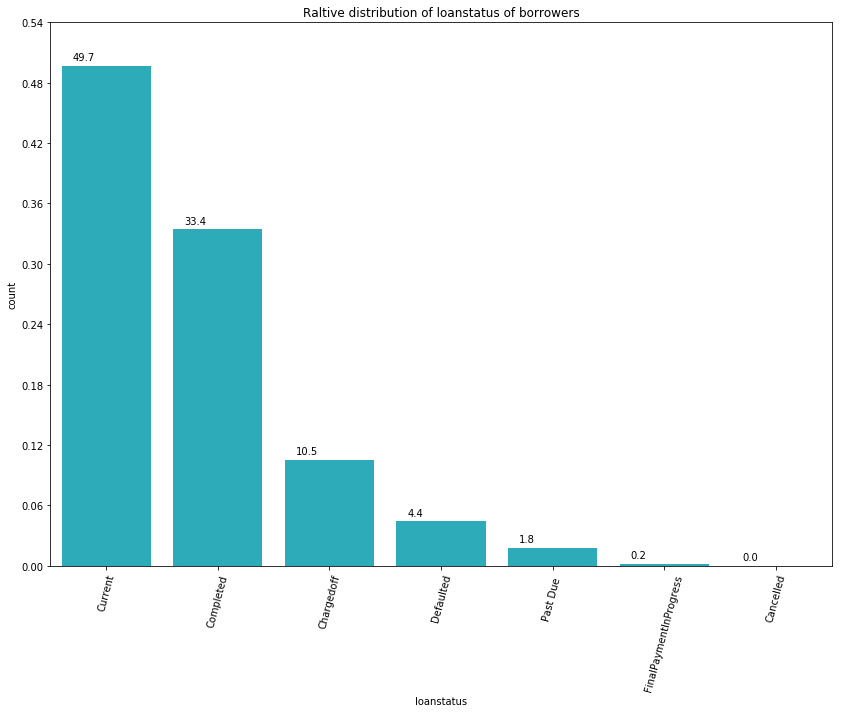
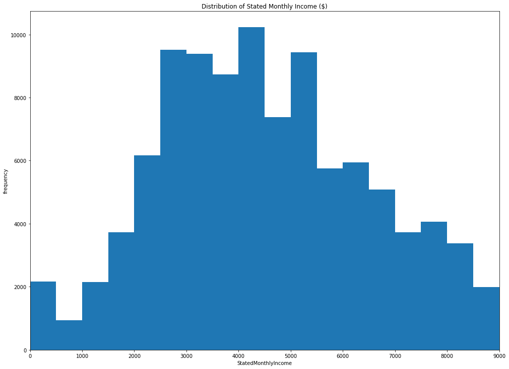
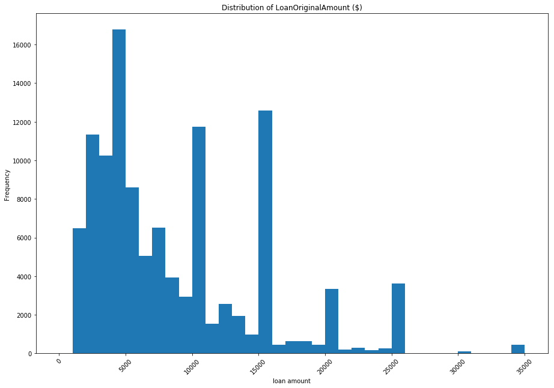
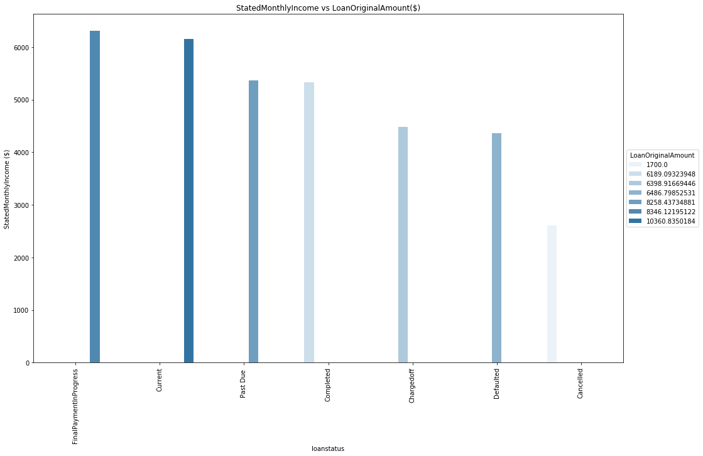
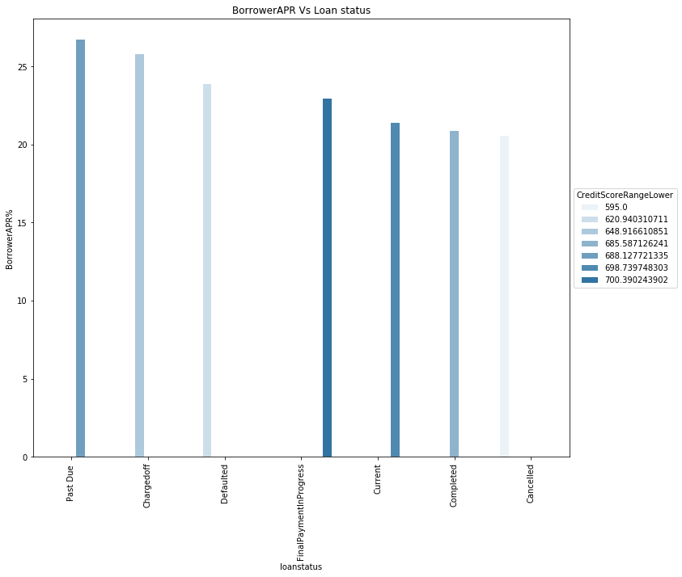
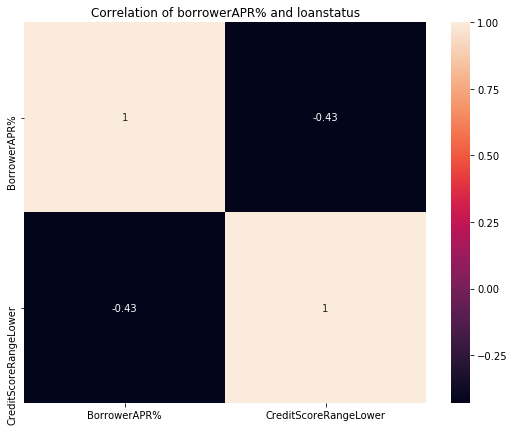
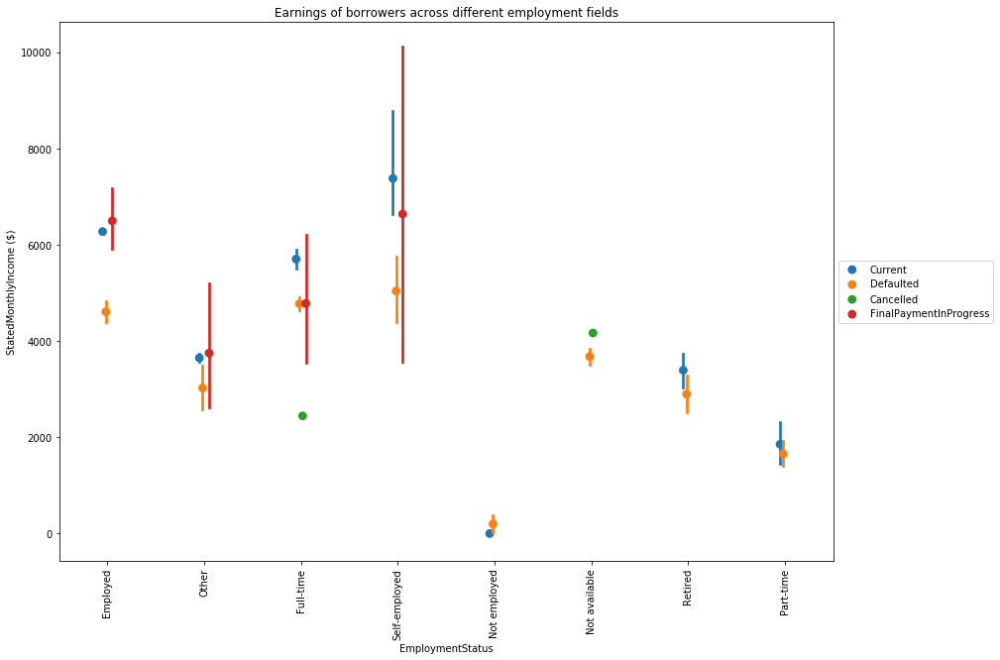
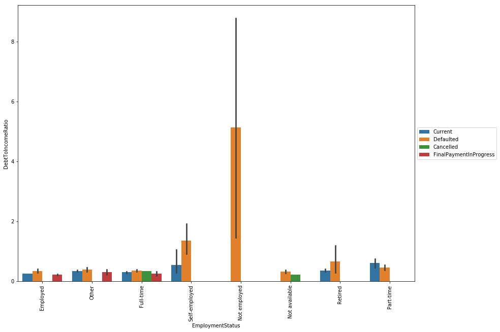
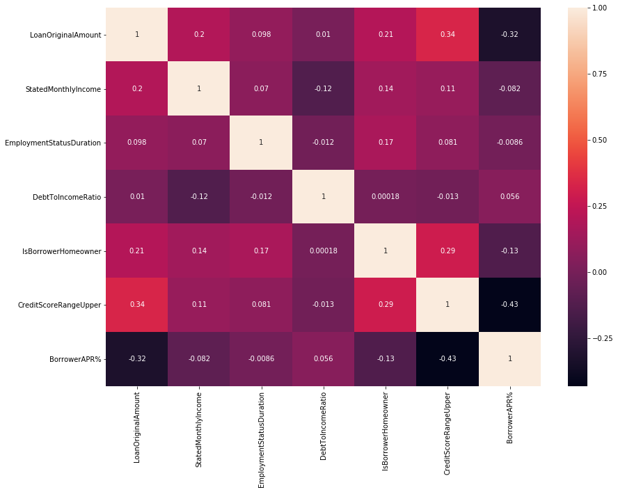

# Loan Data Exploration
## by Albert Atsu Dellor

## Investigation Overview

The goal of this presentation is to explore the factors that affect a loan’s outcome status and generally understand bank-loan-borrower behaviour.

The main interest of this project is to study the borrowers of prosper bank, especially their loan status along with other features to understand what factors affect a loan status of a borrower.

- 1. It turns out that majority of the borrowers have some form of employment. Specifically, 60.3 % of them having employment, with 21.6% being full time employment and 5.5 % being self-employed, With the most frequent reported employment status duration being 0 to 50. Additionally most borrowers make a salary ranging from $2500 to $5500 and also having a debt to loan ratio of only 0.2. No wonder most of the borrowers are in good standing because they have some means of paying back the loan. It is also no surpriseing that the frequency distribution of original loan amount given to borrowers show large peaks in frequency at `$4K`, `$10K` ,`$15K` , `$20K` , `$25K` being given to borrowers. However, only few loans above `$26K` were offered.

- 2. Borrowers who borrowed huge amounts on average of `$10360`, `$8346` , `$6189` are those in good standing with the bank  : curent, finalpaymentprogress and completed respectively. However, clients who had their loans cancelled borrowed a low average of $1700. It can be suggested that their loans were cancelled and forgiven because the amount borrowed was small and it might cost more to retrieve those loans from borrowers So in a nutshell, banks biggest borrowers are also its most compliant.

- 3. It's clear that borrowers in good standing with the bank tend to have lower borrower APR and receive higher loan amounts compared to those who are not in good standing. The inverse relationship between credit score range lower and borrower APR also highlights the importance of having a good credit score in determining loan terms. Borrowers with low credit scores are more likely to receive a higher borrower APR and receive lower loan amounts.

- 4. It is evident that borrowers who have a good repayment history with the bank have a higher income compared to those who have defaulted or had their loans cancelled across various employment categories. However, the exception to this is borrowers who are not employed, who tend to have the highest debt-to-income ratio and a higher likelihood of defaulting on their loans. Self-employed borrowers follow closely behind, with a similarly high debt-to-income ratio and a higher proportion of loan defaults compared to those who are currently making timely payments.

- 5. This statement accurately describes the relationship between debt to income ratio and loan default rates across different employment fields. It is important to note that while non-employed, self-employed and retired borrowers tend to have a higher debt to income ratio and higher default rates, there could be other factors that contribute to loan repayment behavior, such as credit history and income stability.

- 6. It is observed that there is a weak inverse relationship between `borrowerAPR%` and `original loan amount`, with borrowers having a lower `borrowerAPR%` borrowing higher amounts. Also, there is a weak positive correlation between `credit score range upper` and `original loan amount`, with those having higher `credit scores` borrowing larger amounts. There is a weak positive correlation between being a homeowner and the `loan original amount`, with homeowners borrowing more than non-homeowners. Additionally, there is a weak positive correlation between stated monthly income and loan original amount, with those having a higher monthly income borrowing larger amounts. Finally, there is a weak positive correlation between being a homeowner and credit score, as well as a weak positive correlation between being a homeowner and employment status duration.
 
### Conclusion
Based on the insights and findings from the loan data analysis, it is clear that the employment status, credit score, income and homeowner status play a significant role in determining the loan amount, borrower APR, loan standing and likelihood of default. Given this information, it would be wise for lenders to consider these factors when evaluating loan applications. Additionally, borrowers can take steps to improve their credit score, increase their income and consider homeownership as a way to increase their chances of getting approved for a loan with better terms and conditions. By being proactive in improving these factors, both borrowers and lenders can benefit from better loan outcomes.

 

## Dataset Overview


This project explores a dataset containing 113,937 loans with 81 variables on each loan, including loan amount, borrower rate (or interest rate), current loan status, borrower income, and many others.

Source [data](https://s3.amazonaws.com/udacity-hosted-downloads/ud651/prosperLoanData.csv)

Dictionary [Data dictionary](https://www.google.com/url?q=https://docs.google.com/spreadsheet/ccc?key%3D0AllIqIyvWZdadDd5NTlqZ1pBMHlsUjdrOTZHaVBuSlE%26usp%3Dsharing&sa=D&ust=1554486256024000) here.

The main interest of this project is to study the borrowers of prosper bank, especially their loan status along with other features to understand what factors affect a loan status of a borrower.Due to the large set of features, this analysis won't analyse each but will focus on these:

- `ListingCategory`: This is a categorical variable that represents the loan's category or purpose, e.g. debt consolidation, home improvement, business, etc.
- `LoanStatus`: the ratio of the borrower's debt to their income
- `BorrowerAPR`: the annual percentage rate charged to the borrower
- `LoanOriginalAmount`: the original amount of the loan
- `BorrowerRate`: The interest rate that the borrower is paying on the loan.
- `CreditScoreRangeLower`: The lower limit of the range in which the borrower's credit score falls.
-`CreditScoreRangeUpper`:The upper limit of the range in which the borrower's credit score falls.
- `StatedMonthlyIncome`: the amount of monthly income stated by the borrower
- `DebtToIncomeRatio`: the ratio of the borrower's debt to their income
- `EmploymentDuration: the length of time the borrower has been employed in their current job.
- `Employment`: indicates if a loan is current, completed, or in default.
- `Occupation`: the borrower's occupation
- `IsBorrowerHomeowner`: indicates if the borrower owns a home
- `InquiriesLast6Months`: the number of credit inquiries made on the borrower in the last 6 months.
-`PublicRecordsLast12Months`: the number of public records in the borrower's credit history in the last 12 months.
- `DelinquenciesLast7Years`: Refers to the number of times the borrower has been delinquent on a payment in the last 7 years

### Data wrangling
- I remove columns not directly needed for analysis.
- I rename list category from numeric to corresponding string value and rename column name for context.
- I summarise the various statges of Past Due (1-120days) into a single Past Due value for simplicity.


```python
# import all packages and set plots to be embedded inline
import numpy as np
import pandas as pd
import matplotlib.pyplot as plt
import seaborn as sb

%matplotlib inline

# suppress warnings from final output
import warnings
warnings.simplefilter("ignore")
pd.set_option('display.max_columns', 500)


# define function for seaborn's regplot and heatplot
def regplot(x,y):
    sb.regplot(data = loan_data, y= y, x = x);
    plt.ylabel(y)
    plt.xlabel(x)
               
def heatmap(list):
    sb.heatmap(loan_data[list].corr(),annot=True);
    

# plotting functions
def histplot(data, focus, bins=None):
    if bins is not None:
        plt.hist(data=data,x=loan_data[focus].dropna(),bins=bins)
    else:
        plt.hist(data=data,x=loan_data[focus].dropna())

def countplot(df,col,order_type):
    base_col= sb.color_palette()[9]
    if order_type is not None:
        sb.countplot(data=df, x=col ,color=base_col,order=order_type);
    else:
        sb.countplot(data=df, x=col ,color=base_col);
    plt.xticks(rotation=75);
```


```python
# load in the dataset into a pandas dataframe
loan_data = pd.read_csv('prosperLoanData.csv')

# check the number of entries and the features
print(loan_data.shape)
loan_data.sample(5)

# Remove columns not directly needed for analysis
drop =['ListingKey',
         'ListingNumber',
         'ListingCreationDate',
         'ClosedDate','LoanKey']

loan_data.drop(columns=drop,inplace=True)

# Rename list category from numeric to corresponding  string value and rename column name for context

# replace list category from numeric to corresponding 
# string value and rename column name
replacement_dict={0:'Not Available',
                  1:'Debt Consolidation',
                  2:'Home Improvement',
                  3:'Business',
                  4:'Personal Loan',
                  5:'Student Use',
                  6:'Auto',
                  7:'Other',
                  8:'Baby&Adoption',
                  9:'Boat',
                  10:'Cosmetic Procedure',
                  11:'Engagement Ring',
                  12:'Green Loans',
                  13:'Household Expenses',
                  14:'Large Purchases',
                  15:'Medical/Dental',
                  16:'Motorcycle',
                  17:'RV',
                  18:'Taxes',
                  19:'Vacation',
                  20:'Wedding Loans'}
loan_data['ListingCategory (numeric)']=loan_data['ListingCategory (numeric)']\
                        .replace(replacement_dict)
loan_data.rename(columns={'ListingCategory (numeric)':'ListingCategory'},inplace=True)

# the BorrowerAPR is multiplied by 100 to express it in  perentage
loan_data['BorrowerAPR%'] = loan_data['BorrowerAPR']*100

# summarise the various statges of Past Due (1-120days) into a single 
# `Past Due` value for simplicity

import re
loanstatus =[]
for value in loan_data.LoanStatus:
    if re.search('Past', value):
        loanstatus.append(value.split('(')[0])
    else:
        loanstatus.append(value)
loan_data['loanstatus'] = loanstatus

```

    (113937, 81)


## 1. what is the loan status  of the customers of prosper bank?


```python
order_type = loan_data.loanstatus.value_counts().index

plt.figure(figsize=(14,10))
# return all the non-null values in the LoanStatus column 
n_loantstatus = loan_data['loanstatus'].value_counts().sum()

# return the higest frequency in the LoanStatus column
loanstatus_count = loan_data.loanstatus.value_counts()
max_loanstatus_count = loanstatus_count[0]

# compute thelength of the longest bar in terms of the proportion
max_prop = max_loanstatus_count/n_loantstatus
max_prop

# create an array of evenly spaced proportioned values
tick_prop = np.arange(0,max_prop+0.07,0.06)
tick_names = ['{:0.2f}'.format(v) for v in tick_prop]
tick_names

countplot(loan_data,'loanstatus',order_type);
plt.xticks(rotation=75);
plt.yticks(n_loantstatus*tick_prop,tick_names);
plt.title('Raltive distribution of loanstatus of borrowers');
for i in range (loanstatus_count.shape[0]):
    # Remember, type_counts contains the frequency of unique values in the `type` column in decreasing order.
    count = loanstatus_count[i]
    # Convert count into a percentage, and then into string
    pct_string = '{:0.1f}'.format(100*count/n_loantstatus)
    # Print the string value on the bar. 
    plt.text(i-0.3,count+1000, pct_string, va='center');

```


    

    


```python
plt.figure(figsize=(14,10))
bins = np.arange(0,loan_data['StatedMonthlyIncome'].max()+200,500)
histplot(loan_data,'StatedMonthlyIncome', bins=bins)
plt.xlim([0,9e3]);
plt.tight_layout(pad=1.30)
plt.xlabel('StatedMonthlyIncome');
plt.ylabel('frequency');
plt.title('Distribution of Stated Monthly Income ($)');

```


    

    


```python
plt.figure(figsize=(14,10))
bins = np.arange(0,loan_data['LoanOriginalAmount'].max()+1000,1000)
histplot(loan_data,'LoanOriginalAmount',bins=bins)
plt.xlabel('loan amount')
plt.ylabel('Frequency')
plt.xticks(rotation=45);
plt.tight_layout(pad=5.0);
plt.title('Distribution of LoanOriginalAmount ($)');

```


    

    


## 2. Which customers are borrowing the huge amounts and are they paying back? 


```python

loan_stat_income = loan_data.groupby(by='loanstatus')['StatedMonthlyIncome']\
        .mean().sort_values(ascending=False).reset_index()

loan_stat_amount = loan_data.groupby(by='loanstatus')['LoanOriginalAmount']\
        .mean().sort_values(ascending=False).reset_index()
merged = loan_stat_amount.merge(loan_stat_income,left_on='loanstatus',right_on='loanstatus')
merged.sort_values(by='StatedMonthlyIncome',ascending=False)

order = merged.loanstatus
plt.figure(figsize=(14,10))
base_color = sb.color_palette()[0]
sb.barplot(data=merged, x='loanstatus', y='StatedMonthlyIncome' \
           ,color = base_color,\
           hue='LoanOriginalAmount',
           order=merged.sort_values('StatedMonthlyIncome',ascending = False).loanstatus);
plt.xticks(rotation=90);
plt.tight_layout(pad=1)
plt.ylabel('StatedMonthlyIncome ($)')
plt.legend(loc = 6,
           bbox_to_anchor = (1.0, 0.5),
           title='LoanOriginalAmount'); # legend to right of figure
plt.title('StatedMonthlyIncome vs LoanOriginalAmount($)');
```


    

    


## 3. Does their credit score infleunce their annual interest rates on these borrower groups?  Does the rates affect their repayment?


```python
loan_credit = loan_data.groupby('loanstatus')['CreditScoreRangeLower']\
        .mean().sort_values(ascending=False).reset_index()


rate = loan_data.groupby('loanstatus')['BorrowerAPR%']\
        .mean().sort_values(ascending=False).reset_index()

merged = loan_credit.merge(rate,left_on='loanstatus',right_on='loanstatus')
merged.sort_values(by='BorrowerAPR%',ascending=False);

plt.figure(figsize=(10,10))
base_color = sb.color_palette()[0]
sb.barplot(data=merged, x='loanstatus', y='BorrowerAPR%' \
           ,color = base_color,\
           hue='CreditScoreRangeLower',
           order=merged.sort_values('BorrowerAPR%',ascending = False).loanstatus);
plt.title('BorrowerAPR Vs Loan status');
plt.xticks(rotation=90);
plt.tight_layout(pad=1);
plt.legend(loc = 6,
           bbox_to_anchor = (1.0, 0.5),
           title='CreditScoreRangeLower'); 

```


    

    


```python
lists = ['BorrowerAPR%','CreditScoreRangeLower']
plt.figure(figsize=(9,7));
plt.tight_layout(pad=1);
plt.title('Correlation of borrowerAPR% and loanstatus');
heatmap(lists);

```


    

    


## 4. Across all the employment fields, do the borowers in good standing earn more than those who default or get their loan cancelled?


```python
loan_data_sub = loan_data.query("loanstatus in ['Current','Defaulted','Cancelled','FinalPaymentInProgress']") 
plt.figure(figsize=(14,10));
sb.pointplot(data = loan_data_sub, x = 'EmploymentStatus', \
             y = 'StatedMonthlyIncome', hue = 'loanstatus',
             linestyles = "",dodge=True);
plt.legend(loc = 6, bbox_to_anchor = (1.0, 0.5)) # legend to right of figure
plt.xticks(rotation = 90);
plt.ylabel('StatedMonthlyIncome ($)');
plt.title('Earnings of borrowers across different employment fields');

```


    

    


## 5. Is there any employment field that is notorious for defaulting ?


```python
plt.figure(figsize=(14,10))
sb.barplot(data = loan_data_sub, x = 'EmploymentStatus', \
             y = 'DebtToIncomeRatio', hue = 'loanstatus');
plt.legend(loc = 6, bbox_to_anchor = (1.0, 0.5)) # legend to right of figure
plt.xticks(rotation = 90);
```


    

    


## 6. Are there any noticeable correlation among the features studies so far?


```python
interest = ['LoanOriginalAmount','StatedMonthlyIncome'
            ,'EmploymentStatusDuration','DebtToIncomeRatio',
           'IsBorrowerHomeowner','CreditScoreRangeUpper',
           'BorrowerAPR%']
plt.figure(figsize=(14,10));
heatmap(interest);
```


    

    


## Call to action

Based on the insights and findings from the loan data analysis, it is clear that the employment status, credit score, income and homeowner status play a significant role in determining the loan amount, borrower APR, loan standing and likelihood of default. Given this information, it would be wise for lenders to consider these factors when evaluating loan applications. Additionally, borrowers can take steps to improve their credit score, increase their income and consider homeownership as a way to increase their chances of getting approved for a loan with better terms and conditions. By being proactive in improving these factors, both borrowers and lenders can benefit from better loan outcomes.


```python
# Use this command if you are running this file in local
!jupyter nbconvert Part_II_slide_deck.ipynb --to slides --post serve --no-input --no-prompt

```

    [NbConvertApp] Converting notebook Part_II_slide_deck.ipynb to slides
    [NbConvertApp] Writing 596022 bytes to Part_II_slide_deck.slides.html
    [NbConvertApp] Redirecting reveal.js requests to https://cdnjs.cloudflare.com/ajax/libs/reveal.js/3.5.0
    Serving your slides at http://127.0.0.1:8000/Part_II_slide_deck.slides.html
    Use Control-C to stop this server
    /usr/bin/xdg-open: 778: /usr/bin/xdg-open: x-www-browser: not found
    /usr/bin/xdg-open: 778: /usr/bin/xdg-open: firefox: not found
    /usr/bin/xdg-open: 778: /usr/bin/xdg-open: iceweasel: not found
    /usr/bin/xdg-open: 778: /usr/bin/xdg-open: seamonkey: not found
    /usr/bin/xdg-open: 778: /usr/bin/xdg-open: mozilla: not found
    /usr/bin/xdg-open: 778: /usr/bin/xdg-open: epiphany: not found
    /usr/bin/xdg-open: 778: /usr/bin/xdg-open: konqueror: not found
    /usr/bin/xdg-open: 778: /usr/bin/xdg-open: chromium-browser: not found
    /usr/bin/xdg-open: 778: /usr/bin/xdg-open: google-chrome: not found
    /usr/bin/xdg-open: 778: /usr/bin/xdg-open: www-browser: not found
    /usr/bin/xdg-open: 778: /usr/bin/xdg-open: links2: not found
    /usr/bin/xdg-open: 778: /usr/bin/xdg-open: elinks: not found
    /usr/bin/xdg-open: 778: /usr/bin/xdg-open: links: not found
    /usr/bin/xdg-open: 778: /usr/bin/xdg-open: lynx: not found
    /usr/bin/xdg-open: 778: /usr/bin/xdg-open: w3m: not found
    xdg-open: no method available for opening 'http://127.0.0.1:8000/Part_II_slide_deck.slides.html'


```python

```
