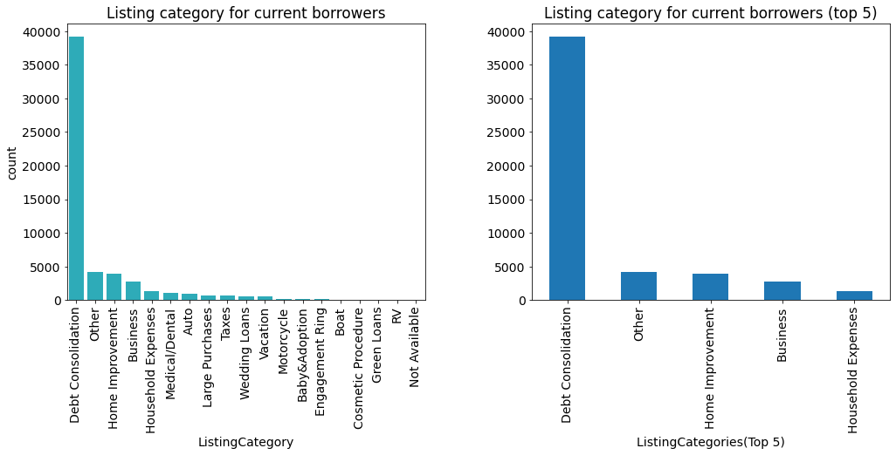
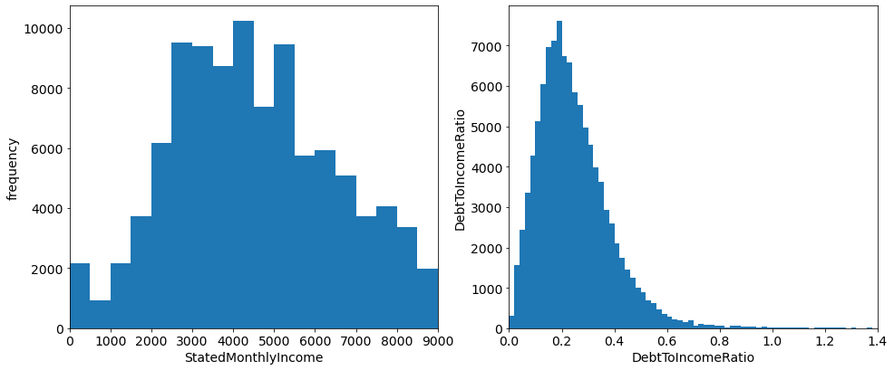

# Loan Data Exploration


## by Albert Atsu Dellor


# Prosper Bank Loan Data Exploration
## by Albert Atsu Dellor


## Table of Contents

<ul>
<li><a href="#intro">Introduction</a></li>
<li><a href="#wrangling">Data Wrangling</a></li>
<li><a href="#EDA">Eploratory Data Analysis</a></li>
<li><a href="#conclusions">Conclusions</a></li>
<li><a href="#Report">Report</a></li>
</ul>

## Introduction
<a id="intro"></a>

This project explores a dataset containing 113,937 loans with 81 variables on each loan, including loan amount, borrower rate (or interest rate), current loan status, borrower income, and many others to generate insights into the loan status of the bank's borrowers. 

It answers questions like :
What factors affect a loan’s outcome status?
What affects the borrower’s APR or interest rate?
Are there differences between loans depending on how large the original loan amount was?

## Data description

The dataset contains 113,937 loans with 81 features on each loan.
Due to the large set of features, this analysis won't analyze each but will focus on these:
```
ListingCategory:            This is a categorical variable that represents the loan's category or purpose, e.g. debt consolidation, home improvement, business, etc.
LoanStatus:                 The ratio of the borrower's debt to their income
BorrowerAPR:                The annual percentage rate charged to the borrower
LoanOriginalAmount:         The original amount of the loan
BorrowerRate:               The interest rate that the borrower is paying on the loan.
LoanMonthsSinceOrigination: The number of months that have passed since the loan originated.
CreditScoreRangeLower:      The lower limit of the range in which the borrower's credit score falls.
CreditScoreRangeUpper:      The upper limit of the range in which the borrower's credit score falls.
StatedMonthlyIncome:        The amount of monthly income stated by the borrower
DebtToIncomeRatio:          The ratio of the borrower's debt to their income
EmploymentDuration:         The length of time the borrower has been employed in their current job.
Employment:                 Indicates if a loan is current, completed, or in default.
Occupation:                 The borrower's occupation
IsBorrowerHomeowner:        Indicates if the borrower owns a home
InquiriesLast6Months:       The number of credit inquiries made on the borrower in the last 6 months.
PublicRecordsLast12Months:  The number of public records in the borrower's credit history in the last 12 months.
DelinquenciesLast7Years:    Refers to the number of times the borrower has been delinquent on a payment in the last 7 years
CurrentCreditLines:         Represents the number of credit lines (e.g. credit cards, loans, etc.) currently open and being used by the borrower.
RevolvingCreditBalance:     Refers to the current outstanding balance on all revolving credit accounts, such as credit cards, that the borrower has
BankcardUtilization:        The ratio of the borrower's credit card balance to their credit limit
LoanCurrentDaysDelinquent
    TotalTrades: the total number of trades in the borrower's credit history
    CurrentDelinquencies: the number of current delinquencies on the borrower's credit record
    TotalInquiries: The total number of credit inquiries made on the borrower's credit file in the past 6 months
```

### Feature(s) selection

Since the investigation is focused on the `loan outcome` the strongest features are the ones that provide some kind of assurance to the lender about the borrowers' ability to pay back and the justification for taking the loan. These are:

`BorrowerAPR`, `CreditScoreRangeLower`, `CreditScoreRangeUpper`,
`StatedMonthlyIncome`, `DebtToIncomeRatio`, `EmploymentDuration`, `Employment`, `Occupation`, `IsBorrowerHomeowner`,
`InquiriesLast6Months`, `PublicRecordsLast12Months`, `DelinquenciesLast7Years`,`ListingCategory`

# Data Wrangling
<a id="wrangling"></a>

```python
# import all packages and set plots to be embedded inline
import numpy as np
import pandas as pd
import matplotlib.pyplot as plt
import seaborn as sb
import requests
%matplotlib inline
pd.set_option('display.max_columns', 500)
```

```python
# Loading the dataset
# Get the URL of the dataset
url = 'https://s3.amazonaws.com/udacity-hosted-downloads/ud651/prosperLoanData.csv'
# Create a Request and get url into loan_data variable
loan_data = requests.get(url)
# create file and write request content into file named loan_data.csv
with open(url.split('/')[-1], mode='wb') as file:
    file.write(loan_data.content)    
```

```python
loan_data = pd.read_csv('prosperLoanData.csv')
```

```python
# check the number of entries and the features
print(loan_data.shape)
```

    (113937, 81)

#### Remove columns not directly needed for analysis

```python
drop =['ListingKey',
 'ListingNumber',
 'ListingCreationDate',
 'ClosedDate','LoanKey']
loan_data.drop(columns=drop,inplace=True)
```

Rename the list category from numeric to a corresponding  string value and rename the column name for the context

```python
# replace list category from numeric to corresponding 
# string value and rename column name
replacement_dict={0:'Not Available',
                  1:'Debt Consolidation',
                  2:'Home Improvement',
                  3:'Business',
                  4:'Personal Loan',
                  5:'Student Use',
                  6:'Auto',
                  7:'Other',
                  8:'Baby&Adoption',
                  9:'Boat',
                  10:'Cosmetic Procedure',
                  11:'Engagement Ring',
                  12:'Green Loans',
                  13:'Household Expenses',
                  14:'Large Purchases',
                  15:'Medical/Dental',
                  16:'Motorcycle',
                  17:'RV',
                  18:'Taxes',
                  19:'Vacation',
                  20:'Wedding Loans'}
loan_data['ListingCategory (numeric)']=loan_data['ListingCategory (numeric)']\
                        .replace(replacement_dict)
loan_data.rename(columns={'ListingCategory (numeric)':'ListingCategory'},inplace=True)

```

summarise the various stages of Past Due (1-120days) into a single `Past Due` value for simplicity

```python
import re
loanstatus =[]
for value in loan_data.LoanStatus:
    if re.search('Past', value):
        loanstatus.append(value.split('(')[0])
    else:
        loanstatus.append(value)
loan_data['loanstatus'] = loanstatus
```

```python
loan_data['loanstatus'].unique()
```

    array(['Completed', 'Current', 'Past Due ', 'Defaulted', 'Chargedoff',
           'Cancelled', 'FinalPaymentInProgress'], dtype=object)

```python
# check for duplicates
loan_data.duplicated().sum()
```

    0

```python
# a detialed check on missing entries
missing_stats = loan_data.isnull().sum()
missing_value_count = missing_stats[missing_stats>0].count()
print('There are {} columns with one or more missing values. However, there are no duplicated entries'\
      .format(missing_value_count))

```

    There are 42 columns with one or more missing values. However, there are no duplicated entries

```python
loan_data.shape
```

    (113937, 77)

# Exploratory Data analysis
<a id="EDA"></a>

## Univariate Exploration 

 1. What is the loan status of borrowers in prosper bank?

```python
order_type = loan_data.loanstatus.value_counts().index

def countplot(df,col,order_type):
    base_col= sb.color_palette()[9]
    if order_type is not None:
        sb.countplot(data=df, x=col ,color=base_col,order=order_type);
    else:
        sb.countplot(data=df, x=col ,color=base_col);
    plt.xticks(rotation=75);
    
```

```python
plt.figure(figsize=(14,6))
plt.rcParams['font.size'] = 12
# return all the non-null values in the LoanStatus column 
n_loantstatus = loan_data['loanstatus'].value_counts().sum()

# return the higest frequency in the LoanStatus column
loanstatus_count = loan_data.loanstatus.value_counts()
max_loanstatus_count = loanstatus_count[0]

# compute thelength of the longest bar in terms of the proportion
max_prop = max_loanstatus_count/n_loantstatus
max_prop

# create an array of evenly spaced proportioned values
tick_prop = np.arange(0,max_prop+0.07,0.06)
tick_names = ['{:0.2f}'.format(v) for v in tick_prop]
tick_names

plt.subplot(1,2,2)
countplot(loan_data,'loanstatus',order_type)
plt.xticks(rotation=75);
plt.yticks(n_loantstatus*tick_prop,tick_names);
plt.title('Raltive distribution of loanstatus of borrowers');
for i in range (loanstatus_count.shape[0]):
    # Remember, type_counts contains the frequency of unique values in the `type` column in decreasing order.
    count = loanstatus_count[i]
    # Convert count into a percentage, and then into string
    pct_string = '{:0.1f}'.format(100*count/n_loantstatus)
    # Print the string value on the bar. 
    plt.text(i-0.3,count+1000, pct_string, va='center')

plt.subplot(1,2,1)    
countplot(loan_data,'loanstatus',order_type)
plt.title('Distribution of loanstatus of borrowers');
```
 

    
 The bar graph of loan status reveals that the majority of Prosper Bank's clients are in good standing and have either completely paid off their loans or are actively in the process of paying off while a small proportion of their borrowers are being charged off or defaulting, past due, canceled (not in good standing with the bank).

To be specific, about a third of loans given out have been fully repaid (`complete`) with about half of all borrowers currently in the process of paying off loans(`current`). Only about one-tenth of loans have been `charged-off`, leaving only about 4.4% `defaulted` and 1.8% of loans in various stages of being defaulted by 1 to 120 days `past due`.

Therefore, Prosper's bank is actually prospering. A deeper investigation to find the dollar value of these loan statuses will continue to ascertain the average amount of loans being paid off, whether they are mostly small loans or big loans.

2. For the borrowers in good standing (current) and those not in good standing (canceled), what are their reasons for taking loans?

```python
plt.figure(figsize=(16,9))
plt.rcParams['font.size'] = 14
current_stat = loan_data.query("loanstatus =='Current'")
order = current_stat.ListingCategory.value_counts().index
plt.subplot(1,2,1)
countplot(current_stat,'ListingCategory',order_type=order)
plt.xticks(rotation=90)
plt.title('Listing category for current borrowers')

plt.subplot(1,2,2)
order = current_stat.ListingCategory.value_counts()
color = sb.color_palette()[0]
order[:5].plot(kind='bar',color=color)
plt.xlabel('ListingCategories(Top 5)');
plt.tight_layout(pad=5)
plt.title('Listing category for current borrowers (top 5)');
plt.tight_layout(pad=5)

```
    

    
```python

plt.figure(figsize=(14,9))
current_stat = loan_data.query("loanstatus =='Defaulted'")
order = current_stat.ListingCategory.value_counts().index
plt.subplot(1,2,1)
countplot(current_stat,'ListingCategory',order_type=order)
plt.xticks(rotation=90)
plt.title('Listing category for defaulting borrowers')

plt.subplot(1,2,2)
order = current_stat.ListingCategory.value_counts()
color = sb.color_palette()[0]
order[:5].plot(kind='bar',color=color)
plt.xlabel('Cancelled(Top 5)');
plt.title('Listing category for defaulting borrowers (top 5)');
plt.tight_layout(pad=5)

```


    
  For current borrowers, the most frequent reasons why they are taking loans are (in descending order) : 

- `Debt consolidation` > `undefined` > `home investment` > `business` > `household expenses 

Whilst for defaulting borrowers, they are (in descending order) : 

- `Not available` > `debt consolation` > `business` > `other` > `personal loan`

The reasons common to both groups are:
`debt consolation` and `business`

whilst a reason found in only defaulting borrowers is `personal loan`

Therefore, borrowers who take personal loans are more likely to default. This may be because they quickly spend it without really thinking about repayment.

`NB`: Debt consolidation is the process of combining multiple debts into a single, lower-interest loan to simplify and potentially reduce the overall cost of repaying debt. This is typically achieved by taking out a new loan to pay off existing debts, resulting in a single monthly payment to the new lender.

3. What is the distribution of the BorrowerAPR, which is the annual interest rate that the borrower is paying? 
what is the most frequent APR and why? 

```python
# order_type = loan_data.BorrowerAPR.value_counts().index

def histplot(data, focus, bins=None):
    if bins is not None:
        plt.hist(data[focus].dropna(),bins=bins)
        plt.tight_layout(pad=5)
    else:
        plt.hist(data,x=data[focus].dropna())
        plt.tight_layout(pad=5)

```

```python
# the BorrowerAPR is multiplied by 100 to express it in  percentage
loan_data['BorrowerAPR%'] = loan_data['BorrowerAPR']*100.0
```

```python
bins =np.arange(0,loan_data['BorrowerAPR%'].max()+0.5,1)
plt.figure(figsize=(9,8))
histplot(loan_data,'BorrowerAPR%',bins)
ticks = np.arange(0,50,5);
plt.xticks(ticks,ticks);
plt.xlabel('BorrowerAPR');
plt.ylabel('Frequency');
plt.title('Distribution of BorrowerAPR');
```
    

    
Small bin sizes reveal that there are interest rates peaks at 9%,19%, 29%, and 35%. It is interesting to see that a BorrowerAPR of 35% is the most frequent. These interest rates may represent standard interest rates on loans, with 35% APR being the most frequent. These APRs may depend on certain criteria such as risk. In the next section, I would investigate the relationship between `loan status` and `borrowerAPR`. to see if the interest rates affect the status of the loans.

4. Between the group of homeowners and non-homeowners, which group dominates in borrowing?
Does the bank have a preference among these groups?


```python
plt.figure(figsize=(8,5))
countplot(loan_data,'IsBorrowerHomeowner',order_type=None)

```
    

    
Judging from the chart, these groups borrow at almost the same frequency. Therefore Prosper Bank doesn't discriminate between homeowners and non-homeowners when it comes to lending.

5. What do these borrowers do for a living?
They must have some means of paying back the loan.


```python
order_type = loan_data['EmploymentStatus'].value_counts().index

# return all the non-null values in the employment column 
n_EmploymentStatus = loan_data['EmploymentStatus'].value_counts().sum()

# return the higest frequency in the LoanStatus column
EmploymentStatus_count = loan_data.EmploymentStatus.value_counts()
max_EmploymentStatus_count = EmploymentStatus_count[0]

# compute thelength of the longest bar in terms of the proportion
max_prop = max_EmploymentStatus_count/n_EmploymentStatus
max_prop

# create an array of evenly spaced proportioned values
tick_prop = np.arange(0,max_prop+0.07,0.06)
tick_names = ['{:0.2f}'.format(v) for v in tick_prop]

plt.figure(figsize=(8,7))
countplot(loan_data,'EmploymentStatus',order_type=order_type)
plt.xticks(rotation=75);
plt.yticks(n_EmploymentStatus*tick_prop,tick_names);

for i in range (EmploymentStatus_count.shape[0]):
    # Remember, type_counts contains the frequency of unique values in the `type` column in decreasing order.
    count = EmploymentStatus_count[i]
    # Convert count into a percentage, and then into string
    pct_string = '{:0.1f}'.format(100*count/n_EmploymentStatus)
    # Print the string value on the bar. 
    plt.text(i-0.2,count+2000, pct_string, va='center')
```
 

    
The bar graph does indeed show that the majority of the borrowers have some form of employment. Specifically, 60.3 % of them have employment, with 21.6% having full-time employment and 5.5 % being self-employed. This is important, as the borrower would need to have some means of paying back the loan.

6. What do the amounts of money being loaned out to borrowers look like?

```python
plt.figure(figsize=(15,8))
plt.subplot(1,2,1)
bins = np.arange(0,loan_data['LoanOriginalAmount'].max()+1000,1000)
histplot(loan_data,'LoanOriginalAmount',bins=bins)
plt.xlabel('loan amount')
plt.ylabel('Frequency')
plt.xticks(rotation=45);
plt.tight_layout(pad=5.0);
plt.title('Frequency of loan distribution');

plt.subplot(1,2,2)
bins = np.arange(0,loan_data['LoanOriginalAmount'].max()+1000,1000)
histplot(loan_data,'LoanOriginalAmount',bins=bins)
plt.xlim([26000,35000]);
plt.ylim([0,1000]);
plt.xlabel('loan amount');
plt.ylabel('Frequency');
plt.title('Frequency of loan distribution (> $26k)');
```


    

    


Taking a look at loans given out, the distribution is left skewed however there are large peaks in frequency at amounts such as `$4K`, `$10K`,`$15K`, `$20K`, and `$25K`. These may represent standard limits for loans to individuals depending on their profile or risk.

Zooming in into the lower right section reveals that only a few loans above 26K were offered. It could be only a few borrowers qualify for such loans.

7. What do the monthly income and debt-to-income of borrowers look like?

```python
plt.figure(figsize=(14,6))
plt.subplot(1,2,1)
bins = np.arange(0,loan_data['StatedMonthlyIncome'].max()+200,500)
histplot(loan_data,'StatedMonthlyIncome', bins=bins)
plt.xlim([0,9e3]);
plt.tight_layout(pad=1.30)
plt.xlabel('StatedMonthlyIncome');
plt.ylabel('frequency');

plt.subplot(1,2,2)
bins = np.arange(0,loan_data['DebtToIncomeRatio'].max()+0.01,0.02)
histplot(loan_data,'DebtToIncomeRatio',bins=bins);
plt.xlim([0,1.4]);
plt.xlabel('DebtToIncomeRatio');
plt.ylabel('DebtToIncomeRatio');
plt.tight_layout(pad=1.30)
```
    

    
Exploring the monthly income (left) of the borrowers reveals a unimodal histogram. Most borrowers make a salary ranging from `$2500` to `$5500`. 

The histogram reveals  (right) that the distribution is left-skewed. with a mode of 0.2 debt-to-income ratio. this is reasonable as a high debt-to-income ratio can be an indication of risk and can affect borrowers' loan acquisition

8. What is the employment status duration of borrowers? 

```python
plt.figure(figsize=(10,7))
bins = np.arange(0,loan_data['EmploymentStatusDuration'].max()+5,10)
histplot(loan_data,'EmploymentStatusDuration',bins=bins)
plt.xlabel('EmploymentStatusDuration (months)');
ticks= np.arange(0,600,50)
plt.xticks(ticks,ticks);
plt.ylabel('Count')
plt.title('Employment status duration of borrowers')
plt.xlim([0,600]);

```
    

    
Exploring the employment status duration reveals a right-skewed graph with a mode of between 1 to 10 months. It is evident that borrowers with lesser employment status duration make up the majority of borrowers while more experienced workers with many months of employment duration make up the least category of borrowers. They may have gained financial independence after years of working compared to the former.

9.0 How many credit inquiries have borrowers had in the last 6 months?

```python
plt.figure(figsize=(10,7))
bins = np.arange(0,20+1,1)
ticks = np.arange(0,20,1)
histplot(loan_data,'InquiriesLast6Months',bins=bins)
plt.xticks(ticks,ticks);
plt.xlabel('InquiriesLast6Months');
plt.ylabel('Count')
plt.title('credit enquiries of borrowers had in the last 6 months');
```


    
This reveals a left skewed graph with the modal value of 1. The majority of borrowers have had their credit reports check only once within the past 6 month.

Inquiries Last 6 Months refers to the number of times a borrower's credit report has been checked or "pulled" by potential lenders or creditors in the past 6 months. Each time a credit report is pulled, it is recorded as an inquiry. Having too many inquiries in a short period of time can have a negative impact on a borrower's credit score as it suggests to lenders that the borrower is seeking.

10. How many delinquencies  have the borrowers had in the past 7 years?

```python
# bins = np.arange(0,60+1,5)
plt.figure(figsize=(10,7))

histplot(loan_data,'DelinquenciesLast7Years',bins=bins)
ticks = np.arange(0,25,1)
plt.xticks(ticks,ticks);
plt.xlabel('DelinquenciesLast7Years');
```
    

    
This photograph shows that a large proportion of borrowers have missed or are currently late on payment only once within the past 7 years.

Current Delinquencies refer to the number of payments that a borrower has missed or is currently late on. It is an indicator of the borrower's current level of credit risk and can have a significant impact on their credit score. Lenders consider a borrower's current delinquencies when evaluating loan applications and determining the interest rate and other terms of the loan. A high number of current delinquencies can indicate a higher risk of default and result in a lower credit score, making it more difficult for the borrower to obtain credit in the future. 

### What are the distribution(s) of the variable(s) of interest. Were there any unusual points? Did you need to perform any transformations?
The LoanStatus feature values `Past Due (1-15 days), ``Past Due (16-30 days)`,` Past Due (31-60 days)`,` Past Due (61-90 days)`, `Past Due (91-120 days)`,` Past Due (>120 days)` were all replaced with Past Due for simplicity


### Of the features investigated, were there any unusual distributions? Did you perform any operations on the data to tidy, adjust, or change the form of the data? If so, why did you do this?
The distribution of the BorrowerAPR almost seems to be normally distributed. but with smaller bin sizes there is a tall peak at 35% APR. This looks a bit unusual as an APR of 35% is quite high. The APR was multiplied by 100 to express it in percentage.

The distribution of the original loan amount show that there are large peaks in frequency at amounts such as  4K, 10K, 15𝐾, 20K, and 25K. These may represent standard limits for loans to individuals depending on their profile or risk.

Additionally, the CreditScoreRangeUpper and CreditScoreRangeLower features when plotted look the same.

- Is there any connection between home ownership and loan status? 

```python
plt.figure(figsize=(10,7))
sb.countplot(data = loan_data, x = 'loanstatus', hue = 'IsBorrowerHomeowner')
plt.xticks(rotation=90);
```
    

    
I used the clustered bar chart to see whether there is a connection between owning a home and the status of borrowers. Interestingly there are more borrowers who have had their loans charged off or defaulted who are not homeowners than those who are homeowners.  And there are more borrowers who are currently in the process of paying back their loans who are homeowners than those who are not. This could be due to borrowers using their homes for collateral and not wanting to lose their homes, thus giving some incentive to repay loans on schedule.

>Do borrowers in good standing with the bank have a higher monthly stated income than those in bad standing with the bank?

```python
plt.figure(figsize=(10,7))
mean_loan_lower_status = loan_data.groupby('loanstatus')['StatedMonthlyIncome'].mean()
mean_loan_lower_status = mean_loan_lower_status.sort_values(ascending=False);
mean_loan_lower_status.plot(kind='bar',color = color);
plt.ylabel('StatedMonthlyIncome of borrowers ');
plt.title('StatedMonthlyIncome of borrowers by loanstatus');
```
    

    
borrowers in good standing with the bank have a higher monhtly stated income than those in bad standing with the bank

10. Do borrowers in good standing with the bank have a higher credit score than those in bad standing with the bank?

```python
plt.figure(figsize=(16,9))
plt.subplot(1,2,1)
mean_upper_loan_status = loan_data.groupby('loanstatus')['CreditScoreRangeUpper'].mean()
mean_upper_loan_status = mean_upper_loan_status.sort_values(ascending=False);
mean_upper_loan_status.plot(kind='bar',color = color);
plt.ylabel('Upper credit score range of borrowers ');
plt.title('Upper credit score range of borrowers by loanstatus');
plt.tight_layout(pad=5)

plt.subplot(1,2,2)
mean_loan_lower_status = loan_data.groupby('loanstatus')['CreditScoreRangeLower'].mean()
mean_loan_lower_status = mean_loan_lower_status.sort_values(ascending=False);
mean_loan_lower_status.plot(kind='bar',color = color);
plt.ylabel('Upper credit score range of borrowers ');
plt.title('Lower credit score range of borrowers by loanstatus');
plt.tight_layout(pad=5)
```

    

It is surprising to see the stark similarity between both the upper and lower range of credit scores. in the next section, I would investigate Credit scores and borrowersAPR. with borrowers' loan status of final payment progress, current, past due, and completed, in descending order have the highest credit score.

Whilst those who have been charged off, defaulted, or had their loans canceled have the lower credit scores
Thus, borrowers with good standing have higher credit scores, with the exception of those with loans past due. 

Thus, borrowers in good standing with the bank have a higher credit score than those in bad standing with the bank

11. what is the mean amount borrowed by each borrower group?
Are the bank's biggest borrowers paying up?

```python
loan_amt = loan_data.groupby('loanstatus')['LoanOriginalAmount'].mean()
loan_amt= loan_amt.sort_values(ascending=False).reset_index()
loan_amt.set_index('loanstatus')
```

<div>
<table border="1" class="dataframe">
  <thead>
    <tr style="text-align: right;">
      <th></th>
      <th>LoanOriginalAmount</th>
    </tr>
    <tr>
      <th>loanstatus</th>
      <th></th>
    </tr>
  </thead>
  <tbody>
    <tr>
      <th>Current</th>
      <td>10360.835018</td>
    </tr>
    <tr>
      <th>FinalPaymentInProgress</th>
      <td>8346.121951</td>
    </tr>
    <tr>
      <th>Past Due</th>
      <td>8258.437349</td>
    </tr>
    <tr>
      <th>Defaulted</th>
      <td>6486.798525</td>
    </tr>
    <tr>
      <th>Chargedoff</th>
      <td>6398.916694</td>
    </tr>
    <tr>
      <th>Completed</th>
      <td>6189.093239</td>
    </tr>
    <tr>
      <th>Cancelled</th>
      <td>1700.000000</td>
    </tr>
  </tbody>
</table>
</div>

```python
plt.figure(figsize=(12,7))
plt.tight_layout(pad=5)
base_color = sb.color_palette()[0]
sb.barplot(data=loan_amt,x='loanstatus',y='LoanOriginalAmount',\
           color=base_color)
plt.xticks(rotation=90);
```
    

    
#### Looking at the loan original amount borrowed by borrowers, borrowers who borrowed the most  are those consistently repaying (`current) and those making their last payment(` finalpaymentprogress` at `$10360` and `$8346` respectively.

Borrowers who have fully paid off their loans (`completed`) borrowed an average of `$6189.` 

Borrowers who had their loans canceled borrowed an average of `$1700` which is the lowest of all amount borrowed. It can be suggested that their loans were canceled and forgiven because the amount borrowed was small and it might cost more to receive those loans from borrowers.

12. What are the annual interest rates of these borrower groups? Does their credit score play a role in these rates? Do the rates affect their repayment?

```python
# define function for seaborn's regplot and heatplot
def regplot(x,y):
    sb.regplot(data = loan_data, y= y, x = x);
    plt.ylabel(y)
    plt.xlabel(x)
               
def heatmap(list):
    sb.heatmap(loan_data[list].corr(),annot=True);
```

```python
loan_score = loan_data.groupby('loanstatus')['CreditScoreRangeLower']\
        .mean()

loan_score_sort = loan_score.sort_values(ascending=False).index
```

```python

plt.figure(figsize=(12,9))
plt.subplot(1,2,1)
sb.barplot(data=loan_data, x='loanstatus', y='BorrowerAPR%',\
           color=base_color, ci='sd')
plt.xticks(rotation=90);
plt.title('BorrowerAPR% of borrower groups')
plt.tight_layout(pad=1)

plt.subplot(1,2,2)
sb.barplot(data=loan_data, x='loanstatus',y='CreditScoreRangeLower'\
           , color=base_color, ci='sd',order=loan_score_sort)
plt.xticks(rotation=90);
plt.title('CreditScoreRangeLower of borrower groups')
plt.tight_layout(pad=1)
```
    
    

```python
plt.figure(figsize=(17,10))
lists = ['BorrowerAPR%','CreditScoreRangeLower']
plt.subplot(2,2,3)
heatmap(lists)
```


    
With investigation, it looks like, with the exception of defaulted borrowers, the borrowers with the lowest `BorrowerAPR%` are the ones currently paying their loan on schedule, completing their loan payment, and those making their final payment. 

Borrowers who have past Due dates on their loans, defaulted, or have been charged off  are the ones with higher `borrowersAPR%`. 

Interestingly, the borrowers who have had their loan canceled have the lowest `BorrowerAPR%` and yet they couldn't pay their loans. This is not surprising because as seen from the previous plot, they have the lowest reported income and were lent the lowest amount amongst the categories.

Additionally, for the bar chart at the upper right, (loan status vs credit score), with the exception of Past Due borrowers, borrowers with the highest credit score are those currently paying their loans, those who completed the payment, and those making their final payment progress. Those who defaulted or had their loans canceled have the lowest average credit score. 
Borrowers with the smaller BorrowerAPR% are in good standing with the bank compared to  those who have defaulted and are past due date as they have higher borrowerAPR%.

This relationship is further exposed in the heatmap, as credit score and BorrowerAPR% are related with a slight negative correlation.  Thus an increase in one variable causes a slight decrease in the other (inversely related).  

13. Also does credit score influence how much loan they get?

```python
plt.figure(figsize=(12,9))
regplot('CreditScoreRangeLower','LoanOriginalAmount');
```


    
The increasing regression line and scatter plot indicate that an increasing credit score also increases the original loan amount given to the borrower. Therefore, borrowers with the lowest credit score, also have a higher borrower APR%, earn less, and struggle to repay their loans compared to those with higher credit scores.

### Talk about some of the relationships you observed in this part of the investigation. How did the feature(s) of interest vary with other features in the dataset?

1. Interestingly, there are more borrowers who have had their loans charged off or defaulted who are not homeowners than those who are homeowners. And there are more borrowers who are currently in the process of paying back their loans who are homeowners than those who are not. This could be due to borrowers using their homes for collateral and not wanting to lose their homes, thus giving some incentive to repay loans on schedule.
2. Investigating borrower's loan status against the amount borrowed indicates that borrowers who had their loans canceled borrowed the least amount on average whilst those who are currently repaying their loans (including those making their final payment) borrowed the most. Their loans were forgiven probably because it was the least and might cost more to recover. 
3. Similarly, investigating borrowers' loan status against their monthly income reveal that those making their final payment, currently paying their loans, and those who have completed their loan repayment earn higher on average compared to those who defaulted, were charged off, or had their loans canceled. Borrowers who are late on their due date payments also earn higher.
4. High borrowerAPR might slow loan repayment, with the exception of defaulted borrowers, the borrowers with the lowest `BorrowerAPR%` are currently paying their loan on schedule, have completed their loan payment, or are making their final payment. While those with the highest `borrowersAPR%` are the ones who have past Due dates on their loans, defaulted, or have been charged off. Interestingly, the borrowers who have had their loan canceled have the lowest `BorrowerAPR%` and yet they couldn't pay their loans. This is not surprising because as seen from the previous plot, they have the lowest reported income and were lent the lowest amount amongst the categories.
5. Additionally, a high credit score might indicate a higher borrower's ability to repay a loan.
6. Borrowers with the smaller BorrowerAPR% are in good standing with the bank (currently paying their loan on schedule, have completed their loan payment, or are making their final payment) compared to those who have defaulted and past due date as they have higher borrowerAPR%.


### Did you observe any interesting relationships between the other features (not the main feature(s) of interest)?

1. Credit score and BorrowerAPR% are inversely related with a slight negative correlation.  Thus an increase in one variable causes a slight decrease in the other.
2. However, a credit score is positively correlated with the number of loans given, as increasing credit show an increase in the loan original amount given to the borrower. Therefore borrowers with the lowest credit score, also have the higher borrowerAPR%, earn the lower and struggle to repay their loans compared to those with higher credit scores.
3. Additionally, the loan original amount (amount of loan given to borrower) increases slightly with increasing stated monthly income as there exists a slight positive correlation of 0.2 between these two features

## Multivariate Exploration


1. Of all the groups of borrowers, what are their mean monthly income and how much money are they borrowing? 


```python
loan_stat_income = loan_data.groupby(by='loanstatus')['StatedMonthlyIncome']\
        .mean().sort_values(ascending=False).reset_index()
# loan_stat_income
```

```python
loan_stat_amount = loan_data.groupby(by='loanstatus')['LoanOriginalAmount']\
        .mean().sort_values(ascending=False).reset_index()
merged = loan_stat_amount.merge(loan_stat_income,left_on='loanstatus',right_on='loanstatus')
merged.sort_values(by='StatedMonthlyIncome',ascending=False)
```

<div>
<table border="1" class="dataframe">
  <thead>
    <tr style="text-align: right;">
      <th></th>
      <th>loanstatus</th>
      <th>LoanOriginalAmount</th>
      <th>StatedMonthlyIncome</th>
    </tr>
  </thead>
  <tbody>
    <tr>
      <th>1</th>
      <td>FinalPaymentInProgress</td>
      <td>8346.121951</td>
      <td>6311.738211</td>
    </tr>
    <tr>
      <th>0</th>
      <td>Current</td>
      <td>10360.835018</td>
      <td>6153.262946</td>
    </tr>
    <tr>
      <th>2</th>
      <td>Past Due</td>
      <td>8258.437349</td>
      <td>5366.855830</td>
    </tr>
    <tr>
      <th>5</th>
      <td>Completed</td>
      <td>6189.093239</td>
      <td>5324.522029</td>
    </tr>
    <tr>
      <th>4</th>
      <td>Chargedoff</td>
      <td>6398.916694</td>
      <td>4485.996143</td>
    </tr>
    <tr>
      <th>3</th>
      <td>Defaulted</td>
      <td>6486.798525</td>
      <td>4366.768683</td>
    </tr>
    <tr>
      <th>6</th>
      <td>Cancelled</td>
      <td>1700.000000</td>
      <td>2608.933333</td>
    </tr>
  </tbody>
</table>
</div>

```python
order = merged.loanstatus
plt.figure(figsize=(9,14))
plt.subplot(2,1,1)
base_color = sb.color_palette()[0]
sb.barplot(data=merged, x='loanstatus', y='StatedMonthlyIncome' \
           ,color = base_color,\
           hue='LoanOriginalAmount',
           order=merged.sort_values('StatedMonthlyIncome',ascending = False).loanstatus);
plt.xticks(rotation=90);
plt.tight_layout(pad=1)
plt.legend(loc = 6,
           bbox_to_anchor = (1.0, 0.5),
           title='LoanOriginalAmount'); # legend to right of figure

```


    
Of all the groups of borrowers, those in good standing with the bank have a higher monthly income than those who are not and ended up borrowing more than those who are not in good standing. 
Borrowers in good standing: current, completed, and  those making their last payment(final payment progress) earn `$6311.738`, `$5324.522`, and `$6153.262` respectively.

However, borrowers who had their loans canceled earned the least average income of `$2608.933`

Therefore there is a relationship between the LoanOriginalAmount (the amount borrowed), StatedMonthlyIncome, and loan status.

```python
loan_credit = loan_data.groupby('loanstatus')['CreditScoreRangeLower']\
        .mean().sort_values(ascending=False).reset_index()


rate = loan_data.groupby('loanstatus')['BorrowerAPR%']\
        .mean().sort_values(ascending=False).reset_index()

merged = loan_credit.merge(rate,left_on='loanstatus',right_on='loanstatus')
merged.sort_values(by='BorrowerAPR%',ascending=False)

plt.figure(figsize=(10,9))
base_color = sb.color_palette()[0]
sb.barplot(data=merged, x='loanstatus', y='BorrowerAPR%' \
           ,color = base_color,\
           hue='CreditScoreRangeLower',
           order=merged.sort_values('BorrowerAPR%',ascending = False).loanstatus);
plt.title('BorrowerAPR Vs Loan status')
plt.xticks(rotation=90);
plt.tight_layout(pad=1)
plt.legend(loc = 6,
           bbox_to_anchor = (1.0, 0.5),
           title='CreditScoreRangeLower'); 

```
    
    

> - 2. Across all the employment statuses of borrowers, do those who currently pay their loans or are on their final payment earn more than those who default or get their loans canceled?


```python
loan_data_sub = loan_data.query("loanstatus in ['Current','Defaulted','Cancelled','FinalPaymentInProgress']") 
```

```python
plt.figure(figsize=(12,9))
sb.pointplot(data = loan_data_sub, x = 'EmploymentStatus', \
             y = 'StatedMonthlyIncome', hue = 'loanstatus',
             linestyles = "",dodge=True)
plt.legend(loc = 6, bbox_to_anchor = (1.0, 0.5)) # legend to right of figure
plt.xticks(rotation = 90);
```
    

    
Looking at the income and employment status of borrowers in the current, defaulted, canceled, and final payment process, it is evident that borrowers who are currently paying off debt and those making their final payments have higher incomes across several employment fields than those who have had their loans canceled or defaulted.
Borrowers who are not employed have the lowest income with those  both defaulters and those currently paying loans having about the same income.

> - 3. Across all the employment statuses of borrowers, do those who default on loans have a higher debt to income ratio than those currently paying their loans or those making their final payment?

```python
plt.figure(figsize=(12,9))
sb.barplot(data = loan_data_sub, x = 'EmploymentStatus', \
             y = 'DebtToIncomeRatio', hue = 'loanstatus')
plt.legend(loc = 6, bbox_to_anchor = (1.0, 0.5)) # legend to right of figure
plt.xticks(rotation = 90);
```
    

    
In addition, borrowers who are not employed tend to have the highest debt-to-income ratio and mostly default on loans.
This is followed by borrowers who are self-employed, as they have the second highest debt-to-income ratio and the proportion of these borrowers who default on their loans is more than those who currently pay their loans on schedule.

> - 4. Is there any noticeable correlation among the feature studies so far?

```python
plt.figure(figsize=(12,9))
interest = ['LoanOriginalAmount','StatedMonthlyIncome'
            ,'EmploymentStatusDuration','DebtToIncomeRatio',
           'IsBorrowerHomeowner','CreditScoreRangeUpper',
           'BorrowerAPR%']

heatmap(interest)
```


    
There is a weak negative correlation between the original loan amount and borrowerAPR%, thus these are inversely related.
There is also a weak positive correlation between the loan original amount and credit score range upper.
There is a weak correlation between ishomeowner and loanoroginalamount.
There is a weak correlation between statedMonthlyincome and LoanOriginalAmount
there is also a weak correlation between ishomeowner and credit score.
there is also a weak correlation between ishomeowner and employmentstatusduration

### Talk about some of the relationships you observed in this part of the investigation. Were there features that strengthened each other in terms of looking at your feature(s) of interest?

Looking at the income and employment status of borrowers in the current, defaulted, canceled, and final payment process, it is evident that borrowers who are currently paying off debt and those making their final payments have higher income across several employment fields than those who have had their loans canceled or defaulted. Borrowers who are not employed have the lowest income with those both defaulters and those currently paying loans having about the same income.

In addition, borrowers who are not employed tend to have the highest debt-to-income ratio and mostly default on loans.
This is followed by borrowers who are self-employed, as they have the second highest debt-to-income ratio and the proportion of these borrowers who default on their loans is more than those who currently pay their loans on schedule.

### Were there any interesting or surprising interactions between features?

Borrowers who default on their loans generally have lower credit scores than those who currently pay their loans on schedule.
one would think that having a low credit score should rather motivate these borrowers to make due on their commitment to paying their loans.

## Conclusions
<a id="conclusions"></a>
The majority of borrowers have some form of employment, with 60.3% having employment and the most frequent salary range being $2,500 to $5,500. Most of these borrowers have a good standing with the bank, as they have a means of paying back the loan and a debt-to-loan ratio of only 0.2. The biggest borrowers are also the most compliant, with good-standing borrowers having a lower borrower APR and higher income than those not in good standing with the bank. The inverse relationship between credit score range lower and borrower APR shows that borrowers with low credit scores have a higher borrower APR and are lent lesser money. Across all employment fields, non-employed, self-employed, and retired borrowers have a higher debt-to-income ratio and default the most on their loans. The data shows a weak negative correlation between the original loan amount and borrower APR, and a weak positive correlation between the loan original amount, credit score range upper, homeowner status, and stated monthly income.

#### Call to action 
Based on the insights and findings from the loan data analysis, it is clear that employment status, credit score, income, and homeowner status play a significant role in determining the loan amount, borrower APR, loan standing, and the likelihood of default. Given this information, it would be wise for lenders to consider these factors when evaluating loan applications. Additionally, borrowers can take steps to improve their credit score, increase their income and consider homeownership as a way to increase their chances of getting approved for a loan with better terms and conditions. By being proactive in improving these factors, both borrowers and lenders can benefit from better loan outcomes.

<a id="Report"></a>
# Report

This project explores a dataset containing 113,937 loans with 81 variables on each loan, including loan amount, borrower rate (or interest rate), current loan status, borrower income, and many others

## Dataset

The data can be found here: 'https://s3.amazonaws.com/udacity-hosted-downloads/ud651/prosperLoanData.csv'
 
The main interest of this project is to study the borrowers of prosper bank, especially their loan status along with other features to understand what factors affect a loan status of a borrower.Due to the large set of features, this analysis won't analyse each but will focus on these:
```
ListingCategory: This is a categorical variable that represents the loan's category or purpose, e.g. debt consolidation, home improvement, business, etc.
LoanStatus: the ratio of the borrower's debt to their income
BorrowerAPR: the annual percentage rate charged to the borrower
LoanOriginalAmount: the original amount of the loan
BorrowerRate: The interest rate that the borrower is paying on the loan.
CreditScoreRangeLower: The lower limit of the range in which the borrower's credit score falls.
CreditScoreRangeUpper:The upper limit of the range in which the borrower's credit score falls.
StatedMonthlyIncome: the amount of monthly income stated by the borrower
DebtToIncomeRatio: the ratio of the borrower's debt to their income
EmploymentDuration: the length of time the borrower has been employed in their current job.
Employment: indicates if a loan is current, completed, or in default.
Occupation: the borrower's occupation
IsBorrowerHomeowner: indicates if the borrower owns a home
InquiriesLast6Months: the number of credit inquiries made on the borrower in the last 6 months.
PublicRecordsLast12Months: the number of public records in the borrower's credit history in the last 12 months.
DelinquenciesLast7Years: Refers to the number of times the borrower has been delinquent on a payment in the last 7 years
```
### Data wrangling
- Remove columns not directly needed for analysis.
- Rename list category from numeric to corresponding string value and rename column name for context.
- summarise the various stages of Past Due (1-120 days) into a single Past Due value for simplicity.

## Summary of Findings

1. Additionally, the credit score distribution of borrowers shows that the majority of borrowers have credit scores ranging from 700 to 850, with most having scores of 700 to 749. A smaller percentage of borrowers have scores ranging from 650 to 699 and an even smaller percentage have scores below 650. This indicates that the majority of borrowers have good credit and are less likely to default on their loans compared to those with lower credit scores. This is supported by the previous observation that a majority of loans are in good standing, with only a small percentage being in bad standing with the bank.

2. Further investigation reveals that, for borrowers in good standing with the bank the top 5 reasons for taking loans (in descending order of frequency) are for:
Debt consolidation > undefined > home investment > business > household expensis
While of the bad standing borrowers are for  	Not available > debt consolation > business > other > personal loan. They both have `debt consolation` and `business` in common.
However the reason for taking a loan for `personal loan` is exclusive to those borrowers in bad standing. Therefore, borrowers who take personal loans are more likely to be in bad standing with the bank by defaulting, being charged off, or having their loans canceled.
It's also worth noting that the data for reasons for taking loans for borrowers in bad standing is not comprehensive, as a significant portion of their reasons is marked as "not available". This may indicate a higher likelihood of these borrowers not accurately disclosing their reasons for taking loans or a lower level of record-keeping by the bank.

3. It is also possible that borrowers with lower credit scores, higher debt-to-income ratios, or other risk factors may have to pay higher interest rates, which could explain the frequency peak at 35%. This highlights the importance of borrowers having good credit scores and low debt-to-income ratios for accessing loans at lower interest rates.

4. However, it is worth noting that the data does show a weak positive correlation between being a homeowner and having a higher credit score, which could suggest that homeowners are more financially stable. Additionally, the data shows a weak positive correlation between being a homeowner and borrowing larger loan amounts, which could suggest that homeowners have more financial resources to tap into when taking out loans.

5. In conclusion, from the analysis of the data, it can be seen that the majority of borrowers from Prosper Bank are in good standing, employed, and make an average salary ranging from $2500 to $5500. They also have a relatively low debt-to-income ratio and the majority of loans given out were for debt consolidation and business purposes. Additionally, most borrowers have only one delinquency in the last 7 years and have had their credit reports checked once within the past 6 months. The bank's lending practices seem to be fair, as there is no discrimination between homeowners and non-homeowners, and the majority of loans given out were for amounts ranging from $4K, $10K,$15K, $20K, and $25K.

6. This suggests that home ownership may play a role in a borrower's ability to repay their loan, as those who are homeowners tend to have a better loan repayment status compared to those who are not homeowners. However, it is important to note that this may not always be the case, and other factors such as income and credit score may also play a significant role in loan repayment.

7. In conclusion, the analysis of the Prosper loan dataset shows that the majority of borrowers are in good standing with the bank and have taken loans for debt consolidation or business purposes. The data also shows that home ownership is not a major factor for lending out loans but there are more borrowers who are current or have fully paid off their loans and are homeowners than those who are not. Borrowers who borrowed the most amount, on average, are those who are current and fully paid off their loans. Borrowers who had their loans canceled borrowed the least amount, suggesting that their loans were canceled and forgiven because the amount borrowed was small and it might have cost more to retrieve those loans.

8. Borrowers with lower BorrowerAPR% tend to be in good standing, while those with higher BorrowerAPR% tend to have defaulted or are past due on their loans. This suggests that borrowers with a higher risk of default may be charged higher interest rates. 

Interestingly, the borrowers who have had their loan canceled have the lowest BorrowerAPR% and yet they couldn't pay their loans. This is not surprising because as seen from the previous plot, they have the lowest reported income and were lent the lowest amount amongst the categories.

Additionally, with the exception of Past Due borrowers, borrowers  in good standing have a higher credit score than those not in good standing. Therefore credit score and BorrowerAPR% weak negative correlation. Thus an borrowers with high BorrowerAPR% have a weak credit score and vice versa. And increasing credit score positively increases the loan  original amount given to the borrower.

9. Yes, that is correct. Borrowers in good standing with the bank tend to have higher monthly incomes and borrow more than those who are not in good standing. The highest average monthly income is among those currently paying their loan, those who have completed their loan payment, and those making their final payment. On the other hand, borrowers who had their loans canceled have the lowest average monthly income. The trend holds across multiple employment fields, except for those who are not employed. 

10. Borrowers who are not employed and self-employed tend to have a higher debt-to-income ratio compared to other employment categories, leading to a higher proportion of defaulted loans among these groups. This highlights the importance of a stable source of income in being able to pay back loans on time.

11. This means that as the original loan amount increases, the borrower's APR% tends to decrease. This also suggests that as the original loan amount increases, the credit score range upper increases, and there is a positive relationship between the two. However, this relationship is weak.

The relationship between homeownership and the original loan amount is also weak, meaning that it does not play a significant role in determining the original loan amount. Similarly, the relationship between stated monthly income and the original loan amount is weak, indicating that monthly income is not a strong factor in determining the original loan amount.

Finally, the relationship between home ownership and credit score, as well as home ownership and employment status duration, is also weak, meaning that these factors do not have a strong impact on each other.


## Key Insights for Presentation

I study the loan status of borrowers along with their other features to understand what factors affect the loan status of borrowers.Those features are: `LoanStatus`,`BorrowerAPR`,`LoanOriginalAmount`,`ListingCategory`,`BorrowerRate`,`CreditScoreRangeLower`,`CreditScoreRangeUpper`,`StatedMonthlyIncome``DebtToIncomeRatio`,`EmploymentDuration`,`Employment`,`Occupation`,`IsBorrowerHomeowner`,`InquiriesLast6Months`,`PublicRecordsLast12Months`,`DelinquenciesLast7Years`

I start by investigating the univariate distribution of borrower's loanstatus using barplots. 

I then proceed to investigate the other features one by one with barplots and histograms in the following order: `BorrowerAPR%`,`IsBorrowerHomeowner`,`EmploymentStatus`,`LoanOriginalAmount`,`DebtToIncomeRatio`,`EmploymentStatusDuration`,`InquiriesLast6Months`,`DelinquenciesLast7Years`

Afterward, I study these feature together with loan status using bi-variate and multi-variate plots. These are the key findings:

1. It turns out that the majority of the borrowers have some form of employment. Specifically, 60.3 % of them have employment, with 21.6% being full-time employment and 5.5 % being self-employed, With  the most frequently reported employment status duration being 0 to 50. Additionally, most borrowers make a salary ranging from $2500 to $5500 and also have a debt-to-loan ratio of only 0.2. No wonder most of the borrowers are in good standing because they have some means of paying back the loan.
It is also no surprise that the frequency distribution of the original loan amount given to borrowers shows large peaks in frequency at $4K, $10K,$15K, $20K, and $25K being given to borrowers. However, only a few loans above 26K were offered. Interestingly, the majority of borrowers have only one delinquency in the last 7 years and have  had their credit reports checked only once within the past 6 months, meaning that they are not hopping from bank to bank borrowing. 

2. Borrowers who borrowed the most on average of `$10360` and `$8346` respectively are those consistently repaying (`current`) and those making their last payment(` finalpaymentprogress`. Also, borrowers who have fully paid off their loans (`completed`) borrowed an average of `$6189.` Borrowers who had their loans canceled borrowed an average of `$1700` which is the lowest of all amount borrowed. It can be suggested that their loans were canceled and forgiven because the amount borrowed was small and it might cost more to receive those loans from borrowers. So in a nutshell, banks' biggest borrowers are  also its most compliant and are in good standing.

3. It's clear that borrowers in good standing with the bank tend to have lower borrower APR and receive higher loan amounts compared to those who are not in good standing. The inverse relationship between credit score range lower and borrower APR also highlights the importance of having a good credit score in determining loan terms. Borrowers with low credit scores are more likely to receive a higher borrower APR and receive lower loan amounts.

4. It is evident that borrowers who have a good repayment history with the bank have a higher income compared to those who have defaulted or had their loans canceled across various employment categories. However, the exception to this is borrowers who are not employed, who tend to have the highest debt-to-income ratio and a higher likelihood of defaulting on their loans. Self-employed borrowers follow closely behind, with a similarly high debt-to-income ratio and a higher proportion of loan defaults compared to those who are currently making timely payments.

5. This statement accurately describes the relationship between debt to income ratio and loan default rates across different employment fields. It is important to note that while non-employed, self-employed, and retired borrowers tend to have a higher debt-to-income ratio and higher default rates, there could be other factors that contribute to loan repayment behavior, such as credit history and income stability.

6. It is observed that there is a weak inverse relationship between borrowerAPR% and original loan amount, with borrowers having a lower borrowerAPR% borrowing higher amounts. Also, there is a weak positive correlation between the credit score range upper and the original loan amount, with those having higher credit scores borrowing larger amounts. There is a weak positive correlation between being a homeowner and the loan original amount, with homeowners borrowing more than non-homeowners. Additionally, there is a weak positive correlation between stated monthly income and loan original amount, with those having a higher monthly income borrowing larger amounts. Finally, there is a weak positive correlation between being a homeowner and credit score, as well as a weak positive correlation between being a homeowner and employment status duration.

### Conclusion
Based on the insights and findings from the loan data analysis, it is clear that employment status, credit score, income, and homeowner status play a significant role in determining the loan amount, borrower APR, loan standing, and the likelihood of default. Given this information, it would be wise for lenders to consider these factors when evaluating loan applications. Additionally, borrowers can take steps to improve their credit score, increase their income and consider homeownership as a way to increase their chances of getting approved for a loan with better terms and conditions. By being proactive in improving these factors, both borrowers and lenders can benefit from better loan outcomes.
