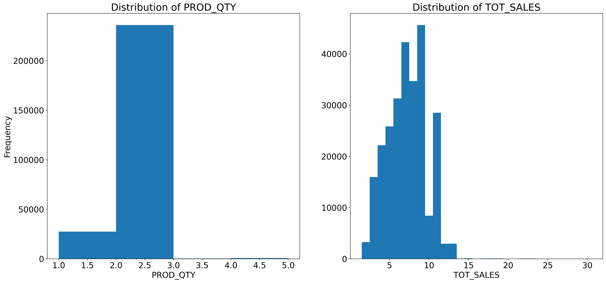

__Data preparation and customer analytics (task 1)__

__Analyst: Albert Dellor__

__Email: dell.datascience@gmail.com__

__Table of Contents__

<ul>
<li><a href="#intro">Introduction</a></li>
<li><a href="#wrangling">Data Wrangling</a></li>
<li><a href="#EDA">Exploratory Data Analysis</a></li>
<li><a href="#conclusions">Strategy & Conclusions</a></li>
</ul>

# __Introduction__
<a id="intro"></a>

Supermarkets will regularly change their store layouts, product selections, prices and promotions. This is to satisfy their customer’s changing needs and preferences, keep up with the increasing competition in the market or to capitalise on new opportunities. I evaluate and analyse the performance of change and recommend whether it has been successful. 

I have been approached by my client, the Category Manager for Chips, who wants to better understand the types of customers who purchase Chips and their purchasing behaviour within the region. The insights from this analysis will feed into the supermarket’s strategic plan for the chip category in the next half year.

This project aims to analyse client's transaction dataset and identify customer purchasing behaviours to generate insights and provide commercial recommendations.

## __Data description__
This dataset was made available by Quantium as part of their Data Analytics Virtual Experience program. It consists of transaction dataset; QVI_transaction_data.xlsx and and behaviour dataset; QVI_purchase_behaviour.csv data sets.

QVI_purchase_behaviour.csv has 726373 by 3 rows and columns respectively.

- `LYLTY_CARD_NBR`: Loyalty card number of customers
- `LIFESTAGE`: life stage of customers
- `PREMIUM_CUSTOMER`: purchasing status of customers

QVI_transaction_data.xlsx has 264836 by 8 rows and columns respectively.

- `DATE`: Data of transaction
- `STORE_NBR`: Store within which transaction took place
- `LYLTY_CARD_NBR`: Loyaity card number of customer
- `TXN_ID`: Transaction Identification
- `PROD_NBR`: Product number
- `PROD_NAME`: Product name
- `PROD_QTY`: Quantity of product purchased
- `TOT_SALES`: Total cost of product sold

# __Data Wrangling__
<a id="Wrangling"></a>

## __Import all packages and set plots to be embedded inline__


```
!pip install wordcloud openpyxl
import numpy as np
import pandas as pd
import matplotlib.pyplot as plt
import seaborn as sb
import requests
from IPython.display import Image
from wordcloud import WordCloud
from collections import Counter
import matplotlib.dates as dates
%matplotlib inline
from scipy.signal import find_peaks
from scipy.stats import ttest_ind
```

    Collecting wordcloud
      Downloading wordcloud-1.9.1.1-cp38-cp38-manylinux_2_17_x86_64.manylinux2014_x86_64.whl (461 kB)
         ━━━━━━━━━━━━━━━━━━━━━━━━━━━━━━━━━━━━━━ 461.4/461.4 kB 34.9 MB/s eta 0:00:00
    [?25hCollecting openpyxl
      Downloading openpyxl-3.1.2-py2.py3-none-any.whl (249 kB)
         ━━━━━━━━━━━━━━━━━━━━━━━━━━━━━━━━━━━━━━ 250.0/250.0 kB 39.8 MB/s eta 0:00:00
    [?25hRequirement already satisfied: matplotlib in /opt/python/envs/default/lib/python3.8/site-packages (from wordcloud) (3.5.1)
    Requirement already satisfied: pillow in /opt/python/envs/default/lib/python3.8/site-packages (from wordcloud) (9.5.0)
    Requirement already satisfied: numpy>=1.6.1 in /opt/python/envs/default/lib/python3.8/site-packages (from wordcloud) (1.23.5)
    Collecting et-xmlfile
      Downloading et_xmlfile-1.1.0-py3-none-any.whl (4.7 kB)
    Requirement already satisfied: fonttools>=4.22.0 in /opt/python/envs/default/lib/python3.8/site-packages (from matplotlib->wordcloud) (4.39.3)
    Requirement already satisfied: packaging>=20.0 in /opt/python/envs/default/lib/python3.8/site-packages (from matplotlib->wordcloud) (23.1)
    Requirement already satisfied: kiwisolver>=1.0.1 in /opt/python/envs/default/lib/python3.8/site-packages (from matplotlib->wordcloud) (1.4.4)
    Requirement already satisfied: python-dateutil>=2.7 in /opt/python/envs/default/lib/python3.8/site-packages (from matplotlib->wordcloud) (2.8.2)
    Requirement already satisfied: cycler>=0.10 in /opt/python/envs/default/lib/python3.8/site-packages (from matplotlib->wordcloud) (0.11.0)
    Requirement already satisfied: pyparsing>=2.2.1 in /opt/python/envs/default/lib/python3.8/site-packages (from matplotlib->wordcloud) (3.0.9)
    Requirement already satisfied: six>=1.5 in /opt/python/envs/default/lib/python3.8/site-packages (from python-dateutil>=2.7->matplotlib->wordcloud) (1.16.0)
    Installing collected packages: et-xmlfile, openpyxl, wordcloud
    Successfully installed et-xmlfile-1.1.0 openpyxl-3.1.2 wordcloud-1.9.1.1
    
    [notice] A new release of pip is available: 23.0.1 -> 23.1.2
    [notice] To update, run: pip install --upgrade pip


## __Loading the dataset: Get the URL of dataset. Create request, download transaction and purchase behaviour datasets__


```
urls = ['https://cdn.theforage.com/vinternships/companyassets/32A6DqtsbF7LbKdcq/QVI_transaction_data.xlsx',
        'https://cdn.theforage.com/vinternships/companyassets/32A6DqtsbF7LbKdcq/QVI_purchase_behaviour.csv']

for url in urls:
    data = requests.get(url)
    with open(url.split('/')[-1], mode = 'wb') as file:
        file.write(data.content)
```

## __Loading Datasets__


```
transactions = pd.read_excel('/data/notebook_files/QVI_transaction_data.xlsx')
purchase_behavor = pd.read_csv('/data/notebook_files/QVI_purchase_behaviour.csv')
```

## __Data Assessment__
### __Visual assessment and programmatic assessments were conducted to detect quality and tidiness issues with both dataset__

 - Visual assessment of data in Microsoft excell
 - Programmatic assessment in python

## __Assessment: QVI_purchase_behaviour.csv__


```
purchase_behavor.sample(5)
```


<div>
<style scoped>
    .dataframe tbody tr th:only-of-type {
        vertical-align: middle;
    }

    .dataframe tbody tr th {
        vertical-align: top;
    }

    .dataframe thead th {
        text-align: right;
    }
</style>
<table border="1" class="dataframe">
  <thead>
    <tr style="text-align: right;">
      <th></th>
      <th>LYLTY_CARD_NBR</th>
      <th>LIFESTAGE</th>
      <th>PREMIUM_CUSTOMER</th>
    </tr>
  </thead>
  <tbody>
    <tr>
      <th>57050</th>
      <td>215304</td>
      <td>OLDER SINGLES/COUPLES</td>
      <td>Budget</td>
    </tr>
    <tr>
      <th>22133</th>
      <td>80224</td>
      <td>MIDAGE SINGLES/COUPLES</td>
      <td>Mainstream</td>
    </tr>
    <tr>
      <th>58285</th>
      <td>220197</td>
      <td>OLDER SINGLES/COUPLES</td>
      <td>Budget</td>
    </tr>
    <tr>
      <th>14728</th>
      <td>54182</td>
      <td>OLDER FAMILIES</td>
      <td>Mainstream</td>
    </tr>
    <tr>
      <th>23865</th>
      <td>87070</td>
      <td>RETIREES</td>
      <td>Mainstream</td>
    </tr>
  </tbody>
</table>
</div>


## __Dimensions of data set__


```
print('Rows: {}\nColumns: {}'.format(purchase_behavor.shape[0]\
                                     ,purchase_behavor.shape[1]))
```

    Rows: 72637
    Columns: 3


## __Missing values and data types__


```
purchase_behavor.info()
```

    <class 'pandas.core.frame.DataFrame'>
    RangeIndex: 72637 entries, 0 to 72636
    Data columns (total 3 columns):
     #   Column            Non-Null Count  Dtype 
    ---  ------            --------------  ----- 
     0   LYLTY_CARD_NBR    72637 non-null  int64 
     1   LIFESTAGE         72637 non-null  object
     2   PREMIUM_CUSTOMER  72637 non-null  object
    dtypes: int64(1), object(2)
    memory usage: 1.7+ MB


## __Number of unique values in PREMIUM_CUSTOMER and LIFESTAGE__


```
purchase_behavor.PREMIUM_CUSTOMER.nunique(),\
purchase_behavor.LIFESTAGE.nunique()
```


    (3, 7)


```
purchase_behavor.PREMIUM_CUSTOMER.unique().tolist()
```


    ['Premium', 'Mainstream', 'Budget']


```
purchase_behavor.LIFESTAGE.unique().tolist()
```


    ['YOUNG SINGLES/COUPLES',
     'YOUNG FAMILIES',
     'OLDER SINGLES/COUPLES',
     'MIDAGE SINGLES/COUPLES',
     'NEW FAMILIES',
     'OLDER FAMILIES',
     'RETIREES']


### __NB__:
The data consists of __72637 rows__ by __3 columns__. There are __no missing vaules__. However, __PREMIUM_CUSTOMER__ and __LIFESTAGE__ columns have few number of unique values, thus can be converted from string object to categorical date type as they hold no ordinal value.

## __Assessment: QVI_transaction_data.xlsx__


```
transactions.sample(5)
```


<div>
<style scoped>
    .dataframe tbody tr th:only-of-type {
        vertical-align: middle;
    }

    .dataframe tbody tr th {
        vertical-align: top;
    }

    .dataframe thead th {
        text-align: right;
    }
</style>
<table border="1" class="dataframe">
  <thead>
    <tr style="text-align: right;">
      <th></th>
      <th>DATE</th>
      <th>STORE_NBR</th>
      <th>LYLTY_CARD_NBR</th>
      <th>TXN_ID</th>
      <th>PROD_NBR</th>
      <th>PROD_NAME</th>
      <th>PROD_QTY</th>
      <th>TOT_SALES</th>
    </tr>
  </thead>
  <tbody>
    <tr>
      <th>175355</th>
      <td>43400</td>
      <td>68</td>
      <td>68138</td>
      <td>65520</td>
      <td>25</td>
      <td>Pringles SourCream  Onion 134g</td>
      <td>1</td>
      <td>3.7</td>
    </tr>
    <tr>
      <th>167997</th>
      <td>43318</td>
      <td>222</td>
      <td>222050</td>
      <td>221787</td>
      <td>95</td>
      <td>Sunbites Whlegrn    Crisps Frch/Onin 90g</td>
      <td>2</td>
      <td>3.4</td>
    </tr>
    <tr>
      <th>126212</th>
      <td>43521</td>
      <td>125</td>
      <td>125243</td>
      <td>129269</td>
      <td>42</td>
      <td>Doritos Corn Chip Mexican Jalapeno 150g</td>
      <td>2</td>
      <td>7.8</td>
    </tr>
    <tr>
      <th>104651</th>
      <td>43359</td>
      <td>72</td>
      <td>72110</td>
      <td>71058</td>
      <td>75</td>
      <td>Cobs Popd Sea Salt  Chips 110g</td>
      <td>2</td>
      <td>7.6</td>
    </tr>
    <tr>
      <th>129161</th>
      <td>43413</td>
      <td>174</td>
      <td>174315</td>
      <td>175433</td>
      <td>15</td>
      <td>Twisties Cheese     270g</td>
      <td>2</td>
      <td>9.2</td>
    </tr>
  </tbody>
</table>
</div>


## __Dimensions of data set__


```
print('Rows: {}\nColumns: {}'.format(transactions.shape[0],\
                                     transactions.shape[1]))
```

    Rows: 264836
    Columns: 8


## __Missing values and data types__


```
transactions.info()
```

    <class 'pandas.core.frame.DataFrame'>
    RangeIndex: 264836 entries, 0 to 264835
    Data columns (total 8 columns):
     #   Column          Non-Null Count   Dtype  
    ---  ------          --------------   -----  
     0   DATE            264836 non-null  int64  
     1   STORE_NBR       264836 non-null  int64  
     2   LYLTY_CARD_NBR  264836 non-null  int64  
     3   TXN_ID          264836 non-null  int64  
     4   PROD_NBR        264836 non-null  int64  
     5   PROD_NAME       264836 non-null  object 
     6   PROD_QTY        264836 non-null  int64  
     7   TOT_SALES       264836 non-null  float64
    dtypes: float64(1), int64(6), object(1)
    memory usage: 16.2+ MB


## __Descriptive statistics__


```
transactions.describe()[['PROD_QTY','TOT_SALES']]
```


<div>
<style scoped>
    .dataframe tbody tr th:only-of-type {
        vertical-align: middle;
    }

    .dataframe tbody tr th {
        vertical-align: top;
    }

    .dataframe thead th {
        text-align: right;
    }
</style>
<table border="1" class="dataframe">
  <thead>
    <tr style="text-align: right;">
      <th></th>
      <th>PROD_QTY</th>
      <th>TOT_SALES</th>
    </tr>
  </thead>
  <tbody>
    <tr>
      <th>count</th>
      <td>264836.000000</td>
      <td>264836.000000</td>
    </tr>
    <tr>
      <th>mean</th>
      <td>1.907309</td>
      <td>7.304200</td>
    </tr>
    <tr>
      <th>std</th>
      <td>0.643654</td>
      <td>3.083226</td>
    </tr>
    <tr>
      <th>min</th>
      <td>1.000000</td>
      <td>1.500000</td>
    </tr>
    <tr>
      <th>25%</th>
      <td>2.000000</td>
      <td>5.400000</td>
    </tr>
    <tr>
      <th>50%</th>
      <td>2.000000</td>
      <td>7.400000</td>
    </tr>
    <tr>
      <th>75%</th>
      <td>2.000000</td>
      <td>9.200000</td>
    </tr>
    <tr>
      <th>max</th>
      <td>200.000000</td>
      <td>650.000000</td>
    </tr>
  </tbody>
</table>
</div>


## __check for duplicates.__
__The only unique identifier in dataset is TXN_ID (transaction id).__
__Thus is used to find duplicates__


```
transactions[transactions.duplicated()]
```


<div>
<style scoped>
    .dataframe tbody tr th:only-of-type {
        vertical-align: middle;
    }

    .dataframe tbody tr th {
        vertical-align: top;
    }

    .dataframe thead th {
        text-align: right;
    }
</style>
<table border="1" class="dataframe">
  <thead>
    <tr style="text-align: right;">
      <th></th>
      <th>DATE</th>
      <th>STORE_NBR</th>
      <th>LYLTY_CARD_NBR</th>
      <th>TXN_ID</th>
      <th>PROD_NBR</th>
      <th>PROD_NAME</th>
      <th>PROD_QTY</th>
      <th>TOT_SALES</th>
    </tr>
  </thead>
  <tbody>
    <tr>
      <th>124845</th>
      <td>43374</td>
      <td>107</td>
      <td>107024</td>
      <td>108462</td>
      <td>45</td>
      <td>Smiths Thinly Cut   Roast Chicken 175g</td>
      <td>2</td>
      <td>6.0</td>
    </tr>
  </tbody>
</table>
</div>


## __Further investigate the transaction ID__


```
transactions.query("TXN_ID == 108462")[['TXN_ID','PROD_NAME','PROD_QTY','TOT_SALES']]
```


<div>
<style scoped>
    .dataframe tbody tr th:only-of-type {
        vertical-align: middle;
    }

    .dataframe tbody tr th {
        vertical-align: top;
    }

    .dataframe thead th {
        text-align: right;
    }
</style>
<table border="1" class="dataframe">
  <thead>
    <tr style="text-align: right;">
      <th></th>
      <th>TXN_ID</th>
      <th>PROD_NAME</th>
      <th>PROD_QTY</th>
      <th>TOT_SALES</th>
    </tr>
  </thead>
  <tbody>
    <tr>
      <th>124843</th>
      <td>108462</td>
      <td>Smiths Thinly Cut   Roast Chicken 175g</td>
      <td>2</td>
      <td>6.0</td>
    </tr>
    <tr>
      <th>124844</th>
      <td>108462</td>
      <td>Cheetos Chs &amp; Bacon Balls 190g</td>
      <td>2</td>
      <td>6.6</td>
    </tr>
    <tr>
      <th>124845</th>
      <td>108462</td>
      <td>Smiths Thinly Cut   Roast Chicken 175g</td>
      <td>2</td>
      <td>6.0</td>
    </tr>
  </tbody>
</table>
</div>


### __NB__
There are __no missing data__. __PROD_QTY and TOT_SALES have 75% of entire data being under 2 and 9.2 respectively__, however the maximun values are 200 and 650 respectively, there might be outliers present. Further investigation reveal that there was double recording of a transaction involving __Smiths Thinly Cut Roast Chicken 175g__.

## __Summary of assessment__

Transaction data (unclean)

### __Tidiness issues__
 1. Product name contains product mass variable as well, thus must be separated into respective columns as each variable must form exclusive column to comply with data tidiness standards.
 
 2. Presence of duplicate transaction involving Smiths Thinly Cut Roast Chicken 175g. All entries must be unique. Thus duplicates are dropped.
 
 3. Absence of unit cost column.
 
 
### __Quality issues__

 4. PROD_QTY and TOT_SALES may have outliers.
 
 5. product name has inconsistent spacing thus must be formated to comply with data quality standards.
 
 6. Product name may contain irrelevant products other than chips.
 
 7. date format is in Excel serial number instead of pandas datetime object.
 
 8. convert `PREMIUM_CUSTOMER` and `LIFESTAGE` columns to categorical data type.
 
Purchase behavior data(clean) 

## __Data Cleaning__
In this sectionall the data issues outlined in assesment stage are cleaned.


```
# make copies of both data sets
purchase_behavor_copy = purchase_behavor.copy()
transactions_copy = transactions.copy()
```

### __Issue #1: separate product mass and product name into deparate columns__


```
regex = r'(\d+)(g|G)'
transactions_copy['PACK_SIZE'] = pd.to_numeric(
                                    transactions_copy.PROD_NAME\
                                    .str.extract(regex)[0])
```

### __Issue #2: Remove duplicates in data set__


```
transactions_copy.drop_duplicates(inplace = True)
```

### __Issue #3: Add a unit cost column__


```
transactions_copy['UNIT_COST'] = np.divide(transactions_copy.TOT_SALES,transactions_copy.PROD_QTY)
```

### __Issue #7: Format date from Excel serial number to  pandas datetime object__


```
transactions_copy.DATE = pd.to_datetime(transactions_copy.DATE, unit='d',\
                         origin=pd.Timestamp('1899-12-30'))
```

### __Issue #4: PROD_QTY and TOT_SALES may have outliers__


```
transactions_copy.nlargest(6,'TOT_SALES')[['PROD_NAME','PROD_QTY','TOT_SALES']]
```


<div>
<style scoped>
    .dataframe tbody tr th:only-of-type {
        vertical-align: middle;
    }

    .dataframe tbody tr th {
        vertical-align: top;
    }

    .dataframe thead th {
        text-align: right;
    }
</style>
<table border="1" class="dataframe">
  <thead>
    <tr style="text-align: right;">
      <th></th>
      <th>PROD_NAME</th>
      <th>PROD_QTY</th>
      <th>TOT_SALES</th>
    </tr>
  </thead>
  <tbody>
    <tr>
      <th>69762</th>
      <td>Dorito Corn Chp     Supreme 380g</td>
      <td>200</td>
      <td>650.0</td>
    </tr>
    <tr>
      <th>69763</th>
      <td>Dorito Corn Chp     Supreme 380g</td>
      <td>200</td>
      <td>650.0</td>
    </tr>
    <tr>
      <th>5179</th>
      <td>Smiths Crnkle Chip  Orgnl Big Bag 380g</td>
      <td>5</td>
      <td>29.5</td>
    </tr>
    <tr>
      <th>55558</th>
      <td>Smiths Crnkle Chip  Orgnl Big Bag 380g</td>
      <td>5</td>
      <td>29.5</td>
    </tr>
    <tr>
      <th>69496</th>
      <td>Smiths Crnkle Chip  Orgnl Big Bag 380g</td>
      <td>5</td>
      <td>29.5</td>
    </tr>
    <tr>
      <th>117850</th>
      <td>Smiths Crnkle Chip  Orgnl Big Bag 380g</td>
      <td>5</td>
      <td>29.5</td>
    </tr>
  </tbody>
</table>
</div>


looking at the 6 largest TOT_SALES, its evident that 650 are outliers.
To further comfirm this, it is general accepted that any data point that falls outside the range of Q1 - 1.5 x IQR to Q3 + 1.5 x IQR is considered a potential outlier.


```
stats = transactions_copy.describe()
```


```
def outlier(column):
    Q1 = stats.loc['25%'][column]
    Q3 = stats.loc['75%'][column]
    IQR = Q3 - Q1
    low_range = Q1 - (1.5 * IQR)
    upper_range = Q3 + (1.5 * IQR)
    print("For {} an outlier is any value outside the range of {:.2f} and {:.2f}".\
    format(column,low_range,upper_range))
```


```
outlier('PROD_QTY')
outlier('TOT_SALES')
```

    For PROD_QTY an outlier is any value outside the range of 2.00 and 2.00
    For TOT_SALES an outlier is any value outside the range of -0.30 and 14.90


### __Looking at the descriptive statistics of both datasets__


```
pd.merge(pd.DataFrame(transactions_copy.PROD_QTY.describe()),\
         pd.DataFrame(transactions_copy.TOT_SALES.describe()),\
         on=pd.DataFrame(transactions_copy.TOT_SALES.describe()).index).rename(columns={'key_0':'index'})
```


<div>
<style scoped>
    .dataframe tbody tr th:only-of-type {
        vertical-align: middle;
    }

    .dataframe tbody tr th {
        vertical-align: top;
    }

    .dataframe thead th {
        text-align: right;
    }
</style>
<table border="1" class="dataframe">
  <thead>
    <tr style="text-align: right;">
      <th></th>
      <th>index</th>
      <th>PROD_QTY</th>
      <th>TOT_SALES</th>
    </tr>
  </thead>
  <tbody>
    <tr>
      <th>0</th>
      <td>count</td>
      <td>264835.000000</td>
      <td>264835.000000</td>
    </tr>
    <tr>
      <th>1</th>
      <td>mean</td>
      <td>1.907308</td>
      <td>7.304205</td>
    </tr>
    <tr>
      <th>2</th>
      <td>std</td>
      <td>0.643655</td>
      <td>3.083231</td>
    </tr>
    <tr>
      <th>3</th>
      <td>min</td>
      <td>1.000000</td>
      <td>1.500000</td>
    </tr>
    <tr>
      <th>4</th>
      <td>25%</td>
      <td>2.000000</td>
      <td>5.400000</td>
    </tr>
    <tr>
      <th>5</th>
      <td>50%</td>
      <td>2.000000</td>
      <td>7.400000</td>
    </tr>
    <tr>
      <th>6</th>
      <td>75%</td>
      <td>2.000000</td>
      <td>9.200000</td>
    </tr>
    <tr>
      <th>7</th>
      <td>max</td>
      <td>200.000000</td>
      <td>650.000000</td>
    </tr>
  </tbody>
</table>
</div>


```
plt.figure(figsize=(22,10),dpi=400)
plt.rcParams['font.size'] = 18
plt.subplot(1,2,1)
bin = np.arange(1,5+1,1);
plt.hist(transactions_copy.PROD_QTY,bins=bin);
plt.xlabel('PROD_QTY');
plt.ylabel('Frequency');
plt.title('Distribution of PROD_QTY');

plt.subplot(1,2,2)
bin = np.arange(1.5, 30+1.5,1);
plt.hist(transactions_copy.TOT_SALES, bins=bin);
plt.xlabel('TOT_SALES');
plt.title('Distribution of TOT_SALES');
```


    

    


It is evident that a customer with loyalty card number 226000, purchased large orders on two occasions in 2018 and 2019, thus creating the outliers for PROD_QTY and corresponding TOT_SALES .

Additionally, the histograms clearly show that a majority of the data is located between 1 to 3 for PROD_QTY and 1 to 15 for TOT_SALES.

Therefore is is safe to say that 200 and 650 for PROD_QTY and TOT_SALES are outliers respectively and are removed from the datase

### __Outlier is droped from data set__


```
index = transactions_copy.query("TOT_SALES == 650").index.values
transactions_copy.drop(index,axis=0, inplace=True)
```

### __Issue 5: format spacing in product name__


```
transactions_copy['PROD_NAME'] = transactions_copy.PROD_NAME\
                                    .str.replace(regex, '',regex=True)\
                                    .str.replace(r'\s\s+', ' ',regex=True)\
                                    .str.replace('&', ' & ',regex=True)
```

### __Issue 6: examine products summary,rid it of irrelevant products__


```
def wordcloud(data):
    wordcloud = WordCloud(width = 1600, height = 1600, 
                background_color ='white', 
                min_font_size = 10).generate_from_frequencies(data)
    plt.figure(figsize = (16,8), facecolor = None,dpi=400) 
    plt.imshow(wordcloud) 
    plt.axis("off") 
    plt.tight_layout(pad = 0) 
    plt.show()
    
```

### __Summary of individual PROD_NAME words with wordcloud__


```
PROD_NAME = transactions_copy.PROD_NAME.str.replace("&","")
words = ' '.join(PROD_NAME.values).split()
data = Counter(words)
wordcloud(data)
```


    

    


Taking a quick glance, reveal that the column generally contains chips products. However the presence of some questionable words like __Salsa, salt, Mexican, Rock, Sea__ raise doubts and may indicate that not all products are chips.
Next entire PROD_NAMEs are summarised to get better sense of products.

### __Summary of entire  PROD_NAME products in wordcloud__


```
products = transactions_copy.PROD_NAME.value_counts().to_dict()
wordcloud(products)
```


    

    


It turns out that previously alarming words like __Sea, salt, Mexican, Rock etc.__ are actually part of chips product name or branding. With the exception of __salsa__ as it clearly doesn't qualify as chips and must be removed from column.

### __Identify all salsa entries__


```
salsa_df = transactions_copy[transactions_copy.PROD_NAME.\
                             str.contains('Salsa', case=False)]
total = salsa_df.PROD_NAME.value_counts().values.sum()
print('There are {} instances of irrelevant salsa products\
in dataset.\n'.format(total))
pd.DataFrame(salsa_df.PROD_NAME.value_counts()).reset_index().\
                            rename(columns={'index':'Product','PROD_NAME':'Counts'})
```

    There are 18094 instances of irrelevant salsa productsin dataset.
    


<div>
<style scoped>
    .dataframe tbody tr th:only-of-type {
        vertical-align: middle;
    }

    .dataframe tbody tr th {
        vertical-align: top;
    }

    .dataframe thead th {
        text-align: right;
    }
</style>
<table border="1" class="dataframe">
  <thead>
    <tr style="text-align: right;">
      <th></th>
      <th>Product</th>
      <th>Counts</th>
    </tr>
  </thead>
  <tbody>
    <tr>
      <th>0</th>
      <td>Old El Paso Salsa Dip Chnky Tom Ht</td>
      <td>3125</td>
    </tr>
    <tr>
      <th>1</th>
      <td>Old El Paso Salsa Dip Tomato Med</td>
      <td>3114</td>
    </tr>
    <tr>
      <th>2</th>
      <td>Old El Paso Salsa Dip Tomato Mild</td>
      <td>3085</td>
    </tr>
    <tr>
      <th>3</th>
      <td>Woolworths Mild Salsa</td>
      <td>1491</td>
    </tr>
    <tr>
      <th>4</th>
      <td>Doritos Salsa Mild</td>
      <td>1472</td>
    </tr>
    <tr>
      <th>5</th>
      <td>Smiths Crinkle Cut Tomato Salsa</td>
      <td>1470</td>
    </tr>
    <tr>
      <th>6</th>
      <td>Red Rock Deli SR Salsa  &amp;  Mzzrlla</td>
      <td>1458</td>
    </tr>
    <tr>
      <th>7</th>
      <td>Doritos Salsa Medium</td>
      <td>1449</td>
    </tr>
    <tr>
      <th>8</th>
      <td>Woolworths Medium Salsa</td>
      <td>1430</td>
    </tr>
  </tbody>
</table>
</div>


### __Remove 18094 instances of irrelevant salsa products from dataset__


```
salsa_index = salsa_df.index.tolist()
transactions_copy.drop(index=salsa_index, inplace=True)
print('After removing {} irrelevant sala entries,initial {} total\
                    entries reduced to {}'.\
                    format(total,transactions.shape[0],transactions_copy.shape[0]))
```

    After removing 18094 irrelevant sala entries,initial 264836 total                    entries reduced to 246739


### __Assess the top 20 most frequent words in descending order__


```
PROD_NAME = transactions_copy.PROD_NAME.str.replace("&","")
words = ' '.join(PROD_NAME.values).split()
word_counts = Counter(words)
sorted_words = sorted(word_counts.items(), key=lambda x: x[1], reverse=True)
for word, count in sorted_words[:20]:
    print(f'{word}: {count}')
```

    Chips: 49770
    Kettle: 41288
    Salt: 27976
    Cheese: 27890
    Smiths: 27389
    Pringles: 25102
    Crinkle: 22490
    Corn: 22061
    Doritos: 22041
    Original: 21560
    Cut: 19283
    Chip: 18645
    Chicken: 18576
    Chilli: 15390
    Sea: 14145
    Thins: 14075
    Sour: 13882
    Crisps: 12607
    Vinegar: 12402
    RRD: 11894


### __Issue #8: convert PREMIUM_CUSTOMER and LIFESTAGE columns to categorical data type__


```
purchase_behavor_copy.PREMIUM_CUSTOMER = purchase_behavor_copy.PREMIUM_CUSTOMER.astype('category')
purchase_behavor_copy.LIFESTAGE = purchase_behavor_copy.LIFESTAGE.astype('category')
```


```
purchase_behavor_copy.info()
```

    <class 'pandas.core.frame.DataFrame'>
    RangeIndex: 72637 entries, 0 to 72636
    Data columns (total 3 columns):
     #   Column            Non-Null Count  Dtype   
    ---  ------            --------------  -----   
     0   LYLTY_CARD_NBR    72637 non-null  int64   
     1   LIFESTAGE         72637 non-null  category
     2   PREMIUM_CUSTOMER  72637 non-null  category
    dtypes: category(2), int64(1)
    memory usage: 709.9 KB


### __Finally merge two data sets together__


```
clean_data = pd.merge(transactions_copy, purchase_behavor_copy, left_on='LYLTY_CARD_NBR',\
                      right_on='LYLTY_CARD_NBR', how='left')
```

### __Dimension of final dataset__


```
clean_data.shape
```


    (246739, 12)


### __missing values in dataset__


```
clean_data.isnull().sum()
```


<pre>DATE                0
STORE_NBR           0
LYLTY_CARD_NBR      0
TXN_ID              0
PROD_NBR            0
PROD_NAME           0
PROD_QTY            0
TOT_SALES           0
PACK_SIZE           0
UNIT_COST           0
LIFESTAGE           0
PREMIUM_CUSTOMER    0
dtype: int64</pre>


### __Save clean dataset__


```
clean_data.to_csv('wrangled_data.csv',index=False)
```

# __Exploratory Data Analysis__
<a id="EDA"></a>

## __Load final datase__


```
df = pd.read_csv('/data/notebook_files/wrangled_data.csv',parse_dates=['DATE'])
```

## __Assess final dataset__


```
df.info()
```

    <class 'pandas.core.frame.DataFrame'>
    RangeIndex: 246739 entries, 0 to 246738
    Data columns (total 13 columns):
     #   Column            Non-Null Count   Dtype         
    ---  ------            --------------   -----         
     0   DATE              246739 non-null  datetime64[ns]
     1   STORE_NBR         246739 non-null  int64         
     2   LYLTY_CARD_NBR    246739 non-null  int64         
     3   TXN_ID            246739 non-null  int64         
     4   PROD_NBR          246739 non-null  int64         
     5   PROD_NAME         246739 non-null  object        
     6   PROD_QTY          246739 non-null  int64         
     7   TOT_SALES         246739 non-null  float64       
     8   PACK_SIZE         246739 non-null  int64         
     9   UNIT_COST         246739 non-null  float64       
     10  LIFESTAGE         246739 non-null  object        
     11  PREMIUM_CUSTOMER  246739 non-null  object        
     12  PROD_BRAND        246739 non-null  object        
    dtypes: datetime64[ns](1), float64(2), int64(6), object(4)
    memory usage: 24.5+ MB


## __What is the daily number of transaction over time?__

### __Analyse daily number of transaction over time__


```
color = sb.color_palette()[0]

date_txn = df.groupby('DATE')['TXN_ID'].count()
date = df.groupby(pd.Grouper(key='DATE', freq='MS'))['TXN_ID'].count()
avg_daily = date_txn.values.mean()
print('The average daily number of transaction is {}'.format(avg_daily))

plt.rcParams['font.size'] = 18
plt.figure(figsize=(14,4), dpi = 400)
plt.plot(date_txn.index,date_txn.values,color = 'black');
plt.axhline(y= avg_daily, color = 'b', label = f'Avg daily TXN count');
plt.legend()
plt.xticks(rotation=90,ticks=date.index);
plt.ylabel('Number of daily transactions');
plt.title('Daily transactions');
plt.savefig('total_transaction',dpi=120,bbox_inches='tight')
```

    The average daily number of transaction is 677.8543956043956


    

    


Analysing daily transactions over time reveals that daily average transactions hover around $678 with little deviation throughout the year except in early December, where daily average transactions shoot up to a little above 859, before quickly returning to normal levels.

## __What is the weekly number of transaction over time?__

### __Analyse weekly transactions__


```
# group by weeks
date_TXN = df.groupby(pd.Grouper(key='DATE', freq='1W'))['TXN_ID'].count()
avg = date_TXN.values.mean()
print('The mean weekly total transaction is {}'.format(avg))

# group by months
date= df.groupby(pd.Grouper(key='DATE', freq='MS'))['TXN_ID'].count()
print(type(date.index))
xticks = date.index.strftime('%b')
yticks =['3.0k','3.5k','4.0k','4.5k','5.0k','5.5k','6.0k']

plt.figure(figsize=(14,6), dpi = 400)
plt.plot(date_TXN.index[1:],date_TXN.values[1:],color='purple', linewidth=5)
plt.ylabel('Weekly transactions',labelpad=30)

# Remove left, top and right border lines
plt.gca().spines['left'].set_visible(False)
plt.gca().spines['top'].set_visible(False)
plt.gca().spines['right'].set_visible(False)

# remove x and y tick marks
plt.tick_params(axis='y', which='both', left=False)
plt.tick_params(axis='x', which='both', bottom=False)

# rename the xticks
plt.xticks(date.index, xticks)

# limit the ylimit
plt.ylim([3000,6000])

# rename yticks
plt.yticks(plt.yticks()[0],yticks);

# save the plot with white background
plt.savefig('weekly_transaction.png', dpi=120, bbox_inches='tight', facecolor='w') 
```

    The mean weekly total transaction is 4655.452830188679
    <class 'pandas.core.indexes.datetimes.DatetimeIndex'>


    

    


Also similar trend is recorded in weekly total transaction, which remains fairly stable around the mean of 4655 up until early December, which records a drastic increase in sales before crushing to below average in early January and finally recovering in February. This customer purchase behaviour is investigated further.

## __What is the daily transactions in December alone?__

### __Analyse daily transactions in December__


```
plt.figure(figsize=(16,6), dpi = 400)
christmas_TXN = df.query("DATE > '2018-12-01' & DATE < '2019-01-01'")
christmas_trend = christmas_TXN.groupby(pd.Grouper(key='DATE', freq='1D'))['TXN_ID'].count()
plt.bar(christmas_trend.index,christmas_trend.values,color=color);
plt.xticks(rotation=90);
plt.ylabel('Daily transactions ');
plt.title('Daily transactions in December');
plt.savefig('dailyy_transaction',dpi=120,bbox_inches='tight')
```


    

    


A further look into the trend confirms that daily transactions increase leading up to the __25th__ (Christmas day) before crashing to 0, as shops close for Christmas. They then reopen on the 26th and transactions recover steadily to average levels.

## __What is the most sold pack size?__ 

### __Analyse pack size__


```
pd.DataFrame(df.PACK_SIZE.describe())
```


<div>
<style scoped>
    .dataframe tbody tr th:only-of-type {
        vertical-align: middle;
    }

    .dataframe tbody tr th {
        vertical-align: top;
    }

    .dataframe thead th {
        text-align: right;
    }
</style>
<table border="1" class="dataframe">
  <thead>
    <tr style="text-align: right;">
      <th></th>
      <th>PACK_SIZE</th>
    </tr>
  </thead>
  <tbody>
    <tr>
      <th>count</th>
      <td>246739.000000</td>
    </tr>
    <tr>
      <th>mean</th>
      <td>175.583523</td>
    </tr>
    <tr>
      <th>std</th>
      <td>59.432239</td>
    </tr>
    <tr>
      <th>min</th>
      <td>70.000000</td>
    </tr>
    <tr>
      <th>25%</th>
      <td>150.000000</td>
    </tr>
    <tr>
      <th>50%</th>
      <td>170.000000</td>
    </tr>
    <tr>
      <th>75%</th>
      <td>175.000000</td>
    </tr>
    <tr>
      <th>max</th>
      <td>380.000000</td>
    </tr>
  </tbody>
</table>
</div>


```
color = sb.color_palette()[0]
plt.figure(figsize=(16,6), dpi = 400)
pack_size = df.PACK_SIZE.value_counts()
# pack_size
plt.bar(pack_size.index.astype(str),pack_size.values);
plt.xticks(rotation=90);
plt.ylabel('Quantities sold');
plt.xlabel('Pack size');
plt.title('Quantities of pack sizes sold');
```


    

    


Out of all the pack sizes, the ost purchased among customers are size 175g, 150, 134, 110, 170and 165. With size 175g pack sizes being almost doubled that of size 150. Therefore, management should stock more of these sizes and less of size 200, 135, 250, 90, 190, 160,220, 70, 180, 125.

## __What are the customer's favourite brands ?__

### __Create brand column and consilidate similar brands together__


```
df['PROD_BRAND'] = pd.Series([x.split()[0] for x in df.PROD_NAME.values])
```

### __Combine RED and RRD brands as both are Red Rock Deli chips__


```
df['PROD_BRAND'] = df['PROD_BRAND'].str.replace('Red|RRD','RRD Red',regex=True)
```


```
plt.figure(figsize=(16,6), dpi = 400)
brands = df['PROD_BRAND'].value_counts()
plt.bar(brands.index,brands.values);
plt.xticks(rotation=90);
plt.ylabel('Quantities sold');
plt.title('Quantities of brands sold');
```


    

    


Kettle, Smiths, Pringles and Doritos are the top 4 brands most preferred by the customers as evident in the large numbers sold. Therefore, a strategy would be to stock more of these and reduce stocking brands like French, NCC, Sunbites, GrnWves, Woolworths, burger and snbts.

## __Who spends the most on chips (total sales) ?__ 

### __Analyse total sales of customer by LIFESTAGE__


```
life_stage_spender = df.groupby(['LIFESTAGE'])['TOT_SALES'].sum().sort_values(ascending=False).reset_index()
display(life_stage_spender)

plt.figure(figsize=(16,6), dpi = 400)
ax=sb.barplot(x=life_stage_spender.LIFESTAGE,y=life_stage_spender.TOT_SALES,color=color)

# reduce fonts size and lower 
plt.xticks(fontsize=10)
ax.set_xticklabels([x.lower() for x in life_stage_spender.LIFESTAGE.unique()])

# adjust plot up
plt.subplots_adjust(bottom=0.2)

plt.title('Total chips sale by customer life stage');
```


<div>
<style scoped>
    .dataframe tbody tr th:only-of-type {
        vertical-align: middle;
    }

    .dataframe tbody tr th {
        vertical-align: top;
    }

    .dataframe thead th {
        text-align: right;
    }
</style>
<table border="1" class="dataframe">
  <thead>
    <tr style="text-align: right;">
      <th></th>
      <th>LIFESTAGE</th>
      <th>TOT_SALES</th>
    </tr>
  </thead>
  <tbody>
    <tr>
      <th>0</th>
      <td>OLDER SINGLES/COUPLES</td>
      <td>376013.65</td>
    </tr>
    <tr>
      <th>1</th>
      <td>RETIREES</td>
      <td>342381.90</td>
    </tr>
    <tr>
      <th>2</th>
      <td>OLDER FAMILIES</td>
      <td>328519.90</td>
    </tr>
    <tr>
      <th>3</th>
      <td>YOUNG FAMILIES</td>
      <td>294627.90</td>
    </tr>
    <tr>
      <th>4</th>
      <td>YOUNG SINGLES/COUPLES</td>
      <td>243756.60</td>
    </tr>
    <tr>
      <th>5</th>
      <td>MIDAGE SINGLES/COUPLES</td>
      <td>172523.80</td>
    </tr>
    <tr>
      <th>6</th>
      <td>NEW FAMILIES</td>
      <td>47347.95</td>
    </tr>
  </tbody>
</table>
</div>


    

    


## __What kind of chips are they spending on (total sales) ?__ 

### __Analyse total sales of customer by LIFESTAGE and PREMIUM_CUSTOMER__


```
premium_status = df.groupby(['LIFESTAGE','PREMIUM_CUSTOMER'])['TOT_SALES']\
                .sum().sort_values(ascending=False).reset_index()
plt.figure(figsize=(16,6), dpi= 400);
ax = sb.barplot(x=premium_status.LIFESTAGE,y=premium_status.TOT_SALES,\
              hue=premium_status.PREMIUM_CUSTOMER,palette='Blues_r')

plt.legend(loc = 6, bbox_to_anchor = (1.0, 0.5)); 
plt.title('TOT_SALES of customers  by lifestage & affluence')

# reduce fonts size and lower 
plt.xticks(fontsize=10)
ax.set_xticklabels([x.lower() for x in premium_status.LIFESTAGE.unique()])

# adjust plot up
plt.subplots_adjust(bottom=0.2)
# place legend at bottom of plot
plt.legend(loc='upper center', bbox_to_anchor=(0.5, -0.15), ncol=3)

# plt.savefig('tot_sales',dpi=120,bbox_inches='tight')
```


    

    


A further examination of purchase status, reveal that sales are coming mainly from Budget-older-families, Mainstream-young-singles/couples, Mainstream-retirees and Budget-young-families. Therefore these are the primary clients.

### __Analyse quantities of chips purchase by customer by life stage and purchase class__


```
premium_status_qty = df.groupby(['LIFESTAGE','PREMIUM_CUSTOMER'])['PROD_QTY']\
                .sum().sort_values(ascending=False).reset_index()
plt.figure(figsize=(16,6), dpi= 400)
ax = sb.barplot(x=premium_status_qty.LIFESTAGE,y=premium_status_qty.PROD_QTY,\
              hue=premium_status_qty.PREMIUM_CUSTOMER,palette='Blues_r')
# plt.xticks(rotation=75)
plt.legend(loc = 6, bbox_to_anchor = (1.0, 0.5)); 
plt.title('Quantity of Chips bought by customers per segment')

# reduce fonts size and lower 
plt.xticks(fontsize=10)
ax.set_xticklabels([x.lower() for x in premium_status_qty.LIFESTAGE.unique()])

# adjust plot up
plt.subplots_adjust(bottom=0.2)
# place legend at bottom of plot
plt.legend(loc='upper center', bbox_to_anchor=(0.5, -0.15), ncol=3);

# plt.savefig('quantity_of_chips',dpi=120,bbox_inches='tight')
```


    

    


Consequently,the product quantity purchased closely mirrows the trend of total sales, further validating the findings.

## __How many customer by segment ?__

### __Analyse number of customers in each segment__


```
customers = df.groupby(['LIFESTAGE','PREMIUM_CUSTOMER'])['LYLTY_CARD_NBR']\
                .count().sort_values(ascending=False).reset_index()

plt.figure(figsize=(16,6), dpi= 400)
ax = sb.barplot(x=customers.LIFESTAGE,y=customers.LYLTY_CARD_NBR,
                     hue=customers.PREMIUM_CUSTOMER,palette='Blues_r')

# reduce fonts size and lower 
plt.xticks(fontsize=10)
ax.set_xticklabels([x.lower() for x in customers.LIFESTAGE.unique()])

# adjust plot up
plt.subplots_adjust(bottom=0.2)
# place legend at bottom of plot
plt.legend(loc='upper center', bbox_to_anchor=(0.5, -0.15), ncol=3)

# set x and y labels
ax.set_xlabel('')
ax.set_ylabel('Proportion of customers',fontsize=10)

# remove spines 
plt.gca().spines['left'].set_visible(False)
plt.gca().spines['right'].set_visible(False)
plt.gca().spines['top'].set_visible(False)

yticks = ['0','5k','10k','15k','20k','25k'];
plt.yticks(plt.yticks()[0],yticks);

# plt.savefig('customers_per_segment', dpi=300, bbox_inches="tight", facecolor='w')
```


    

    


There are more Budget-older-families, Mainstream-retirees and Mainstream-young-singles/couples who buy chips. This reflects the total product quantities purchased and ultimately also reflects the total sales.
Higher sales may also be driven by more units of chips being bought per customer. This is looked at next.

## __What is the average number of chips bought per customer by segment?__

### __Analyse average number of chips bought per customer by segment__


```
premium_status_qty = (df.groupby(['LIFESTAGE','PREMIUM_CUSTOMER'])['PROD_QTY'].sum()/
                      df.groupby(['LIFESTAGE','PREMIUM_CUSTOMER'])['LYLTY_CARD_NBR'].nunique())\
                        .sort_values(ascending=False).reset_index().rename(columns={0:'AVG'})

plt.figure(figsize=(16,6), dpi= 400)
ax = sb.barplot(x='LIFESTAGE', y= 'AVG', data = premium_status_qty, hue='PREMIUM_CUSTOMER',\
           palette='Blues_r', saturation=1)


plt.xticks(fontsize=10)
# access axis object and change xlabels
ax.set_xticklabels([x.lower() for x in premium_status_qty.LIFESTAGE.unique()])

# adjust plot up
plt.subplots_adjust(bottom=0.2)

# place legend at bottom of plot
plt.legend(loc='upper center', bbox_to_anchor=(0.5, -0.15), ncol=3)

# Hide x and y labels
ax.set_xlabel('')
ax.set_ylabel('Average units per transaction',fontsize=10)

# Remove left, top and right border lines
plt.gca().spines['left'].set_visible(False)
plt.gca().spines['top'].set_visible(False)
plt.gca().spines['right'].set_visible(False)

from matplotlib.patches import Rectangle

# Add a grey rectangle to highlight the first two bars
rect = Rectangle((-1, 0), 2.5, max(p.get_height() for p in ax.patches)+2, facecolor='grey', alpha=0.25)
ax.add_patch(rect)

# save the plot with white background
plt.savefig('avg_chips_per_transaction.png', dpi=120, bbox_inches='tight', facecolor='w') 
```


    

    


Although there are more Mainstream-young-singles/couples and Mainstream-retirees who buy chips and making up the 2nd and 3rd most sales, they buy lesser units per customer than the other segments and therefore are leaving a lot on the table in unrealized sales. Thus, there is more potential to increase sales from this segment. In effect, a good strategy to increase the number of units sold to these customer segments could sharply increase sales. If achieved, they can reach sales similar to the older-budget families who make up the most sales by buying more units per customer.

## __What is the average price per unit by LIFESTAGE and PREMIUM_CUSTOMER ?__

### __Analyse average price per unit by LIFESTAGE and PREMIUM_CUSTOMER__


```
premium_status_qty = df.groupby(['LIFESTAGE','PREMIUM_CUSTOMER'])['UNIT_COST']\
                       .mean().sort_values(ascending=False).reset_index()

plt.figure(figsize=(16,6), dpi= 400);
ax = sb.barplot(x=premium_status_qty.LIFESTAGE,y=premium_status_qty.UNIT_COST,
              hue=premium_status_qty.PREMIUM_CUSTOMER,palette='Blues_r')

plt.xticks(fontsize=10)

# access axis object and change xlabels
ax.set_xticklabels([x.lower() for x in premium_status_qty.LIFESTAGE.unique()])

# adjust plot up
plt.subplots_adjust(bottom=0.2)

# place legend at bottom of plot
plt.legend(loc='upper center', bbox_to_anchor=(0.5, -0.15), ncol=3)

plt.title('Average price per unit by LIFESTAGE and PREMIUM_CUSTOMER');
# plt.savefig('price_per_customer',dpi=120,bbox_inches='tight')
```


    

    


__Mainstream midage__ and __young singles and couples__ are more willing to pay more per packet of chips compared to their budget and premium counterparts. As discusses, prior, this is more incentive to increase sales to __young singles and couples__ as they tend to buy less quantities despite their willingness to pay more.

## __How significant are the differences between these two categories ?__

### __Independent T-test between mainstream (of midrange and young singles) vs. premium and budget (of midrange and young)__

__Alternate hypothesis__:the unit price for mainstream, 
young and mid-age singles and couples __ARE__ significantly higher than that of budget or premium, young and midage singles and couples
    
__Null hypothesis__ : the unit price for mainstream, 
young and mid-age singles and couples __ARE NOT__  significantly higher than that of budget or premium, young and midage singles and couples

* if p-value < 0.01 then we can reject the Null hypothesis
* if p-value > 0.01 then we cannot reject the Null the null hypothesis 


```
mainstream = df.query("LIFESTAGE == ['MIDAGE SINGLES/COUPLES','YOUNG SINGLES/COUPLES']")\
        .query("PREMIUM_CUSTOMER == 'Mainstream'")\
        .UNIT_COST
premium_budget = df.query("LIFESTAGE == ['MIDAGE SINGLES/COUPLES','YOUNG SINGLES/COUPLES']")\
        .query("PREMIUM_CUSTOMER == ['Budget','Premium']")\
        .UNIT_COST
```


```
def ans(s,p):
        if p < 0.01:
            different = 'ARE'
            print('The t-test results in a p-value of {}, i.e. the unit price for mainstream, young and mid-age singles and couples {} significantly higher than that of budget or premium, young and midage singles and couples.'.format(p,different))
        else:
            different = 'ARE NOT'
            print('The t-test results in a p-value of {}, i.e. the unit price for mainstream,\ young and mid-age singles and couples {} significantly higher than that of budget or premium, young and midage singles and couples.'.format(p,different))      
        
s,p = ttest_ind(mainstream,premium_budget)

ans(s,p)
```

    The t-test results in a p-value of 2.235645611549355e-309, i.e. the unit price for mainstream, young and mid-age singles and couples ARE significantly higher than that of budget or premium, young and midage singles and couples.


## __What are the most prefered brands for these two segments ?__ 

### __Most prefered brands for mainstream MIDAGE SINGLES/COUPLES and YOUNG SINGLES/COUPLES (in descending order)__


```
mainstream = df.query("LIFESTAGE == ['MIDAGE SINGLES/COUPLES','YOUNG SINGLES/COUPLES']")\
             .query("PREMIUM_CUSTOMER == 'Mainstream'")
stats = pd.DataFrame(mainstream.PROD_BRAND.value_counts()).reset_index()\
                                    .rename(columns={'index':'PROD_BRAND','PROD_BRAND':'TXN_Counts'})
stats
```


<div>
<style scoped>
    .dataframe tbody tr th:only-of-type {
        vertical-align: middle;
    }

    .dataframe tbody tr th {
        vertical-align: top;
    }

    .dataframe thead th {
        text-align: right;
    }
</style>
<table border="1" class="dataframe">
  <thead>
    <tr style="text-align: right;">
      <th></th>
      <th>PROD_BRAND</th>
      <th>TXN_Counts</th>
    </tr>
  </thead>
  <tbody>
    <tr>
      <th>0</th>
      <td>Kettle</td>
      <td>5980</td>
    </tr>
    <tr>
      <th>1</th>
      <td>Pringles</td>
      <td>3474</td>
    </tr>
    <tr>
      <th>2</th>
      <td>Doritos</td>
      <td>3148</td>
    </tr>
    <tr>
      <th>3</th>
      <td>Smiths</td>
      <td>2966</td>
    </tr>
    <tr>
      <th>4</th>
      <td>Thins</td>
      <td>1801</td>
    </tr>
    <tr>
      <th>5</th>
      <td>RRD Red</td>
      <td>1486</td>
    </tr>
    <tr>
      <th>6</th>
      <td>Infuzions</td>
      <td>1484</td>
    </tr>
    <tr>
      <th>7</th>
      <td>Twisties</td>
      <td>1390</td>
    </tr>
    <tr>
      <th>8</th>
      <td>Tostitos</td>
      <td>1369</td>
    </tr>
    <tr>
      <th>9</th>
      <td>Cobs</td>
      <td>1359</td>
    </tr>
    <tr>
      <th>10</th>
      <td>Tyrrells</td>
      <td>917</td>
    </tr>
    <tr>
      <th>11</th>
      <td>Grain</td>
      <td>883</td>
    </tr>
    <tr>
      <th>12</th>
      <td>WW</td>
      <td>721</td>
    </tr>
    <tr>
      <th>13</th>
      <td>Cheezels</td>
      <td>567</td>
    </tr>
    <tr>
      <th>14</th>
      <td>Natural</td>
      <td>534</td>
    </tr>
    <tr>
      <th>15</th>
      <td>Infzns</td>
      <td>445</td>
    </tr>
    <tr>
      <th>16</th>
      <td>Dorito</td>
      <td>441</td>
    </tr>
    <tr>
      <th>17</th>
      <td>CCs</td>
      <td>381</td>
    </tr>
    <tr>
      <th>18</th>
      <td>Cheetos</td>
      <td>281</td>
    </tr>
    <tr>
      <th>19</th>
      <td>Smith</td>
      <td>231</td>
    </tr>
    <tr>
      <th>20</th>
      <td>NCC</td>
      <td>131</td>
    </tr>
    <tr>
      <th>21</th>
      <td>French</td>
      <td>121</td>
    </tr>
    <tr>
      <th>22</th>
      <td>GrnWves</td>
      <td>118</td>
    </tr>
    <tr>
      <th>23</th>
      <td>Burger</td>
      <td>110</td>
    </tr>
    <tr>
      <th>24</th>
      <td>Snbts</td>
      <td>107</td>
    </tr>
    <tr>
      <th>25</th>
      <td>Woolworths</td>
      <td>104</td>
    </tr>
    <tr>
      <th>26</th>
      <td>Sunbites</td>
      <td>90</td>
    </tr>
  </tbody>
</table>
</div>


### __Most prefered brands for Budget & Premium MIDAGE SINGLES/COUPLES and YOUNG SINGLES/COUPLES (in descending order)__


```
premium_budget = df.query("LIFESTAGE == ['MIDAGE SINGLES/COUPLES','YOUNG SINGLES/COUPLES']")\
        .query("PREMIUM_CUSTOMER == ['Budget','Premium']")
stats2 = pd.DataFrame(premium_budget.PROD_BRAND.value_counts()).reset_index()\
                                    .rename(columns={'index':'PROD_BRAND','PROD_BRAND':'TXN_Counts'})
```


```
print('It can be seen that the top 5 most prefered brands for mainstream MIDAGE SINGLES/COUPLES and YOUNG SINGLES/COUPLES  (in decreasing order) are: {}.While that for Budget,Premium are {}'\
    .format(stats.index[:5].values, stats2.index[:5].values))
```

    It can be seen that the top 5 most prefered brands for mainstream MIDAGE SINGLES/COUPLES and YOUNG SINGLES/COUPLES  (in decreasing order) are: [0 1 2 3 4].While that for Budget,Premium are [0 1 2 3 4]


Both customer segments have a preference for similar brands as their top 5 brands are almost the same.


```
print('It can be seen that the top 5 least prefered brands for mainstream MIDAGE SINGLES/COUPLES and YOUNG SINGLES/COUPLES  (in decreasing order) are: {}.While that for Budget,Premium are {}.'\
    .format(stats.index[-5:].values, stats2.index[-5:].values))
```

    It can be seen that the top 5 least prefered brands for mainstream MIDAGE SINGLES/COUPLES and YOUNG SINGLES/COUPLES  (in decreasing order) are: [22 23 24 25 26].While that for Budget,Premium are [22 23 24 25 26].


Therefore,it would be beneficial to increase stocks of Kettle, Pringles, Doritos, Smiths, Thins and RRD Red brands as they are most prefered by customer segments while reducing stock of GrnWves, Burger, Snbts, Woolworths, Sunbites, French, NCC.


```
mainstream_sizes = mainstream.PACK_SIZE.value_counts()

pd.DataFrame(mainstream_sizes).reset_index()\
                     .rename(columns={'index':'STORE_NBR','PACK_SIZE':'TXN_Counts'})
```


<div>
<style scoped>
    .dataframe tbody tr th:only-of-type {
        vertical-align: middle;
    }

    .dataframe tbody tr th {
        vertical-align: top;
    }

    .dataframe thead th {
        text-align: right;
    }
</style>
<table border="1" class="dataframe">
  <thead>
    <tr style="text-align: right;">
      <th></th>
      <th>STORE_NBR</th>
      <th>TXN_Counts</th>
    </tr>
  </thead>
  <tbody>
    <tr>
      <th>0</th>
      <td>175</td>
      <td>7972</td>
    </tr>
    <tr>
      <th>1</th>
      <td>150</td>
      <td>4857</td>
    </tr>
    <tr>
      <th>2</th>
      <td>134</td>
      <td>3474</td>
    </tr>
    <tr>
      <th>3</th>
      <td>110</td>
      <td>3175</td>
    </tr>
    <tr>
      <th>4</th>
      <td>170</td>
      <td>2457</td>
    </tr>
    <tr>
      <th>5</th>
      <td>330</td>
      <td>1863</td>
    </tr>
    <tr>
      <th>6</th>
      <td>165</td>
      <td>1743</td>
    </tr>
    <tr>
      <th>7</th>
      <td>270</td>
      <td>963</td>
    </tr>
    <tr>
      <th>8</th>
      <td>380</td>
      <td>936</td>
    </tr>
    <tr>
      <th>9</th>
      <td>210</td>
      <td>883</td>
    </tr>
    <tr>
      <th>10</th>
      <td>135</td>
      <td>453</td>
    </tr>
    <tr>
      <th>11</th>
      <td>250</td>
      <td>427</td>
    </tr>
    <tr>
      <th>12</th>
      <td>200</td>
      <td>311</td>
    </tr>
    <tr>
      <th>13</th>
      <td>190</td>
      <td>264</td>
    </tr>
    <tr>
      <th>14</th>
      <td>160</td>
      <td>229</td>
    </tr>
    <tr>
      <th>15</th>
      <td>90</td>
      <td>197</td>
    </tr>
    <tr>
      <th>16</th>
      <td>180</td>
      <td>118</td>
    </tr>
    <tr>
      <th>17</th>
      <td>70</td>
      <td>113</td>
    </tr>
    <tr>
      <th>18</th>
      <td>220</td>
      <td>110</td>
    </tr>
    <tr>
      <th>19</th>
      <td>125</td>
      <td>94</td>
    </tr>
  </tbody>
</table>
</div>


```
premium_budget_size = premium_budget.STORE_NBR.value_counts().head(20)

premium_budget_size = pd.DataFrame(premium_budget_size).reset_index()\
                     .rename(columns={'index':'STORE_NBR','STORE_NBR':'TXN_Counts'})
premium_budget_size
```


<div>
<style scoped>
    .dataframe tbody tr th:only-of-type {
        vertical-align: middle;
    }

    .dataframe tbody tr th {
        vertical-align: top;
    }

    .dataframe thead th {
        text-align: right;
    }
</style>
<table border="1" class="dataframe">
  <thead>
    <tr style="text-align: right;">
      <th></th>
      <th>STORE_NBR</th>
      <th>TXN_Counts</th>
    </tr>
  </thead>
  <tbody>
    <tr>
      <th>0</th>
      <td>247</td>
      <td>197</td>
    </tr>
    <tr>
      <th>1</th>
      <td>153</td>
      <td>192</td>
    </tr>
    <tr>
      <th>2</th>
      <td>165</td>
      <td>189</td>
    </tr>
    <tr>
      <th>3</th>
      <td>23</td>
      <td>182</td>
    </tr>
    <tr>
      <th>4</th>
      <td>94</td>
      <td>172</td>
    </tr>
    <tr>
      <th>5</th>
      <td>201</td>
      <td>171</td>
    </tr>
    <tr>
      <th>6</th>
      <td>175</td>
      <td>170</td>
    </tr>
    <tr>
      <th>7</th>
      <td>217</td>
      <td>168</td>
    </tr>
    <tr>
      <th>8</th>
      <td>57</td>
      <td>167</td>
    </tr>
    <tr>
      <th>9</th>
      <td>55</td>
      <td>166</td>
    </tr>
    <tr>
      <th>10</th>
      <td>128</td>
      <td>165</td>
    </tr>
    <tr>
      <th>11</th>
      <td>157</td>
      <td>164</td>
    </tr>
    <tr>
      <th>12</th>
      <td>95</td>
      <td>164</td>
    </tr>
    <tr>
      <th>13</th>
      <td>236</td>
      <td>160</td>
    </tr>
    <tr>
      <th>14</th>
      <td>164</td>
      <td>158</td>
    </tr>
    <tr>
      <th>15</th>
      <td>110</td>
      <td>157</td>
    </tr>
    <tr>
      <th>16</th>
      <td>79</td>
      <td>156</td>
    </tr>
    <tr>
      <th>17</th>
      <td>7</td>
      <td>156</td>
    </tr>
    <tr>
      <th>18</th>
      <td>65</td>
      <td>156</td>
    </tr>
    <tr>
      <th>19</th>
      <td>237</td>
      <td>154</td>
    </tr>
  </tbody>
</table>
</div>


```
print('Additionlly, the top 5 most prefered sizes by mainstream MIDAGE SINGLES/COUPLES and YOUNG SINGLES/COUPLES  (in decreasing order) are: {}.While that for Budget,Premium are {}. The least frequented shop are {} and {} respectively'\
    .format(mainstream_sizes.index[:5]\
    .values, premium_budget_size.index[:5]\
    .values,mainstream_sizes.index[-5:]\
    .values, premium_budget_size.index[-5:].values ))
```

    Additionlly, the top 5 most prefered sizes by mainstream MIDAGE SINGLES/COUPLES and YOUNG SINGLES/COUPLES  (in decreasing order) are: [175 150 134 110 170].While that for Budget,Premium are [0 1 2 3 4]. The least frequented shop are [ 90 180  70 220 125] and [15 16 17 18 19] respectively


Therefore, stock more of sizes 175 150 134 110 170 of the top 5 brands of mainstream MIDAGE SINGLES/COUPLES and YOUNG SINGLES/COUPLES. And for Budget and Premium products, stock more of sizes 247 153 165  23  94 as they could result in increase sales.

## __which stores are doing the most transactions ?__

### __Analyse transactions per store (focused on top 20)__


```
store = pd.DataFrame(df.STORE_NBR.value_counts(ascending=False)\
                     .head(20))\
                     .reset_index()\
                     .rename(columns={'index':'STORE_NBR','STORE_NBR':'TXN_Counts'})

store.STORE_NBR = store.STORE_NBR.astype('str')
store
```


<div>
<style scoped>
    .dataframe tbody tr th:only-of-type {
        vertical-align: middle;
    }

    .dataframe tbody tr th {
        vertical-align: top;
    }

    .dataframe thead th {
        text-align: right;
    }
</style>
<table border="1" class="dataframe">
  <thead>
    <tr style="text-align: right;">
      <th></th>
      <th>STORE_NBR</th>
      <th>TXN_Counts</th>
    </tr>
  </thead>
  <tbody>
    <tr>
      <th>0</th>
      <td>226</td>
      <td>1916</td>
    </tr>
    <tr>
      <th>1</th>
      <td>88</td>
      <td>1786</td>
    </tr>
    <tr>
      <th>2</th>
      <td>165</td>
      <td>1741</td>
    </tr>
    <tr>
      <th>3</th>
      <td>237</td>
      <td>1714</td>
    </tr>
    <tr>
      <th>4</th>
      <td>93</td>
      <td>1699</td>
    </tr>
    <tr>
      <th>5</th>
      <td>40</td>
      <td>1653</td>
    </tr>
    <tr>
      <th>6</th>
      <td>58</td>
      <td>1644</td>
    </tr>
    <tr>
      <th>7</th>
      <td>43</td>
      <td>1622</td>
    </tr>
    <tr>
      <th>8</th>
      <td>230</td>
      <td>1609</td>
    </tr>
    <tr>
      <th>9</th>
      <td>213</td>
      <td>1606</td>
    </tr>
    <tr>
      <th>10</th>
      <td>199</td>
      <td>1604</td>
    </tr>
    <tr>
      <th>11</th>
      <td>152</td>
      <td>1594</td>
    </tr>
    <tr>
      <th>12</th>
      <td>156</td>
      <td>1592</td>
    </tr>
    <tr>
      <th>13</th>
      <td>63</td>
      <td>1587</td>
    </tr>
    <tr>
      <th>14</th>
      <td>100</td>
      <td>1585</td>
    </tr>
    <tr>
      <th>15</th>
      <td>4</td>
      <td>1585</td>
    </tr>
    <tr>
      <th>16</th>
      <td>128</td>
      <td>1578</td>
    </tr>
    <tr>
      <th>17</th>
      <td>201</td>
      <td>1575</td>
    </tr>
    <tr>
      <th>18</th>
      <td>133</td>
      <td>1573</td>
    </tr>
    <tr>
      <th>19</th>
      <td>203</td>
      <td>1570</td>
    </tr>
  </tbody>
</table>
</div>


```
plt.figure(figsize=(16,6), dpi =400)
sb.barplot(x=store.STORE_NBR,y= store.TXN_Counts, palette='Blues_r');
plt.xticks(rotation = 90);
plt.title('Transactions per store');
```


    

    


The top 5 stores (descending order) with the most transactions are store number: 226, 88, 165, 237 and 93. Therefore you can start by to applying the strategies tp these stores that see the most transcations.

# __Strategy & Conclusions__
<a id="conclusion"></a>

__`Data Analytics Report`__:

__`Introduction`__:
After analyzing the dataset of the purchasing behavior of customers buying chips in a particular region. I present my findings to Julia - Category Manager, to fascilitate better understanding on the types of customers who purchase chips, their purchasing behavior and to unearth insigths to drive strategy and increase sales.

__`Findings`__:
The daily average transaction of chips hovered around `$678` throughout the year except in early December, where it shot up to a little above $859 before returning to normal levels. Similar trend was observed in weekly total transactions, which remained stable around the mean of 4655 up until early December, which recorded a drastic increase in sales before crashing to below average in early January and recovering in February.

Further analysis of the trend confirms that the daily transactions increase leading up to the 25th (Christmas day) before crashing to zero, as shops close for Christmas. They then reopen on the 26th and transactions recover steadily to average levels. Out of all the pack sizes, the most purchased pack sizes among customers are 175g, 150g, 134g, 110g, 170g, and 165g. Kettle, Smiths, Pringles, and Doritos are the top 4 brands most preferred by customers.

The top 3 buyers in descending order are older single/couples, retirees, and older families. However, this information does not reveal much about the types of chips they purchase. Further examination of purchase status reveals that sales are coming mainly from Budget-older-families, Mainstream-young-singles/couples, Mainstream-retirees, and Budget-young-families. The product quantity purchased closely mirrors the trend of total sales, further validating the findings.

Although there are more Mainstream-young-singles/couples and Mainstream-retirees who buy chips and make up the 2nd and 3rd most sales, they buy fewer units per customer than the other segments. Therefore there is more potential to increase sales from this segment. A good strategy would be for stores to increase the number of units sold to this customer segment to realize increased sales.

The average price per packet of chips is higher for Mainstream midage and young singles/couples compared to their budget and premium counterparts. Independent t-test results in a p-value of 2.235645611549355e-309, i.e. the unit price for mainstream, young and mid-age singles and couples is significantly higher than that of budget or premium, young and midage singles and couples.

__`Conclusion`__:

Based on the findings, the Category Manager should prioritize stocking the top 4 preferred brands (Kettle, Pringles, Doritos, Smiths) over the less popular brands (GrnWves, Burger, Snbts, Woolworths, Sunbites, French, NCC). Also, the main customer segments driving sales are Budget-older-families, Mainstream-young-singles/couples, Mainstream-retirees, and Budget-young-families, thus they should be the primary targets for marketing and promotions.

Further more, to increase sales, it is advised to stock more of the preferred chip sizes (175, 150, 134, 110, 170) for mainstream MIDAGE SINGLES/COUPLES and YOUNG SINGLES/COUPLES. Also, for Budget and Premium products, sizes 247, 153, 165, 23, and 94 are recommended.

It also worth mentioning that, stores should increase the number of units sold to the Mainstream-young-singles/couples and Mainstream-retirees segments. Additionally, since Mainstream midage and young singles/couples are more willing to pay more per packet of chips, it may be beneficial to slightly increase prices for these segments.

Lastly, it is suggested to pilot these recommendations at the top-selling stores (226, 88, 165, 237, and 93) to test their effectiveness before implementing them across all stores.
