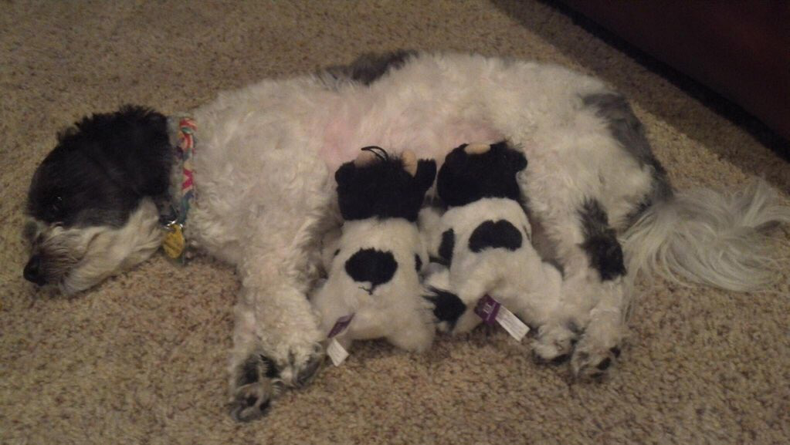

# Project: Wrangling and Analyze Data

## Data Gathering
In the cell below, gather **all** three pieces of data for this project and load them in the notebook. **Note:** the methods required to gather each data are different.
1. Directly download the WeRateDogs Twitter archive data (twitter_archive_enhanced.csv)


```python
import requests
import pandas as pd, numpy as np
import json
import time
from bs4 import BeautifulSoup as soup
from matplotlib import pyplot as plt
import seaborn as sns
from PIL import Image
from io import BytesIO
```


```python
tweet_arch = pd.read_csv('twitter-archive-enhanced.csv')
```


```python
tweet_arch.sample(5)
```


<div>
<style scoped>
    .dataframe tbody tr th:only-of-type {
        vertical-align: middle;
    }

    .dataframe tbody tr th {
        vertical-align: top;
    }

    .dataframe thead th {
        text-align: right;
    }
</style>
<table border="1" class="dataframe">
  <thead>
    <tr style="text-align: right;">
      <th></th>
      <th>tweet_id</th>
      <th>in_reply_to_status_id</th>
      <th>in_reply_to_user_id</th>
      <th>timestamp</th>
      <th>source</th>
      <th>text</th>
      <th>retweeted_status_id</th>
      <th>retweeted_status_user_id</th>
      <th>retweeted_status_timestamp</th>
      <th>expanded_urls</th>
      <th>rating_numerator</th>
      <th>rating_denominator</th>
      <th>name</th>
      <th>doggo</th>
      <th>floofer</th>
      <th>pupper</th>
      <th>puppo</th>
    </tr>
  </thead>
  <tbody>
    <tr>
      <th>1511</th>
      <td>691416866452082688</td>
      <td>NaN</td>
      <td>NaN</td>
      <td>2016-01-25 00:26:41 +0000</td>
      <td>&lt;a href="http://twitter.com/download/iphone" r...</td>
      <td>I present to you... Dog Jesus. 13/10 (he could...</td>
      <td>NaN</td>
      <td>NaN</td>
      <td>NaN</td>
      <td>https://twitter.com/dog_rates/status/691416866...</td>
      <td>13</td>
      <td>10</td>
      <td>None</td>
      <td>None</td>
      <td>None</td>
      <td>None</td>
      <td>None</td>
    </tr>
    <tr>
      <th>2020</th>
      <td>672095186491711488</td>
      <td>NaN</td>
      <td>NaN</td>
      <td>2015-12-02 16:49:14 +0000</td>
      <td>&lt;a href="http://twitter.com/download/iphone" r...</td>
      <td>This is Tuco. That's the toast that killed his...</td>
      <td>NaN</td>
      <td>NaN</td>
      <td>NaN</td>
      <td>https://twitter.com/dog_rates/status/672095186...</td>
      <td>9</td>
      <td>10</td>
      <td>Tuco</td>
      <td>None</td>
      <td>None</td>
      <td>None</td>
      <td>None</td>
    </tr>
    <tr>
      <th>536</th>
      <td>807010152071229440</td>
      <td>NaN</td>
      <td>NaN</td>
      <td>2016-12-08 23:53:08 +0000</td>
      <td>&lt;a href="http://twitter.com/download/iphone" r...</td>
      <td>This is Lennon. He's a Boopershnoop Pupperdoop...</td>
      <td>NaN</td>
      <td>NaN</td>
      <td>NaN</td>
      <td>https://twitter.com/dog_rates/status/807010152...</td>
      <td>12</td>
      <td>10</td>
      <td>Lennon</td>
      <td>None</td>
      <td>None</td>
      <td>None</td>
      <td>None</td>
    </tr>
    <tr>
      <th>2257</th>
      <td>667728196545200128</td>
      <td>NaN</td>
      <td>NaN</td>
      <td>2015-11-20 15:36:22 +0000</td>
      <td>&lt;a href="http://twitter.com" rel="nofollow"&gt;Tw...</td>
      <td>Meet Olive. He comes to spot by tree to remini...</td>
      <td>NaN</td>
      <td>NaN</td>
      <td>NaN</td>
      <td>https://twitter.com/dog_rates/status/667728196...</td>
      <td>11</td>
      <td>10</td>
      <td>Olive</td>
      <td>None</td>
      <td>None</td>
      <td>None</td>
      <td>None</td>
    </tr>
    <tr>
      <th>1825</th>
      <td>676470639084101634</td>
      <td>NaN</td>
      <td>NaN</td>
      <td>2015-12-14 18:35:43 +0000</td>
      <td>&lt;a href="http://twitter.com/download/iphone" r...</td>
      <td>Three generations of pupper. 11/10 for all htt...</td>
      <td>NaN</td>
      <td>NaN</td>
      <td>NaN</td>
      <td>https://twitter.com/dog_rates/status/676470639...</td>
      <td>11</td>
      <td>10</td>
      <td>None</td>
      <td>None</td>
      <td>None</td>
      <td>pupper</td>
      <td>None</td>
    </tr>
  </tbody>
</table>
</div>


2. Use the Requests library to download the tweet image prediction (image_predictions.tsv)


```python
# create a request and get url
url = 'https://d17h27t6h515a5.cloudfront.net/topher/2017/August/599fd2ad_image-predictions/image-predictions.tsv'
image_predictions = requests.get(url)

```


```python
# create a txt file and write request contents into file names 'image-predictions.tsv'
with open(url.split('/')[-1].replace('-','_'),mode='wb') as file:
    file.write(image_predictions.content)
```


```python
# Read the tsv file into img_pred
img_pred = pd.read_csv('image_predictions.tsv',sep='\t')
```


```python
# save file in. csv format
img_pred.to_csv('image_predictions.csv',index=True)
```


```python
img_pred.sample(5)
```


<div>
<style scoped>
    .dataframe tbody tr th:only-of-type {
        vertical-align: middle;
    }

    .dataframe tbody tr th {
        vertical-align: top;
    }

    .dataframe thead th {
        text-align: right;
    }
</style>
<table border="1" class="dataframe">
  <thead>
    <tr style="text-align: right;">
      <th></th>
      <th>tweet_id</th>
      <th>jpg_url</th>
      <th>img_num</th>
      <th>p1</th>
      <th>p1_conf</th>
      <th>p1_dog</th>
      <th>p2</th>
      <th>p2_conf</th>
      <th>p2_dog</th>
      <th>p3</th>
      <th>p3_conf</th>
      <th>p3_dog</th>
    </tr>
  </thead>
  <tbody>
    <tr>
      <th>2034</th>
      <td>883838122936631299</td>
      <td>https://pbs.twimg.com/media/DEQGFgAXUAAEvfi.jpg</td>
      <td>1</td>
      <td>Doberman</td>
      <td>0.610946</td>
      <td>True</td>
      <td>miniature_pinscher</td>
      <td>0.299603</td>
      <td>True</td>
      <td>kelpie</td>
      <td>0.063020</td>
      <td>True</td>
    </tr>
    <tr>
      <th>160</th>
      <td>668902994700836864</td>
      <td>https://pbs.twimg.com/media/CUhruUgUAAAa8FQ.jpg</td>
      <td>1</td>
      <td>Brittany_spaniel</td>
      <td>0.828425</td>
      <td>True</td>
      <td>Ibizan_hound</td>
      <td>0.043082</td>
      <td>True</td>
      <td>Blenheim_spaniel</td>
      <td>0.028004</td>
      <td>True</td>
    </tr>
    <tr>
      <th>1281</th>
      <td>750147208377409536</td>
      <td>https://pbs.twimg.com/media/CmkO57iXgAEOxX9.jpg</td>
      <td>1</td>
      <td>pug</td>
      <td>0.977765</td>
      <td>True</td>
      <td>Boston_bull</td>
      <td>0.004794</td>
      <td>True</td>
      <td>French_bulldog</td>
      <td>0.004573</td>
      <td>True</td>
    </tr>
    <tr>
      <th>132</th>
      <td>668466899341221888</td>
      <td>https://pbs.twimg.com/media/CUbfGbbWoAApZth.jpg</td>
      <td>1</td>
      <td>shopping_basket</td>
      <td>0.398361</td>
      <td>False</td>
      <td>hamper</td>
      <td>0.363222</td>
      <td>False</td>
      <td>bassinet</td>
      <td>0.084173</td>
      <td>False</td>
    </tr>
    <tr>
      <th>874</th>
      <td>698178924120031232</td>
      <td>https://pbs.twimg.com/media/CbBuBhbWwAEGH29.jpg</td>
      <td>1</td>
      <td>Chesapeake_Bay_retriever</td>
      <td>0.351868</td>
      <td>True</td>
      <td>malinois</td>
      <td>0.207753</td>
      <td>True</td>
      <td>Labrador_retriever</td>
      <td>0.154606</td>
      <td>True</td>
    </tr>
  </tbody>
</table>
</div>


3. Use the Tweepy library to query additional data via the Twitter API (tweet_json.txt)


```python
'''
import twitter data API tweepy
create a twitter developer app to access auth keys and tokens
creata api window with keys and token to read twitter archive
'''

import tweepy

consumer_key = ''
consumer_secret = ''
access_token = ''
access_secret = ''

auth = tweepy.OAuthHandler(consumer_key, consumer_secret)
auth.set_access_token(access_token, access_secret)

api = tweepy.API(auth, wait_on_rate_limit=True, wait_on_rate_limit_notify=True)

```


```python
'''
gather each tweet's ID, tweet count and favorite like count
tweet ID, retweet count, favorite count in json format
write gathered json data file name 'tweet_jsons.txt'
''' 

with open('tweet_jsons.txt','w') as file:
    for tweet_id in df_tweet1.tweet_id:
        start = time.time()
        try:
            tweet = api.get_status(tweet_id,tweet_mode='extended')
            json.dump(tweet._json,file)
            file.write('\n')
            
        except Exception as e:
            print(e)
        print('tweet_id: {} \t Run time: {}'.format(tweet_id,time.time()-start))

```


```python
'''
open 'tweet_jsons.txt' file in read mode 
read select data: tweet_id, retweet_count, favourite_count to DataFrame
'''

df_list = []
with open('tweet_jsons.txt','r') as file:
    for lines in file.readlines():
        line = json.loads(lines)
        tweet_id = line["id"]
        retweet_count = line["retweet_count"]
        favorite_count = line["favorite_count"]

        df_list.append({
            'tweet_id': tweet_id,
            'retweet_count': retweet_count,
            'favorite_count': favorite_count
        })
df = pd.DataFrame(df_list,columns=['tweet_id','retweet_count','favorite_count'])
```


```python
df.sample(5)
```


<div>
<style scoped>
    .dataframe tbody tr th:only-of-type {
        vertical-align: middle;
    }

    .dataframe tbody tr th {
        vertical-align: top;
    }

    .dataframe thead th {
        text-align: right;
    }
</style>
<table border="1" class="dataframe">
  <thead>
    <tr style="text-align: right;">
      <th></th>
      <th>tweet_id</th>
      <th>retweet_count</th>
      <th>favorite_count</th>
    </tr>
  </thead>
  <tbody>
    <tr>
      <th>2197</th>
      <td>668256321989451776</td>
      <td>509</td>
      <td>1129</td>
    </tr>
    <tr>
      <th>353</th>
      <td>828381636999917570</td>
      <td>2024</td>
      <td>11530</td>
    </tr>
    <tr>
      <th>104</th>
      <td>871166179821445120</td>
      <td>4805</td>
      <td>0</td>
    </tr>
    <tr>
      <th>517</th>
      <td>806620845233815552</td>
      <td>5047</td>
      <td>0</td>
    </tr>
    <tr>
      <th>895</th>
      <td>755206590534418437</td>
      <td>4832</td>
      <td>14950</td>
    </tr>
  </tbody>
</table>
</div>


```python
# Save DataFrame to file called additional_data.csv
df.to_csv('additional_data.csv',index=False)
```


```python
# read additional_data.csv to add_data variable
add_data = pd.read_csv('additional_data.csv')
```


```python
add_data.head()

```


<div>
<style scoped>
    .dataframe tbody tr th:only-of-type {
        vertical-align: middle;
    }

    .dataframe tbody tr th {
        vertical-align: top;
    }

    .dataframe thead th {
        text-align: right;
    }
</style>
<table border="1" class="dataframe">
  <thead>
    <tr style="text-align: right;">
      <th></th>
      <th>tweet_id</th>
      <th>retweet_count</th>
      <th>favorite_count</th>
    </tr>
  </thead>
  <tbody>
    <tr>
      <th>0</th>
      <td>892420643555336193</td>
      <td>6881</td>
      <td>32920</td>
    </tr>
    <tr>
      <th>1</th>
      <td>892177421306343426</td>
      <td>5181</td>
      <td>28455</td>
    </tr>
    <tr>
      <th>2</th>
      <td>891815181378084864</td>
      <td>3423</td>
      <td>21379</td>
    </tr>
    <tr>
      <th>3</th>
      <td>891689557279858688</td>
      <td>7089</td>
      <td>35889</td>
    </tr>
    <tr>
      <th>4</th>
      <td>891327558926688256</td>
      <td>7605</td>
      <td>34325</td>
    </tr>
  </tbody>
</table>
</div>


## Assessing Data
In this section, detect and document at least **eight (8) quality issues and two (2) tidiness issue**. You must use **both** visual assessment
programmatic assessement to assess the data.

**Note:** pay attention to the following key points when you access the data.

* You only want original ratings (no retweets) that have images. Though there are 5000+ tweets in the dataset, not all are dog ratings and some are retweets.
* Assessing and cleaning the entire dataset completely would require a lot of time, and is not necessary to practice and demonstrate your skills in data wrangling. Therefore, the requirements of this project are only to assess and clean at least 8 quality issues and at least 2 tidiness issues in this dataset.
* The fact that the rating numerators are greater than the denominators does not need to be cleaned. This [unique rating system](http://knowyourmeme.com/memes/theyre-good-dogs-brent) is a big part of the popularity of WeRateDogs.
* You do not need to gather the tweets beyond August 1st, 2017. You can, but note that you won't be able to gather the image predictions for these tweets since you don't have access to the algorithm used.


### Visual assessment is conducted in Ms excel 

#### Programmatic assessment
> _Assessing all the data gathered_

##### 1. twitter archive  


```python
tweet_arch.sample(10,random_state=13)
```


<div>
<style scoped>
    .dataframe tbody tr th:only-of-type {
        vertical-align: middle;
    }

    .dataframe tbody tr th {
        vertical-align: top;
    }

    .dataframe thead th {
        text-align: right;
    }
</style>
<table border="1" class="dataframe">
  <thead>
    <tr style="text-align: right;">
      <th></th>
      <th>tweet_id</th>
      <th>in_reply_to_status_id</th>
      <th>in_reply_to_user_id</th>
      <th>timestamp</th>
      <th>source</th>
      <th>text</th>
      <th>retweeted_status_id</th>
      <th>retweeted_status_user_id</th>
      <th>retweeted_status_timestamp</th>
      <th>expanded_urls</th>
      <th>rating_numerator</th>
      <th>rating_denominator</th>
      <th>name</th>
      <th>doggo</th>
      <th>floofer</th>
      <th>pupper</th>
      <th>puppo</th>
    </tr>
  </thead>
  <tbody>
    <tr>
      <th>726</th>
      <td>782598640137187329</td>
      <td>NaN</td>
      <td>NaN</td>
      <td>2016-10-02 15:10:30 +0000</td>
      <td>&lt;a href="http://twitter.com/download/iphone" r...</td>
      <td>This is Timmy. He's quite large. According to ...</td>
      <td>NaN</td>
      <td>NaN</td>
      <td>NaN</td>
      <td>https://twitter.com/dog_rates/status/782598640...</td>
      <td>11</td>
      <td>10</td>
      <td>Timmy</td>
      <td>None</td>
      <td>None</td>
      <td>None</td>
      <td>None</td>
    </tr>
    <tr>
      <th>2035</th>
      <td>671735591348891648</td>
      <td>NaN</td>
      <td>NaN</td>
      <td>2015-12-01 17:00:19 +0000</td>
      <td>&lt;a href="http://twitter.com/download/iphone" r...</td>
      <td>This is Oscar. He's ready for Christmas. 11/10...</td>
      <td>NaN</td>
      <td>NaN</td>
      <td>NaN</td>
      <td>https://twitter.com/dog_rates/status/671735591...</td>
      <td>11</td>
      <td>10</td>
      <td>Oscar</td>
      <td>None</td>
      <td>None</td>
      <td>None</td>
      <td>None</td>
    </tr>
    <tr>
      <th>733</th>
      <td>781308096455073793</td>
      <td>NaN</td>
      <td>NaN</td>
      <td>2016-09-29 01:42:20 +0000</td>
      <td>&lt;a href="http://vine.co" rel="nofollow"&gt;Vine -...</td>
      <td>Pupper butt 1, Doggo 0. Both 12/10 https://t.c...</td>
      <td>NaN</td>
      <td>NaN</td>
      <td>NaN</td>
      <td>https://vine.co/v/5rgu2Law2ut</td>
      <td>12</td>
      <td>10</td>
      <td>None</td>
      <td>doggo</td>
      <td>None</td>
      <td>pupper</td>
      <td>None</td>
    </tr>
    <tr>
      <th>1589</th>
      <td>686683045143953408</td>
      <td>NaN</td>
      <td>NaN</td>
      <td>2016-01-11 22:56:10 +0000</td>
      <td>&lt;a href="http://twitter.com/download/iphone" r...</td>
      <td>This is Mona. She's a Yarborough Splishnsplash...</td>
      <td>NaN</td>
      <td>NaN</td>
      <td>NaN</td>
      <td>https://twitter.com/dog_rates/status/686683045...</td>
      <td>11</td>
      <td>10</td>
      <td>Mona</td>
      <td>None</td>
      <td>None</td>
      <td>pupper</td>
      <td>None</td>
    </tr>
    <tr>
      <th>709</th>
      <td>785170936622350336</td>
      <td>NaN</td>
      <td>NaN</td>
      <td>2016-10-09 17:31:53 +0000</td>
      <td>&lt;a href="http://twitter.com/download/iphone" r...</td>
      <td>This is Hero. He was enjoying the car ride unt...</td>
      <td>NaN</td>
      <td>NaN</td>
      <td>NaN</td>
      <td>https://twitter.com/dog_rates/status/785170936...</td>
      <td>11</td>
      <td>10</td>
      <td>Hero</td>
      <td>None</td>
      <td>None</td>
      <td>None</td>
      <td>None</td>
    </tr>
    <tr>
      <th>217</th>
      <td>850380195714523136</td>
      <td>NaN</td>
      <td>NaN</td>
      <td>2017-04-07 16:10:12 +0000</td>
      <td>&lt;a href="http://twitter.com/download/iphone" r...</td>
      <td>This is Leo. He's a personal triathlon coach. ...</td>
      <td>NaN</td>
      <td>NaN</td>
      <td>NaN</td>
      <td>https://twitter.com/dog_rates/status/850380195...</td>
      <td>13</td>
      <td>10</td>
      <td>Leo</td>
      <td>None</td>
      <td>None</td>
      <td>None</td>
      <td>None</td>
    </tr>
    <tr>
      <th>978</th>
      <td>749996283729883136</td>
      <td>NaN</td>
      <td>NaN</td>
      <td>2016-07-04 16:00:22 +0000</td>
      <td>&lt;a href="https://about.twitter.com/products/tw...</td>
      <td>This is Bo. He emanates happiness. 12/10 I cou...</td>
      <td>NaN</td>
      <td>NaN</td>
      <td>NaN</td>
      <td>https://twitter.com/dog_rates/status/749996283...</td>
      <td>12</td>
      <td>10</td>
      <td>Bo</td>
      <td>None</td>
      <td>None</td>
      <td>None</td>
      <td>None</td>
    </tr>
    <tr>
      <th>1570</th>
      <td>687732144991551489</td>
      <td>NaN</td>
      <td>NaN</td>
      <td>2016-01-14 20:24:55 +0000</td>
      <td>&lt;a href="http://vine.co" rel="nofollow"&gt;Vine -...</td>
      <td>This is Ember. That's the q-tip she owes money...</td>
      <td>NaN</td>
      <td>NaN</td>
      <td>NaN</td>
      <td>https://vine.co/v/iOuMphL5DBY</td>
      <td>11</td>
      <td>10</td>
      <td>Ember</td>
      <td>None</td>
      <td>None</td>
      <td>None</td>
      <td>None</td>
    </tr>
    <tr>
      <th>290</th>
      <td>838150277551247360</td>
      <td>8.381455e+17</td>
      <td>21955058.0</td>
      <td>2017-03-04 22:12:52 +0000</td>
      <td>&lt;a href="http://twitter.com/download/iphone" r...</td>
      <td>@markhoppus 182/10</td>
      <td>NaN</td>
      <td>NaN</td>
      <td>NaN</td>
      <td>NaN</td>
      <td>182</td>
      <td>10</td>
      <td>None</td>
      <td>None</td>
      <td>None</td>
      <td>None</td>
      <td>None</td>
    </tr>
    <tr>
      <th>2134</th>
      <td>670069087419133954</td>
      <td>NaN</td>
      <td>NaN</td>
      <td>2015-11-27 02:38:14 +0000</td>
      <td>&lt;a href="http://twitter.com/download/iphone" r...</td>
      <td>This is Randall. He's from Chernobyl. Built pl...</td>
      <td>NaN</td>
      <td>NaN</td>
      <td>NaN</td>
      <td>https://twitter.com/dog_rates/status/670069087...</td>
      <td>5</td>
      <td>10</td>
      <td>Randall</td>
      <td>None</td>
      <td>None</td>
      <td>None</td>
      <td>None</td>
    </tr>
  </tbody>
</table>
</div>


```python
# Glance over features and datatypes and missing values
tweet_arch.info()
```

    <class 'pandas.core.frame.DataFrame'>
    RangeIndex: 2356 entries, 0 to 2355
    Data columns (total 17 columns):
    tweet_id                      2356 non-null int64
    in_reply_to_status_id         78 non-null float64
    in_reply_to_user_id           78 non-null float64
    timestamp                     2356 non-null object
    source                        2356 non-null object
    text                          2356 non-null object
    retweeted_status_id           181 non-null float64
    retweeted_status_user_id      181 non-null float64
    retweeted_status_timestamp    181 non-null object
    expanded_urls                 2297 non-null object
    rating_numerator              2356 non-null int64
    rating_denominator            2356 non-null int64
    name                          2356 non-null object
    doggo                         2356 non-null object
    floofer                       2356 non-null object
    pupper                        2356 non-null object
    puppo                         2356 non-null object
    dtypes: float64(4), int64(3), object(10)
    memory usage: 313.0+ KB


```python
# view descriptive statistics
tweet_arch.describe()
```


<div>
<style scoped>
    .dataframe tbody tr th:only-of-type {
        vertical-align: middle;
    }

    .dataframe tbody tr th {
        vertical-align: top;
    }

    .dataframe thead th {
        text-align: right;
    }
</style>
<table border="1" class="dataframe">
  <thead>
    <tr style="text-align: right;">
      <th></th>
      <th>tweet_id</th>
      <th>in_reply_to_status_id</th>
      <th>in_reply_to_user_id</th>
      <th>retweeted_status_id</th>
      <th>retweeted_status_user_id</th>
      <th>rating_numerator</th>
      <th>rating_denominator</th>
    </tr>
  </thead>
  <tbody>
    <tr>
      <th>count</th>
      <td>2.356000e+03</td>
      <td>7.800000e+01</td>
      <td>7.800000e+01</td>
      <td>1.810000e+02</td>
      <td>1.810000e+02</td>
      <td>2356.000000</td>
      <td>2356.000000</td>
    </tr>
    <tr>
      <th>mean</th>
      <td>7.427716e+17</td>
      <td>7.455079e+17</td>
      <td>2.014171e+16</td>
      <td>7.720400e+17</td>
      <td>1.241698e+16</td>
      <td>13.126486</td>
      <td>10.455433</td>
    </tr>
    <tr>
      <th>std</th>
      <td>6.856705e+16</td>
      <td>7.582492e+16</td>
      <td>1.252797e+17</td>
      <td>6.236928e+16</td>
      <td>9.599254e+16</td>
      <td>45.876648</td>
      <td>6.745237</td>
    </tr>
    <tr>
      <th>min</th>
      <td>6.660209e+17</td>
      <td>6.658147e+17</td>
      <td>1.185634e+07</td>
      <td>6.661041e+17</td>
      <td>7.832140e+05</td>
      <td>0.000000</td>
      <td>0.000000</td>
    </tr>
    <tr>
      <th>25%</th>
      <td>6.783989e+17</td>
      <td>6.757419e+17</td>
      <td>3.086374e+08</td>
      <td>7.186315e+17</td>
      <td>4.196984e+09</td>
      <td>10.000000</td>
      <td>10.000000</td>
    </tr>
    <tr>
      <th>50%</th>
      <td>7.196279e+17</td>
      <td>7.038708e+17</td>
      <td>4.196984e+09</td>
      <td>7.804657e+17</td>
      <td>4.196984e+09</td>
      <td>11.000000</td>
      <td>10.000000</td>
    </tr>
    <tr>
      <th>75%</th>
      <td>7.993373e+17</td>
      <td>8.257804e+17</td>
      <td>4.196984e+09</td>
      <td>8.203146e+17</td>
      <td>4.196984e+09</td>
      <td>12.000000</td>
      <td>10.000000</td>
    </tr>
    <tr>
      <th>max</th>
      <td>8.924206e+17</td>
      <td>8.862664e+17</td>
      <td>8.405479e+17</td>
      <td>8.874740e+17</td>
      <td>7.874618e+17</td>
      <td>1776.000000</td>
      <td>170.000000</td>
    </tr>
  </tbody>
</table>
</div>


```python
# view duplicated entries
tweet_arch.duplicated().sum()
```


    0


```python
# view missing values
tweet_arch.isnull().sum()
```


    tweet_id                         0
    in_reply_to_status_id         2278
    in_reply_to_user_id           2278
    timestamp                        0
    source                           0
    text                             0
    retweeted_status_id           2175
    retweeted_status_user_id      2175
    retweeted_status_timestamp    2175
    expanded_urls                   59
    rating_numerator                 0
    rating_denominator               0
    name                             0
    doggo                            0
    floofer                          0
    pupper                           0
    puppo                            0
    dtype: int64


#### 2. Image prediction


```python
# view 5 random samples
img_pred.sample(5,random_state=13)
```


<div>
<style scoped>
    .dataframe tbody tr th:only-of-type {
        vertical-align: middle;
    }

    .dataframe tbody tr th {
        vertical-align: top;
    }

    .dataframe thead th {
        text-align: right;
    }
</style>
<table border="1" class="dataframe">
  <thead>
    <tr style="text-align: right;">
      <th></th>
      <th>tweet_id</th>
      <th>jpg_url</th>
      <th>img_num</th>
      <th>p1</th>
      <th>p1_conf</th>
      <th>p1_dog</th>
      <th>p2</th>
      <th>p2_conf</th>
      <th>p2_dog</th>
      <th>p3</th>
      <th>p3_conf</th>
      <th>p3_dog</th>
    </tr>
  </thead>
  <tbody>
    <tr>
      <th>1085</th>
      <td>718613305783398402</td>
      <td>https://pbs.twimg.com/media/CfkG_PMWsAAH0MZ.jpg</td>
      <td>1</td>
      <td>Labrador_retriever</td>
      <td>0.584580</td>
      <td>True</td>
      <td>German_short-haired_pointer</td>
      <td>0.340657</td>
      <td>True</td>
      <td>Chesapeake_Bay_retriever</td>
      <td>0.031975</td>
      <td>True</td>
    </tr>
    <tr>
      <th>720</th>
      <td>685943807276412928</td>
      <td>https://pbs.twimg.com/ext_tw_video_thumb/68594...</td>
      <td>1</td>
      <td>papillon</td>
      <td>0.200812</td>
      <td>True</td>
      <td>toy_terrier</td>
      <td>0.114512</td>
      <td>True</td>
      <td>Cardigan</td>
      <td>0.094520</td>
      <td>True</td>
    </tr>
    <tr>
      <th>1973</th>
      <td>869702957897576449</td>
      <td>https://pbs.twimg.com/media/DBHOOfOXoAABKlU.jpg</td>
      <td>1</td>
      <td>Pembroke</td>
      <td>0.993449</td>
      <td>True</td>
      <td>Cardigan</td>
      <td>0.006325</td>
      <td>True</td>
      <td>Chihuahua</td>
      <td>0.000178</td>
      <td>True</td>
    </tr>
    <tr>
      <th>25</th>
      <td>666362758909284353</td>
      <td>https://pbs.twimg.com/media/CT9lXGsUcAAyUFt.jpg</td>
      <td>1</td>
      <td>guinea_pig</td>
      <td>0.996496</td>
      <td>False</td>
      <td>skunk</td>
      <td>0.002402</td>
      <td>False</td>
      <td>hamster</td>
      <td>0.000461</td>
      <td>False</td>
    </tr>
    <tr>
      <th>590</th>
      <td>679148763231985668</td>
      <td>https://pbs.twimg.com/media/CWzSMmAWsAAyB1u.jpg</td>
      <td>1</td>
      <td>Italian_greyhound</td>
      <td>0.302685</td>
      <td>True</td>
      <td>hair_slide</td>
      <td>0.124281</td>
      <td>False</td>
      <td>Afghan_hound</td>
      <td>0.059846</td>
      <td>True</td>
    </tr>
  </tbody>
</table>
</div>


```python
# Glance over features and datatypes and missing values
img_pred.info()
```

    <class 'pandas.core.frame.DataFrame'>
    RangeIndex: 2075 entries, 0 to 2074
    Data columns (total 12 columns):
    tweet_id    2075 non-null int64
    jpg_url     2075 non-null object
    img_num     2075 non-null int64
    p1          2075 non-null object
    p1_conf     2075 non-null float64
    p1_dog      2075 non-null bool
    p2          2075 non-null object
    p2_conf     2075 non-null float64
    p2_dog      2075 non-null bool
    p3          2075 non-null object
    p3_conf     2075 non-null float64
    p3_dog      2075 non-null bool
    dtypes: bool(3), float64(3), int64(2), object(4)
    memory usage: 152.1+ KB


```python
#  view descriotive statistics
img_pred.describe()
```


<div>
<style scoped>
    .dataframe tbody tr th:only-of-type {
        vertical-align: middle;
    }

    .dataframe tbody tr th {
        vertical-align: top;
    }

    .dataframe thead th {
        text-align: right;
    }
</style>
<table border="1" class="dataframe">
  <thead>
    <tr style="text-align: right;">
      <th></th>
      <th>tweet_id</th>
      <th>img_num</th>
      <th>p1_conf</th>
      <th>p2_conf</th>
      <th>p3_conf</th>
    </tr>
  </thead>
  <tbody>
    <tr>
      <th>count</th>
      <td>2.075000e+03</td>
      <td>2075.000000</td>
      <td>2075.000000</td>
      <td>2.075000e+03</td>
      <td>2.075000e+03</td>
    </tr>
    <tr>
      <th>mean</th>
      <td>7.384514e+17</td>
      <td>1.203855</td>
      <td>0.594548</td>
      <td>1.345886e-01</td>
      <td>6.032417e-02</td>
    </tr>
    <tr>
      <th>std</th>
      <td>6.785203e+16</td>
      <td>0.561875</td>
      <td>0.271174</td>
      <td>1.006657e-01</td>
      <td>5.090593e-02</td>
    </tr>
    <tr>
      <th>min</th>
      <td>6.660209e+17</td>
      <td>1.000000</td>
      <td>0.044333</td>
      <td>1.011300e-08</td>
      <td>1.740170e-10</td>
    </tr>
    <tr>
      <th>25%</th>
      <td>6.764835e+17</td>
      <td>1.000000</td>
      <td>0.364412</td>
      <td>5.388625e-02</td>
      <td>1.622240e-02</td>
    </tr>
    <tr>
      <th>50%</th>
      <td>7.119988e+17</td>
      <td>1.000000</td>
      <td>0.588230</td>
      <td>1.181810e-01</td>
      <td>4.944380e-02</td>
    </tr>
    <tr>
      <th>75%</th>
      <td>7.932034e+17</td>
      <td>1.000000</td>
      <td>0.843855</td>
      <td>1.955655e-01</td>
      <td>9.180755e-02</td>
    </tr>
    <tr>
      <th>max</th>
      <td>8.924206e+17</td>
      <td>4.000000</td>
      <td>1.000000</td>
      <td>4.880140e-01</td>
      <td>2.734190e-01</td>
    </tr>
  </tbody>
</table>
</div>


```python
img_pred.duplicated().sum()
```


    0


#### 3. Additional data 


```python
# View 5 random samples
add_data.sample(5,random_state=13)
```


<div>
<style scoped>
    .dataframe tbody tr th:only-of-type {
        vertical-align: middle;
    }

    .dataframe tbody tr th {
        vertical-align: top;
    }

    .dataframe thead th {
        text-align: right;
    }
</style>
<table border="1" class="dataframe">
  <thead>
    <tr style="text-align: right;">
      <th></th>
      <th>tweet_id</th>
      <th>retweet_count</th>
      <th>favorite_count</th>
    </tr>
  </thead>
  <tbody>
    <tr>
      <th>1485</th>
      <td>690989312272396288</td>
      <td>2562</td>
      <td>5321</td>
    </tr>
    <tr>
      <th>596</th>
      <td>796177847564038144</td>
      <td>13129</td>
      <td>0</td>
    </tr>
    <tr>
      <th>1856</th>
      <td>674788554665512960</td>
      <td>180</td>
      <td>706</td>
    </tr>
    <tr>
      <th>1782</th>
      <td>676776431406465024</td>
      <td>1776</td>
      <td>4437</td>
    </tr>
    <tr>
      <th>745</th>
      <td>777621514455814149</td>
      <td>2307</td>
      <td>8012</td>
    </tr>
  </tbody>
</table>
</div>


```python
# Glance over features and datatypes and missing values
add_data.info()
```

    <class 'pandas.core.frame.DataFrame'>
    RangeIndex: 2325 entries, 0 to 2324
    Data columns (total 3 columns):
    tweet_id          2325 non-null int64
    retweet_count     2325 non-null int64
    favorite_count    2325 non-null int64
    dtypes: int64(3)
    memory usage: 54.6 KB


```python
# view descriotive statistics
add_data.describe()
```


<div>
<style scoped>
    .dataframe tbody tr th:only-of-type {
        vertical-align: middle;
    }

    .dataframe tbody tr th {
        vertical-align: top;
    }

    .dataframe thead th {
        text-align: right;
    }
</style>
<table border="1" class="dataframe">
  <thead>
    <tr style="text-align: right;">
      <th></th>
      <th>tweet_id</th>
      <th>retweet_count</th>
      <th>favorite_count</th>
    </tr>
  </thead>
  <tbody>
    <tr>
      <th>count</th>
      <td>2.325000e+03</td>
      <td>2325.000000</td>
      <td>2325.000000</td>
    </tr>
    <tr>
      <th>mean</th>
      <td>7.416926e+17</td>
      <td>2426.540645</td>
      <td>6876.165161</td>
    </tr>
    <tr>
      <th>std</th>
      <td>6.814903e+16</td>
      <td>4107.631100</td>
      <td>10679.314960</td>
    </tr>
    <tr>
      <th>min</th>
      <td>6.660209e+17</td>
      <td>0.000000</td>
      <td>0.000000</td>
    </tr>
    <tr>
      <th>25%</th>
      <td>6.780233e+17</td>
      <td>488.000000</td>
      <td>1197.000000</td>
    </tr>
    <tr>
      <th>50%</th>
      <td>7.177900e+17</td>
      <td>1128.000000</td>
      <td>2984.000000</td>
    </tr>
    <tr>
      <th>75%</th>
      <td>7.986285e+17</td>
      <td>2807.000000</td>
      <td>8402.000000</td>
    </tr>
    <tr>
      <th>max</th>
      <td>8.924206e+17</td>
      <td>69448.000000</td>
      <td>141792.000000</td>
    </tr>
  </tbody>
</table>
</div>


```python
# view duplicates
add_data.duplicated().sum()
```


    0


```python
# view missing values
add_data.isnull().sum()
```


    tweet_id          0
    retweet_count     0
    favorite_count    0
    dtype: int64


```python
# view common columns among three dataframes
columns = pd.Series(list(tweet_arch)+list(img_pred)+list(add_data))
columns[columns.duplicated()]

```


    17    tweet_id
    29    tweet_id
    dtype: object


`Quality`: Dirty data has issues with its content. The Data Quality Dimensions are Completeness, Validity, Accuracy, and Consistency.

`Tidiness`: Untidy data is commonly referred to as “messy” data. Messy data has issues with its structure. Tidy data is where:
1. Each variable forms a column.
2. Each observation forms a row.
3. Each type of observational unit forms a table.


## Quality issues

> ##### Twitter archives

1. `text` column contains 3 variables text, ratings and Urls instead of only text

2. In_reply_to_status_id, in_reply_to_user_id table contain to many missing values and of little value

3. Some entires are retweets as shown in `retweeted_status_id` column 

4. `retweeted_status_id`, `retweeted_status_user_id`, `retweeted_status_timestamp` columns are not useful once retweet entries are droped

5. Incorrect data type of `timestamp` column in string instead of datetime

6. `expanded_urls` column contain duplicated values

7. `source` column contains extraneous 

8. tweet_id are in different format and thus cannot be used as merge criteria

9. `name` column contain inconsistent name and 'None' format

> ##### Image prediction

1. Some entries in `p1_dog`, `p2_dog`, `p3_dog` columns table are not dog ratings

2. `p1`, `p2`, `p3` columns name are not decriptive 

3. Dog names are not consistent with some having small and others large caps 

4. `p1`, `p2`, `p3` columns in image prediction table contian inconsistent format for dog name, some with capitals whilst some with small caps 

5. tweet_id are indifferent format and thus cannot be used as merge criteria

> ##### additional data

1. tweet_id are indifferent format and thus cannot be used as merge criteria

## Tidiness issues
> #### twitter achive

1.  `Doggo`,`floofer`, `pupper`, `puppo` in twitter archive table are one variable yet they are in separate columns

2. Contain observations beyoung beyond August 1st, 2017

> ##### additional data

1. additional data table should be merged of twitter archive and image prediction

## Cleaning Data
In this section, clean **all** of the issues you documented while assessing. 

**Note:** Make a copy of the original data before cleaning. Cleaning includes merging individual pieces of data according to the rules of [tidy data](https://cran.r-project.org/web/packages/tidyr/vignettes/tidy-data.html). The result should be a high-quality and tidy master pandas DataFrame (or DataFrames, if appropriate).


```python
# Make copies of original pieces of data
tweet_arch_copy = tweet_arch.copy()
img_pred_copy   = img_pred.copy()
add_data_copy   = add_data.copy()
```

### Quality issues cleanup

### twitter archives 

#### Issue #1: `text` column in twitter archive table contains  3 variables: text, ratings and Urls

#### Define: separate and remove ratings and urls from text as they are already present in adjacent columns

#### Code


```python
tweet_arch_copy.text = pd.Series(tweet_arch_copy.text.\
          apply(lambda x:x.split('/10')[0][:-3]))
```

#### Test


```python
tweet_arch_copy.text.tolist()
```


    ["This is Phineas. He's a mystical boy. Only ever appears in the hole of a donut.",
     "This is Tilly. She's just checking pup on you. Hopes you're doing ok. If not, she's available for pats, snugs, boops, the whole bit.",
     'This is Archie. He is a rare Norwegian Pouncing Corgo. Lives in the tall grass. You never know when one may strike.',
     'This is Darla. She commenced a snooze mid meal.',
     'This is Franklin. He would like you to stop calling him "cute." He is a very fierce shark and should be respected as such.',
     "Here we have a majestic great white breaching off South Africa's coast. Absolutely h*ckin breathtaking.",
     'Meet Jax. He enjoys ice cream so much he gets nervous around it.',
     "When you watch your owner call another dog a good boy but then they turn back to you and say you're a great boy.",
     "This is Zoey. She doesn't want to be one of the scary sharks. Just wants to be a snuggly pettable boatpet.",
     'This is Cassie. She is a college pup. Studying international doggo communication and stick theory.',
     'This is Koda. He is a South Australian deckshark. Deceptively deadly. Frighteningly majestic.',
     'This is Bruno. He is a service shark. Only gets out of the water to assist you.',
     "Here's a puppo that seems to be on the fence about something haha no but seriously someone help her.",
     "This is Ted. He does his best. Sometimes that's not enough. But it's ok.",
     "This is Stuart. He's sporting his favorite fanny pack. Secretly filled with bones only.",
     "This is Oliver. You're witnessing one of his many brutal attacks. Seems to be playing with his victim.",
     'This is Jim. He found a fren. Taught him how to sit like the good boys.',
     'This is Zeke. He has a new stick. Very proud of it. Would like you to throw it for him without taking it.',
     "This is Ralphus. He's powering up. Attempting maximum borkdrive.",
     'RT @dog_rates: This is Canela. She attempted some fancy porch pics. They were unsuccessful.',
     "This is Gerald. He was just told he didn't get the job he interviewed for. A h*ckin injustice.",
     "This is Jeffrey. He has a monopoly on the pool noodles. Currently running a 'boop for two' midweek sale.",
     "I've yet to rate a Venezuelan Hover Wiener. This is such an honor.",
     'This is Canela. She attempted some fancy porch pics. They were unsuccessful.',
     'You may not have known you needed to see this today.',
     'This... is a Jubilant Antarctic House Bear. We only rate dogs. Please only send dogs. Thank you...',
     "This is Maya. She's very shy. Rarely leaves her cup.",
     "This is Mingus. He's a wonderful father to his smol pup. Confirmed",
     "This is Derek. He's late for a dog meeting.",
     'This is Roscoe. Another pupper fallen victim to spontaneous tongue ejections. Get the BlepiPen immediate.',
     '@NonWhiteHat @MayhewMayhem omg hello tanner you are a scary good boy',
     'This is Waffles. His doggles are pupside down. Unsure how to fix.',
     'RT @Athletics:',
     'Viewer discretion advised. This is Jimbo. He will rip ur finger right h*ckin off. Other dog clearly an accessory.',
     'This is Maisey. She fell asleep mid-excavation. Happens to the best of us.',
     'I have a new hero and his name is Howard.',
     'RT @dog_rates: This is Lilly. She just parallel barked. Kindly requests a reward now.',
     'Here we have a corgi undercover as a malamute. Pawbably doing important investigative work. Zero control over tongue happenings.',
     'This is Earl. He found a hat. Nervous about what you think of it.',
     "This is Lola. It's her first time outside. Must test the earth and taste the atmosphere.",
     "This is Kevin. He's just so happy.",
     'I present to you, Pup in Hat. Pup in Hat is great for all occasions. Extremely versatile. Compact as h*ck.',
     "OMG HE DIDN'T MEAN TO HE WAS JUST TRYING A LITTLE BARKOUR HE'S SUPER SORRY",
     "Meet Yogi. He doesn't have any important dog meetings today he just enjoys looking his best at all times.",
     "This is Noah. He can't believe someone made this mess. Got the vacuum out for you though. Offered to help clean pup.",
     'This is Bella. She hopes her smile made you smile. If not, she is also offering you her favorite monkey. 1',
     'Meet Grizzwald. He may be the floofiest floofer I ever did see. Lost eyes saving a schoolbus from a volcano erpuption.',
     "Please only send dogs. We don't rate mechanics, no matter how h*ckin good. Thank you...",
     "This is Rusty. He wasn't ready for the first pic. Clearly puppared for the second.",
     "This is Gus. He's quite the cheeky pupper. Already perfected the disinterested wink.",
     'This is Stanley. He has his first swim lesson today. Doggle straps adjusted. Ready to go.',
     "This is Alfy. You're witnessing his first watermelon experience. I think it was a success.",
     'This is Koko. Her owner, inspired by Barney, recently built a cart for her to use during walks if she got tired.',
     "This is Rey. He's a Benebop Cumberfloof.",
     "This is Gary. He couldn't miss this puppertunity for a selfie. Flawless focusing skills.",
     '@roushfenway These are good dogs but',
     'Here is a pupper approaching maximum borkdrive. Zooming at never before seen speeds.',
     "Meet Elliot. He's a Canadian Forrest Pup. Unusual number of antlers for a dog. Sneaky tongue slip to celebrate #Canada150.",
     "This is Louis. He's crossing. It's a big deal.",
     "Ugh not again. We only rate dogs. Please don't send in well-dressed  floppy-tongued street penguins. Dogs only please. Thank you...",
     'This is Bella. She had her first beach experience this morning. Complete success.',
     "Meet Jesse. He's a Fetty Woof. His tongue ejects without warning. A true bleptomaniac.",
     "Please don't send in photos without dogs in them. We're not @porch_rates. Insubordinate and churlish. Pretty good porch tho",
     'This is Romeo. He would like to do an entrance. Requesting your immediate assistance.',
     '@RealKentMurphy',
     'This is Bailey. He thinks you should measure ear length for signs of growth instead.',
     'This is Duddles. He did an attempt.',
     "This is Jack AKA Stephen Furry. You're not scoring on him. Unless he slips down the slide.",
     'RT @dog_rates: This is Emmy. She was adopted today. Massive round of pupplause for Emmy and her new family.',
     'This is Steven. He has trouble relating to other dogs. Quite shy. Neck longer than average. Tropical probably.',
     "This is Beau. That is Beau's balloon. He takes it everywhere.",
     "This is Snoopy. He's a proud #PrideMonthPuppo. Impeccable handwriting for not having thumbs.",
     'Martha is stunning how h*ckin dare you.',
     'RT @dog_rates: Meet Shadow. In an attempt to reach maximum zooming borkdrive, he tore his ACL. Still',
     "RT @dog_rates: Meet Terrance. He's being yelled at because he stapled the wrong stuff together.",
     'Meet Shadow. In an attempt to reach maximum zooming borkdrive, he tore his ACL. Still',
     'This is Emmy. She was adopted today. Massive round of pupplause for Emmy and her new family.',
     "This is Aja. She was just told she's a good dog. Suspicions confirmed.",
     'RT @rachel2195: @dog_rates the boyfriend and his soaking wet pupper h*cking love his new hat',
     "This is Penny. She's both pupset and fired pup. Not pleased w your barbaric attempts at cleanliness.",
     "Meet Dante. At first he wasn't a fan of his new raincoat, then he saw his reflection. H*ckin handsome.",
     "This is Nelly. He graduated with his dogtorate today. Wants to know if you're proud of him.",
     "This is Ginger. She's having a ruff Monday. Too many pupper things going on. H*ckin exhausting.",
     'I can say with the pupmost confidence that the doggos who assisted with this search are heroic as h*ck.',
     'This is Benedict. He wants to thank you for this delightful urban walk. Hopes you know he loves you.',
     'Meet Venti, a seemingly caffeinated puppoccino. She was just informed the weekend would include walks, pats and scritches.',
     "This is Goose. He's a womanizer. Cheeky as h*ck, but also deep. Tongue slip game on another level.",
     "Meet Nugget and Hank. Nugget took Hank's bone. Hank is wondering if you would please return it to him. Both",
     "You'll get your package when that precious man is done appreciating the pups.",
     'Guys please stop sending pictures without any dogs in th- oh never mind hello excuse me sir.',
     'Meet Cash. He hath acquired a stick. A very good stick tbh.',
     "RT @dog_rates: This is Coco. At first I thought she was a cloud but clouds don't bork with such passion.",
     'This is Jed. He may be the fanciest pupper in the game right now. Knows it too.',
     "I can't believe this keeps happening. This, is a birb taking a bath. We only rate dogs. Please only send dogs. Thank you...",
     "This is Sebastian. He can't see all the colors of the rainbow, but he can see that this flag makes his human happy.",
     "RT @dog_rates: This is Walter. He won't start hydrotherapy without his favorite floatie.",
     "We usually don't rate Deck-bound Saskatoon Black Bears, but this one is h*ckin flawless. Sneaky tongue slip too.",
     "RT @dog_rates: This is Sierra. She's one precious pupper. Absolute",
     "This is Sierra. She's one precious pupper. Absolute",
     "Here's a very large dog. He has a date later. Politely asked this water person to check if his breath is bad.",
     'Here are my favorite #dogsatpollingstations \nMost voted for a more consistent walking schedule and to increase daily pats tenfold. All',
     'RT @loganamnosis: Penelope here is doing me quite a divertir. Well done, @dog_rates! Loving the pupdate.',
     "This is Monkey. She's supporting owners everywhere with her fancy #PrideMonth bandana.",
     'We. Only. Rate. Dogs. Do not send in other things like this fluffy floor shark clearly ready to attack. Get it together guys...',
     'This is Harry. His ears are activated one at a time. Incredibly rare to witness in person. Very special moment here.',
     "This is Kody. He's a baller. Wishes he was a little bit taller. Double dribbles often. Still",
     "Say hello to Lassie. She's celebrating #PrideMonth by being a splendid mix of astute and adorable. Proudly supupporting her owner.",
     'This is Rover. As part of pupper protocol he had to at least attempt to eat the plant. Confirmed not tasty. Needs peanut butter.',
     "This is Napolean. He's a Raggedy East Nicaraguan Zoom Zoom. Runs on one leg. Built for deception. No eyes. Good with kids.",
     "RT @dog_rates: This is Dawn. She's just checking pup on you. Making sure you're doing okay.",
     'Never doubt a doggo',
     "This is Boomer. He's doing an advanced water takeoff. The opposite of Sully. Ears for control, mlem for style.",
     "Real funny guys. Sending in a pic without a dog in it. Hilarious. We'll rate the rug tho because it's giving off a very good vibe.",
     '@ComplicitOwl @ShopWeRateDogs &gt',
     'This is Cody. He zoomed too aggressively and tore his ACL. Happens to the best of us. Still',
     'This is Zoey. She really likes the planet. Would hate to see willful ignorance and the denial of fairly elemental science destroy it.',
     "This is Rumble, but he's not ready to. Would rather fall asleep in his bath bucket.",
     "Meet Clifford. He's quite large. Also red. Good w kids. Somehow never steps on them. Massive poops very inconvenient. Still",
     "RT @dog_rates: We only rate dogs. This is quite clearly a smol broken polar bear. We'd appreciate if you only send dogs. Thank you...",
     'This is Dewey (pronounced "covfefe"). He\'s having a good walk. Arguably the best walk.',
     'Meet Stanley. He likes road trips. Will shift for you. One ear more effective than other.',
     'This is Scout. He just graduated. Officially a doggo now. Have fun with taxes and losing sight of your ambitions.',
     'This is Gizmo. His favorite thing is standing pupright like a hooman. Sneaky tongue slip status achieved.',
     "This is Walter. He won't start hydrotherapy without his favorite floatie.",
     'RT @dog_rates: Say hello to Cooper. His expression is the same wet or dry. Absolute',
     "Here's a h*ckin peaceful boy. Unbothered by the comings and goings.",
     'Say hello to Cooper. His expression is the same wet or dry. Absolute',
     'Unbelievable. We only rate dogs. Please don\'t send in non-canines like the "I" from Pixar\'s opening credits. Thank you...',
     "Meet Harold.  He's h*ckin cooperative.",
     'This is Shikha. She just watched you drop a skittle on the ground and still eat it. Could not be less impressed.',
     'RT @rachaeleasler: these @dog_rates hats are',
     "Oh my this spooked me up. We only rate dogs, not happy ghosts. Please send dogs only. It's a very simple premise. Thank you...",
     'RT @dog_rates: This is Jamesy. He gives a kiss to every other pupper he sees on his walk.',
     'He was providing for his family',
     "This is Lili. She can't believe you betrayed her with bath time. Never looking you in the eye again.",
     'This is Jamesy. He gives a kiss to every other pupper he sees on his walk.',
     "This is Coco. At first I thought she was a cloud but clouds don't bork with such passion.",
     'RT @dog_rates: Here\'s a pupper before and after being asked "who\'s a good girl?" Unsure as h*ck.',
     "Meet Boomer. He's just checking pup on you. Hopes you had a good day. If not, he hopes he made it better.",
     "This is Sammy. Her tongue ejects without warning sometimes. It's a serious condition. Needs a hefty dose from a BlepiPen.",
     'This is Nelly. He really hopes you like his Hawaiian shirt. He already tore the tags off.',
     "We only rate dogs. Please don't send in Jesus. We're trying to remain professional and legitimate. Thank you...",
     "This is Meatball. He doing what's known in the industry as a mid-strut mlem. H*ckin fancy boy.",
     'This is Paisley. She ate a flower just to prove she could. Savage af.',
     "This is Albus. He's quite impressive at hide and seek. Knows he's been found this time.",
     "This is Neptune. He's a backpup vocalist for the Dixie Chicks.",
     "RT @dog_rates: Say hello to Quinn. She's quite the goofball. Not even a year old. Confirmed",
     "This is Belle. She's never been more pupset. Encountered the worst imaginable type of zone.",
     "@Jack_Septic_Eye I'd need a few more pics to polish a full analysis, but based on the good boy content above I'm leaning towards",
     'Ladies and gentlemen... I found Pipsy. He may have changed his name to Pablo, but he never changed his love for the sea. Pupgraded to',
     "Say hello to Quinn. She's quite the goofball. Not even a year old. Confirmed",
     "This is Zooey. She's the world's biggest fan of illiterate delivery people.",
     "This is Dave. He passed the h*ck out. It's barely the afternoon on a Thursday, Dave. Get it together. Still",
     'This is Jersey. He likes to watch movies, but only if you watch with him. Enjoys horror films like The Bababork and H*ckraiser.',
     "We only rate dogs. Please don't send perfectly toasted marshmallows attempting to drive. Thank you...",
     'RT @dog_rates: "Good afternoon class today we\'re going to learn what makes a good boy so good"',
     "This is Hobbes. He's never seen bubbles before.",
     "HI. MY. NAME. IS. BOOMER. AND. I. WANT. TO. SAY. IT'S. H*CKIN. RIDICULOUS. THAT. DOGS. CAN'T VOTE. ABSOLUTE. CODSWALLUP. THANK. YOU.",
     'This is Burt. He thinks your thesis statement is comically underdeveloped.',
     "RT @dog_rates: Meet Lorenzo. He's an avid nifty hat wearer and absolute",
     'RT @tallylott: h*ckin adorable promposal.',
     "Meet Lorenzo. He's an avid nifty hat wearer and absolute",
     "This is Carl. He likes to dance. Doesn't care what you think about it.",
     'This is Jordy. He likes to go on adventures and watch the small scaly underwater dogs with fins pass him by.',
     'Here we have perhaps the wisest dog of all. Above average with light sabers. Immortal as h*ck.',
     'RT @dog_rates: Ohboyohboyohboyohboyohboyohboyohboyohboyohboyohboyohboyohboyohboyohboyohboy.',
     'Meet Milky. She has no idea what happened. Just as pupset as you. Perhaps a sheep exploded. Even offered to help clean.',
     'Meet Trooper. He picks pup recyclables that have blown out of bins in the neighborhood and puts them back.',
     "Sorry for the lack of posts today. I came home from school and had to spend quality time with my puppo. Her name is Zoey and she's",
     "We only rate dogs. This is quite clearly a smol broken polar bear. We'd appreciate if you only send dogs. Thank you...",
     "Here we have an exotic dog. Good at ukulele. Fashionable af. Has two more arms if needed. Is blue. Knows what 'ohana means.",
     "RT @dog_rates: Meet Winston. He knows he's a little too big for the swing, but he doesn't care. Kindly requests a push.",
     "I have stumbled puppon a doggo painting party. They're looking to be the next Pupcasso or Puppollock. All",
     'This is Sophie. She just arrived. Used pawority shipping. Speedy as h*ck delivery.',
     "This is Wyatt. He had an interview earlier today. Was just told he didn't get the job. A h*ckin injustice. Still",
     "This is Rosie. She was just informed of the walk that's about to happen. Knows there are many a stick along the way.",
     "Meet Thor. He doesn't have finals because he's a dog but is pupset you have finals. Just wants to play.",
     "Instead of the usual nightly dog rate, I'm sharing this story with you. Meeko is",
     "This is Oscar and Oliver. Oliver shrunk Oscar. Oscar isn't pleased about it. Quite pupset tbh. Oliver doesn't seem to mind. Both",
     '@Marc_IRL pixelated af',
     'RT @AaronChewning: First time wearing my @dog_rates hat on a flight and I get DOUBLE OPEN ROWS. Really makes you think.',
     'This is Zeke. He performs group cheeky wink tutorials. Pawfect execution here.',
     "RT @dog_rates: This is Luna. It's her first time outside and a bee stung her nose. Completely h*ckin uncalled for.",
     "This is Callie. She'll be your navigator today. Takes her job very seriously. Will shift for you. One ear always in the pupholder.",
     'THIS IS CHARLIE, MARK. HE DID JUST WANT TO SAY HI AFTER ALL. PUPGRADED TO A',
     'RT @Jenna_Marbles: @dog_rates Thanks for rating my cermets',
     "@xianmcguire @Jenna_Marbles Kardashians wouldn't be famous if as a society we didn't place enormous value on what they do. The dogs are very deserving of their",
     'This is Cermet, Paesh, and Morple. They are absolute h*ckin superstars. Watered every day so they can grow.',
     '@dhmontgomery We also gave snoop dogg a ',
     '@s8n You tried very hard to portray this good boy as not so good, but you have ultimately failed. His goodness shines through. ',
     'HE\'S LIKE "WAIT A MINUTE I\'M AN ANIMAL THIS IS AMAZING HI HUMAN I LOVE YOU AS WELL"',
     "Here's a puppo participating in the #ScienceMarch. Cleverly disguising her own doggo agenda.",
     'I HEARD HE TIED HIS OWN BOWTIE MARK AND HE JUST WANTS TO SAY HI AND MAYBE A NOGGIN PAT SHOW SOME RESPECT',
     'Guys, we only rate dogs. This is quite clearly a bulbasaur. Please only send dogs. Thank you...',
     'RT @dog_rates: Meet George. He looks slightly deflated but overall quite powerful. Not sure how that human restrained him.',
     "RT @frasercampbell_: oh my... what's that... beautiful scarf around your neck...",
     'This is Marlee. She fetched a flower and immediately requested that it be placed behind her ear.',
     'This is Arya. She can barely contain her excitement for more peanut butter. Also patriotic af.',
     "This is Einstein. He's having a really good day. Hopes you are too. H*ckin nifty tongue.",
     'Sometimes you guys remind me just how impactful a pupper can be. Cooper will be remembered as a good boy by so many.',
     "At first I thought this was a shy doggo, but it's actually a Rare Canadian Floofer Owl. Amateurs would confuse the two.",
     "Say hello to Alice. I'm told she enjoys car rides and smells good.",
     "A photographer took pictures before and after he told his bunny he's a good boy. Here are the results.",
     "This is Rumpole. He'll be your Uber driver this evening. Won't start driving until you buckle pup.",
     "RT @dog_rates: I usually only share these on Friday's, but this is Blue. He's a very smoochable pooch who needs your help.",
     "Meet Benny. He likes being adorable and making fun of you while you're on the trampoline.",
     "This is Aspen. She's never tasted a stick so succulent. On the verge of tears. A face of pure appreciation.",
     'This is Jarod. He likes having his belly brushed. Tongue ejects when you hit the right spot.',
     "This is Wiggles. She would like you to spot her. Probably won't need your help but just in case.",
     "Meet General. He wasn't content with the quality of his room. Requested to pupgrade, but was ignored.",
     'This is Sailor. He has collected the best dirt in the area. As any good boy would. Under the impression you know what to do next.',
     "RT @dog_rates: This is Astrid. She's a guide doggo in training.",
     'RT @eddie_coe98: Thanks @dog_rates completed my laptop.',
     "Oh jeez u did me quite the spook little fella. We normally don't rate triceratops but this one seems suspiciously good.",
     "This is Iggy. He was a rescue dog killed in the Stockholm attack. His memorial started with a collar and four bones. It's grown a bit.",
     'Meet Snoop. His number one passion is sticking his head out of car windows, so he purchased some doggles. Stylish af.',
     'This is Kyle. He made a joke about your shoes, then stuck his tongue out at you. Uncalled for. Step the h*ck up Kyle.',
     "This is Leo. He's a personal triathlon coach. Currently overseeing this athlete's push-pups. H*ckin brutal.",
     '@markhoppus MARK THAT DOG HAS SEEN AND EXPERIENCED MANY THINGS. PROBABLY LOST OTHER EAR DOING SOMETHING HEROIC.',
     "This is Riley. He's making new friends. Jubilant as h*ck for the fun times ahead.",
     "Say hello to Boomer. He's a sandy pupper. Having a h*ckin blast.",
     'Seriously guys? Again? We only rate dogs. Please stop submitting other things like this super good hammerhead shark. Thank you...',
     "RT @dog_rates: This is Gidget. She's a spy pupper. Stealthy as h*ck. Must've slipped pup and got caught.",
     'This is Noosh. He noticed you were in the shower and thought you could use some company.',
     'At first I thought this was a dog because of the sign, but it is clearly Wilson from Home Improvement. Please only send in dogs...',
     "This is Kevin. Kevin doesn't give a single h*ck. Will sit in the fountain if he wants to.",
     'Please stop sending in animals other than dogs. We only rate dogs. Not Furry Ecuadorian Sea Turtles. Thank you...',
     "Meet Odin. He's supposed to be giving directions but he'd rather look at u like that. Should probably buckle pup.",
     'Jerry just apuppologized to me. He said there was no ill-intent to the slippage. I overreacted I admit. Pupgraded to an',
     "This is Jerry. He's doing a distinguished tongue slip. Slightly patronizing tbh. You think you're better than us, Jerry",
     'RT @dog_rates: This is Charlie. He fell asleep on a heating vent. Would puppreciate your assistance.',
     'RT @basic_vacek_: I love my new mug easy',
     "This is Georgie. He's very shy. Only puppears when called. Aggressively average at fetch. Unique front paws. Looks slippery.",
     'This is Rontu. He is described as a pal, cuddle bug, protector and constant shadow.',
     '.@breaannanicolee PUPDATE: Cannon has a heart on his nose. Pupgraded to a',
     'This is Cannon. He just heard something behind him. Fr*ckin frightened af.',
     "This is Furzey. He's doing an elevated sandy zoom. Adjusts ears to steer.",
     "Meet Daisy. She's been pup for adoption for months now but hasn't gotten any applications.",
     'Unbelievable... We. Only. Rate. Dogs. Please stop sending in other things like this Blossoming Flop Kangaroo. Thank you...',
     "This is Tuck. As you can see, he's rather h*ckin rare. Taken seriously until his legs are seen. Tail stuck in a permanent zoom.",
     "This is Barney. He's an elder doggo. Hitches a ride when he gets tired. Waves goodbye before he leaves.",
     'THIS WAS NOT HIS FAULT HE HAD NO IDEA.',
     "This is Vixen. He really likes bananas. Steals them when he thinks nobody's watching.",
     'SHE DID AN ICY ZOOM AND KNEW WHEN TO PUT ON THE BRAKES',
     'Meet Jarvis. The snow pupsets him. Officially ready for summer.',
     "We usually don't rate polar bears but this one seems extra good. Majestic as h*ck.",
     "C'mon guys. Please only send in dogs. We only rate dogs, not Exceptional-Tongued Peruvian Floor Bears. Thank you...",
     "RT @dog_rates: Here's a heartwarming scene of a single father raising his two pups. Downright awe-inspiring af.",
     "Say hello to Mimosa. She's an emotional support doggo who helps her owner with PTSD.",
     "This is Pickles. She's a silly pupper. Thinks she's a dish.",
     'RT @dog_rates: This is Bungalo. She uses that face to get what she wants. It works unbelievably well.',
     "PUPDATE: I'm proud to announce that Toby is 236 days sober. Pupgraded to a",
     "This is Brady. He's a recovering alcoholic. Demonstrating incredible restraint here.",
     "This is Luna. It's her first time outside and a bee stung her nose. Completely h*ckin uncalled for.",
     'This is Charlie. He wants to know if you have a moment to talk about washing machine insurance policies.',
     "This is Margo. She just dug pup a massive hole. Can't wait for you to see it. H*ckin proud of herself.",
     'HE WAS DOING A SNOOZE NO SHAME IN A SNOOZE',
     'Say hello to Sadie and Daisy. They do all their shopping together. Can never agree on what to get. Like an old married pupple. Both',
     "This is Hank. He's been outside for 3 minutes and already made a friend. Way to go Hank.",
     'This is Tycho. She just had new wheels installed. About to do a zoom. 0-60 in 2.4 seconds.',
     'RT @dog_rates: This is Stephan. He just wants to help.',
     "This is Charlie. He's wishing you a very fun and safe St. Pawtrick's Day.",
     "Meet Indie. She's not a fan of baths but she's definitely a fan of hide &amp; seek.",
     "This is Winnie. She lost her body saving a children's hospital from an avalanche.",
     'Meet George. He looks slightly deflated but overall quite powerful. Not sure how that human restrained him.',
     "This is Bentley. It's his first time going to the beach. I think he's a fan.",
     'RT @dog_rates: This is Ken. His cheeks are magic.',
     "This is Penny. She's a dragon slayer. Feared by most, if not all, dragons. Showing off her latest victim here.",
     'Here we have some incredible doggos for #K9VeteransDay. All brave as h*ck. Salute your dog in solidarity.',
     "We don't rate penguins, but if we did, this one would get",
     "This is Max. There's no way in h*ck you're taking his pacifier. Binky promises it's not happening.",
     "This is Dawn. She's just checking pup on you. Making sure you're doing okay.",
     'RT @dog_rates: Say hello to Maddie and Gunner. They are considerably pupset about bath time. Both',
     'RT @dog_rates: This is Pipsy. He is a fluffball. Enjoys traveling the sea &amp; getting tangled in leash.',
     '@0_kelvin_0 &gt',
     "I didn't even have to intervene. Took him 4 minutes to realize his error.",
     'Say hello to Maddie and Gunner. They are considerably pupset about bath time. Both',
     'You have been visited by the magical sugar jar puggo. He has granted you three boops.',
     "This is Monty. He makes instantly regrettable decisions. Couldn't help himself. It looked like a ghost lollipop.",
     'Meet Sojourner. His nose is a Fibonacci Spiral. Legendary af.',
     "Meet Winston. He knows he's a little too big for the swing, but he doesn't care. Kindly requests a push.",
     'RT @alexmartindawg: THE DRINK IS DR. PUPPER',
     "This is Odie. He's big.",
     'SHE MISPLACED HER HOOMAN',
     "This is Arlo. He's officially the king of snowy tongue slips.",
     'RT @KibaDva: I collected all the good dogs!!',
     "RT @dog_rates: This is Riley. His owner put a donut pillow around him and he loves it so much he won't let anyone take it off.",
     'This is Walter. His owner has been watching all the Iditarod coverage and is convinced Walter can be a sled dog.',
     "This is Stanley. Somehow he heard you tell him he's a good boy from all the way up there.",
     'RT @dog_rates: Meet Sunny. He can take down a polar bear in one fell swoop. Fr*cken deadly af.',
     '@markhoppus ',
     '@bragg6of8 @Andy_Pace_ we are still looking for the first',
     "This is Daisy. She's puppears to be rare as all h*ck. Only seven like her currently domesticated.",
     'Here\'s a pupper before and after being asked "who\'s a good girl?" Unsure as h*ck.',
     "This is Waffles. He's a ship captain in real life and in @GoodDogsGame. Must've gotten to the max level (wink)",
     "This is Vincent. He's suave as h*ck. Will be your copilot this evening. Claims he doesn't need to look at the directions.",
     'This is Lucy. She has a portrait of herself on her ear. Excellent for identification pupposes.',
     'This is Clark. He passed pupper training today. Round of appaws for Clark.',
     'RT @KennyFromDaBlok:',
     'This is Mookie. He really enjoys shopping but not from such high altitudes. Doin him quite the concern.',
     'This is Meera. She just heard about taxes and how much a doghouse in a nice area costs. Not pupared to be a  doggo anymore.',
     "Say hello to Oliver. He's pretty exotic. Fairly pupset as well. Too many midterms coming pup.",
     'RT @SchafeBacon2016: @dog_rates Slightly disturbed by the outright profanity, but confident doggos were involved.',
     "RT @dog_rates: This is Buddy. He ran into a glass door once. Now he's h*ckin skeptical.",
     'This is Ava. She just blasted off. Streamline af. Aerodynamic as h*ck. One small step for pupper, one giant leap for pupkind.',
     'This is Lucy. She spent all morning overseeing the shoveling of the driveway. H*ckin hard work.',
     "Atlas is back and this time he's prettier than the sunset. Seems to be aware of it too.",
     "RT @dog_rates: This is Rory. He's got an interview in a few minutes. Looking spiffy af. Nervous as h*ck tho.",
     'This is Eli. He works backstage at Bone Jovi concerts. Heavy duty earmuffs for puptection. H*ckin safe boy.',
     'RT @dog_rates: Meet Lola. Her hobbies include being precious af and using her foot as a toothbrush.',
     'RT @dog_rates: So this just changed my life.',
     "Meet Ash. He's a Benebop Cumberplop. Quite rare. Fairly portable. Lil sandy tho. Clearly knows something you don't.",
     'Meet Lola. Her hobbies include being precious af and using her foot as a toothbrush.',
     "@jonnysun @Lin_Manuel ok jomny I know you're excited but 960/00 isn't a valid rating,",
     "We only rate dogs. Please don't send in any non-canines like this Floppy Tongued House Panda. Thank you...",
     "When you're so blinded by your systematic plagiarism that you forget what day it is",
     'This is Tucker. He decided it was time to part ways with his favorite ball. We captured the emotional farewell on camera.',
     'This is Tobi. She is properly fetching her shot. H*ckin nifty af bandana.',
     "Here's a doggo fully pupared for a shower. H*ckin exquisite balance. Sneaky tongue slip too.",
     "RT @dog_rates: This is Leo. He was a skater pup. She said see ya later pup. He wasn't good enough for her.",
     'Meet Chester (bottom) &amp; Harold (top). They are different dogs not only in appearance, but in personality as well. Both',
     "This is Wilson. He's aware that he has something on his face. Waiting for you to get it for him.",
     "This is Sunshine. She doesn't believe in personal space. Eyes pretty far apart for a dog. Has horns (whoa).",
     'DOGGO ON THE LOOSE I REPEAT DOGGO ON THE LOOSE',
     "This is Lipton. He's a West Romanian Snuggle Pup. Only a few left of his kind.",
     'This is Bentley. Hairbrushes are his favorite thing in the h*ckin world.',
     'Meet Charlie. She asked u to change the channel to Animal Planet at least 6 times. Now taking matters into her own paws.',
     'RT @rolltidered: This is Gabby. Now requests to be referred to as a guide dog, thanks to @dog_rates and @ShopWeRateDogs.',
     "This is Bronte. She's fairly h*ckin aerodynamic. Also patiently waiting for mom to make her a main character.",
     'This is Poppy. She just arrived.',
     "This is Gidget. She's a spy pupper. Stealthy as h*ck. Must've slipped pup and got caught.",
     'This is Rhino. He arrived at a shelter with an elaborate doggo manual for his new family, written by someone who will always love him.',
     'RT @EmilieGambril:',
     "This is Willow. She's the official strawberry taste tester. Palate delicate af. Currently noting the subtle piquancy of this one.",
     'Prosperous good boy',
     "There's going to be a dog terminal at JFK Airport. This is not a drill.",
     'This is Orion. He just got back from the dentist. Cavity free af.',
     "This is Eevee. She wants to see how you're doing. Just checkin pup on you. She hopes you're doing okay.",
     'This is Charlie. He fell asleep on a heating vent. Would puppreciate your assistance.',
     "Say hello to Smiley. He's a blind therapy doggo having a h*ckin blast high steppin around in the snow.",
     "RT @dog_rates: This is Logan, the Chow who lived. He solemnly swears he's up to lots of good. H*ckin magical af 9",
     "RT @dog_rates: This is Moreton. He's the Good Boy Who Lived.",
     '@docmisterio account started on 11/15',
     "RT @dog_rates: This is Klein. These pics were taken a month apart. He knows he's a stud now.",
     "This is Miguel. He was the only remaining doggo at the adoption center after the weekend. Let's change that.",
     "This is Emanuel. He's a h*ckin rare doggo. Dwells in a semi-urban environment. Round features make him extra collectible.",
     '@UNC can confirm',
     'Meet Kuyu. He was trapped in a well for 10 days. Rescued yesterday using a device designed by a local robotics team.',
     'This is Daisy. She has a heart on her butt.',
     "I usually only share these on Friday's, but this is Blue. He's a very smoochable pooch who needs your help.",
     "This is Dutch. He dressed up as his favorite emoji for Valentine's Day. I've got heart eyes for his heart eyes.",
     'This is Pete. He has no eyes. Needs a guide doggo. Also appears to be considerably fluffy af.',
     "I couldn't make it to the #WKCDogShow BUT I have people there on the ground relaying me the finest pupper pics possible.",
     'This is Scooter and his son Montoya.  Scooter is a wonderful father. He takes very good care of Montoya. Both',
     "This is Tucker. He's feeling h*ckin festive and his owners don't have the heart to tell him Christmas is over.",
     'Say hello to Reggie. He hates puns.',
     'This is Lilly. She just parallel barked. Kindly requests a reward now.',
     "RT @dog_rates: This is Kyro. He's a Stratocumulus Flop. Tongue ejects at random. Serious h*ckin condition. Still",
     "Meet Samson. He's absolute fluffy perfection. Easily",
     "RT @dog_rates: This is Loki. He smiles like Elvis. Ain't nothin but a hound doggo.",
     "This is Mia. She already knows she's a good dog. You don't have to tell her.",
     "This is Leo. He was a skater pup. She said see ya later pup. He wasn't good enough for her.",
     "Here's a stressed doggo. Had a long day. Many things on her mind. The hat communicates these feelings exquisitely.",
     "This is Astrid. She's a guide doggo in training.",
     'This is Malcolm. He goes from sneaky tongue slip to flirt wink city in a matter of seconds.',
     'This is Dexter. He was reunited with his mom yesterday after she was stuck in Iran during the travel Bannon.',
     'RT @dog_rates: This is Gus. He likes to be close to you, which is good because you want to be close to Gus.',
     "This is Alfie. He's your Lyft for tonight. Kindly requests you buckle pup and remain reasonably calm during the ride.",
     "This is Fiona. She's an exotic dog. Seems rather impatient. Jaw extension on another level tho. Looks slippery.",
     "Occasionally, we're sent fantastic stories. This is one of them.",
     "This is Mutt Ryan. He's quite confident at the moment.",
     'This is Bear. He went outside to play in the snow. Needed a break from the game. Feeling a tad better now.',
     "Meet Doobert. He's a deaf doggo. Didn't stop him on the field tho. Absolute legend today.",
     'This is Beebop. Her name means "Good Dog" in robot. She also was a star on the field today.',
     "This is Alexander Hamilpup. He was one of the many stars in this year's Puppy Bowl. He just hopes both teams had fun.",
     'Beebop and Doobert should start a band',
     'This is Sailer. He waits on the roof for his owners to come home. Nobody knows how he gets up there. H*ckin loyal af.',
     "Say hello to Brutus and Jersey. They think they're the same size. Best furiends furever. Both",
     'This is Kona. Yesterday she stopped by the department to see what it takes to be a police pupper.',
     "This is Boots. She doesn't know what to do with treats so she just holds them. Very good girl.",
     "Meet Tucker. It's his birthday. He's pupset with you because you're too busy playing @GoodDogsGame to celebrate.",
     "This is Ralphie. He's being treated for an overactive funny bone, which is no joke.",
     "RT @dog_rates: This is Phil. He's an important dog. Can control the seasons. Magical as hell.",
     "This is Charlie. He wins every game of chess he plays. Won't let opponent pet him until they forfeit.",
     "This is Loki. He smiles like Elvis. Ain't nothin but a hound doggo.",
     "This is Cupid. He was found in the trash. Now he's well on his way to prosthetic front legs and a long happy doggo life.",
     'RT @dog_rates: Please only send in dogs. We only rate dogs, not seemingly heartbroken ewoks. Thank you... still',
     'I was going to do ',
     "This is Pawnd... James Pawnd. He's suave af.",
     'This is Pilot. He has mastered the synchronized head tilt and sneaky tongue slip. Usually not unlocked until later doggo days.',
     "We only rate dogs. Please don't send in any more non-dogs like this Wild Albanian Street Moose. Thank you...",
     "Here's a little more info on Dew, your favorite roaming doggo that went h*ckin viral.",
     "This is Ike. He's demonstrating the pupmost restraint.",
     "This is Mo. No one will push him around in the grocery cart. He's quite pupset about it.",
     'This is Toby. He just found out you only pretend to throw the ball sometimes. H*ckin puppalled.',
     "Here's a very loving and accepting puppo. Appears to have read her Constitution well.",
     'This is Sweet Pea. She hides in shoe boxes and waits for someone to pick her. Then she surpuprises them.',
     "RT @dog_rates: Say hello to Pablo. He's one gorgeous puppo. A true",
     "Say hello to Pablo. He's one gorgeous puppo. A true",
     'RT @dog_rates: This is Bailey. She loves going down slides but is very bad at it. Still',
     'This is Scooter. His lack of opposable thumbs is rendering his resistance to tickling embarrassingly moot.',
     'This is Wilson. Named after the volleyball. He tongue wrestled a bee and lost.',
     'Retweet the h*ck out of this',
     'This is Nala. She got in trouble. One h*ck of a pupnishment. Still',
     '"I wish we were dogs"',
     "This is Cash. He's officially given pup on today.",
     "RT @dog_rates: This is Balto. He's very content. Legendary tongue slippage.",
     'This is Winston. The goggles make him a superhero. Protects the entire city from criminals unless they rub his belly really well.',
     "This is Crawford. He's quite h*ckin good at the selfies. Nose is incredibly boopable.",
     '@HistoryInPics',
     "This is Wyatt. He's got the fastest paws in the West. H*ckin deadly.",
     "RT @dog_rates: We only rate dogs. Please don't send pics of men capturing low level clouds. Thank you...",
     "This is Albus. He's soaked as h*ck. Seems to have misplaced an ear as well. Still in good spirits tho.",
     "Here's a super supportive puppo participating in the Toronto  #WomensMarch today.",
     'This is Hobbes. He was told he was going to the park. Ended up at the vet. H*ckin bamboozled. Quite pupset with you.',
     'RT @dog_rates: This is Paisley. She really wanted to be president this time. Dreams officially crushed.',
     'Please stop sending in non-canines like this Very Pettable Dozing Bath Tortoise. We only rate dogs. Only send dogs...',
     'This is Paisley. She really wanted to be president this time. Dreams officially crushed.',
     'This is Gabe. He was the unequivocal embodiment of a dream meme, but also one h*ck of a pupper. You will be missed by so many.',
     "We only rate dogs. Please don't send pics of men capturing low level clouds. Thank you...",
     "RT @dog_rates: This is Mattie. She's extremely dangerous. Will bite your h*ckin finger right off. Still",
     'This is Jimison. He was just called a good boy.',
     'RT @dog_rates: Meet Hercules. He can have whatever he wants for the rest of eternity.',
     'This is Duchess. She uses dark doggo forces to levitate her toys.',
     "This is Harlso. He has a really good idea but isn't sure you're going to like it.",
     'RT @dog_rates: This is Sampson. He just graduated. Ready to be a doggo now. Time for the real world.',
     "This is Sundance. He's a doggo drummer. Even sings a bit on the side.",
     "@imgur for a polar bear tho I'd say",
     'This is Luca. He got caught howling. H*ckin embarrassed.',
     "Here's a doggo who looks like he's about to give you a list of mythical ingredients to go collect for his potion.",
     'This is Flash. He went way too hard celebrating Martin Luther King Day last night.',
     "RT @dog_rates: This is Finn. He's wondering if you come here often. Fr*ckin flirtatious af.",
     'Meet Sunny. He can take down a polar bear in one fell swoop. Fr*cken deadly af.',
     'The floofs have been released I repeat the floofs have been released. 84/70 https://t.co/NIYC820',
     'RT @dog_rates: We are proud to support @LoveYourMelon on their mission to put a hat on every kid battling cancer. They are',
     "RT @dog_rates: This is Peaches. She's the ultimate selfie sidekick. Super sneaky tongue slip appreciated.",
     'We are proud to support @LoveYourMelon on their mission to put a hat on every kid battling cancer. They are',
     "I've never wanted to go to a camp more in my entire life.",
     'RT @dog_rates: This is Oliver. He has dreams of being a service puppo so he can help his owner.',
     'This is Oliver. He has dreams of being a service puppo so he can help his owner.',
     "Here we have a doggo who has messed up. He was hoping you wouldn't notice.",
     'This is Howie. He just bloomed.',
     "This is Jazzy. She just found out that sandwich wasn't for her. Shocked and puppalled.",
     "Say hello to Anna and Elsa. They fall asleep in similar positions. It's pretty wild. Both",
     'Some happy pupper news to share.',
     "This is Finn. He's wondering if you come here often. Fr*ckin flirtatious af.",
     'RT @dog_rates: This is Bo. He was a very good First Doggo.',
     'RT @dog_rates: This is Sunny. She was also a very good First Doggo.',
     'This is Sunny. She was also a very good First Doggo.',
     'This is Bo. He was a very good First Doggo.',
     "RT @dog_rates: This is Seamus. He's very bad at entering pools. Still a very good boy tho",
     'Meet Wafer. He represents every fiber of my being.',
     "This is Bear. He's a passionate believer of the outdoors. Leaves excite him.",
     'RT @dog_rates: This is Chelsea. She forgot how to dog.',
     "This is Tom. He's a silly dog. Known for his unconventional swing style. One h*ck of a sneaky tongue slip too.",
     "RT @dog_rates: Meet Moose. He doesn't want his friend to go back to college.",
     'This is Florence. He saw the same snap you sent him on your story. Pretty pupset with you.',
     'This is Autumn. Her favorite toy is a cheeseburger. She takes it everywhere.',
     'Looks like he went cross-eyed trying way too hard to use the force.',
     "This is Buddy. He ran into a glass door once. Now he's h*ckin skeptical.",
     'This is Dido. She\'s playing the lead role in "Pupper Stops to Catch Snow Before Resuming Shadow Box with Dried Apple."',
     'Say hello to Eugene &amp; Patti Melt. No matter how dysfunctional they get, they will never top their owners. Both',
     "RT @dog_rates: Meet Herschel. He's slightly bigger than ur average pupper. Looks lonely. Could probably rid",
     'This is Ken. His cheeks are magic.',
     "Meet Strudel. He's rather h*ckin pupset that your clothes clash.",
     "RT @dog_rates: Here's a pupper with squeaky hiccups. Please enjoy.",
     'This is Tebow. He kindly requests that you put down the coffee and play with him.',
     "Name a more iconic quartet... I'll wait.",
     'This is Chloe. She fell asleep at the wheel. Absolute menace on the roadways. Sneaky tongue slip tho.',
     "RT @dog_rates: This is Betty. She's assisting with the dishes. Such a good puppo.",
     'This is Timber. He misses Christmas. Specifically the presents part.',
     'This is Binky. She appears to be rather h*ckin cozy. Nifty leg cross as well.',
     "Meet Moose. He doesn't want his friend to go back to college.",
     "This is Dudley. He found a flower and now he's a queen.",
     "This is Comet. He's a Wild Estonian Poofer. Surprised they caught him.",
     "RT @dog_rates: Meet Jack. He's one of the rare doggos that doesn't mind baths.",
     'RT @dog_rates: This is Larry. He has no self control. Tongue still nifty af tho',
     "Meet Jack. He's one of the rare doggos that doesn't mind baths.",
     "Here's a pupper with squeaky hiccups. Please enjoy.",
     "RT @dog_rates: Say hello to Levi. He's a Madagascan Butterbop. One of the more docile Butterbops I've seen.",
     "This is Akumi. It's his birthday. He received many lickable gifts.",
     'This is Titan. His nose is quite chilly. Requests to return to the indoors.',
     'Happy New Year from the squad!',
     'This is Cooper. Someone attacked him with a sharpie. Poor pupper.',
     "This is Olivia. She's a passionate advocate of candid selfies.",
     "RT @dog_rates: Meet Beau &amp; Wilbur. Wilbur stole Beau's bed from him. Wilbur now has so much room for activities",
     "This is Alf. Someone just rubbed a balloon on his head. He's only a little pupset about it.",
     "This is Oshie. He's ready to party. Bought that case himself.",
     'RT @dog_rates: This is Bruce. He never backs down from a challenge.',
     "This is Chubbs. He dug a hole and now he's stuck in it. Dang h*ckin doggo.",
     "Meet Gary, Carrie Fisher's dog. Idk what I can say about Gary that reflects the inspirational awesomeness that was Carrie Fisher.",
     "This is Sky. She's learning how to roll her R's.",
     'Here is Atlas. He went all out this year.',
     "Here's a doggo who has concluded that Christmas is entirely too bright. Requests you tone it down a notch.",
     "We only rate dogs. Please don't send in other things like this very good Christmas tree. Thank you...",
     "This is Eleanor. She winks like she knows many things that you don't.",
     'This is Layla. It is her first Christmas. She got to be one of the presents.',
     "Everybody stop what you're doing and look at this dog with her tiny Santa hat.",
     "I've been informed by multiple sources that this is actually a dog elf who's tired from helping Santa all night. Pupgraded to",
     "Here's an anonymous doggo that appears to be very done with Christmas.",
     "Meet Toby. He's pupset because his hat isn't big enough. Christmas is ruined.",
     'This is Rocky. He got triple-doggo-dared. Stuck af.',
     "This is Baron. He's officially festive as h*ck. Thinks it's just a fancy scarf.",
     'This is Tyr. He is disgusted by holiday traffic. Just trying to get to Christmas brunch on time.',
     'This is Bauer. He had nothing to do with the cookies that disappeared.',
     "This is Swagger. He's the Cleveland Browns ambassador. Hype as h*ck after that first win today.",
     'RT @dog_rates: Meet Sammy. At first I was like "that\'s a snowflake. we only rate dogs," but he would\'ve melted by now, so',
     'This is Brandi and Harley. They are practicing their caroling for later. Both',
     "I'm happy to inform you all that Jake is in excellent hands.",
     "This is Mary. She's desperately trying to recreate her Coachella experience.  ",
     "This is Moe. He's a fetty woof. Got a cardboard cutout of himself for Christmas.",
     'Say hello to Ted. He accidentally opened the front facing camera.',
     'This is Halo. She likes watermelon.',
     "PUPDATE: I've been informed that Augie was actually bringing his family these flowers when he tripped. Very good boy. Pupgraded to",
     "This is Augie. He's a savage. Doesn't give a h*ck about your garden. Still",
     "This is Craig. That's actually a normal sized fence he's stuck on. H*ckin massive pupper.",
     'Meet Sam. She smiles 24/7 &amp; secretly aspires to be a reindeer. \nKeep Sam smiling by clicking and sharing this link:\nhttps://t.co/98tB8y7y7t https://t.co/LouL5vd',
     'This is Hunter. He just found out he needs braces. Requesting an orthodogtist stat.',
     "This is Pavlov. His floatation device has failed him. He's quite pupset about it.",
     "This is Phil. He's a father. A very good father too.",
     'This is Gus. He likes to be close to you, which is good because you want to be close to Gus.',
     'Please only send in dogs. We only rate dogs, not seemingly heartbroken ewoks. Thank you... still',
     'RT @dog_rates: This is Maximus. His face is stuck like that. Tragic really. Great tongue tho.',
     'I call this one "A Blep by the Sea"',
     "This is Kyro. He's a Stratocumulus Flop. Tongue ejects at random. Serious h*ckin condition. Still",
     'This is Wallace. You said you brushed your teeth but he checked your toothbrush and it was bone dry.',
     "This is Ito. He'll be your uber driver tonight. Currently adjusting the mirrors.",
     "Here's a pupper in a onesie. Quite pupset about it. Currently plotting revenge.",
     'This is Koda. He dug a hole and then sat in it because why not. Unamused by the bath that followed.',
     "This is Seamus. He's very bad at entering pools. Still a very good boy tho",
     'RT @dog_rates: This is Milo. I would do terrible things for Milo.',
     'Here we have Burke (pupper) and Dexter (doggo). Pupper wants to be exactly like doggo. Both',
     'This is Cooper. He likes to stick his tongue out at you and then laugh about it.',
     'This is Ollie Vue. He was a 3 legged pupper on a mission to overcome everything. This is very hard to write.',
     'This is Stephan. He just wants to help.',
     'RT @dog_rates: This is Cali. She arrived preassembled. Convenient af.',
     "This is Lennon. He's a Boopershnoop Pupperdoop. Quite rare. Exceptionally pettable.",
     '"Good afternoon class today we\'re going to learn what makes a good boy so good"',
     'RT @dog_rates: Idk why this keeps happening. We only rate dogs. Not Bangladeshi Couch Chipmunks. Please only send dogs...',
     'Hooman catch successful. Massive hit by dog. Fumble ensued. Possession to dog.',
     "This is Waffles. He's concerned that the dandruff shampoo he just bought is faulty.",
     "RT @dog_rates: This is Dave. He's currently in a predicament. Doesn't seem to mind tho.",
     'We only rate dogs. Please stop sending in non-canines like this Freudian Poof Lion. This is incredibly frustrating...',
     'RT @dog_rates: This is Penny. She fought a bee and the bee won.',
     'This is Major. He put on a tie for his first real walk. Only a little crooked. Can also drool upwards. H*ckin talented.',
     'This is Duke. He is not a fan of the pupporazzi.',
     "RT @dog_rates: This is Reginald. He's one magical puppo. Aerodynamic af.",
     'This is Zeke the Wonder Dog. He never let that poor man keep his frisbees. One of the Spartans all time greatest receivers.',
     'Meet Sansa and Gary. They run along the fence together everyday, so the owners installed a window for them. Both',
     "This is Shooter. He's doing quite the snowy zoom.",
     'This is Django. He accidentally opened the front facing camera. Did him quite the frighten.',
     "HE'S TRYING TO BE HIS OWN PERSON LET HIM GO",
     "RT @dog_rates: This is Rusty. He's going D1 for sure. Insane vertical.",
     "This is Bo. He's going to make me cry.",
     'This is Diogi. He fell in the pool as soon as he was brought home. Clumsy puppo.',
     'RT @dog_rates: I present to you... Dog Jesus.',
     'Pupper hath acquire enemy.',
     "Meet Sonny. He's an in-home movie critic. That is his collection. He's very proud of it.",
     "RT @dog_rates: This is Philbert. His toilet broke and he doesn't know what to do. Trying not to panic.",
     'This is Winston. His selfie game is legendary. Will steal your girl with a single snap.',
     "This is Marley. She's having a ruff day. Pretty pupset.",
     'RT @dog_rates: "Yep... just as I suspected. You\'re not flossing."',
     'This is Bailey. She has mastered the head tilt.',
     "This is Winnie. She's h*ckin ferocious. Dandelion doesn't even see her coming.",
     "This is Severus. He's here to fix your cable. Looks like he succeeded. Even offered to pupgrade your plan.",
     'Like doggo, like pupper version 2. Both',
     "RT @dog_rates: Everybody drop what you're doing and look at this dog.",
     "This is Loki. He'll do your taxes for you. Can also make room in your budget for all the things you bought today.",
     "RT @ChinoChinako: They're good products, Brent\n\nMug holds drinks; hoodie is comfy af.",
     "This is Ronnie. He hopes you're having a great day. Nifty tongue slip.",
     ".@NBCSports OMG THE TINY HAT I'M GOING TO HAVE TO SAY",
     "This is Wallace. He'll be your chau-fur this evening.",
     'oh h*ck',
     'This is Milo. I would do terrible things for Milo.',
     'RT @dog_rates: This is Anakin. He strives to reach his full doggo potential. Born with blurry tail tho.',
     "This is Bones. He's being haunted by another doggo of roughly the same size.",
     '@SkyWilliams doggo simply protecting you from evil that which you cannot see.',
     'RT @Lin_Manuel:',
     "Say hello to Mauve and Murphy. They're rather h*ckin filthy. Preferred nap over bath. Both",
     'This is Chef. Chef loves everyone and wants everyone to love each other.',
     "Here's a very sleepy pupper. Appears to be portable as h*ck.",
     "RT @dog_rates: This is Sampson. He's about to get hit with a vicious draw 2. Has no idea.",
     'This is Doc. He takes time out of every day to worship our plant overlords.',
     "RT @dog_rates: This is Bo. He's a Benedoop Cumbersnatch. Seems frustrated with own feet. Portable as hell.",
     "This is Peaches. She's the ultimate selfie sidekick. Super sneaky tongue slip appreciated.",
     "Here's a doggo doin a struggle.",
     'RT @dog_rates: This is Tucker. He would like a hug.',
     "This is Sobe. She's a h*ckin happy doggo. Only one leg tho. Must have good balance.",
     "This is Longfellow (prolly sophisticated). He's a North Appalachian Oatzenjammer. Concerned about wrinkled feets.",
     'RT @dog_rates: I WAS SENT THE ACTUAL DOG IN THE PROFILE PIC BY HIS OWNER THIS IS SO WILD.',
     "This is Jeffrey. He's quite the jokester. Takes it too far sometimes. Still",
     'This is Mister. He only wears the most fashionable af headwear.',
     "This is Iroh. He's in a predicament.",
     "This is Shadow. He's a firm believer that they're all good dogs. H*ckin passionate about it too.",
     "RT @dog_rates: Meet Baloo. He's expecting a fast ground ball, hence the wide stance. Prepared af.",
     "RT @dog_rates: We normally don't rate marshmallows but this one appears to be flawlessly toasted so I'll make an exception.",
     'RT @dog_rates: This is Stubert. He just arrived.',
     "RT @dog_rates: I'm not sure what's happening here, but it's pretty spectacular.",
     'RT @dog_rates: Say hello to Jack (pronounced "Kevin"). He\'s a Virgo Episcopalian. Can summon rainbows.',
     'RT @dog_rates: Here we see a rare pouched pupper. Ample storage space. Looks alert. Jumps at random. Kicked open that door',
     'RT @dog_rates: I shall call him squishy and he shall be mine, and he shall be my squishy.',
     'RT @dog_rates: This is Lola. She fell asleep on a piece of pizza.',
     'RT @dog_rates: This is Paull. He just stubbed his toe.',
     'RT @dog_rates: This a Norwegian Pewterschmidt named Tickles. Ears for days.',
     "RT @dog_rates: This is Timison. He just told an awful joke but is still hanging on to the hope that you'll laugh with him.",
     "RT @dog_rates: Not familiar with this breed. No tail (weird). Only 2 legs. Doesn't bark. Surprisingly quick. Shits eggs",
     "RT @dog_rates: This is Davey. He'll have your daughter home by 8. Just a stand up pup.",
     'This is Cooper. His bow tie was too heavy for the front so he moved it to the side. Balanced af now.',
     "Here's a helicopter pupper. He takes off at random. H*ckin hard to control.",
     'This is Cassie. She steals things. Guilt increases slightly each time.',
     'This is Pancake. She loves Batman and winks like a h*ckin champ.',
     '@JODYHiGHROLLER it may be an',
     "RT @dog_rates: This is Tyrone. He's a leaf wizard. Self-motivated. No eyes (tragic). Inspirational af.",
     "This is Tyr. He's just checking on you. Nifty af tongue slip.",
     "Say hello to Romeo. He was just told that it's too cold for the pool. H*ckin nonsense.",
     'RT @dog_rates: I want to finally rate this iconic puppo who thinks the parade is all for him.',
     "Here's a sleepy doggo that requested some assistance.",
     "This is Snicku. He's having trouble reading because he's a dog. Glasses only helped a little. Nap preferred.",
     'RT @dog_rates: This is Ruby. She just turned on the news. Officially terrified.',
     'This is Ruby. She just turned on the news. Officially terrified.',
     '#ImWithThor',
     "I didn't believe it at first but now I can see that voter fraud is a serious h*ckin issue.",
     "This is Yogi. He's 98% floof. Snuggable af.",
     "This is Daisy. She's here to make your day better.",
     'Elder doggo does a splash. Both',
     "This is Brody. He's trying to make the same face as the football.",
     'This is Bailey. She loves going down slides but is very bad at it. Still',
     'RT @dog_rates: This is Rizzy. She smiles a lot.',
     "This is Mack. He's rather h*ckin sleepy. Exceptional ears.",
     'RT @dog_rates: This is Butter. She can have whatever she wants forever.',
     'This is Nimbus (like the cloud). He just bought this fancy af duck raincoat. Only protects one ear tho.',
     'This is Laika. She was a space pupper. The first space pupper actually. Orbited earth like a h*ckin boss.',
     'This is Maximus. His face is stuck like that. Tragic really. Great tongue tho.',
     'This is Clark. He was just caught wearing pants.',
     "RT @dog_rates: When she says you're a good boy and you know you're a good boy because you're a good boy.",
     "This is Dobby. I can't stop looking at her feet.",
     "This is Fiona. She's an extremely mediocre copilot. Very distracting. Wink makes up for all the missed turns.",
     "This is Moreton. He's the Good Boy Who Lived.",
     "Meet Dave. It's his favorite day of the year. He gets to fulfill his dream of being a dinosaur.",
     'Oh h*ck look at this spookling right here. Fright level off the charts.',
     "This is Tucker. He's out here bustin h*ckin ghosts.",
     'This is Juno. She spooked me up real good, but only to get my attention. Above average handwriting for a dog I think.',
     "This is Maude. She's the h*ckin happiest wasp you've ever seen.",
     "Say hello to Lily. She's pupset that her costume doesn't fit as well as last year.",
     "This is Newt. He's a strawberry.",
     "This is Benji. He's Air Bud. It's a low effort costume but he pulls it off rather h*ckin well.",
     "This is Nida. She's a free elf. Waited so long for this day.",
     'Your favorite squad is looking extra h*ckin spooky today.',
     "This is Robin. She's desperately trying to do me a frighten, but her tongue drastically decreases her spook value. Still",
     'Here is a perfect example of someone who has their priorities in order.',
     "This is Bailey. She's rather h*ckin hype for Halloween tomorrow. Carved those pupkins herself.",
     "This is Monster. Not an actual monster tho. He's showing you his tongue. Very impressive Monster.",
     'Meet BeBe. She rocks the messy bun of your dreams. H*ckin flawless.',
     "This is Remus. He's a mop that came to life. Can't see anything. Constantly trips over himself. Still a very good dog.",
     'RT @dog_rates: This little fella really hates stairs. Prefers bush.',
     "RT @dog_rates: I'm not sure what this dog is doing but it's pretty inspirational.",
     'RT @dog_rates: This is Maddie. She gets some wicked air time. Hardcore barkour.',
     'Vine will be deeply missed. This was by far my favorite one.',
     "When she says you're a good boy and you know you're a good boy because you're a good boy.",
     "Say hello to Levi. He's a Madagascan Butterbop. One of the more docile Butterbops I've seen.",
     "This is Mabel. She's super h*ckin smol. Portable af. Comes with the smol shoe.",
     "RT @dog_rates: This is Alfie. He's touching a butt. Couldn't be happier.",
     'This is Misty. She has a cowboy hat on her nose.',
     "This is Betty. She's assisting with the dishes. Such a good puppo.",
     "RT @dog_rates: This is Happy. He's a bathtub reviewer. Seems to be pleased with this one.",
     'This is Mosby. He appears to be rather h*ckin snuggable af.',
     "This is Duke. He sneaks into the fridge sometimes. It's his safe place.",
     'Meet Maggie. She can hear your cells divide.',
     'This is Bruce. He never backs down from a challenge.',
     "RT @dog_rates: This is Leela. She's a Fetty Woof. Lost eye while saving a baby from an avalanche.",
     "This is Happy. He's a bathtub reviewer. Seems to be pleased with this one.",
     'RT @dog_rates: This is Buddy. His father was a bear and his mother was a perfectly toasted marshmallow.',
     'This is Ralphy. His dreams were just shattered. Poor pupper.',
     'This is Eli. He can fly.',
     "This is Brownie. She's wearing a Halloween themed onesie.",
     'This is Rizzy. She smiles a lot.',
     'HE WAS JUST A LIL SLEEPY FROM BEING SUCH A GOOD DOGGI ALL THE TIME MISTAKES HAPPEN',
     "RT @dog_rates: This is Meyer. He has to hold somebody's hand during car rides. He's also wearing a seatbelt.",
     "This is Stella. She's happier than I will ever be.",
     "This is Bo. He's a West Congolese Bugaboop Snuggle. Rather exotic. Master of the head tilt.",
     'This is Lucy. She destroyed not one, but two remotes trying to turn off the debate.',
     'This is Butter. She can have whatever she wants forever.',
     'RT @dog_rates: Say hello to mad pupper. You know what you did.',
     'This is Dexter. He breaks hearts for a living.',
     "Atlas is back and this time he's got doggles. Still",
     "This is Leo. He's a golden chow. Rather h*ckin rare.",
     'RT @dog_rates: This is Bo and Ty. Bo eats paper and Ty felt left out.',
     'Did... did they pick out that license plate?',
     'This is Frank. He wears sunglasses and walks himself.',
     'This is Tonks. She is a service puppo. Can hear a caterpillar hiccup from 7 miles away.',
     "This is Moose. He's rather h*ckin dangerous (you can tell by the collar).",
     'This is Lincoln. He forgot to use his blinker when he changed lanes just now. Guilty as h*ck. Still',
     "RT @dog_rates: This is Carl. He's very powerful.",
     "This is Rory. He's got an interview in a few minutes. Looking spiffy af. Nervous as h*ck tho.",
     'RT @dog_rates: This is Oakley. He has no idea what happened here. Even offered to help clean it up.',
     "This is Logan, the Chow who lived. He solemnly swears he's up to lots of good. H*ckin magical af 9",
     '"Honestly Kathleen I just want more Ken Bone"',
     "This is Dale. He's a real spookster. Did me quite the frighten.",
     'This is Rizzo. He has many talents. A true renaissance doggo.',
     "This is Arnie. He's afraid of his own bark.",
     "This is Mattie. She's extremely dangerous. Will bite your h*ckin finger right off. Still",
     '',
     'RT @dog_rates: This is Scout. He really wants to kiss himself. H*ckin inappropriate.',
     "This is Lucy. She's strives to be the best potato she can be.",
     'Meet Rusty. He appears to be rather h*ckin fluffy. Also downright adorable af.',
     "This is Pinot. He's a sophisticated doggo. You can tell by the hat. Also pointier than your average pupper. Still",
     'This is Dallas. Her tongue is ridiculous.',
     'Today,',
     'This is Doc. He requested to be carried around like that.',
     'This is Hero. He was enjoying the car ride until he remembered that bees are dying globally at an alarming rate.',
     "This is Rusty. He's going D1 for sure. Insane vertical.",
     'This is Frankie. He has yet to learn how to control his tongue.',
     "This is Stormy. He's curly af. Already pupared for Coachella next year.",
     "This is Reginald. He's one magical puppo. Aerodynamic af.",
     "This is Balto. He's very content. Legendary tongue slippage.",
     "This is Riley. His owner put a donut pillow around him and he loves it so much he won't let anyone take it off.",
     'This is Mairi. She has mastered the art of camouflage.',
     "This is Loomis. He's the leader of the Kenneth search party. The passion is almost overwhelming.",
     "This is Finn. He likes eavesdropping from filing cabinets. It's a real issue but no one has approached him about it.",
     "Meet Godi. He's an avid beachgoer and part time rainbow summoner. Eyeliner flawless af.",
     'RT @dog_rates: This is Kenny. He just wants to be included in the happenings.',
     "This is Dave. He's currently in a predicament. Doesn't seem to mind tho.",
     "This is Earl. He can't catch. Did his best tho.",
     'This is Cali. She arrived preassembled. Convenient af.',
     "This is Deacon. He's the happiest almost dry doggo I've ever seen.",
     'This is Penny. She fought a bee and the bee won.',
     "This is Timmy. He's quite large. According to a trusted source it's actually a dog wearing a dog suit.",
     'This is Sampson. He just graduated. Ready to be a doggo now. Time for the real world.',
     'RT @dog_rates: This is Harper. She scraped her elbow attempting a backflip off a tree. Valiant effort tho.',
     'This is Chipson. He weighed in at .3 ounces and is officially super h*ckin smol. Space-saving af.',
     'Who keeps sending in pictures without dogs in them? This needs to stop',
     'This is Combo. The daily struggles of being a doggo have finally caught up with him.',
     'Idk why this keeps happening. We only rate dogs. Not Bangladeshi Couch Chipmunks. Please only send dogs...',
     'Pupper butt 1, Doggo 0. Both',
     'This is Oakley. He just got yelled at for going 46 in a 45. Churlish af.',
     "We normally don't rate lobsters, but this one appears to be a really good lobster.",
     'I want to finally rate this iconic puppo who thinks the parade is all for him.',
     "This is Dash. He's very stylish, but also incredibly unimpressed with the current state of our nation.",
     'This is Koda. He has a weird relationship with tall grass. Slightly concerning.',
     'Meet Hercules. He can have whatever he wants for the rest of eternity.',
     "Here's a perturbed super floof.",
     'RT @dog_rates: This is Bell. She likes holding hands.',
     'RT @Patreon: Well. @dog_rates is on Patreon. \n',
     "This is Bear. Don't worry, he's not a real bear tho. Contains unreal amounts of squish.",
     "We only rate dogs. Pls stop sending in non-canines like this Urban Floof Giraffe. I can't handle this.",
     "RT @dog_rates: This is Hank. He's mischievous af. Doesn't even know what he was trying to do here",
     "Here's a doggo questioning his entire existence.",
     'This is Scout. He really wants to kiss himself. H*ckin inappropriate.',
     'Have you ever seen such a smol pupper? Portable af.',
     "RT @dog_rates: Meet Hurley. He's the curly one. He hugs every other dog he sees during his walk.",
     'This is Reggie. He hugs everyone he meets.',
     "Everybody drop what you're doing and look at this dog.",
     "This is Jay. He's really h*ckin happy about the start of fall. Sneaky tongue slip in 2nd pic.",
     "RT @dog_rates: In case you haven't seen the most dramatic sneeze ever...",
     "Oh my god it's Narcos but Barkos.",
     'This is Mya (pronounced "mmmyah?"). Her head is round af.',
     'Meet Strider. He thinks he\'s a sorority girl. Already wants to go to NYC for a weekend to say he\'s "studied abroad"',
     "This is Penny. She's a sailor pup.",
     'RIP Loki. Thank you for the good times. You will be missed by many.',
     'RT @dog_rates: This is an East African Chalupa Seal. We only rate dogs. Please only send in dogs. Thank you...',
     "This is Nala. She's a future Dogue model. Won't respond to my texts.",
     "This is Stanley. He has too much skin. Isn't happy about it. Quite pupset actually. Still",
     'Evolution of a pupper yawn featuring Max.',
     "This is Sophie. She's a Jubilant Bush Pupper. Super h*ckin rare. Appears at random just to smile at the locals. 11",
     "RT @dog_rates: Meet Gerald. He's a fairly exotic doggo. Floofy af. Inadequate knees tho. Self conscious about large forehead",
     "This is Wesley. He's clearly trespassing. Seems rather h*ckin violent too. Weaponized forehead",
     '"Yep... just as I suspected. You\'re not flossing."',
     "RT @dog_rates: This is Arnie. He's a Nova Scotian Fridge Floof. Rare af.",
     "This is Derek. You can't look at him and not smile. Must've just had a blue pupsicle.",
     "This is Jeffrey. He's being held so he doesn't fly away.",
     'RT @dog_rates: Everybody look at this beautiful pupper',
     'Meet Solomon. He was arrested for possession of adorable and attempted extra pats on the head.',
     "This is Huck. He's addicted to caffeine. Hope it's not too latte to seek help.",
     'RT @dog_rates: We only rate dogs. Pls stop sending in non-canines like this Mongolian grass snake. This is very frustrating.',
     "Atlas rolled around in some chalk and now he's a magical rainbow floofer.",
     "This is O'Malley. That is how he sleeps. Doesn't care what you think about it.",
     "This is Sampson. He's about to get hit with a vicious draw 2. Has no idea.",
     "I can't tap the screen to make the hearts appear fast enough.",
     'RT @dog_rates: Like father (doggo), like son (pupper). Both',
     'This is Blue. He was having an average day until his owner told him about Bront.',
     'This is Anakin. He strives to reach his full doggo potential. Born with blurry tail tho.',
     "This girl straight up rejected a guy because he doesn't like dogs. She is my hero and I give her",
     "This is Finley. He's an independent doggo still adjusting to life on his own.",
     "This is Maximus. A little rain won't stop him. He will persevere.",
     'RT @dog_rates: After so many requests, this is Bretagne. She was the last surviving 9/11 search dog, and our second ever',
     'This is Tucker. He would like a hug.',
     "This is Finley. She's a Beneboop Cumbersplash.",
     "This is Sprinkles. He's trapped in light jail.",
     'I WAS SENT THE ACTUAL DOG IN THE PROFILE PIC BY HIS OWNER THIS IS SO WILD.',
     'Meet Winnie. She just made awkward eye contact with the driver beside her. Poor pupper panicked.',
     'This is Heinrich (pronounced "Pat"). He\'s a Botswanian Vanderfloof. Snazzy af bandana.',
     "This is Loki. He knows he's adorable. One ear always pupared.",
     'This is Shakespeare. He appears to be maximum level pettable. Born with no eyes tho (tragic).',
     'This is Chelsea. She forgot how to dog.',
     'RT @dog_rates: Meet Fizz. She thinks love is a social construct consisting solely of ideals perpetuated by mass media',
     'This is Bungalo. She uses that face to get what she wants. It works unbelievably well.',
     "This is Chip. He's a pupholder. Comes with the car. Requires frequent pettings. Shifts for you.",
     "This is Grey. He's the dogtor in charge of your checkpup today.",
     'You need to watch these two doggos argue through a cat door. Both',
     "Meet Roosevelt. He's preparing for takeoff. Make sure tray tables are in their full pupright &amp; licked position",
     "RT @dog_rates: This is Gromit. He's pupset because there's no need to beware of him. Just wants a pettin.",
     'Guys this is getting so out of hand. We only rate dogs. This is a Galapagos Speed Panda. Pls only send dogs...',
     "This is Willem. He's a Penn State pupper. Thinks the hood makes him more intimidating. It doesn't.",
     "Here's a couple rufferees making sure all the sports are played fairly today. Both",
     "Meet Jack. He's a Clemson pup. Appears to be rather h*ckin pettable. Almost makes me want to root for Clemson.",
     "This is Finn. He's very nervous for the game. Has a lot of money riding on it",
     "This is Penny. She's an OU cheerleader. About to do a triple back handspring down the stairs.",
     'Doggo will persevere.',
     "This is Davey. He'll have your daughter home by 8. Just a stand up pup.",
     "This is Dakota. He's just saying hi. That's all.",
     'Meet Fizz. She thinks love is a social construct consisting solely of ideals perpetuated by mass media',
     "RT @dog_rates: This is Frankie. He's wearing blush.",
     "This is Dixie. She wants to be a ship captain. Won't let anything get in between her and her dreams.",
     'This is Charlie. He works for @TODAYshow. Super sneaky tongue slip here.',
     'Another pic without a dog in it? What am I supposed to do? Rate the carpet? Fine I will',
     'RT @katieornah: @dog_rates learning a lot at college',
     'This is Winston. His tongue has gone rogue. Doing him quite a frighten.',
     "This is Sebastian. He's super h*ckin fluffy. That's really all you need to know.",
     "RT @dog_rates: Here's a doggo blowing bubbles. It's downright legendary.",
     'We only rate dogs. Pls stop sending in non-canines like this Arctic Floof Kangaroo. This is very frustrating.',
     "Meet Al Cabone. He's a gangsta puppa. Rather h*ckin ruthless. Shows no mercy sometimes.",
     "This is Jackson. There's nothing abnormal about him. Just your average really good dog.",
     'RT @dog_rates: This is just downright precious af.',
     "Say hello to Carbon. This is his first time swimming. He's having a h*ckin blast.",
     "This is Klein. These pics were taken a month apart. He knows he's a stud now.",
     "This is Titan. He's trying to make friends. Offering up his favorite stick.",
     'RT @dog_rates: Ever seen a dog pet another dog? Both',
     "This is DonDon. He's way up but doesn't feel blessed. Rather uncomfortable actually.",
     'This is Kirby. His bowl weighs more than him.',
     "RT @dog_rates: When it's Janet from accounting's birthday but you can't eat the cake cuz it's chocolate.",
     'This is Jesse. He really wants a belly rub. Will be as cute as possible to achieve that goal.',
     'This is Lou. His sweater is too small and he already cut the tags off. Very very churlish.',
     "Say hello to Oakley and Charlie. They're convinced that they each have their own stick. Nobody tell them. Both",
     "RT @dog_rates: This is Nollie. She's waving at you. If you don't wave back you're a monster. She's also portable as hell.",
     'Meet Chevy. He had a late breakfast and now has to choose between a late lunch or an early dinner.',
     "Meet Gerald. He's a fairly exotic doggo. Floofy af. Inadequate knees tho. Self conscious about large forehead",
     "This is Tito. He's on the lookout. Nobody knows for what.",
     "This is Philbert. His toilet broke and he doesn't know what to do. Trying not to panic.",
     "This is Louie. He's making quite a h*ckin mess. Doesn't seem to care.",
     "I don't know any of the backstory behind this picture but for some reason I'm crying.",
     'This is Rupert. You betrayed him with bath time but he forgives you. Cuddly af',
     'RT @dog_rates: We only rate dogs... this is a Taiwanese Guide Walrus. Im getting real heckin tired of this. Please send dogs.',
     'This is Rufus. He just missed out on the 100m final at Rio. Already training hard for Tokyo.',
     'His name is Charley and he already has a new set of wheels thanks to donations. I heard his top speed was also increased.',
     "This is Brudge. He's a Doberdog. Going to be h*ckin massive one day.",
     "This is Shadoe. Her tongue flies out of her mouth at random. Can't have a serious conversation with her",
     'This is Oscar. He has legendary eyebrows and he h*ckin knows it. Curly af too.',
     "RT @dog_rates: This is Colby. He's currently regretting all those times he shook your hand for an extra treat.",
     'This is Juno. She can see your future.',
     'This is Angel. She stole the @ShopWeRateDogs shirt from her owner. Fits pretty well actually.',
     'This is Brat. He has a hard time being ferocious so his owner helps out. H*ckin scary af now.',
     "This is Tove. She's a Balsamic Poinsetter. Surprisingly deadly.",
     "This is my dog. Her name is Zoey. She knows I've been rating other dogs. She's not happy.",
     "This is Louie. He's had a long day. Did a lot of pupper things. Also appears to be rather heckin pettable.",
     "This is Gromit. He's pupset because there's no need to beware of him. Just wants a pettin.",
     'This is Aubie. He has paws for days. Nibbling tables is one of his priorities. Second only to being cuddly af.',
     "This is Kota and her son Benedict. She doesn't know why you're staring. They are a normal family. Both",
     "@TheEllenShow I'm not sure if you know this but that doggo right there is a",
     "This is Alfie. He's touching a butt. Couldn't be happier.",
     "This is Clark. He collects teddy bears. It's absolutely h*ckin horrifying",
     "RT @dog_rates: Meet Eve. She's a raging alcoholi",
     "This is Belle. She's a Butterflop Hufflepoof. Rarer than most. Having trouble with car seat.",
     "This is Leela. She's a Fetty Woof. Lost eye while saving a baby from an avalanche.",
     'Meet Glenn. Being in public scares him. Frighteningly relatable.',
     'This is Buddy. His father was a bear and his mother was a perfectly toasted marshmallow.',
     'This is Scout. He specializes in mid-air freeze frames.',
     'This left me speechless.',
     'This is Shelby. She finds stuff to put on her head for attention. It works really well.',
     'RT @dog_rates: "Tristan do not speak to me with that kind of tone or I will take away the Xbox."',
     "Guys.. we only rate dogs. Pls don't send any more pics of the Loch Ness Monster. Only send in dogs. Thank you.",
     'Ohboyohboyohboyohboyohboyohboyohboyohboyohboyohboyohboyohboyohboyohboyohboy.',
     'This is Sephie. According to this picture, she can read. Fantastic at following directions.',
     'RT @dog_rates: Oh. My. God.',
     'This is Bruce. I really want to hear the joke he was told.',
     "Meet Bonaparte. He's pupset because it's cloudy at the beach. Can't take any pics for his Instagram.",
     'This is Albert. He just found out that bees are dying globally at an alarming rate.',
     'This is Bo and Ty. Bo eats paper and Ty felt left out.',
     'This is Wishes. He has the day off. Daily struggles of being a doggo have finally caught up with him.',
     'This is Rose. Her face is stuck like that.',
     'This is Theo. He can walk on water. Still coming to terms with it.',
     'This is Atlas. Swinging is his passion.',
     'Doggo want what doggo cannot have. Temptation strong, dog stronger.',
     "This is Rocco. He's doing his best.",
     'This is Fido. He can tell the weather. Not good at fetch tho. Never comes when called',
     "Meet Sadie. She's addicted to balloons. It's tearing her family apart. Won't admit she has a problem. Still",
     'RT @hownottodraw: The story/person behind @dog_rates is heckin adorable af.',
     "Here's a wicked fast pupper.",
     'We only rate dogs... this is a Taiwanese Guide Walrus. Im getting real heckin tired of this. Please send dogs.',
     "This is Kirby. He's a Beneblip Cumberpat. Pretty heckin rare.",
     'Meet Maggie &amp; Lila. Maggie is the doggo, Lila is the pupper. They are sisters. Both',
     'RT @dog_rates: This... is a Tyrannosaurus rex. We only rate dogs. Please only send in dogs. Thank you ..',
     "This is Emma. She can't believe her last guess didn't hit. Convinced ur stacking them on top of each other.",
     'This is Oakley. He has no idea what happened here. Even offered to help clean it up.',
     'No no no this is all wrong. The Walmart had to have run into the dog driving the car.',
     "This is Luna. She's just heckin precious af I have nothing else to say.",
     'RT @dog_rates: AT DAWN...\nWE RIDE\n',
     'Meet Toby. He has a drinking problem. Inflatable marijuana plant in the back is also not a good look',
     "This is Spencer. He's part of the Queen's Guard. Takes his job very seriously.",
     'This is Lilli Bee &amp; Honey Bear. Unfortunately, they were both born with no eyes. So heckin sad. Both',
     'This doggo is just waiting for someone to be proud of her and her accomplishment.',
     "Meet Boston. He's worried because his tongue won't fit all the way in his mouth.",
     'This is Brandonald. He accidentally opened the front facing camera. Playing it off rather heckin well.',
     'Why does this never happen at my front door... 165/150 https://t.co/HmwrdfE',
     'This is Odie. He falls asleep wherever he wants. Must be nice.',
     "This is Corey. He's a Portobello Corgicool. Trying to convince you that he's not a hipster.",
     "In case you haven't seen the most dramatic sneeze ever...",
     "Teagan reads entire books in store so they're free. Loved 50 Shades of Grey (how dare I make that joke so late",
     'This is Leonard. He hides in bushes to escape his problems.',
     'RT @dog_rates: This is Chompsky. He lives up to his name.',
     "This is Beckham. He fell asleep at the wheel. Very churlish. Looks to have a backpup driver tho. That's good.",
     'This is Cooper. He tries to come across as feisty but it never works for very long.',
     'RT @jon_hill987: @dog_rates There is a cunningly disguised pupper here mate!',
     "Here's another picture without a dog in it. Idk why you guys keep sending these",
     'She walks herself up and down the train to be petted by all the passengers.',
     "Here's a doggo completely oblivious to the double rainbow behind him.",
     'This is Devón (pronounced "Eric"). He forgot how to eat the apple halfway through. Wtf Devón get it together',
     "This is Oliver. He's an English Creamschnitzel. The rarest of schnitzels.",
     'This is Jax. He is a majestic mountain pupper. Thinks flat ground is for the weak.',
     'This is Gert. He just wants you to be happy.',
     'All hail sky doggo.',
     'Pwease accept dis rose on behalf of dog.',
     "Here's a heartwarming scene of a single father raising his two pups. Downright awe-inspiring af.",
     'When ur older siblings get to play in the deep end but dad says ur not old enough. Maybe one day puppo. All',
     "Here's a frustrated pupper attempting to escape a pool of Frosted Flakes.",
     "This is one of the most inspirational stories I've ever come across. I have no words.",
     'This is Watson. He trust falls on command.',
     'RT @dog_rates: This is Rubio. He has too much skin.',
     "This is Winnie. She's not a fan of the fast moving air.",
     "This is Keith. He's pursuing a more 2D lifestyle. Idiosyncratic af.",
     "This is Milo. He's currently plotting his revenge.",
     'This is Dex. He can see into your past and future. Mesmerizing af',
     "When you hear your owner say they need to hatch another egg, but you've already been on 17 walks today.",
     'This is Charlie. He pouts until he gets to go on the swing.',
     '"The dogtor is in hahahaha no but seriously I\'m very qualified and that tumor is definitely malignant"',
     'Here we are witnessing an isolated squad of bouncing doggos. Unbelievably rare for this time of year.',
     'This is Scout. Her batteries are low.',
     "This is Hank. He's mischievous af. Doesn't even know what he was trying to do here",
     "RT @dog_rates: This is Carly. She's actually 2 dogs fused together. Very innovative. Probably has superpowers.",
     "This is Ace. He's a window washer. One of the best around.",
     'So this just changed my life.',
     "Say hello to Tayzie. She's a Barbadian Bugaboop. Seems quite social. A rare quality for a Bugaboop.",
     "This is Carl. He's very powerful.",
     "This is Grizzie. She's a semi-submerged Bahraini Buttersplotch. Appears alert af. Snazzy tongue.",
     "RT @dog_rates: HEY PUP WHAT'S THE PART OF THE HUMAN BODY THAT CONNECTS THE FOOT AND THE LEG?",
     'Nothing better than a doggo and a sunset.',
     'Hooman used Pokeball\n*wiggle*\n*wiggle*\nDoggo broke free ',
     'Here are three doggos completely misjudging an airborne stick. Decent efforts tho. Al',
     'Hopefully this puppo on a swing will help get you through your Monday.',
     "Here's a doggo trying to catch some fish",
     'RT @dog_rates: Everyone needs to watch this.',
     "This is Brody. He's a lifeguard. Always prepared for rescue.",
     "This is Lola. She's a surfing pupper.",
     "This is Ruby. Her ice cube is melting. She doesn't know what to do about it.",
     "This is Tucker. He's very camera shy.",
     "This is Fred. He's having one heck of a summer.",
     'This is Toby. A cat got his tongue.',
     "Please stop sending it pictures that don't even have a doggo or pupper in them. Churlish af",
     "This is Max. She has one ear that's always slightly more alert than the other.",
     "Here's a pupper that's very hungry but too lazy to get up and eat.",
     "This is Gilbert. He's being chased by a battalion of miniature floof cows.",
     '"This photographer took pics of her best friend before and after she told them they were beautiful"',
     "This is Cooper. He's just so damn happy.",
     'Meet Milo. He hauled ass until he ran out of treadmill and then passed out from exhaustion.',
     "This is Meyer. He has to hold somebody's hand during car rides. He's also wearing a seatbelt.",
     "This is Malcolm. He's absolutely terrified of heights",
     "This is Arnie. He's a Nova Scotian Fridge Floof. Rare af.",
     'This is Zoe. She was trying to stealthily take a picture of you but you just noticed',
     '',
     'And finally, happy 4th of July from the squad 🇺🇸',
     'This is Stewie. He will roundhouse kick anyone who questions his independence.',
     'This is Calvin. He just loves America so much.',
     "Meet Lilah. She agreed on one quick pic. Now she'd like to go mentally prepare for the onslaught of fireworks.",
     'This is Spanky. He was a member of the 2002 USA Winter Olympic speed skating team. Accomplished af.',
     "Pause your cookout and admire this pupper's nifty hat.",
     "This is Jameson. He had a few too many in the name of freedom. I can't not respect that.",
     "This is Beau. He's trying to keep his daddy from packing to leave for Annual Training.",
     'Meet Jax &amp; Jil. Jil is yelling the pledge of allegiance. If u cant take the freedom get out the kitchen Jax.',
     "Meet Piper. She's an airport doggo. Please return your tray table to its full pupright and locked position.",
     'This is Bo. He emanates happiness.',
     "This is Atticus. He's quite simply America af. 1",
     "This is Lucy. She's a Benebop Cumberplop.",
     "This is Finn. He's the most unphotogenic pupper of all time.",
     'Duuun dun... duuun dun... dunn  dun. dunn dun. dun dun dun dun dun dun dun dun dun dun dun dun dun dun dun.',
     'This is George. He just remembered that bees are dying globally at an alarming rate. Scary stuff George.',
     "This is Blu. He's a wild bush Floofer. I wish anything made me as happy as bushes make Blu.",
     "This is Boomer. He's self-baptizing. Other doggo not ready to renounce sins.",
     "Meet Winston. He's pupset because I forgot to mention that it's Canada Day today.",
     "This is Dietrich. He hops at random. Other doggos don't understand him. It upsets him greatly",
     'What jokester sent in a pic without a dog in it? This is not @rock_rates. This is @dog_rates. Thank you ..',
     'Say hello to Divine Doggo. Must be magical af.',
     '#BarkWeek is getting rather heckin terrifying over here. Doin me quite the spooken.',
     "Meet Tripp. He's being eaten by a sherk and doesn't even care. Unfazed af.",
     'That is Quizno. This is his beach. He does not tolerate human shenanigans on his beach.',
     "This is one of the most reckless puppers I've ever seen. How she got a license in the first place is beyond me",
     'This is Cora. She rings a bell for treats.',
     '"So... we meat again" (I\'m so sorry for that pun I couldn\'t resist pls don\'t unfollow)',
     'SWIM AWAY PUPPER SWIM AWAY',
     'This is Duke. He permanently looks like he just tripped over something.',
     "This sherk must've leapt out of the water and into the canoe, trapping the human. Won't even help paddle smh",
     "Stop what you're doing and watch this heckin masterpiece right here. Both",
     ...]


#### Issue #2: in_reply_to_status_id, in_reply_to_user_id in twitter archive  table contain to many missing values

#### Define: drop columns: in_reply_to_status_id, in_reply_to_user_id in twitter archive  table as they are of little relevenace

#### Code


```python
drop_col = ['in_reply_to_status_id', 'in_reply_to_user_id']
tweet_arch_copy.drop(drop_col,axis=1,inplace=True)
```

#### Test


```python
tweet_arch_copy
```


<div>
<style scoped>
    .dataframe tbody tr th:only-of-type {
        vertical-align: middle;
    }

    .dataframe tbody tr th {
        vertical-align: top;
    }

    .dataframe thead th {
        text-align: right;
    }
</style>
<table border="1" class="dataframe">
  <thead>
    <tr style="text-align: right;">
      <th></th>
      <th>tweet_id</th>
      <th>timestamp</th>
      <th>source</th>
      <th>text</th>
      <th>retweeted_status_id</th>
      <th>retweeted_status_user_id</th>
      <th>retweeted_status_timestamp</th>
      <th>expanded_urls</th>
      <th>rating_numerator</th>
      <th>rating_denominator</th>
      <th>name</th>
      <th>doggo</th>
      <th>floofer</th>
      <th>pupper</th>
      <th>puppo</th>
    </tr>
  </thead>
  <tbody>
    <tr>
      <th>0</th>
      <td>892420643555336193</td>
      <td>2017-08-01 16:23:56 +0000</td>
      <td>&lt;a href="http://twitter.com/download/iphone" r...</td>
      <td>This is Phineas. He's a mystical boy. Only eve...</td>
      <td>NaN</td>
      <td>NaN</td>
      <td>NaN</td>
      <td>https://twitter.com/dog_rates/status/892420643...</td>
      <td>13</td>
      <td>10</td>
      <td>Phineas</td>
      <td>None</td>
      <td>None</td>
      <td>None</td>
      <td>None</td>
    </tr>
    <tr>
      <th>1</th>
      <td>892177421306343426</td>
      <td>2017-08-01 00:17:27 +0000</td>
      <td>&lt;a href="http://twitter.com/download/iphone" r...</td>
      <td>This is Tilly. She's just checking pup on you....</td>
      <td>NaN</td>
      <td>NaN</td>
      <td>NaN</td>
      <td>https://twitter.com/dog_rates/status/892177421...</td>
      <td>13</td>
      <td>10</td>
      <td>Tilly</td>
      <td>None</td>
      <td>None</td>
      <td>None</td>
      <td>None</td>
    </tr>
    <tr>
      <th>2</th>
      <td>891815181378084864</td>
      <td>2017-07-31 00:18:03 +0000</td>
      <td>&lt;a href="http://twitter.com/download/iphone" r...</td>
      <td>This is Archie. He is a rare Norwegian Pouncin...</td>
      <td>NaN</td>
      <td>NaN</td>
      <td>NaN</td>
      <td>https://twitter.com/dog_rates/status/891815181...</td>
      <td>12</td>
      <td>10</td>
      <td>Archie</td>
      <td>None</td>
      <td>None</td>
      <td>None</td>
      <td>None</td>
    </tr>
    <tr>
      <th>3</th>
      <td>891689557279858688</td>
      <td>2017-07-30 15:58:51 +0000</td>
      <td>&lt;a href="http://twitter.com/download/iphone" r...</td>
      <td>This is Darla. She commenced a snooze mid meal.</td>
      <td>NaN</td>
      <td>NaN</td>
      <td>NaN</td>
      <td>https://twitter.com/dog_rates/status/891689557...</td>
      <td>13</td>
      <td>10</td>
      <td>Darla</td>
      <td>None</td>
      <td>None</td>
      <td>None</td>
      <td>None</td>
    </tr>
    <tr>
      <th>4</th>
      <td>891327558926688256</td>
      <td>2017-07-29 16:00:24 +0000</td>
      <td>&lt;a href="http://twitter.com/download/iphone" r...</td>
      <td>This is Franklin. He would like you to stop ca...</td>
      <td>NaN</td>
      <td>NaN</td>
      <td>NaN</td>
      <td>https://twitter.com/dog_rates/status/891327558...</td>
      <td>12</td>
      <td>10</td>
      <td>Franklin</td>
      <td>None</td>
      <td>None</td>
      <td>None</td>
      <td>None</td>
    </tr>
    <tr>
      <th>5</th>
      <td>891087950875897856</td>
      <td>2017-07-29 00:08:17 +0000</td>
      <td>&lt;a href="http://twitter.com/download/iphone" r...</td>
      <td>Here we have a majestic great white breaching ...</td>
      <td>NaN</td>
      <td>NaN</td>
      <td>NaN</td>
      <td>https://twitter.com/dog_rates/status/891087950...</td>
      <td>13</td>
      <td>10</td>
      <td>None</td>
      <td>None</td>
      <td>None</td>
      <td>None</td>
      <td>None</td>
    </tr>
    <tr>
      <th>6</th>
      <td>890971913173991426</td>
      <td>2017-07-28 16:27:12 +0000</td>
      <td>&lt;a href="http://twitter.com/download/iphone" r...</td>
      <td>Meet Jax. He enjoys ice cream so much he gets ...</td>
      <td>NaN</td>
      <td>NaN</td>
      <td>NaN</td>
      <td>https://gofundme.com/ydvmve-surgery-for-jax,ht...</td>
      <td>13</td>
      <td>10</td>
      <td>Jax</td>
      <td>None</td>
      <td>None</td>
      <td>None</td>
      <td>None</td>
    </tr>
    <tr>
      <th>7</th>
      <td>890729181411237888</td>
      <td>2017-07-28 00:22:40 +0000</td>
      <td>&lt;a href="http://twitter.com/download/iphone" r...</td>
      <td>When you watch your owner call another dog a g...</td>
      <td>NaN</td>
      <td>NaN</td>
      <td>NaN</td>
      <td>https://twitter.com/dog_rates/status/890729181...</td>
      <td>13</td>
      <td>10</td>
      <td>None</td>
      <td>None</td>
      <td>None</td>
      <td>None</td>
      <td>None</td>
    </tr>
    <tr>
      <th>8</th>
      <td>890609185150312448</td>
      <td>2017-07-27 16:25:51 +0000</td>
      <td>&lt;a href="http://twitter.com/download/iphone" r...</td>
      <td>This is Zoey. She doesn't want to be one of th...</td>
      <td>NaN</td>
      <td>NaN</td>
      <td>NaN</td>
      <td>https://twitter.com/dog_rates/status/890609185...</td>
      <td>13</td>
      <td>10</td>
      <td>Zoey</td>
      <td>None</td>
      <td>None</td>
      <td>None</td>
      <td>None</td>
    </tr>
    <tr>
      <th>9</th>
      <td>890240255349198849</td>
      <td>2017-07-26 15:59:51 +0000</td>
      <td>&lt;a href="http://twitter.com/download/iphone" r...</td>
      <td>This is Cassie. She is a college pup. Studying...</td>
      <td>NaN</td>
      <td>NaN</td>
      <td>NaN</td>
      <td>https://twitter.com/dog_rates/status/890240255...</td>
      <td>14</td>
      <td>10</td>
      <td>Cassie</td>
      <td>doggo</td>
      <td>None</td>
      <td>None</td>
      <td>None</td>
    </tr>
    <tr>
      <th>10</th>
      <td>890006608113172480</td>
      <td>2017-07-26 00:31:25 +0000</td>
      <td>&lt;a href="http://twitter.com/download/iphone" r...</td>
      <td>This is Koda. He is a South Australian decksha...</td>
      <td>NaN</td>
      <td>NaN</td>
      <td>NaN</td>
      <td>https://twitter.com/dog_rates/status/890006608...</td>
      <td>13</td>
      <td>10</td>
      <td>Koda</td>
      <td>None</td>
      <td>None</td>
      <td>None</td>
      <td>None</td>
    </tr>
    <tr>
      <th>11</th>
      <td>889880896479866881</td>
      <td>2017-07-25 16:11:53 +0000</td>
      <td>&lt;a href="http://twitter.com/download/iphone" r...</td>
      <td>This is Bruno. He is a service shark. Only get...</td>
      <td>NaN</td>
      <td>NaN</td>
      <td>NaN</td>
      <td>https://twitter.com/dog_rates/status/889880896...</td>
      <td>13</td>
      <td>10</td>
      <td>Bruno</td>
      <td>None</td>
      <td>None</td>
      <td>None</td>
      <td>None</td>
    </tr>
    <tr>
      <th>12</th>
      <td>889665388333682689</td>
      <td>2017-07-25 01:55:32 +0000</td>
      <td>&lt;a href="http://twitter.com/download/iphone" r...</td>
      <td>Here's a puppo that seems to be on the fence a...</td>
      <td>NaN</td>
      <td>NaN</td>
      <td>NaN</td>
      <td>https://twitter.com/dog_rates/status/889665388...</td>
      <td>13</td>
      <td>10</td>
      <td>None</td>
      <td>None</td>
      <td>None</td>
      <td>None</td>
      <td>puppo</td>
    </tr>
    <tr>
      <th>13</th>
      <td>889638837579907072</td>
      <td>2017-07-25 00:10:02 +0000</td>
      <td>&lt;a href="http://twitter.com/download/iphone" r...</td>
      <td>This is Ted. He does his best. Sometimes that'...</td>
      <td>NaN</td>
      <td>NaN</td>
      <td>NaN</td>
      <td>https://twitter.com/dog_rates/status/889638837...</td>
      <td>12</td>
      <td>10</td>
      <td>Ted</td>
      <td>None</td>
      <td>None</td>
      <td>None</td>
      <td>None</td>
    </tr>
    <tr>
      <th>14</th>
      <td>889531135344209921</td>
      <td>2017-07-24 17:02:04 +0000</td>
      <td>&lt;a href="http://twitter.com/download/iphone" r...</td>
      <td>This is Stuart. He's sporting his favorite fan...</td>
      <td>NaN</td>
      <td>NaN</td>
      <td>NaN</td>
      <td>https://twitter.com/dog_rates/status/889531135...</td>
      <td>13</td>
      <td>10</td>
      <td>Stuart</td>
      <td>None</td>
      <td>None</td>
      <td>None</td>
      <td>puppo</td>
    </tr>
    <tr>
      <th>15</th>
      <td>889278841981685760</td>
      <td>2017-07-24 00:19:32 +0000</td>
      <td>&lt;a href="http://twitter.com/download/iphone" r...</td>
      <td>This is Oliver. You're witnessing one of his m...</td>
      <td>NaN</td>
      <td>NaN</td>
      <td>NaN</td>
      <td>https://twitter.com/dog_rates/status/889278841...</td>
      <td>13</td>
      <td>10</td>
      <td>Oliver</td>
      <td>None</td>
      <td>None</td>
      <td>None</td>
      <td>None</td>
    </tr>
    <tr>
      <th>16</th>
      <td>888917238123831296</td>
      <td>2017-07-23 00:22:39 +0000</td>
      <td>&lt;a href="http://twitter.com/download/iphone" r...</td>
      <td>This is Jim. He found a fren. Taught him how t...</td>
      <td>NaN</td>
      <td>NaN</td>
      <td>NaN</td>
      <td>https://twitter.com/dog_rates/status/888917238...</td>
      <td>12</td>
      <td>10</td>
      <td>Jim</td>
      <td>None</td>
      <td>None</td>
      <td>None</td>
      <td>None</td>
    </tr>
    <tr>
      <th>17</th>
      <td>888804989199671297</td>
      <td>2017-07-22 16:56:37 +0000</td>
      <td>&lt;a href="http://twitter.com/download/iphone" r...</td>
      <td>This is Zeke. He has a new stick. Very proud o...</td>
      <td>NaN</td>
      <td>NaN</td>
      <td>NaN</td>
      <td>https://twitter.com/dog_rates/status/888804989...</td>
      <td>13</td>
      <td>10</td>
      <td>Zeke</td>
      <td>None</td>
      <td>None</td>
      <td>None</td>
      <td>None</td>
    </tr>
    <tr>
      <th>18</th>
      <td>888554962724278272</td>
      <td>2017-07-22 00:23:06 +0000</td>
      <td>&lt;a href="http://twitter.com/download/iphone" r...</td>
      <td>This is Ralphus. He's powering up. Attempting ...</td>
      <td>NaN</td>
      <td>NaN</td>
      <td>NaN</td>
      <td>https://twitter.com/dog_rates/status/888554962...</td>
      <td>13</td>
      <td>10</td>
      <td>Ralphus</td>
      <td>None</td>
      <td>None</td>
      <td>None</td>
      <td>None</td>
    </tr>
    <tr>
      <th>19</th>
      <td>888202515573088257</td>
      <td>2017-07-21 01:02:36 +0000</td>
      <td>&lt;a href="http://twitter.com/download/iphone" r...</td>
      <td>RT @dog_rates: This is Canela. She attempted s...</td>
      <td>8.874740e+17</td>
      <td>4.196984e+09</td>
      <td>2017-07-19 00:47:34 +0000</td>
      <td>https://twitter.com/dog_rates/status/887473957...</td>
      <td>13</td>
      <td>10</td>
      <td>Canela</td>
      <td>None</td>
      <td>None</td>
      <td>None</td>
      <td>None</td>
    </tr>
    <tr>
      <th>20</th>
      <td>888078434458587136</td>
      <td>2017-07-20 16:49:33 +0000</td>
      <td>&lt;a href="http://twitter.com/download/iphone" r...</td>
      <td>This is Gerald. He was just told he didn't get...</td>
      <td>NaN</td>
      <td>NaN</td>
      <td>NaN</td>
      <td>https://twitter.com/dog_rates/status/888078434...</td>
      <td>12</td>
      <td>10</td>
      <td>Gerald</td>
      <td>None</td>
      <td>None</td>
      <td>None</td>
      <td>None</td>
    </tr>
    <tr>
      <th>21</th>
      <td>887705289381826560</td>
      <td>2017-07-19 16:06:48 +0000</td>
      <td>&lt;a href="http://twitter.com/download/iphone" r...</td>
      <td>This is Jeffrey. He has a monopoly on the pool...</td>
      <td>NaN</td>
      <td>NaN</td>
      <td>NaN</td>
      <td>https://twitter.com/dog_rates/status/887705289...</td>
      <td>13</td>
      <td>10</td>
      <td>Jeffrey</td>
      <td>None</td>
      <td>None</td>
      <td>None</td>
      <td>None</td>
    </tr>
    <tr>
      <th>22</th>
      <td>887517139158093824</td>
      <td>2017-07-19 03:39:09 +0000</td>
      <td>&lt;a href="http://twitter.com/download/iphone" r...</td>
      <td>I've yet to rate a Venezuelan Hover Wiener. Th...</td>
      <td>NaN</td>
      <td>NaN</td>
      <td>NaN</td>
      <td>https://twitter.com/dog_rates/status/887517139...</td>
      <td>14</td>
      <td>10</td>
      <td>such</td>
      <td>None</td>
      <td>None</td>
      <td>None</td>
      <td>None</td>
    </tr>
    <tr>
      <th>23</th>
      <td>887473957103951883</td>
      <td>2017-07-19 00:47:34 +0000</td>
      <td>&lt;a href="http://twitter.com/download/iphone" r...</td>
      <td>This is Canela. She attempted some fancy porch...</td>
      <td>NaN</td>
      <td>NaN</td>
      <td>NaN</td>
      <td>https://twitter.com/dog_rates/status/887473957...</td>
      <td>13</td>
      <td>10</td>
      <td>Canela</td>
      <td>None</td>
      <td>None</td>
      <td>None</td>
      <td>None</td>
    </tr>
    <tr>
      <th>24</th>
      <td>887343217045368832</td>
      <td>2017-07-18 16:08:03 +0000</td>
      <td>&lt;a href="http://twitter.com/download/iphone" r...</td>
      <td>You may not have known you needed to see this ...</td>
      <td>NaN</td>
      <td>NaN</td>
      <td>NaN</td>
      <td>https://twitter.com/dog_rates/status/887343217...</td>
      <td>13</td>
      <td>10</td>
      <td>None</td>
      <td>None</td>
      <td>None</td>
      <td>None</td>
      <td>None</td>
    </tr>
    <tr>
      <th>25</th>
      <td>887101392804085760</td>
      <td>2017-07-18 00:07:08 +0000</td>
      <td>&lt;a href="http://twitter.com/download/iphone" r...</td>
      <td>This... is a Jubilant Antarctic House Bear. We...</td>
      <td>NaN</td>
      <td>NaN</td>
      <td>NaN</td>
      <td>https://twitter.com/dog_rates/status/887101392...</td>
      <td>12</td>
      <td>10</td>
      <td>None</td>
      <td>None</td>
      <td>None</td>
      <td>None</td>
      <td>None</td>
    </tr>
    <tr>
      <th>26</th>
      <td>886983233522544640</td>
      <td>2017-07-17 16:17:36 +0000</td>
      <td>&lt;a href="http://twitter.com/download/iphone" r...</td>
      <td>This is Maya. She's very shy. Rarely leaves he...</td>
      <td>NaN</td>
      <td>NaN</td>
      <td>NaN</td>
      <td>https://twitter.com/dog_rates/status/886983233...</td>
      <td>13</td>
      <td>10</td>
      <td>Maya</td>
      <td>None</td>
      <td>None</td>
      <td>None</td>
      <td>None</td>
    </tr>
    <tr>
      <th>27</th>
      <td>886736880519319552</td>
      <td>2017-07-16 23:58:41 +0000</td>
      <td>&lt;a href="http://twitter.com/download/iphone" r...</td>
      <td>This is Mingus. He's a wonderful father to his...</td>
      <td>NaN</td>
      <td>NaN</td>
      <td>NaN</td>
      <td>https://www.gofundme.com/mingusneedsus,https:/...</td>
      <td>13</td>
      <td>10</td>
      <td>Mingus</td>
      <td>None</td>
      <td>None</td>
      <td>None</td>
      <td>None</td>
    </tr>
    <tr>
      <th>28</th>
      <td>886680336477933568</td>
      <td>2017-07-16 20:14:00 +0000</td>
      <td>&lt;a href="http://twitter.com/download/iphone" r...</td>
      <td>This is Derek. He's late for a dog meeting.</td>
      <td>NaN</td>
      <td>NaN</td>
      <td>NaN</td>
      <td>https://twitter.com/dog_rates/status/886680336...</td>
      <td>13</td>
      <td>10</td>
      <td>Derek</td>
      <td>None</td>
      <td>None</td>
      <td>None</td>
      <td>None</td>
    </tr>
    <tr>
      <th>29</th>
      <td>886366144734445568</td>
      <td>2017-07-15 23:25:31 +0000</td>
      <td>&lt;a href="http://twitter.com/download/iphone" r...</td>
      <td>This is Roscoe. Another pupper fallen victim t...</td>
      <td>NaN</td>
      <td>NaN</td>
      <td>NaN</td>
      <td>https://twitter.com/dog_rates/status/886366144...</td>
      <td>12</td>
      <td>10</td>
      <td>Roscoe</td>
      <td>None</td>
      <td>None</td>
      <td>pupper</td>
      <td>None</td>
    </tr>
    <tr>
      <th>...</th>
      <td>...</td>
      <td>...</td>
      <td>...</td>
      <td>...</td>
      <td>...</td>
      <td>...</td>
      <td>...</td>
      <td>...</td>
      <td>...</td>
      <td>...</td>
      <td>...</td>
      <td>...</td>
      <td>...</td>
      <td>...</td>
      <td>...</td>
    </tr>
    <tr>
      <th>2326</th>
      <td>666411507551481857</td>
      <td>2015-11-17 00:24:19 +0000</td>
      <td>&lt;a href="http://twitter.com/download/iphone" r...</td>
      <td>This is quite the dog. Gets really excited whe...</td>
      <td>NaN</td>
      <td>NaN</td>
      <td>NaN</td>
      <td>https://twitter.com/dog_rates/status/666411507...</td>
      <td>2</td>
      <td>10</td>
      <td>quite</td>
      <td>None</td>
      <td>None</td>
      <td>None</td>
      <td>None</td>
    </tr>
    <tr>
      <th>2327</th>
      <td>666407126856765440</td>
      <td>2015-11-17 00:06:54 +0000</td>
      <td>&lt;a href="http://twitter.com/download/iphone" r...</td>
      <td>This is a southern Vesuvius bumblegruff. Can d...</td>
      <td>NaN</td>
      <td>NaN</td>
      <td>NaN</td>
      <td>https://twitter.com/dog_rates/status/666407126...</td>
      <td>7</td>
      <td>10</td>
      <td>a</td>
      <td>None</td>
      <td>None</td>
      <td>None</td>
      <td>None</td>
    </tr>
    <tr>
      <th>2328</th>
      <td>666396247373291520</td>
      <td>2015-11-16 23:23:41 +0000</td>
      <td>&lt;a href="http://twitter.com/download/iphone" r...</td>
      <td>Oh goodness. A super rare northeast Qdoba kang...</td>
      <td>NaN</td>
      <td>NaN</td>
      <td>NaN</td>
      <td>https://twitter.com/dog_rates/status/666396247...</td>
      <td>9</td>
      <td>10</td>
      <td>None</td>
      <td>None</td>
      <td>None</td>
      <td>None</td>
      <td>None</td>
    </tr>
    <tr>
      <th>2329</th>
      <td>666373753744588802</td>
      <td>2015-11-16 21:54:18 +0000</td>
      <td>&lt;a href="http://twitter.com/download/iphone" r...</td>
      <td>Those are sunglasses and a jean jacket.</td>
      <td>NaN</td>
      <td>NaN</td>
      <td>NaN</td>
      <td>https://twitter.com/dog_rates/status/666373753...</td>
      <td>11</td>
      <td>10</td>
      <td>None</td>
      <td>None</td>
      <td>None</td>
      <td>None</td>
      <td>None</td>
    </tr>
    <tr>
      <th>2330</th>
      <td>666362758909284353</td>
      <td>2015-11-16 21:10:36 +0000</td>
      <td>&lt;a href="http://twitter.com/download/iphone" r...</td>
      <td>Unique dog here. Very small. Lives in containe...</td>
      <td>NaN</td>
      <td>NaN</td>
      <td>NaN</td>
      <td>https://twitter.com/dog_rates/status/666362758...</td>
      <td>6</td>
      <td>10</td>
      <td>None</td>
      <td>None</td>
      <td>None</td>
      <td>None</td>
      <td>None</td>
    </tr>
    <tr>
      <th>2331</th>
      <td>666353288456101888</td>
      <td>2015-11-16 20:32:58 +0000</td>
      <td>&lt;a href="http://twitter.com/download/iphone" r...</td>
      <td>Here we have a mixed Asiago from the Galápagos...</td>
      <td>NaN</td>
      <td>NaN</td>
      <td>NaN</td>
      <td>https://twitter.com/dog_rates/status/666353288...</td>
      <td>8</td>
      <td>10</td>
      <td>None</td>
      <td>None</td>
      <td>None</td>
      <td>None</td>
      <td>None</td>
    </tr>
    <tr>
      <th>2332</th>
      <td>666345417576210432</td>
      <td>2015-11-16 20:01:42 +0000</td>
      <td>&lt;a href="http://twitter.com/download/iphone" r...</td>
      <td>Look at this jokester thinking seat belt laws ...</td>
      <td>NaN</td>
      <td>NaN</td>
      <td>NaN</td>
      <td>https://twitter.com/dog_rates/status/666345417...</td>
      <td>10</td>
      <td>10</td>
      <td>None</td>
      <td>None</td>
      <td>None</td>
      <td>None</td>
      <td>None</td>
    </tr>
    <tr>
      <th>2333</th>
      <td>666337882303524864</td>
      <td>2015-11-16 19:31:45 +0000</td>
      <td>&lt;a href="http://twitter.com/download/iphone" r...</td>
      <td>This is an extremely rare horned Parthenon. No...</td>
      <td>NaN</td>
      <td>NaN</td>
      <td>NaN</td>
      <td>https://twitter.com/dog_rates/status/666337882...</td>
      <td>9</td>
      <td>10</td>
      <td>an</td>
      <td>None</td>
      <td>None</td>
      <td>None</td>
      <td>None</td>
    </tr>
    <tr>
      <th>2334</th>
      <td>666293911632134144</td>
      <td>2015-11-16 16:37:02 +0000</td>
      <td>&lt;a href="http://twitter.com/download/iphone" r...</td>
      <td>This is a funny dog. Weird toes. Won't come do...</td>
      <td>NaN</td>
      <td>NaN</td>
      <td>NaN</td>
      <td>https://twitter.com/dog_rates/status/666293911...</td>
      <td>3</td>
      <td>10</td>
      <td>a</td>
      <td>None</td>
      <td>None</td>
      <td>None</td>
      <td>None</td>
    </tr>
    <tr>
      <th>2335</th>
      <td>666287406224695296</td>
      <td>2015-11-16 16:11:11 +0000</td>
      <td>&lt;a href="http://twitter.com/download/iphone" r...</td>
      <td>This is an Albanian 3 1/2 legged  Episcopalian...</td>
      <td>NaN</td>
      <td>NaN</td>
      <td>NaN</td>
      <td>https://twitter.com/dog_rates/status/666287406...</td>
      <td>1</td>
      <td>2</td>
      <td>an</td>
      <td>None</td>
      <td>None</td>
      <td>None</td>
      <td>None</td>
    </tr>
    <tr>
      <th>2336</th>
      <td>666273097616637952</td>
      <td>2015-11-16 15:14:19 +0000</td>
      <td>&lt;a href="http://twitter.com/download/iphone" r...</td>
      <td>Can take selfies</td>
      <td>NaN</td>
      <td>NaN</td>
      <td>NaN</td>
      <td>https://twitter.com/dog_rates/status/666273097...</td>
      <td>11</td>
      <td>10</td>
      <td>None</td>
      <td>None</td>
      <td>None</td>
      <td>None</td>
      <td>None</td>
    </tr>
    <tr>
      <th>2337</th>
      <td>666268910803644416</td>
      <td>2015-11-16 14:57:41 +0000</td>
      <td>&lt;a href="http://twitter.com/download/iphone" r...</td>
      <td>Very concerned about fellow dog trapped in com...</td>
      <td>NaN</td>
      <td>NaN</td>
      <td>NaN</td>
      <td>https://twitter.com/dog_rates/status/666268910...</td>
      <td>10</td>
      <td>10</td>
      <td>None</td>
      <td>None</td>
      <td>None</td>
      <td>None</td>
      <td>None</td>
    </tr>
    <tr>
      <th>2338</th>
      <td>666104133288665088</td>
      <td>2015-11-16 04:02:55 +0000</td>
      <td>&lt;a href="http://twitter.com/download/iphone" r...</td>
      <td>Not familiar with this breed. No tail (weird)....</td>
      <td>NaN</td>
      <td>NaN</td>
      <td>NaN</td>
      <td>https://twitter.com/dog_rates/status/666104133...</td>
      <td>1</td>
      <td>10</td>
      <td>None</td>
      <td>None</td>
      <td>None</td>
      <td>None</td>
      <td>None</td>
    </tr>
    <tr>
      <th>2339</th>
      <td>666102155909144576</td>
      <td>2015-11-16 03:55:04 +0000</td>
      <td>&lt;a href="http://twitter.com/download/iphone" r...</td>
      <td>Oh my. Here you are seeing an Adobe Setter giv...</td>
      <td>NaN</td>
      <td>NaN</td>
      <td>NaN</td>
      <td>https://twitter.com/dog_rates/status/666102155...</td>
      <td>11</td>
      <td>10</td>
      <td>None</td>
      <td>None</td>
      <td>None</td>
      <td>None</td>
      <td>None</td>
    </tr>
    <tr>
      <th>2340</th>
      <td>666099513787052032</td>
      <td>2015-11-16 03:44:34 +0000</td>
      <td>&lt;a href="http://twitter.com/download/iphone" r...</td>
      <td>Can stand on stump for what seems like a while...</td>
      <td>NaN</td>
      <td>NaN</td>
      <td>NaN</td>
      <td>https://twitter.com/dog_rates/status/666099513...</td>
      <td>8</td>
      <td>10</td>
      <td>None</td>
      <td>None</td>
      <td>None</td>
      <td>None</td>
      <td>None</td>
    </tr>
    <tr>
      <th>2341</th>
      <td>666094000022159362</td>
      <td>2015-11-16 03:22:39 +0000</td>
      <td>&lt;a href="http://twitter.com/download/iphone" r...</td>
      <td>This appears to be a Mongolian Presbyterian mi...</td>
      <td>NaN</td>
      <td>NaN</td>
      <td>NaN</td>
      <td>https://twitter.com/dog_rates/status/666094000...</td>
      <td>9</td>
      <td>10</td>
      <td>None</td>
      <td>None</td>
      <td>None</td>
      <td>None</td>
      <td>None</td>
    </tr>
    <tr>
      <th>2342</th>
      <td>666082916733198337</td>
      <td>2015-11-16 02:38:37 +0000</td>
      <td>&lt;a href="http://twitter.com/download/iphone" r...</td>
      <td>Here we have a well-established sunblockerspan...</td>
      <td>NaN</td>
      <td>NaN</td>
      <td>NaN</td>
      <td>https://twitter.com/dog_rates/status/666082916...</td>
      <td>6</td>
      <td>10</td>
      <td>None</td>
      <td>None</td>
      <td>None</td>
      <td>None</td>
      <td>None</td>
    </tr>
    <tr>
      <th>2343</th>
      <td>666073100786774016</td>
      <td>2015-11-16 01:59:36 +0000</td>
      <td>&lt;a href="http://twitter.com/download/iphone" r...</td>
      <td>Let's hope this flight isn't Malaysian (lol). ...</td>
      <td>NaN</td>
      <td>NaN</td>
      <td>NaN</td>
      <td>https://twitter.com/dog_rates/status/666073100...</td>
      <td>10</td>
      <td>10</td>
      <td>None</td>
      <td>None</td>
      <td>None</td>
      <td>None</td>
      <td>None</td>
    </tr>
    <tr>
      <th>2344</th>
      <td>666071193221509120</td>
      <td>2015-11-16 01:52:02 +0000</td>
      <td>&lt;a href="http://twitter.com/download/iphone" r...</td>
      <td>Here we have a northern speckled Rhododendron....</td>
      <td>NaN</td>
      <td>NaN</td>
      <td>NaN</td>
      <td>https://twitter.com/dog_rates/status/666071193...</td>
      <td>9</td>
      <td>10</td>
      <td>None</td>
      <td>None</td>
      <td>None</td>
      <td>None</td>
      <td>None</td>
    </tr>
    <tr>
      <th>2345</th>
      <td>666063827256086533</td>
      <td>2015-11-16 01:22:45 +0000</td>
      <td>&lt;a href="http://twitter.com/download/iphone" r...</td>
      <td>This is the happiest dog you will ever see. Ve...</td>
      <td>NaN</td>
      <td>NaN</td>
      <td>NaN</td>
      <td>https://twitter.com/dog_rates/status/666063827...</td>
      <td>10</td>
      <td>10</td>
      <td>the</td>
      <td>None</td>
      <td>None</td>
      <td>None</td>
      <td>None</td>
    </tr>
    <tr>
      <th>2346</th>
      <td>666058600524156928</td>
      <td>2015-11-16 01:01:59 +0000</td>
      <td>&lt;a href="http://twitter.com/download/iphone" r...</td>
      <td>Here is the Rand Paul of retrievers folks! He'...</td>
      <td>NaN</td>
      <td>NaN</td>
      <td>NaN</td>
      <td>https://twitter.com/dog_rates/status/666058600...</td>
      <td>8</td>
      <td>10</td>
      <td>the</td>
      <td>None</td>
      <td>None</td>
      <td>None</td>
      <td>None</td>
    </tr>
    <tr>
      <th>2347</th>
      <td>666057090499244032</td>
      <td>2015-11-16 00:55:59 +0000</td>
      <td>&lt;a href="http://twitter.com/download/iphone" r...</td>
      <td>My oh my. This is a rare blond Canadian terrie...</td>
      <td>NaN</td>
      <td>NaN</td>
      <td>NaN</td>
      <td>https://twitter.com/dog_rates/status/666057090...</td>
      <td>9</td>
      <td>10</td>
      <td>a</td>
      <td>None</td>
      <td>None</td>
      <td>None</td>
      <td>None</td>
    </tr>
    <tr>
      <th>2348</th>
      <td>666055525042405380</td>
      <td>2015-11-16 00:49:46 +0000</td>
      <td>&lt;a href="http://twitter.com/download/iphone" r...</td>
      <td>Here is a Siberian heavily armored polar bear ...</td>
      <td>NaN</td>
      <td>NaN</td>
      <td>NaN</td>
      <td>https://twitter.com/dog_rates/status/666055525...</td>
      <td>10</td>
      <td>10</td>
      <td>a</td>
      <td>None</td>
      <td>None</td>
      <td>None</td>
      <td>None</td>
    </tr>
    <tr>
      <th>2349</th>
      <td>666051853826850816</td>
      <td>2015-11-16 00:35:11 +0000</td>
      <td>&lt;a href="http://twitter.com/download/iphone" r...</td>
      <td>This is an odd dog. Hard on the outside but lo...</td>
      <td>NaN</td>
      <td>NaN</td>
      <td>NaN</td>
      <td>https://twitter.com/dog_rates/status/666051853...</td>
      <td>2</td>
      <td>10</td>
      <td>an</td>
      <td>None</td>
      <td>None</td>
      <td>None</td>
      <td>None</td>
    </tr>
    <tr>
      <th>2350</th>
      <td>666050758794694657</td>
      <td>2015-11-16 00:30:50 +0000</td>
      <td>&lt;a href="http://twitter.com/download/iphone" r...</td>
      <td>This is a truly beautiful English Wilson Staff...</td>
      <td>NaN</td>
      <td>NaN</td>
      <td>NaN</td>
      <td>https://twitter.com/dog_rates/status/666050758...</td>
      <td>10</td>
      <td>10</td>
      <td>a</td>
      <td>None</td>
      <td>None</td>
      <td>None</td>
      <td>None</td>
    </tr>
    <tr>
      <th>2351</th>
      <td>666049248165822465</td>
      <td>2015-11-16 00:24:50 +0000</td>
      <td>&lt;a href="http://twitter.com/download/iphone" r...</td>
      <td>Here we have a 1949 1st generation vulpix. Enj...</td>
      <td>NaN</td>
      <td>NaN</td>
      <td>NaN</td>
      <td>https://twitter.com/dog_rates/status/666049248...</td>
      <td>5</td>
      <td>10</td>
      <td>None</td>
      <td>None</td>
      <td>None</td>
      <td>None</td>
      <td>None</td>
    </tr>
    <tr>
      <th>2352</th>
      <td>666044226329800704</td>
      <td>2015-11-16 00:04:52 +0000</td>
      <td>&lt;a href="http://twitter.com/download/iphone" r...</td>
      <td>This is a purebred Piers Morgan. Loves to Netf...</td>
      <td>NaN</td>
      <td>NaN</td>
      <td>NaN</td>
      <td>https://twitter.com/dog_rates/status/666044226...</td>
      <td>6</td>
      <td>10</td>
      <td>a</td>
      <td>None</td>
      <td>None</td>
      <td>None</td>
      <td>None</td>
    </tr>
    <tr>
      <th>2353</th>
      <td>666033412701032449</td>
      <td>2015-11-15 23:21:54 +0000</td>
      <td>&lt;a href="http://twitter.com/download/iphone" r...</td>
      <td>Here is a very happy pup. Big fan of well-main...</td>
      <td>NaN</td>
      <td>NaN</td>
      <td>NaN</td>
      <td>https://twitter.com/dog_rates/status/666033412...</td>
      <td>9</td>
      <td>10</td>
      <td>a</td>
      <td>None</td>
      <td>None</td>
      <td>None</td>
      <td>None</td>
    </tr>
    <tr>
      <th>2354</th>
      <td>666029285002620928</td>
      <td>2015-11-15 23:05:30 +0000</td>
      <td>&lt;a href="http://twitter.com/download/iphone" r...</td>
      <td>This is a western brown Mitsubishi terrier. Up...</td>
      <td>NaN</td>
      <td>NaN</td>
      <td>NaN</td>
      <td>https://twitter.com/dog_rates/status/666029285...</td>
      <td>7</td>
      <td>10</td>
      <td>a</td>
      <td>None</td>
      <td>None</td>
      <td>None</td>
      <td>None</td>
    </tr>
    <tr>
      <th>2355</th>
      <td>666020888022790149</td>
      <td>2015-11-15 22:32:08 +0000</td>
      <td>&lt;a href="http://twitter.com/download/iphone" r...</td>
      <td>Here we have a Japanese Irish Setter. Lost eye...</td>
      <td>NaN</td>
      <td>NaN</td>
      <td>NaN</td>
      <td>https://twitter.com/dog_rates/status/666020888...</td>
      <td>8</td>
      <td>10</td>
      <td>None</td>
      <td>None</td>
      <td>None</td>
      <td>None</td>
      <td>None</td>
    </tr>
  </tbody>
</table>
<p>2356 rows × 15 columns</p>
</div>


#### Issue #3: some entires are retweets as shown in `retweeted_status_id` column in twitter archive 

#### Define: filter out retweet entries and drop retweeted_status_id columns

#### Code


```python
tweet_arch_copy = tweet_arch_copy[tweet_arch_copy.retweeted_status_id.isnull()]

```


```python
tweet_arch_copy
```


<div>
<style scoped>
    .dataframe tbody tr th:only-of-type {
        vertical-align: middle;
    }

    .dataframe tbody tr th {
        vertical-align: top;
    }

    .dataframe thead th {
        text-align: right;
    }
</style>
<table border="1" class="dataframe">
  <thead>
    <tr style="text-align: right;">
      <th></th>
      <th>tweet_id</th>
      <th>timestamp</th>
      <th>source</th>
      <th>text</th>
      <th>retweeted_status_id</th>
      <th>retweeted_status_user_id</th>
      <th>retweeted_status_timestamp</th>
      <th>expanded_urls</th>
      <th>rating_numerator</th>
      <th>rating_denominator</th>
      <th>name</th>
      <th>doggo</th>
      <th>floofer</th>
      <th>pupper</th>
      <th>puppo</th>
    </tr>
  </thead>
  <tbody>
    <tr>
      <th>0</th>
      <td>892420643555336193</td>
      <td>2017-08-01 16:23:56 +0000</td>
      <td>&lt;a href="http://twitter.com/download/iphone" r...</td>
      <td>This is Phineas. He's a mystical boy. Only eve...</td>
      <td>NaN</td>
      <td>NaN</td>
      <td>NaN</td>
      <td>https://twitter.com/dog_rates/status/892420643...</td>
      <td>13</td>
      <td>10</td>
      <td>Phineas</td>
      <td>None</td>
      <td>None</td>
      <td>None</td>
      <td>None</td>
    </tr>
    <tr>
      <th>1</th>
      <td>892177421306343426</td>
      <td>2017-08-01 00:17:27 +0000</td>
      <td>&lt;a href="http://twitter.com/download/iphone" r...</td>
      <td>This is Tilly. She's just checking pup on you....</td>
      <td>NaN</td>
      <td>NaN</td>
      <td>NaN</td>
      <td>https://twitter.com/dog_rates/status/892177421...</td>
      <td>13</td>
      <td>10</td>
      <td>Tilly</td>
      <td>None</td>
      <td>None</td>
      <td>None</td>
      <td>None</td>
    </tr>
    <tr>
      <th>2</th>
      <td>891815181378084864</td>
      <td>2017-07-31 00:18:03 +0000</td>
      <td>&lt;a href="http://twitter.com/download/iphone" r...</td>
      <td>This is Archie. He is a rare Norwegian Pouncin...</td>
      <td>NaN</td>
      <td>NaN</td>
      <td>NaN</td>
      <td>https://twitter.com/dog_rates/status/891815181...</td>
      <td>12</td>
      <td>10</td>
      <td>Archie</td>
      <td>None</td>
      <td>None</td>
      <td>None</td>
      <td>None</td>
    </tr>
    <tr>
      <th>3</th>
      <td>891689557279858688</td>
      <td>2017-07-30 15:58:51 +0000</td>
      <td>&lt;a href="http://twitter.com/download/iphone" r...</td>
      <td>This is Darla. She commenced a snooze mid meal.</td>
      <td>NaN</td>
      <td>NaN</td>
      <td>NaN</td>
      <td>https://twitter.com/dog_rates/status/891689557...</td>
      <td>13</td>
      <td>10</td>
      <td>Darla</td>
      <td>None</td>
      <td>None</td>
      <td>None</td>
      <td>None</td>
    </tr>
    <tr>
      <th>4</th>
      <td>891327558926688256</td>
      <td>2017-07-29 16:00:24 +0000</td>
      <td>&lt;a href="http://twitter.com/download/iphone" r...</td>
      <td>This is Franklin. He would like you to stop ca...</td>
      <td>NaN</td>
      <td>NaN</td>
      <td>NaN</td>
      <td>https://twitter.com/dog_rates/status/891327558...</td>
      <td>12</td>
      <td>10</td>
      <td>Franklin</td>
      <td>None</td>
      <td>None</td>
      <td>None</td>
      <td>None</td>
    </tr>
    <tr>
      <th>5</th>
      <td>891087950875897856</td>
      <td>2017-07-29 00:08:17 +0000</td>
      <td>&lt;a href="http://twitter.com/download/iphone" r...</td>
      <td>Here we have a majestic great white breaching ...</td>
      <td>NaN</td>
      <td>NaN</td>
      <td>NaN</td>
      <td>https://twitter.com/dog_rates/status/891087950...</td>
      <td>13</td>
      <td>10</td>
      <td>None</td>
      <td>None</td>
      <td>None</td>
      <td>None</td>
      <td>None</td>
    </tr>
    <tr>
      <th>6</th>
      <td>890971913173991426</td>
      <td>2017-07-28 16:27:12 +0000</td>
      <td>&lt;a href="http://twitter.com/download/iphone" r...</td>
      <td>Meet Jax. He enjoys ice cream so much he gets ...</td>
      <td>NaN</td>
      <td>NaN</td>
      <td>NaN</td>
      <td>https://gofundme.com/ydvmve-surgery-for-jax,ht...</td>
      <td>13</td>
      <td>10</td>
      <td>Jax</td>
      <td>None</td>
      <td>None</td>
      <td>None</td>
      <td>None</td>
    </tr>
    <tr>
      <th>7</th>
      <td>890729181411237888</td>
      <td>2017-07-28 00:22:40 +0000</td>
      <td>&lt;a href="http://twitter.com/download/iphone" r...</td>
      <td>When you watch your owner call another dog a g...</td>
      <td>NaN</td>
      <td>NaN</td>
      <td>NaN</td>
      <td>https://twitter.com/dog_rates/status/890729181...</td>
      <td>13</td>
      <td>10</td>
      <td>None</td>
      <td>None</td>
      <td>None</td>
      <td>None</td>
      <td>None</td>
    </tr>
    <tr>
      <th>8</th>
      <td>890609185150312448</td>
      <td>2017-07-27 16:25:51 +0000</td>
      <td>&lt;a href="http://twitter.com/download/iphone" r...</td>
      <td>This is Zoey. She doesn't want to be one of th...</td>
      <td>NaN</td>
      <td>NaN</td>
      <td>NaN</td>
      <td>https://twitter.com/dog_rates/status/890609185...</td>
      <td>13</td>
      <td>10</td>
      <td>Zoey</td>
      <td>None</td>
      <td>None</td>
      <td>None</td>
      <td>None</td>
    </tr>
    <tr>
      <th>9</th>
      <td>890240255349198849</td>
      <td>2017-07-26 15:59:51 +0000</td>
      <td>&lt;a href="http://twitter.com/download/iphone" r...</td>
      <td>This is Cassie. She is a college pup. Studying...</td>
      <td>NaN</td>
      <td>NaN</td>
      <td>NaN</td>
      <td>https://twitter.com/dog_rates/status/890240255...</td>
      <td>14</td>
      <td>10</td>
      <td>Cassie</td>
      <td>doggo</td>
      <td>None</td>
      <td>None</td>
      <td>None</td>
    </tr>
    <tr>
      <th>10</th>
      <td>890006608113172480</td>
      <td>2017-07-26 00:31:25 +0000</td>
      <td>&lt;a href="http://twitter.com/download/iphone" r...</td>
      <td>This is Koda. He is a South Australian decksha...</td>
      <td>NaN</td>
      <td>NaN</td>
      <td>NaN</td>
      <td>https://twitter.com/dog_rates/status/890006608...</td>
      <td>13</td>
      <td>10</td>
      <td>Koda</td>
      <td>None</td>
      <td>None</td>
      <td>None</td>
      <td>None</td>
    </tr>
    <tr>
      <th>11</th>
      <td>889880896479866881</td>
      <td>2017-07-25 16:11:53 +0000</td>
      <td>&lt;a href="http://twitter.com/download/iphone" r...</td>
      <td>This is Bruno. He is a service shark. Only get...</td>
      <td>NaN</td>
      <td>NaN</td>
      <td>NaN</td>
      <td>https://twitter.com/dog_rates/status/889880896...</td>
      <td>13</td>
      <td>10</td>
      <td>Bruno</td>
      <td>None</td>
      <td>None</td>
      <td>None</td>
      <td>None</td>
    </tr>
    <tr>
      <th>12</th>
      <td>889665388333682689</td>
      <td>2017-07-25 01:55:32 +0000</td>
      <td>&lt;a href="http://twitter.com/download/iphone" r...</td>
      <td>Here's a puppo that seems to be on the fence a...</td>
      <td>NaN</td>
      <td>NaN</td>
      <td>NaN</td>
      <td>https://twitter.com/dog_rates/status/889665388...</td>
      <td>13</td>
      <td>10</td>
      <td>None</td>
      <td>None</td>
      <td>None</td>
      <td>None</td>
      <td>puppo</td>
    </tr>
    <tr>
      <th>13</th>
      <td>889638837579907072</td>
      <td>2017-07-25 00:10:02 +0000</td>
      <td>&lt;a href="http://twitter.com/download/iphone" r...</td>
      <td>This is Ted. He does his best. Sometimes that'...</td>
      <td>NaN</td>
      <td>NaN</td>
      <td>NaN</td>
      <td>https://twitter.com/dog_rates/status/889638837...</td>
      <td>12</td>
      <td>10</td>
      <td>Ted</td>
      <td>None</td>
      <td>None</td>
      <td>None</td>
      <td>None</td>
    </tr>
    <tr>
      <th>14</th>
      <td>889531135344209921</td>
      <td>2017-07-24 17:02:04 +0000</td>
      <td>&lt;a href="http://twitter.com/download/iphone" r...</td>
      <td>This is Stuart. He's sporting his favorite fan...</td>
      <td>NaN</td>
      <td>NaN</td>
      <td>NaN</td>
      <td>https://twitter.com/dog_rates/status/889531135...</td>
      <td>13</td>
      <td>10</td>
      <td>Stuart</td>
      <td>None</td>
      <td>None</td>
      <td>None</td>
      <td>puppo</td>
    </tr>
    <tr>
      <th>15</th>
      <td>889278841981685760</td>
      <td>2017-07-24 00:19:32 +0000</td>
      <td>&lt;a href="http://twitter.com/download/iphone" r...</td>
      <td>This is Oliver. You're witnessing one of his m...</td>
      <td>NaN</td>
      <td>NaN</td>
      <td>NaN</td>
      <td>https://twitter.com/dog_rates/status/889278841...</td>
      <td>13</td>
      <td>10</td>
      <td>Oliver</td>
      <td>None</td>
      <td>None</td>
      <td>None</td>
      <td>None</td>
    </tr>
    <tr>
      <th>16</th>
      <td>888917238123831296</td>
      <td>2017-07-23 00:22:39 +0000</td>
      <td>&lt;a href="http://twitter.com/download/iphone" r...</td>
      <td>This is Jim. He found a fren. Taught him how t...</td>
      <td>NaN</td>
      <td>NaN</td>
      <td>NaN</td>
      <td>https://twitter.com/dog_rates/status/888917238...</td>
      <td>12</td>
      <td>10</td>
      <td>Jim</td>
      <td>None</td>
      <td>None</td>
      <td>None</td>
      <td>None</td>
    </tr>
    <tr>
      <th>17</th>
      <td>888804989199671297</td>
      <td>2017-07-22 16:56:37 +0000</td>
      <td>&lt;a href="http://twitter.com/download/iphone" r...</td>
      <td>This is Zeke. He has a new stick. Very proud o...</td>
      <td>NaN</td>
      <td>NaN</td>
      <td>NaN</td>
      <td>https://twitter.com/dog_rates/status/888804989...</td>
      <td>13</td>
      <td>10</td>
      <td>Zeke</td>
      <td>None</td>
      <td>None</td>
      <td>None</td>
      <td>None</td>
    </tr>
    <tr>
      <th>18</th>
      <td>888554962724278272</td>
      <td>2017-07-22 00:23:06 +0000</td>
      <td>&lt;a href="http://twitter.com/download/iphone" r...</td>
      <td>This is Ralphus. He's powering up. Attempting ...</td>
      <td>NaN</td>
      <td>NaN</td>
      <td>NaN</td>
      <td>https://twitter.com/dog_rates/status/888554962...</td>
      <td>13</td>
      <td>10</td>
      <td>Ralphus</td>
      <td>None</td>
      <td>None</td>
      <td>None</td>
      <td>None</td>
    </tr>
    <tr>
      <th>20</th>
      <td>888078434458587136</td>
      <td>2017-07-20 16:49:33 +0000</td>
      <td>&lt;a href="http://twitter.com/download/iphone" r...</td>
      <td>This is Gerald. He was just told he didn't get...</td>
      <td>NaN</td>
      <td>NaN</td>
      <td>NaN</td>
      <td>https://twitter.com/dog_rates/status/888078434...</td>
      <td>12</td>
      <td>10</td>
      <td>Gerald</td>
      <td>None</td>
      <td>None</td>
      <td>None</td>
      <td>None</td>
    </tr>
    <tr>
      <th>21</th>
      <td>887705289381826560</td>
      <td>2017-07-19 16:06:48 +0000</td>
      <td>&lt;a href="http://twitter.com/download/iphone" r...</td>
      <td>This is Jeffrey. He has a monopoly on the pool...</td>
      <td>NaN</td>
      <td>NaN</td>
      <td>NaN</td>
      <td>https://twitter.com/dog_rates/status/887705289...</td>
      <td>13</td>
      <td>10</td>
      <td>Jeffrey</td>
      <td>None</td>
      <td>None</td>
      <td>None</td>
      <td>None</td>
    </tr>
    <tr>
      <th>22</th>
      <td>887517139158093824</td>
      <td>2017-07-19 03:39:09 +0000</td>
      <td>&lt;a href="http://twitter.com/download/iphone" r...</td>
      <td>I've yet to rate a Venezuelan Hover Wiener. Th...</td>
      <td>NaN</td>
      <td>NaN</td>
      <td>NaN</td>
      <td>https://twitter.com/dog_rates/status/887517139...</td>
      <td>14</td>
      <td>10</td>
      <td>such</td>
      <td>None</td>
      <td>None</td>
      <td>None</td>
      <td>None</td>
    </tr>
    <tr>
      <th>23</th>
      <td>887473957103951883</td>
      <td>2017-07-19 00:47:34 +0000</td>
      <td>&lt;a href="http://twitter.com/download/iphone" r...</td>
      <td>This is Canela. She attempted some fancy porch...</td>
      <td>NaN</td>
      <td>NaN</td>
      <td>NaN</td>
      <td>https://twitter.com/dog_rates/status/887473957...</td>
      <td>13</td>
      <td>10</td>
      <td>Canela</td>
      <td>None</td>
      <td>None</td>
      <td>None</td>
      <td>None</td>
    </tr>
    <tr>
      <th>24</th>
      <td>887343217045368832</td>
      <td>2017-07-18 16:08:03 +0000</td>
      <td>&lt;a href="http://twitter.com/download/iphone" r...</td>
      <td>You may not have known you needed to see this ...</td>
      <td>NaN</td>
      <td>NaN</td>
      <td>NaN</td>
      <td>https://twitter.com/dog_rates/status/887343217...</td>
      <td>13</td>
      <td>10</td>
      <td>None</td>
      <td>None</td>
      <td>None</td>
      <td>None</td>
      <td>None</td>
    </tr>
    <tr>
      <th>25</th>
      <td>887101392804085760</td>
      <td>2017-07-18 00:07:08 +0000</td>
      <td>&lt;a href="http://twitter.com/download/iphone" r...</td>
      <td>This... is a Jubilant Antarctic House Bear. We...</td>
      <td>NaN</td>
      <td>NaN</td>
      <td>NaN</td>
      <td>https://twitter.com/dog_rates/status/887101392...</td>
      <td>12</td>
      <td>10</td>
      <td>None</td>
      <td>None</td>
      <td>None</td>
      <td>None</td>
      <td>None</td>
    </tr>
    <tr>
      <th>26</th>
      <td>886983233522544640</td>
      <td>2017-07-17 16:17:36 +0000</td>
      <td>&lt;a href="http://twitter.com/download/iphone" r...</td>
      <td>This is Maya. She's very shy. Rarely leaves he...</td>
      <td>NaN</td>
      <td>NaN</td>
      <td>NaN</td>
      <td>https://twitter.com/dog_rates/status/886983233...</td>
      <td>13</td>
      <td>10</td>
      <td>Maya</td>
      <td>None</td>
      <td>None</td>
      <td>None</td>
      <td>None</td>
    </tr>
    <tr>
      <th>27</th>
      <td>886736880519319552</td>
      <td>2017-07-16 23:58:41 +0000</td>
      <td>&lt;a href="http://twitter.com/download/iphone" r...</td>
      <td>This is Mingus. He's a wonderful father to his...</td>
      <td>NaN</td>
      <td>NaN</td>
      <td>NaN</td>
      <td>https://www.gofundme.com/mingusneedsus,https:/...</td>
      <td>13</td>
      <td>10</td>
      <td>Mingus</td>
      <td>None</td>
      <td>None</td>
      <td>None</td>
      <td>None</td>
    </tr>
    <tr>
      <th>28</th>
      <td>886680336477933568</td>
      <td>2017-07-16 20:14:00 +0000</td>
      <td>&lt;a href="http://twitter.com/download/iphone" r...</td>
      <td>This is Derek. He's late for a dog meeting.</td>
      <td>NaN</td>
      <td>NaN</td>
      <td>NaN</td>
      <td>https://twitter.com/dog_rates/status/886680336...</td>
      <td>13</td>
      <td>10</td>
      <td>Derek</td>
      <td>None</td>
      <td>None</td>
      <td>None</td>
      <td>None</td>
    </tr>
    <tr>
      <th>29</th>
      <td>886366144734445568</td>
      <td>2017-07-15 23:25:31 +0000</td>
      <td>&lt;a href="http://twitter.com/download/iphone" r...</td>
      <td>This is Roscoe. Another pupper fallen victim t...</td>
      <td>NaN</td>
      <td>NaN</td>
      <td>NaN</td>
      <td>https://twitter.com/dog_rates/status/886366144...</td>
      <td>12</td>
      <td>10</td>
      <td>Roscoe</td>
      <td>None</td>
      <td>None</td>
      <td>pupper</td>
      <td>None</td>
    </tr>
    <tr>
      <th>30</th>
      <td>886267009285017600</td>
      <td>2017-07-15 16:51:35 +0000</td>
      <td>&lt;a href="http://twitter.com/download/iphone" r...</td>
      <td>@NonWhiteHat @MayhewMayhem omg hello tanner yo...</td>
      <td>NaN</td>
      <td>NaN</td>
      <td>NaN</td>
      <td>NaN</td>
      <td>12</td>
      <td>10</td>
      <td>None</td>
      <td>None</td>
      <td>None</td>
      <td>None</td>
      <td>None</td>
    </tr>
    <tr>
      <th>...</th>
      <td>...</td>
      <td>...</td>
      <td>...</td>
      <td>...</td>
      <td>...</td>
      <td>...</td>
      <td>...</td>
      <td>...</td>
      <td>...</td>
      <td>...</td>
      <td>...</td>
      <td>...</td>
      <td>...</td>
      <td>...</td>
      <td>...</td>
    </tr>
    <tr>
      <th>2326</th>
      <td>666411507551481857</td>
      <td>2015-11-17 00:24:19 +0000</td>
      <td>&lt;a href="http://twitter.com/download/iphone" r...</td>
      <td>This is quite the dog. Gets really excited whe...</td>
      <td>NaN</td>
      <td>NaN</td>
      <td>NaN</td>
      <td>https://twitter.com/dog_rates/status/666411507...</td>
      <td>2</td>
      <td>10</td>
      <td>quite</td>
      <td>None</td>
      <td>None</td>
      <td>None</td>
      <td>None</td>
    </tr>
    <tr>
      <th>2327</th>
      <td>666407126856765440</td>
      <td>2015-11-17 00:06:54 +0000</td>
      <td>&lt;a href="http://twitter.com/download/iphone" r...</td>
      <td>This is a southern Vesuvius bumblegruff. Can d...</td>
      <td>NaN</td>
      <td>NaN</td>
      <td>NaN</td>
      <td>https://twitter.com/dog_rates/status/666407126...</td>
      <td>7</td>
      <td>10</td>
      <td>a</td>
      <td>None</td>
      <td>None</td>
      <td>None</td>
      <td>None</td>
    </tr>
    <tr>
      <th>2328</th>
      <td>666396247373291520</td>
      <td>2015-11-16 23:23:41 +0000</td>
      <td>&lt;a href="http://twitter.com/download/iphone" r...</td>
      <td>Oh goodness. A super rare northeast Qdoba kang...</td>
      <td>NaN</td>
      <td>NaN</td>
      <td>NaN</td>
      <td>https://twitter.com/dog_rates/status/666396247...</td>
      <td>9</td>
      <td>10</td>
      <td>None</td>
      <td>None</td>
      <td>None</td>
      <td>None</td>
      <td>None</td>
    </tr>
    <tr>
      <th>2329</th>
      <td>666373753744588802</td>
      <td>2015-11-16 21:54:18 +0000</td>
      <td>&lt;a href="http://twitter.com/download/iphone" r...</td>
      <td>Those are sunglasses and a jean jacket.</td>
      <td>NaN</td>
      <td>NaN</td>
      <td>NaN</td>
      <td>https://twitter.com/dog_rates/status/666373753...</td>
      <td>11</td>
      <td>10</td>
      <td>None</td>
      <td>None</td>
      <td>None</td>
      <td>None</td>
      <td>None</td>
    </tr>
    <tr>
      <th>2330</th>
      <td>666362758909284353</td>
      <td>2015-11-16 21:10:36 +0000</td>
      <td>&lt;a href="http://twitter.com/download/iphone" r...</td>
      <td>Unique dog here. Very small. Lives in containe...</td>
      <td>NaN</td>
      <td>NaN</td>
      <td>NaN</td>
      <td>https://twitter.com/dog_rates/status/666362758...</td>
      <td>6</td>
      <td>10</td>
      <td>None</td>
      <td>None</td>
      <td>None</td>
      <td>None</td>
      <td>None</td>
    </tr>
    <tr>
      <th>2331</th>
      <td>666353288456101888</td>
      <td>2015-11-16 20:32:58 +0000</td>
      <td>&lt;a href="http://twitter.com/download/iphone" r...</td>
      <td>Here we have a mixed Asiago from the Galápagos...</td>
      <td>NaN</td>
      <td>NaN</td>
      <td>NaN</td>
      <td>https://twitter.com/dog_rates/status/666353288...</td>
      <td>8</td>
      <td>10</td>
      <td>None</td>
      <td>None</td>
      <td>None</td>
      <td>None</td>
      <td>None</td>
    </tr>
    <tr>
      <th>2332</th>
      <td>666345417576210432</td>
      <td>2015-11-16 20:01:42 +0000</td>
      <td>&lt;a href="http://twitter.com/download/iphone" r...</td>
      <td>Look at this jokester thinking seat belt laws ...</td>
      <td>NaN</td>
      <td>NaN</td>
      <td>NaN</td>
      <td>https://twitter.com/dog_rates/status/666345417...</td>
      <td>10</td>
      <td>10</td>
      <td>None</td>
      <td>None</td>
      <td>None</td>
      <td>None</td>
      <td>None</td>
    </tr>
    <tr>
      <th>2333</th>
      <td>666337882303524864</td>
      <td>2015-11-16 19:31:45 +0000</td>
      <td>&lt;a href="http://twitter.com/download/iphone" r...</td>
      <td>This is an extremely rare horned Parthenon. No...</td>
      <td>NaN</td>
      <td>NaN</td>
      <td>NaN</td>
      <td>https://twitter.com/dog_rates/status/666337882...</td>
      <td>9</td>
      <td>10</td>
      <td>an</td>
      <td>None</td>
      <td>None</td>
      <td>None</td>
      <td>None</td>
    </tr>
    <tr>
      <th>2334</th>
      <td>666293911632134144</td>
      <td>2015-11-16 16:37:02 +0000</td>
      <td>&lt;a href="http://twitter.com/download/iphone" r...</td>
      <td>This is a funny dog. Weird toes. Won't come do...</td>
      <td>NaN</td>
      <td>NaN</td>
      <td>NaN</td>
      <td>https://twitter.com/dog_rates/status/666293911...</td>
      <td>3</td>
      <td>10</td>
      <td>a</td>
      <td>None</td>
      <td>None</td>
      <td>None</td>
      <td>None</td>
    </tr>
    <tr>
      <th>2335</th>
      <td>666287406224695296</td>
      <td>2015-11-16 16:11:11 +0000</td>
      <td>&lt;a href="http://twitter.com/download/iphone" r...</td>
      <td>This is an Albanian 3 1/2 legged  Episcopalian...</td>
      <td>NaN</td>
      <td>NaN</td>
      <td>NaN</td>
      <td>https://twitter.com/dog_rates/status/666287406...</td>
      <td>1</td>
      <td>2</td>
      <td>an</td>
      <td>None</td>
      <td>None</td>
      <td>None</td>
      <td>None</td>
    </tr>
    <tr>
      <th>2336</th>
      <td>666273097616637952</td>
      <td>2015-11-16 15:14:19 +0000</td>
      <td>&lt;a href="http://twitter.com/download/iphone" r...</td>
      <td>Can take selfies</td>
      <td>NaN</td>
      <td>NaN</td>
      <td>NaN</td>
      <td>https://twitter.com/dog_rates/status/666273097...</td>
      <td>11</td>
      <td>10</td>
      <td>None</td>
      <td>None</td>
      <td>None</td>
      <td>None</td>
      <td>None</td>
    </tr>
    <tr>
      <th>2337</th>
      <td>666268910803644416</td>
      <td>2015-11-16 14:57:41 +0000</td>
      <td>&lt;a href="http://twitter.com/download/iphone" r...</td>
      <td>Very concerned about fellow dog trapped in com...</td>
      <td>NaN</td>
      <td>NaN</td>
      <td>NaN</td>
      <td>https://twitter.com/dog_rates/status/666268910...</td>
      <td>10</td>
      <td>10</td>
      <td>None</td>
      <td>None</td>
      <td>None</td>
      <td>None</td>
      <td>None</td>
    </tr>
    <tr>
      <th>2338</th>
      <td>666104133288665088</td>
      <td>2015-11-16 04:02:55 +0000</td>
      <td>&lt;a href="http://twitter.com/download/iphone" r...</td>
      <td>Not familiar with this breed. No tail (weird)....</td>
      <td>NaN</td>
      <td>NaN</td>
      <td>NaN</td>
      <td>https://twitter.com/dog_rates/status/666104133...</td>
      <td>1</td>
      <td>10</td>
      <td>None</td>
      <td>None</td>
      <td>None</td>
      <td>None</td>
      <td>None</td>
    </tr>
    <tr>
      <th>2339</th>
      <td>666102155909144576</td>
      <td>2015-11-16 03:55:04 +0000</td>
      <td>&lt;a href="http://twitter.com/download/iphone" r...</td>
      <td>Oh my. Here you are seeing an Adobe Setter giv...</td>
      <td>NaN</td>
      <td>NaN</td>
      <td>NaN</td>
      <td>https://twitter.com/dog_rates/status/666102155...</td>
      <td>11</td>
      <td>10</td>
      <td>None</td>
      <td>None</td>
      <td>None</td>
      <td>None</td>
      <td>None</td>
    </tr>
    <tr>
      <th>2340</th>
      <td>666099513787052032</td>
      <td>2015-11-16 03:44:34 +0000</td>
      <td>&lt;a href="http://twitter.com/download/iphone" r...</td>
      <td>Can stand on stump for what seems like a while...</td>
      <td>NaN</td>
      <td>NaN</td>
      <td>NaN</td>
      <td>https://twitter.com/dog_rates/status/666099513...</td>
      <td>8</td>
      <td>10</td>
      <td>None</td>
      <td>None</td>
      <td>None</td>
      <td>None</td>
      <td>None</td>
    </tr>
    <tr>
      <th>2341</th>
      <td>666094000022159362</td>
      <td>2015-11-16 03:22:39 +0000</td>
      <td>&lt;a href="http://twitter.com/download/iphone" r...</td>
      <td>This appears to be a Mongolian Presbyterian mi...</td>
      <td>NaN</td>
      <td>NaN</td>
      <td>NaN</td>
      <td>https://twitter.com/dog_rates/status/666094000...</td>
      <td>9</td>
      <td>10</td>
      <td>None</td>
      <td>None</td>
      <td>None</td>
      <td>None</td>
      <td>None</td>
    </tr>
    <tr>
      <th>2342</th>
      <td>666082916733198337</td>
      <td>2015-11-16 02:38:37 +0000</td>
      <td>&lt;a href="http://twitter.com/download/iphone" r...</td>
      <td>Here we have a well-established sunblockerspan...</td>
      <td>NaN</td>
      <td>NaN</td>
      <td>NaN</td>
      <td>https://twitter.com/dog_rates/status/666082916...</td>
      <td>6</td>
      <td>10</td>
      <td>None</td>
      <td>None</td>
      <td>None</td>
      <td>None</td>
      <td>None</td>
    </tr>
    <tr>
      <th>2343</th>
      <td>666073100786774016</td>
      <td>2015-11-16 01:59:36 +0000</td>
      <td>&lt;a href="http://twitter.com/download/iphone" r...</td>
      <td>Let's hope this flight isn't Malaysian (lol). ...</td>
      <td>NaN</td>
      <td>NaN</td>
      <td>NaN</td>
      <td>https://twitter.com/dog_rates/status/666073100...</td>
      <td>10</td>
      <td>10</td>
      <td>None</td>
      <td>None</td>
      <td>None</td>
      <td>None</td>
      <td>None</td>
    </tr>
    <tr>
      <th>2344</th>
      <td>666071193221509120</td>
      <td>2015-11-16 01:52:02 +0000</td>
      <td>&lt;a href="http://twitter.com/download/iphone" r...</td>
      <td>Here we have a northern speckled Rhododendron....</td>
      <td>NaN</td>
      <td>NaN</td>
      <td>NaN</td>
      <td>https://twitter.com/dog_rates/status/666071193...</td>
      <td>9</td>
      <td>10</td>
      <td>None</td>
      <td>None</td>
      <td>None</td>
      <td>None</td>
      <td>None</td>
    </tr>
    <tr>
      <th>2345</th>
      <td>666063827256086533</td>
      <td>2015-11-16 01:22:45 +0000</td>
      <td>&lt;a href="http://twitter.com/download/iphone" r...</td>
      <td>This is the happiest dog you will ever see. Ve...</td>
      <td>NaN</td>
      <td>NaN</td>
      <td>NaN</td>
      <td>https://twitter.com/dog_rates/status/666063827...</td>
      <td>10</td>
      <td>10</td>
      <td>the</td>
      <td>None</td>
      <td>None</td>
      <td>None</td>
      <td>None</td>
    </tr>
    <tr>
      <th>2346</th>
      <td>666058600524156928</td>
      <td>2015-11-16 01:01:59 +0000</td>
      <td>&lt;a href="http://twitter.com/download/iphone" r...</td>
      <td>Here is the Rand Paul of retrievers folks! He'...</td>
      <td>NaN</td>
      <td>NaN</td>
      <td>NaN</td>
      <td>https://twitter.com/dog_rates/status/666058600...</td>
      <td>8</td>
      <td>10</td>
      <td>the</td>
      <td>None</td>
      <td>None</td>
      <td>None</td>
      <td>None</td>
    </tr>
    <tr>
      <th>2347</th>
      <td>666057090499244032</td>
      <td>2015-11-16 00:55:59 +0000</td>
      <td>&lt;a href="http://twitter.com/download/iphone" r...</td>
      <td>My oh my. This is a rare blond Canadian terrie...</td>
      <td>NaN</td>
      <td>NaN</td>
      <td>NaN</td>
      <td>https://twitter.com/dog_rates/status/666057090...</td>
      <td>9</td>
      <td>10</td>
      <td>a</td>
      <td>None</td>
      <td>None</td>
      <td>None</td>
      <td>None</td>
    </tr>
    <tr>
      <th>2348</th>
      <td>666055525042405380</td>
      <td>2015-11-16 00:49:46 +0000</td>
      <td>&lt;a href="http://twitter.com/download/iphone" r...</td>
      <td>Here is a Siberian heavily armored polar bear ...</td>
      <td>NaN</td>
      <td>NaN</td>
      <td>NaN</td>
      <td>https://twitter.com/dog_rates/status/666055525...</td>
      <td>10</td>
      <td>10</td>
      <td>a</td>
      <td>None</td>
      <td>None</td>
      <td>None</td>
      <td>None</td>
    </tr>
    <tr>
      <th>2349</th>
      <td>666051853826850816</td>
      <td>2015-11-16 00:35:11 +0000</td>
      <td>&lt;a href="http://twitter.com/download/iphone" r...</td>
      <td>This is an odd dog. Hard on the outside but lo...</td>
      <td>NaN</td>
      <td>NaN</td>
      <td>NaN</td>
      <td>https://twitter.com/dog_rates/status/666051853...</td>
      <td>2</td>
      <td>10</td>
      <td>an</td>
      <td>None</td>
      <td>None</td>
      <td>None</td>
      <td>None</td>
    </tr>
    <tr>
      <th>2350</th>
      <td>666050758794694657</td>
      <td>2015-11-16 00:30:50 +0000</td>
      <td>&lt;a href="http://twitter.com/download/iphone" r...</td>
      <td>This is a truly beautiful English Wilson Staff...</td>
      <td>NaN</td>
      <td>NaN</td>
      <td>NaN</td>
      <td>https://twitter.com/dog_rates/status/666050758...</td>
      <td>10</td>
      <td>10</td>
      <td>a</td>
      <td>None</td>
      <td>None</td>
      <td>None</td>
      <td>None</td>
    </tr>
    <tr>
      <th>2351</th>
      <td>666049248165822465</td>
      <td>2015-11-16 00:24:50 +0000</td>
      <td>&lt;a href="http://twitter.com/download/iphone" r...</td>
      <td>Here we have a 1949 1st generation vulpix. Enj...</td>
      <td>NaN</td>
      <td>NaN</td>
      <td>NaN</td>
      <td>https://twitter.com/dog_rates/status/666049248...</td>
      <td>5</td>
      <td>10</td>
      <td>None</td>
      <td>None</td>
      <td>None</td>
      <td>None</td>
      <td>None</td>
    </tr>
    <tr>
      <th>2352</th>
      <td>666044226329800704</td>
      <td>2015-11-16 00:04:52 +0000</td>
      <td>&lt;a href="http://twitter.com/download/iphone" r...</td>
      <td>This is a purebred Piers Morgan. Loves to Netf...</td>
      <td>NaN</td>
      <td>NaN</td>
      <td>NaN</td>
      <td>https://twitter.com/dog_rates/status/666044226...</td>
      <td>6</td>
      <td>10</td>
      <td>a</td>
      <td>None</td>
      <td>None</td>
      <td>None</td>
      <td>None</td>
    </tr>
    <tr>
      <th>2353</th>
      <td>666033412701032449</td>
      <td>2015-11-15 23:21:54 +0000</td>
      <td>&lt;a href="http://twitter.com/download/iphone" r...</td>
      <td>Here is a very happy pup. Big fan of well-main...</td>
      <td>NaN</td>
      <td>NaN</td>
      <td>NaN</td>
      <td>https://twitter.com/dog_rates/status/666033412...</td>
      <td>9</td>
      <td>10</td>
      <td>a</td>
      <td>None</td>
      <td>None</td>
      <td>None</td>
      <td>None</td>
    </tr>
    <tr>
      <th>2354</th>
      <td>666029285002620928</td>
      <td>2015-11-15 23:05:30 +0000</td>
      <td>&lt;a href="http://twitter.com/download/iphone" r...</td>
      <td>This is a western brown Mitsubishi terrier. Up...</td>
      <td>NaN</td>
      <td>NaN</td>
      <td>NaN</td>
      <td>https://twitter.com/dog_rates/status/666029285...</td>
      <td>7</td>
      <td>10</td>
      <td>a</td>
      <td>None</td>
      <td>None</td>
      <td>None</td>
      <td>None</td>
    </tr>
    <tr>
      <th>2355</th>
      <td>666020888022790149</td>
      <td>2015-11-15 22:32:08 +0000</td>
      <td>&lt;a href="http://twitter.com/download/iphone" r...</td>
      <td>Here we have a Japanese Irish Setter. Lost eye...</td>
      <td>NaN</td>
      <td>NaN</td>
      <td>NaN</td>
      <td>https://twitter.com/dog_rates/status/666020888...</td>
      <td>8</td>
      <td>10</td>
      <td>None</td>
      <td>None</td>
      <td>None</td>
      <td>None</td>
      <td>None</td>
    </tr>
  </tbody>
</table>
<p>2175 rows × 15 columns</p>
</div>


#### Issue #4: retweeted_status_id, retweeted_status_user_id,retweeted_status_timestamp columns are not useful in twitter archive table

#### Define:  drop retweeted_status_id,retweeted_status_user_id,retweeted_status_timestamp 

#### Code


```python
drop_cols = ['retweeted_status_id',
             'retweeted_status_user_id',
             'retweeted_status_timestamp']

tweet_arch_copy.drop(drop_cols,axis=1,inplace=True)
```

    /opt/conda/lib/python3.6/site-packages/pandas/core/frame.py:3697: SettingWithCopyWarning: 
    A value is trying to be set on a copy of a slice from a DataFrame
    
    See the caveats in the documentation: http://pandas.pydata.org/pandas-docs/stable/indexing.html#indexing-view-versus-copy
      errors=errors)


#### test


```python
tweet_arch_copy
```


<div>
<style scoped>
    .dataframe tbody tr th:only-of-type {
        vertical-align: middle;
    }

    .dataframe tbody tr th {
        vertical-align: top;
    }

    .dataframe thead th {
        text-align: right;
    }
</style>
<table border="1" class="dataframe">
  <thead>
    <tr style="text-align: right;">
      <th></th>
      <th>tweet_id</th>
      <th>timestamp</th>
      <th>source</th>
      <th>text</th>
      <th>expanded_urls</th>
      <th>rating_numerator</th>
      <th>rating_denominator</th>
      <th>name</th>
      <th>doggo</th>
      <th>floofer</th>
      <th>pupper</th>
      <th>puppo</th>
    </tr>
  </thead>
  <tbody>
    <tr>
      <th>0</th>
      <td>892420643555336193</td>
      <td>2017-08-01 16:23:56 +0000</td>
      <td>&lt;a href="http://twitter.com/download/iphone" r...</td>
      <td>This is Phineas. He's a mystical boy. Only eve...</td>
      <td>https://twitter.com/dog_rates/status/892420643...</td>
      <td>13</td>
      <td>10</td>
      <td>Phineas</td>
      <td>None</td>
      <td>None</td>
      <td>None</td>
      <td>None</td>
    </tr>
    <tr>
      <th>1</th>
      <td>892177421306343426</td>
      <td>2017-08-01 00:17:27 +0000</td>
      <td>&lt;a href="http://twitter.com/download/iphone" r...</td>
      <td>This is Tilly. She's just checking pup on you....</td>
      <td>https://twitter.com/dog_rates/status/892177421...</td>
      <td>13</td>
      <td>10</td>
      <td>Tilly</td>
      <td>None</td>
      <td>None</td>
      <td>None</td>
      <td>None</td>
    </tr>
    <tr>
      <th>2</th>
      <td>891815181378084864</td>
      <td>2017-07-31 00:18:03 +0000</td>
      <td>&lt;a href="http://twitter.com/download/iphone" r...</td>
      <td>This is Archie. He is a rare Norwegian Pouncin...</td>
      <td>https://twitter.com/dog_rates/status/891815181...</td>
      <td>12</td>
      <td>10</td>
      <td>Archie</td>
      <td>None</td>
      <td>None</td>
      <td>None</td>
      <td>None</td>
    </tr>
    <tr>
      <th>3</th>
      <td>891689557279858688</td>
      <td>2017-07-30 15:58:51 +0000</td>
      <td>&lt;a href="http://twitter.com/download/iphone" r...</td>
      <td>This is Darla. She commenced a snooze mid meal.</td>
      <td>https://twitter.com/dog_rates/status/891689557...</td>
      <td>13</td>
      <td>10</td>
      <td>Darla</td>
      <td>None</td>
      <td>None</td>
      <td>None</td>
      <td>None</td>
    </tr>
    <tr>
      <th>4</th>
      <td>891327558926688256</td>
      <td>2017-07-29 16:00:24 +0000</td>
      <td>&lt;a href="http://twitter.com/download/iphone" r...</td>
      <td>This is Franklin. He would like you to stop ca...</td>
      <td>https://twitter.com/dog_rates/status/891327558...</td>
      <td>12</td>
      <td>10</td>
      <td>Franklin</td>
      <td>None</td>
      <td>None</td>
      <td>None</td>
      <td>None</td>
    </tr>
    <tr>
      <th>5</th>
      <td>891087950875897856</td>
      <td>2017-07-29 00:08:17 +0000</td>
      <td>&lt;a href="http://twitter.com/download/iphone" r...</td>
      <td>Here we have a majestic great white breaching ...</td>
      <td>https://twitter.com/dog_rates/status/891087950...</td>
      <td>13</td>
      <td>10</td>
      <td>None</td>
      <td>None</td>
      <td>None</td>
      <td>None</td>
      <td>None</td>
    </tr>
    <tr>
      <th>6</th>
      <td>890971913173991426</td>
      <td>2017-07-28 16:27:12 +0000</td>
      <td>&lt;a href="http://twitter.com/download/iphone" r...</td>
      <td>Meet Jax. He enjoys ice cream so much he gets ...</td>
      <td>https://gofundme.com/ydvmve-surgery-for-jax,ht...</td>
      <td>13</td>
      <td>10</td>
      <td>Jax</td>
      <td>None</td>
      <td>None</td>
      <td>None</td>
      <td>None</td>
    </tr>
    <tr>
      <th>7</th>
      <td>890729181411237888</td>
      <td>2017-07-28 00:22:40 +0000</td>
      <td>&lt;a href="http://twitter.com/download/iphone" r...</td>
      <td>When you watch your owner call another dog a g...</td>
      <td>https://twitter.com/dog_rates/status/890729181...</td>
      <td>13</td>
      <td>10</td>
      <td>None</td>
      <td>None</td>
      <td>None</td>
      <td>None</td>
      <td>None</td>
    </tr>
    <tr>
      <th>8</th>
      <td>890609185150312448</td>
      <td>2017-07-27 16:25:51 +0000</td>
      <td>&lt;a href="http://twitter.com/download/iphone" r...</td>
      <td>This is Zoey. She doesn't want to be one of th...</td>
      <td>https://twitter.com/dog_rates/status/890609185...</td>
      <td>13</td>
      <td>10</td>
      <td>Zoey</td>
      <td>None</td>
      <td>None</td>
      <td>None</td>
      <td>None</td>
    </tr>
    <tr>
      <th>9</th>
      <td>890240255349198849</td>
      <td>2017-07-26 15:59:51 +0000</td>
      <td>&lt;a href="http://twitter.com/download/iphone" r...</td>
      <td>This is Cassie. She is a college pup. Studying...</td>
      <td>https://twitter.com/dog_rates/status/890240255...</td>
      <td>14</td>
      <td>10</td>
      <td>Cassie</td>
      <td>doggo</td>
      <td>None</td>
      <td>None</td>
      <td>None</td>
    </tr>
    <tr>
      <th>10</th>
      <td>890006608113172480</td>
      <td>2017-07-26 00:31:25 +0000</td>
      <td>&lt;a href="http://twitter.com/download/iphone" r...</td>
      <td>This is Koda. He is a South Australian decksha...</td>
      <td>https://twitter.com/dog_rates/status/890006608...</td>
      <td>13</td>
      <td>10</td>
      <td>Koda</td>
      <td>None</td>
      <td>None</td>
      <td>None</td>
      <td>None</td>
    </tr>
    <tr>
      <th>11</th>
      <td>889880896479866881</td>
      <td>2017-07-25 16:11:53 +0000</td>
      <td>&lt;a href="http://twitter.com/download/iphone" r...</td>
      <td>This is Bruno. He is a service shark. Only get...</td>
      <td>https://twitter.com/dog_rates/status/889880896...</td>
      <td>13</td>
      <td>10</td>
      <td>Bruno</td>
      <td>None</td>
      <td>None</td>
      <td>None</td>
      <td>None</td>
    </tr>
    <tr>
      <th>12</th>
      <td>889665388333682689</td>
      <td>2017-07-25 01:55:32 +0000</td>
      <td>&lt;a href="http://twitter.com/download/iphone" r...</td>
      <td>Here's a puppo that seems to be on the fence a...</td>
      <td>https://twitter.com/dog_rates/status/889665388...</td>
      <td>13</td>
      <td>10</td>
      <td>None</td>
      <td>None</td>
      <td>None</td>
      <td>None</td>
      <td>puppo</td>
    </tr>
    <tr>
      <th>13</th>
      <td>889638837579907072</td>
      <td>2017-07-25 00:10:02 +0000</td>
      <td>&lt;a href="http://twitter.com/download/iphone" r...</td>
      <td>This is Ted. He does his best. Sometimes that'...</td>
      <td>https://twitter.com/dog_rates/status/889638837...</td>
      <td>12</td>
      <td>10</td>
      <td>Ted</td>
      <td>None</td>
      <td>None</td>
      <td>None</td>
      <td>None</td>
    </tr>
    <tr>
      <th>14</th>
      <td>889531135344209921</td>
      <td>2017-07-24 17:02:04 +0000</td>
      <td>&lt;a href="http://twitter.com/download/iphone" r...</td>
      <td>This is Stuart. He's sporting his favorite fan...</td>
      <td>https://twitter.com/dog_rates/status/889531135...</td>
      <td>13</td>
      <td>10</td>
      <td>Stuart</td>
      <td>None</td>
      <td>None</td>
      <td>None</td>
      <td>puppo</td>
    </tr>
    <tr>
      <th>15</th>
      <td>889278841981685760</td>
      <td>2017-07-24 00:19:32 +0000</td>
      <td>&lt;a href="http://twitter.com/download/iphone" r...</td>
      <td>This is Oliver. You're witnessing one of his m...</td>
      <td>https://twitter.com/dog_rates/status/889278841...</td>
      <td>13</td>
      <td>10</td>
      <td>Oliver</td>
      <td>None</td>
      <td>None</td>
      <td>None</td>
      <td>None</td>
    </tr>
    <tr>
      <th>16</th>
      <td>888917238123831296</td>
      <td>2017-07-23 00:22:39 +0000</td>
      <td>&lt;a href="http://twitter.com/download/iphone" r...</td>
      <td>This is Jim. He found a fren. Taught him how t...</td>
      <td>https://twitter.com/dog_rates/status/888917238...</td>
      <td>12</td>
      <td>10</td>
      <td>Jim</td>
      <td>None</td>
      <td>None</td>
      <td>None</td>
      <td>None</td>
    </tr>
    <tr>
      <th>17</th>
      <td>888804989199671297</td>
      <td>2017-07-22 16:56:37 +0000</td>
      <td>&lt;a href="http://twitter.com/download/iphone" r...</td>
      <td>This is Zeke. He has a new stick. Very proud o...</td>
      <td>https://twitter.com/dog_rates/status/888804989...</td>
      <td>13</td>
      <td>10</td>
      <td>Zeke</td>
      <td>None</td>
      <td>None</td>
      <td>None</td>
      <td>None</td>
    </tr>
    <tr>
      <th>18</th>
      <td>888554962724278272</td>
      <td>2017-07-22 00:23:06 +0000</td>
      <td>&lt;a href="http://twitter.com/download/iphone" r...</td>
      <td>This is Ralphus. He's powering up. Attempting ...</td>
      <td>https://twitter.com/dog_rates/status/888554962...</td>
      <td>13</td>
      <td>10</td>
      <td>Ralphus</td>
      <td>None</td>
      <td>None</td>
      <td>None</td>
      <td>None</td>
    </tr>
    <tr>
      <th>20</th>
      <td>888078434458587136</td>
      <td>2017-07-20 16:49:33 +0000</td>
      <td>&lt;a href="http://twitter.com/download/iphone" r...</td>
      <td>This is Gerald. He was just told he didn't get...</td>
      <td>https://twitter.com/dog_rates/status/888078434...</td>
      <td>12</td>
      <td>10</td>
      <td>Gerald</td>
      <td>None</td>
      <td>None</td>
      <td>None</td>
      <td>None</td>
    </tr>
    <tr>
      <th>21</th>
      <td>887705289381826560</td>
      <td>2017-07-19 16:06:48 +0000</td>
      <td>&lt;a href="http://twitter.com/download/iphone" r...</td>
      <td>This is Jeffrey. He has a monopoly on the pool...</td>
      <td>https://twitter.com/dog_rates/status/887705289...</td>
      <td>13</td>
      <td>10</td>
      <td>Jeffrey</td>
      <td>None</td>
      <td>None</td>
      <td>None</td>
      <td>None</td>
    </tr>
    <tr>
      <th>22</th>
      <td>887517139158093824</td>
      <td>2017-07-19 03:39:09 +0000</td>
      <td>&lt;a href="http://twitter.com/download/iphone" r...</td>
      <td>I've yet to rate a Venezuelan Hover Wiener. Th...</td>
      <td>https://twitter.com/dog_rates/status/887517139...</td>
      <td>14</td>
      <td>10</td>
      <td>such</td>
      <td>None</td>
      <td>None</td>
      <td>None</td>
      <td>None</td>
    </tr>
    <tr>
      <th>23</th>
      <td>887473957103951883</td>
      <td>2017-07-19 00:47:34 +0000</td>
      <td>&lt;a href="http://twitter.com/download/iphone" r...</td>
      <td>This is Canela. She attempted some fancy porch...</td>
      <td>https://twitter.com/dog_rates/status/887473957...</td>
      <td>13</td>
      <td>10</td>
      <td>Canela</td>
      <td>None</td>
      <td>None</td>
      <td>None</td>
      <td>None</td>
    </tr>
    <tr>
      <th>24</th>
      <td>887343217045368832</td>
      <td>2017-07-18 16:08:03 +0000</td>
      <td>&lt;a href="http://twitter.com/download/iphone" r...</td>
      <td>You may not have known you needed to see this ...</td>
      <td>https://twitter.com/dog_rates/status/887343217...</td>
      <td>13</td>
      <td>10</td>
      <td>None</td>
      <td>None</td>
      <td>None</td>
      <td>None</td>
      <td>None</td>
    </tr>
    <tr>
      <th>25</th>
      <td>887101392804085760</td>
      <td>2017-07-18 00:07:08 +0000</td>
      <td>&lt;a href="http://twitter.com/download/iphone" r...</td>
      <td>This... is a Jubilant Antarctic House Bear. We...</td>
      <td>https://twitter.com/dog_rates/status/887101392...</td>
      <td>12</td>
      <td>10</td>
      <td>None</td>
      <td>None</td>
      <td>None</td>
      <td>None</td>
      <td>None</td>
    </tr>
    <tr>
      <th>26</th>
      <td>886983233522544640</td>
      <td>2017-07-17 16:17:36 +0000</td>
      <td>&lt;a href="http://twitter.com/download/iphone" r...</td>
      <td>This is Maya. She's very shy. Rarely leaves he...</td>
      <td>https://twitter.com/dog_rates/status/886983233...</td>
      <td>13</td>
      <td>10</td>
      <td>Maya</td>
      <td>None</td>
      <td>None</td>
      <td>None</td>
      <td>None</td>
    </tr>
    <tr>
      <th>27</th>
      <td>886736880519319552</td>
      <td>2017-07-16 23:58:41 +0000</td>
      <td>&lt;a href="http://twitter.com/download/iphone" r...</td>
      <td>This is Mingus. He's a wonderful father to his...</td>
      <td>https://www.gofundme.com/mingusneedsus,https:/...</td>
      <td>13</td>
      <td>10</td>
      <td>Mingus</td>
      <td>None</td>
      <td>None</td>
      <td>None</td>
      <td>None</td>
    </tr>
    <tr>
      <th>28</th>
      <td>886680336477933568</td>
      <td>2017-07-16 20:14:00 +0000</td>
      <td>&lt;a href="http://twitter.com/download/iphone" r...</td>
      <td>This is Derek. He's late for a dog meeting.</td>
      <td>https://twitter.com/dog_rates/status/886680336...</td>
      <td>13</td>
      <td>10</td>
      <td>Derek</td>
      <td>None</td>
      <td>None</td>
      <td>None</td>
      <td>None</td>
    </tr>
    <tr>
      <th>29</th>
      <td>886366144734445568</td>
      <td>2017-07-15 23:25:31 +0000</td>
      <td>&lt;a href="http://twitter.com/download/iphone" r...</td>
      <td>This is Roscoe. Another pupper fallen victim t...</td>
      <td>https://twitter.com/dog_rates/status/886366144...</td>
      <td>12</td>
      <td>10</td>
      <td>Roscoe</td>
      <td>None</td>
      <td>None</td>
      <td>pupper</td>
      <td>None</td>
    </tr>
    <tr>
      <th>30</th>
      <td>886267009285017600</td>
      <td>2017-07-15 16:51:35 +0000</td>
      <td>&lt;a href="http://twitter.com/download/iphone" r...</td>
      <td>@NonWhiteHat @MayhewMayhem omg hello tanner yo...</td>
      <td>NaN</td>
      <td>12</td>
      <td>10</td>
      <td>None</td>
      <td>None</td>
      <td>None</td>
      <td>None</td>
      <td>None</td>
    </tr>
    <tr>
      <th>...</th>
      <td>...</td>
      <td>...</td>
      <td>...</td>
      <td>...</td>
      <td>...</td>
      <td>...</td>
      <td>...</td>
      <td>...</td>
      <td>...</td>
      <td>...</td>
      <td>...</td>
      <td>...</td>
    </tr>
    <tr>
      <th>2326</th>
      <td>666411507551481857</td>
      <td>2015-11-17 00:24:19 +0000</td>
      <td>&lt;a href="http://twitter.com/download/iphone" r...</td>
      <td>This is quite the dog. Gets really excited whe...</td>
      <td>https://twitter.com/dog_rates/status/666411507...</td>
      <td>2</td>
      <td>10</td>
      <td>quite</td>
      <td>None</td>
      <td>None</td>
      <td>None</td>
      <td>None</td>
    </tr>
    <tr>
      <th>2327</th>
      <td>666407126856765440</td>
      <td>2015-11-17 00:06:54 +0000</td>
      <td>&lt;a href="http://twitter.com/download/iphone" r...</td>
      <td>This is a southern Vesuvius bumblegruff. Can d...</td>
      <td>https://twitter.com/dog_rates/status/666407126...</td>
      <td>7</td>
      <td>10</td>
      <td>a</td>
      <td>None</td>
      <td>None</td>
      <td>None</td>
      <td>None</td>
    </tr>
    <tr>
      <th>2328</th>
      <td>666396247373291520</td>
      <td>2015-11-16 23:23:41 +0000</td>
      <td>&lt;a href="http://twitter.com/download/iphone" r...</td>
      <td>Oh goodness. A super rare northeast Qdoba kang...</td>
      <td>https://twitter.com/dog_rates/status/666396247...</td>
      <td>9</td>
      <td>10</td>
      <td>None</td>
      <td>None</td>
      <td>None</td>
      <td>None</td>
      <td>None</td>
    </tr>
    <tr>
      <th>2329</th>
      <td>666373753744588802</td>
      <td>2015-11-16 21:54:18 +0000</td>
      <td>&lt;a href="http://twitter.com/download/iphone" r...</td>
      <td>Those are sunglasses and a jean jacket.</td>
      <td>https://twitter.com/dog_rates/status/666373753...</td>
      <td>11</td>
      <td>10</td>
      <td>None</td>
      <td>None</td>
      <td>None</td>
      <td>None</td>
      <td>None</td>
    </tr>
    <tr>
      <th>2330</th>
      <td>666362758909284353</td>
      <td>2015-11-16 21:10:36 +0000</td>
      <td>&lt;a href="http://twitter.com/download/iphone" r...</td>
      <td>Unique dog here. Very small. Lives in containe...</td>
      <td>https://twitter.com/dog_rates/status/666362758...</td>
      <td>6</td>
      <td>10</td>
      <td>None</td>
      <td>None</td>
      <td>None</td>
      <td>None</td>
      <td>None</td>
    </tr>
    <tr>
      <th>2331</th>
      <td>666353288456101888</td>
      <td>2015-11-16 20:32:58 +0000</td>
      <td>&lt;a href="http://twitter.com/download/iphone" r...</td>
      <td>Here we have a mixed Asiago from the Galápagos...</td>
      <td>https://twitter.com/dog_rates/status/666353288...</td>
      <td>8</td>
      <td>10</td>
      <td>None</td>
      <td>None</td>
      <td>None</td>
      <td>None</td>
      <td>None</td>
    </tr>
    <tr>
      <th>2332</th>
      <td>666345417576210432</td>
      <td>2015-11-16 20:01:42 +0000</td>
      <td>&lt;a href="http://twitter.com/download/iphone" r...</td>
      <td>Look at this jokester thinking seat belt laws ...</td>
      <td>https://twitter.com/dog_rates/status/666345417...</td>
      <td>10</td>
      <td>10</td>
      <td>None</td>
      <td>None</td>
      <td>None</td>
      <td>None</td>
      <td>None</td>
    </tr>
    <tr>
      <th>2333</th>
      <td>666337882303524864</td>
      <td>2015-11-16 19:31:45 +0000</td>
      <td>&lt;a href="http://twitter.com/download/iphone" r...</td>
      <td>This is an extremely rare horned Parthenon. No...</td>
      <td>https://twitter.com/dog_rates/status/666337882...</td>
      <td>9</td>
      <td>10</td>
      <td>an</td>
      <td>None</td>
      <td>None</td>
      <td>None</td>
      <td>None</td>
    </tr>
    <tr>
      <th>2334</th>
      <td>666293911632134144</td>
      <td>2015-11-16 16:37:02 +0000</td>
      <td>&lt;a href="http://twitter.com/download/iphone" r...</td>
      <td>This is a funny dog. Weird toes. Won't come do...</td>
      <td>https://twitter.com/dog_rates/status/666293911...</td>
      <td>3</td>
      <td>10</td>
      <td>a</td>
      <td>None</td>
      <td>None</td>
      <td>None</td>
      <td>None</td>
    </tr>
    <tr>
      <th>2335</th>
      <td>666287406224695296</td>
      <td>2015-11-16 16:11:11 +0000</td>
      <td>&lt;a href="http://twitter.com/download/iphone" r...</td>
      <td>This is an Albanian 3 1/2 legged  Episcopalian...</td>
      <td>https://twitter.com/dog_rates/status/666287406...</td>
      <td>1</td>
      <td>2</td>
      <td>an</td>
      <td>None</td>
      <td>None</td>
      <td>None</td>
      <td>None</td>
    </tr>
    <tr>
      <th>2336</th>
      <td>666273097616637952</td>
      <td>2015-11-16 15:14:19 +0000</td>
      <td>&lt;a href="http://twitter.com/download/iphone" r...</td>
      <td>Can take selfies</td>
      <td>https://twitter.com/dog_rates/status/666273097...</td>
      <td>11</td>
      <td>10</td>
      <td>None</td>
      <td>None</td>
      <td>None</td>
      <td>None</td>
      <td>None</td>
    </tr>
    <tr>
      <th>2337</th>
      <td>666268910803644416</td>
      <td>2015-11-16 14:57:41 +0000</td>
      <td>&lt;a href="http://twitter.com/download/iphone" r...</td>
      <td>Very concerned about fellow dog trapped in com...</td>
      <td>https://twitter.com/dog_rates/status/666268910...</td>
      <td>10</td>
      <td>10</td>
      <td>None</td>
      <td>None</td>
      <td>None</td>
      <td>None</td>
      <td>None</td>
    </tr>
    <tr>
      <th>2338</th>
      <td>666104133288665088</td>
      <td>2015-11-16 04:02:55 +0000</td>
      <td>&lt;a href="http://twitter.com/download/iphone" r...</td>
      <td>Not familiar with this breed. No tail (weird)....</td>
      <td>https://twitter.com/dog_rates/status/666104133...</td>
      <td>1</td>
      <td>10</td>
      <td>None</td>
      <td>None</td>
      <td>None</td>
      <td>None</td>
      <td>None</td>
    </tr>
    <tr>
      <th>2339</th>
      <td>666102155909144576</td>
      <td>2015-11-16 03:55:04 +0000</td>
      <td>&lt;a href="http://twitter.com/download/iphone" r...</td>
      <td>Oh my. Here you are seeing an Adobe Setter giv...</td>
      <td>https://twitter.com/dog_rates/status/666102155...</td>
      <td>11</td>
      <td>10</td>
      <td>None</td>
      <td>None</td>
      <td>None</td>
      <td>None</td>
      <td>None</td>
    </tr>
    <tr>
      <th>2340</th>
      <td>666099513787052032</td>
      <td>2015-11-16 03:44:34 +0000</td>
      <td>&lt;a href="http://twitter.com/download/iphone" r...</td>
      <td>Can stand on stump for what seems like a while...</td>
      <td>https://twitter.com/dog_rates/status/666099513...</td>
      <td>8</td>
      <td>10</td>
      <td>None</td>
      <td>None</td>
      <td>None</td>
      <td>None</td>
      <td>None</td>
    </tr>
    <tr>
      <th>2341</th>
      <td>666094000022159362</td>
      <td>2015-11-16 03:22:39 +0000</td>
      <td>&lt;a href="http://twitter.com/download/iphone" r...</td>
      <td>This appears to be a Mongolian Presbyterian mi...</td>
      <td>https://twitter.com/dog_rates/status/666094000...</td>
      <td>9</td>
      <td>10</td>
      <td>None</td>
      <td>None</td>
      <td>None</td>
      <td>None</td>
      <td>None</td>
    </tr>
    <tr>
      <th>2342</th>
      <td>666082916733198337</td>
      <td>2015-11-16 02:38:37 +0000</td>
      <td>&lt;a href="http://twitter.com/download/iphone" r...</td>
      <td>Here we have a well-established sunblockerspan...</td>
      <td>https://twitter.com/dog_rates/status/666082916...</td>
      <td>6</td>
      <td>10</td>
      <td>None</td>
      <td>None</td>
      <td>None</td>
      <td>None</td>
      <td>None</td>
    </tr>
    <tr>
      <th>2343</th>
      <td>666073100786774016</td>
      <td>2015-11-16 01:59:36 +0000</td>
      <td>&lt;a href="http://twitter.com/download/iphone" r...</td>
      <td>Let's hope this flight isn't Malaysian (lol). ...</td>
      <td>https://twitter.com/dog_rates/status/666073100...</td>
      <td>10</td>
      <td>10</td>
      <td>None</td>
      <td>None</td>
      <td>None</td>
      <td>None</td>
      <td>None</td>
    </tr>
    <tr>
      <th>2344</th>
      <td>666071193221509120</td>
      <td>2015-11-16 01:52:02 +0000</td>
      <td>&lt;a href="http://twitter.com/download/iphone" r...</td>
      <td>Here we have a northern speckled Rhododendron....</td>
      <td>https://twitter.com/dog_rates/status/666071193...</td>
      <td>9</td>
      <td>10</td>
      <td>None</td>
      <td>None</td>
      <td>None</td>
      <td>None</td>
      <td>None</td>
    </tr>
    <tr>
      <th>2345</th>
      <td>666063827256086533</td>
      <td>2015-11-16 01:22:45 +0000</td>
      <td>&lt;a href="http://twitter.com/download/iphone" r...</td>
      <td>This is the happiest dog you will ever see. Ve...</td>
      <td>https://twitter.com/dog_rates/status/666063827...</td>
      <td>10</td>
      <td>10</td>
      <td>the</td>
      <td>None</td>
      <td>None</td>
      <td>None</td>
      <td>None</td>
    </tr>
    <tr>
      <th>2346</th>
      <td>666058600524156928</td>
      <td>2015-11-16 01:01:59 +0000</td>
      <td>&lt;a href="http://twitter.com/download/iphone" r...</td>
      <td>Here is the Rand Paul of retrievers folks! He'...</td>
      <td>https://twitter.com/dog_rates/status/666058600...</td>
      <td>8</td>
      <td>10</td>
      <td>the</td>
      <td>None</td>
      <td>None</td>
      <td>None</td>
      <td>None</td>
    </tr>
    <tr>
      <th>2347</th>
      <td>666057090499244032</td>
      <td>2015-11-16 00:55:59 +0000</td>
      <td>&lt;a href="http://twitter.com/download/iphone" r...</td>
      <td>My oh my. This is a rare blond Canadian terrie...</td>
      <td>https://twitter.com/dog_rates/status/666057090...</td>
      <td>9</td>
      <td>10</td>
      <td>a</td>
      <td>None</td>
      <td>None</td>
      <td>None</td>
      <td>None</td>
    </tr>
    <tr>
      <th>2348</th>
      <td>666055525042405380</td>
      <td>2015-11-16 00:49:46 +0000</td>
      <td>&lt;a href="http://twitter.com/download/iphone" r...</td>
      <td>Here is a Siberian heavily armored polar bear ...</td>
      <td>https://twitter.com/dog_rates/status/666055525...</td>
      <td>10</td>
      <td>10</td>
      <td>a</td>
      <td>None</td>
      <td>None</td>
      <td>None</td>
      <td>None</td>
    </tr>
    <tr>
      <th>2349</th>
      <td>666051853826850816</td>
      <td>2015-11-16 00:35:11 +0000</td>
      <td>&lt;a href="http://twitter.com/download/iphone" r...</td>
      <td>This is an odd dog. Hard on the outside but lo...</td>
      <td>https://twitter.com/dog_rates/status/666051853...</td>
      <td>2</td>
      <td>10</td>
      <td>an</td>
      <td>None</td>
      <td>None</td>
      <td>None</td>
      <td>None</td>
    </tr>
    <tr>
      <th>2350</th>
      <td>666050758794694657</td>
      <td>2015-11-16 00:30:50 +0000</td>
      <td>&lt;a href="http://twitter.com/download/iphone" r...</td>
      <td>This is a truly beautiful English Wilson Staff...</td>
      <td>https://twitter.com/dog_rates/status/666050758...</td>
      <td>10</td>
      <td>10</td>
      <td>a</td>
      <td>None</td>
      <td>None</td>
      <td>None</td>
      <td>None</td>
    </tr>
    <tr>
      <th>2351</th>
      <td>666049248165822465</td>
      <td>2015-11-16 00:24:50 +0000</td>
      <td>&lt;a href="http://twitter.com/download/iphone" r...</td>
      <td>Here we have a 1949 1st generation vulpix. Enj...</td>
      <td>https://twitter.com/dog_rates/status/666049248...</td>
      <td>5</td>
      <td>10</td>
      <td>None</td>
      <td>None</td>
      <td>None</td>
      <td>None</td>
      <td>None</td>
    </tr>
    <tr>
      <th>2352</th>
      <td>666044226329800704</td>
      <td>2015-11-16 00:04:52 +0000</td>
      <td>&lt;a href="http://twitter.com/download/iphone" r...</td>
      <td>This is a purebred Piers Morgan. Loves to Netf...</td>
      <td>https://twitter.com/dog_rates/status/666044226...</td>
      <td>6</td>
      <td>10</td>
      <td>a</td>
      <td>None</td>
      <td>None</td>
      <td>None</td>
      <td>None</td>
    </tr>
    <tr>
      <th>2353</th>
      <td>666033412701032449</td>
      <td>2015-11-15 23:21:54 +0000</td>
      <td>&lt;a href="http://twitter.com/download/iphone" r...</td>
      <td>Here is a very happy pup. Big fan of well-main...</td>
      <td>https://twitter.com/dog_rates/status/666033412...</td>
      <td>9</td>
      <td>10</td>
      <td>a</td>
      <td>None</td>
      <td>None</td>
      <td>None</td>
      <td>None</td>
    </tr>
    <tr>
      <th>2354</th>
      <td>666029285002620928</td>
      <td>2015-11-15 23:05:30 +0000</td>
      <td>&lt;a href="http://twitter.com/download/iphone" r...</td>
      <td>This is a western brown Mitsubishi terrier. Up...</td>
      <td>https://twitter.com/dog_rates/status/666029285...</td>
      <td>7</td>
      <td>10</td>
      <td>a</td>
      <td>None</td>
      <td>None</td>
      <td>None</td>
      <td>None</td>
    </tr>
    <tr>
      <th>2355</th>
      <td>666020888022790149</td>
      <td>2015-11-15 22:32:08 +0000</td>
      <td>&lt;a href="http://twitter.com/download/iphone" r...</td>
      <td>Here we have a Japanese Irish Setter. Lost eye...</td>
      <td>https://twitter.com/dog_rates/status/666020888...</td>
      <td>8</td>
      <td>10</td>
      <td>None</td>
      <td>None</td>
      <td>None</td>
      <td>None</td>
      <td>None</td>
    </tr>
  </tbody>
</table>
<p>2175 rows × 12 columns</p>
</div>


#### Issue #5: Incorrect data type of `timestamp` column in twitter archive being string instead of datetime

#### Define: reformat to datetime format

#### Code


```python
tweet_arch_copy.timestamp = pd.to_datetime(tweet_arch_copy.timestamp)

```

    /opt/conda/lib/python3.6/site-packages/pandas/core/generic.py:4405: SettingWithCopyWarning: 
    A value is trying to be set on a copy of a slice from a DataFrame.
    Try using .loc[row_indexer,col_indexer] = value instead
    
    See the caveats in the documentation: http://pandas.pydata.org/pandas-docs/stable/indexing.html#indexing-view-versus-copy
      self[name] = value


#### test


```python
tweet_arch_copy.info()
```

    <class 'pandas.core.frame.DataFrame'>
    Int64Index: 2175 entries, 0 to 2355
    Data columns (total 12 columns):
    tweet_id              2175 non-null int64
    timestamp             2175 non-null datetime64[ns]
    source                2175 non-null object
    text                  2175 non-null object
    expanded_urls         2117 non-null object
    rating_numerator      2175 non-null int64
    rating_denominator    2175 non-null int64
    name                  2175 non-null object
    doggo                 2175 non-null object
    floofer               2175 non-null object
    pupper                2175 non-null object
    puppo                 2175 non-null object
    dtypes: datetime64[ns](1), int64(3), object(8)
    memory usage: 220.9+ KB


#### Issue #6: `expanded_url` column in twitter archive contains repeating urls


#### Define: remove repeated ULRs

### Code


```python
tweet_arch_copy.drop_duplicates(subset='expanded_urls',keep='first')

```


<div>
<style scoped>
    .dataframe tbody tr th:only-of-type {
        vertical-align: middle;
    }

    .dataframe tbody tr th {
        vertical-align: top;
    }

    .dataframe thead th {
        text-align: right;
    }
</style>
<table border="1" class="dataframe">
  <thead>
    <tr style="text-align: right;">
      <th></th>
      <th>tweet_id</th>
      <th>timestamp</th>
      <th>source</th>
      <th>text</th>
      <th>expanded_urls</th>
      <th>rating_numerator</th>
      <th>rating_denominator</th>
      <th>name</th>
      <th>doggo</th>
      <th>floofer</th>
      <th>pupper</th>
      <th>puppo</th>
    </tr>
  </thead>
  <tbody>
    <tr>
      <th>0</th>
      <td>892420643555336193</td>
      <td>2017-08-01 16:23:56</td>
      <td>&lt;a href="http://twitter.com/download/iphone" r...</td>
      <td>This is Phineas. He's a mystical boy. Only eve...</td>
      <td>https://twitter.com/dog_rates/status/892420643...</td>
      <td>13</td>
      <td>10</td>
      <td>Phineas</td>
      <td>None</td>
      <td>None</td>
      <td>None</td>
      <td>None</td>
    </tr>
    <tr>
      <th>1</th>
      <td>892177421306343426</td>
      <td>2017-08-01 00:17:27</td>
      <td>&lt;a href="http://twitter.com/download/iphone" r...</td>
      <td>This is Tilly. She's just checking pup on you....</td>
      <td>https://twitter.com/dog_rates/status/892177421...</td>
      <td>13</td>
      <td>10</td>
      <td>Tilly</td>
      <td>None</td>
      <td>None</td>
      <td>None</td>
      <td>None</td>
    </tr>
    <tr>
      <th>2</th>
      <td>891815181378084864</td>
      <td>2017-07-31 00:18:03</td>
      <td>&lt;a href="http://twitter.com/download/iphone" r...</td>
      <td>This is Archie. He is a rare Norwegian Pouncin...</td>
      <td>https://twitter.com/dog_rates/status/891815181...</td>
      <td>12</td>
      <td>10</td>
      <td>Archie</td>
      <td>None</td>
      <td>None</td>
      <td>None</td>
      <td>None</td>
    </tr>
    <tr>
      <th>3</th>
      <td>891689557279858688</td>
      <td>2017-07-30 15:58:51</td>
      <td>&lt;a href="http://twitter.com/download/iphone" r...</td>
      <td>This is Darla. She commenced a snooze mid meal.</td>
      <td>https://twitter.com/dog_rates/status/891689557...</td>
      <td>13</td>
      <td>10</td>
      <td>Darla</td>
      <td>None</td>
      <td>None</td>
      <td>None</td>
      <td>None</td>
    </tr>
    <tr>
      <th>4</th>
      <td>891327558926688256</td>
      <td>2017-07-29 16:00:24</td>
      <td>&lt;a href="http://twitter.com/download/iphone" r...</td>
      <td>This is Franklin. He would like you to stop ca...</td>
      <td>https://twitter.com/dog_rates/status/891327558...</td>
      <td>12</td>
      <td>10</td>
      <td>Franklin</td>
      <td>None</td>
      <td>None</td>
      <td>None</td>
      <td>None</td>
    </tr>
    <tr>
      <th>5</th>
      <td>891087950875897856</td>
      <td>2017-07-29 00:08:17</td>
      <td>&lt;a href="http://twitter.com/download/iphone" r...</td>
      <td>Here we have a majestic great white breaching ...</td>
      <td>https://twitter.com/dog_rates/status/891087950...</td>
      <td>13</td>
      <td>10</td>
      <td>None</td>
      <td>None</td>
      <td>None</td>
      <td>None</td>
      <td>None</td>
    </tr>
    <tr>
      <th>6</th>
      <td>890971913173991426</td>
      <td>2017-07-28 16:27:12</td>
      <td>&lt;a href="http://twitter.com/download/iphone" r...</td>
      <td>Meet Jax. He enjoys ice cream so much he gets ...</td>
      <td>https://gofundme.com/ydvmve-surgery-for-jax,ht...</td>
      <td>13</td>
      <td>10</td>
      <td>Jax</td>
      <td>None</td>
      <td>None</td>
      <td>None</td>
      <td>None</td>
    </tr>
    <tr>
      <th>7</th>
      <td>890729181411237888</td>
      <td>2017-07-28 00:22:40</td>
      <td>&lt;a href="http://twitter.com/download/iphone" r...</td>
      <td>When you watch your owner call another dog a g...</td>
      <td>https://twitter.com/dog_rates/status/890729181...</td>
      <td>13</td>
      <td>10</td>
      <td>None</td>
      <td>None</td>
      <td>None</td>
      <td>None</td>
      <td>None</td>
    </tr>
    <tr>
      <th>8</th>
      <td>890609185150312448</td>
      <td>2017-07-27 16:25:51</td>
      <td>&lt;a href="http://twitter.com/download/iphone" r...</td>
      <td>This is Zoey. She doesn't want to be one of th...</td>
      <td>https://twitter.com/dog_rates/status/890609185...</td>
      <td>13</td>
      <td>10</td>
      <td>Zoey</td>
      <td>None</td>
      <td>None</td>
      <td>None</td>
      <td>None</td>
    </tr>
    <tr>
      <th>9</th>
      <td>890240255349198849</td>
      <td>2017-07-26 15:59:51</td>
      <td>&lt;a href="http://twitter.com/download/iphone" r...</td>
      <td>This is Cassie. She is a college pup. Studying...</td>
      <td>https://twitter.com/dog_rates/status/890240255...</td>
      <td>14</td>
      <td>10</td>
      <td>Cassie</td>
      <td>doggo</td>
      <td>None</td>
      <td>None</td>
      <td>None</td>
    </tr>
    <tr>
      <th>10</th>
      <td>890006608113172480</td>
      <td>2017-07-26 00:31:25</td>
      <td>&lt;a href="http://twitter.com/download/iphone" r...</td>
      <td>This is Koda. He is a South Australian decksha...</td>
      <td>https://twitter.com/dog_rates/status/890006608...</td>
      <td>13</td>
      <td>10</td>
      <td>Koda</td>
      <td>None</td>
      <td>None</td>
      <td>None</td>
      <td>None</td>
    </tr>
    <tr>
      <th>11</th>
      <td>889880896479866881</td>
      <td>2017-07-25 16:11:53</td>
      <td>&lt;a href="http://twitter.com/download/iphone" r...</td>
      <td>This is Bruno. He is a service shark. Only get...</td>
      <td>https://twitter.com/dog_rates/status/889880896...</td>
      <td>13</td>
      <td>10</td>
      <td>Bruno</td>
      <td>None</td>
      <td>None</td>
      <td>None</td>
      <td>None</td>
    </tr>
    <tr>
      <th>12</th>
      <td>889665388333682689</td>
      <td>2017-07-25 01:55:32</td>
      <td>&lt;a href="http://twitter.com/download/iphone" r...</td>
      <td>Here's a puppo that seems to be on the fence a...</td>
      <td>https://twitter.com/dog_rates/status/889665388...</td>
      <td>13</td>
      <td>10</td>
      <td>None</td>
      <td>None</td>
      <td>None</td>
      <td>None</td>
      <td>puppo</td>
    </tr>
    <tr>
      <th>13</th>
      <td>889638837579907072</td>
      <td>2017-07-25 00:10:02</td>
      <td>&lt;a href="http://twitter.com/download/iphone" r...</td>
      <td>This is Ted. He does his best. Sometimes that'...</td>
      <td>https://twitter.com/dog_rates/status/889638837...</td>
      <td>12</td>
      <td>10</td>
      <td>Ted</td>
      <td>None</td>
      <td>None</td>
      <td>None</td>
      <td>None</td>
    </tr>
    <tr>
      <th>14</th>
      <td>889531135344209921</td>
      <td>2017-07-24 17:02:04</td>
      <td>&lt;a href="http://twitter.com/download/iphone" r...</td>
      <td>This is Stuart. He's sporting his favorite fan...</td>
      <td>https://twitter.com/dog_rates/status/889531135...</td>
      <td>13</td>
      <td>10</td>
      <td>Stuart</td>
      <td>None</td>
      <td>None</td>
      <td>None</td>
      <td>puppo</td>
    </tr>
    <tr>
      <th>15</th>
      <td>889278841981685760</td>
      <td>2017-07-24 00:19:32</td>
      <td>&lt;a href="http://twitter.com/download/iphone" r...</td>
      <td>This is Oliver. You're witnessing one of his m...</td>
      <td>https://twitter.com/dog_rates/status/889278841...</td>
      <td>13</td>
      <td>10</td>
      <td>Oliver</td>
      <td>None</td>
      <td>None</td>
      <td>None</td>
      <td>None</td>
    </tr>
    <tr>
      <th>16</th>
      <td>888917238123831296</td>
      <td>2017-07-23 00:22:39</td>
      <td>&lt;a href="http://twitter.com/download/iphone" r...</td>
      <td>This is Jim. He found a fren. Taught him how t...</td>
      <td>https://twitter.com/dog_rates/status/888917238...</td>
      <td>12</td>
      <td>10</td>
      <td>Jim</td>
      <td>None</td>
      <td>None</td>
      <td>None</td>
      <td>None</td>
    </tr>
    <tr>
      <th>17</th>
      <td>888804989199671297</td>
      <td>2017-07-22 16:56:37</td>
      <td>&lt;a href="http://twitter.com/download/iphone" r...</td>
      <td>This is Zeke. He has a new stick. Very proud o...</td>
      <td>https://twitter.com/dog_rates/status/888804989...</td>
      <td>13</td>
      <td>10</td>
      <td>Zeke</td>
      <td>None</td>
      <td>None</td>
      <td>None</td>
      <td>None</td>
    </tr>
    <tr>
      <th>18</th>
      <td>888554962724278272</td>
      <td>2017-07-22 00:23:06</td>
      <td>&lt;a href="http://twitter.com/download/iphone" r...</td>
      <td>This is Ralphus. He's powering up. Attempting ...</td>
      <td>https://twitter.com/dog_rates/status/888554962...</td>
      <td>13</td>
      <td>10</td>
      <td>Ralphus</td>
      <td>None</td>
      <td>None</td>
      <td>None</td>
      <td>None</td>
    </tr>
    <tr>
      <th>20</th>
      <td>888078434458587136</td>
      <td>2017-07-20 16:49:33</td>
      <td>&lt;a href="http://twitter.com/download/iphone" r...</td>
      <td>This is Gerald. He was just told he didn't get...</td>
      <td>https://twitter.com/dog_rates/status/888078434...</td>
      <td>12</td>
      <td>10</td>
      <td>Gerald</td>
      <td>None</td>
      <td>None</td>
      <td>None</td>
      <td>None</td>
    </tr>
    <tr>
      <th>21</th>
      <td>887705289381826560</td>
      <td>2017-07-19 16:06:48</td>
      <td>&lt;a href="http://twitter.com/download/iphone" r...</td>
      <td>This is Jeffrey. He has a monopoly on the pool...</td>
      <td>https://twitter.com/dog_rates/status/887705289...</td>
      <td>13</td>
      <td>10</td>
      <td>Jeffrey</td>
      <td>None</td>
      <td>None</td>
      <td>None</td>
      <td>None</td>
    </tr>
    <tr>
      <th>22</th>
      <td>887517139158093824</td>
      <td>2017-07-19 03:39:09</td>
      <td>&lt;a href="http://twitter.com/download/iphone" r...</td>
      <td>I've yet to rate a Venezuelan Hover Wiener. Th...</td>
      <td>https://twitter.com/dog_rates/status/887517139...</td>
      <td>14</td>
      <td>10</td>
      <td>such</td>
      <td>None</td>
      <td>None</td>
      <td>None</td>
      <td>None</td>
    </tr>
    <tr>
      <th>23</th>
      <td>887473957103951883</td>
      <td>2017-07-19 00:47:34</td>
      <td>&lt;a href="http://twitter.com/download/iphone" r...</td>
      <td>This is Canela. She attempted some fancy porch...</td>
      <td>https://twitter.com/dog_rates/status/887473957...</td>
      <td>13</td>
      <td>10</td>
      <td>Canela</td>
      <td>None</td>
      <td>None</td>
      <td>None</td>
      <td>None</td>
    </tr>
    <tr>
      <th>24</th>
      <td>887343217045368832</td>
      <td>2017-07-18 16:08:03</td>
      <td>&lt;a href="http://twitter.com/download/iphone" r...</td>
      <td>You may not have known you needed to see this ...</td>
      <td>https://twitter.com/dog_rates/status/887343217...</td>
      <td>13</td>
      <td>10</td>
      <td>None</td>
      <td>None</td>
      <td>None</td>
      <td>None</td>
      <td>None</td>
    </tr>
    <tr>
      <th>25</th>
      <td>887101392804085760</td>
      <td>2017-07-18 00:07:08</td>
      <td>&lt;a href="http://twitter.com/download/iphone" r...</td>
      <td>This... is a Jubilant Antarctic House Bear. We...</td>
      <td>https://twitter.com/dog_rates/status/887101392...</td>
      <td>12</td>
      <td>10</td>
      <td>None</td>
      <td>None</td>
      <td>None</td>
      <td>None</td>
      <td>None</td>
    </tr>
    <tr>
      <th>26</th>
      <td>886983233522544640</td>
      <td>2017-07-17 16:17:36</td>
      <td>&lt;a href="http://twitter.com/download/iphone" r...</td>
      <td>This is Maya. She's very shy. Rarely leaves he...</td>
      <td>https://twitter.com/dog_rates/status/886983233...</td>
      <td>13</td>
      <td>10</td>
      <td>Maya</td>
      <td>None</td>
      <td>None</td>
      <td>None</td>
      <td>None</td>
    </tr>
    <tr>
      <th>27</th>
      <td>886736880519319552</td>
      <td>2017-07-16 23:58:41</td>
      <td>&lt;a href="http://twitter.com/download/iphone" r...</td>
      <td>This is Mingus. He's a wonderful father to his...</td>
      <td>https://www.gofundme.com/mingusneedsus,https:/...</td>
      <td>13</td>
      <td>10</td>
      <td>Mingus</td>
      <td>None</td>
      <td>None</td>
      <td>None</td>
      <td>None</td>
    </tr>
    <tr>
      <th>28</th>
      <td>886680336477933568</td>
      <td>2017-07-16 20:14:00</td>
      <td>&lt;a href="http://twitter.com/download/iphone" r...</td>
      <td>This is Derek. He's late for a dog meeting.</td>
      <td>https://twitter.com/dog_rates/status/886680336...</td>
      <td>13</td>
      <td>10</td>
      <td>Derek</td>
      <td>None</td>
      <td>None</td>
      <td>None</td>
      <td>None</td>
    </tr>
    <tr>
      <th>29</th>
      <td>886366144734445568</td>
      <td>2017-07-15 23:25:31</td>
      <td>&lt;a href="http://twitter.com/download/iphone" r...</td>
      <td>This is Roscoe. Another pupper fallen victim t...</td>
      <td>https://twitter.com/dog_rates/status/886366144...</td>
      <td>12</td>
      <td>10</td>
      <td>Roscoe</td>
      <td>None</td>
      <td>None</td>
      <td>pupper</td>
      <td>None</td>
    </tr>
    <tr>
      <th>30</th>
      <td>886267009285017600</td>
      <td>2017-07-15 16:51:35</td>
      <td>&lt;a href="http://twitter.com/download/iphone" r...</td>
      <td>@NonWhiteHat @MayhewMayhem omg hello tanner yo...</td>
      <td>NaN</td>
      <td>12</td>
      <td>10</td>
      <td>None</td>
      <td>None</td>
      <td>None</td>
      <td>None</td>
      <td>None</td>
    </tr>
    <tr>
      <th>...</th>
      <td>...</td>
      <td>...</td>
      <td>...</td>
      <td>...</td>
      <td>...</td>
      <td>...</td>
      <td>...</td>
      <td>...</td>
      <td>...</td>
      <td>...</td>
      <td>...</td>
      <td>...</td>
    </tr>
    <tr>
      <th>2326</th>
      <td>666411507551481857</td>
      <td>2015-11-17 00:24:19</td>
      <td>&lt;a href="http://twitter.com/download/iphone" r...</td>
      <td>This is quite the dog. Gets really excited whe...</td>
      <td>https://twitter.com/dog_rates/status/666411507...</td>
      <td>2</td>
      <td>10</td>
      <td>quite</td>
      <td>None</td>
      <td>None</td>
      <td>None</td>
      <td>None</td>
    </tr>
    <tr>
      <th>2327</th>
      <td>666407126856765440</td>
      <td>2015-11-17 00:06:54</td>
      <td>&lt;a href="http://twitter.com/download/iphone" r...</td>
      <td>This is a southern Vesuvius bumblegruff. Can d...</td>
      <td>https://twitter.com/dog_rates/status/666407126...</td>
      <td>7</td>
      <td>10</td>
      <td>a</td>
      <td>None</td>
      <td>None</td>
      <td>None</td>
      <td>None</td>
    </tr>
    <tr>
      <th>2328</th>
      <td>666396247373291520</td>
      <td>2015-11-16 23:23:41</td>
      <td>&lt;a href="http://twitter.com/download/iphone" r...</td>
      <td>Oh goodness. A super rare northeast Qdoba kang...</td>
      <td>https://twitter.com/dog_rates/status/666396247...</td>
      <td>9</td>
      <td>10</td>
      <td>None</td>
      <td>None</td>
      <td>None</td>
      <td>None</td>
      <td>None</td>
    </tr>
    <tr>
      <th>2329</th>
      <td>666373753744588802</td>
      <td>2015-11-16 21:54:18</td>
      <td>&lt;a href="http://twitter.com/download/iphone" r...</td>
      <td>Those are sunglasses and a jean jacket.</td>
      <td>https://twitter.com/dog_rates/status/666373753...</td>
      <td>11</td>
      <td>10</td>
      <td>None</td>
      <td>None</td>
      <td>None</td>
      <td>None</td>
      <td>None</td>
    </tr>
    <tr>
      <th>2330</th>
      <td>666362758909284353</td>
      <td>2015-11-16 21:10:36</td>
      <td>&lt;a href="http://twitter.com/download/iphone" r...</td>
      <td>Unique dog here. Very small. Lives in containe...</td>
      <td>https://twitter.com/dog_rates/status/666362758...</td>
      <td>6</td>
      <td>10</td>
      <td>None</td>
      <td>None</td>
      <td>None</td>
      <td>None</td>
      <td>None</td>
    </tr>
    <tr>
      <th>2331</th>
      <td>666353288456101888</td>
      <td>2015-11-16 20:32:58</td>
      <td>&lt;a href="http://twitter.com/download/iphone" r...</td>
      <td>Here we have a mixed Asiago from the Galápagos...</td>
      <td>https://twitter.com/dog_rates/status/666353288...</td>
      <td>8</td>
      <td>10</td>
      <td>None</td>
      <td>None</td>
      <td>None</td>
      <td>None</td>
      <td>None</td>
    </tr>
    <tr>
      <th>2332</th>
      <td>666345417576210432</td>
      <td>2015-11-16 20:01:42</td>
      <td>&lt;a href="http://twitter.com/download/iphone" r...</td>
      <td>Look at this jokester thinking seat belt laws ...</td>
      <td>https://twitter.com/dog_rates/status/666345417...</td>
      <td>10</td>
      <td>10</td>
      <td>None</td>
      <td>None</td>
      <td>None</td>
      <td>None</td>
      <td>None</td>
    </tr>
    <tr>
      <th>2333</th>
      <td>666337882303524864</td>
      <td>2015-11-16 19:31:45</td>
      <td>&lt;a href="http://twitter.com/download/iphone" r...</td>
      <td>This is an extremely rare horned Parthenon. No...</td>
      <td>https://twitter.com/dog_rates/status/666337882...</td>
      <td>9</td>
      <td>10</td>
      <td>an</td>
      <td>None</td>
      <td>None</td>
      <td>None</td>
      <td>None</td>
    </tr>
    <tr>
      <th>2334</th>
      <td>666293911632134144</td>
      <td>2015-11-16 16:37:02</td>
      <td>&lt;a href="http://twitter.com/download/iphone" r...</td>
      <td>This is a funny dog. Weird toes. Won't come do...</td>
      <td>https://twitter.com/dog_rates/status/666293911...</td>
      <td>3</td>
      <td>10</td>
      <td>a</td>
      <td>None</td>
      <td>None</td>
      <td>None</td>
      <td>None</td>
    </tr>
    <tr>
      <th>2335</th>
      <td>666287406224695296</td>
      <td>2015-11-16 16:11:11</td>
      <td>&lt;a href="http://twitter.com/download/iphone" r...</td>
      <td>This is an Albanian 3 1/2 legged  Episcopalian...</td>
      <td>https://twitter.com/dog_rates/status/666287406...</td>
      <td>1</td>
      <td>2</td>
      <td>an</td>
      <td>None</td>
      <td>None</td>
      <td>None</td>
      <td>None</td>
    </tr>
    <tr>
      <th>2336</th>
      <td>666273097616637952</td>
      <td>2015-11-16 15:14:19</td>
      <td>&lt;a href="http://twitter.com/download/iphone" r...</td>
      <td>Can take selfies</td>
      <td>https://twitter.com/dog_rates/status/666273097...</td>
      <td>11</td>
      <td>10</td>
      <td>None</td>
      <td>None</td>
      <td>None</td>
      <td>None</td>
      <td>None</td>
    </tr>
    <tr>
      <th>2337</th>
      <td>666268910803644416</td>
      <td>2015-11-16 14:57:41</td>
      <td>&lt;a href="http://twitter.com/download/iphone" r...</td>
      <td>Very concerned about fellow dog trapped in com...</td>
      <td>https://twitter.com/dog_rates/status/666268910...</td>
      <td>10</td>
      <td>10</td>
      <td>None</td>
      <td>None</td>
      <td>None</td>
      <td>None</td>
      <td>None</td>
    </tr>
    <tr>
      <th>2338</th>
      <td>666104133288665088</td>
      <td>2015-11-16 04:02:55</td>
      <td>&lt;a href="http://twitter.com/download/iphone" r...</td>
      <td>Not familiar with this breed. No tail (weird)....</td>
      <td>https://twitter.com/dog_rates/status/666104133...</td>
      <td>1</td>
      <td>10</td>
      <td>None</td>
      <td>None</td>
      <td>None</td>
      <td>None</td>
      <td>None</td>
    </tr>
    <tr>
      <th>2339</th>
      <td>666102155909144576</td>
      <td>2015-11-16 03:55:04</td>
      <td>&lt;a href="http://twitter.com/download/iphone" r...</td>
      <td>Oh my. Here you are seeing an Adobe Setter giv...</td>
      <td>https://twitter.com/dog_rates/status/666102155...</td>
      <td>11</td>
      <td>10</td>
      <td>None</td>
      <td>None</td>
      <td>None</td>
      <td>None</td>
      <td>None</td>
    </tr>
    <tr>
      <th>2340</th>
      <td>666099513787052032</td>
      <td>2015-11-16 03:44:34</td>
      <td>&lt;a href="http://twitter.com/download/iphone" r...</td>
      <td>Can stand on stump for what seems like a while...</td>
      <td>https://twitter.com/dog_rates/status/666099513...</td>
      <td>8</td>
      <td>10</td>
      <td>None</td>
      <td>None</td>
      <td>None</td>
      <td>None</td>
      <td>None</td>
    </tr>
    <tr>
      <th>2341</th>
      <td>666094000022159362</td>
      <td>2015-11-16 03:22:39</td>
      <td>&lt;a href="http://twitter.com/download/iphone" r...</td>
      <td>This appears to be a Mongolian Presbyterian mi...</td>
      <td>https://twitter.com/dog_rates/status/666094000...</td>
      <td>9</td>
      <td>10</td>
      <td>None</td>
      <td>None</td>
      <td>None</td>
      <td>None</td>
      <td>None</td>
    </tr>
    <tr>
      <th>2342</th>
      <td>666082916733198337</td>
      <td>2015-11-16 02:38:37</td>
      <td>&lt;a href="http://twitter.com/download/iphone" r...</td>
      <td>Here we have a well-established sunblockerspan...</td>
      <td>https://twitter.com/dog_rates/status/666082916...</td>
      <td>6</td>
      <td>10</td>
      <td>None</td>
      <td>None</td>
      <td>None</td>
      <td>None</td>
      <td>None</td>
    </tr>
    <tr>
      <th>2343</th>
      <td>666073100786774016</td>
      <td>2015-11-16 01:59:36</td>
      <td>&lt;a href="http://twitter.com/download/iphone" r...</td>
      <td>Let's hope this flight isn't Malaysian (lol). ...</td>
      <td>https://twitter.com/dog_rates/status/666073100...</td>
      <td>10</td>
      <td>10</td>
      <td>None</td>
      <td>None</td>
      <td>None</td>
      <td>None</td>
      <td>None</td>
    </tr>
    <tr>
      <th>2344</th>
      <td>666071193221509120</td>
      <td>2015-11-16 01:52:02</td>
      <td>&lt;a href="http://twitter.com/download/iphone" r...</td>
      <td>Here we have a northern speckled Rhododendron....</td>
      <td>https://twitter.com/dog_rates/status/666071193...</td>
      <td>9</td>
      <td>10</td>
      <td>None</td>
      <td>None</td>
      <td>None</td>
      <td>None</td>
      <td>None</td>
    </tr>
    <tr>
      <th>2345</th>
      <td>666063827256086533</td>
      <td>2015-11-16 01:22:45</td>
      <td>&lt;a href="http://twitter.com/download/iphone" r...</td>
      <td>This is the happiest dog you will ever see. Ve...</td>
      <td>https://twitter.com/dog_rates/status/666063827...</td>
      <td>10</td>
      <td>10</td>
      <td>the</td>
      <td>None</td>
      <td>None</td>
      <td>None</td>
      <td>None</td>
    </tr>
    <tr>
      <th>2346</th>
      <td>666058600524156928</td>
      <td>2015-11-16 01:01:59</td>
      <td>&lt;a href="http://twitter.com/download/iphone" r...</td>
      <td>Here is the Rand Paul of retrievers folks! He'...</td>
      <td>https://twitter.com/dog_rates/status/666058600...</td>
      <td>8</td>
      <td>10</td>
      <td>the</td>
      <td>None</td>
      <td>None</td>
      <td>None</td>
      <td>None</td>
    </tr>
    <tr>
      <th>2347</th>
      <td>666057090499244032</td>
      <td>2015-11-16 00:55:59</td>
      <td>&lt;a href="http://twitter.com/download/iphone" r...</td>
      <td>My oh my. This is a rare blond Canadian terrie...</td>
      <td>https://twitter.com/dog_rates/status/666057090...</td>
      <td>9</td>
      <td>10</td>
      <td>a</td>
      <td>None</td>
      <td>None</td>
      <td>None</td>
      <td>None</td>
    </tr>
    <tr>
      <th>2348</th>
      <td>666055525042405380</td>
      <td>2015-11-16 00:49:46</td>
      <td>&lt;a href="http://twitter.com/download/iphone" r...</td>
      <td>Here is a Siberian heavily armored polar bear ...</td>
      <td>https://twitter.com/dog_rates/status/666055525...</td>
      <td>10</td>
      <td>10</td>
      <td>a</td>
      <td>None</td>
      <td>None</td>
      <td>None</td>
      <td>None</td>
    </tr>
    <tr>
      <th>2349</th>
      <td>666051853826850816</td>
      <td>2015-11-16 00:35:11</td>
      <td>&lt;a href="http://twitter.com/download/iphone" r...</td>
      <td>This is an odd dog. Hard on the outside but lo...</td>
      <td>https://twitter.com/dog_rates/status/666051853...</td>
      <td>2</td>
      <td>10</td>
      <td>an</td>
      <td>None</td>
      <td>None</td>
      <td>None</td>
      <td>None</td>
    </tr>
    <tr>
      <th>2350</th>
      <td>666050758794694657</td>
      <td>2015-11-16 00:30:50</td>
      <td>&lt;a href="http://twitter.com/download/iphone" r...</td>
      <td>This is a truly beautiful English Wilson Staff...</td>
      <td>https://twitter.com/dog_rates/status/666050758...</td>
      <td>10</td>
      <td>10</td>
      <td>a</td>
      <td>None</td>
      <td>None</td>
      <td>None</td>
      <td>None</td>
    </tr>
    <tr>
      <th>2351</th>
      <td>666049248165822465</td>
      <td>2015-11-16 00:24:50</td>
      <td>&lt;a href="http://twitter.com/download/iphone" r...</td>
      <td>Here we have a 1949 1st generation vulpix. Enj...</td>
      <td>https://twitter.com/dog_rates/status/666049248...</td>
      <td>5</td>
      <td>10</td>
      <td>None</td>
      <td>None</td>
      <td>None</td>
      <td>None</td>
      <td>None</td>
    </tr>
    <tr>
      <th>2352</th>
      <td>666044226329800704</td>
      <td>2015-11-16 00:04:52</td>
      <td>&lt;a href="http://twitter.com/download/iphone" r...</td>
      <td>This is a purebred Piers Morgan. Loves to Netf...</td>
      <td>https://twitter.com/dog_rates/status/666044226...</td>
      <td>6</td>
      <td>10</td>
      <td>a</td>
      <td>None</td>
      <td>None</td>
      <td>None</td>
      <td>None</td>
    </tr>
    <tr>
      <th>2353</th>
      <td>666033412701032449</td>
      <td>2015-11-15 23:21:54</td>
      <td>&lt;a href="http://twitter.com/download/iphone" r...</td>
      <td>Here is a very happy pup. Big fan of well-main...</td>
      <td>https://twitter.com/dog_rates/status/666033412...</td>
      <td>9</td>
      <td>10</td>
      <td>a</td>
      <td>None</td>
      <td>None</td>
      <td>None</td>
      <td>None</td>
    </tr>
    <tr>
      <th>2354</th>
      <td>666029285002620928</td>
      <td>2015-11-15 23:05:30</td>
      <td>&lt;a href="http://twitter.com/download/iphone" r...</td>
      <td>This is a western brown Mitsubishi terrier. Up...</td>
      <td>https://twitter.com/dog_rates/status/666029285...</td>
      <td>7</td>
      <td>10</td>
      <td>a</td>
      <td>None</td>
      <td>None</td>
      <td>None</td>
      <td>None</td>
    </tr>
    <tr>
      <th>2355</th>
      <td>666020888022790149</td>
      <td>2015-11-15 22:32:08</td>
      <td>&lt;a href="http://twitter.com/download/iphone" r...</td>
      <td>Here we have a Japanese Irish Setter. Lost eye...</td>
      <td>https://twitter.com/dog_rates/status/666020888...</td>
      <td>8</td>
      <td>10</td>
      <td>None</td>
      <td>None</td>
      <td>None</td>
      <td>None</td>
      <td>None</td>
    </tr>
  </tbody>
</table>
<p>2117 rows × 12 columns</p>
</div>


#### test


```python
tweet_arch_copy.expanded_urls.duplicated().sum()
```


    58


#### Issue #7: `source` column contains extraneous  

#### Define: drop extraneous details from source 

#### Code 


```python
 tweet_arch_copy.source = tweet_arch_copy.source.apply(lambda x:soup(x,'lxml')\
                             .contents[0].body.a.contents[0])
```

    /opt/conda/lib/python3.6/site-packages/pandas/core/generic.py:4405: SettingWithCopyWarning: 
    A value is trying to be set on a copy of a slice from a DataFrame.
    Try using .loc[row_indexer,col_indexer] = value instead
    
    See the caveats in the documentation: http://pandas.pydata.org/pandas-docs/stable/indexing.html#indexing-view-versus-copy
      self[name] = value


#### test 


```python
tweet_arch_copy.source.value_counts()
```


    Twitter for iPhone     2042
    Vine - Make a Scene      91
    Twitter Web Client       31
    TweetDeck                11
    Name: source, dtype: int64


#### Issue #8: tweet_id are in different format and thus cannot be used as merge criteria

#### Define: convert tweet_id to int64 

####  Code


```python
tweet_arch_copy.tweet_id = tweet_arch_copy.tweet_id.astype(np.int64)
```

    /opt/conda/lib/python3.6/site-packages/pandas/core/generic.py:4405: SettingWithCopyWarning: 
    A value is trying to be set on a copy of a slice from a DataFrame.
    Try using .loc[row_indexer,col_indexer] = value instead
    
    See the caveats in the documentation: http://pandas.pydata.org/pandas-docs/stable/indexing.html#indexing-view-versus-copy
      self[name] = value


#### Test


```python
tweet_arch_copy.tweet_id.dtype
```


    dtype('int64')


#### Issue #9:  `name` column contain inconsistent name and 'None' format 

#### Define: convert name format to lower caps and replace None with np.nan 

#### Code


```python
tweet_arch_copy.name = tweet_arch_copy.name.str.lower()
tweet_arch_copy.name.replace('none',np.nan,inplace=True)
```

    /opt/conda/lib/python3.6/site-packages/pandas/core/generic.py:4405: SettingWithCopyWarning: 
    A value is trying to be set on a copy of a slice from a DataFrame.
    Try using .loc[row_indexer,col_indexer] = value instead
    
    See the caveats in the documentation: http://pandas.pydata.org/pandas-docs/stable/indexing.html#indexing-view-versus-copy
      self[name] = value
    /opt/conda/lib/python3.6/site-packages/pandas/core/generic.py:5890: SettingWithCopyWarning: 
    A value is trying to be set on a copy of a slice from a DataFrame
    
    See the caveats in the documentation: http://pandas.pydata.org/pandas-docs/stable/indexing.html#indexing-view-versus-copy
      self._update_inplace(new_data)


#### Test


```python
tweet_arch_copy.sample(5,random_state=13)
```


<div>
<style scoped>
    .dataframe tbody tr th:only-of-type {
        vertical-align: middle;
    }

    .dataframe tbody tr th {
        vertical-align: top;
    }

    .dataframe thead th {
        text-align: right;
    }
</style>
<table border="1" class="dataframe">
  <thead>
    <tr style="text-align: right;">
      <th></th>
      <th>tweet_id</th>
      <th>timestamp</th>
      <th>source</th>
      <th>text</th>
      <th>expanded_urls</th>
      <th>rating_numerator</th>
      <th>rating_denominator</th>
      <th>name</th>
      <th>doggo</th>
      <th>floofer</th>
      <th>pupper</th>
      <th>puppo</th>
    </tr>
  </thead>
  <tbody>
    <tr>
      <th>1060</th>
      <td>741438259667034112</td>
      <td>2016-06-11 01:13:51</td>
      <td>Twitter for iPhone</td>
      <td>This is Tucker. He's still figuring out couches</td>
      <td>https://twitter.com/dog_rates/status/741438259...</td>
      <td>9</td>
      <td>10</td>
      <td>tucker</td>
      <td>None</td>
      <td>None</td>
      <td>None</td>
      <td>None</td>
    </tr>
    <tr>
      <th>1655</th>
      <td>683391852557561860</td>
      <td>2016-01-02 20:58:09</td>
      <td>Twitter for iPhone</td>
      <td>Say hello to Jack (pronounced "Kevin"). He's a...</td>
      <td>https://twitter.com/dog_rates/status/683391852...</td>
      <td>11</td>
      <td>10</td>
      <td>jack</td>
      <td>None</td>
      <td>None</td>
      <td>None</td>
      <td>None</td>
    </tr>
    <tr>
      <th>2177</th>
      <td>669037058363662336</td>
      <td>2015-11-24 06:17:19</td>
      <td>Twitter for iPhone</td>
      <td>Here we have Pancho and Peaches. Pancho is a C...</td>
      <td>https://twitter.com/dog_rates/status/669037058...</td>
      <td>10</td>
      <td>10</td>
      <td>NaN</td>
      <td>None</td>
      <td>None</td>
      <td>None</td>
      <td>None</td>
    </tr>
    <tr>
      <th>1396</th>
      <td>699788877217865730</td>
      <td>2016-02-17 02:54:04</td>
      <td>Twitter for iPhone</td>
      <td>Say hello to Nala. She's a Freckled High Brusc...</td>
      <td>https://twitter.com/dog_rates/status/699788877...</td>
      <td>12</td>
      <td>10</td>
      <td>nala</td>
      <td>None</td>
      <td>None</td>
      <td>None</td>
      <td>None</td>
    </tr>
    <tr>
      <th>251</th>
      <td>844979544864018432</td>
      <td>2017-03-23 18:29:57</td>
      <td>Twitter for iPhone</td>
      <td>PUPDATE: I'm proud to announce that Toby is 23...</td>
      <td>https://twitter.com/dog_rates/status/844979544...</td>
      <td>13</td>
      <td>10</td>
      <td>NaN</td>
      <td>None</td>
      <td>None</td>
      <td>None</td>
      <td>None</td>
    </tr>
  </tbody>
</table>
</div>


#### Image prediction 

#### Issue #1: some rows in `p1_dog`, `p2_dog`, `p3_dog` columns in image prediction table are not dog ratings

#### Define: filter out non-dog entries with booloean using `p1_dog`, `p2_dog`, `p3_dog` columns and drop those columns afterwards

#### Code


```python
img_pred_copy.columns
```


    Index(['tweet_id', 'jpg_url', 'img_num', 'p1', 'p1_conf', 'p1_dog', 'p2',
           'p2_conf', 'p2_dog', 'p3', 'p3_conf', 'p3_dog'],
          dtype='object')


```python
pred_drop = ['p1_dog','p2_dog','p3_dog']
img_pred_copy = img_pred_copy.query('p1_dog==True')\
                             .drop(pred_drop,axis=1)
```

#### test 


```python
img_pred_copy.sample(5)
```


<div>
<style scoped>
    .dataframe tbody tr th:only-of-type {
        vertical-align: middle;
    }

    .dataframe tbody tr th {
        vertical-align: top;
    }

    .dataframe thead th {
        text-align: right;
    }
</style>
<table border="1" class="dataframe">
  <thead>
    <tr style="text-align: right;">
      <th></th>
      <th>tweet_id</th>
      <th>jpg_url</th>
      <th>img_num</th>
      <th>p1</th>
      <th>p1_conf</th>
      <th>p2</th>
      <th>p2_conf</th>
      <th>p3</th>
      <th>p3_conf</th>
    </tr>
  </thead>
  <tbody>
    <tr>
      <th>1271</th>
      <td>749996283729883136</td>
      <td>https://pbs.twimg.com/media/CmfoyrrW8AA8v7w.jpg</td>
      <td>1</td>
      <td>Old_English_sheepdog</td>
      <td>0.515319</td>
      <td>West_Highland_white_terrier</td>
      <td>0.151040</td>
      <td>soft-coated_wheaten_terrier</td>
      <td>0.056420</td>
    </tr>
    <tr>
      <th>328</th>
      <td>672068090318987265</td>
      <td>https://pbs.twimg.com/media/CVOqW8eUkAESTHj.jpg</td>
      <td>1</td>
      <td>pug</td>
      <td>0.863385</td>
      <td>shopping_cart</td>
      <td>0.125746</td>
      <td>Border_terrier</td>
      <td>0.002972</td>
    </tr>
    <tr>
      <th>1277</th>
      <td>750086836815486976</td>
      <td>https://pbs.twimg.com/media/Cmf5WLGWYAAcmRw.jpg</td>
      <td>1</td>
      <td>pug</td>
      <td>0.978277</td>
      <td>teddy</td>
      <td>0.003134</td>
      <td>Brabancon_griffon</td>
      <td>0.003061</td>
    </tr>
    <tr>
      <th>1319</th>
      <td>756275833623502848</td>
      <td>https://pbs.twimg.com/media/Cn7U2xlW8AI9Pqp.jpg</td>
      <td>1</td>
      <td>Airedale</td>
      <td>0.602957</td>
      <td>Irish_terrier</td>
      <td>0.086981</td>
      <td>bloodhound</td>
      <td>0.086276</td>
    </tr>
    <tr>
      <th>1920</th>
      <td>856282028240666624</td>
      <td>https://pbs.twimg.com/media/C-If9ZwXoAAfDX2.jpg</td>
      <td>4</td>
      <td>Chihuahua</td>
      <td>0.876543</td>
      <td>Italian_greyhound</td>
      <td>0.032962</td>
      <td>Cardigan</td>
      <td>0.020776</td>
    </tr>
  </tbody>
</table>
</div>


#### Issue #2: `p1`, `p2`, `p3` columns name are not decriptive 

#### Define: rename colums with more descriptive names

#### Code 


```python
replaced = {'p1':'first_class_prediction','p1_conf':'first_class_prediction_confidence',\
            'p2':'second_class_prediction','p2_conf':'second_class_prediction_confidence',\
            'p3':'third_class_prediction','p3_conf':'third_class_prediction_confidence'}
img_pred_copy.rename(columns=replaced ,inplace=True)
```

#### test 


```python
img_pred_copy.columns
```


    Index(['tweet_id', 'jpg_url', 'img_num', 'first_class_prediction',
           'first_class_prediction_confidence', 'second_class_prediction',
           'second_class_prediction_confidence', 'third_class_prediction',
           'third_class_prediction_confidence'],
          dtype='object')


#### Issue #3: `p1`, `p2`, `p3` columns in image prediction table contian inconsistent format for dog name, some with capitals ,others with small caps

#### Define: change to lower caps

#### Code


```python
img_pred_copy.first_class_prediction = img_pred_copy.first_class_prediction.str.replace('-','_')\
                                       .str.replace('_',' ')\
                                       .str.lower()

img_pred_copy.second_class_prediction = img_pred_copy.second_class_prediction.str.replace('-','_')\
                                       .str.replace('_',' ')\
                                       .str.lower()

img_pred_copy.third_class_prediction = img_pred_copy.third_class_prediction.str.replace('-','_')\
                                       .str.replace('_',' ')\
                                       .str.lower()
```

#### test


```python
img_pred_copy
```


<div>
<style scoped>
    .dataframe tbody tr th:only-of-type {
        vertical-align: middle;
    }

    .dataframe tbody tr th {
        vertical-align: top;
    }

    .dataframe thead th {
        text-align: right;
    }
</style>
<table border="1" class="dataframe">
  <thead>
    <tr style="text-align: right;">
      <th></th>
      <th>tweet_id</th>
      <th>jpg_url</th>
      <th>img_num</th>
      <th>first_class_prediction</th>
      <th>first_class_prediction_confidence</th>
      <th>second_class_prediction</th>
      <th>second_class_prediction_confidence</th>
      <th>third_class_prediction</th>
      <th>third_class_prediction_confidence</th>
    </tr>
  </thead>
  <tbody>
    <tr>
      <th>0</th>
      <td>666020888022790149</td>
      <td>https://pbs.twimg.com/media/CT4udn0WwAA0aMy.jpg</td>
      <td>1</td>
      <td>welsh springer spaniel</td>
      <td>0.465074</td>
      <td>collie</td>
      <td>0.156665</td>
      <td>shetland sheepdog</td>
      <td>0.061428</td>
    </tr>
    <tr>
      <th>1</th>
      <td>666029285002620928</td>
      <td>https://pbs.twimg.com/media/CT42GRgUYAA5iDo.jpg</td>
      <td>1</td>
      <td>redbone</td>
      <td>0.506826</td>
      <td>miniature pinscher</td>
      <td>0.074192</td>
      <td>rhodesian ridgeback</td>
      <td>0.072010</td>
    </tr>
    <tr>
      <th>2</th>
      <td>666033412701032449</td>
      <td>https://pbs.twimg.com/media/CT4521TWwAEvMyu.jpg</td>
      <td>1</td>
      <td>german shepherd</td>
      <td>0.596461</td>
      <td>malinois</td>
      <td>0.138584</td>
      <td>bloodhound</td>
      <td>0.116197</td>
    </tr>
    <tr>
      <th>3</th>
      <td>666044226329800704</td>
      <td>https://pbs.twimg.com/media/CT5Dr8HUEAA-lEu.jpg</td>
      <td>1</td>
      <td>rhodesian ridgeback</td>
      <td>0.408143</td>
      <td>redbone</td>
      <td>0.360687</td>
      <td>miniature pinscher</td>
      <td>0.222752</td>
    </tr>
    <tr>
      <th>4</th>
      <td>666049248165822465</td>
      <td>https://pbs.twimg.com/media/CT5IQmsXIAAKY4A.jpg</td>
      <td>1</td>
      <td>miniature pinscher</td>
      <td>0.560311</td>
      <td>rottweiler</td>
      <td>0.243682</td>
      <td>doberman</td>
      <td>0.154629</td>
    </tr>
    <tr>
      <th>5</th>
      <td>666050758794694657</td>
      <td>https://pbs.twimg.com/media/CT5Jof1WUAEuVxN.jpg</td>
      <td>1</td>
      <td>bernese mountain dog</td>
      <td>0.651137</td>
      <td>english springer</td>
      <td>0.263788</td>
      <td>greater swiss mountain dog</td>
      <td>0.016199</td>
    </tr>
    <tr>
      <th>7</th>
      <td>666055525042405380</td>
      <td>https://pbs.twimg.com/media/CT5N9tpXIAAifs1.jpg</td>
      <td>1</td>
      <td>chow</td>
      <td>0.692517</td>
      <td>tibetan mastiff</td>
      <td>0.058279</td>
      <td>fur coat</td>
      <td>0.054449</td>
    </tr>
    <tr>
      <th>9</th>
      <td>666058600524156928</td>
      <td>https://pbs.twimg.com/media/CT5Qw94XAAA_2dP.jpg</td>
      <td>1</td>
      <td>miniature poodle</td>
      <td>0.201493</td>
      <td>komondor</td>
      <td>0.192305</td>
      <td>soft coated wheaten terrier</td>
      <td>0.082086</td>
    </tr>
    <tr>
      <th>10</th>
      <td>666063827256086533</td>
      <td>https://pbs.twimg.com/media/CT5Vg_wXIAAXfnj.jpg</td>
      <td>1</td>
      <td>golden retriever</td>
      <td>0.775930</td>
      <td>tibetan mastiff</td>
      <td>0.093718</td>
      <td>labrador retriever</td>
      <td>0.072427</td>
    </tr>
    <tr>
      <th>11</th>
      <td>666071193221509120</td>
      <td>https://pbs.twimg.com/media/CT5cN_3WEAAlOoZ.jpg</td>
      <td>1</td>
      <td>gordon setter</td>
      <td>0.503672</td>
      <td>yorkshire terrier</td>
      <td>0.174201</td>
      <td>pekinese</td>
      <td>0.109454</td>
    </tr>
    <tr>
      <th>12</th>
      <td>666073100786774016</td>
      <td>https://pbs.twimg.com/media/CT5d9DZXAAALcwe.jpg</td>
      <td>1</td>
      <td>walker hound</td>
      <td>0.260857</td>
      <td>english foxhound</td>
      <td>0.175382</td>
      <td>ibizan hound</td>
      <td>0.097471</td>
    </tr>
    <tr>
      <th>13</th>
      <td>666082916733198337</td>
      <td>https://pbs.twimg.com/media/CT5m4VGWEAAtKc8.jpg</td>
      <td>1</td>
      <td>pug</td>
      <td>0.489814</td>
      <td>bull mastiff</td>
      <td>0.404722</td>
      <td>french bulldog</td>
      <td>0.048960</td>
    </tr>
    <tr>
      <th>14</th>
      <td>666094000022159362</td>
      <td>https://pbs.twimg.com/media/CT5w9gUW4AAsBNN.jpg</td>
      <td>1</td>
      <td>bloodhound</td>
      <td>0.195217</td>
      <td>german shepherd</td>
      <td>0.078260</td>
      <td>malinois</td>
      <td>0.075628</td>
    </tr>
    <tr>
      <th>15</th>
      <td>666099513787052032</td>
      <td>https://pbs.twimg.com/media/CT51-JJUEAA6hV8.jpg</td>
      <td>1</td>
      <td>lhasa</td>
      <td>0.582330</td>
      <td>shih tzu</td>
      <td>0.166192</td>
      <td>dandie dinmont</td>
      <td>0.089688</td>
    </tr>
    <tr>
      <th>16</th>
      <td>666102155909144576</td>
      <td>https://pbs.twimg.com/media/CT54YGiWUAEZnoK.jpg</td>
      <td>1</td>
      <td>english setter</td>
      <td>0.298617</td>
      <td>newfoundland</td>
      <td>0.149842</td>
      <td>borzoi</td>
      <td>0.133649</td>
    </tr>
    <tr>
      <th>19</th>
      <td>666273097616637952</td>
      <td>https://pbs.twimg.com/media/CT8T1mtUwAA3aqm.jpg</td>
      <td>1</td>
      <td>italian greyhound</td>
      <td>0.176053</td>
      <td>toy terrier</td>
      <td>0.111884</td>
      <td>basenji</td>
      <td>0.111152</td>
    </tr>
    <tr>
      <th>20</th>
      <td>666287406224695296</td>
      <td>https://pbs.twimg.com/media/CT8g3BpUEAAuFjg.jpg</td>
      <td>1</td>
      <td>maltese dog</td>
      <td>0.857531</td>
      <td>toy poodle</td>
      <td>0.063064</td>
      <td>miniature poodle</td>
      <td>0.025581</td>
    </tr>
    <tr>
      <th>23</th>
      <td>666345417576210432</td>
      <td>https://pbs.twimg.com/media/CT9Vn7PWoAA_ZCM.jpg</td>
      <td>1</td>
      <td>golden retriever</td>
      <td>0.858744</td>
      <td>chesapeake bay retriever</td>
      <td>0.054787</td>
      <td>labrador retriever</td>
      <td>0.014241</td>
    </tr>
    <tr>
      <th>24</th>
      <td>666353288456101888</td>
      <td>https://pbs.twimg.com/media/CT9cx0tUEAAhNN_.jpg</td>
      <td>1</td>
      <td>malamute</td>
      <td>0.336874</td>
      <td>siberian husky</td>
      <td>0.147655</td>
      <td>eskimo dog</td>
      <td>0.093412</td>
    </tr>
    <tr>
      <th>26</th>
      <td>666373753744588802</td>
      <td>https://pbs.twimg.com/media/CT9vZEYWUAAlZ05.jpg</td>
      <td>1</td>
      <td>soft coated wheaten terrier</td>
      <td>0.326467</td>
      <td>afghan hound</td>
      <td>0.259551</td>
      <td>briard</td>
      <td>0.206803</td>
    </tr>
    <tr>
      <th>27</th>
      <td>666396247373291520</td>
      <td>https://pbs.twimg.com/media/CT-D2ZHWIAA3gK1.jpg</td>
      <td>1</td>
      <td>chihuahua</td>
      <td>0.978108</td>
      <td>toy terrier</td>
      <td>0.009397</td>
      <td>papillon</td>
      <td>0.004577</td>
    </tr>
    <tr>
      <th>28</th>
      <td>666407126856765440</td>
      <td>https://pbs.twimg.com/media/CT-NvwmW4AAugGZ.jpg</td>
      <td>1</td>
      <td>black and tan coonhound</td>
      <td>0.529139</td>
      <td>bloodhound</td>
      <td>0.244220</td>
      <td>flat coated retriever</td>
      <td>0.173810</td>
    </tr>
    <tr>
      <th>30</th>
      <td>666418789513326592</td>
      <td>https://pbs.twimg.com/media/CT-YWb7U8AA7QnN.jpg</td>
      <td>1</td>
      <td>toy terrier</td>
      <td>0.149680</td>
      <td>papillon</td>
      <td>0.148258</td>
      <td>chihuahua</td>
      <td>0.142860</td>
    </tr>
    <tr>
      <th>31</th>
      <td>666421158376562688</td>
      <td>https://pbs.twimg.com/media/CT-aggCXAAIMfT3.jpg</td>
      <td>1</td>
      <td>blenheim spaniel</td>
      <td>0.906777</td>
      <td>cocker spaniel</td>
      <td>0.090346</td>
      <td>shih tzu</td>
      <td>0.001117</td>
    </tr>
    <tr>
      <th>32</th>
      <td>666428276349472768</td>
      <td>https://pbs.twimg.com/media/CT-g-0DUwAEQdSn.jpg</td>
      <td>1</td>
      <td>pembroke</td>
      <td>0.371361</td>
      <td>chow</td>
      <td>0.249394</td>
      <td>pomeranian</td>
      <td>0.241878</td>
    </tr>
    <tr>
      <th>34</th>
      <td>666435652385423360</td>
      <td>https://pbs.twimg.com/media/CT-nsTQWEAEkyDn.jpg</td>
      <td>1</td>
      <td>chesapeake bay retriever</td>
      <td>0.184130</td>
      <td>chain saw</td>
      <td>0.056775</td>
      <td>power drill</td>
      <td>0.036763</td>
    </tr>
    <tr>
      <th>35</th>
      <td>666437273139982337</td>
      <td>https://pbs.twimg.com/media/CT-pKmRWIAAxUWj.jpg</td>
      <td>1</td>
      <td>chihuahua</td>
      <td>0.671853</td>
      <td>beagle</td>
      <td>0.124680</td>
      <td>saluki</td>
      <td>0.044094</td>
    </tr>
    <tr>
      <th>36</th>
      <td>666447344410484738</td>
      <td>https://pbs.twimg.com/media/CT-yU5QWwAEjLX5.jpg</td>
      <td>1</td>
      <td>curly coated retriever</td>
      <td>0.322084</td>
      <td>giant schnauzer</td>
      <td>0.287955</td>
      <td>labrador retriever</td>
      <td>0.166331</td>
    </tr>
    <tr>
      <th>37</th>
      <td>666454714377183233</td>
      <td>https://pbs.twimg.com/media/CT-5Bs-WUAA2JeC.jpg</td>
      <td>1</td>
      <td>dalmatian</td>
      <td>0.278954</td>
      <td>labrador retriever</td>
      <td>0.237612</td>
      <td>great pyrenees</td>
      <td>0.171106</td>
    </tr>
    <tr>
      <th>38</th>
      <td>666644823164719104</td>
      <td>https://pbs.twimg.com/media/CUBl6IwVAAA9_zT.jpg</td>
      <td>1</td>
      <td>ibizan hound</td>
      <td>0.044333</td>
      <td>pembroke</td>
      <td>0.043209</td>
      <td>west highland white terrier</td>
      <td>0.038906</td>
    </tr>
    <tr>
      <th>...</th>
      <td>...</td>
      <td>...</td>
      <td>...</td>
      <td>...</td>
      <td>...</td>
      <td>...</td>
      <td>...</td>
      <td>...</td>
      <td>...</td>
    </tr>
    <tr>
      <th>2041</th>
      <td>885311592912609280</td>
      <td>https://pbs.twimg.com/media/C4bTH6nWMAAX_bJ.jpg</td>
      <td>1</td>
      <td>labrador retriever</td>
      <td>0.908703</td>
      <td>seat belt</td>
      <td>0.057091</td>
      <td>pug</td>
      <td>0.011933</td>
    </tr>
    <tr>
      <th>2042</th>
      <td>885528943205470208</td>
      <td>https://pbs.twimg.com/media/DEoH3yvXgAAzQtS.jpg</td>
      <td>1</td>
      <td>pug</td>
      <td>0.369275</td>
      <td>labrador retriever</td>
      <td>0.265835</td>
      <td>kuvasz</td>
      <td>0.134697</td>
    </tr>
    <tr>
      <th>2043</th>
      <td>885984800019947520</td>
      <td>https://pbs.twimg.com/media/DEumeWWV0AA-Z61.jpg</td>
      <td>1</td>
      <td>blenheim spaniel</td>
      <td>0.972494</td>
      <td>shih tzu</td>
      <td>0.006630</td>
      <td>bernese mountain dog</td>
      <td>0.006239</td>
    </tr>
    <tr>
      <th>2044</th>
      <td>886258384151887873</td>
      <td>https://pbs.twimg.com/media/DEyfTG4UMAE4aE9.jpg</td>
      <td>1</td>
      <td>pug</td>
      <td>0.943575</td>
      <td>shower cap</td>
      <td>0.025286</td>
      <td>siamese cat</td>
      <td>0.002849</td>
    </tr>
    <tr>
      <th>2045</th>
      <td>886366144734445568</td>
      <td>https://pbs.twimg.com/media/DE0BTnQUwAApKEH.jpg</td>
      <td>1</td>
      <td>french bulldog</td>
      <td>0.999201</td>
      <td>chihuahua</td>
      <td>0.000361</td>
      <td>boston bull</td>
      <td>0.000076</td>
    </tr>
    <tr>
      <th>2047</th>
      <td>886736880519319552</td>
      <td>https://pbs.twimg.com/media/DE5Se8FXcAAJFx4.jpg</td>
      <td>1</td>
      <td>kuvasz</td>
      <td>0.309706</td>
      <td>great pyrenees</td>
      <td>0.186136</td>
      <td>dandie dinmont</td>
      <td>0.086346</td>
    </tr>
    <tr>
      <th>2048</th>
      <td>886983233522544640</td>
      <td>https://pbs.twimg.com/media/DE8yicJW0AAAvBJ.jpg</td>
      <td>2</td>
      <td>chihuahua</td>
      <td>0.793469</td>
      <td>toy terrier</td>
      <td>0.143528</td>
      <td>can opener</td>
      <td>0.032253</td>
    </tr>
    <tr>
      <th>2049</th>
      <td>887101392804085760</td>
      <td>https://pbs.twimg.com/media/DE-eAq6UwAA-jaE.jpg</td>
      <td>1</td>
      <td>samoyed</td>
      <td>0.733942</td>
      <td>eskimo dog</td>
      <td>0.035029</td>
      <td>staffordshire bullterrier</td>
      <td>0.029705</td>
    </tr>
    <tr>
      <th>2050</th>
      <td>887343217045368832</td>
      <td>https://pbs.twimg.com/ext_tw_video_thumb/88734...</td>
      <td>1</td>
      <td>mexican hairless</td>
      <td>0.330741</td>
      <td>sea lion</td>
      <td>0.275645</td>
      <td>weimaraner</td>
      <td>0.134203</td>
    </tr>
    <tr>
      <th>2051</th>
      <td>887473957103951883</td>
      <td>https://pbs.twimg.com/media/DFDw2tyUQAAAFke.jpg</td>
      <td>2</td>
      <td>pembroke</td>
      <td>0.809197</td>
      <td>rhodesian ridgeback</td>
      <td>0.054950</td>
      <td>beagle</td>
      <td>0.038915</td>
    </tr>
    <tr>
      <th>2053</th>
      <td>887705289381826560</td>
      <td>https://pbs.twimg.com/media/DFHDQBbXgAEqY7t.jpg</td>
      <td>1</td>
      <td>basset</td>
      <td>0.821664</td>
      <td>redbone</td>
      <td>0.087582</td>
      <td>weimaraner</td>
      <td>0.026236</td>
    </tr>
    <tr>
      <th>2054</th>
      <td>888078434458587136</td>
      <td>https://pbs.twimg.com/media/DFMWn56WsAAkA7B.jpg</td>
      <td>1</td>
      <td>french bulldog</td>
      <td>0.995026</td>
      <td>pug</td>
      <td>0.000932</td>
      <td>bull mastiff</td>
      <td>0.000903</td>
    </tr>
    <tr>
      <th>2055</th>
      <td>888202515573088257</td>
      <td>https://pbs.twimg.com/media/DFDw2tyUQAAAFke.jpg</td>
      <td>2</td>
      <td>pembroke</td>
      <td>0.809197</td>
      <td>rhodesian ridgeback</td>
      <td>0.054950</td>
      <td>beagle</td>
      <td>0.038915</td>
    </tr>
    <tr>
      <th>2056</th>
      <td>888554962724278272</td>
      <td>https://pbs.twimg.com/media/DFTH_O-UQAACu20.jpg</td>
      <td>3</td>
      <td>siberian husky</td>
      <td>0.700377</td>
      <td>eskimo dog</td>
      <td>0.166511</td>
      <td>malamute</td>
      <td>0.111411</td>
    </tr>
    <tr>
      <th>2057</th>
      <td>888804989199671297</td>
      <td>https://pbs.twimg.com/media/DFWra-3VYAA2piG.jpg</td>
      <td>1</td>
      <td>golden retriever</td>
      <td>0.469760</td>
      <td>labrador retriever</td>
      <td>0.184172</td>
      <td>english setter</td>
      <td>0.073482</td>
    </tr>
    <tr>
      <th>2058</th>
      <td>888917238123831296</td>
      <td>https://pbs.twimg.com/media/DFYRgsOUQAARGhO.jpg</td>
      <td>1</td>
      <td>golden retriever</td>
      <td>0.714719</td>
      <td>tibetan mastiff</td>
      <td>0.120184</td>
      <td>labrador retriever</td>
      <td>0.105506</td>
    </tr>
    <tr>
      <th>2059</th>
      <td>889278841981685760</td>
      <td>https://pbs.twimg.com/ext_tw_video_thumb/88927...</td>
      <td>1</td>
      <td>whippet</td>
      <td>0.626152</td>
      <td>borzoi</td>
      <td>0.194742</td>
      <td>saluki</td>
      <td>0.027351</td>
    </tr>
    <tr>
      <th>2060</th>
      <td>889531135344209921</td>
      <td>https://pbs.twimg.com/media/DFg_2PVW0AEHN3p.jpg</td>
      <td>1</td>
      <td>golden retriever</td>
      <td>0.953442</td>
      <td>labrador retriever</td>
      <td>0.013834</td>
      <td>redbone</td>
      <td>0.007958</td>
    </tr>
    <tr>
      <th>2061</th>
      <td>889638837579907072</td>
      <td>https://pbs.twimg.com/media/DFihzFfXsAYGDPR.jpg</td>
      <td>1</td>
      <td>french bulldog</td>
      <td>0.991650</td>
      <td>boxer</td>
      <td>0.002129</td>
      <td>staffordshire bullterrier</td>
      <td>0.001498</td>
    </tr>
    <tr>
      <th>2062</th>
      <td>889665388333682689</td>
      <td>https://pbs.twimg.com/media/DFi579UWsAAatzw.jpg</td>
      <td>1</td>
      <td>pembroke</td>
      <td>0.966327</td>
      <td>cardigan</td>
      <td>0.027356</td>
      <td>basenji</td>
      <td>0.004633</td>
    </tr>
    <tr>
      <th>2063</th>
      <td>889880896479866881</td>
      <td>https://pbs.twimg.com/media/DFl99B1WsAITKsg.jpg</td>
      <td>1</td>
      <td>french bulldog</td>
      <td>0.377417</td>
      <td>labrador retriever</td>
      <td>0.151317</td>
      <td>muzzle</td>
      <td>0.082981</td>
    </tr>
    <tr>
      <th>2064</th>
      <td>890006608113172480</td>
      <td>https://pbs.twimg.com/media/DFnwSY4WAAAMliS.jpg</td>
      <td>1</td>
      <td>samoyed</td>
      <td>0.957979</td>
      <td>pomeranian</td>
      <td>0.013884</td>
      <td>chow</td>
      <td>0.008167</td>
    </tr>
    <tr>
      <th>2065</th>
      <td>890240255349198849</td>
      <td>https://pbs.twimg.com/media/DFrEyVuW0AAO3t9.jpg</td>
      <td>1</td>
      <td>pembroke</td>
      <td>0.511319</td>
      <td>cardigan</td>
      <td>0.451038</td>
      <td>chihuahua</td>
      <td>0.029248</td>
    </tr>
    <tr>
      <th>2066</th>
      <td>890609185150312448</td>
      <td>https://pbs.twimg.com/media/DFwUU__XcAEpyXI.jpg</td>
      <td>1</td>
      <td>irish terrier</td>
      <td>0.487574</td>
      <td>irish setter</td>
      <td>0.193054</td>
      <td>chesapeake bay retriever</td>
      <td>0.118184</td>
    </tr>
    <tr>
      <th>2067</th>
      <td>890729181411237888</td>
      <td>https://pbs.twimg.com/media/DFyBahAVwAAhUTd.jpg</td>
      <td>2</td>
      <td>pomeranian</td>
      <td>0.566142</td>
      <td>eskimo dog</td>
      <td>0.178406</td>
      <td>pembroke</td>
      <td>0.076507</td>
    </tr>
    <tr>
      <th>2068</th>
      <td>890971913173991426</td>
      <td>https://pbs.twimg.com/media/DF1eOmZXUAALUcq.jpg</td>
      <td>1</td>
      <td>appenzeller</td>
      <td>0.341703</td>
      <td>border collie</td>
      <td>0.199287</td>
      <td>ice lolly</td>
      <td>0.193548</td>
    </tr>
    <tr>
      <th>2069</th>
      <td>891087950875897856</td>
      <td>https://pbs.twimg.com/media/DF3HwyEWsAABqE6.jpg</td>
      <td>1</td>
      <td>chesapeake bay retriever</td>
      <td>0.425595</td>
      <td>irish terrier</td>
      <td>0.116317</td>
      <td>indian elephant</td>
      <td>0.076902</td>
    </tr>
    <tr>
      <th>2070</th>
      <td>891327558926688256</td>
      <td>https://pbs.twimg.com/media/DF6hr6BUMAAzZgT.jpg</td>
      <td>2</td>
      <td>basset</td>
      <td>0.555712</td>
      <td>english springer</td>
      <td>0.225770</td>
      <td>german short haired pointer</td>
      <td>0.175219</td>
    </tr>
    <tr>
      <th>2072</th>
      <td>891815181378084864</td>
      <td>https://pbs.twimg.com/media/DGBdLU1WsAANxJ9.jpg</td>
      <td>1</td>
      <td>chihuahua</td>
      <td>0.716012</td>
      <td>malamute</td>
      <td>0.078253</td>
      <td>kelpie</td>
      <td>0.031379</td>
    </tr>
    <tr>
      <th>2073</th>
      <td>892177421306343426</td>
      <td>https://pbs.twimg.com/media/DGGmoV4XsAAUL6n.jpg</td>
      <td>1</td>
      <td>chihuahua</td>
      <td>0.323581</td>
      <td>pekinese</td>
      <td>0.090647</td>
      <td>papillon</td>
      <td>0.068957</td>
    </tr>
  </tbody>
</table>
<p>1532 rows × 9 columns</p>
</div>


#### Issue #4: tweet_id are indifferent format and thus cannot be used as merge criteria

#### Define: convert tweet_id to int

#### Code


```python
img_pred_copy.tweet_id = img_pred_copy.tweet_id.astype(np.int64)
```

#### Test


```python
img_pred_copy.tweet_id.dtype
```


    dtype('int64')


#### Additional data

#### Issue #1: tweet_id are in different format and thus cannot be used as merge criteria

#### Define: convert tweet_id to int

#### Code


```python
add_data_copy.tweet_id = add_data_copy.tweet_id.astype(np.int64)
```

#### Test


```python
add_data_copy.tweet_id.dtype
```


    dtype('int64')


```python

```

### tidiness issues cleanup

#### twitter achives

####  Issue #1 : Doggo,floofer, pupper, puppo in twitter archive table are one variable in separate columns

#### Define: concatenate 'doggo','pupper', 'floofer', 'puppo' columns into one column called stage

#### Code


```python

stage = ['doggo','pupper', 'floofer', 'puppo' ]
for i in stage:
    tweet_arch_copy[i] = tweet_arch_copy[i].replace('None', '')
    
tweet_arch_copy['stage'] = tweet_arch_copy.doggo.str.\
                           cat(tweet_arch_copy.floofer).str.\
                           cat(tweet_arch_copy.pupper).str.\
                           cat(tweet_arch_copy.puppo)

tweet_arch_copy.drop(columns=stage,axis=1,inplace=True)

```

    /opt/conda/lib/python3.6/site-packages/ipykernel_launcher.py:4: SettingWithCopyWarning: 
    A value is trying to be set on a copy of a slice from a DataFrame.
    Try using .loc[row_indexer,col_indexer] = value instead
    
    See the caveats in the documentation: http://pandas.pydata.org/pandas-docs/stable/indexing.html#indexing-view-versus-copy
      after removing the cwd from sys.path.
    /opt/conda/lib/python3.6/site-packages/ipykernel_launcher.py:6: SettingWithCopyWarning: 
    A value is trying to be set on a copy of a slice from a DataFrame.
    Try using .loc[row_indexer,col_indexer] = value instead
    
    See the caveats in the documentation: http://pandas.pydata.org/pandas-docs/stable/indexing.html#indexing-view-versus-copy
      
    /opt/conda/lib/python3.6/site-packages/pandas/core/frame.py:3697: SettingWithCopyWarning: 
    A value is trying to be set on a copy of a slice from a DataFrame
    
    See the caveats in the documentation: http://pandas.pydata.org/pandas-docs/stable/indexing.html#indexing-view-versus-copy
      errors=errors)


```python
tweet_arch_copy.replace('',np.nan)
```


<div>
<style scoped>
    .dataframe tbody tr th:only-of-type {
        vertical-align: middle;
    }

    .dataframe tbody tr th {
        vertical-align: top;
    }

    .dataframe thead th {
        text-align: right;
    }
</style>
<table border="1" class="dataframe">
  <thead>
    <tr style="text-align: right;">
      <th></th>
      <th>tweet_id</th>
      <th>timestamp</th>
      <th>source</th>
      <th>text</th>
      <th>expanded_urls</th>
      <th>rating_numerator</th>
      <th>rating_denominator</th>
      <th>name</th>
      <th>stage</th>
    </tr>
  </thead>
  <tbody>
    <tr>
      <th>0</th>
      <td>892420643555336193</td>
      <td>2017-08-01 16:23:56</td>
      <td>Twitter for iPhone</td>
      <td>This is Phineas. He's a mystical boy. Only eve...</td>
      <td>https://twitter.com/dog_rates/status/892420643...</td>
      <td>13</td>
      <td>10</td>
      <td>phineas</td>
      <td>NaN</td>
    </tr>
    <tr>
      <th>1</th>
      <td>892177421306343426</td>
      <td>2017-08-01 00:17:27</td>
      <td>Twitter for iPhone</td>
      <td>This is Tilly. She's just checking pup on you....</td>
      <td>https://twitter.com/dog_rates/status/892177421...</td>
      <td>13</td>
      <td>10</td>
      <td>tilly</td>
      <td>NaN</td>
    </tr>
    <tr>
      <th>2</th>
      <td>891815181378084864</td>
      <td>2017-07-31 00:18:03</td>
      <td>Twitter for iPhone</td>
      <td>This is Archie. He is a rare Norwegian Pouncin...</td>
      <td>https://twitter.com/dog_rates/status/891815181...</td>
      <td>12</td>
      <td>10</td>
      <td>archie</td>
      <td>NaN</td>
    </tr>
    <tr>
      <th>3</th>
      <td>891689557279858688</td>
      <td>2017-07-30 15:58:51</td>
      <td>Twitter for iPhone</td>
      <td>This is Darla. She commenced a snooze mid meal.</td>
      <td>https://twitter.com/dog_rates/status/891689557...</td>
      <td>13</td>
      <td>10</td>
      <td>darla</td>
      <td>NaN</td>
    </tr>
    <tr>
      <th>4</th>
      <td>891327558926688256</td>
      <td>2017-07-29 16:00:24</td>
      <td>Twitter for iPhone</td>
      <td>This is Franklin. He would like you to stop ca...</td>
      <td>https://twitter.com/dog_rates/status/891327558...</td>
      <td>12</td>
      <td>10</td>
      <td>franklin</td>
      <td>NaN</td>
    </tr>
    <tr>
      <th>5</th>
      <td>891087950875897856</td>
      <td>2017-07-29 00:08:17</td>
      <td>Twitter for iPhone</td>
      <td>Here we have a majestic great white breaching ...</td>
      <td>https://twitter.com/dog_rates/status/891087950...</td>
      <td>13</td>
      <td>10</td>
      <td>NaN</td>
      <td>NaN</td>
    </tr>
    <tr>
      <th>6</th>
      <td>890971913173991426</td>
      <td>2017-07-28 16:27:12</td>
      <td>Twitter for iPhone</td>
      <td>Meet Jax. He enjoys ice cream so much he gets ...</td>
      <td>https://gofundme.com/ydvmve-surgery-for-jax,ht...</td>
      <td>13</td>
      <td>10</td>
      <td>jax</td>
      <td>NaN</td>
    </tr>
    <tr>
      <th>7</th>
      <td>890729181411237888</td>
      <td>2017-07-28 00:22:40</td>
      <td>Twitter for iPhone</td>
      <td>When you watch your owner call another dog a g...</td>
      <td>https://twitter.com/dog_rates/status/890729181...</td>
      <td>13</td>
      <td>10</td>
      <td>NaN</td>
      <td>NaN</td>
    </tr>
    <tr>
      <th>8</th>
      <td>890609185150312448</td>
      <td>2017-07-27 16:25:51</td>
      <td>Twitter for iPhone</td>
      <td>This is Zoey. She doesn't want to be one of th...</td>
      <td>https://twitter.com/dog_rates/status/890609185...</td>
      <td>13</td>
      <td>10</td>
      <td>zoey</td>
      <td>NaN</td>
    </tr>
    <tr>
      <th>9</th>
      <td>890240255349198849</td>
      <td>2017-07-26 15:59:51</td>
      <td>Twitter for iPhone</td>
      <td>This is Cassie. She is a college pup. Studying...</td>
      <td>https://twitter.com/dog_rates/status/890240255...</td>
      <td>14</td>
      <td>10</td>
      <td>cassie</td>
      <td>doggo</td>
    </tr>
    <tr>
      <th>10</th>
      <td>890006608113172480</td>
      <td>2017-07-26 00:31:25</td>
      <td>Twitter for iPhone</td>
      <td>This is Koda. He is a South Australian decksha...</td>
      <td>https://twitter.com/dog_rates/status/890006608...</td>
      <td>13</td>
      <td>10</td>
      <td>koda</td>
      <td>NaN</td>
    </tr>
    <tr>
      <th>11</th>
      <td>889880896479866881</td>
      <td>2017-07-25 16:11:53</td>
      <td>Twitter for iPhone</td>
      <td>This is Bruno. He is a service shark. Only get...</td>
      <td>https://twitter.com/dog_rates/status/889880896...</td>
      <td>13</td>
      <td>10</td>
      <td>bruno</td>
      <td>NaN</td>
    </tr>
    <tr>
      <th>12</th>
      <td>889665388333682689</td>
      <td>2017-07-25 01:55:32</td>
      <td>Twitter for iPhone</td>
      <td>Here's a puppo that seems to be on the fence a...</td>
      <td>https://twitter.com/dog_rates/status/889665388...</td>
      <td>13</td>
      <td>10</td>
      <td>NaN</td>
      <td>puppo</td>
    </tr>
    <tr>
      <th>13</th>
      <td>889638837579907072</td>
      <td>2017-07-25 00:10:02</td>
      <td>Twitter for iPhone</td>
      <td>This is Ted. He does his best. Sometimes that'...</td>
      <td>https://twitter.com/dog_rates/status/889638837...</td>
      <td>12</td>
      <td>10</td>
      <td>ted</td>
      <td>NaN</td>
    </tr>
    <tr>
      <th>14</th>
      <td>889531135344209921</td>
      <td>2017-07-24 17:02:04</td>
      <td>Twitter for iPhone</td>
      <td>This is Stuart. He's sporting his favorite fan...</td>
      <td>https://twitter.com/dog_rates/status/889531135...</td>
      <td>13</td>
      <td>10</td>
      <td>stuart</td>
      <td>puppo</td>
    </tr>
    <tr>
      <th>15</th>
      <td>889278841981685760</td>
      <td>2017-07-24 00:19:32</td>
      <td>Twitter for iPhone</td>
      <td>This is Oliver. You're witnessing one of his m...</td>
      <td>https://twitter.com/dog_rates/status/889278841...</td>
      <td>13</td>
      <td>10</td>
      <td>oliver</td>
      <td>NaN</td>
    </tr>
    <tr>
      <th>16</th>
      <td>888917238123831296</td>
      <td>2017-07-23 00:22:39</td>
      <td>Twitter for iPhone</td>
      <td>This is Jim. He found a fren. Taught him how t...</td>
      <td>https://twitter.com/dog_rates/status/888917238...</td>
      <td>12</td>
      <td>10</td>
      <td>jim</td>
      <td>NaN</td>
    </tr>
    <tr>
      <th>17</th>
      <td>888804989199671297</td>
      <td>2017-07-22 16:56:37</td>
      <td>Twitter for iPhone</td>
      <td>This is Zeke. He has a new stick. Very proud o...</td>
      <td>https://twitter.com/dog_rates/status/888804989...</td>
      <td>13</td>
      <td>10</td>
      <td>zeke</td>
      <td>NaN</td>
    </tr>
    <tr>
      <th>18</th>
      <td>888554962724278272</td>
      <td>2017-07-22 00:23:06</td>
      <td>Twitter for iPhone</td>
      <td>This is Ralphus. He's powering up. Attempting ...</td>
      <td>https://twitter.com/dog_rates/status/888554962...</td>
      <td>13</td>
      <td>10</td>
      <td>ralphus</td>
      <td>NaN</td>
    </tr>
    <tr>
      <th>20</th>
      <td>888078434458587136</td>
      <td>2017-07-20 16:49:33</td>
      <td>Twitter for iPhone</td>
      <td>This is Gerald. He was just told he didn't get...</td>
      <td>https://twitter.com/dog_rates/status/888078434...</td>
      <td>12</td>
      <td>10</td>
      <td>gerald</td>
      <td>NaN</td>
    </tr>
    <tr>
      <th>21</th>
      <td>887705289381826560</td>
      <td>2017-07-19 16:06:48</td>
      <td>Twitter for iPhone</td>
      <td>This is Jeffrey. He has a monopoly on the pool...</td>
      <td>https://twitter.com/dog_rates/status/887705289...</td>
      <td>13</td>
      <td>10</td>
      <td>jeffrey</td>
      <td>NaN</td>
    </tr>
    <tr>
      <th>22</th>
      <td>887517139158093824</td>
      <td>2017-07-19 03:39:09</td>
      <td>Twitter for iPhone</td>
      <td>I've yet to rate a Venezuelan Hover Wiener. Th...</td>
      <td>https://twitter.com/dog_rates/status/887517139...</td>
      <td>14</td>
      <td>10</td>
      <td>such</td>
      <td>NaN</td>
    </tr>
    <tr>
      <th>23</th>
      <td>887473957103951883</td>
      <td>2017-07-19 00:47:34</td>
      <td>Twitter for iPhone</td>
      <td>This is Canela. She attempted some fancy porch...</td>
      <td>https://twitter.com/dog_rates/status/887473957...</td>
      <td>13</td>
      <td>10</td>
      <td>canela</td>
      <td>NaN</td>
    </tr>
    <tr>
      <th>24</th>
      <td>887343217045368832</td>
      <td>2017-07-18 16:08:03</td>
      <td>Twitter for iPhone</td>
      <td>You may not have known you needed to see this ...</td>
      <td>https://twitter.com/dog_rates/status/887343217...</td>
      <td>13</td>
      <td>10</td>
      <td>NaN</td>
      <td>NaN</td>
    </tr>
    <tr>
      <th>25</th>
      <td>887101392804085760</td>
      <td>2017-07-18 00:07:08</td>
      <td>Twitter for iPhone</td>
      <td>This... is a Jubilant Antarctic House Bear. We...</td>
      <td>https://twitter.com/dog_rates/status/887101392...</td>
      <td>12</td>
      <td>10</td>
      <td>NaN</td>
      <td>NaN</td>
    </tr>
    <tr>
      <th>26</th>
      <td>886983233522544640</td>
      <td>2017-07-17 16:17:36</td>
      <td>Twitter for iPhone</td>
      <td>This is Maya. She's very shy. Rarely leaves he...</td>
      <td>https://twitter.com/dog_rates/status/886983233...</td>
      <td>13</td>
      <td>10</td>
      <td>maya</td>
      <td>NaN</td>
    </tr>
    <tr>
      <th>27</th>
      <td>886736880519319552</td>
      <td>2017-07-16 23:58:41</td>
      <td>Twitter for iPhone</td>
      <td>This is Mingus. He's a wonderful father to his...</td>
      <td>https://www.gofundme.com/mingusneedsus,https:/...</td>
      <td>13</td>
      <td>10</td>
      <td>mingus</td>
      <td>NaN</td>
    </tr>
    <tr>
      <th>28</th>
      <td>886680336477933568</td>
      <td>2017-07-16 20:14:00</td>
      <td>Twitter for iPhone</td>
      <td>This is Derek. He's late for a dog meeting.</td>
      <td>https://twitter.com/dog_rates/status/886680336...</td>
      <td>13</td>
      <td>10</td>
      <td>derek</td>
      <td>NaN</td>
    </tr>
    <tr>
      <th>29</th>
      <td>886366144734445568</td>
      <td>2017-07-15 23:25:31</td>
      <td>Twitter for iPhone</td>
      <td>This is Roscoe. Another pupper fallen victim t...</td>
      <td>https://twitter.com/dog_rates/status/886366144...</td>
      <td>12</td>
      <td>10</td>
      <td>roscoe</td>
      <td>pupper</td>
    </tr>
    <tr>
      <th>30</th>
      <td>886267009285017600</td>
      <td>2017-07-15 16:51:35</td>
      <td>Twitter for iPhone</td>
      <td>@NonWhiteHat @MayhewMayhem omg hello tanner yo...</td>
      <td>NaN</td>
      <td>12</td>
      <td>10</td>
      <td>NaN</td>
      <td>NaN</td>
    </tr>
    <tr>
      <th>...</th>
      <td>...</td>
      <td>...</td>
      <td>...</td>
      <td>...</td>
      <td>...</td>
      <td>...</td>
      <td>...</td>
      <td>...</td>
      <td>...</td>
    </tr>
    <tr>
      <th>2326</th>
      <td>666411507551481857</td>
      <td>2015-11-17 00:24:19</td>
      <td>Twitter for iPhone</td>
      <td>This is quite the dog. Gets really excited whe...</td>
      <td>https://twitter.com/dog_rates/status/666411507...</td>
      <td>2</td>
      <td>10</td>
      <td>quite</td>
      <td>NaN</td>
    </tr>
    <tr>
      <th>2327</th>
      <td>666407126856765440</td>
      <td>2015-11-17 00:06:54</td>
      <td>Twitter for iPhone</td>
      <td>This is a southern Vesuvius bumblegruff. Can d...</td>
      <td>https://twitter.com/dog_rates/status/666407126...</td>
      <td>7</td>
      <td>10</td>
      <td>a</td>
      <td>NaN</td>
    </tr>
    <tr>
      <th>2328</th>
      <td>666396247373291520</td>
      <td>2015-11-16 23:23:41</td>
      <td>Twitter for iPhone</td>
      <td>Oh goodness. A super rare northeast Qdoba kang...</td>
      <td>https://twitter.com/dog_rates/status/666396247...</td>
      <td>9</td>
      <td>10</td>
      <td>NaN</td>
      <td>NaN</td>
    </tr>
    <tr>
      <th>2329</th>
      <td>666373753744588802</td>
      <td>2015-11-16 21:54:18</td>
      <td>Twitter for iPhone</td>
      <td>Those are sunglasses and a jean jacket.</td>
      <td>https://twitter.com/dog_rates/status/666373753...</td>
      <td>11</td>
      <td>10</td>
      <td>NaN</td>
      <td>NaN</td>
    </tr>
    <tr>
      <th>2330</th>
      <td>666362758909284353</td>
      <td>2015-11-16 21:10:36</td>
      <td>Twitter for iPhone</td>
      <td>Unique dog here. Very small. Lives in containe...</td>
      <td>https://twitter.com/dog_rates/status/666362758...</td>
      <td>6</td>
      <td>10</td>
      <td>NaN</td>
      <td>NaN</td>
    </tr>
    <tr>
      <th>2331</th>
      <td>666353288456101888</td>
      <td>2015-11-16 20:32:58</td>
      <td>Twitter for iPhone</td>
      <td>Here we have a mixed Asiago from the Galápagos...</td>
      <td>https://twitter.com/dog_rates/status/666353288...</td>
      <td>8</td>
      <td>10</td>
      <td>NaN</td>
      <td>NaN</td>
    </tr>
    <tr>
      <th>2332</th>
      <td>666345417576210432</td>
      <td>2015-11-16 20:01:42</td>
      <td>Twitter for iPhone</td>
      <td>Look at this jokester thinking seat belt laws ...</td>
      <td>https://twitter.com/dog_rates/status/666345417...</td>
      <td>10</td>
      <td>10</td>
      <td>NaN</td>
      <td>NaN</td>
    </tr>
    <tr>
      <th>2333</th>
      <td>666337882303524864</td>
      <td>2015-11-16 19:31:45</td>
      <td>Twitter for iPhone</td>
      <td>This is an extremely rare horned Parthenon. No...</td>
      <td>https://twitter.com/dog_rates/status/666337882...</td>
      <td>9</td>
      <td>10</td>
      <td>an</td>
      <td>NaN</td>
    </tr>
    <tr>
      <th>2334</th>
      <td>666293911632134144</td>
      <td>2015-11-16 16:37:02</td>
      <td>Twitter for iPhone</td>
      <td>This is a funny dog. Weird toes. Won't come do...</td>
      <td>https://twitter.com/dog_rates/status/666293911...</td>
      <td>3</td>
      <td>10</td>
      <td>a</td>
      <td>NaN</td>
    </tr>
    <tr>
      <th>2335</th>
      <td>666287406224695296</td>
      <td>2015-11-16 16:11:11</td>
      <td>Twitter for iPhone</td>
      <td>This is an Albanian 3 1/2 legged  Episcopalian...</td>
      <td>https://twitter.com/dog_rates/status/666287406...</td>
      <td>1</td>
      <td>2</td>
      <td>an</td>
      <td>NaN</td>
    </tr>
    <tr>
      <th>2336</th>
      <td>666273097616637952</td>
      <td>2015-11-16 15:14:19</td>
      <td>Twitter for iPhone</td>
      <td>Can take selfies</td>
      <td>https://twitter.com/dog_rates/status/666273097...</td>
      <td>11</td>
      <td>10</td>
      <td>NaN</td>
      <td>NaN</td>
    </tr>
    <tr>
      <th>2337</th>
      <td>666268910803644416</td>
      <td>2015-11-16 14:57:41</td>
      <td>Twitter for iPhone</td>
      <td>Very concerned about fellow dog trapped in com...</td>
      <td>https://twitter.com/dog_rates/status/666268910...</td>
      <td>10</td>
      <td>10</td>
      <td>NaN</td>
      <td>NaN</td>
    </tr>
    <tr>
      <th>2338</th>
      <td>666104133288665088</td>
      <td>2015-11-16 04:02:55</td>
      <td>Twitter for iPhone</td>
      <td>Not familiar with this breed. No tail (weird)....</td>
      <td>https://twitter.com/dog_rates/status/666104133...</td>
      <td>1</td>
      <td>10</td>
      <td>NaN</td>
      <td>NaN</td>
    </tr>
    <tr>
      <th>2339</th>
      <td>666102155909144576</td>
      <td>2015-11-16 03:55:04</td>
      <td>Twitter for iPhone</td>
      <td>Oh my. Here you are seeing an Adobe Setter giv...</td>
      <td>https://twitter.com/dog_rates/status/666102155...</td>
      <td>11</td>
      <td>10</td>
      <td>NaN</td>
      <td>NaN</td>
    </tr>
    <tr>
      <th>2340</th>
      <td>666099513787052032</td>
      <td>2015-11-16 03:44:34</td>
      <td>Twitter for iPhone</td>
      <td>Can stand on stump for what seems like a while...</td>
      <td>https://twitter.com/dog_rates/status/666099513...</td>
      <td>8</td>
      <td>10</td>
      <td>NaN</td>
      <td>NaN</td>
    </tr>
    <tr>
      <th>2341</th>
      <td>666094000022159362</td>
      <td>2015-11-16 03:22:39</td>
      <td>Twitter for iPhone</td>
      <td>This appears to be a Mongolian Presbyterian mi...</td>
      <td>https://twitter.com/dog_rates/status/666094000...</td>
      <td>9</td>
      <td>10</td>
      <td>NaN</td>
      <td>NaN</td>
    </tr>
    <tr>
      <th>2342</th>
      <td>666082916733198337</td>
      <td>2015-11-16 02:38:37</td>
      <td>Twitter for iPhone</td>
      <td>Here we have a well-established sunblockerspan...</td>
      <td>https://twitter.com/dog_rates/status/666082916...</td>
      <td>6</td>
      <td>10</td>
      <td>NaN</td>
      <td>NaN</td>
    </tr>
    <tr>
      <th>2343</th>
      <td>666073100786774016</td>
      <td>2015-11-16 01:59:36</td>
      <td>Twitter for iPhone</td>
      <td>Let's hope this flight isn't Malaysian (lol). ...</td>
      <td>https://twitter.com/dog_rates/status/666073100...</td>
      <td>10</td>
      <td>10</td>
      <td>NaN</td>
      <td>NaN</td>
    </tr>
    <tr>
      <th>2344</th>
      <td>666071193221509120</td>
      <td>2015-11-16 01:52:02</td>
      <td>Twitter for iPhone</td>
      <td>Here we have a northern speckled Rhododendron....</td>
      <td>https://twitter.com/dog_rates/status/666071193...</td>
      <td>9</td>
      <td>10</td>
      <td>NaN</td>
      <td>NaN</td>
    </tr>
    <tr>
      <th>2345</th>
      <td>666063827256086533</td>
      <td>2015-11-16 01:22:45</td>
      <td>Twitter for iPhone</td>
      <td>This is the happiest dog you will ever see. Ve...</td>
      <td>https://twitter.com/dog_rates/status/666063827...</td>
      <td>10</td>
      <td>10</td>
      <td>the</td>
      <td>NaN</td>
    </tr>
    <tr>
      <th>2346</th>
      <td>666058600524156928</td>
      <td>2015-11-16 01:01:59</td>
      <td>Twitter for iPhone</td>
      <td>Here is the Rand Paul of retrievers folks! He'...</td>
      <td>https://twitter.com/dog_rates/status/666058600...</td>
      <td>8</td>
      <td>10</td>
      <td>the</td>
      <td>NaN</td>
    </tr>
    <tr>
      <th>2347</th>
      <td>666057090499244032</td>
      <td>2015-11-16 00:55:59</td>
      <td>Twitter for iPhone</td>
      <td>My oh my. This is a rare blond Canadian terrie...</td>
      <td>https://twitter.com/dog_rates/status/666057090...</td>
      <td>9</td>
      <td>10</td>
      <td>a</td>
      <td>NaN</td>
    </tr>
    <tr>
      <th>2348</th>
      <td>666055525042405380</td>
      <td>2015-11-16 00:49:46</td>
      <td>Twitter for iPhone</td>
      <td>Here is a Siberian heavily armored polar bear ...</td>
      <td>https://twitter.com/dog_rates/status/666055525...</td>
      <td>10</td>
      <td>10</td>
      <td>a</td>
      <td>NaN</td>
    </tr>
    <tr>
      <th>2349</th>
      <td>666051853826850816</td>
      <td>2015-11-16 00:35:11</td>
      <td>Twitter for iPhone</td>
      <td>This is an odd dog. Hard on the outside but lo...</td>
      <td>https://twitter.com/dog_rates/status/666051853...</td>
      <td>2</td>
      <td>10</td>
      <td>an</td>
      <td>NaN</td>
    </tr>
    <tr>
      <th>2350</th>
      <td>666050758794694657</td>
      <td>2015-11-16 00:30:50</td>
      <td>Twitter for iPhone</td>
      <td>This is a truly beautiful English Wilson Staff...</td>
      <td>https://twitter.com/dog_rates/status/666050758...</td>
      <td>10</td>
      <td>10</td>
      <td>a</td>
      <td>NaN</td>
    </tr>
    <tr>
      <th>2351</th>
      <td>666049248165822465</td>
      <td>2015-11-16 00:24:50</td>
      <td>Twitter for iPhone</td>
      <td>Here we have a 1949 1st generation vulpix. Enj...</td>
      <td>https://twitter.com/dog_rates/status/666049248...</td>
      <td>5</td>
      <td>10</td>
      <td>NaN</td>
      <td>NaN</td>
    </tr>
    <tr>
      <th>2352</th>
      <td>666044226329800704</td>
      <td>2015-11-16 00:04:52</td>
      <td>Twitter for iPhone</td>
      <td>This is a purebred Piers Morgan. Loves to Netf...</td>
      <td>https://twitter.com/dog_rates/status/666044226...</td>
      <td>6</td>
      <td>10</td>
      <td>a</td>
      <td>NaN</td>
    </tr>
    <tr>
      <th>2353</th>
      <td>666033412701032449</td>
      <td>2015-11-15 23:21:54</td>
      <td>Twitter for iPhone</td>
      <td>Here is a very happy pup. Big fan of well-main...</td>
      <td>https://twitter.com/dog_rates/status/666033412...</td>
      <td>9</td>
      <td>10</td>
      <td>a</td>
      <td>NaN</td>
    </tr>
    <tr>
      <th>2354</th>
      <td>666029285002620928</td>
      <td>2015-11-15 23:05:30</td>
      <td>Twitter for iPhone</td>
      <td>This is a western brown Mitsubishi terrier. Up...</td>
      <td>https://twitter.com/dog_rates/status/666029285...</td>
      <td>7</td>
      <td>10</td>
      <td>a</td>
      <td>NaN</td>
    </tr>
    <tr>
      <th>2355</th>
      <td>666020888022790149</td>
      <td>2015-11-15 22:32:08</td>
      <td>Twitter for iPhone</td>
      <td>Here we have a Japanese Irish Setter. Lost eye...</td>
      <td>https://twitter.com/dog_rates/status/666020888...</td>
      <td>8</td>
      <td>10</td>
      <td>NaN</td>
      <td>NaN</td>
    </tr>
  </tbody>
</table>
<p>2175 rows × 9 columns</p>
</div>


#### Test


```python

tweet_arch_copy
```


<div>
<style scoped>
    .dataframe tbody tr th:only-of-type {
        vertical-align: middle;
    }

    .dataframe tbody tr th {
        vertical-align: top;
    }

    .dataframe thead th {
        text-align: right;
    }
</style>
<table border="1" class="dataframe">
  <thead>
    <tr style="text-align: right;">
      <th></th>
      <th>tweet_id</th>
      <th>timestamp</th>
      <th>source</th>
      <th>text</th>
      <th>expanded_urls</th>
      <th>rating_numerator</th>
      <th>rating_denominator</th>
      <th>name</th>
      <th>stage</th>
    </tr>
  </thead>
  <tbody>
    <tr>
      <th>0</th>
      <td>892420643555336193</td>
      <td>2017-08-01 16:23:56</td>
      <td>Twitter for iPhone</td>
      <td>This is Phineas. He's a mystical boy. Only eve...</td>
      <td>https://twitter.com/dog_rates/status/892420643...</td>
      <td>13</td>
      <td>10</td>
      <td>phineas</td>
      <td></td>
    </tr>
    <tr>
      <th>1</th>
      <td>892177421306343426</td>
      <td>2017-08-01 00:17:27</td>
      <td>Twitter for iPhone</td>
      <td>This is Tilly. She's just checking pup on you....</td>
      <td>https://twitter.com/dog_rates/status/892177421...</td>
      <td>13</td>
      <td>10</td>
      <td>tilly</td>
      <td></td>
    </tr>
    <tr>
      <th>2</th>
      <td>891815181378084864</td>
      <td>2017-07-31 00:18:03</td>
      <td>Twitter for iPhone</td>
      <td>This is Archie. He is a rare Norwegian Pouncin...</td>
      <td>https://twitter.com/dog_rates/status/891815181...</td>
      <td>12</td>
      <td>10</td>
      <td>archie</td>
      <td></td>
    </tr>
    <tr>
      <th>3</th>
      <td>891689557279858688</td>
      <td>2017-07-30 15:58:51</td>
      <td>Twitter for iPhone</td>
      <td>This is Darla. She commenced a snooze mid meal.</td>
      <td>https://twitter.com/dog_rates/status/891689557...</td>
      <td>13</td>
      <td>10</td>
      <td>darla</td>
      <td></td>
    </tr>
    <tr>
      <th>4</th>
      <td>891327558926688256</td>
      <td>2017-07-29 16:00:24</td>
      <td>Twitter for iPhone</td>
      <td>This is Franklin. He would like you to stop ca...</td>
      <td>https://twitter.com/dog_rates/status/891327558...</td>
      <td>12</td>
      <td>10</td>
      <td>franklin</td>
      <td></td>
    </tr>
    <tr>
      <th>5</th>
      <td>891087950875897856</td>
      <td>2017-07-29 00:08:17</td>
      <td>Twitter for iPhone</td>
      <td>Here we have a majestic great white breaching ...</td>
      <td>https://twitter.com/dog_rates/status/891087950...</td>
      <td>13</td>
      <td>10</td>
      <td>NaN</td>
      <td></td>
    </tr>
    <tr>
      <th>6</th>
      <td>890971913173991426</td>
      <td>2017-07-28 16:27:12</td>
      <td>Twitter for iPhone</td>
      <td>Meet Jax. He enjoys ice cream so much he gets ...</td>
      <td>https://gofundme.com/ydvmve-surgery-for-jax,ht...</td>
      <td>13</td>
      <td>10</td>
      <td>jax</td>
      <td></td>
    </tr>
    <tr>
      <th>7</th>
      <td>890729181411237888</td>
      <td>2017-07-28 00:22:40</td>
      <td>Twitter for iPhone</td>
      <td>When you watch your owner call another dog a g...</td>
      <td>https://twitter.com/dog_rates/status/890729181...</td>
      <td>13</td>
      <td>10</td>
      <td>NaN</td>
      <td></td>
    </tr>
    <tr>
      <th>8</th>
      <td>890609185150312448</td>
      <td>2017-07-27 16:25:51</td>
      <td>Twitter for iPhone</td>
      <td>This is Zoey. She doesn't want to be one of th...</td>
      <td>https://twitter.com/dog_rates/status/890609185...</td>
      <td>13</td>
      <td>10</td>
      <td>zoey</td>
      <td></td>
    </tr>
    <tr>
      <th>9</th>
      <td>890240255349198849</td>
      <td>2017-07-26 15:59:51</td>
      <td>Twitter for iPhone</td>
      <td>This is Cassie. She is a college pup. Studying...</td>
      <td>https://twitter.com/dog_rates/status/890240255...</td>
      <td>14</td>
      <td>10</td>
      <td>cassie</td>
      <td>doggo</td>
    </tr>
    <tr>
      <th>10</th>
      <td>890006608113172480</td>
      <td>2017-07-26 00:31:25</td>
      <td>Twitter for iPhone</td>
      <td>This is Koda. He is a South Australian decksha...</td>
      <td>https://twitter.com/dog_rates/status/890006608...</td>
      <td>13</td>
      <td>10</td>
      <td>koda</td>
      <td></td>
    </tr>
    <tr>
      <th>11</th>
      <td>889880896479866881</td>
      <td>2017-07-25 16:11:53</td>
      <td>Twitter for iPhone</td>
      <td>This is Bruno. He is a service shark. Only get...</td>
      <td>https://twitter.com/dog_rates/status/889880896...</td>
      <td>13</td>
      <td>10</td>
      <td>bruno</td>
      <td></td>
    </tr>
    <tr>
      <th>12</th>
      <td>889665388333682689</td>
      <td>2017-07-25 01:55:32</td>
      <td>Twitter for iPhone</td>
      <td>Here's a puppo that seems to be on the fence a...</td>
      <td>https://twitter.com/dog_rates/status/889665388...</td>
      <td>13</td>
      <td>10</td>
      <td>NaN</td>
      <td>puppo</td>
    </tr>
    <tr>
      <th>13</th>
      <td>889638837579907072</td>
      <td>2017-07-25 00:10:02</td>
      <td>Twitter for iPhone</td>
      <td>This is Ted. He does his best. Sometimes that'...</td>
      <td>https://twitter.com/dog_rates/status/889638837...</td>
      <td>12</td>
      <td>10</td>
      <td>ted</td>
      <td></td>
    </tr>
    <tr>
      <th>14</th>
      <td>889531135344209921</td>
      <td>2017-07-24 17:02:04</td>
      <td>Twitter for iPhone</td>
      <td>This is Stuart. He's sporting his favorite fan...</td>
      <td>https://twitter.com/dog_rates/status/889531135...</td>
      <td>13</td>
      <td>10</td>
      <td>stuart</td>
      <td>puppo</td>
    </tr>
    <tr>
      <th>15</th>
      <td>889278841981685760</td>
      <td>2017-07-24 00:19:32</td>
      <td>Twitter for iPhone</td>
      <td>This is Oliver. You're witnessing one of his m...</td>
      <td>https://twitter.com/dog_rates/status/889278841...</td>
      <td>13</td>
      <td>10</td>
      <td>oliver</td>
      <td></td>
    </tr>
    <tr>
      <th>16</th>
      <td>888917238123831296</td>
      <td>2017-07-23 00:22:39</td>
      <td>Twitter for iPhone</td>
      <td>This is Jim. He found a fren. Taught him how t...</td>
      <td>https://twitter.com/dog_rates/status/888917238...</td>
      <td>12</td>
      <td>10</td>
      <td>jim</td>
      <td></td>
    </tr>
    <tr>
      <th>17</th>
      <td>888804989199671297</td>
      <td>2017-07-22 16:56:37</td>
      <td>Twitter for iPhone</td>
      <td>This is Zeke. He has a new stick. Very proud o...</td>
      <td>https://twitter.com/dog_rates/status/888804989...</td>
      <td>13</td>
      <td>10</td>
      <td>zeke</td>
      <td></td>
    </tr>
    <tr>
      <th>18</th>
      <td>888554962724278272</td>
      <td>2017-07-22 00:23:06</td>
      <td>Twitter for iPhone</td>
      <td>This is Ralphus. He's powering up. Attempting ...</td>
      <td>https://twitter.com/dog_rates/status/888554962...</td>
      <td>13</td>
      <td>10</td>
      <td>ralphus</td>
      <td></td>
    </tr>
    <tr>
      <th>20</th>
      <td>888078434458587136</td>
      <td>2017-07-20 16:49:33</td>
      <td>Twitter for iPhone</td>
      <td>This is Gerald. He was just told he didn't get...</td>
      <td>https://twitter.com/dog_rates/status/888078434...</td>
      <td>12</td>
      <td>10</td>
      <td>gerald</td>
      <td></td>
    </tr>
    <tr>
      <th>21</th>
      <td>887705289381826560</td>
      <td>2017-07-19 16:06:48</td>
      <td>Twitter for iPhone</td>
      <td>This is Jeffrey. He has a monopoly on the pool...</td>
      <td>https://twitter.com/dog_rates/status/887705289...</td>
      <td>13</td>
      <td>10</td>
      <td>jeffrey</td>
      <td></td>
    </tr>
    <tr>
      <th>22</th>
      <td>887517139158093824</td>
      <td>2017-07-19 03:39:09</td>
      <td>Twitter for iPhone</td>
      <td>I've yet to rate a Venezuelan Hover Wiener. Th...</td>
      <td>https://twitter.com/dog_rates/status/887517139...</td>
      <td>14</td>
      <td>10</td>
      <td>such</td>
      <td></td>
    </tr>
    <tr>
      <th>23</th>
      <td>887473957103951883</td>
      <td>2017-07-19 00:47:34</td>
      <td>Twitter for iPhone</td>
      <td>This is Canela. She attempted some fancy porch...</td>
      <td>https://twitter.com/dog_rates/status/887473957...</td>
      <td>13</td>
      <td>10</td>
      <td>canela</td>
      <td></td>
    </tr>
    <tr>
      <th>24</th>
      <td>887343217045368832</td>
      <td>2017-07-18 16:08:03</td>
      <td>Twitter for iPhone</td>
      <td>You may not have known you needed to see this ...</td>
      <td>https://twitter.com/dog_rates/status/887343217...</td>
      <td>13</td>
      <td>10</td>
      <td>NaN</td>
      <td></td>
    </tr>
    <tr>
      <th>25</th>
      <td>887101392804085760</td>
      <td>2017-07-18 00:07:08</td>
      <td>Twitter for iPhone</td>
      <td>This... is a Jubilant Antarctic House Bear. We...</td>
      <td>https://twitter.com/dog_rates/status/887101392...</td>
      <td>12</td>
      <td>10</td>
      <td>NaN</td>
      <td></td>
    </tr>
    <tr>
      <th>26</th>
      <td>886983233522544640</td>
      <td>2017-07-17 16:17:36</td>
      <td>Twitter for iPhone</td>
      <td>This is Maya. She's very shy. Rarely leaves he...</td>
      <td>https://twitter.com/dog_rates/status/886983233...</td>
      <td>13</td>
      <td>10</td>
      <td>maya</td>
      <td></td>
    </tr>
    <tr>
      <th>27</th>
      <td>886736880519319552</td>
      <td>2017-07-16 23:58:41</td>
      <td>Twitter for iPhone</td>
      <td>This is Mingus. He's a wonderful father to his...</td>
      <td>https://www.gofundme.com/mingusneedsus,https:/...</td>
      <td>13</td>
      <td>10</td>
      <td>mingus</td>
      <td></td>
    </tr>
    <tr>
      <th>28</th>
      <td>886680336477933568</td>
      <td>2017-07-16 20:14:00</td>
      <td>Twitter for iPhone</td>
      <td>This is Derek. He's late for a dog meeting.</td>
      <td>https://twitter.com/dog_rates/status/886680336...</td>
      <td>13</td>
      <td>10</td>
      <td>derek</td>
      <td></td>
    </tr>
    <tr>
      <th>29</th>
      <td>886366144734445568</td>
      <td>2017-07-15 23:25:31</td>
      <td>Twitter for iPhone</td>
      <td>This is Roscoe. Another pupper fallen victim t...</td>
      <td>https://twitter.com/dog_rates/status/886366144...</td>
      <td>12</td>
      <td>10</td>
      <td>roscoe</td>
      <td>pupper</td>
    </tr>
    <tr>
      <th>30</th>
      <td>886267009285017600</td>
      <td>2017-07-15 16:51:35</td>
      <td>Twitter for iPhone</td>
      <td>@NonWhiteHat @MayhewMayhem omg hello tanner yo...</td>
      <td>NaN</td>
      <td>12</td>
      <td>10</td>
      <td>NaN</td>
      <td></td>
    </tr>
    <tr>
      <th>...</th>
      <td>...</td>
      <td>...</td>
      <td>...</td>
      <td>...</td>
      <td>...</td>
      <td>...</td>
      <td>...</td>
      <td>...</td>
      <td>...</td>
    </tr>
    <tr>
      <th>2326</th>
      <td>666411507551481857</td>
      <td>2015-11-17 00:24:19</td>
      <td>Twitter for iPhone</td>
      <td>This is quite the dog. Gets really excited whe...</td>
      <td>https://twitter.com/dog_rates/status/666411507...</td>
      <td>2</td>
      <td>10</td>
      <td>quite</td>
      <td></td>
    </tr>
    <tr>
      <th>2327</th>
      <td>666407126856765440</td>
      <td>2015-11-17 00:06:54</td>
      <td>Twitter for iPhone</td>
      <td>This is a southern Vesuvius bumblegruff. Can d...</td>
      <td>https://twitter.com/dog_rates/status/666407126...</td>
      <td>7</td>
      <td>10</td>
      <td>a</td>
      <td></td>
    </tr>
    <tr>
      <th>2328</th>
      <td>666396247373291520</td>
      <td>2015-11-16 23:23:41</td>
      <td>Twitter for iPhone</td>
      <td>Oh goodness. A super rare northeast Qdoba kang...</td>
      <td>https://twitter.com/dog_rates/status/666396247...</td>
      <td>9</td>
      <td>10</td>
      <td>NaN</td>
      <td></td>
    </tr>
    <tr>
      <th>2329</th>
      <td>666373753744588802</td>
      <td>2015-11-16 21:54:18</td>
      <td>Twitter for iPhone</td>
      <td>Those are sunglasses and a jean jacket.</td>
      <td>https://twitter.com/dog_rates/status/666373753...</td>
      <td>11</td>
      <td>10</td>
      <td>NaN</td>
      <td></td>
    </tr>
    <tr>
      <th>2330</th>
      <td>666362758909284353</td>
      <td>2015-11-16 21:10:36</td>
      <td>Twitter for iPhone</td>
      <td>Unique dog here. Very small. Lives in containe...</td>
      <td>https://twitter.com/dog_rates/status/666362758...</td>
      <td>6</td>
      <td>10</td>
      <td>NaN</td>
      <td></td>
    </tr>
    <tr>
      <th>2331</th>
      <td>666353288456101888</td>
      <td>2015-11-16 20:32:58</td>
      <td>Twitter for iPhone</td>
      <td>Here we have a mixed Asiago from the Galápagos...</td>
      <td>https://twitter.com/dog_rates/status/666353288...</td>
      <td>8</td>
      <td>10</td>
      <td>NaN</td>
      <td></td>
    </tr>
    <tr>
      <th>2332</th>
      <td>666345417576210432</td>
      <td>2015-11-16 20:01:42</td>
      <td>Twitter for iPhone</td>
      <td>Look at this jokester thinking seat belt laws ...</td>
      <td>https://twitter.com/dog_rates/status/666345417...</td>
      <td>10</td>
      <td>10</td>
      <td>NaN</td>
      <td></td>
    </tr>
    <tr>
      <th>2333</th>
      <td>666337882303524864</td>
      <td>2015-11-16 19:31:45</td>
      <td>Twitter for iPhone</td>
      <td>This is an extremely rare horned Parthenon. No...</td>
      <td>https://twitter.com/dog_rates/status/666337882...</td>
      <td>9</td>
      <td>10</td>
      <td>an</td>
      <td></td>
    </tr>
    <tr>
      <th>2334</th>
      <td>666293911632134144</td>
      <td>2015-11-16 16:37:02</td>
      <td>Twitter for iPhone</td>
      <td>This is a funny dog. Weird toes. Won't come do...</td>
      <td>https://twitter.com/dog_rates/status/666293911...</td>
      <td>3</td>
      <td>10</td>
      <td>a</td>
      <td></td>
    </tr>
    <tr>
      <th>2335</th>
      <td>666287406224695296</td>
      <td>2015-11-16 16:11:11</td>
      <td>Twitter for iPhone</td>
      <td>This is an Albanian 3 1/2 legged  Episcopalian...</td>
      <td>https://twitter.com/dog_rates/status/666287406...</td>
      <td>1</td>
      <td>2</td>
      <td>an</td>
      <td></td>
    </tr>
    <tr>
      <th>2336</th>
      <td>666273097616637952</td>
      <td>2015-11-16 15:14:19</td>
      <td>Twitter for iPhone</td>
      <td>Can take selfies</td>
      <td>https://twitter.com/dog_rates/status/666273097...</td>
      <td>11</td>
      <td>10</td>
      <td>NaN</td>
      <td></td>
    </tr>
    <tr>
      <th>2337</th>
      <td>666268910803644416</td>
      <td>2015-11-16 14:57:41</td>
      <td>Twitter for iPhone</td>
      <td>Very concerned about fellow dog trapped in com...</td>
      <td>https://twitter.com/dog_rates/status/666268910...</td>
      <td>10</td>
      <td>10</td>
      <td>NaN</td>
      <td></td>
    </tr>
    <tr>
      <th>2338</th>
      <td>666104133288665088</td>
      <td>2015-11-16 04:02:55</td>
      <td>Twitter for iPhone</td>
      <td>Not familiar with this breed. No tail (weird)....</td>
      <td>https://twitter.com/dog_rates/status/666104133...</td>
      <td>1</td>
      <td>10</td>
      <td>NaN</td>
      <td></td>
    </tr>
    <tr>
      <th>2339</th>
      <td>666102155909144576</td>
      <td>2015-11-16 03:55:04</td>
      <td>Twitter for iPhone</td>
      <td>Oh my. Here you are seeing an Adobe Setter giv...</td>
      <td>https://twitter.com/dog_rates/status/666102155...</td>
      <td>11</td>
      <td>10</td>
      <td>NaN</td>
      <td></td>
    </tr>
    <tr>
      <th>2340</th>
      <td>666099513787052032</td>
      <td>2015-11-16 03:44:34</td>
      <td>Twitter for iPhone</td>
      <td>Can stand on stump for what seems like a while...</td>
      <td>https://twitter.com/dog_rates/status/666099513...</td>
      <td>8</td>
      <td>10</td>
      <td>NaN</td>
      <td></td>
    </tr>
    <tr>
      <th>2341</th>
      <td>666094000022159362</td>
      <td>2015-11-16 03:22:39</td>
      <td>Twitter for iPhone</td>
      <td>This appears to be a Mongolian Presbyterian mi...</td>
      <td>https://twitter.com/dog_rates/status/666094000...</td>
      <td>9</td>
      <td>10</td>
      <td>NaN</td>
      <td></td>
    </tr>
    <tr>
      <th>2342</th>
      <td>666082916733198337</td>
      <td>2015-11-16 02:38:37</td>
      <td>Twitter for iPhone</td>
      <td>Here we have a well-established sunblockerspan...</td>
      <td>https://twitter.com/dog_rates/status/666082916...</td>
      <td>6</td>
      <td>10</td>
      <td>NaN</td>
      <td></td>
    </tr>
    <tr>
      <th>2343</th>
      <td>666073100786774016</td>
      <td>2015-11-16 01:59:36</td>
      <td>Twitter for iPhone</td>
      <td>Let's hope this flight isn't Malaysian (lol). ...</td>
      <td>https://twitter.com/dog_rates/status/666073100...</td>
      <td>10</td>
      <td>10</td>
      <td>NaN</td>
      <td></td>
    </tr>
    <tr>
      <th>2344</th>
      <td>666071193221509120</td>
      <td>2015-11-16 01:52:02</td>
      <td>Twitter for iPhone</td>
      <td>Here we have a northern speckled Rhododendron....</td>
      <td>https://twitter.com/dog_rates/status/666071193...</td>
      <td>9</td>
      <td>10</td>
      <td>NaN</td>
      <td></td>
    </tr>
    <tr>
      <th>2345</th>
      <td>666063827256086533</td>
      <td>2015-11-16 01:22:45</td>
      <td>Twitter for iPhone</td>
      <td>This is the happiest dog you will ever see. Ve...</td>
      <td>https://twitter.com/dog_rates/status/666063827...</td>
      <td>10</td>
      <td>10</td>
      <td>the</td>
      <td></td>
    </tr>
    <tr>
      <th>2346</th>
      <td>666058600524156928</td>
      <td>2015-11-16 01:01:59</td>
      <td>Twitter for iPhone</td>
      <td>Here is the Rand Paul of retrievers folks! He'...</td>
      <td>https://twitter.com/dog_rates/status/666058600...</td>
      <td>8</td>
      <td>10</td>
      <td>the</td>
      <td></td>
    </tr>
    <tr>
      <th>2347</th>
      <td>666057090499244032</td>
      <td>2015-11-16 00:55:59</td>
      <td>Twitter for iPhone</td>
      <td>My oh my. This is a rare blond Canadian terrie...</td>
      <td>https://twitter.com/dog_rates/status/666057090...</td>
      <td>9</td>
      <td>10</td>
      <td>a</td>
      <td></td>
    </tr>
    <tr>
      <th>2348</th>
      <td>666055525042405380</td>
      <td>2015-11-16 00:49:46</td>
      <td>Twitter for iPhone</td>
      <td>Here is a Siberian heavily armored polar bear ...</td>
      <td>https://twitter.com/dog_rates/status/666055525...</td>
      <td>10</td>
      <td>10</td>
      <td>a</td>
      <td></td>
    </tr>
    <tr>
      <th>2349</th>
      <td>666051853826850816</td>
      <td>2015-11-16 00:35:11</td>
      <td>Twitter for iPhone</td>
      <td>This is an odd dog. Hard on the outside but lo...</td>
      <td>https://twitter.com/dog_rates/status/666051853...</td>
      <td>2</td>
      <td>10</td>
      <td>an</td>
      <td></td>
    </tr>
    <tr>
      <th>2350</th>
      <td>666050758794694657</td>
      <td>2015-11-16 00:30:50</td>
      <td>Twitter for iPhone</td>
      <td>This is a truly beautiful English Wilson Staff...</td>
      <td>https://twitter.com/dog_rates/status/666050758...</td>
      <td>10</td>
      <td>10</td>
      <td>a</td>
      <td></td>
    </tr>
    <tr>
      <th>2351</th>
      <td>666049248165822465</td>
      <td>2015-11-16 00:24:50</td>
      <td>Twitter for iPhone</td>
      <td>Here we have a 1949 1st generation vulpix. Enj...</td>
      <td>https://twitter.com/dog_rates/status/666049248...</td>
      <td>5</td>
      <td>10</td>
      <td>NaN</td>
      <td></td>
    </tr>
    <tr>
      <th>2352</th>
      <td>666044226329800704</td>
      <td>2015-11-16 00:04:52</td>
      <td>Twitter for iPhone</td>
      <td>This is a purebred Piers Morgan. Loves to Netf...</td>
      <td>https://twitter.com/dog_rates/status/666044226...</td>
      <td>6</td>
      <td>10</td>
      <td>a</td>
      <td></td>
    </tr>
    <tr>
      <th>2353</th>
      <td>666033412701032449</td>
      <td>2015-11-15 23:21:54</td>
      <td>Twitter for iPhone</td>
      <td>Here is a very happy pup. Big fan of well-main...</td>
      <td>https://twitter.com/dog_rates/status/666033412...</td>
      <td>9</td>
      <td>10</td>
      <td>a</td>
      <td></td>
    </tr>
    <tr>
      <th>2354</th>
      <td>666029285002620928</td>
      <td>2015-11-15 23:05:30</td>
      <td>Twitter for iPhone</td>
      <td>This is a western brown Mitsubishi terrier. Up...</td>
      <td>https://twitter.com/dog_rates/status/666029285...</td>
      <td>7</td>
      <td>10</td>
      <td>a</td>
      <td></td>
    </tr>
    <tr>
      <th>2355</th>
      <td>666020888022790149</td>
      <td>2015-11-15 22:32:08</td>
      <td>Twitter for iPhone</td>
      <td>Here we have a Japanese Irish Setter. Lost eye...</td>
      <td>https://twitter.com/dog_rates/status/666020888...</td>
      <td>8</td>
      <td>10</td>
      <td>NaN</td>
      <td></td>
    </tr>
  </tbody>
</table>
<p>2175 rows × 9 columns</p>
</div>


```python
tweet_arch_copy.stage.value_counts()
```

### Issue #2: twitter archive contains contain observations beyoung beyond August 1st, 2017

#### Define: filter entries below Auhust, 1st, 2017

#### Code


```python
tweet_arch_copy = tweet_arch_copy.query('timestamp < "2017-08-01"')
```

#### test


```python
tweet_arch_copy
```


<div>
<style scoped>
    .dataframe tbody tr th:only-of-type {
        vertical-align: middle;
    }

    .dataframe tbody tr th {
        vertical-align: top;
    }

    .dataframe thead th {
        text-align: right;
    }
</style>
<table border="1" class="dataframe">
  <thead>
    <tr style="text-align: right;">
      <th></th>
      <th>tweet_id</th>
      <th>timestamp</th>
      <th>source</th>
      <th>text</th>
      <th>expanded_urls</th>
      <th>rating_numerator</th>
      <th>rating_denominator</th>
      <th>name</th>
      <th>stage</th>
    </tr>
  </thead>
  <tbody>
    <tr>
      <th>2</th>
      <td>891815181378084864</td>
      <td>2017-07-31 00:18:03</td>
      <td>Twitter for iPhone</td>
      <td>This is Archie. He is a rare Norwegian Pouncin...</td>
      <td>https://twitter.com/dog_rates/status/891815181...</td>
      <td>12</td>
      <td>10</td>
      <td>archie</td>
      <td></td>
    </tr>
    <tr>
      <th>3</th>
      <td>891689557279858688</td>
      <td>2017-07-30 15:58:51</td>
      <td>Twitter for iPhone</td>
      <td>This is Darla. She commenced a snooze mid meal.</td>
      <td>https://twitter.com/dog_rates/status/891689557...</td>
      <td>13</td>
      <td>10</td>
      <td>darla</td>
      <td></td>
    </tr>
    <tr>
      <th>4</th>
      <td>891327558926688256</td>
      <td>2017-07-29 16:00:24</td>
      <td>Twitter for iPhone</td>
      <td>This is Franklin. He would like you to stop ca...</td>
      <td>https://twitter.com/dog_rates/status/891327558...</td>
      <td>12</td>
      <td>10</td>
      <td>franklin</td>
      <td></td>
    </tr>
    <tr>
      <th>5</th>
      <td>891087950875897856</td>
      <td>2017-07-29 00:08:17</td>
      <td>Twitter for iPhone</td>
      <td>Here we have a majestic great white breaching ...</td>
      <td>https://twitter.com/dog_rates/status/891087950...</td>
      <td>13</td>
      <td>10</td>
      <td>NaN</td>
      <td></td>
    </tr>
    <tr>
      <th>6</th>
      <td>890971913173991426</td>
      <td>2017-07-28 16:27:12</td>
      <td>Twitter for iPhone</td>
      <td>Meet Jax. He enjoys ice cream so much he gets ...</td>
      <td>https://gofundme.com/ydvmve-surgery-for-jax,ht...</td>
      <td>13</td>
      <td>10</td>
      <td>jax</td>
      <td></td>
    </tr>
    <tr>
      <th>7</th>
      <td>890729181411237888</td>
      <td>2017-07-28 00:22:40</td>
      <td>Twitter for iPhone</td>
      <td>When you watch your owner call another dog a g...</td>
      <td>https://twitter.com/dog_rates/status/890729181...</td>
      <td>13</td>
      <td>10</td>
      <td>NaN</td>
      <td></td>
    </tr>
    <tr>
      <th>8</th>
      <td>890609185150312448</td>
      <td>2017-07-27 16:25:51</td>
      <td>Twitter for iPhone</td>
      <td>This is Zoey. She doesn't want to be one of th...</td>
      <td>https://twitter.com/dog_rates/status/890609185...</td>
      <td>13</td>
      <td>10</td>
      <td>zoey</td>
      <td></td>
    </tr>
    <tr>
      <th>9</th>
      <td>890240255349198849</td>
      <td>2017-07-26 15:59:51</td>
      <td>Twitter for iPhone</td>
      <td>This is Cassie. She is a college pup. Studying...</td>
      <td>https://twitter.com/dog_rates/status/890240255...</td>
      <td>14</td>
      <td>10</td>
      <td>cassie</td>
      <td>doggo</td>
    </tr>
    <tr>
      <th>10</th>
      <td>890006608113172480</td>
      <td>2017-07-26 00:31:25</td>
      <td>Twitter for iPhone</td>
      <td>This is Koda. He is a South Australian decksha...</td>
      <td>https://twitter.com/dog_rates/status/890006608...</td>
      <td>13</td>
      <td>10</td>
      <td>koda</td>
      <td></td>
    </tr>
    <tr>
      <th>11</th>
      <td>889880896479866881</td>
      <td>2017-07-25 16:11:53</td>
      <td>Twitter for iPhone</td>
      <td>This is Bruno. He is a service shark. Only get...</td>
      <td>https://twitter.com/dog_rates/status/889880896...</td>
      <td>13</td>
      <td>10</td>
      <td>bruno</td>
      <td></td>
    </tr>
    <tr>
      <th>12</th>
      <td>889665388333682689</td>
      <td>2017-07-25 01:55:32</td>
      <td>Twitter for iPhone</td>
      <td>Here's a puppo that seems to be on the fence a...</td>
      <td>https://twitter.com/dog_rates/status/889665388...</td>
      <td>13</td>
      <td>10</td>
      <td>NaN</td>
      <td>puppo</td>
    </tr>
    <tr>
      <th>13</th>
      <td>889638837579907072</td>
      <td>2017-07-25 00:10:02</td>
      <td>Twitter for iPhone</td>
      <td>This is Ted. He does his best. Sometimes that'...</td>
      <td>https://twitter.com/dog_rates/status/889638837...</td>
      <td>12</td>
      <td>10</td>
      <td>ted</td>
      <td></td>
    </tr>
    <tr>
      <th>14</th>
      <td>889531135344209921</td>
      <td>2017-07-24 17:02:04</td>
      <td>Twitter for iPhone</td>
      <td>This is Stuart. He's sporting his favorite fan...</td>
      <td>https://twitter.com/dog_rates/status/889531135...</td>
      <td>13</td>
      <td>10</td>
      <td>stuart</td>
      <td>puppo</td>
    </tr>
    <tr>
      <th>15</th>
      <td>889278841981685760</td>
      <td>2017-07-24 00:19:32</td>
      <td>Twitter for iPhone</td>
      <td>This is Oliver. You're witnessing one of his m...</td>
      <td>https://twitter.com/dog_rates/status/889278841...</td>
      <td>13</td>
      <td>10</td>
      <td>oliver</td>
      <td></td>
    </tr>
    <tr>
      <th>16</th>
      <td>888917238123831296</td>
      <td>2017-07-23 00:22:39</td>
      <td>Twitter for iPhone</td>
      <td>This is Jim. He found a fren. Taught him how t...</td>
      <td>https://twitter.com/dog_rates/status/888917238...</td>
      <td>12</td>
      <td>10</td>
      <td>jim</td>
      <td></td>
    </tr>
    <tr>
      <th>17</th>
      <td>888804989199671297</td>
      <td>2017-07-22 16:56:37</td>
      <td>Twitter for iPhone</td>
      <td>This is Zeke. He has a new stick. Very proud o...</td>
      <td>https://twitter.com/dog_rates/status/888804989...</td>
      <td>13</td>
      <td>10</td>
      <td>zeke</td>
      <td></td>
    </tr>
    <tr>
      <th>18</th>
      <td>888554962724278272</td>
      <td>2017-07-22 00:23:06</td>
      <td>Twitter for iPhone</td>
      <td>This is Ralphus. He's powering up. Attempting ...</td>
      <td>https://twitter.com/dog_rates/status/888554962...</td>
      <td>13</td>
      <td>10</td>
      <td>ralphus</td>
      <td></td>
    </tr>
    <tr>
      <th>20</th>
      <td>888078434458587136</td>
      <td>2017-07-20 16:49:33</td>
      <td>Twitter for iPhone</td>
      <td>This is Gerald. He was just told he didn't get...</td>
      <td>https://twitter.com/dog_rates/status/888078434...</td>
      <td>12</td>
      <td>10</td>
      <td>gerald</td>
      <td></td>
    </tr>
    <tr>
      <th>21</th>
      <td>887705289381826560</td>
      <td>2017-07-19 16:06:48</td>
      <td>Twitter for iPhone</td>
      <td>This is Jeffrey. He has a monopoly on the pool...</td>
      <td>https://twitter.com/dog_rates/status/887705289...</td>
      <td>13</td>
      <td>10</td>
      <td>jeffrey</td>
      <td></td>
    </tr>
    <tr>
      <th>22</th>
      <td>887517139158093824</td>
      <td>2017-07-19 03:39:09</td>
      <td>Twitter for iPhone</td>
      <td>I've yet to rate a Venezuelan Hover Wiener. Th...</td>
      <td>https://twitter.com/dog_rates/status/887517139...</td>
      <td>14</td>
      <td>10</td>
      <td>such</td>
      <td></td>
    </tr>
    <tr>
      <th>23</th>
      <td>887473957103951883</td>
      <td>2017-07-19 00:47:34</td>
      <td>Twitter for iPhone</td>
      <td>This is Canela. She attempted some fancy porch...</td>
      <td>https://twitter.com/dog_rates/status/887473957...</td>
      <td>13</td>
      <td>10</td>
      <td>canela</td>
      <td></td>
    </tr>
    <tr>
      <th>24</th>
      <td>887343217045368832</td>
      <td>2017-07-18 16:08:03</td>
      <td>Twitter for iPhone</td>
      <td>You may not have known you needed to see this ...</td>
      <td>https://twitter.com/dog_rates/status/887343217...</td>
      <td>13</td>
      <td>10</td>
      <td>NaN</td>
      <td></td>
    </tr>
    <tr>
      <th>25</th>
      <td>887101392804085760</td>
      <td>2017-07-18 00:07:08</td>
      <td>Twitter for iPhone</td>
      <td>This... is a Jubilant Antarctic House Bear. We...</td>
      <td>https://twitter.com/dog_rates/status/887101392...</td>
      <td>12</td>
      <td>10</td>
      <td>NaN</td>
      <td></td>
    </tr>
    <tr>
      <th>26</th>
      <td>886983233522544640</td>
      <td>2017-07-17 16:17:36</td>
      <td>Twitter for iPhone</td>
      <td>This is Maya. She's very shy. Rarely leaves he...</td>
      <td>https://twitter.com/dog_rates/status/886983233...</td>
      <td>13</td>
      <td>10</td>
      <td>maya</td>
      <td></td>
    </tr>
    <tr>
      <th>27</th>
      <td>886736880519319552</td>
      <td>2017-07-16 23:58:41</td>
      <td>Twitter for iPhone</td>
      <td>This is Mingus. He's a wonderful father to his...</td>
      <td>https://www.gofundme.com/mingusneedsus,https:/...</td>
      <td>13</td>
      <td>10</td>
      <td>mingus</td>
      <td></td>
    </tr>
    <tr>
      <th>28</th>
      <td>886680336477933568</td>
      <td>2017-07-16 20:14:00</td>
      <td>Twitter for iPhone</td>
      <td>This is Derek. He's late for a dog meeting.</td>
      <td>https://twitter.com/dog_rates/status/886680336...</td>
      <td>13</td>
      <td>10</td>
      <td>derek</td>
      <td></td>
    </tr>
    <tr>
      <th>29</th>
      <td>886366144734445568</td>
      <td>2017-07-15 23:25:31</td>
      <td>Twitter for iPhone</td>
      <td>This is Roscoe. Another pupper fallen victim t...</td>
      <td>https://twitter.com/dog_rates/status/886366144...</td>
      <td>12</td>
      <td>10</td>
      <td>roscoe</td>
      <td>pupper</td>
    </tr>
    <tr>
      <th>30</th>
      <td>886267009285017600</td>
      <td>2017-07-15 16:51:35</td>
      <td>Twitter for iPhone</td>
      <td>@NonWhiteHat @MayhewMayhem omg hello tanner yo...</td>
      <td>NaN</td>
      <td>12</td>
      <td>10</td>
      <td>NaN</td>
      <td></td>
    </tr>
    <tr>
      <th>31</th>
      <td>886258384151887873</td>
      <td>2017-07-15 16:17:19</td>
      <td>Twitter for iPhone</td>
      <td>This is Waffles. His doggles are pupside down....</td>
      <td>https://twitter.com/dog_rates/status/886258384...</td>
      <td>13</td>
      <td>10</td>
      <td>waffles</td>
      <td></td>
    </tr>
    <tr>
      <th>33</th>
      <td>885984800019947520</td>
      <td>2017-07-14 22:10:11</td>
      <td>Twitter for iPhone</td>
      <td>Viewer discretion advised. This is Jimbo. He w...</td>
      <td>https://twitter.com/dog_rates/status/885984800...</td>
      <td>12</td>
      <td>10</td>
      <td>jimbo</td>
      <td></td>
    </tr>
    <tr>
      <th>...</th>
      <td>...</td>
      <td>...</td>
      <td>...</td>
      <td>...</td>
      <td>...</td>
      <td>...</td>
      <td>...</td>
      <td>...</td>
      <td>...</td>
    </tr>
    <tr>
      <th>2326</th>
      <td>666411507551481857</td>
      <td>2015-11-17 00:24:19</td>
      <td>Twitter for iPhone</td>
      <td>This is quite the dog. Gets really excited whe...</td>
      <td>https://twitter.com/dog_rates/status/666411507...</td>
      <td>2</td>
      <td>10</td>
      <td>quite</td>
      <td></td>
    </tr>
    <tr>
      <th>2327</th>
      <td>666407126856765440</td>
      <td>2015-11-17 00:06:54</td>
      <td>Twitter for iPhone</td>
      <td>This is a southern Vesuvius bumblegruff. Can d...</td>
      <td>https://twitter.com/dog_rates/status/666407126...</td>
      <td>7</td>
      <td>10</td>
      <td>a</td>
      <td></td>
    </tr>
    <tr>
      <th>2328</th>
      <td>666396247373291520</td>
      <td>2015-11-16 23:23:41</td>
      <td>Twitter for iPhone</td>
      <td>Oh goodness. A super rare northeast Qdoba kang...</td>
      <td>https://twitter.com/dog_rates/status/666396247...</td>
      <td>9</td>
      <td>10</td>
      <td>NaN</td>
      <td></td>
    </tr>
    <tr>
      <th>2329</th>
      <td>666373753744588802</td>
      <td>2015-11-16 21:54:18</td>
      <td>Twitter for iPhone</td>
      <td>Those are sunglasses and a jean jacket.</td>
      <td>https://twitter.com/dog_rates/status/666373753...</td>
      <td>11</td>
      <td>10</td>
      <td>NaN</td>
      <td></td>
    </tr>
    <tr>
      <th>2330</th>
      <td>666362758909284353</td>
      <td>2015-11-16 21:10:36</td>
      <td>Twitter for iPhone</td>
      <td>Unique dog here. Very small. Lives in containe...</td>
      <td>https://twitter.com/dog_rates/status/666362758...</td>
      <td>6</td>
      <td>10</td>
      <td>NaN</td>
      <td></td>
    </tr>
    <tr>
      <th>2331</th>
      <td>666353288456101888</td>
      <td>2015-11-16 20:32:58</td>
      <td>Twitter for iPhone</td>
      <td>Here we have a mixed Asiago from the Galápagos...</td>
      <td>https://twitter.com/dog_rates/status/666353288...</td>
      <td>8</td>
      <td>10</td>
      <td>NaN</td>
      <td></td>
    </tr>
    <tr>
      <th>2332</th>
      <td>666345417576210432</td>
      <td>2015-11-16 20:01:42</td>
      <td>Twitter for iPhone</td>
      <td>Look at this jokester thinking seat belt laws ...</td>
      <td>https://twitter.com/dog_rates/status/666345417...</td>
      <td>10</td>
      <td>10</td>
      <td>NaN</td>
      <td></td>
    </tr>
    <tr>
      <th>2333</th>
      <td>666337882303524864</td>
      <td>2015-11-16 19:31:45</td>
      <td>Twitter for iPhone</td>
      <td>This is an extremely rare horned Parthenon. No...</td>
      <td>https://twitter.com/dog_rates/status/666337882...</td>
      <td>9</td>
      <td>10</td>
      <td>an</td>
      <td></td>
    </tr>
    <tr>
      <th>2334</th>
      <td>666293911632134144</td>
      <td>2015-11-16 16:37:02</td>
      <td>Twitter for iPhone</td>
      <td>This is a funny dog. Weird toes. Won't come do...</td>
      <td>https://twitter.com/dog_rates/status/666293911...</td>
      <td>3</td>
      <td>10</td>
      <td>a</td>
      <td></td>
    </tr>
    <tr>
      <th>2335</th>
      <td>666287406224695296</td>
      <td>2015-11-16 16:11:11</td>
      <td>Twitter for iPhone</td>
      <td>This is an Albanian 3 1/2 legged  Episcopalian...</td>
      <td>https://twitter.com/dog_rates/status/666287406...</td>
      <td>1</td>
      <td>2</td>
      <td>an</td>
      <td></td>
    </tr>
    <tr>
      <th>2336</th>
      <td>666273097616637952</td>
      <td>2015-11-16 15:14:19</td>
      <td>Twitter for iPhone</td>
      <td>Can take selfies</td>
      <td>https://twitter.com/dog_rates/status/666273097...</td>
      <td>11</td>
      <td>10</td>
      <td>NaN</td>
      <td></td>
    </tr>
    <tr>
      <th>2337</th>
      <td>666268910803644416</td>
      <td>2015-11-16 14:57:41</td>
      <td>Twitter for iPhone</td>
      <td>Very concerned about fellow dog trapped in com...</td>
      <td>https://twitter.com/dog_rates/status/666268910...</td>
      <td>10</td>
      <td>10</td>
      <td>NaN</td>
      <td></td>
    </tr>
    <tr>
      <th>2338</th>
      <td>666104133288665088</td>
      <td>2015-11-16 04:02:55</td>
      <td>Twitter for iPhone</td>
      <td>Not familiar with this breed. No tail (weird)....</td>
      <td>https://twitter.com/dog_rates/status/666104133...</td>
      <td>1</td>
      <td>10</td>
      <td>NaN</td>
      <td></td>
    </tr>
    <tr>
      <th>2339</th>
      <td>666102155909144576</td>
      <td>2015-11-16 03:55:04</td>
      <td>Twitter for iPhone</td>
      <td>Oh my. Here you are seeing an Adobe Setter giv...</td>
      <td>https://twitter.com/dog_rates/status/666102155...</td>
      <td>11</td>
      <td>10</td>
      <td>NaN</td>
      <td></td>
    </tr>
    <tr>
      <th>2340</th>
      <td>666099513787052032</td>
      <td>2015-11-16 03:44:34</td>
      <td>Twitter for iPhone</td>
      <td>Can stand on stump for what seems like a while...</td>
      <td>https://twitter.com/dog_rates/status/666099513...</td>
      <td>8</td>
      <td>10</td>
      <td>NaN</td>
      <td></td>
    </tr>
    <tr>
      <th>2341</th>
      <td>666094000022159362</td>
      <td>2015-11-16 03:22:39</td>
      <td>Twitter for iPhone</td>
      <td>This appears to be a Mongolian Presbyterian mi...</td>
      <td>https://twitter.com/dog_rates/status/666094000...</td>
      <td>9</td>
      <td>10</td>
      <td>NaN</td>
      <td></td>
    </tr>
    <tr>
      <th>2342</th>
      <td>666082916733198337</td>
      <td>2015-11-16 02:38:37</td>
      <td>Twitter for iPhone</td>
      <td>Here we have a well-established sunblockerspan...</td>
      <td>https://twitter.com/dog_rates/status/666082916...</td>
      <td>6</td>
      <td>10</td>
      <td>NaN</td>
      <td></td>
    </tr>
    <tr>
      <th>2343</th>
      <td>666073100786774016</td>
      <td>2015-11-16 01:59:36</td>
      <td>Twitter for iPhone</td>
      <td>Let's hope this flight isn't Malaysian (lol). ...</td>
      <td>https://twitter.com/dog_rates/status/666073100...</td>
      <td>10</td>
      <td>10</td>
      <td>NaN</td>
      <td></td>
    </tr>
    <tr>
      <th>2344</th>
      <td>666071193221509120</td>
      <td>2015-11-16 01:52:02</td>
      <td>Twitter for iPhone</td>
      <td>Here we have a northern speckled Rhododendron....</td>
      <td>https://twitter.com/dog_rates/status/666071193...</td>
      <td>9</td>
      <td>10</td>
      <td>NaN</td>
      <td></td>
    </tr>
    <tr>
      <th>2345</th>
      <td>666063827256086533</td>
      <td>2015-11-16 01:22:45</td>
      <td>Twitter for iPhone</td>
      <td>This is the happiest dog you will ever see. Ve...</td>
      <td>https://twitter.com/dog_rates/status/666063827...</td>
      <td>10</td>
      <td>10</td>
      <td>the</td>
      <td></td>
    </tr>
    <tr>
      <th>2346</th>
      <td>666058600524156928</td>
      <td>2015-11-16 01:01:59</td>
      <td>Twitter for iPhone</td>
      <td>Here is the Rand Paul of retrievers folks! He'...</td>
      <td>https://twitter.com/dog_rates/status/666058600...</td>
      <td>8</td>
      <td>10</td>
      <td>the</td>
      <td></td>
    </tr>
    <tr>
      <th>2347</th>
      <td>666057090499244032</td>
      <td>2015-11-16 00:55:59</td>
      <td>Twitter for iPhone</td>
      <td>My oh my. This is a rare blond Canadian terrie...</td>
      <td>https://twitter.com/dog_rates/status/666057090...</td>
      <td>9</td>
      <td>10</td>
      <td>a</td>
      <td></td>
    </tr>
    <tr>
      <th>2348</th>
      <td>666055525042405380</td>
      <td>2015-11-16 00:49:46</td>
      <td>Twitter for iPhone</td>
      <td>Here is a Siberian heavily armored polar bear ...</td>
      <td>https://twitter.com/dog_rates/status/666055525...</td>
      <td>10</td>
      <td>10</td>
      <td>a</td>
      <td></td>
    </tr>
    <tr>
      <th>2349</th>
      <td>666051853826850816</td>
      <td>2015-11-16 00:35:11</td>
      <td>Twitter for iPhone</td>
      <td>This is an odd dog. Hard on the outside but lo...</td>
      <td>https://twitter.com/dog_rates/status/666051853...</td>
      <td>2</td>
      <td>10</td>
      <td>an</td>
      <td></td>
    </tr>
    <tr>
      <th>2350</th>
      <td>666050758794694657</td>
      <td>2015-11-16 00:30:50</td>
      <td>Twitter for iPhone</td>
      <td>This is a truly beautiful English Wilson Staff...</td>
      <td>https://twitter.com/dog_rates/status/666050758...</td>
      <td>10</td>
      <td>10</td>
      <td>a</td>
      <td></td>
    </tr>
    <tr>
      <th>2351</th>
      <td>666049248165822465</td>
      <td>2015-11-16 00:24:50</td>
      <td>Twitter for iPhone</td>
      <td>Here we have a 1949 1st generation vulpix. Enj...</td>
      <td>https://twitter.com/dog_rates/status/666049248...</td>
      <td>5</td>
      <td>10</td>
      <td>NaN</td>
      <td></td>
    </tr>
    <tr>
      <th>2352</th>
      <td>666044226329800704</td>
      <td>2015-11-16 00:04:52</td>
      <td>Twitter for iPhone</td>
      <td>This is a purebred Piers Morgan. Loves to Netf...</td>
      <td>https://twitter.com/dog_rates/status/666044226...</td>
      <td>6</td>
      <td>10</td>
      <td>a</td>
      <td></td>
    </tr>
    <tr>
      <th>2353</th>
      <td>666033412701032449</td>
      <td>2015-11-15 23:21:54</td>
      <td>Twitter for iPhone</td>
      <td>Here is a very happy pup. Big fan of well-main...</td>
      <td>https://twitter.com/dog_rates/status/666033412...</td>
      <td>9</td>
      <td>10</td>
      <td>a</td>
      <td></td>
    </tr>
    <tr>
      <th>2354</th>
      <td>666029285002620928</td>
      <td>2015-11-15 23:05:30</td>
      <td>Twitter for iPhone</td>
      <td>This is a western brown Mitsubishi terrier. Up...</td>
      <td>https://twitter.com/dog_rates/status/666029285...</td>
      <td>7</td>
      <td>10</td>
      <td>a</td>
      <td></td>
    </tr>
    <tr>
      <th>2355</th>
      <td>666020888022790149</td>
      <td>2015-11-15 22:32:08</td>
      <td>Twitter for iPhone</td>
      <td>Here we have a Japanese Irish Setter. Lost eye...</td>
      <td>https://twitter.com/dog_rates/status/666020888...</td>
      <td>8</td>
      <td>10</td>
      <td>NaN</td>
      <td></td>
    </tr>
  </tbody>
</table>
<p>2173 rows × 9 columns</p>
</div>


### Additional data 

### Issue #1: additional data, image prediction and twitter archive can be merged 

#### Define: merge additional data, image prediction and twitter archive 

#### Code


```python
img_pred_copy.columns
```


    Index(['tweet_id', 'jpg_url', 'img_num', 'first_class_prediction',
           'first_class_prediction_confidence', 'second_class_prediction',
           'second_class_prediction_confidence', 'third_class_prediction',
           'third_class_prediction_confidence'],
          dtype='object')


```python
twitter_archive_master = tweet_arch_copy\
                        .merge(add_data_copy,on='tweet_id')\
                        .merge(img_pred_copy,on='tweet_id')
```


```python
# twitter_archive_master.drop(columns='Unnamed: 0',axis=1,inplace=True)

```

#### test


```python
twitter_archive_master.info()
```

    <class 'pandas.core.frame.DataFrame'>
    Int64Index: 1468 entries, 0 to 1467
    Data columns (total 19 columns):
    tweet_id                              1468 non-null int64
    timestamp                             1468 non-null datetime64[ns]
    source                                1468 non-null object
    text                                  1468 non-null object
    expanded_urls                         1468 non-null object
    rating_numerator                      1468 non-null int64
    rating_denominator                    1468 non-null int64
    name                                  1106 non-null object
    stage                                 1468 non-null object
    retweet_count                         1468 non-null int64
    favorite_count                        1468 non-null int64
    jpg_url                               1468 non-null object
    img_num                               1468 non-null int64
    first_class_prediction                1468 non-null object
    first_class_prediction_confidence     1468 non-null float64
    second_class_prediction               1468 non-null object
    second_class_prediction_confidence    1468 non-null float64
    third_class_prediction                1468 non-null object
    third_class_prediction_confidence     1468 non-null float64
    dtypes: datetime64[ns](1), float64(3), int64(6), object(9)
    memory usage: 229.4+ KB


## Storing Data
Save gathered, assessed, and cleaned master dataset to a CSV file named "twitter_archive_master.csv".


```python
twitter_archive_master.to_csv('twitter_archive_master.csv')
```

## Analyzing and Visualizing Data
In this section, analyze and visualize your wrangled data. You must produce at least **three (3) insights and one (1) visualization.**


```python
data = pd.read_csv('twitter_archive_master.csv'\
                    ,parse_dates= ['timestamp'])

```


```python

data.info()
```

    <class 'pandas.core.frame.DataFrame'>
    RangeIndex: 1468 entries, 0 to 1467
    Data columns (total 20 columns):
    Unnamed: 0                            1468 non-null int64
    tweet_id                              1468 non-null int64
    timestamp                             1468 non-null datetime64[ns]
    source                                1468 non-null object
    text                                  1462 non-null object
    expanded_urls                         1468 non-null object
    rating_numerator                      1468 non-null int64
    rating_denominator                    1468 non-null int64
    name                                  1106 non-null object
    stage                                 227 non-null object
    retweet_count                         1468 non-null int64
    favorite_count                        1468 non-null int64
    jpg_url                               1468 non-null object
    img_num                               1468 non-null int64
    first_class_prediction                1468 non-null object
    first_class_prediction_confidence     1468 non-null float64
    second_class_prediction               1468 non-null object
    second_class_prediction_confidence    1468 non-null float64
    third_class_prediction                1468 non-null object
    third_class_prediction_confidence     1468 non-null float64
    dtypes: datetime64[ns](1), float64(3), int64(7), object(9)
    memory usage: 229.5+ KB


```python
data.tweet_id = df.tweet_id.astype(str)
```


```python
data.info()
```

    <class 'pandas.core.frame.DataFrame'>
    RangeIndex: 1468 entries, 0 to 1467
    Data columns (total 20 columns):
    Unnamed: 0                            1468 non-null int64
    tweet_id                              1468 non-null object
    timestamp                             1468 non-null datetime64[ns]
    source                                1468 non-null object
    text                                  1462 non-null object
    expanded_urls                         1468 non-null object
    rating_numerator                      1468 non-null int64
    rating_denominator                    1468 non-null int64
    name                                  1106 non-null object
    stage                                 227 non-null object
    retweet_count                         1468 non-null int64
    favorite_count                        1468 non-null int64
    jpg_url                               1468 non-null object
    img_num                               1468 non-null int64
    first_class_prediction                1468 non-null object
    first_class_prediction_confidence     1468 non-null float64
    second_class_prediction               1468 non-null object
    second_class_prediction_confidence    1468 non-null float64
    third_class_prediction                1468 non-null object
    third_class_prediction_confidence     1468 non-null float64
    dtypes: datetime64[ns](1), float64(3), int64(6), object(10)
    memory usage: 229.5+ KB


```python
data.stage.value_counts()
```


    pupper          144
    doggo            47
    puppo            19
    doggopupper       8
    floofer           7
    doggofloofer      1
    doggopuppo        1
    Name: stage, dtype: int64


### Insights:
<ul>
<li><a href="#1">1.From what device are people tweeting the most?*</a></li>
<li><a href="#2">2.What day of the week had the most tweets?</a></li>
<li><a href="#3">3.For the day of the week with the most tweets, what dog breed was thrending (more popular) according to the image prediction's most confident prediction ?</a></li>
<li><a href="#4">4.For the day of the week with the most tweets, and for the dog breed that was thrending (most popular), what was the thrending (popular) dog stage for that breed?</a></li>
<li><a href="#5">5.What are the 3 most favourite dogs (the celebrity dogs ) ?</a></li>
<li><a href="#6">6.What are the 3 least favorite breeds?</a></li>
<li><a href="#7">7.Are people retweeting their favorite tweets?</a></li>
</ul>


<a id="1"></a>

#### Question 1: From what device are people tweeting the most?


```python
data.source.value_counts()/data.source.shape[0]
```


    Twitter for iPhone    0.982970
    Twitter Web Client    0.012943
    TweetDeck             0.004087
    Name: source, dtype: float64


<a id="2"></a>

#### Question 2: What day of the week had the most tweets?


```python
data['day_name'] = data.timestamp.dt.day_name()
```


```python
data.groupby('day_name')['tweet_id'].count().plot(kind='bar');
```


    

    


<a id="3"></a>

#### Question 3: For the day of the week with the most tweets, what dog breed was thrending (more popular) according to the image prediction's most confident prediction ?


```python
fav_day_dog = data.query('day_name=="Monday"')
```


```python
fav_day_dog.groupby('first_class_prediction')['tweet_id'].count().nlargest(10).plot(kind='bar');
# df.first_class_prediction.value_counts().nlargest(10).plot(kind='bar');
plt.xlabel('Breed');
plt.ylabel('Number');
plt.title('Distribution of dogs breeds on the day of most tweets');
```


    

    


<a id="4"></a>

#### Question 4: For the day of the week with the most tweets, and for the dog breed that was thrending (most popular), what was the thrending (popular) dog stage for that breed?


```python
data.query('first_class_prediction=="golden retriever"').\
                                stage.value_counts()\
                                .plot(kind='bar')
plt.xlabel('Stage');
plt.ylabel('Number');
plt.title('Distribution of stage for the most popular dog(golden retriever)');
```


    

    


<a id="5"></a>

#### Question 5: What are the 3 most favourite dogs (the celebrity dogs ) ? 


```python
fav = data.sort_values(by ='favorite_count',ascending = False)
fav[['favorite_count','first_class_prediction']].head(3)
```


<div>
<style scoped>
    .dataframe tbody tr th:only-of-type {
        vertical-align: middle;
    }

    .dataframe tbody tr th {
        vertical-align: top;
    }

    .dataframe thead th {
        text-align: right;
    }
</style>
<table border="1" class="dataframe">
  <thead>
    <tr style="text-align: right;">
      <th></th>
      <th>favorite_count</th>
      <th>first_class_prediction</th>
    </tr>
  </thead>
  <tbody>
    <tr>
      <th>609</th>
      <td>141792</td>
      <td>labrador retriever</td>
    </tr>
    <tr>
      <th>244</th>
      <td>120663</td>
      <td>lakeland terrier</td>
    </tr>
    <tr>
      <th>321</th>
      <td>109048</td>
      <td>chihuahua</td>
    </tr>
  </tbody>
</table>
</div>


```python
def favorite(rank):
    url = fav.iloc[rank]['jpg_url']
    print('Stage: {}\nBreed: {}'.format(fav.iloc[rank]['stage']\
            ,fav.iloc[rank]['first_class_prediction']))
    r = requests.get(url)
    return Image.open(BytesIO(r.content))
```


```python
favorite(0)
```

    Stage: doggo
    Breed: labrador retriever


    

    


```python
favorite(1)
```

    Stage: puppo
    Breed: lakeland terrier


    

    


```python
favorite(2)
```

    Stage: nan
    Breed: chihuahua


    

    


<a id="6"></a>

#### Question 6: What are the 3 least favorite breeds


```python
fav[['favorite_count','first_class_prediction']].tail(3)
```


<div>
<style scoped>
    .dataframe tbody tr th:only-of-type {
        vertical-align: middle;
    }

    .dataframe tbody tr th {
        vertical-align: top;
    }

    .dataframe thead th {
        text-align: right;
    }
</style>
<table border="1" class="dataframe">
  <thead>
    <tr style="text-align: right;">
      <th></th>
      <th>favorite_count</th>
      <th>first_class_prediction</th>
    </tr>
  </thead>
  <tbody>
    <tr>
      <th>1440</th>
      <td>88</td>
      <td>curly coated retriever</td>
    </tr>
    <tr>
      <th>1463</th>
      <td>85</td>
      <td>miniature pinscher</td>
    </tr>
    <tr>
      <th>1453</th>
      <td>64</td>
      <td>english setter</td>
    </tr>
  </tbody>
</table>
</div>


```python
favorite(-1)
```

    Stage: nan
    Breed: english setter


    

    


```python
favorite(-2)
```

    Stage: nan
    Breed: miniature pinscher


    

    


```python
favorite(-3)
```

    Stage: nan
    Breed: curly coated retriever


    

    


### Visualization

<a id="7"></a>

#### Question 7. Are people retweeting their favorite tweets?


```python
plt.figure(figsize=(10,10))
print(data[['favorite_count','retweet_count']].corr())
data.plot('favorite_count','retweet_count',kind='scatter');
plt.xlabel('Favorite Counts');
plt.ylabel('Retweet Counts');
plt.title('Retweets Vs favorites');
```

                    favorite_count  retweet_count
    favorite_count        1.000000       0.928069
    retweet_count         0.928069       1.000000


    <matplotlib.figure.Figure at 0x7f879027b828>


    

    


```python

```


```python

```


```python

```
